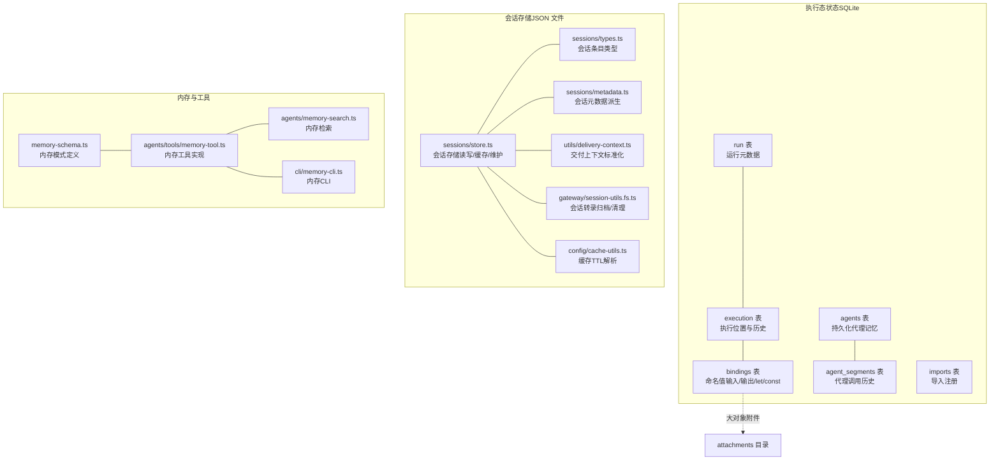
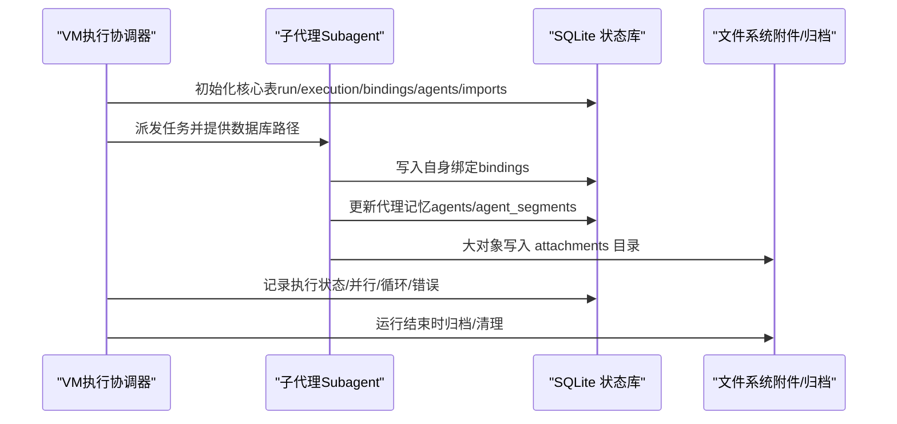
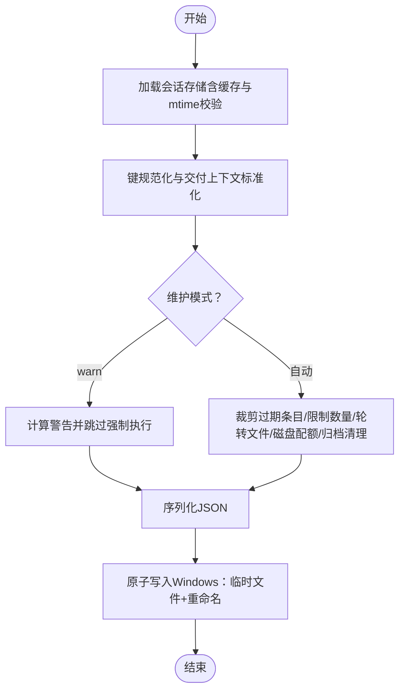
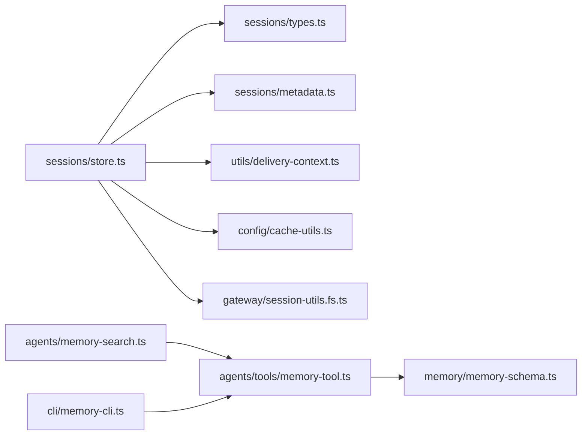
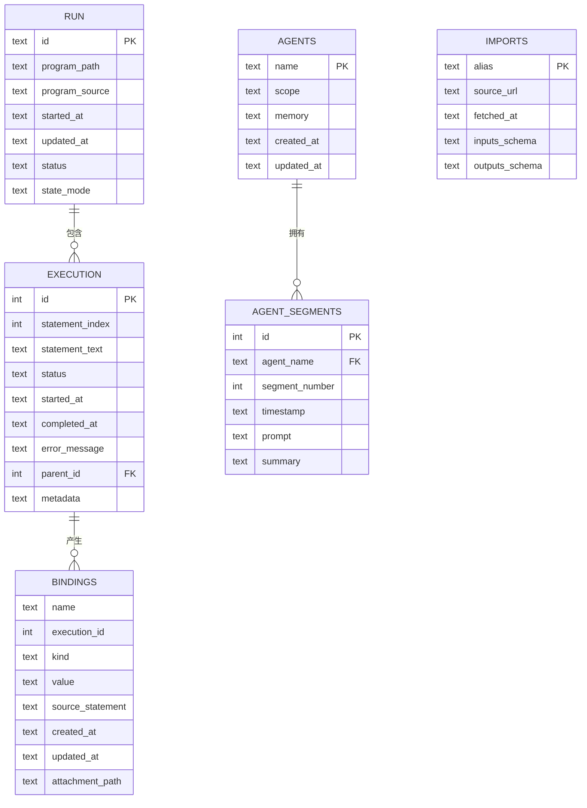

# 数据模型与Schema

<cite>
**本文引用的文件**
- [extensions/open-prose/skills/prose/state/sqlite.md](file://extensions/open-prose/skills/prose/state/sqlite.md)
- [src/config/sessions/store.ts](file://src/config/sessions/store.ts)
- [src/memory/memory-schema.ts](file://src/memory/memory-schema.ts)
- [dist/plugin-sdk/memory/memory-schema.d.ts](file://dist/plugin-sdk/memory/memory-schema.d.ts)
- [src/config/sessions/types.ts](file://src/config/sessions/types.ts)
- [src/config/sessions/metadata.ts](file://src/config/sessions/metadata.ts)
- [src/config/cache-utils.ts](file://src/config/cache-utils.ts)
- [src/gateway/session-utils.fs.ts](file://src/gateway/session-utils.fs.ts)
- [src/utils/delivery-context.ts](file://src/utils/delivery-context.ts)
- [src/agents/tools/memory-tool.ts](file://src/agents/tools/memory-tool.ts)
- [src/agents/memory-search.ts](file://src/agents/memory-search.ts)
- [src/cli/memory-cli.ts](file://src/cli/memory-cli.ts)
</cite>

## 目录

1. [简介](#简介)
2. [项目结构](#项目结构)
3. [核心组件](#核心组件)
4. [架构总览](#架构总览)
5. [详细组件分析](#详细组件分析)
6. [依赖分析](#依赖分析)
7. [性能考虑](#性能考虑)
8. [故障排查指南](#故障排查指南)
9. [结论](#结论)
10. [附录](#附录)

## 简介

本文件系统性梳理 OpenClaw 的数据模型与 Schema，覆盖以下方面：

- 数据实体关系、字段定义与数据类型
- 主键/外键、索引与约束
- 数据验证规则、业务规则与数据转换
- 数据库模式图与示例数据
- 数据访问模式、缓存策略与性能优化
- 数据生命周期、保留策略与归档规则
- 数据迁移路径与版本管理
- 数据安全、隐私与访问控制

## 项目结构

围绕数据模型与Schema的关键目录与文件：

- 执行态状态（SQLite）：OpenProse 技能的状态持久化方案
- 会话存储（JSON 文件）：会话记录的本地持久化与维护
- 内存工具与内存模式：面向代理的记忆能力与模式定义
- 配置与工具：会话类型、元数据、交付上下文、缓存与归档工具

图表来源

- [extensions/open-prose/skills/prose/state/sqlite.md](file://extensions/open-prose/skills/prose/state/sqlite.md#L158-L228)
- [src/config/sessions/store.ts](file://src/config/sessions/store.ts#L1-L800)
- [src/memory/memory-schema.ts](file://src/memory/memory-schema.ts)
- [src/config/sessions/types.ts](file://src/config/sessions/types.ts)
- [src/config/sessions/metadata.ts](file://src/config/sessions/metadata.ts)
- [src/utils/delivery-context.ts](file://src/utils/delivery-context.ts)
- [src/gateway/session-utils.fs.ts](file://src/gateway/session-utils.fs.ts)
- [src/config/cache-utils.ts](file://src/config/cache-utils.ts)
- [src/agents/tools/memory-tool.ts](file://src/agents/tools/memory-tool.ts)
- [src/agents/memory-search.ts](file://src/agents/memory-search.ts)
- [src/cli/memory-cli.ts](file://src/cli/memory-cli.ts)

章节来源

- [extensions/open-prose/skills/prose/state/sqlite.md](file://extensions/open-prose/skills/prose/state/sqlite.md#L1-L575)
- [src/config/sessions/store.ts](file://src/config/sessions/store.ts#L1-L800)

## 核心组件

- 执行态状态（SQLite）
  - run：运行元数据，包含程序路径、源码、时间戳、状态等
  - execution：执行位置与历史，支持并行/循环/错误聚合
  - bindings：命名值（输入/输出/let/const），支持作用域与大对象附件
  - agents/agent_segments：持久化代理记忆与其调用历史
  - imports：导入注册（别名、来源、输入/输出模式）

- 会话存储（JSON 文件）
  - 以 JSON 文件持久化会话记录，支持缓存、TTL、裁剪、限额、轮转与归档
  - 提供维护模式（warn/自动）与磁盘配额强制

- 内存模式与工具
  - 定义内存模式（如向量嵌入、分段、检索策略）
  - 实现内存工具（写入/更新/检索/清理）、CLI 与检索接口

章节来源

- [extensions/open-prose/skills/prose/state/sqlite.md](file://extensions/open-prose/skills/prose/state/sqlite.md#L158-L228)
- [src/config/sessions/store.ts](file://src/config/sessions/store.ts#L198-L284)
- [src/memory/memory-schema.ts](file://src/memory/memory-schema.ts)

## 架构总览

下图展示数据在系统中的流向与职责分离：

图表来源

- [extensions/open-prose/skills/prose/state/sqlite.md](file://extensions/open-prose/skills/prose/state/sqlite.md#L88-L155)
- [extensions/open-prose/skills/prose/state/sqlite.md](file://extensions/open-prose/skills/prose/state/sqlite.md#L278-L374)

## 详细组件分析

### 组件A：执行态状态（SQLite）

- 实体与关系
  - run：单行记录，主键为运行ID
  - execution：自增主键；parent_id 外键指向自身，形成执行树
  - bindings：复合主键（name, execution_id），execution_id 可为空（根作用域）
  - agents：主键 name；agent_segments：外键 agents.name
  - imports：主键 alias

- 字段与类型（基于文档）
  - run：id（文本）、program_path（文本）、program_source（文本）、started_at/updated_at（文本，ISO 8601）、status（文本枚举）、state_mode（文本）
  - execution：id（整数，自增）、statement_index（整数）、statement_text（文本）、status（文本枚举）、started_at/completed_at（文本）、error_message（文本）、parent_id（整数，外键）、metadata（文本，JSON）
  - bindings：name（文本）、execution_id（整数，可空）、kind（文本枚举）、value（文本）、source_statement（文本）、created_at/updated_at（文本）、attachment_path（文本）
  - agents：name（文本，主键）、scope（文本枚举）、memory（文本）、created_at/updated_at（文本）
  - agent_segments：id（整数，自增）、agent_name（文本，外键）、segment_number（整数）、timestamp（文本）、prompt（文本）、summary（文本）
  - imports：alias（文本，主键）、source_url（文本）、fetched_at（文本）、inputs_schema/outputs_schema（文本，JSON）

- 约束与索引
  - 主键/外键：见上
  - 约束：UNIQUE(agent_name, segment_number)
  - 建议索引：execution(status)、bindings(name)、bindings(execution_id)、agent_segments(agent_name)

- 数据验证与业务规则
  - 作用域解析：通过 execution.parent_id 递归向上查找绑定
  - 匿名绑定：未显式捕获的会话使用 anon_001 等命名
  - 导入绑定：使用别名前缀进行命名空间隔离
  - 大对象：超过阈值（约100KB）写入 attachments 并记录路径
  - 并行/循环/错误：通过 metadata JSON 字段承载状态，由 VM 统一维护

- 示例数据（概念性）
  - run：id="20260116-143052-a7b3c9"，status="running"
  - execution：id=1，statement_index=3，status="executing"，metadata='{"parallel_id":"p1","branch":"a"}'
  - bindings：name="research"，execution_id=NULL，kind="let"，attachment_path="attachments/research.md"
  - agents：name="captain"，scope="execution"，memory="{...}"
  - agent_segments：agent_name="captain"，segment_number=1，prompt="...", summary="..."

- 数据访问模式
  - VM 负责初始化与写入 execution；子代理仅写入 bindings/agents/agent_segments
  - 使用事务保证多记录原子更新
  - 通过 JSON 函数查询 metadata 字段（并行/循环/重试）

- 性能与扩展
  - 支持按查询模式添加索引
  - 允许扩展表（x\_ 前缀）与列
  - 推荐运行结束时执行清理（如 VACUUM）

章节来源

- [extensions/open-prose/skills/prose/state/sqlite.md](file://extensions/open-prose/skills/prose/state/sqlite.md#L158-L228)
- [extensions/open-prose/skills/prose/state/sqlite.md](file://extensions/open-prose/skills/prose/state/sqlite.md#L240-L274)
- [extensions/open-prose/skills/prose/state/sqlite.md](file://extensions/open-prose/skills/prose/state/sqlite.md#L406-L446)
- [extensions/open-prose/skills/prose/state/sqlite.md](file://extensions/open-prose/skills/prose/state/sqlite.md#L468-L485)
- [extensions/open-prose/skills/prose/state/sqlite.md](file://extensions/open-prose/skills/prose/state/sqlite.md#L515-L541)

### 组件B：会话存储（JSON 文件）

- 实体与关系
  - 会话存储为单一 JSON 文件，键为会话标识，值为会话条目
  - 条目包含交付上下文、通道/账号/线程信息、运行时模型字段、更新时间等

- 字段与类型（基于实现）
  - 会话键：字符串（大小写归一化、兼容旧键）
  - 会话条目：包含 channel/lastChannel、lastTo/lastAccountId/lastThreadId、deliveryContext、runtime 模型字段、updatedAt 等
  - 维护配置：pruneAfterMs、maxEntries、rotateBytes、mode（warn/自动）、maxDiskBytes、highWaterBytes

- 约束与索引
  - 无数据库层约束；通过代码逻辑保证一致性

- 数据验证与业务规则
  - 键规范化：trim + lowercase
  - 交付上下文标准化：统一 channel/to/accountId/threadId
  - 迁移：provider → channel、lastProvider → lastChannel、room → groupChannel
  - 维护：按时间戳裁剪过期条目；限制最大条目数；文件大小轮转；磁盘配额强制；归档/清理历史会话转录

- 数据访问模式
  - 缓存：TTL 控制，mtime 校验，避免并发读取空文件
  - 写入：Windows 使用临时文件 + 重命名实现原子写入
  - 维护：保存前执行裁剪/轮转/归档/清理

- 生命周期与保留策略
  - 过期删除：updatedAt 超过 pruneAfterMs
  - 数量上限：超过 maxEntries 按 updatedAt 降序保留最新条目
  - 文件轮转：超过 rotateBytes 自动备份并清理旧备份
  - 归档与清理：删除或重置归档时清理过期归档

- 迁移与版本管理
  - 结构演进：键规范化、字段迁移（provider→channel、room→groupChannel）
  - 维护模式：warn 仅告警不强制，自动模式执行裁剪/轮转/归档

- 安全与访问控制
  - 本地文件权限控制
  - 通过维护模式与磁盘配额降低风险

图表来源

- [src/config/sessions/store.ts](file://src/config/sessions/store.ts#L198-L284)
- [src/config/sessions/store.ts](file://src/config/sessions/store.ts#L642-L800)
- [src/config/sessions/store.ts](file://src/config/sessions/store.ts#L575-L627)

章节来源

- [src/config/sessions/store.ts](file://src/config/sessions/store.ts#L198-L284)
- [src/config/sessions/store.ts](file://src/config/sessions/store.ts#L303-L448)
- [src/config/sessions/store.ts](file://src/config/sessions/store.ts#L575-L627)
- [src/config/sessions/store.ts](file://src/config/sessions/store.ts#L642-L800)
- [src/config/sessions/types.ts](file://src/config/sessions/types.ts)
- [src/config/sessions/metadata.ts](file://src/config/sessions/metadata.ts)
- [src/utils/delivery-context.ts](file://src/utils/delivery-context.ts)
- [src/gateway/session-utils.fs.ts](file://src/gateway/session-utils.fs.ts)
- [src/config/cache-utils.ts](file://src/config/cache-utils.ts)

### 组件C：内存模式与工具

- 内存模式
  - 定义向量化/分段/检索策略等模式（类型定义位于 SDK 与源码中）
- 内存工具
  - 写入/更新/检索/清理内存
  - CLI 提供内存操作入口
  - 检索接口支持基于模式的查询

章节来源

- [src/memory/memory-schema.ts](file://src/memory/memory-schema.ts)
- [dist/plugin-sdk/memory/memory-schema.d.ts](file://dist/plugin-sdk/memory/memory-schema.d.ts)
- [src/agents/tools/memory-tool.ts](file://src/agents/tools/memory-tool.ts)
- [src/agents/memory-search.ts](file://src/agents/memory-search.ts)
- [src/cli/memory-cli.ts](file://src/cli/memory-cli.ts)

## 依赖分析

- 执行态状态（SQLite）与会话存储的耦合度低，分别服务于“执行态”和“会话持久化”
- 会话存储内部依赖：
  - 类型定义与元数据派生
  - 交付上下文标准化
  - 缓存TTL解析
  - 归档/清理工具
- 内存工具与内存模式相互依赖，支撑代理记忆能力

图表来源

- [src/config/sessions/store.ts](file://src/config/sessions/store.ts#L1-L800)
- [src/config/sessions/types.ts](file://src/config/sessions/types.ts)
- [src/config/sessions/metadata.ts](file://src/config/sessions/metadata.ts)
- [src/utils/delivery-context.ts](file://src/utils/delivery-context.ts)
- [src/config/cache-utils.ts](file://src/config/cache-utils.ts)
- [src/gateway/session-utils.fs.ts](file://src/gateway/session-utils.fs.ts)
- [src/memory/memory-schema.ts](file://src/memory/memory-schema.ts)
- [src/agents/tools/memory-tool.ts](file://src/agents/tools/memory-tool.ts)
- [src/agents/memory-search.ts](file://src/agents/memory-search.ts)
- [src/cli/memory-cli.ts](file://src/cli/memory-cli.ts)

章节来源

- [src/config/sessions/store.ts](file://src/config/sessions/store.ts#L1-L800)

## 性能考虑

- SQLite 执行态
  - 建议针对高频查询添加索引（如 execution(status)、bindings(name)、bindings(execution_id)）
  - 使用事务批量更新，减少锁竞争
  - 大对象走附件目录，避免膨胀数据库
- 会话存储
  - 启用缓存并合理设置 TTL，减少磁盘 IO
  - Windows 使用临时文件+重命名确保原子写入，避免并发读到空文件
  - 文件轮转与归档清理降低磁盘占用
- 内存工具
  - 检索前先做预过滤，减少向量库压力
  - 分批写入与批量清理提升吞吐

## 故障排查指南

- SQLite 执行态
  - 作用域解析失败：检查 execution.parent_id 链是否正确，确认绑定作用域链优先级
  - 大对象缺失：确认 attachment_path 是否存在且可读
  - 并行/循环状态异常：检查 metadata JSON 字段是否完整
- 会话存储
  - 读取空文件：Windows 平台并发读取时可能遇到中间态，等待短暂重试后重试
  - 维护误删活跃会话：warn 模式仅告警，必要时调整维护策略
  - 归档/清理异常：检查归档目录权限与磁盘配额
- 内存工具
  - 写入失败：检查内存模式配置与向量库可用性
  - 检索结果异常：核对检索参数与分段策略

章节来源

- [extensions/open-prose/skills/prose/state/sqlite.md](file://extensions/open-prose/skills/prose/state/sqlite.md#L240-L274)
- [src/config/sessions/store.ts](file://src/config/sessions/store.ts#L215-L247)
- [src/config/sessions/store.ts](file://src/config/sessions/store.ts#L658-L694)

## 结论

- OpenClaw 在不同层面采用多种数据持久化方式：SQLite 执行态、JSON 会话存储、内存工具与模式
- 通过明确的职责分离与可扩展的模式，系统在灵活性与可维护性之间取得平衡
- 建议在生产环境中结合索引、缓存、轮转与归档策略，持续监控磁盘与性能指标

## 附录

- 数据库模式图（概念性）

图表来源

- [extensions/open-prose/skills/prose/state/sqlite.md](file://extensions/open-prose/skills/prose/state/sqlite.md#L158-L228)
