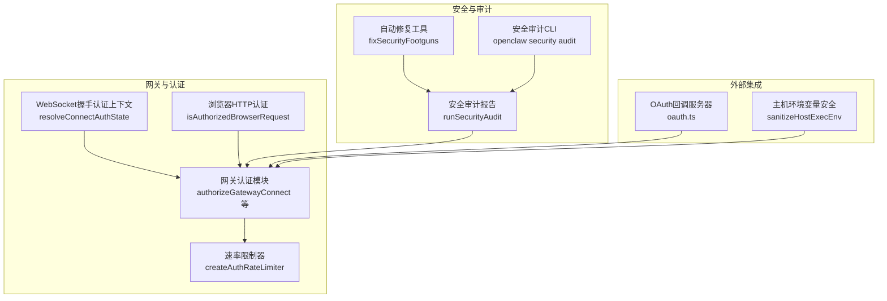
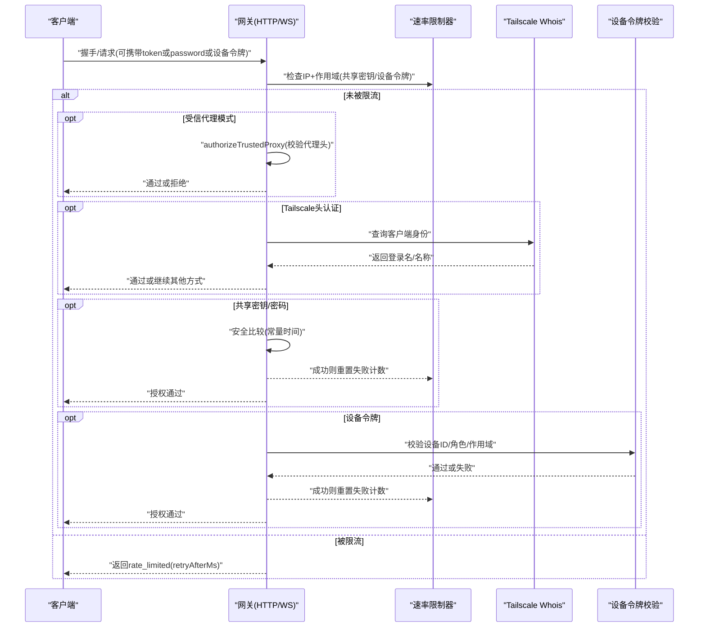
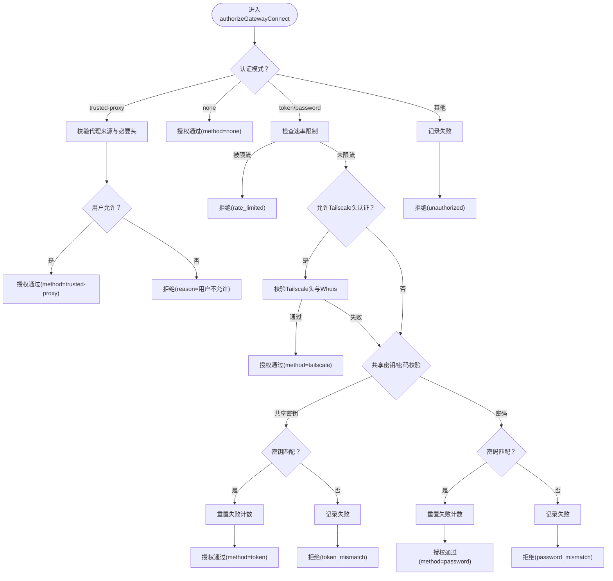
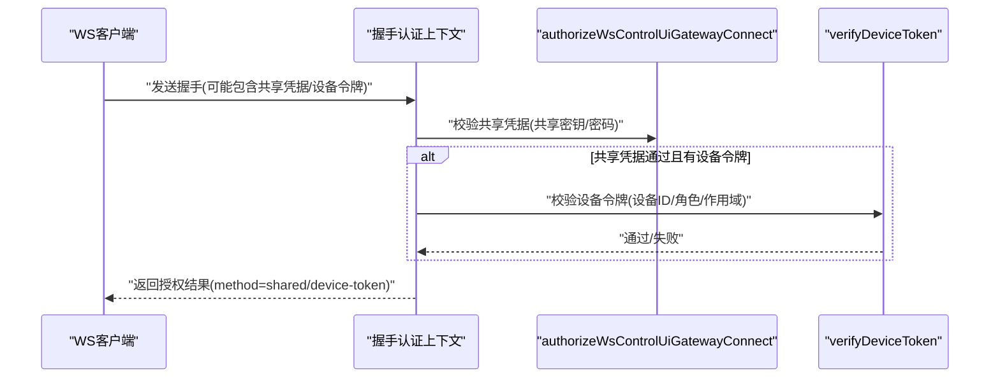
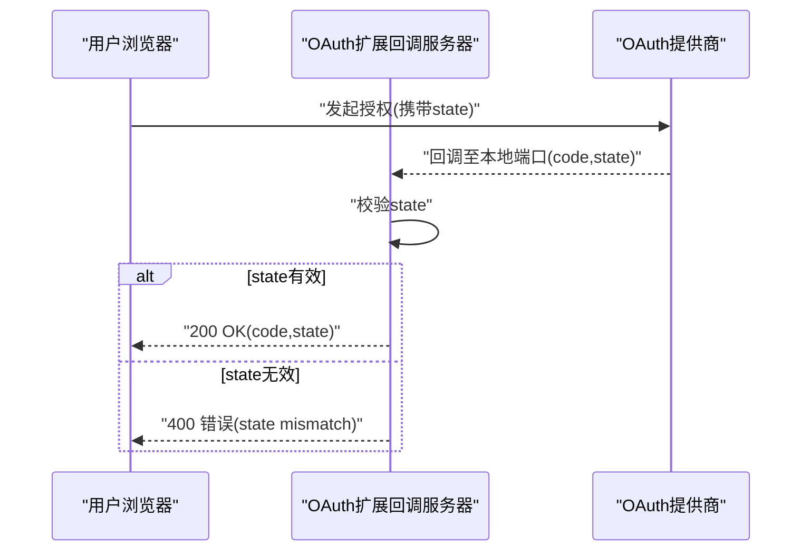
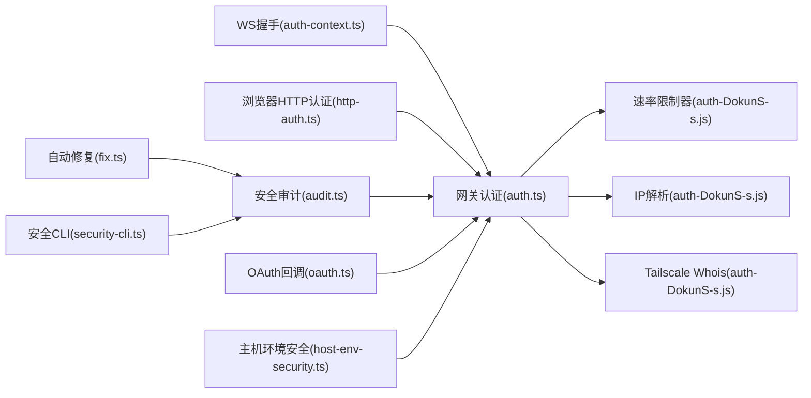

# 认证与授权API

<cite>
**本文引用的文件**
- [dist/auth-DokunS-s.js](file://dist/auth-DokunS-s.js)
- [dist/auth-ML-4Xoce.js](file://dist/auth-ML-4Xoce.js)
- [dist/plugin-sdk/gateway/auth.d.ts](file://dist/plugin-sdk/gateway/auth.d.ts)
- [src/gateway/auth.ts](file://src/gateway/auth.ts)
- [src/gateway/server/ws-connection/auth-context.ts](file://src/gateway/server/ws-connection/auth-context.ts)
- [src/browser/http-auth.ts](file://src/browser/http-auth.ts)
- [src/agents/api-key-rotation.ts](file://src/agents/api-key-rotation.ts)
- [src/utils/mask-api-key.ts](file://src/utils/mask-api-key.ts)
- [src/security/audit.ts](file://src/security/audit.ts)
- [src/security/fix.ts](file://src/security/fix.ts)
- [src/cli/security-cli.ts](file://src/cli/security-cli.ts)
- [src/infra/host-env-security.ts](file://src/infra/host-env-security.ts)
- [extensions/google-gemini-cli-auth/oauth.ts](file://extensions/google-gemini-cli-auth/oauth.ts)
- [src/gateway/server-methods/devices.ts](file://src/gateway/server-methods/devices.ts)
- [src/daemon/service-audit.ts](file://src/daemon/service-audit.ts)
</cite>

## 目录

1. [简介](#简介)
2. [项目结构](#项目结构)
3. [核心组件](#核心组件)
4. [架构总览](#架构总览)
5. [详细组件分析](#详细组件分析)
6. [依赖关系分析](#依赖关系分析)
7. [性能考量](#性能考量)
8. [故障排查指南](#故障排查指南)
9. [结论](#结论)
10. [附录](#附录)

## 简介

本文件面向OpenClaw认证与授权API，聚焦以下目标：

- 阐述认证机制（共享密钥、密码、受信代理、设备令牌、Tailscale头认证）与授权控制策略
- 说明OAuth流程、API密钥管理与轮换、会话与设备令牌生命周期
- 提供认证端点与握手参数的请求/响应模型、错误码与重试策略
- 给出JWT令牌处理、权限验证与访问控制的实现要点与最佳实践
- 汇总安全配置项、性能优化与监控建议，帮助API使用者构建安全可靠的认证体系

## 项目结构

OpenClaw在“网关层”集中实现认证与授权，配套“安全审计CLI”“主机环境变量安全”“OAuth扩展”等模块，形成从配置到运行时校验、从本地审计到远端探测的闭环。

图表来源

- [dist/auth-DokunS-s.js](file://dist/auth-DokunS-s.js#L143-L447)
- [src/gateway/server/ws-connection/auth-context.ts](file://src/gateway/server/ws-connection/auth-context.ts#L75-L218)
- [src/browser/http-auth.ts](file://src/browser/http-auth.ts#L1-L48)
- [src/security/audit.ts](file://src/security/audit.ts#L1-L800)
- [src/security/fix.ts](file://src/security/fix.ts#L1-L478)
- [src/cli/security-cli.ts](file://src/cli/security-cli.ts#L30-L164)
- [extensions/google-gemini-cli-auth/oauth.ts](file://extensions/google-gemini-cli-auth/oauth.ts#L312-L350)
- [src/infra/host-env-security.ts](file://src/infra/host-env-security.ts#L74-L149)

章节来源

- [dist/auth-DokunS-s.js](file://dist/auth-DokunS-s.js#L143-L447)
- [src/security/audit.ts](file://src/security/audit.ts#L262-L551)

## 核心组件

- 网关认证与授权
  - 支持模式：无认证、共享密钥(token)、密码(password)、受信代理(trusted-proxy)、设备令牌(device-token)、Tailscale头认证(tailscale)
  - 关键函数：authorizeGatewayConnect、authorizeHttpGatewayConnect、authorizeWsControlUiGatewayConnect
  - 速率限制：createAuthRateLimiter，按{作用域, 客户端IP}滑动窗口计数
- WebSocket握手认证上下文
  - resolveConnectAuthState：整合共享凭据与设备令牌，分别进行速率限制与校验
- 浏览器HTTP认证
  - isAuthorizedBrowserRequest：支持Bearer Token与Basic Password
- 安全审计与修复
  - runSecurityAudit：生成安全审计报告，含网关暴露面、鉴权缺失、速率限制缺失、受信代理配置等问题
  - fixSecurityFootguns：自动收紧权限与默认策略
  - openclaw security audit CLI：命令行入口
- 主机环境变量安全
  - sanitizeHostExecEnv/sanitizeSystemRunEnvOverrides：阻断危险环境变量注入
- OAuth流程
  - 扩展中的oauth.ts：内置OAuth回调服务器，处理state校验与错误返回
- 设备令牌与API密钥
  - 设备令牌轮换/吊销接口：device.token.rotate/device.token.revoke
  - API密钥轮换：executeWithApiKeyRotation，按提供商聚合多密钥并轮询重试

章节来源

- [dist/plugin-sdk/gateway/auth.d.ts](file://dist/plugin-sdk/gateway/auth.d.ts#L1-L63)
- [dist/auth-DokunS-s.js](file://dist/auth-DokunS-s.js#L39-L140)
- [src/gateway/auth.ts](file://src/gateway/auth.ts#L434-L487)
- [src/gateway/server/ws-connection/auth-context.ts](file://src/gateway/server/ws-connection/auth-context.ts#L75-L218)
- [src/browser/http-auth.ts](file://src/browser/http-auth.ts#L1-L48)
- [src/security/audit.ts](file://src/security/audit.ts#L1-L800)
- [src/security/fix.ts](file://src/security/fix.ts#L1-L478)
- [src/cli/security-cli.ts](file://src/cli/security-cli.ts#L30-L164)
- [src/infra/host-env-security.ts](file://src/infra/host-env-security.ts#L74-L149)
- [extensions/google-gemini-cli-auth/oauth.ts](file://extensions/google-gemini-cli-auth/oauth.ts#L312-L350)
- [src/gateway/server-methods/devices.ts](file://src/gateway/server-methods/devices.ts#L157-L204)
- [src/agents/api-key-rotation.ts](file://src/agents/api-key-rotation.ts#L1-L46)

## 架构总览

下图展示从客户端到网关认证与授权的整体流程，包括共享密钥/密码、设备令牌、受信代理与速率限制协同工作的方式。

图表来源

- [dist/auth-DokunS-s.js](file://dist/auth-DokunS-s.js#L318-L433)
- [src/gateway/server/ws-connection/auth-context.ts](file://src/gateway/server/ws-connection/auth-context.ts#L75-L218)

## 详细组件分析

### 网关认证与授权（HTTP/WS）

- 模式解析与断言
  - resolveGatewayAuth：根据配置与环境解析最终认证模式（优先级：显式覆盖 > 配置 > 密码 > 令牌 > 默认）
  - assertGatewayAuthConfigured：确保配置合法（如令牌/密码/受信代理配置完整）
- 授权主流程
  - authorizeGatewayConnect：统一处理受信代理、速率限制、Tailscale头认证、共享密钥/密码、设备令牌
  - authorizeHttpGatewayConnect/authorizeWsControlUiGatewayConnect：按表面类型启用不同策略（WS控制UI允许Tailscale头认证）
- 速率限制
  - createAuthRateLimiter：内存Map存储，滑动窗口+锁定；支持作用域区分（共享密钥、设备令牌、Hook）
  - normalizeRateLimitClientIp：标准化客户端IP（含IPv4映射IPv6）
- 客户端IP解析
  - resolveRequestClientIp/resolveTailscaleClientIp：支持X-Forwarded-For/X-Real-IP/Trusted Proxies
  - isLocalDirectRequest：判断是否本地直连，绕过某些校验
- Tailscale头认证
  - getTailscaleUser/resolveVerifiedTailscaleUser：校验头中用户与Whois结果一致性
- 受信代理认证
  - authorizeTrustedProxy：校验必填头、用户白名单等

图表来源

- [dist/auth-DokunS-s.js](file://dist/auth-DokunS-s.js#L318-L433)
- [src/gateway/auth.ts](file://src/gateway/auth.ts#L434-L487)

章节来源

- [dist/auth-DokunS-s.js](file://dist/auth-DokunS-s.js#L143-L447)
- [src/gateway/auth.ts](file://src/gateway/auth.ts#L434-L487)

### WebSocket握手认证上下文

- 合并共享凭据与设备令牌候选
- 分别对共享密钥/密码与设备令牌应用速率限制
- 若设备令牌通过，则以设备令牌为准；否则沿用共享凭据的授权结果

图表来源

- [src/gateway/server/ws-connection/auth-context.ts](file://src/gateway/server/ws-connection/auth-context.ts#L75-L218)

章节来源

- [src/gateway/server/ws-connection/auth-context.ts](file://src/gateway/server/ws-connection/auth-context.ts#L75-L218)

### 浏览器HTTP认证

- 支持Authorization头：
  - Bearer <token>：用于Bearer Token认证
  - Basic <base64("user:password")>：用于Basic Password认证
- 使用常量时间比较避免时序攻击

章节来源

- [src/browser/http-auth.ts](file://src/browser/http-auth.ts#L1-L48)

### OAuth流程（以Google Gemini为例）

- 内置回调服务器监听本地端口，接收授权码与状态
- 校验state一致性，错误时返回400并结束
- 成功后返回code与state，供后续换取令牌

图表来源

- [extensions/google-gemini-cli-auth/oauth.ts](file://extensions/google-gemini-cli-auth/oauth.ts#L312-L350)

章节来源

- [extensions/google-gemini-cli-auth/oauth.ts](file://extensions/google-gemini-cli-auth/oauth.ts#L312-L350)

### API密钥管理与轮换

- 多密钥去重与聚合
- 按提供商收集密钥，执行时轮询重试
- 自定义重试条件与回调钩子

章节来源

- [src/agents/api-key-rotation.ts](file://src/agents/api-key-rotation.ts#L1-L46)

### 设备令牌管理

- 轮换：device.token.rotate
- 吊销：device.token.revoke
- 返回新令牌与元数据，便于客户端更新

章节来源

- [src/gateway/server-methods/devices.ts](file://src/gateway/server-methods/devices.ts#L157-L204)

### 安全审计与修复

- 审计范围：网关绑定与鉴权、受信代理、Control UI跨域策略、mDNS暴露、速率限制、危险配置标志等
- 报告字段：severity、title、detail、remediation
- 修复能力：收紧文件权限、默认策略调整、写回配置（在安全范围内）

章节来源

- [src/security/audit.ts](file://src/security/audit.ts#L1-L800)
- [src/security/fix.ts](file://src/security/fix.ts#L1-L478)
- [src/cli/security-cli.ts](file://src/cli/security-cli.ts#L30-L164)

### 主机环境变量安全

- 阻断危险键值与前缀
- 过滤PATH等敏感变量的请求级覆盖
- Shell包装器仅允许白名单变量

章节来源

- [src/infra/host-env-security.ts](file://src/infra/host-env-security.ts#L74-L149)

## 依赖关系分析

- 网关认证模块依赖速率限制器、IP解析、Tailscale Whois、凭据解析
- WebSocket握手认证上下文依赖网关认证与设备令牌校验
- 安全审计CLI依赖审计与修复模块
- OAuth扩展与网关认证解耦，通过回调端口与状态校验对接

图表来源

- [src/gateway/auth.ts](file://src/gateway/auth.ts#L434-L487)
- [dist/auth-DokunS-s.js](file://dist/auth-DokunS-s.js#L39-L140)
- [src/gateway/server/ws-connection/auth-context.ts](file://src/gateway/server/ws-connection/auth-context.ts#L75-L218)
- [src/browser/http-auth.ts](file://src/browser/http-auth.ts#L1-L48)
- [src/security/audit.ts](file://src/security/audit.ts#L1-L800)
- [src/security/fix.ts](file://src/security/fix.ts#L1-L478)
- [src/cli/security-cli.ts](file://src/cli/security-cli.ts#L30-L164)
- [extensions/google-gemini-cli-auth/oauth.ts](file://extensions/google-gemini-cli-auth/oauth.ts#L312-L350)
- [src/infra/host-env-security.ts](file://src/infra/host-env-security.ts#L74-L149)

章节来源

- [dist/auth-DokunS-s.js](file://dist/auth-DokunS-s.js#L143-L447)
- [src/gateway/auth.ts](file://src/gateway/auth.ts#L434-L487)

## 性能考量

- 速率限制
  - 滑动窗口+锁定，避免暴力破解；合理设置maxAttempts/windowMs/lockoutMs
  - 作用域隔离：共享密钥与设备令牌分别计数
- 常量时间比较
  - 使用安全比较函数，降低时序侧信道风险
- IP解析与缓存
  - 在高并发场景建议结合反向代理日志与可信代理列表，减少重复Whois查询
- 审计与修复
  - 定期运行安全审计，自动修复默认策略与权限，降低运行时开销与风险

[本节为通用指导，无需特定文件引用]

## 故障排查指南

- 常见原因与定位
  - 速率限制触发：检查retryAfterMs与作用域；确认IP解析是否正确
  - 受信代理配置缺失：核对trustedProxies与userHeader
  - Tailscale头认证失败：确认代理来源与头部完整性
  - 共享密钥/密码不匹配：确认凭据来源优先级与配置
  - 设备令牌校验失败：核对设备ID、角色与作用域
- 审计与修复
  - 使用openclaw security audit查看严重性汇总与修复建议
  - 使用--fix自动收紧权限与默认策略
- 服务配置漂移检测
  - 检查服务令牌与配置令牌是否一致，避免重启后使用旧令牌

章节来源

- [src/security/audit.ts](file://src/security/audit.ts#L1-L800)
- [src/security/fix.ts](file://src/security/fix.ts#L1-L478)
- [src/cli/security-cli.ts](file://src/cli/security-cli.ts#L30-L164)
- [src/daemon/service-audit.ts](file://src/daemon/service-audit.ts#L359-L368)

## 结论

OpenClaw认证与授权API通过“多模式认证+速率限制+受信代理+设备令牌+Tailscale头认证”的组合，在保证易用性的同时提供了强健的安全边界。配合安全审计CLI与自动修复工具，可显著降低部署风险。建议在生产环境中启用速率限制、严格控制受信代理与跨域策略，并定期轮换令牌与密钥。

[本节为总结性内容，无需特定文件引用]

## 附录

### 认证端点与握手参数（请求/响应模型）

- 共享密钥/密码
  - 请求：在握手或HTTP Authorization头中提供token或password
  - 响应：授权通过或拒绝，可能包含rateLimited与retryAfterMs
- 设备令牌
  - 请求：在握手参数中提供设备令牌
  - 响应：授权通过或拒绝，可能包含rateLimited与retryAfterMs
- 受信代理
  - 请求：来自受信代理的必要头部
  - 响应：授权通过或拒绝，包含reason
- Tailscale头认证
  - 请求：携带Tailscale用户头
  - 响应：授权通过或拒绝，包含reason

章节来源

- [dist/plugin-sdk/gateway/auth.d.ts](file://dist/plugin-sdk/gateway/auth.d.ts#L15-L61)
- [dist/auth-DokunS-s.js](file://dist/auth-DokunS-s.js#L318-L433)

### JWT令牌处理与权限验证

- 令牌格式
  - Bearer Token：Authorization: Bearer <token>
  - Basic Password：Authorization: Basic <base64("user:password")>
- 权限验证
  - 使用常量时间比较避免时序攻击
  - 对设备令牌进行设备ID/角色/作用域校验
- 最佳实践
  - 令牌长度与随机性：建议长随机令牌
  - 速率限制：对共享密钥与设备令牌分别限流
  - 跨域与代理：严格配置allowedOrigins与trustedProxies

章节来源

- [src/browser/http-auth.ts](file://src/browser/http-auth.ts#L1-L48)
- [src/gateway/server/ws-connection/auth-context.ts](file://src/gateway/server/ws-connection/auth-context.ts#L75-L218)

### 安全配置项与合规要求

- 网关绑定与鉴权
  - 非loopback绑定需配置共享密钥或受信代理
  - Control UI跨域需明确allowedOrigins
- 受信代理
  - 必须配置trustedProxies与userHeader
  - 可选allowUsers白名单
- 速率限制
  - 非loopback部署建议开启auth.rateLimit
- 危险配置
  - 禁止启用危险标志位；mDNS建议使用minimal或off
- 审计与修复
  - 定期运行openclaw security audit
  - 使用--fix自动收紧权限与默认策略

章节来源

- [src/security/audit.ts](file://src/security/audit.ts#L262-L551)
- [src/cli/security-cli.ts](file://src/cli/security-cli.ts#L30-L164)

### 性能优化与监控

- 性能优化
  - 合理设置速率限制参数，避免过度惩罚
  - 减少不必要的Tailscale Whois查询
  - 使用受信代理与标准化IP解析
- 监控
  - 观察rate_limited与retryAfterMs指标
  - 审计报告severity分布趋势
  - 设备令牌轮换与吊销操作日志

[本节为通用指导，无需特定文件引用]
