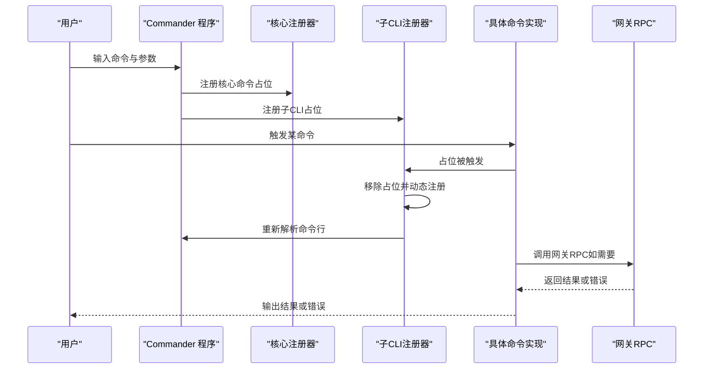
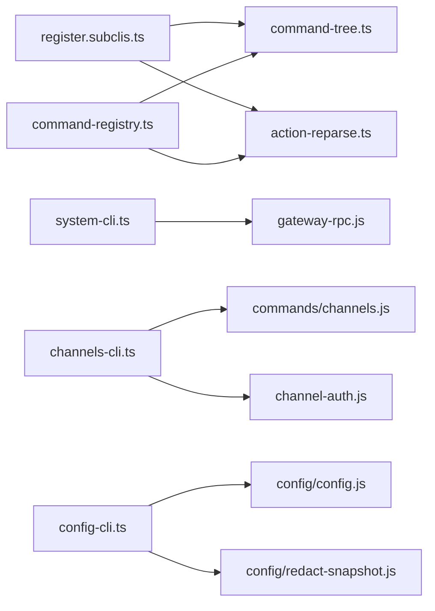

# CLI命令参考

<cite>
**本文引用的文件**
- [src/cli/program/register.subclis.ts](file://src/cli/program/register.subclis.ts)
- [src/cli/program/command-registry.ts](file://src/cli/program/command-registry.ts)
- [src/cli/config-cli.ts](file://src/cli/config-cli.ts)
- [src/cli/system-cli.ts](file://src/cli/system-cli.ts)
- [src/cli/channels-cli.ts](file://src/cli/channels-cli.ts)
- [src/cli/gateway-cli.ts](file://src/cli/gateway-cli.ts)
- [src/cli/daemon-cli.ts](file://src/cli/daemon-cli.ts)
- [src/cli/logs-cli.ts](file://src/cli/logs-cli.ts)
- [src/cli/models-cli.ts](file://src/cli/models-cli.ts)
- [src/cli/exec-approvals-cli.ts](file://src/cli/exec-approvals-cli.ts)
- [src/cli/nodes-cli.ts](file://src/cli/nodes-cli.ts)
- [src/cli/devices-cli.ts](file://src/cli/devices-cli.ts)
- [src/cli/node-cli.ts](file://src/cli/node-cli.ts)
- [src/cli/sandbox-cli.ts](file://src/cli/sandbox-cli.ts)
- [src/cli/tui-cli.ts](file://src/cli/tui-cli.ts)
- [src/cli/cron-cli.ts](file://src/cli/cron-cli.ts)
- [src/cli/dns-cli.ts](file://src/cli/dns-cli.ts)
- [src/cli/docs-cli.ts](file://src/cli/docs-cli.ts)
- [src/cli/hooks-cli.ts](file://src/cli/hooks-cli.ts)
- [src/cli/webhooks-cli.ts](file://src/cli/webhooks-cli.ts)
- [src/cli/qr-cli.ts](file://src/cli/qr-cli.ts)
- [src/cli/clawbot-cli.ts](file://src/cli/clawbot-cli.ts)
- [src/cli/pairing-cli.ts](file://src/cli/pairing-cli.ts)
- [src/cli/plugins-cli.ts](file://src/cli/plugins-cli.ts)
- [src/cli/directory-cli.ts](file://src/cli/directory-cli.ts)
- [src/cli/security-cli.ts](file://src/cli/security-cli.ts)
- [src/cli/secrets-cli.ts](file://src/cli/secrets-cli.ts)
- [src/cli/skills-cli.ts](file://src/cli/skills-cli.ts)
- [src/cli/update-cli.ts](file://src/cli/update-cli.ts)
- [src/cli/completion-cli.ts](file://src/cli/completion-cli.ts)
- [src/cli/program/action-reparse.ts](file://src/cli/program/action-reparse.ts)
- [src/cli/program/command-tree.ts](file://src/cli/program/command-tree.ts)
- [src/cli/argv.js](file://src/cli/argv.js)
- [src/cli/gateway-rpc.js](file://src/cli/gateway-rpc.js)
- [src/cli/channel-auth.js](file://src/cli/channel-auth.js)
- [src/cli/channel-options.js](file://src/cli/channel-options.js)
- [src/cli/help-format.js](file://src/cli/help-format.js)
- [src/cli/cli-utils.js](file://src/cli/cli-utils.js)
- [src/cli/command-options.js](file://src/cli/command-options.js)
- [src/commands/channels.js](file://src/commands/channels.js)
- [src/config/config.js](file://src/config/config.js)
- [src/config/redact-snapshot.js](file://src/config/redact-snapshot.js)
- [src/runtime.js](file://src/runtime.js)
- [src/terminal/links.js](file://src/terminal/links.js)
- [src/terminal/theme.js](file://src/terminal/theme.js)
- [src/globals.js](file://src/globals.js)
- [src/utils.js](file://src/utils.js)
</cite>

## 目录

1. [简介](#简介)
2. [项目结构](#项目结构)
3. [核心组件](#核心组件)
4. [架构总览](#架构总览)
5. [详细组件分析](#详细组件分析)
6. [依赖关系分析](#依赖关系分析)
7. [性能与可扩展性](#性能与可扩展性)
8. [故障排除指南](#故障排除指南)
9. [结论](#结论)
10. [附录：命令速查与最佳实践](#附录命令速查与最佳实践)

## 简介

本参考文档面向OpenClaw命令行界面（CLI）用户与运维人员，系统梳理所有可用命令、参数、选项与使用示例，按功能分类组织为“配置管理”、“系统管理”、“频道操作”、“代理与节点控制”、“安全与审计”、“插件与扩展”、“其他工具”等类别。文档同时解释命令作用、适用场景、最佳实践、组合用法与自动化脚本模板，并提供高级调试与故障排除方法。

## 项目结构

OpenClaw CLI采用“核心命令 + 子CLI模块”的注册机制：

- 核心命令（如 config、doctor、status 等）由核心注册器集中管理，支持按需延迟加载。
- 子CLI（如 channels、system、models、plugins 等）通过子命令注册表统一注册，支持延迟与急切两种模式。
- 每个子CLI模块负责自身命令树的定义与实现，部分命令通过网关RPC或本地运行时执行。

```mermaid
graph TB
subgraph "程序入口"
P["Commander 程序实例"]
end
subgraph "注册器"
CR["核心命令注册器<br/>command-registry.ts"]
SR["子CLI注册器<br/>register.subclis.ts"]
end
subgraph "核心命令"
CFG["config 命令族"]
DOCTOR["doctor/dashboard/reset/uninstall"]
STATUS["status/health/sessions"]
MSG["message 命令族"]
MEM["memory 命令族"]
AG["agent/agents 命令族"]
end
subgraph "子CLI"
CH["channels"]
SYS["system"]
MOD["models"]
PLG["plugins"]
DEV["devices"]
NODE["node/nodes"]
GW["gateway/daemon"]
LOGS["logs"]
DNS["dns"]
CRON["cron"]
HOOKS["hooks"]
WEBHOOKS["webhooks"]
QR["qr"]
CLAW["clawbot"]
PAIR["pairing"]
DIR["directory"]
SEC["security"]
SECRETS["secrets"]
SKILLS["skills"]
UPDATE["update"]
COMPLETION["completion"]
end
P --> CR
P --> SR
CR --> CFG
CR --> DOCTOR
CR --> STATUS
CR --> MSG
CR --> MEM
CR --> AG
SR --> CH
SR --> SYS
SR --> MOD
SR --> PLG
SR --> DEV
SR --> NODE
SR --> GW
SR --> LOGS
SR --> DNS
SR --> CRON
SR --> HOOKS
SR --> WEBHOOKS
SR --> QR
SR --> CLAW
SR --> PAIR
SR --> DIR
SR --> SEC
SR --> SECRETS
SR --> SKILLS
SR --> UPDATE
SR --> COMPLETION
```

图表来源

- [src/cli/program/command-registry.ts](file://src/cli/program/command-registry.ts#L275-L304)
- [src/cli/program/register.subclis.ts](file://src/cli/program/register.subclis.ts#L330-L348)

章节来源

- [src/cli/program/command-registry.ts](file://src/cli/program/command-registry.ts#L1-L305)
- [src/cli/program/register.subclis.ts](file://src/cli/program/register.subclis.ts#L1-L349)

## 核心组件

- 核心命令注册器：负责将核心命令（如 config、doctor、status 等）以惰性占位方式注册，命中后动态加载真实实现。
- 子CLI注册器：维护子CLI清单，支持按主命令选择性注册或全部延迟注册；支持急切注册（禁用延迟）。
- 动态重解析：在占位命令被触发时，移除占位并重新解析命令行，确保后续子命令正确识别。
- 网关RPC封装：系统类命令通过RPC调用网关，统一处理客户端选项与错误输出。

章节来源

- [src/cli/program/command-registry.ts](file://src/cli/program/command-registry.ts#L241-L295)
- [src/cli/program/register.subclis.ts](file://src/cli/program/register.subclis.ts#L319-L348)
- [src/cli/program/action-reparse.ts](file://src/cli/program/action-reparse.ts)
- [src/cli/gateway-rpc.js](file://src/cli/gateway-rpc.js)

## 架构总览

下图展示命令注册与执行的关键流程，包括延迟注册、重解析与RPC调用路径。

图表来源

- [src/cli/program/register.subclis.ts](file://src/cli/program/register.subclis.ts#L319-L348)
- [src/cli/program/command-registry.ts](file://src/cli/program/command-registry.ts#L241-L295)
- [src/cli/program/action-reparse.ts](file://src/cli/program/action-reparse.ts)
- [src/cli/gateway-rpc.js](file://src/cli/gateway-rpc.js)

## 详细组件分析

### 配置管理

- 命令族：config
- 子命令：
  - get：按点号或方括号路径读取配置值，支持JSON输出。
  - set：按路径设置配置值，支持严格JSON5解析与回退策略。
  - unset：按路径删除配置项。
- 关键特性：
  - 路径解析支持点号与方括号，自动转义与校验。
  - 写入前使用“解析后但未合并默认值”的配置快照，避免默认值污染写入文件。
  - 非交互式配置向导可通过 --section 限定部分。
- 使用建议：
  - 大多数情况下使用 get 查看，set 修改，unset 清理。
  - 修改后需重启网关以生效。

章节来源

- [src/cli/config-cli.ts](file://src/cli/config-cli.ts#L23-L243)
- [src/cli/config-cli.ts](file://src/cli/config-cli.ts#L245-L364)
- [src/config/config.js](file://src/config/config.js)
- [src/config/redact-snapshot.js](file://src/config/redact-snapshot.js)

### 系统管理

- 命令族：system
- 子命令：
  - event：入队系统事件并可选唤醒心跳。
  - heartbeat.last：查看最近心跳事件。
  - heartbeat.enable/disable：启用/禁用心跳。
  - presence：列出系统在线条目。
- 通用选项：
  - 支持通过网关RPC选项连接目标网关实例。
  - 可输出JSON格式结果。
- 使用建议：
  - event 的 --mode 支持 now 或 next-heartbeat，默认 next-heartbeat。
  - 与网关服务状态联动，便于远程触发系统行为。

章节来源

- [src/cli/system-cli.ts](file://src/cli/system-cli.ts#L41-L132)
- [src/cli/gateway-rpc.js](file://src/cli/gateway-rpc.js)

### 频道操作

- 命令族：channels
- 子命令：
  - list/status：列出已配置频道与认证资料；支持探测与超时控制。
  - capabilities：查询提供商能力与权限范围。
  - resolve：将名称解析为ID。
  - logs：从网关日志文件中查看最近日志。
  - add/remove：添加/更新或禁用/删除频道账户；支持多种渠道的令牌与参数。
  - login/logout：对支持的渠道进行登录/登出（若支持）。
- 通用选项：
  - --json 控制输出格式。
  - add/remove 提供大量渠道特定选项，详见各子命令。
- 使用建议：
  - 使用 status --probe 进行连通性检查。
  - resolve 用于批量ID映射，减少手误。
  - add 时尽量使用 --use-env 以减少明文暴露。

章节来源

- [src/cli/channels-cli.ts](file://src/cli/channels-cli.ts#L70-L256)
- [src/commands/channels.js](file://src/commands/channels.js)
- [src/cli/channel-auth.js](file://src/cli/channel-auth.js)
- [src/cli/channel-options.js](file://src/cli/channel-options.js)

### 代理与节点控制

- 子CLI：gateway、daemon、nodes、devices、node、sandbox、cron、dns、hooks、webhooks、qr、clawbot
- 特点：
  - 多数为“有子命令”的复合命令，按功能进一步细分。
  - 支持急切注册或延迟注册，可通过环境变量禁用延迟。
- 使用建议：
  - 使用 gateway/daemon 查看网关运行状态与日志。
  - nodes 与 devices 用于设备配对与节点命令管理。
  - sandbox 用于隔离运行，提升安全性。
  - cron 与 hooks 用于定时任务与内部钩子管理。
  - dns 用于广域发现（Tailscale/CoreDNS）辅助。

章节来源

- [src/cli/program/register.subclis.ts](file://src/cli/program/register.subclis.ts#L39-L299)
- [src/cli/gateway-cli.ts](file://src/cli/gateway-cli.ts)
- [src/cli/daemon-cli.ts](file://src/cli/daemon-cli.ts)
- [src/cli/nodes-cli.ts](file://src/cli/nodes-cli.ts)
- [src/cli/devices-cli.ts](file://src/cli/devices-cli.ts)
- [src/cli/node-cli.ts](file://src/cli/node-cli.ts)
- [src/cli/sandbox-cli.ts](file://src/cli/sandbox-cli.ts)
- [src/cli/cron-cli.ts](file://src/cli/cron-cli.ts)
- [src/cli/dns-cli.ts](file://src/cli/dns-cli.ts)
- [src/cli/hooks-cli.ts](file://src/cli/hooks-cli.ts)
- [src/cli/webhooks-cli.ts](file://src/cli/webhooks-cli.ts)
- [src/cli/qr-cli.ts](file://src/cli/qr-cli.ts)
- [src/cli/clawbot-cli.ts](file://src/cli/clawbot-cli.ts)

### 安全与审计

- 子CLI：security、secrets
- 子命令：
  - security：安全工具与本地配置审计。
  - secrets：密钥运行时重载控制。
- 使用建议：
  - 定期运行 security 进行配置健康检查。
  - secrets 在变更后触发重载，注意影响范围。

章节来源

- [src/cli/program/register.subclis.ts](file://src/cli/program/register.subclis.ts#L255-L271)
- [src/cli/security-cli.ts](file://src/cli/security-cli.ts)
- [src/cli/secrets-cli.ts](file://src/cli/secrets-cli.ts)

### 插件与扩展

- 子CLI：plugins、pairing、directory、skills、update、completion
- 特点：
  - plugins：管理插件与扩展，注册插件CLI命令。
  - pairing：安全端到端配对，初始化插件注册后再注册配对CLI。
  - directory：联系人与群组ID查询。
  - skills：技能列表与检查。
  - update：更新与通道状态检查。
  - completion：生成Shell补全脚本。
- 使用建议：
  - pairing 需先确保插件注册完成，再进行配对。
  - plugins 与 pairing 通常配合使用以启用新渠道支持。

章节来源

- [src/cli/program/register.subclis.ts](file://src/cli/program/register.subclis.ts#L226-L289)
- [src/cli/plugins-cli.ts](file://src/cli/plugins-cli.ts)
- [src/cli/pairing-cli.ts](file://src/cli/pairing-cli.ts)
- [src/cli/directory-cli.ts](file://src/cli/directory-cli.ts)
- [src/cli/skills-cli.ts](file://src/cli/skills-cli.ts)
- [src/cli/update-cli.ts](file://src/cli/update-cli.ts)
- [src/cli/completion-cli.ts](file://src/cli/completion-cli.ts)

### 其他工具

- 子CLI：logs、docs、tui
- 子命令：
  - logs：通过RPC实时查看网关文件日志。
  - docs：搜索在线OpenClaw文档。
  - tui：打开与网关连接的终端UI。
- 使用建议：
  - logs 适合快速定位问题。
  - docs 作为知识检索入口。
  - tui 适合交互式调试。

章节来源

- [src/cli/program/register.subclis.ts](file://src/cli/program/register.subclis.ts#L68-L75)
- [src/cli/logs-cli.ts](file://src/cli/logs-cli.ts)
- [src/cli/docs-cli.ts](file://src/cli/docs-cli.ts)
- [src/cli/tui-cli.ts](file://src/cli/tui-cli.ts)

## 依赖关系分析

- 命令注册依赖：
  - 核心命令注册器依赖命令树工具与动态重解析。
  - 子CLI注册器维护清单并根据主命令与环境变量决定注册策略。
- 执行依赖：
  - 系统类命令依赖网关RPC封装。
  - 频道类命令依赖频道命令实现与认证工具。
  - 配置类命令依赖配置快照与脱敏工具。

图表来源

- [src/cli/program/register.subclis.ts](file://src/cli/program/register.subclis.ts#L1-L349)
- [src/cli/program/command-registry.ts](file://src/cli/program/command-registry.ts#L1-L305)
- [src/cli/system-cli.ts](file://src/cli/system-cli.ts#L1-L133)
- [src/cli/channels-cli.ts](file://src/cli/channels-cli.ts#L1-L257)
- [src/cli/config-cli.ts](file://src/cli/config-cli.ts#L1-L365)

章节来源

- [src/cli/program/register.subclis.ts](file://src/cli/program/register.subclis.ts#L1-L349)
- [src/cli/program/command-registry.ts](file://src/cli/program/command-registry.ts#L1-L305)
- [src/cli/system-cli.ts](file://src/cli/system-cli.ts#L1-L133)
- [src/cli/channels-cli.ts](file://src/cli/channels-cli.ts#L1-L257)
- [src/cli/config-cli.ts](file://src/cli/config-cli.ts#L1-L365)

## 性能与可扩展性

- 延迟注册优化：
  - 默认按需延迟注册子命令，减少启动开销。
  - 可通过环境变量禁用延迟，适合CI或固定命令集场景。
- 动态重解析：
  - 占位命令触发后立即替换为真实命令树，避免重复解析成本。
- 可扩展性：
  - 新增子CLI只需在注册表中声明，即可自动纳入延迟注册。
  - 插件可注册自定义CLI命令，与内置命令共存。

章节来源

- [src/cli/program/register.subclis.ts](file://src/cli/program/register.subclis.ts#L17-L29)
- [src/cli/program/register.subclis.ts](file://src/cli/program/register.subclis.ts#L330-L348)
- [src/cli/program/command-registry.ts](file://src/cli/program/command-registry.ts#L275-L295)

## 故障排除指南

- 配置无效：
  - 使用 doctor 修复配置问题后再尝试。
  - 使用 config get/set/unset 逐步定位路径与值。
- 频道连通性差：
  - 使用 channels status --probe 检查凭据与网络。
  - 使用 logs 查看最近日志定位异常。
- 系统事件未触发：
  - 检查 system.event 的 --mode 与文本内容。
  - 确认网关心跳开关状态。
- 权限与能力：
  - 使用 channels capabilities 查询权限范围与特性。
- 输出与排错：
  - 大多数命令支持 --json 输出，便于脚本化处理。
  - 使用 runtime 错误输出与退出码进行自动化判断。

章节来源

- [src/cli/config-cli.ts](file://src/cli/config-cli.ts#L222-L234)
- [src/cli/channels-cli.ts](file://src/cli/channels-cli.ts#L104-L113)
- [src/cli/system-cli.ts](file://src/cli/system-cli.ts#L58-L71)
- [src/cli/logs-cli.ts](file://src/cli/logs-cli.ts)

## 结论

OpenClaw CLI通过“核心命令 + 子CLI模块”的分层设计，实现了高可扩展性与低启动成本。用户可根据场景灵活使用各类命令，结合自动化脚本与JSON输出实现高效运维。建议优先掌握 config、channels、system、plugins、pairing 等高频命令，并在生产环境中配合 doctor 与 logs 进行持续健康检查。

## 附录：命令速查与最佳实践

### 命令速查（按功能分类）

- 配置管理
  - config get <path> [--json]
  - config set <path> <value> [--strict-json|--json]
  - config unset <path>
- 系统管理
  - system event --text <text> [--mode now|next-heartbeat] [--json]
  - system heartbeat last [--json]
  - system heartbeat enable|disable [--json]
  - system presence [--json]
- 频道操作
  - channels list [--no-usage] [--json]
  - channels status [--probe] [--timeout ms] [--json]
  - channels capabilities [--channel] [--account] [--target] [--timeout ms] [--json]
  - channels resolve <entries...> [--channel] [--account] [--kind auto|user|group] [--json]
  - channels logs [--channel all|<name>] [--lines n] [--json]
  - channels add [--channel ...] [--account] [--token|token-file|bot-token|app-token|signal-number|cli-path|db-path|service|region|auth-dir|http-url|http-host|http-port|webhook-path|webhook-url|audience-type|audience|homeserver|user-id|access-token|password|device-name|initial-sync-limit|ship|url|code|group-channels|dm-allowlist|auto-discover-channels|use-env]
  - channels remove [--channel] [--account] [--delete]
  - channels login [--channel] [--account] [--verbose]
  - channels logout [--channel] [--account]
- 代理与节点控制
  - gateway/daemon：运行、检查、查询网关
  - nodes：节点配对与节点命令
  - devices：设备配对与令牌管理
  - node：无头节点主机服务
  - sandbox：沙箱容器管理
  - cron：网关调度器任务管理
  - dns：广域发现辅助
  - hooks：内部代理钩子管理
  - webhooks：Webhook助手与集成
  - qr：iOS配对二维码生成
  - clawbot：历史别名
- 安全与审计
  - security：安全工具与本地配置审计
  - secrets：密钥运行时重载控制
- 插件与扩展
  - plugins：插件与扩展管理
  - pairing：安全端到端配对
  - directory：联系人与群组ID查询
  - skills：技能列表与检查
  - update：更新与通道状态检查
  - completion：生成Shell补全脚本

### 最佳实践

- 使用 --json 统一输出格式，便于脚本解析。
- 使用 channels status --probe 与 logs 快速定位问题。
- 使用 config get 查看当前值，set 设置，unset 清理。
- 在生产环境禁用延迟注册（通过环境变量）以获得一致的命令树。
- 将敏感令牌存储于环境变量并通过 --use-env 使用，避免明文写入配置。

### 自动化脚本模板

- 健康巡检（示例思路）
  - 执行：openclaw doctor
  - 执行：openclaw channels status --probe --timeout 10000
  - 执行：openclaw system heartbeat last --json
  - 执行：openclaw logs --lines 200 --json
- 配置变更（示例思路）
  - 执行：openclaw config get <path>
  - 执行：openclaw config set <path> <value> --strict-json
  - 重启网关以应用变更
- 频道批量解析（示例思路）
  - 执行：openclaw channels resolve <names...> --channel <provider> --json
  - 将输出导入下游脚本进行批量处理
