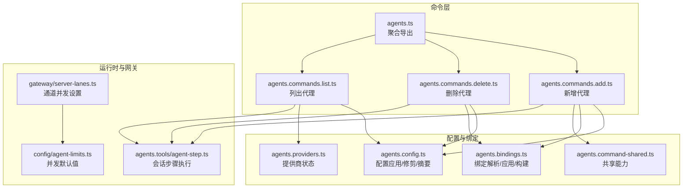
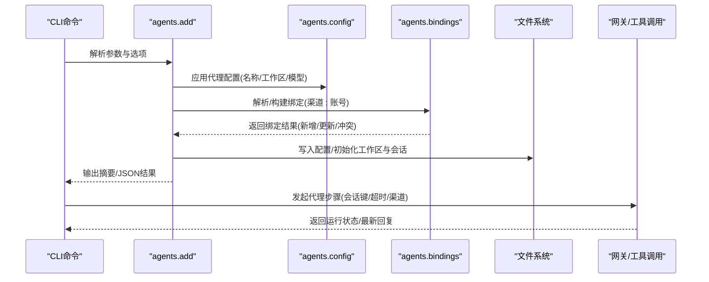
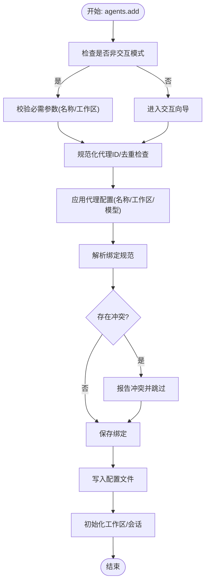
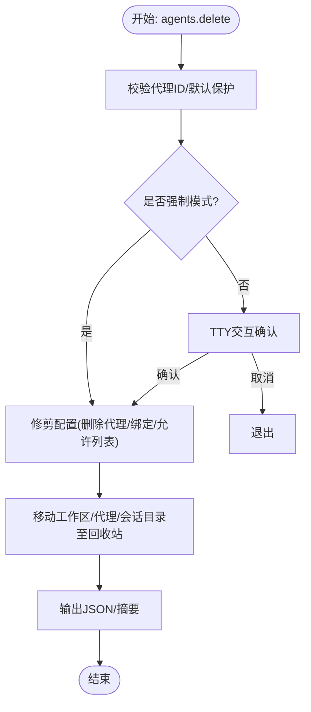
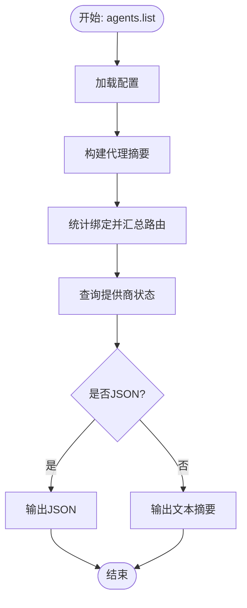
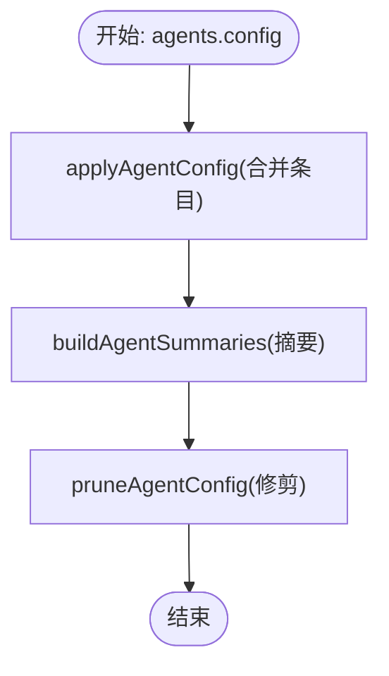
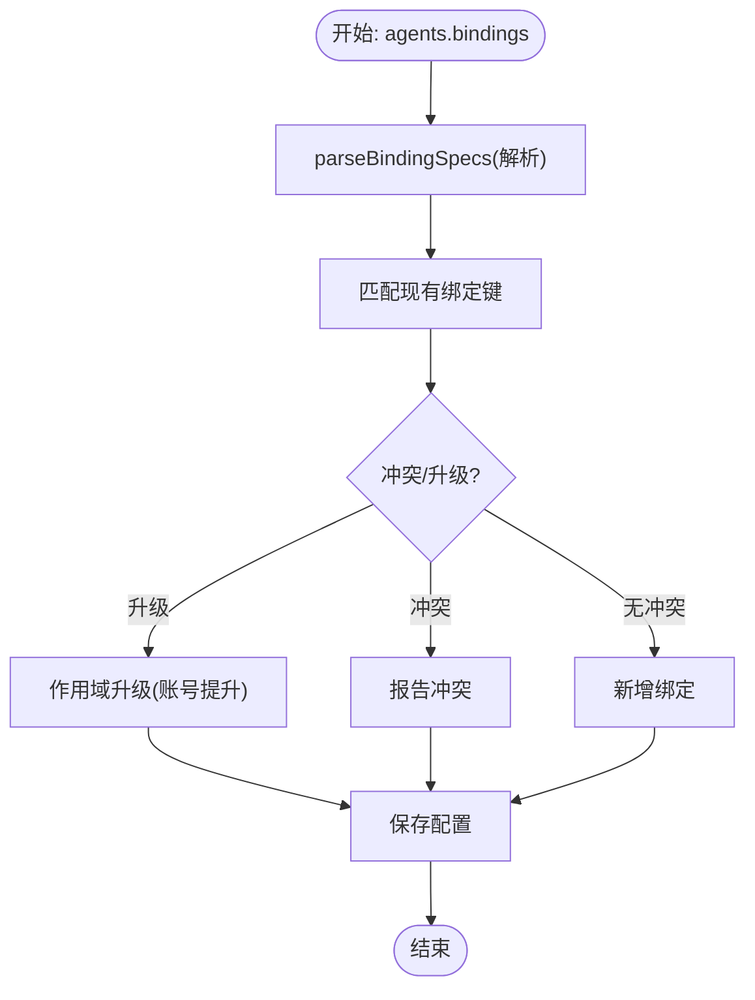
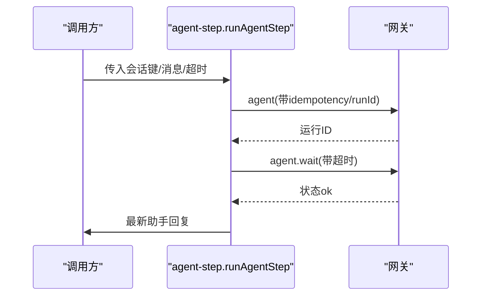
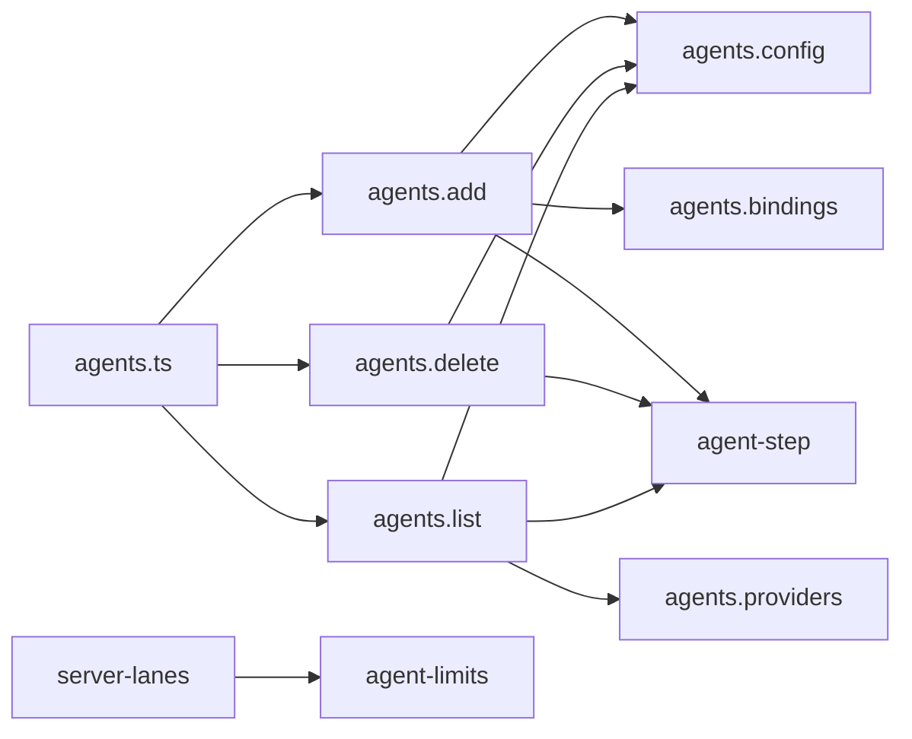

# 代理控制命令

<cite>
**本文引用的文件**
- [src/commands/agents.ts](file://src/commands/agents.ts)
- [src/commands/agents.commands.add.ts](file://src/commands/agents.commands.add.ts)
- [src/commands/agents.commands.delete.ts](file://src/commands/agents.commands.delete.ts)
- [src/commands/agents.commands.list.ts](file://src/commands/agents.commands.list.ts)
- [src/commands/agents.config.ts](file://src/commands/agents.config.ts)
- [src/commands/agents.bindings.ts](file://src/commands/agents.bindings.ts)
- [src/commands/agents.command-shared.ts](file://src/commands/agents.command-shared.ts)
- [src/commands/agents.providers.ts](file://src/commands/agents.providers.ts)
- [src/agents/tools/agent-step.ts](file://src/agents/tools/agent-step.ts)
- [src/gateway/tools-invoke-http.test.ts](file://src/gateway/tools-invoke-http.test.ts)
- [src/gateway/server-lanes.ts](file://src/gateway/server-lanes.ts)
- [src/config/agent-limits.ts](file://src/config/agent-limits.ts)
- [src/config/config.agent-concurrency-defaults.test.ts](file://src/config/config.agent-concurrency-defaults.test.ts)
- [src/acp/commands.ts](file://src/acp/commands.ts)
- [docs/automation/cron-vs-heartbeat.md](file://docs/automation/cron-vs-heartbeat.md)
</cite>

## 目录

1. [简介](#简介)
2. [项目结构](#项目结构)
3. [核心组件](#核心组件)
4. [架构总览](#架构总览)
5. [详细组件分析](#详细组件分析)
6. [依赖关系分析](#依赖关系分析)
7. [性能考虑](#性能考虑)
8. [故障排查指南](#故障排查指南)
9. [结论](#结论)
10. [附录](#附录)

## 简介

本文件面向OpenClaw代理管理员与开发者，系统化梳理“代理控制命令”的创建、删除、配置与状态管理流程，解释代理工作模式、会话管理与工具调用机制，并提供批量操作、配置模板与状态监控的实践方法。同时给出性能调优、并发控制与资源限制的管理建议，帮助在多代理场景下实现稳定高效的运行。

## 项目结构

围绕代理控制命令的核心目录与文件如下：

- 命令聚合导出：commands/agents.ts 汇总导出所有代理相关命令模块
- 代理生命周期命令：agents.commands.add.ts（新增）、agents.commands.delete.ts（删除）、agents.commands.list.ts（列表）
- 配置与摘要：agents.config.ts（配置应用/修剪/摘要构建）
- 路由绑定：agents.bindings.ts（绑定解析/应用/移除/构建）
- 共享能力：agents.command-shared.ts（通用校验/静默运行）
- 提供商状态：agents.providers.ts（提供商汇总与状态索引）
- 工具调用与会话：agents.tools/agent-step.ts（跨会话步骤执行）
- 并发与通道：gateway/server-lanes.ts、config/agent-limits.ts（并发上限与通道调度）

**图表来源**

- [src/commands/agents.ts](file://src/commands/agents.ts#L1-L8)
- [src/commands/agents.commands.add.ts](file://src/commands/agents.commands.add.ts#L1-L369)
- [src/commands/agents.commands.delete.ts](file://src/commands/agents.commands.delete.ts#L1-L102)
- [src/commands/agents.commands.list.ts](file://src/commands/agents.commands.list.ts#L1-L135)
- [src/commands/agents.config.ts](file://src/commands/agents.config.ts#L1-L211)
- [src/commands/agents.bindings.ts](file://src/commands/agents.bindings.ts#L1-L323)
- [src/commands/agents.command-shared.ts](file://src/commands/agents.command-shared.ts)
- [src/commands/agents.providers.ts](file://src/commands/agents.providers.ts)
- [src/agents/tools/agent-step.ts](file://src/agents/tools/agent-step.ts#L33-L80)
- [src/gateway/server-lanes.ts](file://src/gateway/server-lanes.ts#L1-L10)
- [src/config/agent-limits.ts](file://src/config/agent-limits.ts#L1-L22)

**章节来源**

- [src/commands/agents.ts](file://src/commands/agents.ts#L1-L8)

## 核心组件

- 代理新增命令：支持交互/非交互模式，自动规范化ID、写入配置、应用绑定、初始化工作区与会话、可选复制认证资料等。
- 代理删除命令：安全删除代理及其工作区/会话目录，清理配置中的代理条目与路由绑定。
- 代理列表命令：输出代理摘要（名称、身份、工作区、模型、路由规则、提供商），支持JSON输出与绑定详情。
- 配置与摘要：应用/修剪代理配置，构建代理摘要信息，解析身份文件与模型优先级。
- 绑定管理：解析绑定规范、构建渠道绑定、应用/移除绑定，处理冲突与作用域升级。
- 工具调用与会话：通过网关执行代理步骤，等待运行完成并读取最新助手回复，支持跨会话输入溯源。
- 并发与通道：根据配置设置不同通道的并发上限，保障主代理与子代理的资源隔离与吞吐。

**章节来源**

- [src/commands/agents.commands.add.ts](file://src/commands/agents.commands.add.ts#L51-L369)
- [src/commands/agents.commands.delete.ts](file://src/commands/agents.commands.delete.ts#L19-L102)
- [src/commands/agents.commands.list.ts](file://src/commands/agents.commands.list.ts#L74-L135)
- [src/commands/agents.config.ts](file://src/commands/agents.config.ts#L83-L211)
- [src/commands/agents.bindings.ts](file://src/commands/agents.bindings.ts#L74-L323)
- [src/agents/tools/agent-step.ts](file://src/agents/tools/agent-step.ts#L33-L80)
- [src/gateway/server-lanes.ts](file://src/gateway/server-lanes.ts#L6-L10)
- [src/config/agent-limits.ts](file://src/config/agent-limits.ts#L8-L22)

## 架构总览

代理控制命令围绕“配置—绑定—会话—工具调用—并发控制”形成闭环：

- 配置层：agents.config.ts负责代理条目的增删改查与摘要生成
- 绑定层：agents.bindings.ts负责将渠道/账号映射到具体代理
- 会话层：agents.tools/agent-step.ts通过网关发起会话步骤并等待结果
- 并发层：gateway/server-lanes.ts与config/agent-limits.ts共同决定通道并发度

**图表来源**

- [src/commands/agents.commands.add.ts](file://src/commands/agents.commands.add.ts#L107-L139)
- [src/commands/agents.bindings.ts](file://src/commands/agents.bindings.ts#L284-L323)
- [src/commands/agents.config.ts](file://src/commands/agents.config.ts#L126-L164)
- [src/agents/tools/agent-step.ts](file://src/agents/tools/agent-step.ts#L45-L80)

## 详细组件分析

### 代理新增命令（agents.add）

- 功能要点
  - 支持交互式向导与非交互模式；非交互需提供工作区
  - 规范化代理ID，保留默认ID不可用；检测重复
  - 应用代理配置（名称/工作区/代理目录/模型），可选覆盖
  - 解析绑定规范，应用绑定，报告冲突与跳过项
  - 写入配置并初始化工作区与会话；可选复制默认代理认证资料
- 关键流程
  - 参数校验与规范化 → 应用配置 → 解析/应用绑定 → 写配置/初始化 → 输出摘要或JSON

**图表来源**

- [src/commands/agents.commands.add.ts](file://src/commands/agents.commands.add.ts#L66-L139)

**章节来源**

- [src/commands/agents.commands.add.ts](file://src/commands/agents.commands.add.ts#L51-L369)

### 代理删除命令（agents.delete）

- 功能要点
  - 校验代理ID，禁止删除默认代理
  - 交互确认（TTY环境）或强制模式
  - 清理配置中的代理条目与路由绑定，删除工作区/代理目录/会话目录
  - 输出JSON或人类可读摘要
- 关键流程
  - 校验ID/默认保护 → 交互确认 → 配置修剪 → 目录移入回收站 → 输出结果

**图表来源**

- [src/commands/agents.commands.delete.ts](file://src/commands/agents.commands.delete.ts#L19-L101)

**章节来源**

- [src/commands/agents.commands.delete.ts](file://src/commands/agents.commands.delete.ts#L19-L102)

### 代理列表命令（agents.list）

- 功能要点
  - 构建代理摘要（名称/身份/工作区/模型/绑定数/路由）
  - 可选显示绑定详情与提供商状态
  - 支持JSON输出，便于自动化集成
- 关键流程
  - 加载配置 → 生成摘要 → 汇总绑定/提供商 → 格式化输出

**图表来源**

- [src/commands/agents.commands.list.ts](file://src/commands/agents.commands.list.ts#L74-L135)
- [src/commands/agents.config.ts](file://src/commands/agents.config.ts#L83-L124)
- [src/commands/agents.providers.ts](file://src/commands/agents.providers.ts)

**章节来源**

- [src/commands/agents.commands.list.ts](file://src/commands/agents.commands.list.ts#L74-L135)

### 配置与摘要（agents.config）

- 功能要点
  - 查找/插入/更新代理条目
  - 计算代理模型优先级（按代理配置→默认配置→主模型）
  - 加载身份文件（IDENTITY.md）并提取姓名/表情
  - 生成代理摘要（含绑定计数、默认标记等）
  - 修剪代理配置（删除代理、路由绑定、允许列表）
- 关键流程
  - 输入参数 → 合并/替换代理条目 → 生成摘要 → 返回新配置

**图表来源**

- [src/commands/agents.config.ts](file://src/commands/agents.config.ts#L126-L211)

**章节来源**

- [src/commands/agents.config.ts](file://src/commands/agents.config.ts#L1-L211)

### 绑定管理（agents.bindings）

- 功能要点
  - 描述绑定（渠道/账号/群组/团队/身份角色）
  - 解析绑定规范（channel[:accountId]）
  - 应用绑定（新增/更新/跳过/冲突）
  - 移除绑定（匹配键/冲突检测）
  - 构建渠道绑定（从选择的渠道与账号映射）
- 关键流程
  - 输入规范 → 解析/标准化 → 匹配现有绑定 → 冲突判定/作用域升级 → 写回配置

**图表来源**

- [src/commands/agents.bindings.ts](file://src/commands/agents.bindings.ts#L74-L157)
- [src/commands/agents.bindings.ts](file://src/commands/agents.bindings.ts#L284-L323)

**章节来源**

- [src/commands/agents.bindings.ts](file://src/commands/agents.bindings.ts#L1-L323)

### 工具调用与会话（agent-step）

- 功能要点
  - 通过网关发起代理步骤，支持额外系统提示、渠道/车道指定、输入溯源
  - 等待运行完成并读取最新助手回复
  - 失败时返回未定义，成功时返回最新回复
- 关键流程
  - 组装请求 → 调用网关 → 等待运行 → 读取回复

**图表来源**

- [src/agents/tools/agent-step.ts](file://src/agents/tools/agent-step.ts#L45-L80)

**章节来源**

- [src/agents/tools/agent-step.ts](file://src/agents/tools/agent-step.ts#L33-L80)

### ACP命令集（ACPCmd）

- 功能要点
  - 提供帮助、命令列表、状态查看、上下文说明、身份识别、子代理管理、配置读写、调试覆盖、用量展示、停止/重启、渠道路由、激活策略、发送模式、会话重置等
- 使用场景
  - 快速诊断当前运行态、切换路由目标、调整会话行为、临时覆盖运行参数

**章节来源**

- [src/acp/commands.ts](file://src/acp/commands.ts#L1-L26)

## 依赖关系分析

- 命令聚合导出：commands/agents.ts统一导出各命令模块，便于CLI注册与测试
- 命令间耦合：agents.add依赖agents.config与agents.bindings；agents.delete依赖agents.config进行修剪；agents.list依赖agents.config与agents.providers
- 运行时耦合：agent-step通过网关执行，受并发与通道配置影响
- 并发控制：gateway/server-lanes.ts基于配置设置不同通道并发度，config/agent-limits.ts提供默认值与校验

**图表来源**

- [src/commands/agents.ts](file://src/commands/agents.ts#L1-L8)
- [src/commands/agents.commands.add.ts](file://src/commands/agents.commands.add.ts#L18-L28)
- [src/commands/agents.commands.delete.ts](file://src/commands/agents.commands.delete.ts#L1-L11)
- [src/commands/agents.commands.list.ts](file://src/commands/agents.commands.list.ts#L1-L16)
- [src/commands/agents.config.ts](file://src/commands/agents.config.ts#L1-L15)
- [src/commands/agents.bindings.ts](file://src/commands/agents.bindings.ts#L1-L7)
- [src/agents/tools/agent-step.ts](file://src/agents/tools/agent-step.ts#L33-L80)
- [src/gateway/server-lanes.ts](file://src/gateway/server-lanes.ts#L1-L10)
- [src/config/agent-limits.ts](file://src/config/agent-limits.ts#L1-L22)

**章节来源**

- [src/commands/agents.ts](file://src/commands/agents.ts#L1-L8)
- [src/gateway/server-lanes.ts](file://src/gateway/server-lanes.ts#L6-L10)
- [src/config/agent-limits.ts](file://src/config/agent-limits.ts#L8-L22)

## 性能考虑

- 并发控制
  - 主代理与子代理的最大并发数由配置解析并应用到命令通道
  - 默认并发值与边界校验见并发默认值测试
- 通道调度
  - 不同通道（如Cron/Main/Subagent）分别设置最大并发，避免资源争抢
- 会话等待与超时
  - 步骤等待时间受超时限制，避免长时间阻塞
- 批量与模板
  - 通过绑定规范批量路由多个渠道；通过默认配置模板快速应用相同设置

**章节来源**

- [src/config/agent-limits.ts](file://src/config/agent-limits.ts#L3-L22)
- [src/config/config.agent-concurrency-defaults.test.ts](file://src/config/config.agent-concurrency-defaults.test.ts#L14-L47)
- [src/gateway/server-lanes.ts](file://src/gateway/server-lanes.ts#L6-L10)
- [src/agents/tools/agent-step.ts](file://src/agents/tools/agent-step.ts#L67-L75)

## 故障排查指南

- 新增失败
  - 检查代理ID是否被保留或已存在；非交互模式必须提供工作区
  - 绑定解析错误会输出错误列表，修正绑定规范后重试
- 删除失败
  - 默认代理不可删除；TTY环境未确认会报错；强制模式可绕过确认
- 列表异常
  - JSON输出用于自动化排障；若缺少提供商状态，使用“通道健康探测”命令核对凭证与连通性
- 工具调用错误
  - 输入参数错误映射为400，授权错误映射为403，其他执行错误映射为500
- 并发问题
  - 若出现排队或超时，检查通道并发设置与任务负载；必要时降低并发或优化任务粒度

**章节来源**

- [src/commands/agents.commands.add.ts](file://src/commands/agents.commands.add.ts#L66-L124)
- [src/commands/agents.commands.delete.ts](file://src/commands/agents.commands.delete.ts#L39-L66)
- [src/commands/agents.commands.list.ts](file://src/commands/agents.commands.list.ts#L129-L133)
- [src/gateway/tools-invoke-http.test.ts](file://src/gateway/tools-invoke-http.test.ts#L508-L525)

## 结论

通过“新增—绑定—会话—工具调用—并发控制”的完整链路，OpenClaw提供了可扩展、可观测、可调优的代理管理体系。管理员可借助命令行与配置模板快速部署与治理多代理，结合心跳与定时任务实现持续监控与智能响应。

## 附录

- 心跳与定时任务
  - 心跳适合批量检查与上下文感知决策，减少API调用次数并保持对话连续性
- ACP命令速查
  - 常用命令包括帮助、状态、上下文、身份、子代理、配置、调试、用量、停止/重启、渠道路由、激活策略、发送模式、会话重置等

**章节来源**

- [docs/automation/cron-vs-heartbeat.md](file://docs/automation/cron-vs-heartbeat.md#L29-L71)
- [src/acp/commands.ts](file://src/acp/commands.ts#L1-L26)
