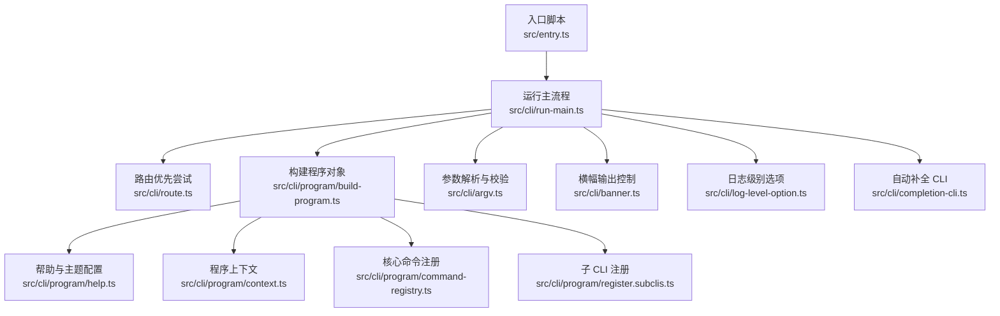
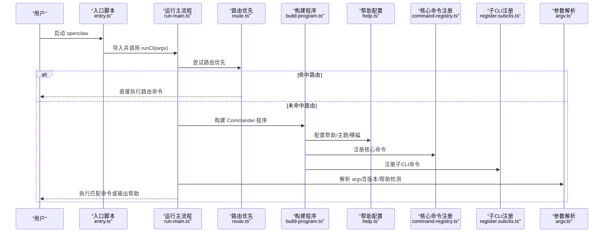
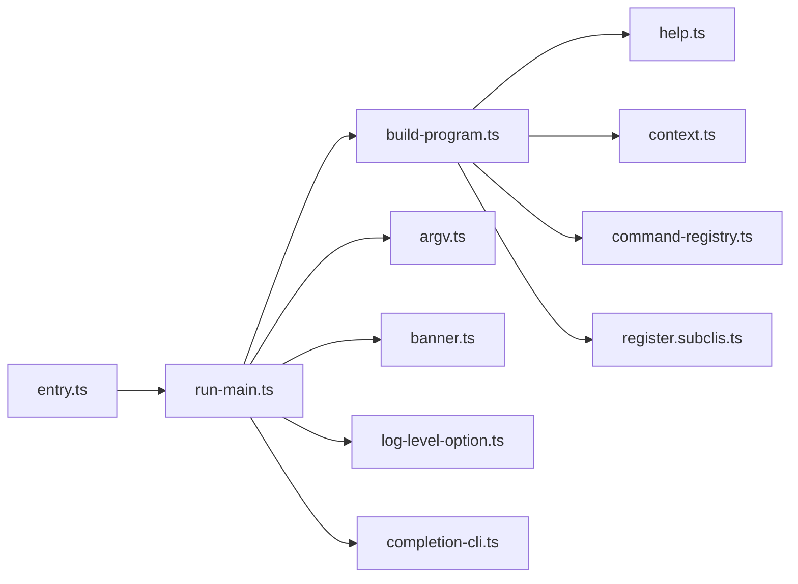

# 基础命令

<cite>
**本文引用的文件**
- [src/entry.ts](file://src/entry.ts)
- [src/cli/run-main.ts](file://src/cli/run-main.ts)
- [src/cli/route.ts](file://src/cli/route.ts)
- [src/cli/program/build-program.ts](file://src/cli/program/build-program.ts)
- [src/cli/program/help.ts](file://src/cli/program/help.ts)
- [src/cli/program/context.ts](file://src/cli/program/context.ts)
- [src/cli/argv.ts](file://src/cli/argv.ts)
- [src/cli/banner.ts](file://src/cli/banner.ts)
- [src/cli/completion-cli.ts](file://src/cli/completion-cli.ts)
- [src/cli/completion-fish.ts](file://src/cli/completion-fish.ts)
- [src/cli/log-level-option.ts](file://src/cli/log-level-option.ts)
- [src/cli/program/command-registry.ts](file://src/cli/program/command-registry.ts)
- [src/cli/program/register.subclis.ts](file://src/cli/program/register.subclis.ts)
- [src/cli/program/help.test.ts](file://src/cli/program/help.test.ts)
- [src/cli/program/command-registry.test.ts](file://src/cli/program/command-registry.test.ts)
- [src/cli/run-main.test.ts](file://src/cli/run-main.test.ts)
- [src/cli/program/routes.ts](file://src/cli/program/routes.ts)
- [src/version.ts](file://src/version.ts)
</cite>

## 目录

1. [简介](#简介)
2. [项目结构](#项目结构)
3. [核心组件](#核心组件)
4. [架构总览](#架构总览)
5. [详细组件分析](#详细组件分析)
6. [依赖关系分析](#依赖关系分析)
7. [性能考量](#性能考量)
8. [故障排查指南](#故障排查指南)
9. [结论](#结论)
10. [附录](#附录)

## 简介

本章节面向首次接触 OpenClaw 的用户，系统性介绍基础命令与通用功能，包括：

- 系统启动流程与入口
- 帮助系统与版本查询
- 通用选项（开发模式、日志级别、颜色控制）
- 自动补全安装与生成
- 错误处理与调试建议
- 快速上手示例与最佳实践

目标是帮助你在最短时间内掌握常用命令并安全高效地使用 OpenClaw。

## 项目结构

OpenClaw CLI 的核心由“入口 → 路由 → 程序构建 → 命令注册 → 解析执行”构成。下图展示关键模块之间的关系与调用方向：

图表来源

- [src/entry.ts](file://src/entry.ts#L1-L144)
- [src/cli/run-main.ts](file://src/cli/run-main.ts#L64-L124)
- [src/cli/route.ts](file://src/cli/route.ts#L22-L40)
- [src/cli/program/build-program.ts](file://src/cli/program/build-program.ts#L8-L20)
- [src/cli/program/help.ts](file://src/cli/program/help.ts#L46-L136)
- [src/cli/program/context.ts](file://src/cli/program/context.ts#L11-L19)
- [src/cli/program/command-registry.ts](file://src/cli/program/command-registry.ts#L297-L304)
- [src/cli/program/register.subclis.ts](file://src/cli/program/register.subclis.ts#L330-L348)
- [src/cli/argv.ts](file://src/cli/argv.ts#L10-L14)
- [src/cli/banner.ts](file://src/cli/banner.ts#L112-L129)
- [src/cli/log-level-option.ts](file://src/cli/log-level-option.ts#L1-L13)
- [src/cli/completion-cli.ts](file://src/cli/completion-cli.ts#L25-L61)

章节来源

- [src/entry.ts](file://src/entry.ts#L1-L144)
- [src/cli/run-main.ts](file://src/cli/run-main.ts#L64-L124)
- [src/cli/program/build-program.ts](file://src/cli/program/build-program.ts#L8-L20)

## 核心组件

- 入口与进程生命周期
  - 入口脚本负责环境规范化、实验性警告抑制、参数解析与主流程引导。
  - 参考路径：[入口脚本](file://src/entry.ts#L1-L144)
- 运行主流程
  - 负责确保 CLI 在 PATH 上、加载环境变量、准备日志捕获、构建程序、注册命令、解析参数。
  - 参考路径：[运行主流程](file://src/cli/run-main.ts#L64-L124)
- 路由优先机制
  - 对部分命令路径进行“直连路由”，在不完整解析的情况下直接执行，提升体验。
  - 参考路径：[路由优先](file://src/cli/route.ts#L22-L40)
- 程序构建与帮助系统
  - 构建 Commander 程序，配置帮助文本、排序、主题、横幅与示例。
  - 参考路径：[构建程序](file://src/cli/program/build-program.ts#L8-L20)，[帮助系统](file://src/cli/program/help.ts#L46-L136)
- 参数与选项
  - 提供帮助/版本检测、根级别名、布尔/值选项、命令路径提取、正整数解析等。
  - 参考路径：[参数解析](file://src/cli/argv.ts#L10-L14)
- 横幅与版本
  - 控制横幅输出时机与内容，支持 JSON 输出时隐藏横幅；版本通过版本模块注入。
  - 参考路径：[横幅控制](file://src/cli/banner.ts#L112-L129)，[版本模块](file://src/version.ts#L1-L200)
- 日志级别
  - 支持通过选项覆盖全局日志级别，提供合法值集合与解析器。
  - 参考路径：[日志级别选项](file://src/cli/log-level-option.ts#L1-L13)
- 自动补全
  - 支持 zsh/bash/fish/PowerShell，可生成缓存、写入配置文件、检测已安装状态。
  - 参考路径：[自动补全 CLI](file://src/cli/completion-cli.ts#L25-L61)

章节来源

- [src/entry.ts](file://src/entry.ts#L1-L144)
- [src/cli/run-main.ts](file://src/cli/run-main.ts#L64-L124)
- [src/cli/route.ts](file://src/cli/route.ts#L22-L40)
- [src/cli/program/build-program.ts](file://src/cli/program/build-program.ts#L8-L20)
- [src/cli/program/help.ts](file://src/cli/program/help.ts#L46-L136)
- [src/cli/argv.ts](file://src/cli/argv.ts#L10-L14)
- [src/cli/banner.ts](file://src/cli/banner.ts#L112-L129)
- [src/cli/log-level-option.ts](file://src/cli/log-level-option.ts#L1-L13)
- [src/cli/completion-cli.ts](file://src/cli/completion-cli.ts#L25-L61)

## 架构总览

下面以序列图展示一次典型命令执行的端到端流程，从入口到命令解析与执行：

图表来源

- [src/entry.ts](file://src/entry.ts#L133-L142)
- [src/cli/run-main.ts](file://src/cli/run-main.ts#L75-L124)
- [src/cli/route.ts](file://src/cli/route.ts#L22-L40)
- [src/cli/program/build-program.ts](file://src/cli/program/build-program.ts#L8-L20)
- [src/cli/program/help.ts](file://src/cli/program/help.ts#L46-L136)
- [src/cli/program/command-registry.ts](file://src/cli/program/command-registry.ts#L297-L304)
- [src/cli/program/register.subclis.ts](file://src/cli/program/register.subclis.ts#L330-L348)
- [src/cli/argv.ts](file://src/cli/argv.ts#L10-L14)

## 详细组件分析

### 帮助系统与版本查询

- 版本查询
  - 支持多种触发方式：长选项、短选项、根级别名。命中后立即打印版本并退出。
  - 参考路径：[帮助系统中的版本处理](file://src/cli/program/help.ts#L107-L114)
- 帮助输出
  - 自定义帮助文本格式、排序、横幅提示、示例与文档链接；根命令显示“带子命令标记”的提示。
  - 参考路径：[帮助配置](file://src/cli/program/help.ts#L46-L136)，[测试用例](file://src/cli/program/help.test.ts#L87-L125)
- 横幅控制
  - TTY 环境、非 JSON 输出、非版本请求时才输出横幅。
  - 参考路径：[横幅输出](file://src/cli/banner.ts#L112-L129)

章节来源

- [src/cli/program/help.ts](file://src/cli/program/help.ts#L107-L114)
- [src/cli/program/help.ts](file://src/cli/program/help.ts#L46-L136)
- [src/cli/program/help.test.ts](file://src/cli/program/help.test.ts#L87-L125)
- [src/cli/banner.ts](file://src/cli/banner.ts#L112-L129)

### 通用选项与参数

- 通用选项
  - 开发模式、命名配置文件、日志级别覆盖、禁用颜色等。
  - 参考路径：[帮助系统选项定义](file://src/cli/program/help.ts#L51-L63)
- 参数解析
  - 帮助/版本检测、根级别名识别、布尔/值选项、命令路径提取、正整数解析。
  - 参考路径：[参数解析](file://src/cli/argv.ts#L10-L14)，[根级别名](file://src/cli/argv.ts#L50-L84)，[命令路径](file://src/cli/argv.ts#L123-L143)

章节来源

- [src/cli/program/help.ts](file://src/cli/program/help.ts#L51-L63)
- [src/cli/argv.ts](file://src/cli/argv.ts#L10-L14)
- [src/cli/argv.ts](file://src/cli/argv.ts#L50-L84)
- [src/cli/argv.ts](file://src/cli/argv.ts#L123-L143)

### 自动补全

- 支持的 Shell 与缓存路径
  - 自动识别 SHELL，生成对应扩展名的缓存文件路径。
  - 参考路径：[Shell 识别与缓存路径](file://src/cli/completion-cli.ts#L25-L61)
- 安装与写入配置
  - 写入状态、安装到用户配置文件、检测是否已安装。
  - 参考路径：[写入状态与安装](file://src/cli/completion-cli.ts#L314-L377)
- 补全脚本生成
  - 生成 zsh/bash/fish/PowerShell 的补全脚本树。
  - 参考路径：[zsh 生成](file://src/cli/completion-cli.ts#L379-L406)，[fish 工具函数](file://src/cli/completion-fish.ts#L14-L41)

章节来源

- [src/cli/completion-cli.ts](file://src/cli/completion-cli.ts#L25-L61)
- [src/cli/completion-cli.ts](file://src/cli/completion-cli.ts#L314-L377)
- [src/cli/completion-cli.ts](file://src/cli/completion-cli.ts#L379-L406)
- [src/cli/completion-fish.ts](file://src/cli/completion-fish.ts#L14-L41)

### 命令注册与延迟加载

- 核心命令注册
  - 按需延迟注册核心命令，避免启动时的重负载。
  - 参考路径：[核心命令注册](file://src/cli/program/command-registry.ts#L241-L288)
- 子 CLI 注册
  - 按需延迟注册子 CLI，支持“仅注册主命令”“仅注册主命令且仅一次”等策略。
  - 参考路径：[子 CLI 注册](file://src/cli/program/register.subclis.ts#L330-L348)
- 测试验证
  - 验证帮助/版本不触发主命令注册、占位符替换等行为。
  - 参考路径：[注册测试](file://src/cli/program/command-registry.test.ts#L88-L147)，[运行主流程测试](file://src/cli/run-main.test.ts#L43-L75)

章节来源

- [src/cli/program/command-registry.ts](file://src/cli/program/command-registry.ts#L241-L288)
- [src/cli/program/register.subclis.ts](file://src/cli/program/register.subclis.ts#L330-L348)
- [src/cli/program/command-registry.test.ts](file://src/cli/program/command-registry.test.ts#L88-L147)
- [src/cli/run-main.test.ts](file://src/cli/run-main.test.ts#L43-L75)

### 路由优先与状态类命令

- 路由优先
  - 对健康、状态、会话等高频命令进行直连路由，减少解析开销。
  - 参考路径：[路由优先](file://src/cli/route.ts#L22-L40)，[路由表](file://src/cli/program/routes.ts#L244-L263)
- 状态类命令
  - 帮助、状态、会话、模型、配置等命令在帮助中作为示例出现。
  - 参考路径：[帮助示例](file://src/cli/program/help.ts#L22-L44)

章节来源

- [src/cli/route.ts](file://src/cli/route.ts#L22-L40)
- [src/cli/program/routes.ts](file://src/cli/program/routes.ts#L244-L263)
- [src/cli/program/help.ts](file://src/cli/program/help.ts#L22-L44)

## 依赖关系分析

- 组件耦合
  - 入口脚本仅负责引导，运行主流程承担大部分初始化与异常处理。
  - 程序构建模块集中配置帮助、上下文与注册逻辑，降低其他模块复杂度。
- 外部依赖
  - Commander 用于命令解析与帮助输出。
  - Node 进程 API 用于颜色、TTY、环境变量与异常捕获。
- 循环依赖
  - 通过分层设计避免循环导入：入口 → 主流程 → 构建程序 → 注册 → 解析。

图表来源

- [src/entry.ts](file://src/entry.ts#L1-L144)
- [src/cli/run-main.ts](file://src/cli/run-main.ts#L64-L124)
- [src/cli/program/build-program.ts](file://src/cli/program/build-program.ts#L8-L20)
- [src/cli/program/help.ts](file://src/cli/program/help.ts#L46-L136)
- [src/cli/program/context.ts](file://src/cli/program/context.ts#L11-L19)
- [src/cli/program/command-registry.ts](file://src/cli/program/command-registry.ts#L297-L304)
- [src/cli/program/register.subclis.ts](file://src/cli/program/register.subclis.ts#L330-L348)
- [src/cli/argv.ts](file://src/cli/argv.ts#L10-L14)
- [src/cli/banner.ts](file://src/cli/banner.ts#L112-L129)
- [src/cli/log-level-option.ts](file://src/cli/log-level-option.ts#L1-L13)
- [src/cli/completion-cli.ts](file://src/cli/completion-cli.ts#L25-L61)

## 性能考量

- 路由优先
  - 对高频命令启用直连路由，减少解析与注册成本。
  - 参考路径：[路由优先](file://src/cli/route.ts#L22-L40)
- 延迟注册
  - 核心命令与子 CLI 采用按需注册，避免启动时一次性加载全部命令。
  - 参考路径：[核心注册](file://src/cli/program/command-registry.ts#L241-L288)，[子 CLI 注册](file://src/cli/program/register.subclis.ts#L330-L348)
- 参数预处理
  - 在解析前对 argv 进行标准化与重写，减少后续分支判断。
  - 参考路径：[运行主流程中的 argv 重写](file://src/cli/run-main.ts#L94-L107)

## 故障排查指南

- 帮助与版本未生效
  - 确认未传入 JSON 输出标志导致横幅/帮助被跳过。
  - 参考路径：[横幅输出条件](file://src/cli/banner.ts#L120-L125)，[帮助版本检测](file://src/cli/argv.ts#L10-L14)
- 自动补全未工作
  - 先生成缓存再写入配置；检查 Shell 类型识别与配置文件路径。
  - 参考路径：[缓存路径与识别](file://src/cli/completion-cli.ts#L25-L61)，[写入配置](file://src/cli/completion-cli.ts#L314-L377)
- 命令解析异常
  - 使用更详细的日志级别定位问题；确认布尔/值选项格式正确。
  - 参考路径：[日志级别选项](file://src/cli/log-level-option.ts#L1-L13)，[参数解析](file://src/cli/argv.ts#L86-L103)
- 入口引导失败
  - 查看入口脚本的错误输出与退出码；确认 Node/Bun 环境与实验性警告抑制设置。
  - 参考路径：[入口脚本错误处理](file://src/entry.ts#L133-L142)

章节来源

- [src/cli/banner.ts](file://src/cli/banner.ts#L120-L125)
- [src/cli/argv.ts](file://src/cli/argv.ts#L10-L14)
- [src/cli/completion-cli.ts](file://src/cli/completion-cli.ts#L25-L61)
- [src/cli/completion-cli.ts](file://src/cli/completion-cli.ts#L314-L377)
- [src/cli/log-level-option.ts](file://src/cli/log-level-option.ts#L1-L13)
- [src/cli/argv.ts](file://src/cli/argv.ts#L86-L103)
- [src/entry.ts](file://src/entry.ts#L133-L142)

## 结论

OpenClaw 的基础命令体系围绕“入口 → 路由 → 程序构建 → 命令注册 → 解析执行”展开，配合帮助系统、版本查询、通用选项与自动补全，形成易用、可诊断、可扩展的 CLI 生态。遵循本文档的最佳实践，你可以快速上手并稳定使用 OpenClaw 的基础能力。

## 附录

### 常用基础命令与示例

- 查询版本
  - 触发方式：长选项、短选项、根级别名。
  - 参考路径：[帮助系统中的版本处理](file://src/cli/program/help.ts#L107-L114)
- 显示帮助
  - 触发方式：根级帮助选项与子命令帮助。
  - 参考路径：[帮助系统配置](file://src/cli/program/help.ts#L66-L67)，[帮助输出格式化](file://src/cli/program/help.ts#L97-L105)
- 开发模式与配置文件
  - 使用开发模式隔离状态；指定命名配置文件。
  - 参考路径：[帮助系统选项](file://src/cli/program/help.ts#L51-L58)
- 日志级别覆盖
  - 设置全局日志级别，支持合法值集合。
  - 参考路径：[日志级别选项](file://src/cli/log-level-option.ts#L1-L13)
- 自动补全安装
  - 生成缓存、写入配置、检测安装状态。
  - 参考路径：[缓存与安装](file://src/cli/completion-cli.ts#L314-L377)

章节来源

- [src/cli/program/help.ts](file://src/cli/program/help.ts#L107-L114)
- [src/cli/program/help.ts](file://src/cli/program/help.ts#L66-L67)
- [src/cli/program/help.ts](file://src/cli/program/help.ts#L97-L105)
- [src/cli/program/help.ts](file://src/cli/program/help.ts#L51-L58)
- [src/cli/log-level-option.ts](file://src/cli/log-level-option.ts#L1-L13)
- [src/cli/completion-cli.ts](file://src/cli/completion-cli.ts#L314-L377)
