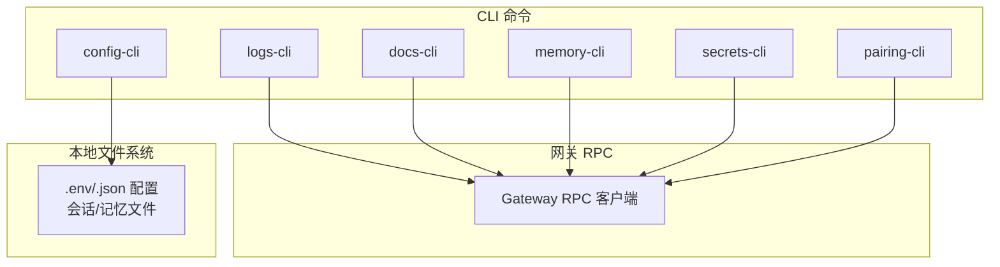
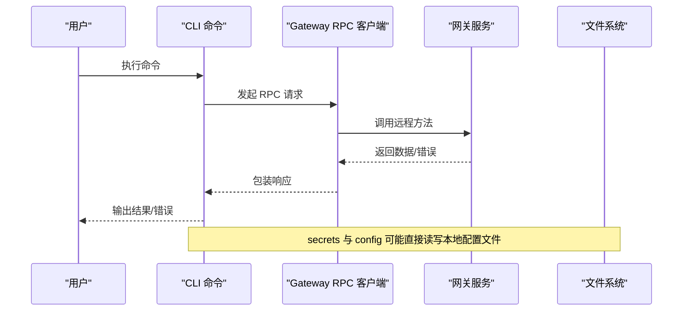
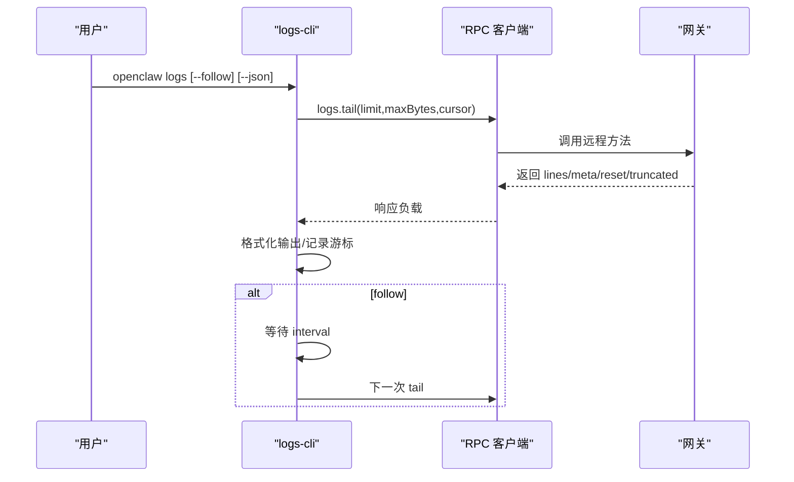
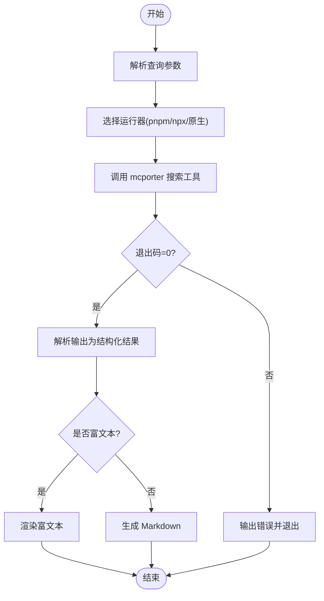
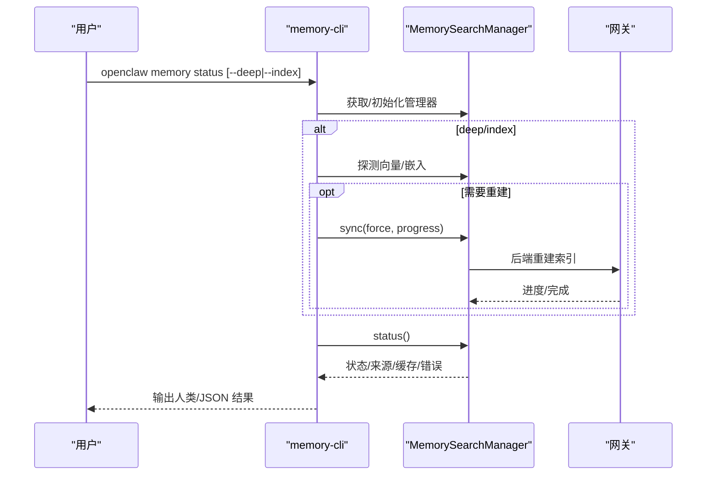
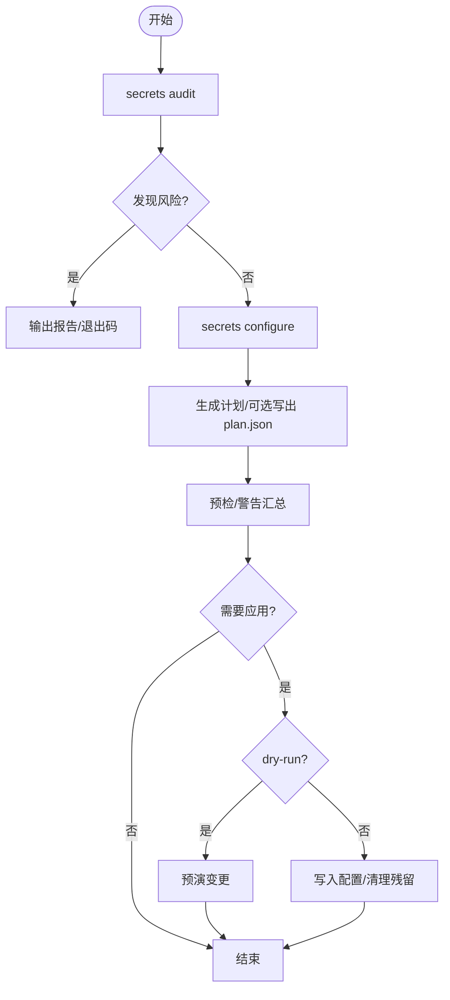
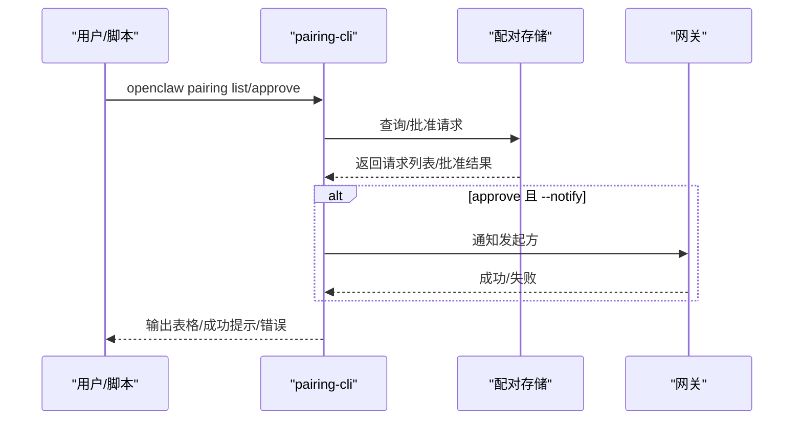
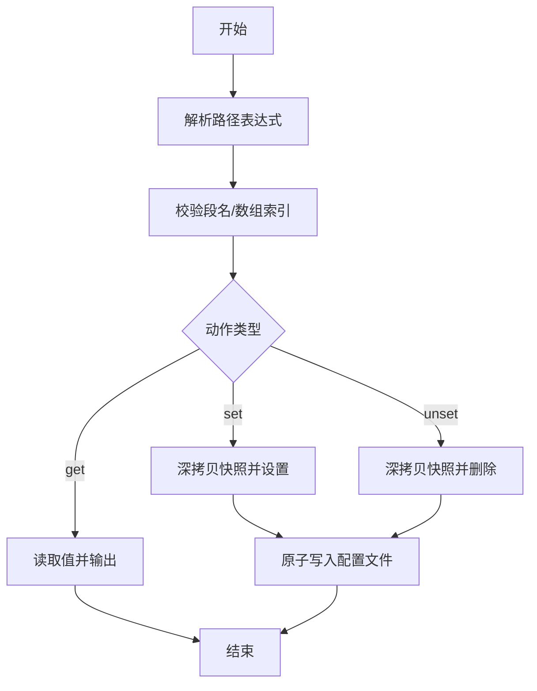
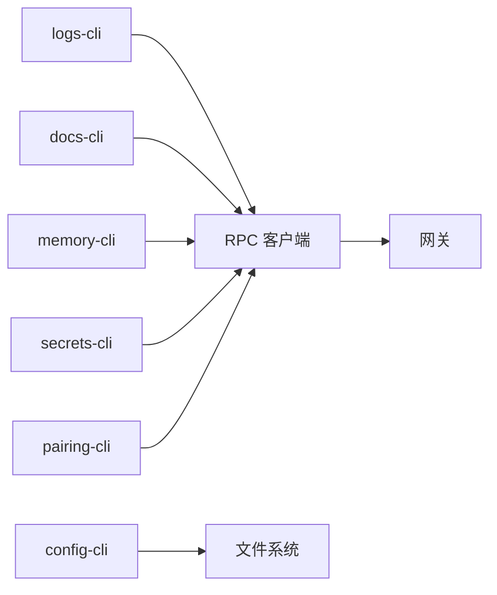

# 实用工具命令

<cite>
**本文档引用的文件**
- [src/cli/logs-cli.ts](file://src/cli/logs-cli.ts)
- [dist/logs-cli-BTZ1uMgJ.js](file://dist/logs-cli-BTZ1uMgJ.js)
- [src/cli/memory-cli.ts](file://src/cli/memory-cli.ts)
- [dist/memory-cli-BkqIPnvu.js](file://dist/memory-cli-BkqIPnvu.js)
- [src/cli/secrets-cli.ts](file://src/cli/secrets-cli.ts)
- [dist/secrets-cli-CJ8mPb8c.js](file://dist/secrets-cli-CJ8mPb8c.js)
- [src/cli/pairing-cli.ts](file://src/cli/pairing-cli.ts)
- [dist/pairing-cli-DI7ZVbBY.js](file://dist/pairing-cli-DI7ZVbBY.js)
- [src/cli/docs-cli.ts](file://src/cli/docs-cli.ts)
- [dist/docs-cli-BZjZtag2.js](file://dist/docs-cli-BZjZtag2.js)
- [src/cli/config-cli.ts](file://src/cli/config-cli.ts)
- [dist/config-cli-DMWCDW2b.js](file://dist/config-cli-DMWCDW2b.js)
</cite>

## 目录

1. [简介](#简介)
2. [项目结构](#项目结构)
3. [核心组件](#核心组件)
4. [架构总览](#架构总览)
5. [详细组件分析](#详细组件分析)
6. [依赖关系分析](#依赖关系分析)
7. [性能考虑](#性能考虑)
8. [故障排除指南](#故障排除指南)
9. [结论](#结论)
10. [附录](#附录)

## 简介

本文件面向系统管理员与开发者，系统性梳理 OpenClaw 的实用工具命令，覆盖以下辅助能力：

- 日志管理：实时查看网关日志、支持 JSON 输出与断点处理
- 文档检索：在线搜索官方文档并输出富文本或 Markdown 结果
- 内存监控：查看与重建记忆索引、探测向量/嵌入可用性、统计来源与缓存状态
- 密钥管理：审计明文密钥、迁移到 SecretRef、应用变更计划、重载运行时密钥
- 配对操作：列出与批准安全的私信配对请求，并可通知发起方

这些命令通过统一的 CLI 框架注册，结合网关 RPC 与本地文件系统，提供批量化、自动化与集成友好的运维能力。

## 项目结构

实用工具命令均位于 CLI 子模块中，采用“按功能分组”的组织方式：

- 日志：logs-cli
- 文档：docs-cli
- 内存：memory-cli
- 密钥：secrets-cli
- 配对：pairing-cli
- 配置：config-cli（非交互式配置助手）

图示来源

- [src/cli/logs-cli.ts](file://src/cli/logs-cli.ts#L198-L329)
- [src/cli/docs-cli.ts](file://src/cli/docs-cli.ts#L155-L164)
- [src/cli/memory-cli.ts](file://src/cli/memory-cli.ts#L538-L773)
- [src/cli/secrets-cli.ts](file://src/cli/secrets-cli.ts#L42-L246)
- [src/cli/pairing-cli.ts](file://src/cli/pairing-cli.ts#L52-L174)
- [src/cli/config-cli.ts](file://src/cli/config-cli.ts#L213-L244)

章节来源

- [src/cli/logs-cli.ts](file://src/cli/logs-cli.ts#L1-L329)
- [src/cli/memory-cli.ts](file://src/cli/memory-cli.ts#L1-L773)
- [src/cli/secrets-cli.ts](file://src/cli/secrets-cli.ts#L1-L246)
- [src/cli/pairing-cli.ts](file://src/cli/pairing-cli.ts#L1-L174)
- [src/cli/docs-cli.ts](file://src/cli/docs-cli.ts#L1-L164)
- [src/cli/config-cli.ts](file://src/cli/config-cli.ts#L1-L244)

## 核心组件

- 日志命令（logs）
  - 功能：通过 RPC 尾随网关日志文件，支持限流、断点检测、本地时间显示、JSON 输出
  - 关键特性：自动处理 EPIPE 断开；首次拉取显示进度；支持 follow 轮询
- 文档命令（docs）
  - 功能：调用 mcporter 工具搜索官方文档，输出富文本或 Markdown
  - 关键特性：自动选择 pnpm/npx；超时控制；结果解析与截断
- 内存命令（memory）
  - 功能：状态检查、重建索引、搜索内容；探测向量/嵌入可用性；统计来源与缓存
  - 关键特性：多源扫描（MEMORY.md、memory 目录、会话）；支持 QMD 后端与回退
- 密钥命令（secrets）
  - 功能：审计明文与未解析引用；交互式配置生成计划；应用计划；重载运行时
  - 关键特性：跨文件（.env、auth-profiles、auth.json）清理；预检与确认流程
- 配对命令（pairing）
  - 功能：列出待批准的私信配对请求，批准后允许发送方并可通知发起方
  - 关键特性：通道校验与扩展通道支持；账户维度查询
- 配置命令（config）
  - 功能：非交互式配置读取/设置/删除（路径表达式），配合 doctor 修复
  - 关键特性：严格 JSON5 解析；路径校验；原子写入

章节来源

- [src/cli/logs-cli.ts](file://src/cli/logs-cli.ts#L198-L329)
- [src/cli/docs-cli.ts](file://src/cli/docs-cli.ts#L118-L161)
- [src/cli/memory-cli.ts](file://src/cli/memory-cli.ts#L298-L773)
- [src/cli/secrets-cli.ts](file://src/cli/secrets-cli.ts#L42-L246)
- [src/cli/pairing-cli.ts](file://src/cli/pairing-cli.ts#L52-L174)
- [src/cli/config-cli.ts](file://src/cli/config-cli.ts#L156-L244)

## 架构总览

下图展示 CLI 命令与网关 RPC、本地文件系统的交互关系：

图示来源

- [src/cli/logs-cli.ts](file://src/cli/logs-cli.ts#L45-L62)
- [src/cli/docs-cli.ts](file://src/cli/docs-cli.ts#L131-L151)
- [src/cli/memory-cli.ts](file://src/cli/memory-cli.ts#L341-L361)
- [src/cli/secrets-cli.ts](file://src/cli/secrets-cli.ts#L57-L78)
- [src/cli/pairing-cli.ts](file://src/cli/pairing-cli.ts#L114-L172)
- [src/cli/config-cli.ts](file://src/cli/config-cli.ts#L171-L240)

## 详细组件分析

### 日志命令（logs）

- 用途
  - 实时查看网关日志，支持 follow 模式、本地时间显示、颜色与 JSON 输出
- 主要参数
  - --limit：单次返回行数上限
  - --max-bytes：单次读取字节上限
  - --follow：持续轮询
  - --interval：轮询间隔（毫秒）
  - --json：逐行输出 JSON 行
  - --plain/--no-color：禁用着色
  - --local-time：本地时区显示
  - --url/--token/--timeout：RPC 连接参数
- 使用场景
  - 开发调试：--follow + --local-time 快速定位问题
  - 自动化：--json + 业务侧解析，或管道到日志收集系统
  - 故障排查：--max-bytes 提升截断阈值，避免关键信息丢失
- 处理流程
  - 解析参数 → RPC 拉取日志 → 格式化输出 → 若 follow 则定时轮询
  - 断开检测：捕获 EPIPE/EIO 并优雅退出
- 性能与可靠性
  - 首次拉取显示进度，后续轮询仅在 follow 模式生效
  - 超大日志建议增大 --max-bytes 或使用 --json 分段处理

图示来源

- [src/cli/logs-cli.ts](file://src/cli/logs-cli.ts#L45-L62)
- [src/cli/logs-cli.ts](file://src/cli/logs-cli.ts#L218-L327)
- [dist/logs-cli-BTZ1uMgJ.js](file://dist/logs-cli-BTZ1uMgJ.js#L76-L84)
- [dist/logs-cli-BTZ1uMgJ.js](file://dist/logs-cli-BTZ1uMgJ.js#L156-L234)

章节来源

- [src/cli/logs-cli.ts](file://src/cli/logs-cli.ts#L198-L329)
- [dist/logs-cli-BTZ1uMgJ.js](file://dist/logs-cli-BTZ1uMgJ.js#L1-L237)

### 文档命令（docs）

- 用途
  - 在线搜索官方文档，输出富文本或 Markdown
- 主要参数
  - [query...]：搜索关键词
- 使用场景
  - 快速查阅 API/配置说明
  - CI 中生成文档摘要报告
- 处理流程
  - 解析查询 → 选择 pnpm/npx 或原生二进制 → 调用 mcporter 搜索工具 → 解析输出 → 渲染结果

图示来源

- [src/cli/docs-cli.ts](file://src/cli/docs-cli.ts#L118-L161)
- [dist/docs-cli-BZjZtag2.js](file://dist/docs-cli-BZjZtag2.js#L118-L151)

章节来源

- [src/cli/docs-cli.ts](file://src/cli/docs-cli.ts#L155-L164)
- [dist/docs-cli-BZjZtag2.js](file://dist/docs-cli-BZjZtag2.js#L1-L164)

### 内存命令（memory）

- 用途
  - 查看记忆索引状态、重建索引、执行搜索
- 子命令与参数
  - memory status
    - --agent：指定代理 ID
    - --json：输出机器可读 JSON
    - --deep：探测向量/嵌入可用性
    - --index：当索引脏时重建（隐含 --deep）
    - --verbose：详细日志
  - memory index
    - --agent/--force/--verbose
  - memory search
    - --query 或位置参数；--max-results/--min-score；--json
- 使用场景
  - 系统维护：定期 status + index --force
  - 开发调试：--deep + --verbose 观察向量/嵌入状态
  - 运维巡检：--json 供监控系统采集指标
- 处理流程
  - 解析代理与路径 → 获取/缓存 MemorySearchManager → 探测/重建索引 → 统计来源与缓存 → 输出结果

图示来源

- [src/cli/memory-cli.ts](file://src/cli/memory-cli.ts#L298-L536)
- [src/cli/memory-cli.ts](file://src/cli/memory-cli.ts#L561-L700)
- [src/cli/memory-cli.ts](file://src/cli/memory-cli.ts#L701-L773)
- [dist/memory-cli-BkqIPnvu.js](file://dist/memory-cli-BkqIPnvu.js#L568-L729)

章节来源

- [src/cli/memory-cli.ts](file://src/cli/memory-cli.ts#L298-L773)
- [dist/memory-cli-BkqIPnvu.js](file://dist/memory-cli-BkqIPnvu.js#L1-L800)

### 密钥命令（secrets）

- 用途
  - 审计明文密钥与未解析引用；交互式生成/应用变更计划；重载运行时密钥
- 子命令与参数
  - secrets reload [--json]
  - secrets audit [--check] [--json]
  - secrets configure [--apply] [--yes] [--providers-only] [--skip-provider-setup] [--plan-out <path>] [--json]
  - secrets apply --from <path> [--dry-run] [--json]
- 使用场景
  - 安全合规：定期 audit，发现明文与遗留凭据
  - 迁移演练：configure 生成计划，dry-run 验证，再 apply
  - 紧急恢复：reload 应用最新密钥快照
- 处理流程
  - secrets audit：扫描配置、auth-profiles、.env、auth.json，汇总风险项
  - secrets configure：交互式预检，生成计划，可写出 plan.json
  - secrets apply：校验计划，预演/写入，清理遗留明文与历史文件
  - secrets reload：RPC 触发重新解析与原子切换

图示来源

- [src/cli/secrets-cli.ts](file://src/cli/secrets-cli.ts#L80-L113)
- [src/cli/secrets-cli.ts](file://src/cli/secrets-cli.ts#L115-L208)
- [src/cli/secrets-cli.ts](file://src/cli/secrets-cli.ts#L210-L244)
- [dist/secrets-cli-CJ8mPb8c.js](file://dist/secrets-cli-CJ8mPb8c.js#L432-L492)

章节来源

- [src/cli/secrets-cli.ts](file://src/cli/secrets-cli.ts#L42-L246)
- [dist/secrets-cli-CJ8mPb8c.js](file://dist/secrets-cli-CJ8mPb8c.js#L1-L1619)

### 配对命令（pairing）

- 用途
  - 列出待批准的安全私信配对请求，批准后允许发送方并可通知发起方
- 子命令与参数
  - pairing list [--channel] [--account] [channel] [--json]
  - pairing approve [--channel] [--account] <codeOrChannel> [code] [--notify]
- 使用场景
  - 多账号通道：通过 --account 指定账户维度
  - 自动化审批：结合外部系统生成 code，脚本 approve
  - 用户体验：--notify 通知发起方已放行
- 处理流程
  - 校验通道（核心通道必须在白名单，扩展通道格式校验）
  - 查询待批准请求 → 批准 → 可选通知

图示来源

- [src/cli/pairing-cli.ts](file://src/cli/pairing-cli.ts#L63-L112)
- [src/cli/pairing-cli.ts](file://src/cli/pairing-cli.ts#L114-L172)
- [dist/pairing-cli-DI7ZVbBY.js](file://dist/pairing-cli-DI7ZVbBY.js#L40-L122)

章节来源

- [src/cli/pairing-cli.ts](file://src/cli/pairing-cli.ts#L52-L174)
- [dist/pairing-cli-DI7ZVbBY.js](file://dist/pairing-cli-DI7ZVbBY.js#L1-L125)

### 配置命令（config）

- 用途
  - 非交互式读取/设置/删除配置项（支持点号与方括号路径）
- 子命令与参数
  - config get <path> [--json]
  - config set <path> <value> [--strict-json/--json]
  - config unset <path>
  - config（无子命令）：进入配置向导（基于 --section）
- 使用场景
  - 自动化部署：CI 设置/读取关键配置
  - 批量运维：通过路径表达式批量更新
  - 故障恢复：doctor 修复后，再用 config get 验证
- 处理流程
  - 解析路径 → 校验段名（禁止危险键） → 读取/写入配置快照 → 原子写入

图示来源

- [src/cli/config-cli.ts](file://src/cli/config-cli.ts#L171-L240)
- [dist/config-cli-DMWCDW2b.js](file://dist/config-cli-DMWCDW2b.js#L156-L241)

章节来源

- [src/cli/config-cli.ts](file://src/cli/config-cli.ts#L156-L244)
- [dist/config-cli-DMWCDW2b.js](file://dist/config-cli-DMWCDW2b.js#L1-L244)

## 依赖关系分析

- 命令到网关 RPC
  - logs、docs、memory、secrets、pairing 均通过统一的 RPC 客户端与网关通信
- 命令到本地文件系统
  - secrets 与 config 直接读写配置文件与状态目录
- 命令内聚性
  - 每个命令职责单一，参数与行为清晰，便于组合到自动化脚本

图示来源

- [src/cli/logs-cli.ts](file://src/cli/logs-cli.ts#L1-L329)
- [src/cli/docs-cli.ts](file://src/cli/docs-cli.ts#L1-L164)
- [src/cli/memory-cli.ts](file://src/cli/memory-cli.ts#L1-L773)
- [src/cli/secrets-cli.ts](file://src/cli/secrets-cli.ts#L1-L246)
- [src/cli/pairing-cli.ts](file://src/cli/pairing-cli.ts#L1-L174)
- [src/cli/config-cli.ts](file://src/cli/config-cli.ts#L1-L244)

## 性能考虑

- 日志
  - 合理设置 --limit 与 --max-bytes，避免一次性传输过大
  - follow 模式下适当增大 --interval，降低 RPC 压力
- 文档
  - 使用默认超时；若网络不佳可增加超时参数（如工具层支持）
- 内存
  - 索引重建耗时较长，建议在低峰期执行；必要时使用 --force 强制重建
  - --deep 会额外探测向量/嵌入，仅在需要时启用
- 密钥
  - audit 会扫描多个文件，建议在 CI 中分批执行或限制扫描范围
  - apply 建议先 dry-run，再写入
- 配对
  - 批量审批可通过脚本循环 approve，注意并发与通知成本

## 故障排除指南

- logs
  - 现象：输出被管道中断（EPIPE/EIO）
  - 处理：命令会捕获并优雅退出；检查上游管道是否提前终止
  - 参考实现：断点检测与错误输出
- docs
  - 现象：mcporter 调用失败
  - 处理：确保 pnpm/npx 可用；检查网络与工具安装；查看 stderr
- memory
  - 现象：索引重建失败或状态异常
  - 处理：查看 --json 输出中的错误字段；必要时 --force 重建；检查后端可用性
- secrets
  - 现象：audit 报告明文或未解析引用
  - 处理：使用 configure 生成计划，dry-run 验证后再 apply；必要时清理遗留文件
  - 现象：apply 失败
  - 处理：回滚快照；修正计划；重试
- pairing
  - 现象：approve 无匹配请求
  - 处理：确认 code 与通道正确；检查账户维度
- config
  - 现象：路径无效或值解析失败
  - 处理：使用 --strict-json；检查路径表达式；doctor 修复后重试

章节来源

- [src/cli/logs-cli.ts](file://src/cli/logs-cli.ts#L134-L196)
- [src/cli/docs-cli.ts](file://src/cli/docs-cli.ts#L131-L151)
- [src/cli/memory-cli.ts](file://src/cli/memory-cli.ts#L355-L360)
- [src/cli/secrets-cli.ts](file://src/cli/secrets-cli.ts#L109-L113)
- [src/cli/pairing-cli.ts](file://src/cli/pairing-cli.ts#L158-L160)
- [src/cli/config-cli.ts](file://src/cli/config-cli.ts#L156-L164)

## 结论

上述实用工具命令覆盖了 OpenClaw 运维的关键面：可观测性（日志）、知识检索（文档）、知识管理（内存）、安全治理（密钥）与接入控制（配对）。通过统一的 CLI 框架与 RPC/FS 接口，既满足日常运维需求，也便于集成到自动化流水线与监控体系中。建议在生产环境中结合 CI/CD 与值班流程，定期执行审计与健康检查，确保系统稳定与安全。

## 附录

- 批量与自动化建议
  - 日志：将 --json 输出接入日志平台；使用 --follow + 轮询策略
  - 文档：在 CI 中生成文档摘要，作为发布前检查
  - 内存：定时 status + index --force；监控 --json 指标
  - 密钥：周期性 audit；变更前 dry-run；变更后 reload
  - 配对：脚本化 approve 流程；开启 --notify 提升体验
  - 配置：使用 config set/unset 原子化更新；doctor 修复后验证
