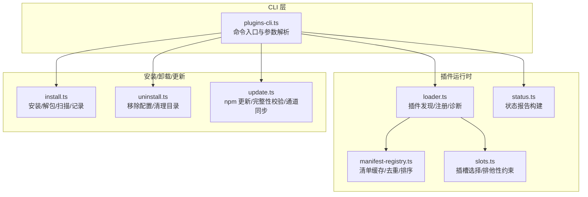
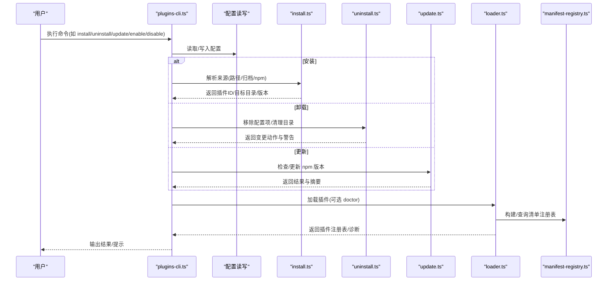
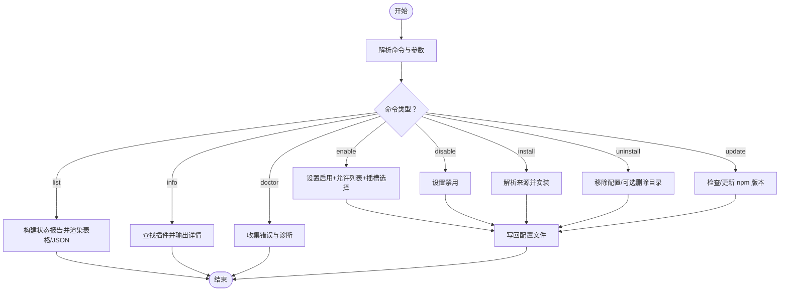
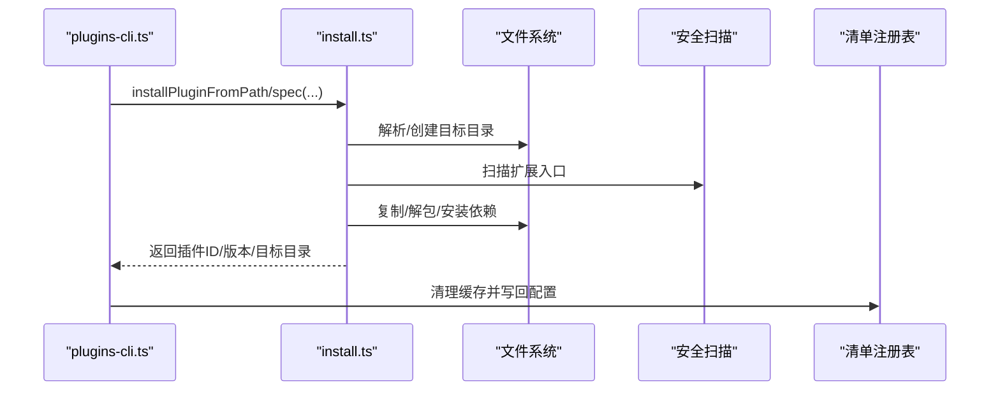
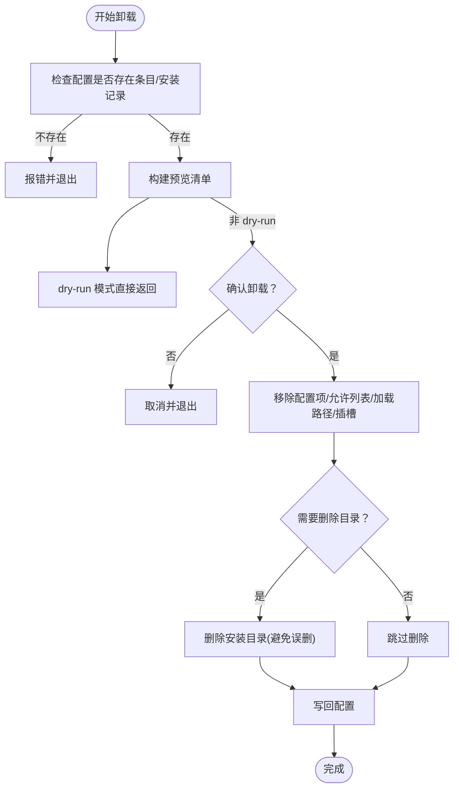
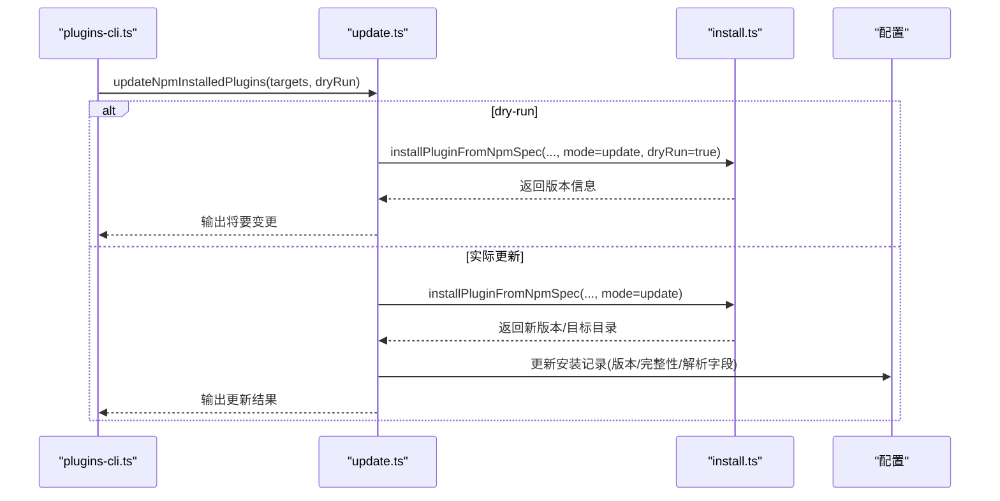
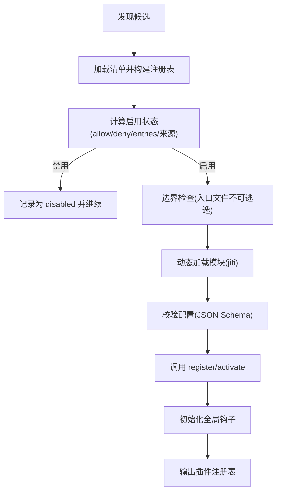
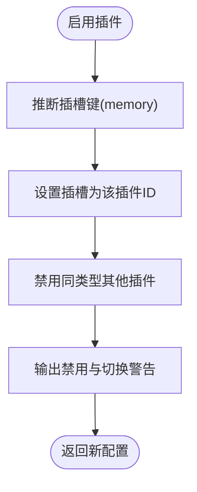
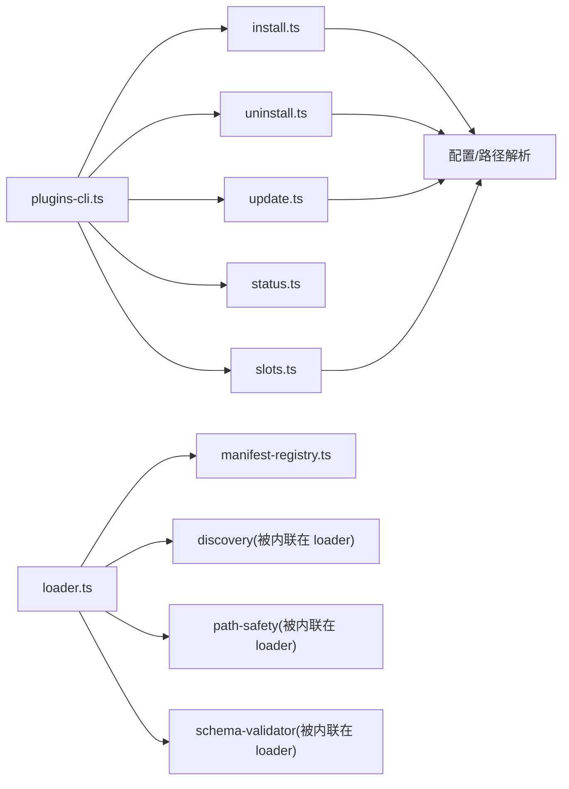

# 插件管理命令

<cite>
**本文档引用的文件**
- [src/cli/plugins-cli.ts](file://src/cli/plugins-cli.ts)
- [src/plugins/loader.ts](file://src/plugins/loader.ts)
- [src/plugins/install.ts](file://src/plugins/install.ts)
- [src/plugins/uninstall.ts](file://src/plugins/uninstall.ts)
- [src/plugins/update.ts](file://src/plugins/update.ts)
- [src/plugins/status.ts](file://src/plugins/status.ts)
- [src/plugins/slots.ts](file://src/plugins/slots.ts)
- [src/plugins/manifest-registry.ts](file://src/plugins/manifest-registry.ts)
- [src/channels/plugins/catalog.ts](file://src/channels/plugins/catalog.ts)
- [SECURITY.md](file://SECURITY.md)
</cite>

## 目录

1. [简介](#简介)
2. [项目结构](#项目结构)
3. [核心组件](#核心组件)
4. [架构总览](#架构总览)
5. [详细组件分析](#详细组件分析)
6. [依赖关系分析](#依赖关系分析)
7. [性能考量](#性能考量)
8. [故障排查指南](#故障排查指南)
9. [结论](#结论)
10. [附录](#附录)

## 简介

本文件面向插件开发者与系统管理员，提供 OpenClaw 插件管理命令的完整使用与实现说明。内容覆盖插件的安装、卸载、启用、禁用、更新等生命周期操作；解释插件注册机制、依赖管理与版本控制；并给出开发、测试与发布流程中的命令使用指南。同时，文档阐述了插件配置、权限与安全控制策略，帮助读者在保证安全的前提下高效管理插件生态。

## 项目结构

OpenClaw 的插件管理由 CLI 命令层与插件运行时加载器协同完成：

- CLI 层负责解析用户输入、执行安装/卸载/更新等动作，并写回配置文件
- 运行时加载器负责发现插件、校验清单、构建注册表、执行注册函数并初始化全局钩子

图表来源

- [src/cli/plugins-cli.ts](file://src/cli/plugins-cli.ts#L161-L798)
- [src/plugins/loader.ts](file://src/plugins/loader.ts#L368-L717)
- [src/plugins/install.ts](file://src/plugins/install.ts#L1-L490)
- [src/plugins/uninstall.ts](file://src/plugins/uninstall.ts#L1-L238)
- [src/plugins/update.ts](file://src/plugins/update.ts#L1-L468)
- [src/plugins/status.ts](file://src/plugins/status.ts#L15-L36)
- [src/plugins/manifest-registry.ts](file://src/plugins/manifest-registry.ts#L134-L249)
- [src/plugins/slots.ts](file://src/plugins/slots.ts#L37-L109)

章节来源

- [src/cli/plugins-cli.ts](file://src/cli/plugins-cli.ts#L161-L798)
- [src/plugins/loader.ts](file://src/plugins/loader.ts#L368-L717)

## 核心组件

- 插件 CLI 命令集：list/info/enable/disable/install/uninstall/update/doctor
- 插件加载器：发现候选、加载清单、校验配置、执行注册、初始化钩子
- 安装子系统：支持本地路径、归档包、npm 包三种来源，含依赖安装与安全扫描
- 卸载子系统：从配置移除条目、清理允许列表/加载路径/插槽、可选删除目录
- 更新子系统：基于 npm 规格进行版本更新，支持完整性漂移检测与通道切换
- 插槽系统：内存等插槽的排他性选择，自动禁用其他同类插件
- 清单注册表：缓存与去重，按来源优先级合并，生成状态报告

章节来源

- [src/cli/plugins-cli.ts](file://src/cli/plugins-cli.ts#L171-L798)
- [src/plugins/loader.ts](file://src/plugins/loader.ts#L368-L717)
- [src/plugins/install.ts](file://src/plugins/install.ts#L1-L490)
- [src/plugins/uninstall.ts](file://src/plugins/uninstall.ts#L65-L164)
- [src/plugins/update.ts](file://src/plugins/update.ts#L158-L345)
- [src/plugins/slots.ts](file://src/plugins/slots.ts#L37-L109)
- [src/plugins/manifest-registry.ts](file://src/plugins/manifest-registry.ts#L134-L249)

## 架构总览

下图展示插件管理命令从 CLI 到运行时的调用链路与数据流：

图表来源

- [src/cli/plugins-cli.ts](file://src/cli/plugins-cli.ts#L347-L760)
- [src/plugins/install.ts](file://src/plugins/install.ts#L400-L490)
- [src/plugins/uninstall.ts](file://src/plugins/uninstall.ts#L177-L238)
- [src/plugins/update.ts](file://src/plugins/update.ts#L158-L345)
- [src/plugins/loader.ts](file://src/plugins/loader.ts#L368-L717)
- [src/plugins/manifest-registry.ts](file://src/plugins/manifest-registry.ts#L134-L249)

## 详细组件分析

### CLI 命令与工作流

- list：列出已发现插件，支持 JSON/仅启用/详细模式输出
- info：显示插件详情（状态、来源、版本、工具/钩子/网关方法/提供商/CLI服务等）
- enable/disable：在配置中启用或禁用插件，并应用插槽选择与允许列表
- install：支持本地路径/归档/npm 安装；支持 --link 链接本地路径；支持 --pin 记录精确版本
- uninstall：移除配置条目/安装记录/允许列表/加载路径/内存插槽；可保留文件；支持干跑
- update：更新 npm 安装的插件；支持 --all 与干跑；处理完整性漂移
- doctor：汇总插件错误与诊断信息

图表来源

- [src/cli/plugins-cli.ts](file://src/cli/plugins-cli.ts#L171-L798)

章节来源

- [src/cli/plugins-cli.ts](file://src/cli/plugins-cli.ts#L171-L798)

### 插件安装流程（install）

- 路径来源：本地目录/归档/文件；支持 --link 链接本地路径（不复制）
- npm 来源：校验 npm 规格，下载归档后解包安装；支持 --pin 记录精确版本
- 安全扫描：对扩展入口进行扫描，出现危险模式发出警告
- 依赖安装：安装完成后扫描扩展入口是否存在
- 记录安装：写入安装记录（来源、路径、版本、完整性）

图表来源

- [src/cli/plugins-cli.ts](file://src/cli/plugins-cli.ts#L517-L698)
- [src/plugins/install.ts](file://src/plugins/install.ts#L122-L490)
- [src/plugins/manifest-registry.ts](file://src/plugins/manifest-registry.ts#L51-L53)

章节来源

- [src/cli/plugins-cli.ts](file://src/cli/plugins-cli.ts#L517-L698)
- [src/plugins/install.ts](file://src/plugins/install.ts#L1-L490)

### 插件卸载流程（uninstall）

- 预检：根据配置判断是否可卸载（存在 entries 或 installs）
- 预览：列出将移除的条目（配置项/安装记录/允许列表/加载路径/内存插槽/目录）
- 执行：移除配置项；可选删除目录（链接路径不删除）
- 写回：更新配置文件并输出结果

图表来源

- [src/cli/plugins-cli.ts](file://src/cli/plugins-cli.ts#L381-L514)
- [src/plugins/uninstall.ts](file://src/plugins/uninstall.ts#L177-L238)

章节来源

- [src/cli/plugins-cli.ts](file://src/cli/plugins-cli.ts#L381-L514)
- [src/plugins/uninstall.ts](file://src/plugins/uninstall.ts#L1-L238)

### 插件更新流程（update）

- 目标筛选：支持指定插件ID或 --all
- 干跑：先探测新版本，输出将要发生的变更
- 实际更新：下载/解包/安装新版本，记录安装字段（含 npm 解析信息与完整性）
- 完整性漂移：当实际完整性与记录不符时，询问是否继续
- 通道同步：根据更新通道在本地路径与 npm 之间切换

图表来源

- [src/cli/plugins-cli.ts](file://src/cli/plugins-cli.ts#L700-L760)
- [src/plugins/update.ts](file://src/plugins/update.ts#L158-L345)
- [src/plugins/install.ts](file://src/plugins/install.ts#L400-L440)

章节来源

- [src/cli/plugins-cli.ts](file://src/cli/plugins-cli.ts#L700-L760)
- [src/plugins/update.ts](file://src/plugins/update.ts#L1-L468)

### 插件注册与加载机制（loader）

- 发现：从工作区与额外加载路径发现候选插件
- 清单：加载 openclaw.plugin.json，构建清单注册表（含缓存、去重、来源优先级）
- 启用判定：结合 allow/deny/entries/插件来源决定是否启用
- 安全边界：校验入口文件未逃逸插件根目录
- 注册：通过 jiti 动态加载模块，调用 register/activate 导出
- 配置校验：使用 JSON Schema 校验插件配置
- 全局钩子：初始化全局钩子运行器

图表来源

- [src/plugins/loader.ts](file://src/plugins/loader.ts#L398-L717)
- [src/plugins/manifest-registry.ts](file://src/plugins/manifest-registry.ts#L134-L249)

章节来源

- [src/plugins/loader.ts](file://src/plugins/loader.ts#L368-L717)
- [src/plugins/manifest-registry.ts](file://src/plugins/manifest-registry.ts#L134-L249)

### 插槽与排他性选择

- 插槽键：当前支持 memory 插槽
- 默认值：memory 插槽默认为 memory-core
- 排他性：启用某插件时，自动禁用同类型其他插件，并发出警告
- 诊断：若插槽未匹配到任何插件，会发出警告

图表来源

- [src/plugins/slots.ts](file://src/plugins/slots.ts#L37-L109)
- [src/cli/plugins-cli.ts](file://src/cli/plugins-cli.ts#L117-L133)

章节来源

- [src/plugins/slots.ts](file://src/plugins/slots.ts#L1-L109)
- [src/cli/plugins-cli.ts](file://src/cli/plugins-cli.ts#L117-L133)

### 插件状态报告与诊断（doctor）

- 构建状态报告：加载插件注册表，汇总插件与诊断信息
- doctor 命令：输出插件错误与诊断，附带文档链接

章节来源

- [src/plugins/status.ts](file://src/plugins/status.ts#L15-L36)
- [src/cli/plugins-cli.ts](file://src/cli/plugins-cli.ts#L762-L796)

### 插件目录与外部目录（Channel Catalog）

- 支持从多个目录与环境变量路径加载外部插件目录
- 将插件元信息转换为 UI 友好的目录条目

章节来源

- [src/channels/plugins/catalog.ts](file://src/channels/plugins/catalog.ts#L90-L119)
- [src/channels/plugins/catalog.ts](file://src/channels/plugins/catalog.ts#L259-L296)

## 依赖关系分析

- CLI 对安装/卸载/更新/状态/插槽模块有直接依赖
- 加载器依赖清单注册表、发现模块、路径安全工具与 JSON Schema 校验
- 安装/更新/卸载均依赖配置读写与状态目录解析
- 插槽系统与允许列表共同影响启用状态

图表来源

- [src/cli/plugins-cli.ts](file://src/cli/plugins-cli.ts#L1-L27)
- [src/plugins/loader.ts](file://src/plugins/loader.ts#L1-L26)
- [src/plugins/install.ts](file://src/plugins/install.ts#L1-L28)
- [src/plugins/uninstall.ts](file://src/plugins/uninstall.ts#L1-L6)
- [src/plugins/update.ts](file://src/plugins/update.ts#L1-L9)
- [src/plugins/slots.ts](file://src/plugins/slots.ts#L1-L3)

章节来源

- [src/cli/plugins-cli.ts](file://src/cli/plugins-cli.ts#L1-L27)
- [src/plugins/loader.ts](file://src/plugins/loader.ts#L1-L26)

## 性能考量

- 清单注册表缓存：可通过环境变量控制缓存 TTL，减少重复扫描
- 插件加载缓存：按工作区与加载路径构建缓存键，避免重复加载
- 干跑模式：在安装/更新前先探测，降低误操作风险
- 安全扫描：仅告警不阻断，避免安装阶段耗时过长

章节来源

- [src/plugins/manifest-registry.ts](file://src/plugins/manifest-registry.ts#L47-L76)
- [src/plugins/loader.ts](file://src/plugins/loader.ts#L374-L386)
- [src/plugins/install.ts](file://src/plugins/install.ts#L199-L221)

## 故障排查指南

- doctor 命令：查看插件错误与诊断，定位加载失败原因
- 错误分类：插件加载失败、配置无效、入口逃逸、清单缺失等
- 允许列表与来源：若 plugins.allow 为空，可能自动加载非内置插件，需明确信任
- 完整性漂移：更新时若检测到 npm 完整性不一致，需确认是否继续

章节来源

- [src/cli/plugins-cli.ts](file://src/cli/plugins-cli.ts#L762-L796)
- [src/plugins/loader.ts](file://src/plugins/loader.ts#L312-L336)
- [src/plugins/update.ts](file://src/plugins/update.ts#L132-L156)

## 结论

OpenClaw 的插件管理命令以 CLI 为中心，结合运行时加载器与安装/卸载/更新子系统，形成完整的生命周期闭环。通过清单注册表、插槽排他性与严格的边界检查，既保证了灵活性，也强化了安全性。配合 doctor 诊断与干跑能力，管理员与开发者可以安全、可控地管理插件生态。

## 附录

- 安全与信任边界：安装或启用插件即授予与本地代码同等的信任级别，应严格限制允许列表与来源
- 开发者建议：在本地路径开发时可使用 --link；发布前进行安全审计与完整性校验

章节来源

- [SECURITY.md](file://SECURITY.md#L100-L106)
