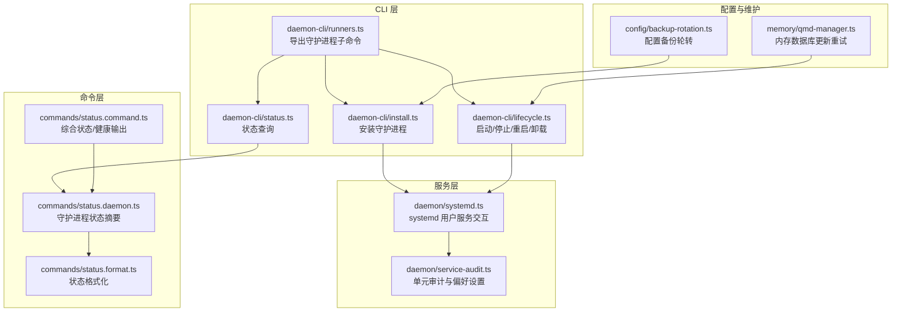
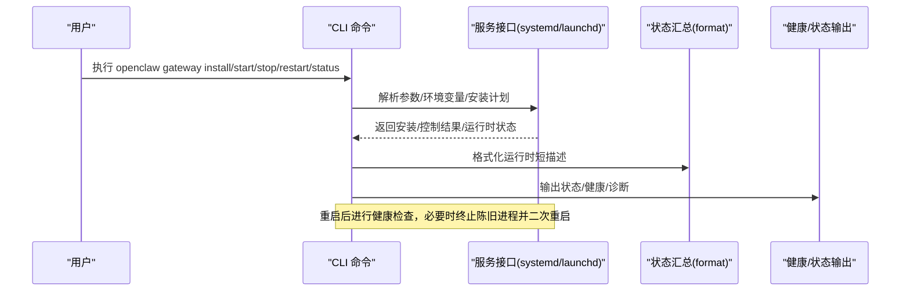
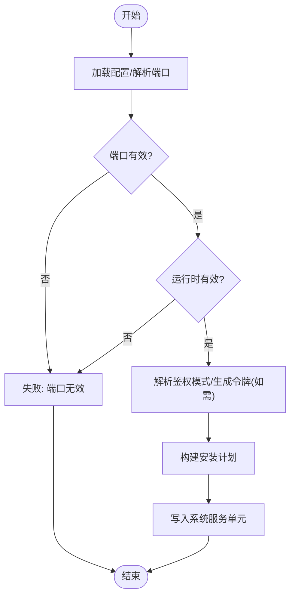
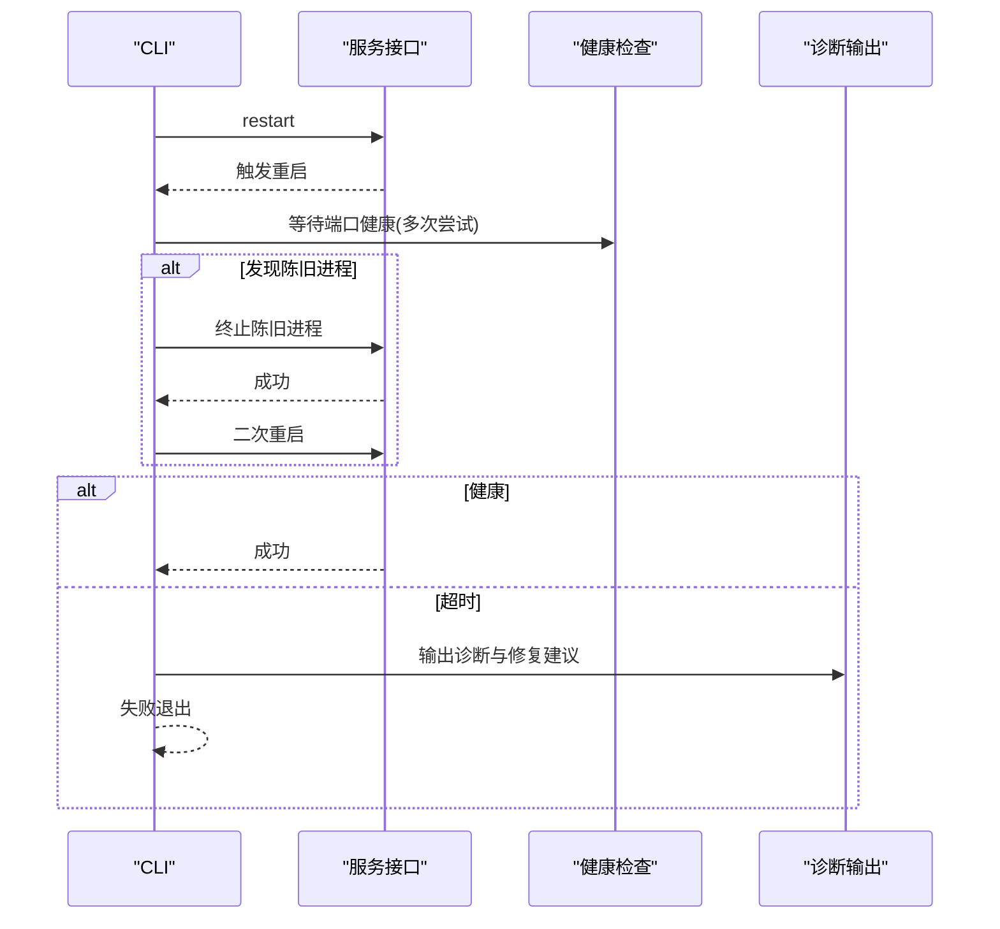
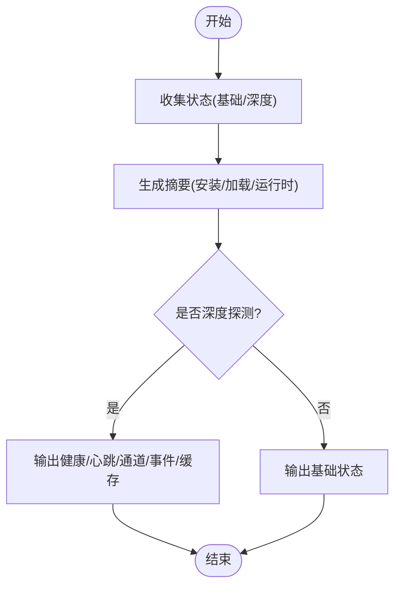
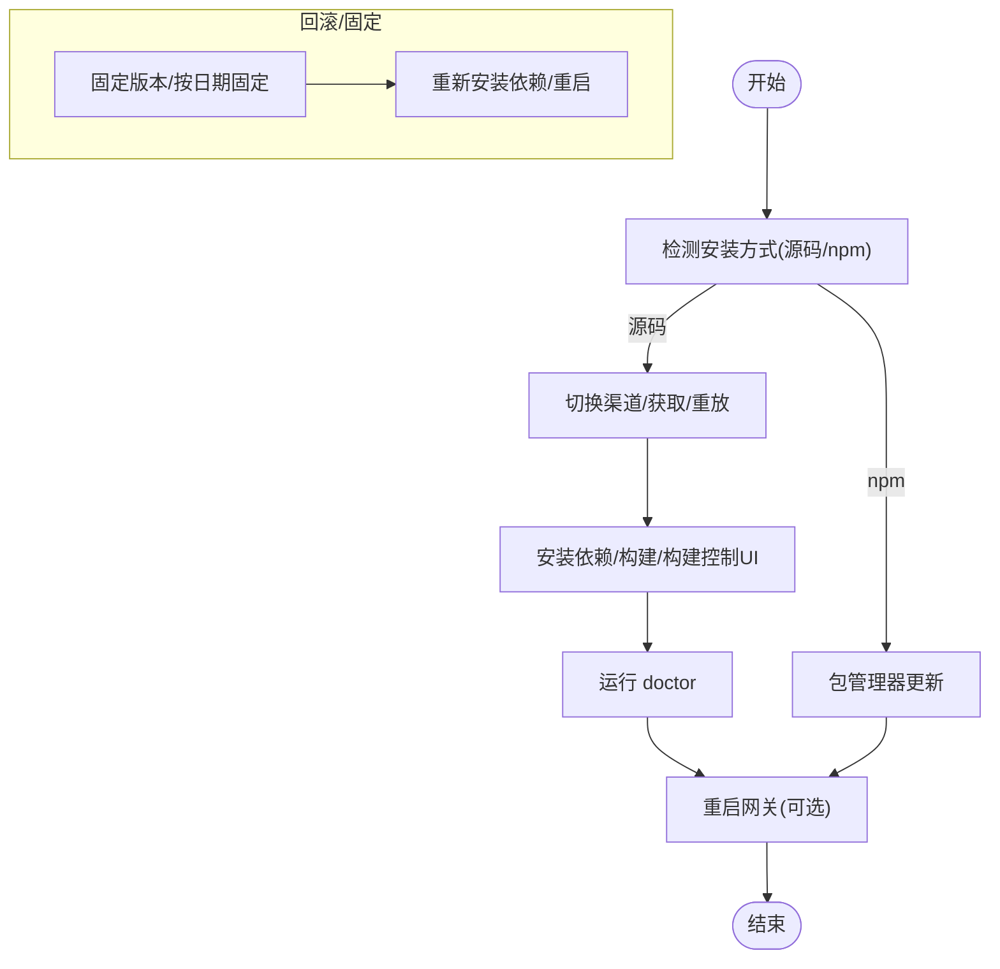
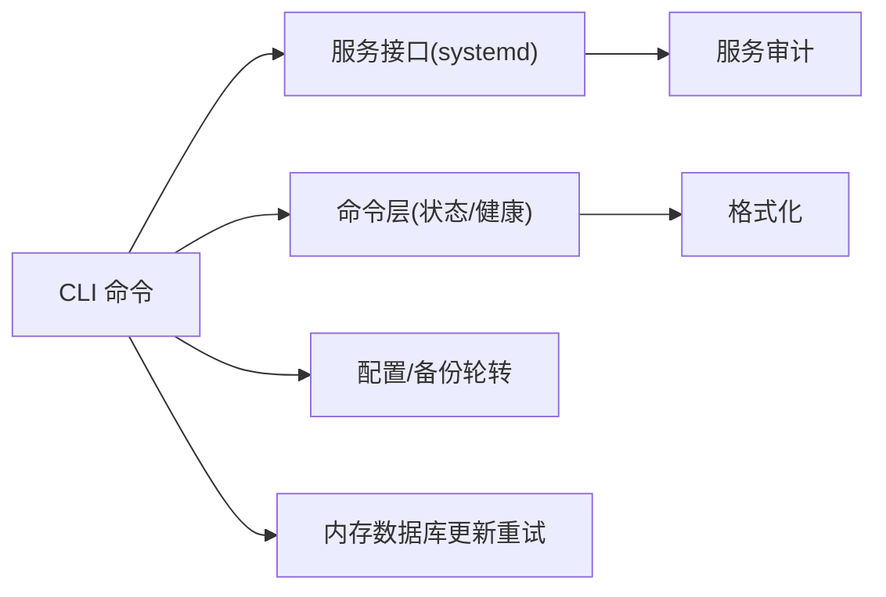

# 系统管理命令

<cite>
**本文引用的文件**
- [src/cli/daemon-cli/install.ts](file://src/cli/daemon-cli/install.ts)
- [src/cli/daemon-cli/lifecycle.ts](file://src/cli/daemon-cli/lifecycle.ts)
- [src/cli/daemon-cli/status.ts](file://src/cli/daemon-cli/status.ts)
- [src/cli/daemon-cli/runners.ts](file://src/cli/daemon-cli/runners.ts)
- [src/commands/status.daemon.ts](file://src/commands/status.daemon.ts)
- [src/commands/status.format.ts](file://src/commands/status.format.ts)
- [src/daemon/systemd.ts](file://src/daemon/systemd.ts)
- [src/daemon/service-audit.ts](file://src/daemon/service-audit.ts)
- [src/config/backup-rotation.ts](file://src/config/backup-rotation.ts)
- [src/memory/qmd-manager.ts](file://src/memory/qmd-manager.ts)
- [src/commands/status.command.ts](file://src/commands/status.command.ts)
- [src/cli/program/register.maintenance.test.ts](file://src/cli/program/register.maintenance.test.ts)
- [docs/zh-CN/install/updating.md](file://docs/zh-CN/install/updating.md)
</cite>

## 目录

1. [简介](#简介)
2. [项目结构](#项目结构)
3. [核心组件](#核心组件)
4. [架构总览](#架构总览)
5. [详细组件分析](#详细组件分析)
6. [依赖关系分析](#依赖关系分析)
7. [性能与资源管理](#性能与资源管理)
8. [故障诊断与排障指南](#故障诊断与排障指南)
9. [结论](#结论)
10. [附录](#附录)

## 简介

本文件面向系统管理员，提供 OpenClaw 系统管理命令的完整参考，覆盖以下主题：

- 守护进程管理：安装、启动、停止、重启、卸载、状态查询
- 系统更新与回滚：渠道切换、版本固定、一次性安装指定标签/版本
- 健康检查与状态报告：基础状态与深度探测
- 故障诊断与自动化修复：doctor 命令、重启后健康检查、重启诊断输出
- 维护与运维：备份轮转、内存数据库更新重试、日志与诊断输出

## 项目结构

OpenClaw 的系统管理命令主要由 CLI 层与后端服务层协作完成：

- CLI 层负责解析参数、格式化输出、调用后端服务
- 后端服务层负责与系统服务（如 systemd 或 launchd）交互、读取运行时状态、执行安装/卸载/重启等动作
- 命令层提供健康检查、状态汇总、备份轮转、内存数据库维护等功能

**图表来源**

- [src/cli/daemon-cli/runners.ts](file://src/cli/daemon-cli/runners.ts#L1-L8)
- [src/cli/daemon-cli/install.ts](file://src/cli/daemon-cli/install.ts#L1-L178)
- [src/cli/daemon-cli/lifecycle.ts](file://src/cli/daemon-cli/lifecycle.ts#L1-L144)
- [src/cli/daemon-cli/status.ts](file://src/cli/daemon-cli/status.ts#L1-L21)
- [src/commands/status.daemon.ts](file://src/commands/status.daemon.ts#L1-L43)
- [src/commands/status.format.ts](file://src/commands/status.format.ts#L50-L73)
- [src/commands/status.command.ts](file://src/commands/status.command.ts#L295-L335)
- [src/daemon/systemd.ts](file://src/daemon/systemd.ts#L139-L182)
- [src/daemon/service-audit.ts](file://src/daemon/service-audit.ts#L58-L120)
- [src/config/backup-rotation.ts](file://src/config/backup-rotation.ts#L1-L26)
- [src/memory/qmd-manager.ts](file://src/memory/qmd-manager.ts#L907-L945)

**章节来源**

- [src/cli/daemon-cli/runners.ts](file://src/cli/daemon-cli/runners.ts#L1-L8)
- [src/cli/daemon-cli/install.ts](file://src/cli/daemon-cli/install.ts#L1-L178)
- [src/cli/daemon-cli/lifecycle.ts](file://src/cli/daemon-cli/lifecycle.ts#L1-L144)
- [src/cli/daemon-cli/status.ts](file://src/cli/daemon-cli/status.ts#L1-L21)
- [src/commands/status.daemon.ts](file://src/commands/status.daemon.ts#L1-L43)
- [src/commands/status.format.ts](file://src/commands/status.format.ts#L50-L73)
- [src/commands/status.command.ts](file://src/commands/status.command.ts#L295-L335)
- [src/daemon/systemd.ts](file://src/daemon/systemd.ts#L139-L182)
- [src/daemon/service-audit.ts](file://src/daemon/service-audit.ts#L58-L120)
- [src/config/backup-rotation.ts](file://src/config/backup-rotation.ts#L1-L26)
- [src/memory/qmd-manager.ts](file://src/memory/qmd-manager.ts#L907-L945)

## 核心组件

- 守护进程安装与卸载：解析端口、运行时、鉴权令牌，生成安装计划并写入系统服务单元，支持强制重装与 JSON 输出
- 生命周期控制：启动、停止、重启、卸载；重启后进行健康检查，必要时终止陈旧进程并二次重启
- 状态查询：汇总守护进程安装/加载状态、运行时短描述、健康探测结果
- 健康检查与状态报告：基础状态与深度探测，输出通道健康、心跳、事件队列、缓存命中率等
- 维护与运维：配置备份轮转（保留 N 份）、内存数据库更新重试（指数退避）、doctor 命令集成

**章节来源**

- [src/cli/daemon-cli/install.ts](file://src/cli/daemon-cli/install.ts#L26-L178)
- [src/cli/daemon-cli/lifecycle.ts](file://src/cli/daemon-cli/lifecycle.ts#L38-L144)
- [src/cli/daemon-cli/status.ts](file://src/cli/daemon-cli/status.ts#L7-L21)
- [src/commands/status.daemon.ts](file://src/commands/status.daemon.ts#L13-L43)
- [src/commands/status.format.ts](file://src/commands/status.format.ts#L50-L73)
- [src/commands/status.command.ts](file://src/commands/status.command.ts#L295-L335)
- [src/config/backup-rotation.ts](file://src/config/backup-rotation.ts#L1-L26)
- [src/memory/qmd-manager.ts](file://src/memory/qmd-manager.ts#L907-L945)

## 架构总览

下图展示从 CLI 到服务层的关键调用链路，以及健康检查与重启诊断的反馈闭环。

**图表来源**

- [src/cli/daemon-cli/install.ts](file://src/cli/daemon-cli/install.ts#L26-L178)
- [src/cli/daemon-cli/lifecycle.ts](file://src/cli/daemon-cli/lifecycle.ts#L70-L144)
- [src/cli/daemon-cli/status.ts](file://src/cli/daemon-cli/status.ts#L7-L21)
- [src/commands/status.format.ts](file://src/commands/status.format.ts#L50-L73)
- [src/commands/status.command.ts](file://src/commands/status.command.ts#L295-L335)

## 详细组件分析

### 守护进程安装（install）

- 功能要点
  - 端口解析与校验、运行时类型校验（node/bun）
  - 鉴权模式解析：token/password/tailscale，必要时自动生成并持久化令牌
  - 构建安装计划（程序参数、工作目录、环境变量），写入系统服务单元
  - 支持 force 强制重装、Nix 模式禁用安装
  - JSON 输出模式与人类可读输出并存
- 关键路径
  - 参数解析与校验：[端口解析](file://src/cli/daemon-cli/install.ts#L36-L45)、[运行时校验](file://src/cli/daemon-cli/install.ts#L46-L50)
  - 鉴权与令牌处理：[鉴权解析与令牌生成](file://src/cli/daemon-cli/install.ts#L80-L144)
  - 安装计划与写入：[安装计划构建](file://src/cli/daemon-cli/install.ts#L146-L159)、[安装执行](file://src/cli/daemon-cli/install.ts#L161-L176)

**图表来源**

- [src/cli/daemon-cli/install.ts](file://src/cli/daemon-cli/install.ts#L36-L176)

**章节来源**

- [src/cli/daemon-cli/install.ts](file://src/cli/daemon-cli/install.ts#L26-L178)

### 生命周期控制（start/stop/restart/uninstall）

- 功能要点
  - start：若服务未加载，给出启动建议与命令提示
  - stop/restart/uninstall：封装通用控制逻辑，支持 JSON 输出与错误处理
  - restart：健康检查与诊断
    - 计算等待时间，等待端口健康
    - 若发现陈旧进程，先终止再二次重启
    - 超时输出诊断建议与修复命令
- 关键路径
  - 控制入口：[生命周期导出](file://src/cli/daemon-cli/runners.ts#L2-L7)
  - 卸载/启动/停止：[控制实现](file://src/cli/daemon-cli/lifecycle.ts#L38-L63)
  - 重启与健康检查：[重启主流程](file://src/cli/daemon-cli/lifecycle.ts#L70-L144)

**图表来源**

- [src/cli/daemon-cli/lifecycle.ts](file://src/cli/daemon-cli/lifecycle.ts#L70-L144)

**章节来源**

- [src/cli/daemon-cli/runners.ts](file://src/cli/daemon-cli/runners.ts#L2-L7)
- [src/cli/daemon-cli/lifecycle.ts](file://src/cli/daemon-cli/lifecycle.ts#L38-L144)

### 状态查询（status）

- 功能要点
  - 支持基础状态与深度探测（--deep）
  - 聚合守护进程安装/加载状态、运行时短描述
  - 健康检查输出：网关可达性、通道健康、心跳、事件队列、缓存命中率等
- 关键路径
  - CLI 入口：[状态命令入口](file://src/cli/daemon-cli/status.ts#L7-L21)
  - 状态摘要：[守护进程状态摘要](file://src/commands/status.daemon.ts#L13-L43)
  - 运行时短描述格式化：[格式化函数](file://src/commands/status.format.ts#L50-L73)
  - 健康输出表格：[健康输出渲染](file://src/commands/status.command.ts#L591-L644)

**图表来源**

- [src/cli/daemon-cli/status.ts](file://src/cli/daemon-cli/status.ts#L7-L21)
- [src/commands/status.daemon.ts](file://src/commands/status.daemon.ts#L13-L43)
- [src/commands/status.format.ts](file://src/commands/status.format.ts#L50-L73)
- [src/commands/status.command.ts](file://src/commands/status.command.ts#L591-L644)

**章节来源**

- [src/cli/daemon-cli/status.ts](file://src/cli/daemon-cli/status.ts#L7-L21)
- [src/commands/status.daemon.ts](file://src/commands/status.daemon.ts#L13-L43)
- [src/commands/status.format.ts](file://src/commands/status.format.ts#L50-L73)
- [src/commands/status.command.ts](file://src/commands/status.command.ts#L295-L335)

### 系统更新、回滚与备份恢复

- 更新（openclaw update）
  - 源码安装：切换渠道、rebase、安装依赖、构建、运行 doctor、默认重启网关
  - npm/pnpm 安装：通过包管理器更新；若无法检测安装方式，使用“更新（全局安装）”
  - 固定版本/按日期固定：通过 git checkout 指定提交
- 回滚
  - 切换回稳定/开发/测试渠道；或检出历史提交
- 备份与恢复
  - 配置备份轮转：保留 N 份历史备份，自动滚动
  - 恢复：直接使用最近备份文件（.bak/.bak.1/.bak.2…）

**图表来源**

- [docs/zh-CN/install/updating.md](file://docs/zh-CN/install/updating.md#L60-L234)
- [src/config/backup-rotation.ts](file://src/config/backup-rotation.ts#L1-L26)

**章节来源**

- [docs/zh-CN/install/updating.md](file://docs/zh-CN/install/updating.md#L60-L234)
- [src/config/backup-rotation.ts](file://src/config/backup-rotation.ts#L1-L26)

### 故障诊断与自动化修复

- doctor 命令集成
  - 维护模式 CLI 将 doctor、dashboard、reset、uninstall 等命令映射为子命令，支持 --fix/--yes/--no-open 等选项
- 重启后健康检查与诊断
  - 若重启后端口未就绪，输出诊断信息与修复建议（如再次运行 doctor、查看状态）
  - 若发现陈旧进程，自动终止并二次重启
- 日志与诊断输出
  - JSON 输出模式便于自动化集成
  - 人类可读输出包含详细提示与修复命令

**章节来源**

- [src/cli/program/register.maintenance.test.ts](file://src/cli/program/register.maintenance.test.ts#L52-L104)
- [src/cli/daemon-cli/lifecycle.ts](file://src/cli/daemon-cli/lifecycle.ts#L85-L141)

## 依赖关系分析

- CLI 与服务层
  - CLI 通过服务接口与系统服务交互（systemd 用户服务）
  - 服务接口负责解析可用性、读取运行时状态、执行控制动作
- 状态与健康
  - 状态摘要依赖运行时短描述格式化
  - 健康输出依赖状态汇总与通道探测
- 维护工具
  - 备份轮转与内存数据库更新重试分别作用于配置与数据层

**图表来源**

- [src/daemon/systemd.ts](file://src/daemon/systemd.ts#L139-L182)
- [src/daemon/service-audit.ts](file://src/daemon/service-audit.ts#L58-L120)
- [src/commands/status.format.ts](file://src/commands/status.format.ts#L50-L73)
- [src/config/backup-rotation.ts](file://src/config/backup-rotation.ts#L1-L26)
- [src/memory/qmd-manager.ts](file://src/memory/qmd-manager.ts#L907-L945)

**章节来源**

- [src/daemon/systemd.ts](file://src/daemon/systemd.ts#L139-L182)
- [src/daemon/service-audit.ts](file://src/daemon/service-audit.ts#L58-L120)
- [src/commands/status.format.ts](file://src/commands/status.format.ts#L50-L73)
- [src/config/backup-rotation.ts](file://src/config/backup-rotation.ts#L1-L26)
- [src/memory/qmd-manager.ts](file://src/memory/qmd-manager.ts#L907-L945)

## 性能与资源管理

- 缓存命中率与磁盘水位
  - 状态输出包含缓存命中率统计，有助于评估缓存效率
  - 会话存储支持最大磁盘字节与高水位阈值配置，避免磁盘占用过高
- 内存数据库更新重试
  - 更新失败时采用指数退避重试，提升稳定性
- 健康检查与心跳
  - 通道健康探测与心跳周期有助于及时发现异常

**章节来源**

- [src/commands/status.format.ts](file://src/commands/status.format.ts#L37-L48)
- [src/config/sessions/store.ts](file://src/config/sessions/store.ts#L380-L424)
- [src/memory/qmd-manager.ts](file://src/memory/qmd-manager.ts#L907-L945)
- [src/commands/status.command.ts](file://src/commands/status.command.ts#L302-L330)

## 故障诊断与排障指南

- 常见问题与修复
  - 重启超时：检查端口占用、进程状态、日志；必要时终止陈旧进程并二次重启
  - 服务不可用：确认 systemd 用户服务可用性，检查单元文件与依赖
  - 配置损坏：使用备份轮转恢复最近一次有效配置
- 自动化诊断
  - doctor 命令非交互模式与 --yes/--fix 选项，适合自动化脚本
  - JSON 输出便于集成到监控与告警系统

**章节来源**

- [src/cli/daemon-cli/lifecycle.ts](file://src/cli/daemon-cli/lifecycle.ts#L85-L141)
- [src/daemon/systemd.ts](file://src/daemon/systemd.ts#L139-L182)
- [src/config/backup-rotation.ts](file://src/config/backup-rotation.ts#L1-L26)
- [src/cli/program/register.maintenance.test.ts](file://src/cli/program/register.maintenance.test.ts#L52-L104)

## 结论

OpenClaw 提供了完善的系统管理命令体系，覆盖守护进程全生命周期、系统更新与回滚、健康检查与故障诊断、维护与资源管理。通过 CLI 与服务层的清晰分层，既满足日常运维需求，又支持自动化集成与扩展。

## 附录

- 维护模式 CLI 子命令映射与选项
  - doctor：支持 --fix/--yes/--non-interactive
  - dashboard：支持 --no-open
  - reset：传递相关选项
  - uninstall：卸载前停止服务并断言卸载后未加载

**章节来源**

- [src/cli/program/register.maintenance.test.ts](file://src/cli/program/register.maintenance.test.ts#L52-L104)
