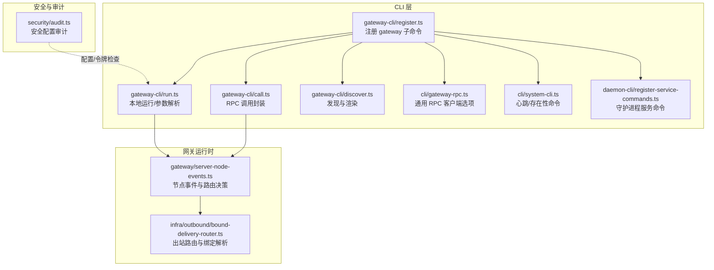
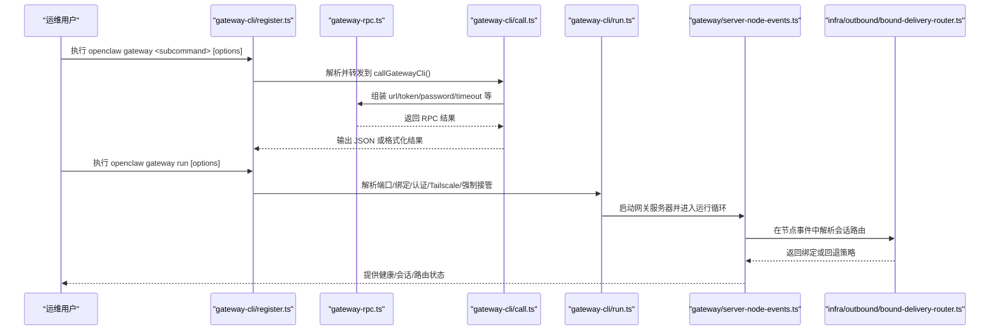
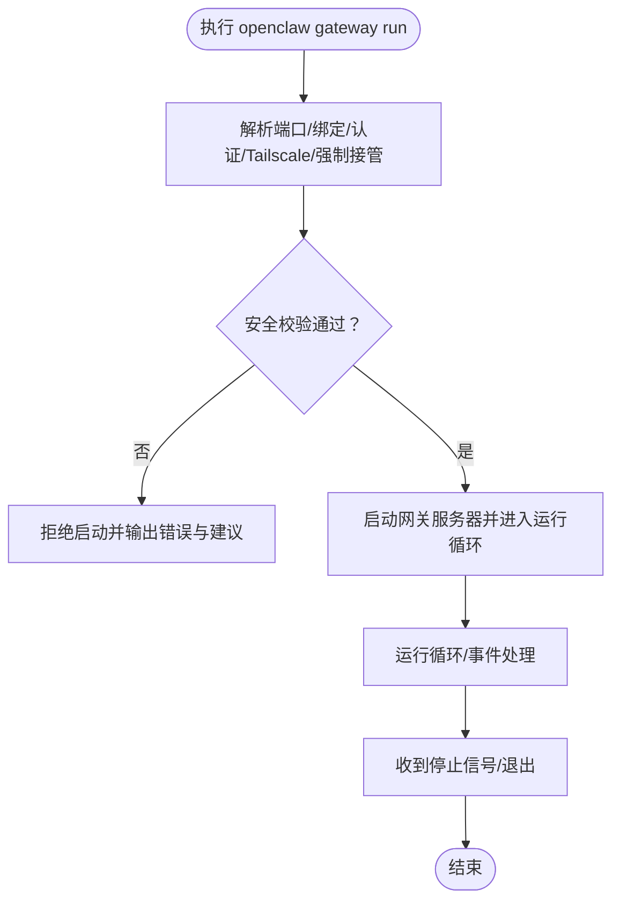
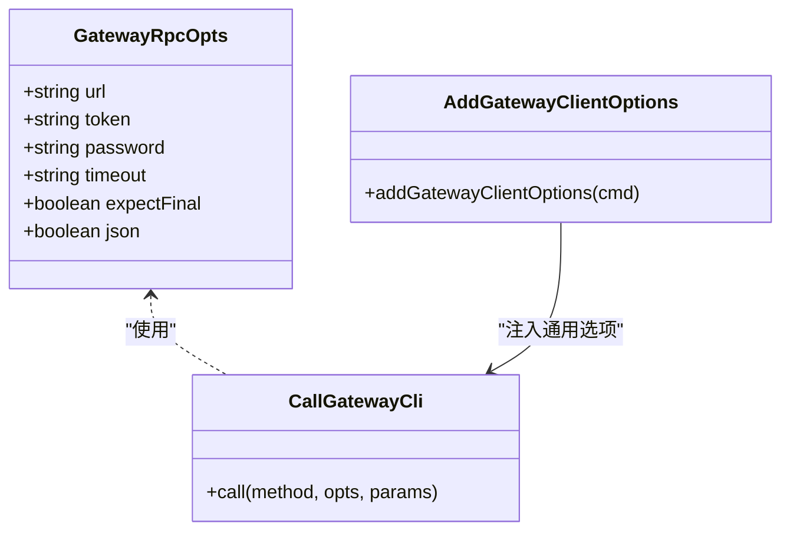
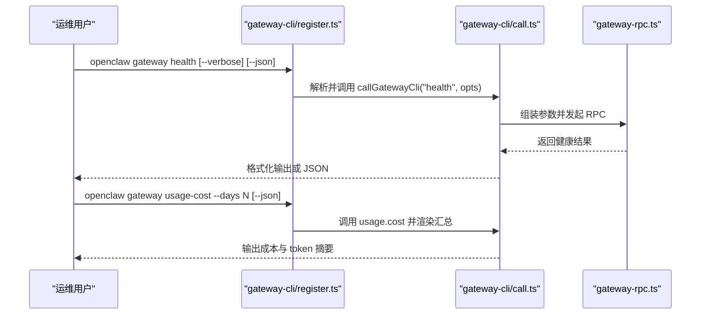
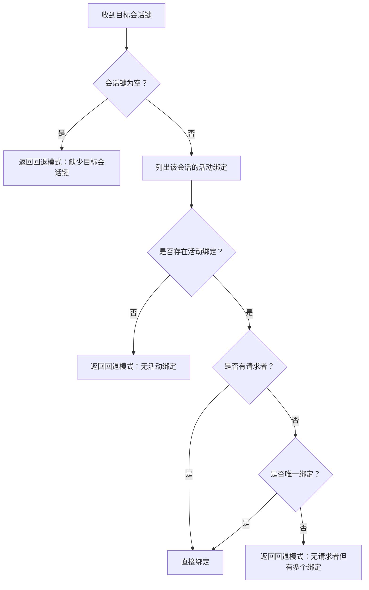
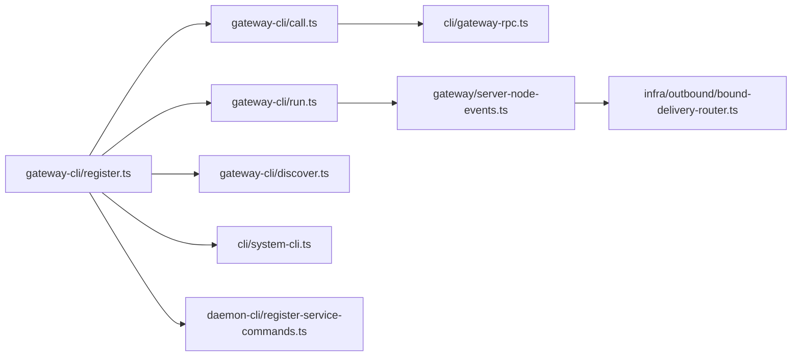
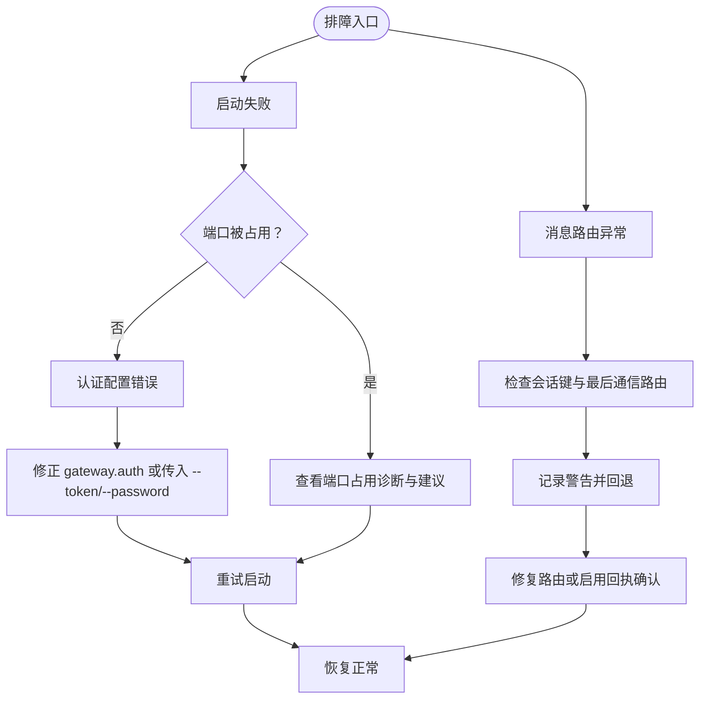

# 网关控制命令

<cite>
**本文引用的文件**
- [src/cli/gateway-cli/register.ts](file://src/cli/gateway-cli/register.ts)
- [src/cli/gateway-cli/call.ts](file://src/cli/gateway-cli/call.ts)
- [src/cli/gateway-cli/run.ts](file://src/cli/gateway-cli/run.ts)
- [src/cli/gateway-cli/discover.ts](file://src/cli/gateway-cli/discover.ts)
- [src/cli/gateway-rpc.ts](file://src/cli/gateway-rpc.ts)
- [src/cli/system-cli.ts](file://src/cli/system-cli.ts)
- [src/cli/daemon-cli/register-service-commands.ts](file://src/cli/daemon-cli/register-service-commands.ts)
- [src/infra/outbound/bound-delivery-router.ts](file://src/infra/outbound/bound-delivery-router.ts)
- [src/gateway/server-node-events.ts](file://src/gateway/server-node-events.ts)
- [src/security/audit.ts](file://src/security/audit.ts)
- [docs/cli/health.md](file://docs/cli/health.md)
</cite>

## 目录

1. [简介](#简介)
2. [项目结构](#项目结构)
3. [核心组件](#核心组件)
4. [架构总览](#架构总览)
5. [详细组件分析](#详细组件分析)
6. [依赖关系分析](#依赖关系分析)
7. [性能考虑](#性能考虑)
8. [故障排查指南](#故障排查指南)
9. [结论](#结论)
10. [附录](#附录)

## 简介

本文件面向 OpenClaw 网关管理员，系统化梳理“网关控制命令”的启动、停止、配置与监控能力；解释网关与客户端的连接管理、会话控制与消息路由机制；并提供性能调优、负载均衡与高可用配置建议，以及日志分析、故障诊断与安全配置的运维实践。

## 项目结构

围绕网关控制命令的相关模块主要位于 CLI 层与网关运行时层：

- CLI 注册与子命令：gateway-cli/register.ts、gateway-cli/call.ts、gateway-cli/run.ts、gateway-cli/discover.ts
- CLI 通用 RPC 客户端封装：gateway-rpc.ts
- 系统级心跳与存在性命令：system-cli.ts
- 守护进程服务命令（安装/启动/停止/重启/卸载）：daemon-cli/register-service-commands.ts
- 消息路由与会话绑定：infra/outbound/bound-delivery-router.ts、gateway/server-node-events.ts
- 安全审计与配置检查：security/audit.ts
- 健康检查文档参考：docs/cli/health.md

**图表来源**

- [src/cli/gateway-cli/register.ts](file://src/cli/gateway-cli/register.ts#L89-L278)
- [src/cli/gateway-cli/call.ts](file://src/cli/gateway-cli/call.ts#L1-L44)
- [src/cli/gateway-cli/run.ts](file://src/cli/gateway-cli/run.ts#L1-L438)
- [src/cli/gateway-cli/discover.ts](file://src/cli/gateway-cli/discover.ts#L1-L112)
- [src/cli/gateway-rpc.ts](file://src/cli/gateway-rpc.ts#L1-L48)
- [src/cli/system-cli.ts](file://src/cli/system-cli.ts#L73-L132)
- [src/cli/daemon-cli/register-service-commands.ts](file://src/cli/daemon-cli/register-service-commands.ts#L70-L101)
- [src/gateway/server-node-events.ts](file://src/gateway/server-node-events.ts#L383-L421)
- [src/infra/outbound/bound-delivery-router.ts](file://src/infra/outbound/bound-delivery-router.ts#L55-L91)
- [src/security/audit.ts](file://src/security/audit.ts#L444-L476)

**章节来源**

- [src/cli/gateway-cli/register.ts](file://src/cli/gateway-cli/register.ts#L89-L278)
- [src/cli/gateway-cli/run.ts](file://src/cli/gateway-cli/run.ts#L1-L438)
- [src/cli/gateway-cli/call.ts](file://src/cli/gateway-cli/call.ts#L1-L44)
- [src/cli/gateway-cli/discover.ts](file://src/cli/gateway-cli/discover.ts#L1-L112)
- [src/cli/gateway-rpc.ts](file://src/cli/gateway-rpc.ts#L1-L48)
- [src/cli/system-cli.ts](file://src/cli/system-cli.ts#L73-L132)
- [src/cli/daemon-cli/register-service-commands.ts](file://src/cli/daemon-cli/register-service-commands.ts#L70-L101)
- [src/gateway/server-node-events.ts](file://src/gateway/server-node-events.ts#L383-L421)
- [src/infra/outbound/bound-delivery-router.ts](file://src/infra/outbound/bound-delivery-router.ts#L55-L91)
- [src/security/audit.ts](file://src/security/audit.ts#L444-L476)

## 核心组件

- 网关命令注册器：负责注册 gateway run、status/probe、discover、call、usage-cost、health 等子命令，并统一处理认证与超时等通用选项。
- RPC 客户端封装：提供 --url/--token/--password/--timeout/--expect-final/--json 等通用选项，屏蔽底层连接细节。
- 运行参数解析与校验：解析端口、绑定模式、认证模式、Tailscale 暴露模式、强制接管端口等，确保安全与一致性。
- 发现与渲染：通过 Bonjour/Wide-Area DNS 发现网关，去重并渲染主机、端口、TLS、SSH 等信息。
- 系统命令：心跳开关、最近心跳、系统存在性列表等，便于运维观测。
- 守护进程服务命令：安装/启动/停止/重启/卸载网关服务，适配不同平台。
- 出站路由与会话绑定：根据目标会话键解析绑定，支持回退策略与歧义处理。
- 节点事件与路由决策：在节点事件中推导交付通道/目标，必要时发送回执确认。
- 安全审计：检测控制界面设备鉴权禁用、危险配置标志、令牌长度等风险项。

**章节来源**

- [src/cli/gateway-cli/register.ts](file://src/cli/gateway-cli/register.ts#L89-L278)
- [src/cli/gateway-rpc.ts](file://src/cli/gateway-rpc.ts#L14-L47)
- [src/cli/gateway-cli/run.ts](file://src/cli/gateway-cli/run.ts#L116-L135)
- [src/cli/gateway-cli/discover.ts](file://src/cli/gateway-cli/discover.ts#L45-L111)
- [src/cli/system-cli.ts](file://src/cli/system-cli.ts#L73-L132)
- [src/cli/daemon-cli/register-service-commands.ts](file://src/cli/daemon-cli/register-service-commands.ts#L70-L101)
- [src/infra/outbound/bound-delivery-router.ts](file://src/infra/outbound/bound-delivery-router.ts#L55-L91)
- [src/gateway/server-node-events.ts](file://src/gateway/server-node-events.ts#L383-L421)
- [src/security/audit.ts](file://src/security/audit.ts#L444-L476)

## 架构总览

下图展示从 CLI 到网关运行时的关键交互路径，包括命令注册、RPC 调用、运行参数解析、发现与服务控制、消息路由与会话绑定。

**图表来源**

- [src/cli/gateway-cli/register.ts](file://src/cli/gateway-cli/register.ts#L114-L205)
- [src/cli/gateway-rpc.ts](file://src/cli/gateway-rpc.ts#L22-L47)
- [src/cli/gateway-cli/call.ts](file://src/cli/gateway-cli/call.ts#L24-L43)
- [src/cli/gateway-cli/run.ts](file://src/cli/gateway-cli/run.ts#L137-L388)
- [src/gateway/server-node-events.ts](file://src/gateway/server-node-events.ts#L383-L421)
- [src/infra/outbound/bound-delivery-router.ts](file://src/infra/outbound/bound-delivery-router.ts#L55-L91)

## 详细组件分析

### 启动与停止：gateway run 与守护进程服务命令

- 启动（gateway run）
  - 支持端口、绑定模式、认证模式、密码/令牌、Tailscale 暴露模式、强制接管端口、开发模式、原始流日志等选项。
  - 参数解析后进行安全校验：非 loopback 绑定必须具备共享密钥或可信代理模式；若未配置则拒绝启动。
  - 启动成功后进入运行循环，处理锁端口与异常描述，必要时输出端口占用诊断与服务停止提示。
- 停止/重启/卸载/安装（daemon service）
  - 提供跨平台的服务生命周期管理命令，便于系统集成与自动化运维。

**图表来源**

- [src/cli/gateway-cli/run.ts](file://src/cli/gateway-cli/run.ts#L137-L388)
- [src/cli/daemon-cli/register-service-commands.ts](file://src/cli/daemon-cli/register-service-commands.ts#L70-L101)

**章节来源**

- [src/cli/gateway-cli/run.ts](file://src/cli/gateway-cli/run.ts#L116-L135)
- [src/cli/gateway-cli/run.ts](file://src/cli/gateway-cli/run.ts#L217-L342)
- [src/cli/gateway-cli/run.ts](file://src/cli/gateway-cli/run.ts#L351-L388)
- [src/cli/daemon-cli/register-service-commands.ts](file://src/cli/daemon-cli/register-service-commands.ts#L70-L101)

### 配置与认证：参数继承、令牌与密码

- 通用 RPC 客户端选项：--url、--token、--password、--timeout、--expect-final、--json。
- 父子命令选项继承：子命令可继承父命令的 token/password 等选项，避免重复输入。
- 认证模式与密钥：支持 none/token/password/trusted-proxy；当绑定非本地且无共享密钥时拒绝启动；支持引导式令牌设置。

**图表来源**

- [src/cli/gateway-rpc.ts](file://src/cli/gateway-rpc.ts#L6-L20)
- [src/cli/gateway-rpc.ts](file://src/cli/gateway-rpc.ts#L22-L47)
- [src/cli/gateway-cli/call.ts](file://src/cli/gateway-cli/call.ts#L6-L22)

**章节来源**

- [src/cli/gateway-rpc.ts](file://src/cli/gateway-rpc.ts#L14-L20)
- [src/cli/gateway-rpc.ts](file://src/cli/gateway-rpc.ts#L22-L47)
- [src/cli/gateway-cli/call.ts](file://src/cli/gateway-cli/call.ts#L15-L22)
- [src/cli/gateway-cli/register.ts](file://src/cli/gateway-cli/register.ts#L50-L61)

### 监控与探测：health、usage-cost、probe、discover

- health：获取网关健康状态，支持 --verbose 输出各账户探针耗时与会话存储信息。
- usage-cost：按天数统计使用成本与 token 数量，支持多天汇总与最新一天摘要。
- probe：综合可达性、发现、健康与状态摘要（本地+远程），统一应用 --token/--password。
- discover：通过 Bonjour/Wide-Area DNS 发现网关，去重并渲染主机、端口、TLS、SSH 等信息。

**图表来源**

- [src/cli/gateway-cli/register.ts](file://src/cli/gateway-cli/register.ts#L163-L187)
- [src/cli/gateway-cli/register.ts](file://src/cli/gateway-cli/register.ts#L140-L159)
- [src/cli/gateway-cli/call.ts](file://src/cli/gateway-cli/call.ts#L24-L43)
- [src/cli/gateway-rpc.ts](file://src/cli/gateway-rpc.ts#L22-L47)
- [docs/cli/health.md](file://docs/cli/health.md#L1-L22)

**章节来源**

- [src/cli/gateway-cli/register.ts](file://src/cli/gateway-cli/register.ts#L163-L187)
- [src/cli/gateway-cli/register.ts](file://src/cli/gateway-cli/register.ts#L140-L159)
- [src/cli/gateway-cli/register.ts](file://src/cli/gateway-cli/register.ts#L190-L205)
- [src/cli/gateway-cli/register.ts](file://src/cli/gateway-cli/register.ts#L208-L276)
- [docs/cli/health.md](file://docs/cli/health.md#L1-L22)

### 连接管理、会话控制与消息路由

- 心跳与存在性：通过 system heartbeat last/enabled/disabled 与 system presence 列表，观测网关活跃度与系统存在性。
- 出站路由与会话绑定：根据目标会话键解析活动绑定；若缺少请求者且仅一个绑定则直接绑定，否则回退；缺失目标会话键或无活动绑定时返回回退模式与原因。
- 节点事件中的路由决策：在节点事件中推导 deliver 的 channel/to，若请求回执则发送回执确认；缺失交付路由时记录警告。

**图表来源**

- [src/infra/outbound/bound-delivery-router.ts](file://src/infra/outbound/bound-delivery-router.ts#L55-L91)
- [src/gateway/server-node-events.ts](file://src/gateway/server-node-events.ts#L383-L421)

**章节来源**

- [src/cli/system-cli.ts](file://src/cli/system-cli.ts#L73-L132)
- [src/infra/outbound/bound-delivery-router.ts](file://src/infra/outbound/bound-delivery-router.ts#L55-L91)
- [src/gateway/server-node-events.ts](file://src/gateway/server-node-events.ts#L383-L421)

### 高可用与负载均衡建议

- 多实例部署：结合 Tailscale serve/funnel 模式对外暴露，或通过反向代理实现负载均衡与健康检查。
- 会话亲和：基于会话键的出站镜像与会话绑定，确保同一会话的消息进入正确的通道会话，减少跨实例迁移成本。
- 回退策略：在无明确请求者或无活动绑定时采用回退模式，便于快速容错与降级。

**章节来源**

- [src/cli/gateway-cli/run.ts](file://src/cli/gateway-cli/run.ts#L230-L238)
- [src/infra/outbound/bound-delivery-router.ts](file://src/infra/outbound/bound-delivery-router.ts#L55-L91)

## 依赖关系分析

- 命令注册对 RPC 封装与运行参数解析形成依赖；运行时对节点事件与路由模块形成依赖。
- 发现模块独立于运行时，但与安全渲染（优先解析 SRV/A/AAAA 而非 TXT）相关。
- 守护进程服务命令与运行命令解耦，便于系统集成。

**图表来源**

- [src/cli/gateway-cli/register.ts](file://src/cli/gateway-cli/register.ts#L89-L278)
- [src/cli/gateway-cli/call.ts](file://src/cli/gateway-cli/call.ts#L1-L44)
- [src/cli/gateway-cli/run.ts](file://src/cli/gateway-cli/run.ts#L1-L438)
- [src/cli/gateway-cli/discover.ts](file://src/cli/gateway-cli/discover.ts#L1-L112)
- [src/cli/gateway-rpc.ts](file://src/cli/gateway-rpc.ts#L1-L48)
- [src/cli/system-cli.ts](file://src/cli/system-cli.ts#L73-L132)
- [src/cli/daemon-cli/register-service-commands.ts](file://src/cli/daemon-cli/register-service-commands.ts#L70-L101)
- [src/gateway/server-node-events.ts](file://src/gateway/server-node-events.ts#L383-L421)
- [src/infra/outbound/bound-delivery-router.ts](file://src/infra/outbound/bound-delivery-router.ts#L55-L91)

**章节来源**

- [src/cli/gateway-cli/register.ts](file://src/cli/gateway-cli/register.ts#L89-L278)
- [src/cli/gateway-cli/run.ts](file://src/cli/gateway-cli/run.ts#L1-L438)
- [src/gateway/server-node-events.ts](file://src/gateway/server-node-events.ts#L383-L421)
- [src/infra/outbound/bound-delivery-router.ts](file://src/infra/outbound/bound-delivery-router.ts#L55-L91)

## 性能考虑

- 超时与进度：RPC 调用默认超时与进度条控制，避免长时间阻塞 CLI。
- 日志样式与原始流：通过 --ws-log 与 --raw-stream 控制 WebSocket 日志风格与原始流输出，便于性能分析与问题定位。
- 探针与健康：使用 --verbose 获取多账户探针耗时，辅助识别慢点与资源瓶颈。
- 端口与绑定：合理选择绑定模式与端口，避免不必要的网络开销与冲突。

**章节来源**

- [src/cli/gateway-rpc.ts](file://src/cli/gateway-rpc.ts#L28-L47)
- [src/cli/gateway-cli/run.ts](file://src/cli/gateway-cli/run.ts#L146-L172)
- [src/cli/gateway-cli/register.ts](file://src/cli/gateway-cli/register.ts#L168-L186)
- [docs/cli/health.md](file://docs/cli/health.md#L18-L21)

## 故障排查指南

- 启动失败与端口占用：出现锁端口错误时，查看端口占用诊断与服务停止建议，必要时使用 --force 强制释放端口。
- 认证问题：当绑定非本地且无共享密钥时拒绝启动；检查 gateway.auth 配置或传入 --token/--password。
- 会话路由异常：若 deliver 缺失 channel/to，网关会记录警告；检查会话键与最后通信渠道/目标是否正确。
- 安全配置风险：检测控制界面设备鉴权禁用、危险配置标志与短令牌等风险项，及时修复。

**图表来源**

- [src/cli/gateway-cli/run.ts](file://src/cli/gateway-cli/run.ts#L362-L387)
- [src/cli/gateway-cli/run.ts](file://src/cli/gateway-cli/run.ts#L320-L342)
- [src/gateway/server-node-events.ts](file://src/gateway/server-node-events.ts#L400-L421)
- [src/security/audit.ts](file://src/security/audit.ts#L444-L476)

**章节来源**

- [src/cli/gateway-cli/run.ts](file://src/cli/gateway-cli/run.ts#L362-L387)
- [src/cli/gateway-cli/run.ts](file://src/cli/gateway-cli/run.ts#L320-L342)
- [src/gateway/server-node-events.ts](file://src/gateway/server-node-events.ts#L400-L421)
- [src/security/audit.ts](file://src/security/audit.ts#L444-L476)

## 结论

通过统一的 CLI 命令体系，OpenClaw 实现了网关的全生命周期管理、健康可观测与安全配置审计。结合会话绑定与出站路由策略，可在多实例与复杂网络环境下实现稳定、可扩展的网关服务。建议在生产环境遵循最小权限原则、启用强令牌与 TLS、定期进行安全审计与健康巡检。

## 附录

- 健康检查参考：详见健康检查文档条目，了解 --verbose 行为与输出字段含义。

**章节来源**

- [docs/cli/health.md](file://docs/cli/health.md#L1-L22)
