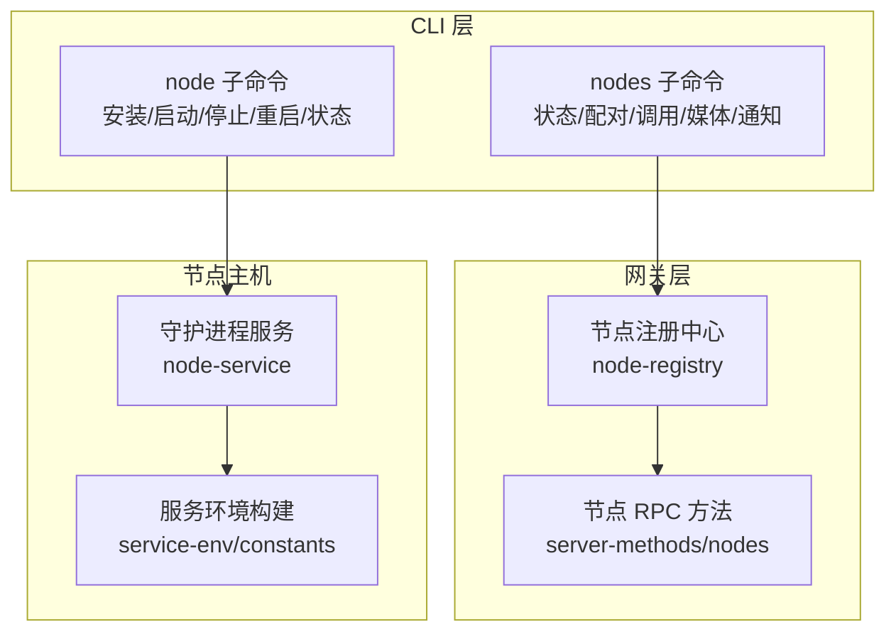
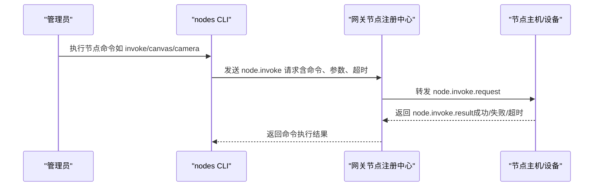
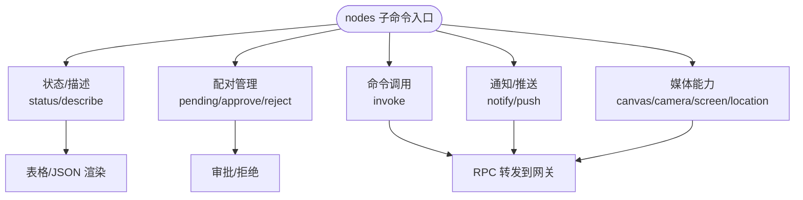
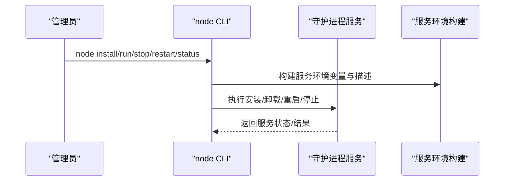
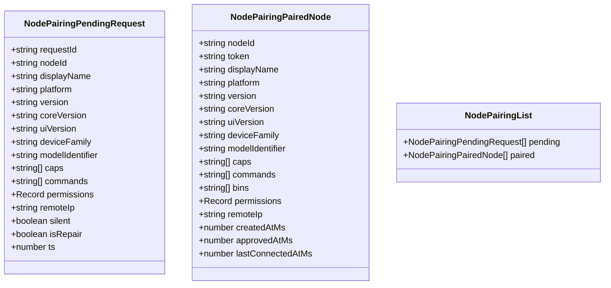
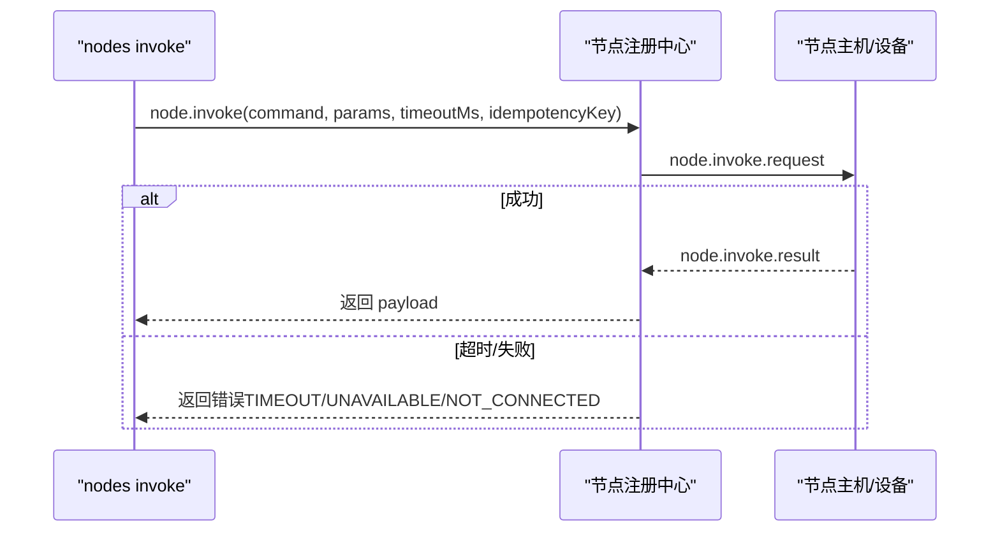
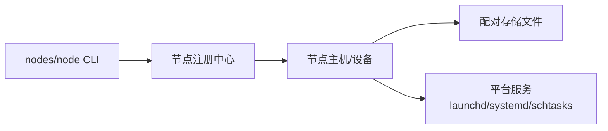

# 节点管理命令

<cite>
**本文档引用的文件**
- [src/cli/nodes-cli/register.ts](file://src/cli/nodes-cli/register.ts)
- [src/cli/nodes-cli/register.pairing.ts](file://src/cli/nodes-cli/register.pairing.ts)
- [src/cli/nodes-cli/register.status.ts](file://src/cli/nodes-cli/register.status.ts)
- [src/cli/nodes-cli/register.invoke.ts](file://src/cli/nodes-cli/register.invoke.ts)
- [src/cli/nodes-cli/register.notify.ts](file://src/cli/nodes-cli/register.notify.ts)
- [src/cli/nodes-cli/register.push.ts](file://src/cli/nodes-cli/register.push.ts)
- [src/cli/nodes-cli/register.canvas.ts](file://src/cli/nodes-cli/register.canvas.ts)
- [src/cli/nodes-cli/register.camera.ts](file://src/cli/nodes-cli/register.camera.ts)
- [src/cli/nodes-cli/register.screen.ts](file://src/cli/nodes-cli/register.screen.ts)
- [src/cli/nodes-cli/register.location.ts](file://src/cli/nodes-cli/register.location.ts)
- [src/cli/node-cli/register.ts](file://src/cli/node-cli/register.ts)
- [src/cli/node-cli/daemon.ts](file://src/cli/node-cli/daemon.ts)
- [src/infra/node-pairing.ts](file://src/infra/node-pairing.ts)
- [src/gateway/node-registry.ts](file://src/gateway/node-registry.ts)
- [src/gateway/server-methods/nodes.ts](file://src/gateway/server-methods/nodes.ts)
- [src/daemon/node-service.ts](file://src/daemon/node-service.ts)
- [src/daemon/service-env.ts](file://src/daemon/service-env.ts)
- [src/daemon/constants.ts](file://src/daemon/constants.ts)
- [apps/macos/Sources/OpenClaw/NodeServiceManager.swift](file://apps/macos/Sources/OpenClaw/NodeServiceManager.swift)
- [docs/nodes/index.md](file://docs/nodes/index.md)
</cite>

## 目录

1. [简介](#简介)
2. [项目结构](#项目结构)
3. [核心组件](#核心组件)
4. [架构总览](#架构总览)
5. [详细组件分析](#详细组件分析)
6. [依赖关系分析](#依赖关系分析)
7. [性能考虑](#性能考虑)
8. [故障排查指南](#故障排查指南)
9. [结论](#结论)
10. [附录](#附录)

## 简介

本文件系统性梳理 OpenClaw 的“节点管理命令”，覆盖节点注册、发现、配置与监控的完整命令体系；解释节点类型与能力特性、连接与配对机制、命令调用流程、以及节点集群管理、负载分配与故障转移策略；并提供性能监控、资源统计与安全配置的管理指南，帮助节点管理员高效运维节点集群。

## 项目结构

- CLI 子命令入口：nodes 与 node 两大子命令族，分别面向“网关侧节点管理”和“节点主机服务生命周期管理”。
- 子命令分层：按功能划分为状态查询、配对审批、命令调用、通知推送、媒体采集（画布/相机/屏幕）、位置信息等。
- 网关侧节点注册中心：负责节点连接、命令转发、事件处理与超时管理。
- 节点主机服务：跨平台守护进程，负责执行系统命令、权限管控与环境隔离。
- 文档与示例：官方文档提供命令使用范式、最佳实践与排障指引。

图表来源

- [src/cli/nodes-cli/register.ts](file://src/cli/nodes-cli/register.ts#L15-L39)
- [src/cli/node-cli/register.ts](file://src/cli/node-cli/register.ts#L21-L110)
- [src/gateway/node-registry.ts](file://src/gateway/node-registry.ts#L107-L155)
- [src/gateway/server-methods/nodes.ts](file://src/gateway/server-methods/nodes.ts#L763-L809)
- [src/daemon/node-service.ts](file://src/daemon/node-service.ts#L44-L66)
- [src/daemon/service-env.ts](file://src/daemon/service-env.ts#L276-L308)

章节来源

- [src/cli/nodes-cli/register.ts](file://src/cli/nodes-cli/register.ts#L15-L39)
- [src/cli/node-cli/register.ts](file://src/cli/node-cli/register.ts#L21-L110)

## 核心组件

- 节点管理 CLI（nodes）：提供节点状态、描述、配对、命令调用、通知、推送、画布、相机、屏幕、位置等子命令。
- 节点主机 CLI（node）：提供节点主机服务的安装、启动、停止、重启、状态查询等子命令。
- 节点注册中心：维护节点连接状态、命令转发、结果回调与超时处理。
- 节点配对存储：持久化待审批与已配对节点清单，支持过期清理与原子写入。
- 节点主机服务：跨平台守护进程，统一注入环境变量、路径与代理配置，确保 TLS 证书链正确。

章节来源

- [src/cli/nodes-cli/register.ts](file://src/cli/nodes-cli/register.ts#L15-L39)
- [src/cli/node-cli/register.ts](file://src/cli/node-cli/register.ts#L21-L110)
- [src/gateway/node-registry.ts](file://src/gateway/node-registry.ts#L107-L155)
- [src/infra/node-pairing.ts](file://src/infra/node-pairing.ts#L66-L86)

## 架构总览

节点管理命令围绕“网关-节点主机-节点设备”的三层协作展开：

- 网关侧：节点注册中心接收来自节点的命令请求，转发至对应节点会话，并等待结果或超时。
- 节点主机侧：守护进程承载系统命令执行、权限审批与环境隔离；支持跨平台服务安装与管理。
- 节点设备侧：iOS/Android/macOS 设备作为节点，暴露命令面（如 canvas/camera/system），并通过设备配对接入网关。

图表来源

- [src/gateway/server-methods/nodes.ts](file://src/gateway/server-methods/nodes.ts#L763-L809)
- [src/gateway/node-registry.ts](file://src/gateway/node-registry.ts#L107-L155)

章节来源

- [src/gateway/server-methods/nodes.ts](file://src/gateway/server-methods/nodes.ts#L763-L809)
- [src/gateway/node-registry.ts](file://src/gateway/node-registry.ts#L107-L155)

## 详细组件分析

### 节点管理 CLI（nodes）

- 子命令组织
  - 状态与描述：nodes status/describe，用于查看节点列表、能力与命令集。
  - 配对管理：nodes pending/approve/reject，用于查看与审批待配对节点。
  - 命令调用：nodes invoke，低层通用命令调用接口。
  - 通知与推送：nodes notify/push，向节点发送系统通知或推送消息。
  - 媒体能力：nodes canvas/camera/screen/location 等子命令，封装常用媒体与系统能力调用。
- 关键特性
  - 支持 JSON 输出与主题化渲染，便于自动化集成与可读性提升。
  - 统一的节点解析与 RPC 调用封装，简化命令参数传递与错误处理。

图表来源

- [src/cli/nodes-cli/register.ts](file://src/cli/nodes-cli/register.ts#L15-L39)
- [src/cli/nodes-cli/register.status.ts](file://src/cli/nodes-cli/register.status.ts#L196-L228)
- [src/cli/nodes-cli/register.pairing.ts](file://src/cli/nodes-cli/register.pairing.ts#L9-L40)
- [src/cli/nodes-cli/register.invoke.ts](file://src/cli/nodes-cli/register.invoke.ts#L314-L337)

章节来源

- [src/cli/nodes-cli/register.ts](file://src/cli/nodes-cli/register.ts#L15-L39)
- [src/cli/nodes-cli/register.status.ts](file://src/cli/nodes-cli/register.status.ts#L196-L228)
- [src/cli/nodes-cli/register.pairing.ts](file://src/cli/nodes-cli/register.pairing.ts#L9-L40)
- [src/cli/nodes-cli/register.invoke.ts](file://src/cli/nodes-cli/register.invoke.ts#L314-L337)

### 节点主机 CLI（node）

- 子命令组织
  - 运行：node run，前台运行节点主机，支持主机、端口、TLS、节点 ID、显示名称等参数。
  - 生命周期：node install/uninstall/stop/restart/status，跨平台服务管理。
- 关键特性
  - 自动构建服务安装计划（程序参数、工作目录、环境变量、描述），并执行安装/卸载/重启/停止。
  - 服务环境构建：注入 PATH、代理、CA 证书、服务标记与平台特定变量，确保 TLS 与网络连通性。

图表来源

- [src/cli/node-cli/register.ts](file://src/cli/node-cli/register.ts#L21-L110)
- [src/cli/node-cli/daemon.ts](file://src/cli/node-cli/daemon.ts#L128-L225)
- [src/daemon/node-service.ts](file://src/daemon/node-service.ts#L44-L66)
- [src/daemon/service-env.ts](file://src/daemon/service-env.ts#L276-L308)
- [src/daemon/constants.ts](file://src/daemon/constants.ts#L95-L113)

章节来源

- [src/cli/node-cli/register.ts](file://src/cli/node-cli/register.ts#L21-L110)
- [src/cli/node-cli/daemon.ts](file://src/cli/node-cli/daemon.ts#L128-L225)
- [src/daemon/node-service.ts](file://src/daemon/node-service.ts#L44-L66)
- [src/daemon/service-env.ts](file://src/daemon/service-env.ts#L276-L308)
- [src/daemon/constants.ts](file://src/daemon/constants.ts#L95-L113)

### 节点配对与存储

- 配对数据模型
  - 待配对请求：包含节点 ID、显示名、平台、版本、能力、命令、权限、远端 IP、静默模式、修复模式等。
  - 已配对节点：包含节点 ID、令牌、显示名、平台、版本、能力、命令、二进制路径、权限、远端 IP、创建与审批时间等。
- 存储与 TTL
  - 使用原子写入与过期清理，待配对请求默认保留 5 分钟。
  - 并发安全：通过异步锁保证状态读写一致性。

图表来源

- [src/infra/node-pairing.ts](file://src/infra/node-pairing.ts#L13-L55)

章节来源

- [src/infra/node-pairing.ts](file://src/infra/node-pairing.ts#L66-L86)

### 命令调用与超时处理

- 调用流程
  - CLI 解析节点与命令参数，构造 node.invoke 请求。
  - 网关节点注册中心将请求转发给目标节点会话，等待响应或超时。
  - 节点返回结果后，网关封装并回传 CLI。
- 超时与幂等
  - 默认超时 30 秒，CLI 可自定义超时与幂等键。
  - 支持审批决策与运行 ID 透传，便于审计与追踪。

图表来源

- [src/cli/nodes-cli/register.invoke.ts](file://src/cli/nodes-cli/register.invoke.ts#L314-L337)
- [src/gateway/node-registry.ts](file://src/gateway/node-registry.ts#L107-L155)

章节来源

- [src/cli/nodes-cli/register.invoke.ts](file://src/cli/nodes-cli/register.invoke.ts#L314-L337)
- [src/gateway/node-registry.ts](file://src/gateway/node-registry.ts#L107-L155)

### 节点类型与能力特性

- 节点类型
  - iOS/Android/macOS 节点：通过设备配对接入，暴露画布、相机、屏幕录制、位置、短信等能力。
  - 跨平台节点主机：无 UI 的守护进程，执行系统命令、权限审批与环境隔离。
- 能力与权限
  - 能力集合（caps）与命令集合（commands）在节点描述中可见。
  - 权限映射（permissions）反映系统授权状态（如屏幕录制、无障碍等）。

章节来源

- [docs/nodes/index.md](file://docs/nodes/index.md#L10-L23)
- [src/cli/nodes-cli/register.status.ts](file://src/cli/nodes-cli/register.status.ts#L196-L228)

### 连接管理与配对流程

- 设备配对
  - 节点首次连接时携带设备身份，网关生成节点配对请求，需在设备侧批准。
  - nodes pending/approve/reject 提供待审批列表与审批/拒绝操作。
- 服务安装与运行
  - node install 安装跨平台服务（launchd/systemd/schtasks），node restart 启动服务。
  - macOS 通过 Swift 管理器封装服务启停，记录错误并返回提示。

章节来源

- [docs/nodes/index.md](file://docs/nodes/index.md#L24-L44)
- [src/cli/nodes-cli/register.pairing.ts](file://src/cli/nodes-cli/register.pairing.ts#L9-L40)
- [src/cli/node-cli/daemon.ts](file://src/cli/node-cli/daemon.ts#L172-L189)
- [apps/macos/Sources/OpenClaw/NodeServiceManager.swift](file://apps/macos/Sources/OpenClaw/NodeServiceManager.swift#L7-L29)

### 命令使用方法与示例

- 通用命令调用
  - nodes invoke --node <id> --command <command> --params '{"key":"val"}' [--invoke-timeout <ms>]
- 媒体与系统能力
  - 画布：nodes canvas snapshot/present/navigate/eval/a2ui
  - 相机：nodes camera list/snap/clip
  - 屏幕：nodes screen record
  - 通知：nodes notify --node <id> --title "..." --body "..."
  - 位置：nodes location get [--accuracy] [--max-age] [--location-timeout]
- 远程节点主机
  - 节点主机运行：node run --host <gateway-host> --port 18789 --display-name "Build Node"
  - 服务安装与重启：node install/restart
  - 执行系统命令：nodes run --node <id> -- echo "Hello from mac node"

章节来源

- [docs/nodes/index.md](file://docs/nodes/index.md#L145-L346)

### 节点集群管理、负载分配与故障转移

- 负载分配
  - 通过配置将 exec 主机绑定到指定节点（tools.exec.host=node 且 tools.exec.node=<id-or-name>），实现显式路由。
  - 支持全局默认与按代理覆盖，便于多节点场景下的流量定向。
- 故障转移
  - 当目标节点不可达或超时，网关返回 UNAVAILABLE/TIMEOUT 错误；可通过切换绑定节点或启用备用节点实现自动迁移。
- 健康与状态
  - nodes status/describe 提供节点能力与命令列表，辅助判断节点健康状况与可用性。

章节来源

- [docs/nodes/index.md](file://docs/nodes/index.md#L290-L314)
- [src/cli/nodes-cli/register.status.ts](file://src/cli/nodes-cli/register.status.ts#L196-L228)

### 性能监控、资源统计与安全配置

- 性能监控
  - 使用 nodes status 查看节点在线状态与能力；结合网关侧日志与事件流定位性能瓶颈。
- 资源统计
  - 节点能力与命令集在 describe 中可见，有助于评估资源占用与功能覆盖。
- 安全配置
  - 节点主机侧执行审批（exec-approvals），严格限制可执行路径与包装器形式。
  - TLS 与证书指纹校验（--tls/--tls-fingerprint），确保与网关通信安全。
  - 服务环境注入最小化 PATH、代理与 CA 证书，避免环境污染与证书链问题。

章节来源

- [docs/nodes/index.md](file://docs/nodes/index.md#L264-L289)
- [src/cli/node-cli/register.ts](file://src/cli/node-cli/register.ts#L48-L61)
- [src/daemon/service-env.ts](file://src/daemon/service-env.ts#L276-L308)

## 依赖关系分析

- CLI 对网关节点注册中心的依赖：所有节点命令最终通过 node.invoke 路由至网关，再由网关转发至节点。
- 节点主机服务对平台服务的依赖：根据操作系统注入不同服务标签与单元名，确保跨平台一致体验。
- 配对存储对文件系统的依赖：待配对与已配对节点信息以 JSON 文件形式持久化，支持并发锁与原子写入。

图表来源

- [src/gateway/node-registry.ts](file://src/gateway/node-registry.ts#L107-L155)
- [src/infra/node-pairing.ts](file://src/infra/node-pairing.ts#L66-L86)
- [src/daemon/node-service.ts](file://src/daemon/node-service.ts#L44-L66)

章节来源

- [src/gateway/node-registry.ts](file://src/gateway/node-registry.ts#L107-L155)
- [src/infra/node-pairing.ts](file://src/infra/node-pairing.ts#L66-L86)
- [src/daemon/node-service.ts](file://src/daemon/node-service.ts#L44-L66)

## 性能考虑

- 超时与重试：合理设置 invoke-timeout，避免长时间阻塞；对可幂等命令使用幂等键。
- 媒体传输：相机/屏幕输出为大对象，建议限制分辨率与时长，避免超大负载。
- 环境隔离：节点主机服务注入最小化 PATH 与安全变量，减少不必要的环境扫描与注入。
- 日志与事件：结合网关日志与节点事件流，定位慢调用与异常节点。

## 故障排查指南

- 节点不可达
  - 检查 nodes status 是否显示节点在线；若离线，确认设备配对是否完成、服务是否启动。
- 命令超时
  - 调整 --invoke-timeout；检查节点是否处于前台（部分能力需前台）。
- 权限不足
  - 检查节点权限映射（permissions）与节点主机执行审批（exec-approvals）配置。
- TLS 证书问题
  - 使用 --tls/--tls-fingerprint 校验证书；确保服务环境注入正确的 CA 证书路径。
- 服务安装失败
  - 查看 node install 的警告与错误输出；核对平台服务标签与单元名。

章节来源

- [src/cli/nodes-cli/register.status.ts](file://src/cli/nodes-cli/register.status.ts#L196-L228)
- [src/cli/nodes-cli/register.invoke.ts](file://src/cli/nodes-cli/register.invoke.ts#L314-L337)
- [src/cli/node-cli/daemon.ts](file://src/cli/node-cli/daemon.ts#L172-L189)
- [src/daemon/service-env.ts](file://src/daemon/service-env.ts#L276-L308)

## 结论

通过 nodes 与 node 两大 CLI 子命令族，OpenClaw 实现了从节点发现、配对、能力展示到命令调用、媒体采集与系统通知的完整闭环。配合网关节点注册中心与节点主机服务，管理员可在多节点环境下实现稳定的负载分配与故障转移，并通过严格的执行审批与 TLS 配置保障安全性与可靠性。

## 附录

- 官方文档索引：节点管理、配对与能力、媒体与系统命令、远程节点主机、Mac 节点模式等。
- 常用命令速查
  - 节点状态：nodes status
  - 节点描述：nodes describe --node <id>
  - 命令调用：nodes invoke --node <id> --command <command> --params '{}'
  - 通知：nodes notify --node <id> --title "..." --body "..."
  - 相机拍照：nodes camera snap --node <id>
  - 屏幕录制：nodes screen record --node <id> --duration 10s
  - 节点主机安装：node install --host <gateway-host> --port 18789
  - 节点主机运行：node run --host <gateway-host> --port 18789

章节来源

- [docs/nodes/index.md](file://docs/nodes/index.md#L1-L346)
