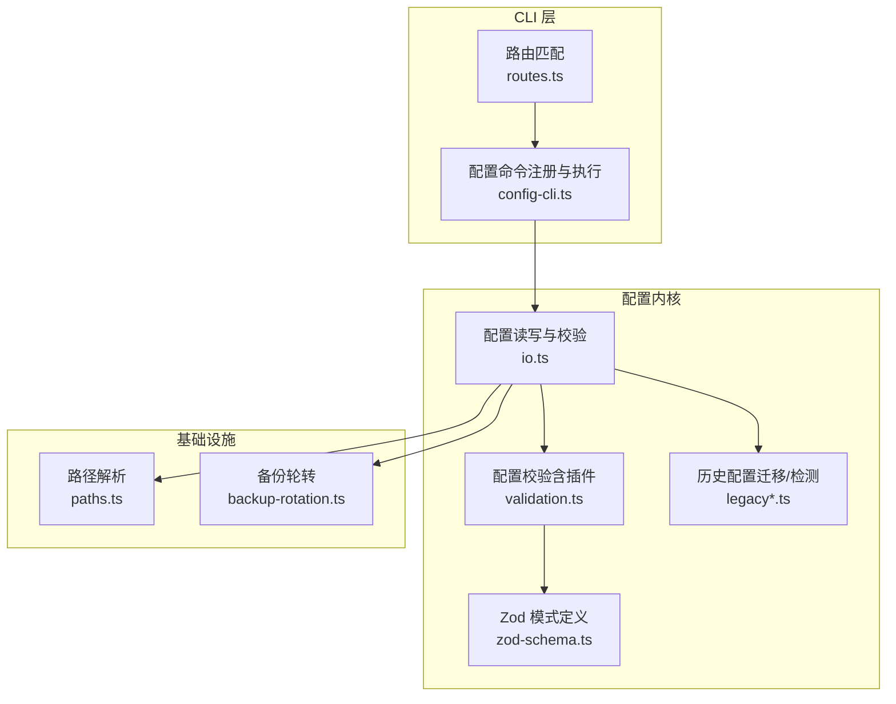
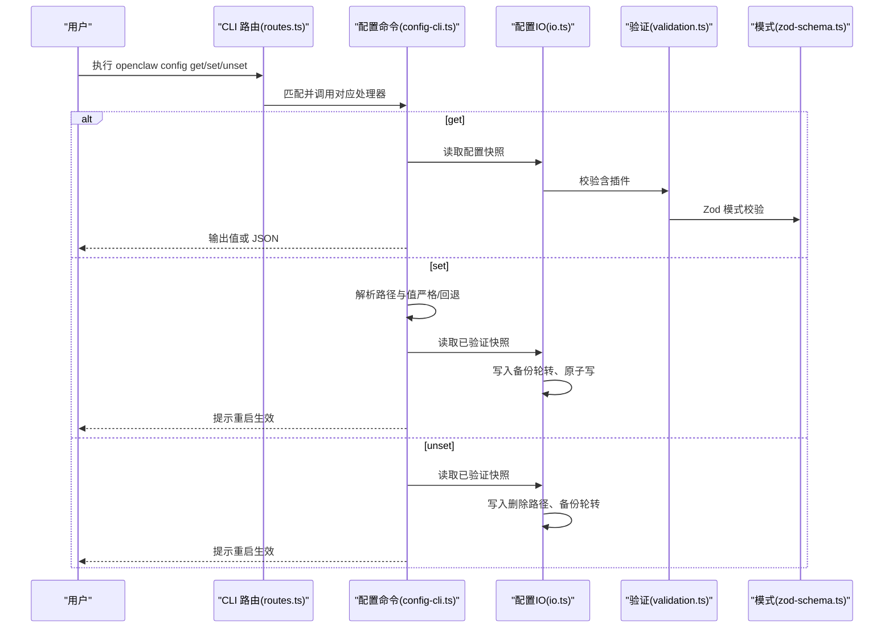
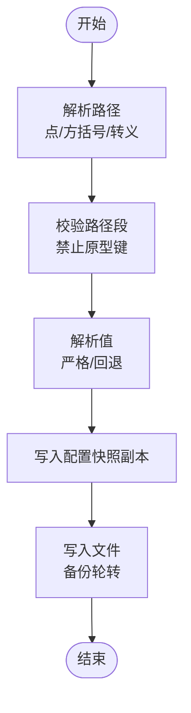
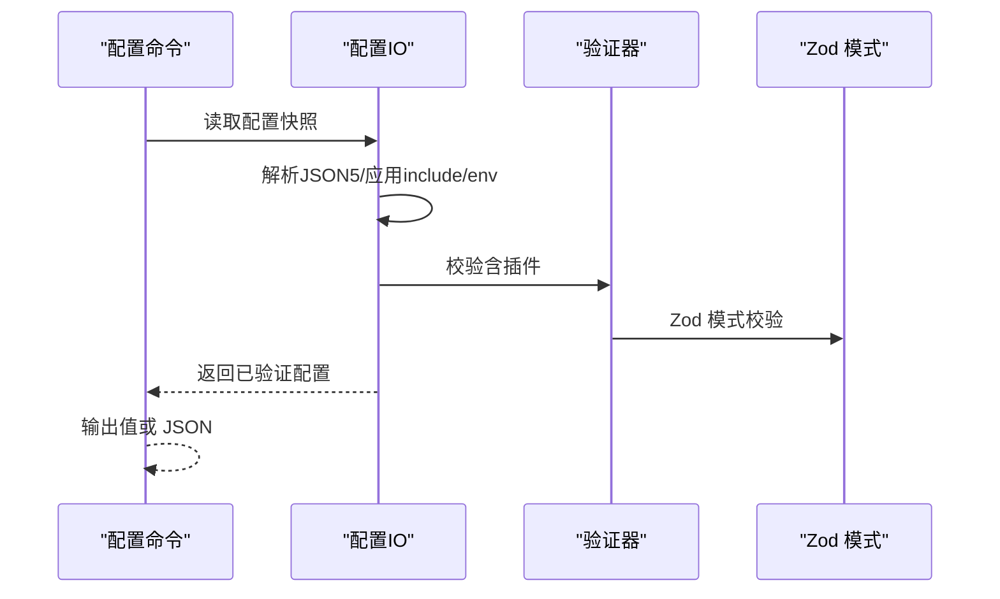
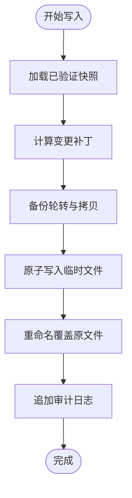
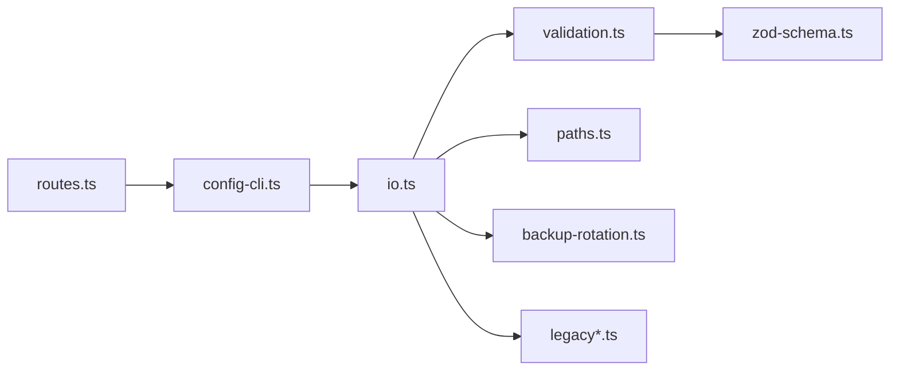

# 配置管理命令

<cite>
**本文引用的文件**
- [src/cli/config-cli.ts](file://src/cli/config-cli.ts)
- [src/cli/program/routes.ts](file://src/cli/program/routes.ts)
- [src/config/io.ts](file://src/config/io.ts)
- [src/config/validation.ts](file://src/config/validation.ts)
- [src/config/backup-rotation.ts](file://src/config/backup-rotation.ts)
- [src/config/paths.ts](file://src/config/paths.ts)
- [src/config/legacy-migrate.ts](file://src/config/legacy-migrate.ts)
- [src/config/legacy.ts](file://src/config/legacy.ts)
- [src/config/zod-schema.ts](file://src/config/zod-schema.ts)
- [src/cli/config-cli.test.ts](file://src/cli/config-cli.test.ts)
</cite>

## 目录

1. [简介](#简介)
2. [项目结构](#项目结构)
3. [核心组件](#核心组件)
4. [架构总览](#架构总览)
5. [详细组件分析](#详细组件分析)
6. [依赖分析](#依赖分析)
7. [性能考虑](#性能考虑)
8. [故障排除指南](#故障排除指南)
9. [结论](#结论)
10. [附录](#附录)

## 简介

本文件系统化阐述 OpenClaw 的配置管理命令，覆盖以下能力：

- 查看配置：支持点/方括号路径访问，支持 JSON 输出
- 编辑配置：支持严格 JSON5 解析与回退解析，支持数组/对象路径设置
- 删除配置：按路径移除键或数组索引
- 验证配置：内置 Zod Schema 校验、插件配置校验、历史配置兼容性检查
- 备份与恢复：写入前自动轮转备份，失败时可从备份恢复
- 迁移与重置：历史配置迁移、默认值注入、运行时覆盖
- 最佳实践与自动化：路径解析、环境变量替换、审计日志

## 项目结构

配置管理相关代码主要分布在 CLI 路由、配置命令实现、配置 IO 与校验、路径解析与备份轮转等模块。

**图表来源**

- [src/cli/program/routes.ts](file://src/cli/program/routes.ts#L141-L168)
- [src/cli/config-cli.ts](file://src/cli/config-cli.ts#L299-L364)
- [src/config/io.ts](file://src/config/io.ts#L673-L800)
- [src/config/validation.ts](file://src/config/validation.ts#L87-L143)
- [src/config/zod-schema.ts](file://src/config/zod-schema.ts#L131-L200)
- [src/config/legacy.ts](file://src/config/legacy.ts#L5-L44)
- [src/config/paths.ts](file://src/config/paths.ts#L115-L185)
- [src/config/backup-rotation.ts](file://src/config/backup-rotation.ts#L3-L26)

**章节来源**

- [src/cli/program/routes.ts](file://src/cli/program/routes.ts#L141-L168)
- [src/cli/config-cli.ts](file://src/cli/config-cli.ts#L299-L364)
- [src/config/io.ts](file://src/config/io.ts#L673-L800)

## 核心组件

- 命令行入口与路由
  - 路由将 config 子命令映射到具体处理器，支持 get/set/unset 三类操作
  - 参考：[路由定义](file://src/cli/program/routes.ts#L141-L168)
- 配置命令实现
  - 注册 config 命令及其子命令，提供路径解析、值解析、安全校验、写入与输出
  - 参考：[命令注册与执行](file://src/cli/config-cli.ts#L299-L364)
- 配置读写与校验
  - 读取配置快照、应用 include/env 变量替换、Zod 校验、默认值注入、写入时备份轮转
  - 参考：[配置 IO](file://src/config/io.ts#L673-L800)
- 验证与模式
  - Zod 模式定义、插件配置校验、历史配置兼容性检查
  - 参考：[验证器](file://src/config/validation.ts#L87-L143)、[Zod 模式](file://src/config/zod-schema.ts#L131-L200)
- 路径与备份
  - 配置文件路径解析、状态目录、锁目录、OAuth 目录；写入前备份轮转
  - 参考：[路径解析](file://src/config/paths.ts#L115-L185)、[备份轮转](file://src/config/backup-rotation.ts#L3-L26)

**章节来源**

- [src/cli/program/routes.ts](file://src/cli/program/routes.ts#L141-L168)
- [src/cli/config-cli.ts](file://src/cli/config-cli.ts#L299-L364)
- [src/config/io.ts](file://src/config/io.ts#L673-L800)
- [src/config/validation.ts](file://src/config/validation.ts#L87-L143)
- [src/config/zod-schema.ts](file://src/config/zod-schema.ts#L131-L200)
- [src/config/paths.ts](file://src/config/paths.ts#L115-L185)
- [src/config/backup-rotation.ts](file://src/config/backup-rotation.ts#L3-L26)

## 架构总览

配置管理命令的调用链路如下：

**图表来源**

- [src/cli/program/routes.ts](file://src/cli/program/routes.ts#L141-L168)
- [src/cli/config-cli.ts](file://src/cli/config-cli.ts#L245-L364)
- [src/config/io.ts](file://src/config/io.ts#L673-L800)
- [src/config/validation.ts](file://src/config/validation.ts#L87-L143)
- [src/config/zod-schema.ts](file://src/config/zod-schema.ts#L131-L200)

## 详细组件分析

### 命令与路径解析

- 支持的路径语法
  - 点号路径：如 agents.defaults.heartbeat.target
  - 方括号数组索引：如 agents.list[0].id
  - 转义：反斜杠用于转义特殊字符
  - 参考：[路径解析](file://src/cli/config-cli.ts#L23-L73)
- 安全校验
  - 禁止原型污染路径段（如 **proto**），避免安全风险
  - 参考：[路径校验](file://src/cli/config-cli.ts#L96-L102)、[阻断键检测](file://src/config/prototype-keys.ts)
- 值解析策略
  - 严格 JSON5：--strict-json/--json（后者为前者别名）失败即报错
  - 回退字符串：非严格模式下解析失败则作为原始字符串处理
  - 参考：[值解析](file://src/cli/config-cli.ts#L75-L90)、[测试用例](file://src/cli/config-cli.test.ts#L184-L204)

**图表来源**

- [src/cli/config-cli.ts](file://src/cli/config-cli.ts#L23-L90)
- [src/cli/config-cli.ts](file://src/cli/config-cli.ts#L130-L172)
- [src/config/backup-rotation.ts](file://src/config/backup-rotation.ts#L3-L26)

**章节来源**

- [src/cli/config-cli.ts](file://src/cli/config-cli.ts#L23-L90)
- [src/cli/config-cli.ts](file://src/cli/config-cli.ts#L96-L102)
- [src/cli/config-cli.test.ts](file://src/cli/config-cli.test.ts#L184-L204)

### 配置读取与验证

- 读取流程
  - 读取文件 -> 解析 JSON5 -> 应用 $include 与 ${ENV} 替换 -> Zod 校验 -> 注入默认值 -> 规范化路径与安全策略
  - 参考：[读取与解析](file://src/config/io.ts#L682-L780)、[校验与默认值](file://src/config/io.ts#L714-L758)
- 验证规则
  - Zod 模式校验：字段类型、范围、枚举等
  - 插件配置校验：插件存在性、启用状态、配置模式匹配
  - 历史配置兼容：检测并提示过时键位
  - 参考：[验证器](file://src/config/validation.ts#L87-L143)、[插件校验](file://src/config/validation.ts#L145-L453)、[历史检测](file://src/config/legacy.ts#L5-L25)
- 输出控制
  - get 支持 --json 输出完整 JSON；否则对标量直接输出字符串，复合类型输出 JSON
  - 参考：[get 实现](file://src/cli/config-cli.ts#L245-L274)

**图表来源**

- [src/config/io.ts](file://src/config/io.ts#L682-L780)
- [src/config/validation.ts](file://src/config/validation.ts#L87-L143)
- [src/config/zod-schema.ts](file://src/config/zod-schema.ts#L131-L200)

**章节来源**

- [src/config/io.ts](file://src/config/io.ts#L682-L780)
- [src/config/validation.ts](file://src/config/validation.ts#L87-L143)
- [src/config/legacy.ts](file://src/config/legacy.ts#L5-L25)

### 配置写入与备份

- 写入策略
  - 使用“写入补丁”机制，仅记录变更路径，避免覆盖默认值
  - 写入前进行备份轮转（最多保留 N 份 .bak.\*）
  - 参考：[写入与备份](file://src/config/io.ts#L1205-L1246)、[备份轮转](file://src/config/backup-rotation.ts#L3-L26)
- 安全与审计
  - 记录配置写入审计日志，包含变更前后哈希、字节数、可疑原因等
  - 参考：[审计记录](file://src/config/io.ts#L522-L536)
- 错误处理
  - 无效配置时提示使用 doctor 修复；严格模式下解析失败直接报错
  - 参考：[get 错误处理](file://src/cli/config-cli.ts#L245-L274)、[set 错误处理](file://src/cli/config-cli.ts#L337-L355)

**图表来源**

- [src/config/io.ts](file://src/config/io.ts#L1205-L1246)
- [src/config/backup-rotation.ts](file://src/config/backup-rotation.ts#L3-L26)

**章节来源**

- [src/config/io.ts](file://src/config/io.ts#L1205-L1246)
- [src/config/backup-rotation.ts](file://src/config/backup-rotation.ts#L3-L26)

### 配置迁移、重置与恢复

- 历史配置迁移
  - 自动检测并应用历史配置迁移，随后进行校验；若仍不合法，提示手动修复
  - 参考：[迁移入口](file://src/config/legacy-migrate.ts#L5-L19)、[迁移应用](file://src/config/legacy.ts#L27-L43)
- 默认值与运行时覆盖
  - 读取阶段注入模型/会话/消息/日志等默认值；运行时可覆盖部分配置
  - 参考：[默认值注入](file://src/config/io.ts#L735-L747)、[运行时覆盖](file://src/config/runtime-overrides.ts)
- 重置与恢复
  - 通过 doctor 流程修复配置问题；必要时可从最近备份恢复（.bak 或 .bak.1）
  - 参考：[备份轮转](file://src/config/backup-rotation.ts#L3-L26)

**章节来源**

- [src/config/legacy-migrate.ts](file://src/config/legacy-migrate.ts#L5-L19)
- [src/config/legacy.ts](file://src/config/legacy.ts#L27-L43)
- [src/config/io.ts](file://src/config/io.ts#L735-L747)

### 配置层级、优先级与继承

- 层级结构
  - 配置采用树形结构，支持对象与数组嵌套；路径以点号或方括号表示
  - 参考：[路径解析](file://src/cli/config-cli.ts#L23-L73)
- 优先级与继承
  - include 文件合并顺序：后读取的覆盖先前定义
  - 环境变量替换：先应用 config.env，再进行 ${VAR} 替换
  - 默认值注入：在验证后统一注入，确保 schema 合法性
  - 运行时覆盖：某些配置可在运行时被覆盖，但写入时不反映到持久化文件中
  - 参考：[include 解析](file://src/config/io.ts#L634-L650)、[env 替换](file://src/config/io.ts#L652-L666)、[默认值注入](file://src/config/io.ts#L735-L747)

**章节来源**

- [src/cli/config-cli.ts](file://src/cli/config-cli.ts#L23-L73)
- [src/config/io.ts](file://src/config/io.ts#L634-L666)
- [src/config/io.ts](file://src/config/io.ts#L735-L747)

## 依赖分析

- 组件耦合
  - CLI 路由与命令实现松耦合，通过动态导入解耦
  - 配置命令依赖 IO 模块进行读写，IO 依赖验证器与模式定义
- 外部依赖
  - JSON5 解析、文件系统、进程环境、版本比较、审计日志
- 循环依赖
  - 未发现循环依赖迹象；模块职责清晰（CLI/IO/验证/路径/备份）

**图表来源**

- [src/cli/program/routes.ts](file://src/cli/program/routes.ts#L141-L168)
- [src/cli/config-cli.ts](file://src/cli/config-cli.ts#L299-L364)
- [src/config/io.ts](file://src/config/io.ts#L673-L800)
- [src/config/validation.ts](file://src/config/validation.ts#L87-L143)
- [src/config/zod-schema.ts](file://src/config/zod-schema.ts#L131-L200)
- [src/config/paths.ts](file://src/config/paths.ts#L115-L185)
- [src/config/backup-rotation.ts](file://src/config/backup-rotation.ts#L3-L26)
- [src/config/legacy.ts](file://src/config/legacy.ts#L5-L44)

**章节来源**

- [src/cli/program/routes.ts](file://src/cli/program/routes.ts#L141-L168)
- [src/cli/config-cli.ts](file://src/cli/config-cli.ts#L299-L364)
- [src/config/io.ts](file://src/config/io.ts#L673-L800)

## 性能考虑

- 路径解析与写入补丁
  - 路径解析与补丁计算为线性复杂度，适合大配置文件
- 备份轮转
  - 轮转操作为 O(N) 文件重命名，建议合理设置备份数量
- 校验与默认值注入
  - Zod 校验与默认值注入在启动时进行，写入时仅做增量变更，避免重复开销

[本节为通用指导，无需列出具体文件来源]

## 故障排除指南

- 常见错误与诊断
  - 路径无效：检查路径是否为空、段是否被阻断（如 **proto**）
    - 参考：[路径校验](file://src/cli/config-cli.ts#L96-L102)
  - 值解析失败：在严格模式下需提供合法 JSON5；非严格模式将回退为字符串
    - 参考：[值解析](file://src/cli/config-cli.ts#L75-L90)、[测试用例](file://src/cli/config-cli.test.ts#L184-L204)
  - 配置无效：使用 doctor 修复；根据提示修正 schema 问题或插件配置
    - 参考：[get 错误处理](file://src/cli/config-cli.ts#L245-L274)
- 恢复与回滚
  - 若写入失败或配置异常，可从最近备份恢复（.bak 或 .bak.1）
    - 参考：[备份轮转](file://src/config/backup-rotation.ts#L3-L26)
- 审计与定位
  - 查看配置写入审计日志，定位可疑变更与失败原因
    - 参考：[审计记录](file://src/config/io.ts#L522-L536)

**章节来源**

- [src/cli/config-cli.ts](file://src/cli/config-cli.ts#L75-L102)
- [src/cli/config-cli.test.ts](file://src/cli/config-cli.test.ts#L184-L204)
- [src/cli/config-cli.ts](file://src/cli/config-cli.ts#L245-L274)
- [src/config/backup-rotation.ts](file://src/config/backup-rotation.ts#L3-L26)
- [src/config/io.ts](file://src/config/io.ts#L522-L536)

## 结论

OpenClaw 的配置管理命令提供了安全、可靠且可审计的配置操作能力。通过严格的路径与值解析、完善的校验与默认值注入、以及智能的备份轮转与审计日志，用户可以放心地进行配置的查看、编辑、验证与恢复。配合 doctor 修复流程与历史配置迁移，系统在升级与演进过程中保持了良好的兼容性与稳定性。

[本节为总结性内容，无需列出具体文件来源]

## 附录

### 命令速查

- 查看配置
  - openclaw config get <路径> [--json]
  - 参考：[get 实现](file://src/cli/config-cli.ts#L245-L274)
- 设置配置
  - openclaw config set <路径> <值> [--strict-json | --json]
  - 参考：[set 实现](file://src/cli/config-cli.ts#L337-L355)
- 删除配置
  - openclaw config unset <路径>
  - 参考：[unset 实现](file://src/cli/config-cli.ts#L276-L297)
- 路径语法
  - 点号路径：agents.defaults.heartbeat.target
  - 数组索引：agents.list[0].id
  - 参考：[路径解析](file://src/cli/config-cli.ts#L23-L73)

**章节来源**

- [src/cli/config-cli.ts](file://src/cli/config-cli.ts#L245-L355)

### 最佳实践

- 使用 --strict-json 保证配置值的合法性
- 对敏感信息使用环境变量引用 ${VAR} 并在运行时注入
- 修改后重启网关以应用新配置
- 定期检查审计日志，监控配置变更
- 使用 doctor 修复配置问题，避免手工修改导致 schema 不一致

[本节为通用指导，无需列出具体文件来源]

### 自动化脚本示例（思路）

- 批量导出配置
  - 使用 openclaw config get 获取指定路径集合，结合 --json 输出到文件
- 条件更新
  - 先用 openclaw config get 检查当前值，再决定是否调用 openclaw config set
- 备份与回滚
  - 在执行重要 set/unset 前，先复制配置文件为 .bak.\*，失败时重命名为 .bak
- 一键修复
  - 调用 doctor --fix 修复无效配置，再重试失败的命令

[本节为通用指导，无需列出具体文件来源]
