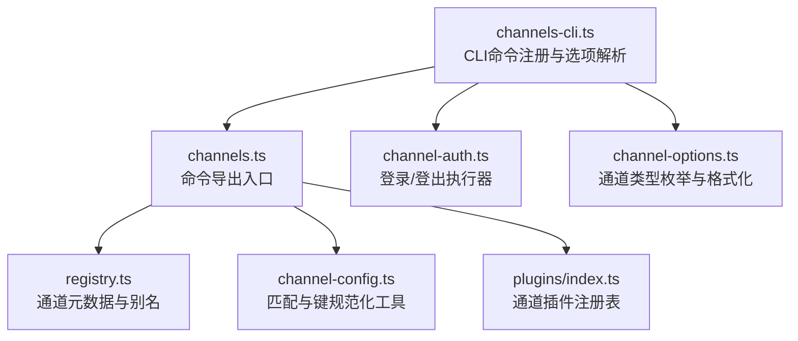
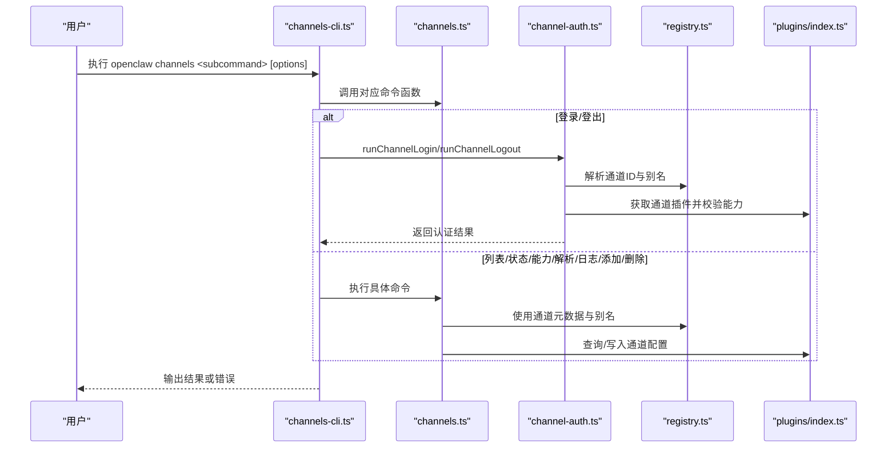
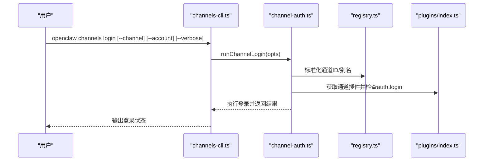
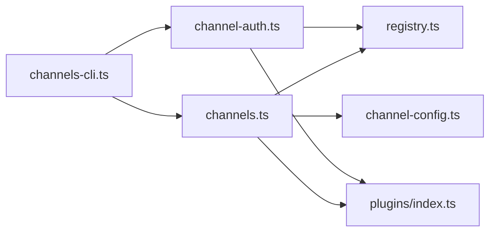

# 频道管理命令

<cite>
**本文引用的文件**
- [channels-cli.ts](file://src/cli/channels-cli.ts)
- [channel-auth.ts](file://src/cli/channel-auth.ts)
- [channel-options.ts](file://src/cli/channel-options.ts)
- [channels.ts](file://src/commands/channels.ts)
- [registry.ts](file://src/channels/registry.ts)
- [channel-config.ts](file://src/channels/channel-config.ts)
- [plugins/index.ts](file://src/channels/plugins/index.ts)
</cite>

## 目录

1. [简介](#简介)
2. [项目结构](#项目结构)
3. [核心组件](#核心组件)
4. [架构总览](#架构总览)
5. [详细组件分析](#详细组件分析)
6. [依赖关系分析](#依赖关系分析)
7. [性能考虑](#性能考虑)
8. [故障排除指南](#故障排除指南)
9. [结论](#结论)
10. [附录](#附录)

## 简介

本文件面向OpenClaw频道管理员与运维人员，系统化梳理“频道管理命令”的完整使用手册。内容覆盖频道的添加、删除、配置与状态查询；解释不同频道类型的配置方法、认证流程与连接参数；提供批量管理、配置导入导出与状态监控的实践建议；并总结故障排除、性能优化与安全配置的最佳实践。

## 项目结构

OpenClaw通过CLI命令组织频道管理能力，核心入口位于CLI层，命令解析后委托到命令模块，再由通道插件与配置系统协同完成具体操作。下图展示与“频道管理命令”直接相关的模块关系：

图表来源

- [channels-cli.ts](file://src/cli/channels-cli.ts#L70-L256)
- [channels.ts](file://src/commands/channels.ts#L1-L15)
- [channel-auth.ts](file://src/cli/channel-auth.ts#L1-L90)
- [channel-options.ts](file://src/cli/channel-options.ts#L1-L34)
- [registry.ts](file://src/channels/registry.ts#L1-L190)
- [channel-config.ts](file://src/channels/channel-config.ts#L1-L183)
- [plugins/index.ts](file://src/channels/plugins/index.ts#L1-L85)

章节来源

- [channels-cli.ts](file://src/cli/channels-cli.ts#L70-L256)
- [channels.ts](file://src/commands/channels.ts#L1-L15)
- [registry.ts](file://src/channels/registry.ts#L1-L190)

## 核心组件

- CLI命令注册与帮助：定义channels命令及其子命令（list、status、capabilities、resolve、logs、add、remove、login、logout），并提供示例与文档链接。
- 认证执行器：封装登录/登出流程，按通道能力动态调用插件提供的认证接口。
- 通道选项格式化：生成可用通道类型列表，支持扩展通道插件动态加入。
- 命令导出：统一导出各子命令的实现函数，供CLI层调用。
- 通道注册表：维护内置通道顺序、元信息、别名映射与规范化逻辑。
- 通道配置工具：提供键匹配、通配符匹配、父级回退、嵌套白名单决策等配置解析能力。
- 插件注册表：汇总已加载通道插件，去重排序并暴露查询接口。

章节来源

- [channels-cli.ts](file://src/cli/channels-cli.ts#L70-L256)
- [channel-auth.ts](file://src/cli/channel-auth.ts#L1-L90)
- [channel-options.ts](file://src/cli/channel-options.ts#L1-L34)
- [channels.ts](file://src/commands/channels.ts#L1-L15)
- [registry.ts](file://src/channels/registry.ts#L1-L190)
- [channel-config.ts](file://src/channels/channel-config.ts#L1-L183)
- [plugins/index.ts](file://src/channels/plugins/index.ts#L1-L85)

## 架构总览

下图展示“频道管理命令”的端到端调用链路，从CLI到命令实现再到通道插件与配置系统的协作关系：

图表来源

- [channels-cli.ts](file://src/cli/channels-cli.ts#L70-L256)
- [channels.ts](file://src/commands/channels.ts#L1-L15)
- [channel-auth.ts](file://src/cli/channel-auth.ts#L1-L90)
- [registry.ts](file://src/channels/registry.ts#L1-L190)
- [plugins/index.ts](file://src/channels/plugins/index.ts#L1-L85)

## 详细组件分析

### 命令注册与选项解析

- channels命令：提供“列出、状态、能力、解析、日志、添加、删除、登录、登出”九个子命令，并在帮助文本中给出典型用法与文档链接。
- 子命令选项：
  - list：可选输出JSON、可跳过模型用量快照。
  - status：支持探测凭据、超时控制、JSON输出。
  - capabilities：可指定通道、账号、目标，输出提供商能力清单。
  - resolve：支持名称/ID解析、目标类型选择、JSON输出。
  - logs：支持通道过滤、行数限制、JSON输出。
  - add：覆盖多通道的令牌、路径、服务、主机、端口、Webhook、矩阵、Tlon等参数。
  - remove：支持禁用/删除、账号选择、确认开关。
  - login/logout：支持通道与账号自动推断、登录日志详细程度。

章节来源

- [channels-cli.ts](file://src/cli/channels-cli.ts#L70-L256)

### 认证流程（登录/登出）

- 登录流程：
  - 解析通道输入（显式或默认），标准化通道ID，校验插件是否支持登录。
  - 解析账号上下文（显式或默认），调用插件的登录接口，不修改配置，仅建立会话。
  - 支持设置详细日志模式，便于排障。
- 登出流程：
  - 解析通道与账号，校验插件是否支持登出。
  - 清理会话状态，不删除配置。

图表来源

- [channel-auth.ts](file://src/cli/channel-auth.ts#L48-L68)
- [registry.ts](file://src/channels/registry.ts#L136-L149)
- [plugins/index.ts](file://src/channels/plugins/index.ts#L45-L51)

章节来源

- [channel-auth.ts](file://src/cli/channel-auth.ts#L1-L90)

### 通道类型与选项格式化

- 通道类型来源：
  - 内置通道顺序（如telegram、whatsapp、discord等）。
  - 插件目录中的通道插件ID。
  - 可通过环境变量开启“急切加载”，将已加载插件ID也纳入候选项。
- 格式化输出：以“a|b|c”形式在帮助中展示可用通道类型。

章节来源

- [channel-options.ts](file://src/cli/channel-options.ts#L1-L34)
- [registry.ts](file://src/channels/registry.ts#L7-L117)

### 通道元数据与别名

- 内置通道元信息：包括ID、标签、文档路径、简述、系统图标等。
- 别名映射：如imsg→imessage、internet-relay-chat→irc、google-chat/gchat→googlechat。
- 规范化：统一大小写、去除空白，优先别名映射，再检查内置顺序。

章节来源

- [registry.ts](file://src/channels/registry.ts#L26-L149)

### 配置匹配与键规范化

- 键候选构建：去重、去空、去空白，保证候选有序且唯一。
- 匹配策略：
  - 直接匹配：按给定键集合查找。
  - 归一化匹配：对键与条目键进行归一化后再匹配。
  - 父级回退：若无直接匹配，尝试父级键集合。
  - 通配符回退：若无直接匹配，回退到通配符键。
- 嵌套白名单决策：根据外层/内层配置与匹配结果综合判定。

章节来源

- [channel-config.ts](file://src/channels/channel-config.ts#L43-L183)

### 插件注册与查询

- 插件去重与排序：基于通道顺序与自定义order字段排序，保持稳定输出。
- 规范化通道ID：在插件注册表初始化后，支持跨插件的通道ID标准化与别名解析。

章节来源

- [plugins/index.ts](file://src/channels/plugins/index.ts#L12-L57)

## 依赖关系分析

- CLI层依赖命令导出模块，命令模块依赖通道注册表与插件注册表。
- 认证流程依赖通道注册表进行ID/别名解析，依赖插件注册表获取通道插件能力。
- 配置工具被命令模块广泛用于解析与匹配配置项。

图表来源

- [channels-cli.ts](file://src/cli/channels-cli.ts#L70-L256)
- [channels.ts](file://src/commands/channels.ts#L1-L15)
- [channel-auth.ts](file://src/cli/channel-auth.ts#L1-L90)
- [registry.ts](file://src/channels/registry.ts#L1-L190)
- [plugins/index.ts](file://src/channels/plugins/index.ts#L1-L85)
- [channel-config.ts](file://src/channels/channel-config.ts#L1-L183)

章节来源

- [channels-cli.ts](file://src/cli/channels-cli.ts#L70-L256)
- [channels.ts](file://src/commands/channels.ts#L1-L15)
- [channel-auth.ts](file://src/cli/channel-auth.ts#L1-L90)
- [registry.ts](file://src/channels/registry.ts#L1-L190)
- [plugins/index.ts](file://src/channels/plugins/index.ts#L1-L85)
- [channel-config.ts](file://src/channels/channel-config.ts#L1-L183)

## 性能考虑

- 通道选项“急切加载”：启用后会加载所有插件以扩展通道类型候选项，可能增加启动时间。建议在需要完整通道列表时临时启用，日常使用保持默认。
- 日志与探测：
  - status命令支持超时控制，合理设置超时避免长时间阻塞。
  - logs命令支持行数限制，默认200行，可根据需要调整。
- 配置匹配：
  - 大量键匹配场景下，优先使用直接匹配与通配符回退，减少父级回退的遍历成本。
  - 嵌套白名单决策逻辑简单明确，建议在配置层面尽量简化层级以降低决策复杂度。

## 故障排除指南

- 通道不支持登录/登出
  - 现象：提示通道不支持相应操作。
  - 排查：确认通道插件是否提供对应能力；检查通道ID/别名是否正确。
  - 参考
    - [channel-auth.ts](file://src/cli/channel-auth.ts#L31-L35)
    - [plugins/index.ts](file://src/channels/plugins/index.ts#L45-L51)
- 通道ID/别名解析失败
  - 现象：无法识别通道类型。
  - 排查：核对通道名称大小写与拼写；必要时使用resolve命令进行名称/ID解析。
  - 参考
    - [registry.ts](file://src/channels/registry.ts#L136-L149)
- 登录/登出未生效
  - 现象：会话未建立或未清理。
  - 排查：确认通道插件的登录/登出实现；检查账号上下文是否正确；查看详细日志。
  - 参考
    - [channel-auth.ts](file://src/cli/channel-auth.ts#L58-L67)
    - [channel-auth.ts](file://src/cli/channel-auth.ts#L76-L88)
- 配置匹配异常
  - 现象：键匹配不到或误匹配。
  - 排查：检查键候选构建与归一化规则；确认是否存在父级键或通配符键；评估嵌套白名单决策。
  - 参考
    - [channel-config.ts](file://src/channels/channel-config.ts#L60-L164)

章节来源

- [channel-auth.ts](file://src/cli/channel-auth.ts#L31-L35)
- [channel-auth.ts](file://src/cli/channel-auth.ts#L58-L67)
- [channel-auth.ts](file://src/cli/channel-auth.ts#L76-L88)
- [registry.ts](file://src/channels/registry.ts#L136-L149)
- [channel-config.ts](file://src/channels/channel-config.ts#L60-L164)

## 结论

OpenClaw的频道管理命令以CLI为中心，结合通道注册表与插件注册表，实现了对多通道的统一管理与扩展。通过规范化的通道ID/别名解析、灵活的配置匹配与键规范化工具，以及可插拔的认证流程，管理员可以高效地完成频道的添加、删除、配置与状态查询，并在复杂环境中进行批量管理与监控。

## 附录

### 常用命令速查

- 列出已配置通道与认证配置
  - openclaw channels list [--no-usage] [--json]
- 查看网关通道状态
  - openclaw channels status [--probe] [--timeout <毫秒>] [--json]
- 查看提供商能力
  - openclaw channels capabilities [--channel <名称>] [--account <ID>] [--target <目标>] [--timeout <毫秒>] [--json]
- 名称/ID解析
  - openclaw channels resolve <条目...> [--channel <名称>] [--account <ID>] [--kind <auto|user|group>] [--json]
- 查看最近日志
  - openclaw channels logs [--channel <名称>] [--lines <行数>] [--json]
- 添加/更新通道账号
  - openclaw channels add --channel <名称> [更多参数...]
  - 支持的通道参数详见下节
- 删除/禁用通道账号
  - openclaw channels remove --channel <名称> [--account <ID>] [--delete]
- 登录/登出
  - openclaw channels login [--channel <名称>] [--account <ID>] [--verbose]
  - openclaw channels logout [--channel <名称>] [--account <ID>]

章节来源

- [channels-cli.ts](file://src/cli/channels-cli.ts#L70-L256)

### 通道类型与关键参数

- 通用参数
  - --channel <名称>：通道类型（来自内置通道与插件通道）
  - --account <ID>：账号ID（省略时使用默认）
  - --name <名称>：显示名称
  - --use-env：使用环境变量中的令牌（默认账号）
- Telegram
  - --token <令牌> 或 --token-file <路径>
- Slack
  - --bot-token <令牌>（xoxb-...）
  - --app-token <令牌>（xapp-...）
- Signal
  - --signal-number <E.164>
  - --cli-path <路径>（signal-cli或imsg）
  - --db-path <路径>（iMessage数据库）
  - --service <服务>（imessage|sms|auto）
  - --region <区域>（短信区域）
  - --http-url/--http-host/--http-port
- Google Chat
  - --webhook-path <路径>
  - --webhook-url <URL>
  - --audience-type <类型>（app-url|project-number）
  - --audience <值>
- Matrix
  - --homeserver <URL>
  - --user-id <ID>
  - --access-token <令牌>
  - --password <密码>
  - --device-name <名称>
  - --initial-sync-limit <数量>
- Tlon（Urbit）
  - --ship <名称>
  - --url <URL>
  - --code <验证码>
  - --group-channels <逗号分隔列表>
  - --dm-allowlist <逗号分隔列表>
  - --auto-discover-channels/--no-auto-discover-channels

章节来源

- [channels-cli.ts](file://src/cli/channels-cli.ts#L165-L206)
- [channels-cli.ts](file://src/cli/channels-cli.ts#L221-L238)

### 批量管理与配置导入导出建议

- 批量添加
  - 使用脚本循环调用channels add，按通道类型准备参数文件，逐条注入令牌与连接参数。
- 批量删除
  - channels remove配合--delete选项，谨慎使用；建议先channels list导出当前配置作为备份。
- 导入导出
  - 通过channels list --json导出配置快照，结合外部工具（如YAML/JSON处理器）进行批量处理。
  - 将处理后的配置回写至配置存储（遵循配置schema），随后运行channels status验证连通性。

章节来源

- [channels-cli.ts](file://src/cli/channels-cli.ts#L92-L162)
- [channels-cli.ts](file://src/cli/channels-cli.ts#L208-L219)

### 安全配置最佳实践

- 最小权限原则：为各通道分配最小所需权限（如Slack的bot/app token），避免使用全局访问令牌。
- 机密存储：优先使用令牌文件或环境变量，避免明文写入配置文件。
- 会话管理：定期执行channels logout清理会话，防止长期挂载导致的安全风险。
- 网络隔离：为Signal/Matrix等通道配置合理的HTTP/HTTPS与端口策略，限制暴露面。

章节来源

- [channels-cli.ts](file://src/cli/channels-cli.ts#L221-L238)
- [channels-cli.ts](file://src/cli/channels-cli.ts#L240-L255)
