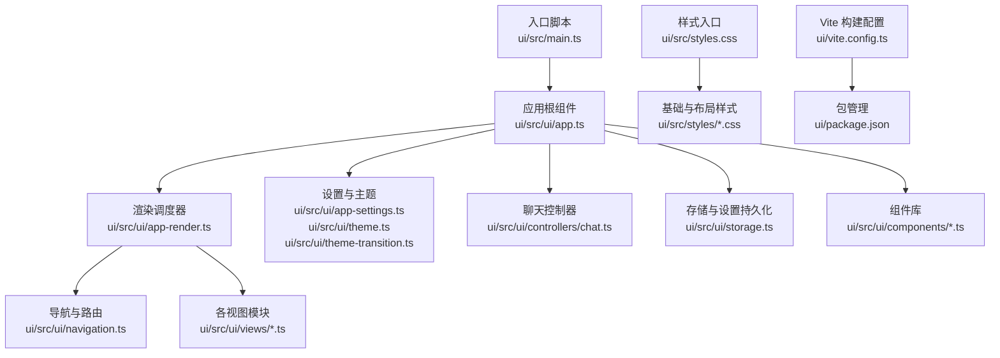
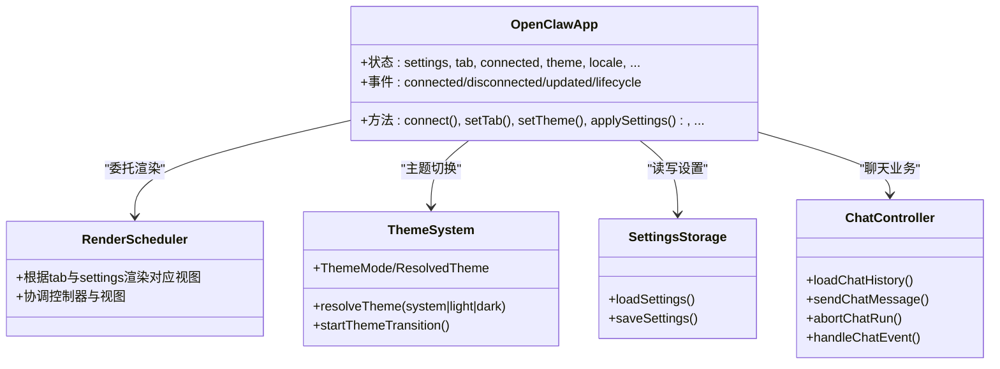
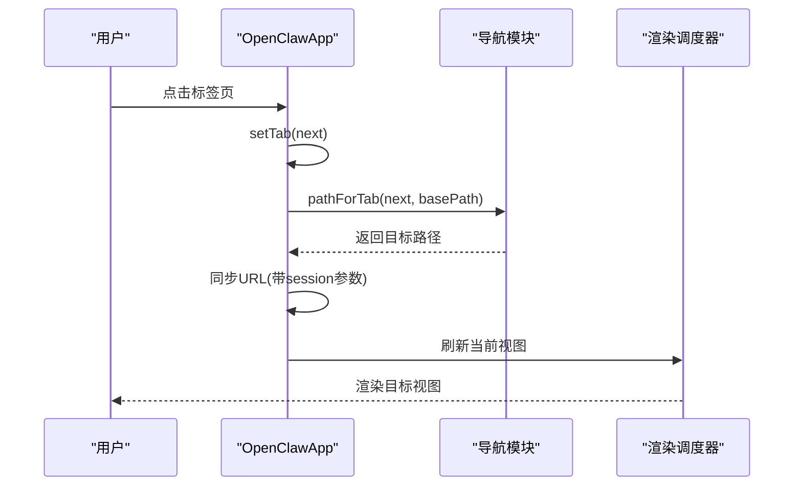
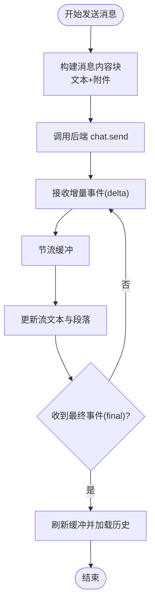
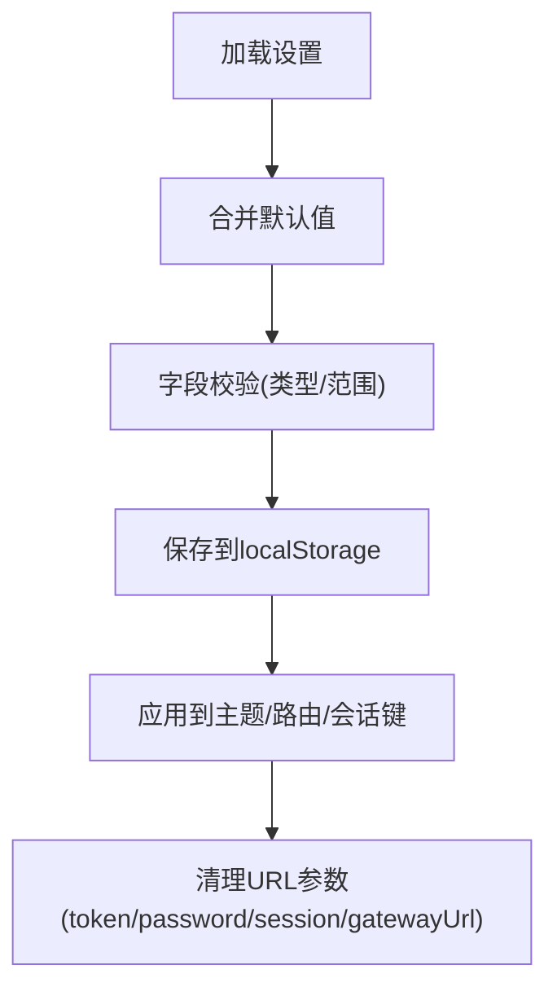
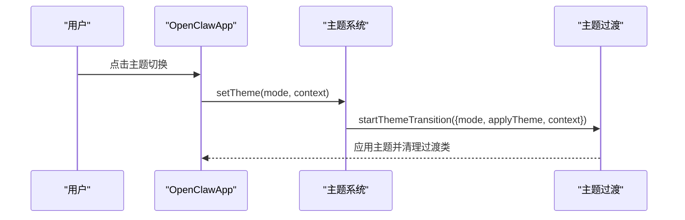
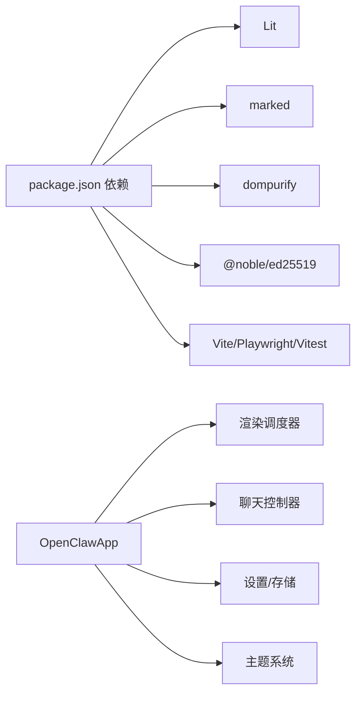

# Web界面

<cite>
**本文引用的文件**
- [ui/src/main.ts](file://ui/src/main.ts)
- [ui/src/styles.css](file://ui/src/styles.css)
- [ui/vite.config.ts](file://ui/vite.config.ts)
- [ui/package.json](file://ui/package.json)
- [ui/src/ui/app.ts](file://ui/src/ui/app.ts)
- [ui/src/ui/app-render.ts](file://ui/src/ui/app-render.ts)
- [ui/src/ui/navigation.ts](file://ui/src/ui/navigation.ts)
- [ui/src/ui/theme.ts](file://ui/src/ui/theme.ts)
- [ui/src/ui/theme-transition.ts](file://ui/src/ui/theme-transition.ts)
- [ui/src/ui/storage.ts](file://ui/src/ui/storage.ts)
- [ui/src/ui/app-settings.ts](file://ui/src/ui/app-settings.ts)
- [ui/src/ui/views/chat.ts](file://ui/src/ui/views/chat.ts)
- [ui/src/ui/controllers/chat.ts](file://ui/src/ui/controllers/chat.ts)
- [ui/src/ui/components/resizable-divider.ts](file://ui/src/ui/components/resizable-divider.ts)
- [ui/src/ui/components/terminal-viewer.ts](file://ui/src/ui/components/terminal-viewer.ts)
- [ui/src/ui/app-channels.ts](file://ui/src/ui/app-channels.ts)
- [ui/src/ui/app-chat.ts](file://ui/src/ui/app-chat.ts)
- [ui/src/ui/app-gateway.ts](file://ui/src/ui/app-gateway.ts)
- [ui/src/ui/app-lifecycle.ts](file://ui/src/ui/app-lifecycle.ts)
- [ui/src/ui/app-scroll.ts](file://ui/src/ui/app-scroll.ts)
- [ui/src/ui/app-tool-stream.ts](file://ui/src/ui/app-tool-stream.ts)
- [ui/src/ui/app-view-state.ts](file://ui/src/ui/app-view-state.ts)
- [ui/src/ui/app-polling.ts](file://ui/src/ui/app-polling.ts)
- [ui/src/ui/app-render.helpers.ts](file://ui/src/ui/app-render.helpers.ts)
- [ui/src/ui/app-scroll.ts](file://ui/src/ui/app-scroll.ts)
- [ui/src/ui/app-tool-stream.ts](file://ui/src/ui/app-tool-stream.ts)
- [ui/src/ui/app-view-state.ts](file://ui/src/ui/app-view-state.ts)
- [ui/src/ui/app.ts](file://ui/src/ui/app.ts)
- [ui/src/ui/types.ts](file://ui/src/ui/types.ts)
- [ui/src/ui/ui-types.ts](file://ui/src/ui/ui-types.ts)
- [ui/src/ui/chat/grouped-render.ts](file://ui/src/ui/chat/grouped-render.ts)
- [ui/src/ui/chat/message-extract.ts](file://ui/src/ui/chat/message-extract.ts)
- [ui/src/ui/chat/message-normalizer.ts](file://ui/src/ui/chat/message-normalizer.ts)
- [ui/src/ui/chat/tool-cards.ts](file://ui/src/ui/chat/tool-cards.ts)
- [ui/src/ui/chat/tool-helpers.ts](file://ui/src/ui/chat/tool-helpers.ts)
- [ui/src/ui/chat/typewriter-directive.ts](file://ui/src/ui/chat/typewriter-directive.ts)
- [ui/src/ui/data/moonshot-kimi-k2.ts](file://ui/src/ui/data/moonshot-kimi-k2.ts)
- [ui/src/ui/i18n/index.ts](file://ui/src/ui/i18n/index.ts)
- [ui/src/ui/markdown.ts](file://ui/src/ui/markdown.ts)
- [ui/src/ui/format.ts](file://ui/src/ui/format.ts)
- [ui/src/ui/text-direction.ts](file://ui/src/ui/text-direction.ts)
- [ui/src/ui/tool-display.json](file://ui/src/ui/tool-display.json)
- [ui/src/ui/tool-display.ts](file://ui/src/ui/tool-display.ts)
- [ui/src/ui/usage-helpers.ts](file://ui/src/ui/usage-helpers.ts)
- [ui/src/ui/uuid.ts](file://ui/src/ui/uuid.ts)
- [ui/src/ui/views/agents.ts](file://ui/src/ui/views/agents.ts)
- [ui/src/ui/views/channels.ts](file://ui/src/ui/views/channels.ts)
- [ui/src/ui/views/config.ts](file://ui/src/ui/views/config.ts)
- [ui/src/ui/views/cron.ts](file://ui/src/ui/views/cron.ts)
- [ui/src/ui/views/debug.ts](file://ui/src/ui/views/debug.ts)
- [ui/src/ui/views/delete-session-dialog.ts](file://ui/src/ui/views/delete-session-dialog.ts)
- [ui/src/ui/views/exec-approval.ts](file://ui/src/ui/views/exec-approval.ts)
- [ui/src/ui/views/gateway-url-confirmation.ts](file://ui/src/ui/views/gateway-url-confirmation.ts)
- [ui/src/ui/views/instances.ts](file://ui/src/ui/views/instances.ts)
- [ui/src/ui/views/logs.ts](file://ui/src/ui/views/logs.ts)
- [ui/src/ui/views/markdown-sidebar.ts](file://ui/src/ui/views/markdown-sidebar.ts)
- [ui/src/ui/views/nodes.ts](file://ui/src/ui/views/nodes.ts)
- [ui/src/ui/views/overview.ts](file://ui/src/ui/views/overview.ts)
- [ui/src/ui/views/sessions.ts](file://ui/src/ui/views/sessions.ts)
- [ui/src/ui/views/skills.ts](file://ui/src/ui/views/skills.ts)
- [ui/src/ui/views/usage.ts](file://ui/src/ui/views/usage.ts)
- [ui/src/ui/views/usageStyles.ts](file://ui/src/ui/views/usageStyles.ts)
- [ui/src/ui/views/usageTypes.ts](file://ui/src/ui/views/usageTypes.ts)
- [ui/src/ui/views/chat-sessions-sidebar.ts](file://ui/src/ui/views/chat-sessions-sidebar.ts)
- [ui/src/ui/views/chat.ts](file://ui/src/ui/views/chat.ts)
- [ui/src/ui/views/config-form.ts](file://ui/src/ui/views/config-form.ts)
- [ui/src/ui/views/config-form.render.ts](file://ui/src/ui/views/config-form.render.ts)
- [ui/src/ui/views/config-form.shared.ts](file://ui/src/ui/views/config-form.shared.ts)
- [ui/src/ui/views/config-form.analyze.ts](file://ui/src/ui/views/config-form.analyze.ts)
- [ui/src/ui/views/config-form.node.ts](file://ui/src/ui/views/config-form.node.ts)
- [ui/src/ui/views/channels.config.ts](file://ui/src/ui/views/channels.config.ts)
- [ui/src/ui/views/channels.discord.ts](file://ui/src/ui/views/channels.discord.ts)
- [ui/src/ui/views/channels.googlechat.ts](file://ui/src/ui/views/channels.googlechat.ts)
- [ui/src/ui/views/channels.imessage.ts](file://ui/src/ui/views/channels.imessage.ts)
- [ui/src/ui/views/channels.nostr.ts](file://ui/src/ui/views/channels.nostr.ts)
- [ui/src/ui/views/channels.nostr-profile-form.ts](file://ui/src/ui/views/channels.nostr-profile-form.ts)
- [ui/src/ui/views/channels.shared.ts](file://ui/src/ui/views/channels.shared.ts)
- [ui/src/ui/views/channels.signal.ts](file://ui/src/ui/views/channels.signal.ts)
- [ui/src/ui/views/channels.slack.ts](file://ui/src/ui/views/channels.slack.ts)
- [ui/src/ui/views/channels.telegram.ts](file://ui/src/ui/views/channels.telegram.ts)
- [ui/src/ui/views/channels.types.ts](file://ui/src/ui/views/channels.types.ts)
- [ui/src/ui/views/channels.whatsapp.ts](file://ui/src/ui/views/channels.whatsapp.ts)
- [ui/src/ui/views/channels.ts](file://ui/src/ui/views/channels.ts)
- [ui/src/ui/views/channels.types.ts](file://ui/src/ui/views/channels.types.ts)
- [ui/src/ui/views/agents.ts](file://ui/src/ui/views/agents.ts)
- [ui/src/ui/views/agents.ts](file://ui/src/ui/views/agents.ts)
- [ui/src/ui/views/agents.ts](file://ui/src/ui/views/agents.ts)
- [ui/src/ui/views/agents.ts](file://ui/src/ui/views/agents.ts)
- [ui/src/ui/views/agents.ts](file://ui/src/ui/views/agents.ts)
- [ui/src/ui/views/agents.ts](file://ui/src/ui/views/agents.ts)
- [ui/src/ui/views/agents.ts](file://ui/src/ui/views/agents.ts)
- [ui/src/ui/views/agents.ts](file://ui/src/ui/views/agents.ts)
- [ui/src/ui/views/agents.ts](file://ui/src/ui/views/agents.ts)
- [ui/src/ui/views/agents.ts](file://ui/src/ui/views/agents.ts)
- [ui/src/ui/views/agents.ts](file://ui/src/ui/views/agents.ts)
- [ui/src/ui/views/agents.ts](file://ui/src/ui/views/agents.ts)
- [ui/src/ui/views/agents.ts](file://ui/src/ui/views/agents.ts)
- [ui/src/ui/views/agents.ts](file://ui/src/ui/views/agents.ts)
- [ui/src/ui/views/agents.ts](file://ui/src/ui/views/agents.ts)
- [ui/src/ui/views/agents.ts](file://ui/src/ui/views/agents.ts)
- [ui/src/ui/views/agents.ts](file://ui/src/ui/views/agents.ts)
- [ui/src/ui/views/agents.ts](file://ui/src/ui/views/agents.ts)
- [ui/src/ui/views/agents.ts](file://ui/src/ui/views/agents.ts)
- [ui/src/ui/views/agents.ts](file://ui/src/ui/views/agents.ts)
- [ui/src/ui/views/agents.ts](file://ui/src/ui/views/agents.ts)
- [ui/src/ui/views/agents.ts](file://ui/src/ui/views/agents.ts)
- [ui/src/ui/views/agents.ts](file://ui/src/ui/views/agents.ts)
- [ui/src/ui/views/agents.ts](file://ui/src/ui/views/agents.ts)
- [ui/src/ui/views/agents.ts](file://ui/src/ui/views/agents......)
</cite>

## 目录

1. [简介](#简介)
2. [项目结构](#项目结构)
3. [核心组件](#核心组件)
4. [架构总览](#架构总览)
5. [详细组件分析](#详细组件分析)
6. [依赖关系分析](#依赖关系分析)
7. [性能考量](#性能考量)
8. [故障排查指南](#故障排查指南)
9. [结论](#结论)
10. [附录](#附录)

## 简介

本文件为 OpenClaw Web 界面系统的深度技术文档，覆盖控制面板、聊天界面、设置与配置管理、自定义主题系统，以及组件架构、状态管理与用户交互模式。文档还记录了响应式设计、可访问性与跨浏览器兼容策略，并提供组件属性、事件、插槽与自定义选项说明，以及样式与主题定制指南与组件组合模式。

## 项目结构

Web 控制界面采用基于 Lit 的渐进式前端架构，构建于 Vite 之上，样式通过模块化 CSS 组织，路由与标签页由导航模块统一管理，应用状态集中于一个自定义元素中并通过控制器与视图解耦。

图表来源

- [ui/src/main.ts](file://ui/src/main.ts#L1-L3)
- [ui/src/ui/app.ts](file://ui/src/ui/app.ts#L1-L707)
- [ui/src/ui/app-render.ts](file://ui/src/ui/app-render.ts#L1-L1461)
- [ui/src/ui/navigation.ts](file://ui/src/ui/navigation.ts#L1-L175)
- [ui/src/ui/app-settings.ts](file://ui/src/ui/app-settings.ts#L1-L438)
- [ui/src/ui/theme.ts](file://ui/src/ui/theme.ts#L1-L17)
- [ui/src/ui/theme-transition.ts](file://ui/src/ui/theme-transition.ts#L1-L110)
- [ui/src/ui/controllers/chat.ts](file://ui/src/ui/controllers/chat.ts#L1-L376)
- [ui/src/ui/storage.ts](file://ui/src/ui/storage.ts#L1-L72)
- [ui/src/ui/components/resizable-divider.ts](file://ui/src/ui/components/resizable-divider.ts)
- [ui/src/ui/components/terminal-viewer.ts](file://ui/src/ui/components/terminal-viewer.ts)
- [ui/src/styles.css](file://ui/src/styles.css#L1-L7)
- [ui/vite.config.ts](file://ui/vite.config.ts#L1-L42)
- [ui/package.json](file://ui/package.json#L1-L24)

章节来源

- [ui/src/main.ts](file://ui/src/main.ts#L1-L3)
- [ui/src/ui/app.ts](file://ui/src/ui/app.ts#L1-L707)
- [ui/src/ui/app-render.ts](file://ui/src/ui/app-render.ts#L1-L1461)
- [ui/src/ui/navigation.ts](file://ui/src/ui/navigation.ts#L1-L175)
- [ui/src/ui/app-settings.ts](file://ui/src/ui/app-settings.ts#L1-L438)
- [ui/src/ui/theme.ts](file://ui/src/ui/theme.ts#L1-L17)
- [ui/src/ui/theme-transition.ts](file://ui/src/ui/theme-transition.ts#L1-L110)
- [ui/src/ui/controllers/chat.ts](file://ui/src/ui/controllers/chat.ts#L1-L376)
- [ui/src/ui/storage.ts](file://ui/src/ui/storage.ts#L1-L72)
- [ui/src/ui/components/resizable-divider.ts](file://ui/src/ui/components/resizable-divider.ts)
- [ui/src/ui/components/terminal-viewer.ts](file://ui/src/ui/components/terminal-viewer.ts)
- [ui/src/styles.css](file://ui/src/styles.css#L1-L7)
- [ui/vite.config.ts](file://ui/vite.config.ts#L1-L42)
- [ui/package.json](file://ui/package.json#L1-L24)

## 核心组件

- 应用根组件 openclaw-app：承载全局状态、生命周期钩子、主题切换、路由同步、聊天与日志滚动、工具流等。
- 渲染调度器：根据当前标签页与设置，拼装并渲染对应视图，协调控制器与视图层。
- 主题系统：支持 system/light/dark 三种模式，支持视图过渡动画与系统偏好监听。
- 存储与设置：封装 UiSettings 的读取、合并默认值、校验与持久化。
- 聊天控制器：负责流式文本节流、超时检测、消息发送、中止与历史加载。
- 组件库：可调整分割比例的分割条、终端输出查看器等可复用 UI 元素。

章节来源

- [ui/src/ui/app.ts](file://ui/src/ui/app.ts#L111-L707)
- [ui/src/ui/app-render.ts](file://ui/src/ui/app-render.ts#L113-L92)
- [ui/src/ui/theme.ts](file://ui/src/ui/theme.ts#L1-L17)
- [ui/src/ui/theme-transition.ts](file://ui/src/ui/theme-transition.ts#L46-L110)
- [ui/src/ui/storage.ts](file://ui/src/ui/storage.ts#L19-L72)
- [ui/src/ui/controllers/chat.ts](file://ui/src/ui/controllers/chat.ts#L18-L376)
- [ui/src/ui/components/resizable-divider.ts](file://ui/src/ui/components/resizable-divider.ts)
- [ui/src/ui/components/terminal-viewer.ts](file://ui/src/ui/components/terminal-viewer.ts)

## 架构总览

应用采用“自定义元素 + 控制器 + 视图”的分层架构。自定义元素集中状态与生命周期；渲染器按需装配视图；控制器封装业务逻辑；组件库提供可复用 UI；主题系统与存储模块横切关注点。

图表来源

- [ui/src/ui/app.ts](file://ui/src/ui/app.ts#L111-L707)
- [ui/src/ui/app-render.ts](file://ui/src/ui/app-render.ts#L113-L92)
- [ui/src/ui/theme.ts](file://ui/src/ui/theme.ts#L1-L17)
- [ui/src/ui/theme-transition.ts](file://ui/src/ui/theme-transition.ts#L46-L110)
- [ui/src/ui/storage.ts](file://ui/src/ui/storage.ts#L19-L72)
- [ui/src/ui/controllers/chat.ts](file://ui/src/ui/controllers/chat.ts#L164-L376)

## 详细组件分析

### 控制面板与导航

- 标签页分组与路径映射：导航模块定义四组标签页，提供路径解析、标题与图标解析、基础路径归一化。
- URL 同步：根据当前标签页与会话键同步至浏览器地址栏，支持 popstate 与路由变化。
- 侧边栏与分组折叠：支持整体侧边栏折叠与分组折叠，折叠状态持久化于设置。

图表来源

- [ui/src/ui/navigation.ts](file://ui/src/ui/navigation.ts#L36-L109)
- [ui/src/ui/app-settings.ts](file://ui/src/ui/app-settings.ts#L375-L398)
- [ui/src/ui/app-render.ts](file://ui/src/ui/app-render.ts#L113-L92)

章节来源

- [ui/src/ui/navigation.ts](file://ui/src/ui/navigation.ts#L1-L175)
- [ui/src/ui/app-settings.ts](file://ui/src/ui/app-settings.ts#L319-L398)
- [ui/src/ui/app-render.ts](file://ui/src/ui/app-render.ts#L113-L92)

### 聊天界面与消息流

- 流式文本节流：聊天控制器对增量文本进行缓冲与节流，避免频繁渲染；支持段落边界信息传递。
- 超时与自动刷新：若长时间无更新，触发历史刷新以保持一致性。
- 附件上传：支持图片粘贴预览与移除，发送时转换为后端可识别格式。
- 会话与队列：支持消息排队、新消息提示、滚动控制与焦点模式。

图表来源

- [ui/src/ui/controllers/chat.ts](file://ui/src/ui/controllers/chat.ts#L207-L300)
- [ui/src/ui/controllers/chat.ts](file://ui/src/ui/controllers/chat.ts#L319-L376)
- [ui/src/ui/views/chat.ts](file://ui/src/ui/views/chat.ts#L194-L438)

章节来源

- [ui/src/ui/controllers/chat.ts](file://ui/src/ui/controllers/chat.ts#L1-L376)
- [ui/src/ui/views/chat.ts](file://ui/src/ui/views/chat.ts#L1-L596)

### 设置与配置管理

- UiSettings 结构：包含网关地址、令牌、最近活动会话键、主题、聊天专注模式、思考展示、会话侧栏、分割比例、侧边栏折叠与分组折叠状态。
- 默认值与校验：加载时合并默认值并对字段进行类型与范围校验。
- 本地持久化：通过本地存储保存设置，支持从 URL 参数注入 token、password、session、gatewayUrl 并清理历史。

图表来源

- [ui/src/ui/storage.ts](file://ui/src/ui/storage.ts#L19-L72)
- [ui/src/ui/app-settings.ts](file://ui/src/ui/app-settings.ts#L84-L150)

章节来源

- [ui/src/ui/storage.ts](file://ui/src/ui/storage.ts#L1-L72)
- [ui/src/ui/app-settings.ts](file://ui/src/ui/app-settings.ts#L59-L82)
- [ui/src/ui/app-settings.ts](file://ui/src/ui/app-settings.ts#L84-L150)

### 自定义主题系统

- 主题模式：支持 system、light、dark；system 模式下监听系统配色偏好。
- 主题过渡：利用浏览器视图过渡 API，支持从指针位置或元素中心出发的主题切换动效，并尊重“减少动态”偏好。
- 根节点应用：通过 dataset 与 colorScheme 属性应用到根元素，影响 CSS 变量与原生控件。

图表来源

- [ui/src/ui/app-settings.ts](file://ui/src/ui/app-settings.ts#L173-L185)
- [ui/src/ui/theme-transition.ts](file://ui/src/ui/theme-transition.ts#L46-L110)
- [ui/src/ui/theme.ts](file://ui/src/ui/theme.ts#L11-L16)

章节来源

- [ui/src/ui/theme.ts](file://ui/src/ui/theme.ts#L1-L17)
- [ui/src/ui/theme-transition.ts](file://ui/src/ui/theme-transition.ts#L1-L110)
- [ui/src/ui/app-settings.ts](file://ui/src/ui/app-settings.ts#L267-L281)

### 组件属性、事件与插槽

- openclaw-app
  - 属性：settings、tab、connected、theme、locale、hello、eventLog、sessionKey、chat* 系列状态、sidebar* 系列状态、splitRatio 等。
  - 事件：connected/disconnected/updated/lifecycle 生命周期事件由控制器处理。
  - 方法：connect、setTab、setTheme、applySettings、handleSendChat、handleAbortChat、handleOpenSidebar、handleCloseSidebar、handleSplitRatioChange 等。
- chat 视图
  - 属性：sessionKey、onSessionKeyChange、thinkingLevel、showThinking、loading/sending、messages/toolMessages/stream、draft、queue、attachments、focusMode、sidebarOpen/content/error、splitRatio、assistantName/avatar、on\* 回调。
  - 事件：textarea 键盘事件、粘贴事件、滚动事件、发送/停止/新建会话按钮事件。
  - 插槽：通过回调与 props 组合实现内容扩展（如工具输出侧栏）。
- resizable-divider
  - 属性：splitRatio
  - 事件：resize(detail: { splitRatio })
  - 用途：聊天主区与侧栏的可拖拽分割。

章节来源

- [ui/src/ui/app.ts](file://ui/src/ui/app.ts#L111-L707)
- [ui/src/ui/views/chat.ts](file://ui/src/ui/views/chat.ts#L24-L77)
- [ui/src/ui/components/resizable-divider.ts](file://ui/src/ui/components/resizable-divider.ts)

### 样式自定义与主题支持

- 样式组织：通过样式入口聚合基础、布局、组件与聊天相关样式，支持移动端适配。
- 主题变量：通过根节点 dataset 与 colorScheme 影响 CSS 变量与系统控件颜色。
- 响应式：布局与移动端样式文件协同，确保在小屏设备上的可用性。
- 可访问性：提供 aria-\* 属性与语义化标签，如 role="log"、aria-live="polite"、aria-label 等。

章节来源

- [ui/src/styles.css](file://ui/src/styles.css#L1-L7)
- [ui/src/ui/app-settings.ts](file://ui/src/ui/app-settings.ts#L272-L281)
- [ui/src/ui/views/chat.ts](file://ui/src/ui/views/chat.ts#L216-L222)

### 组件组合模式与集成

- 视图组合：渲染调度器根据当前标签页选择对应视图模块，视图内部再组合子组件（如聊天线程、工具卡片、侧栏）。
- 控制器集成：聊天、通道、配置、节点、技能、使用统计等控制器分别封装业务逻辑并通过渲染器注入到视图。
- 组件复用：可调整分割条、终端查看器等组件在多处视图中复用。

章节来源

- [ui/src/ui/app-render.ts](file://ui/src/ui/app-render.ts#L77-L92)
- [ui/src/ui/views/chat.ts](file://ui/src/ui/views/chat.ts#L16-L16)
- [ui/src/ui/components/resizable-divider.ts](file://ui/src/ui/components/resizable-divider.ts)
- [ui/src/ui/components/terminal-viewer.ts](file://ui/src/ui/components/terminal-viewer.ts)

## 依赖关系分析

- 运行时依赖：Lit、marked、dompurify、@noble/ed25519。
- 构建与测试：Vite、Playwright、Vitest。
- 依赖注入与运行时：应用根组件作为依赖注入容器，向渲染器与控制器提供状态与方法。

图表来源

- [ui/package.json](file://ui/package.json#L11-L22)
- [ui/src/ui/app.ts](file://ui/src/ui/app.ts#L1-L707)
- [ui/src/ui/app-render.ts](file://ui/src/ui/app-render.ts#L1-L1461)
- [ui/src/ui/controllers/chat.ts](file://ui/src/ui/controllers/chat.ts#L1-L376)
- [ui/src/ui/app-settings.ts](file://ui/src/ui/app-settings.ts#L1-L438)
- [ui/src/ui/theme.ts](file://ui/src/ui/theme.ts#L1-L17)

章节来源

- [ui/package.json](file://ui/package.json#L1-L24)
- [ui/src/ui/app.ts](file://ui/src/ui/app.ts#L1-L707)

## 性能考量

- 聊天流节流：通过节流缓冲与 requestAnimationFrame/timeout 协同，平衡视觉流畅度与性能。
- 历史截断：聊天历史渲染限制，避免一次性渲染过多消息。
- 滚动优化：聊天与日志滚动采用帧调度与平滑滚动策略。
- 主题过渡：优先使用浏览器视图过渡 API，降级时快速回退，避免阻塞主线程。
- 构建优化：Vite 预优化依赖、产物 sourcemap 便于调试。

章节来源

- [ui/src/ui/controllers/chat.ts](file://ui/src/ui/controllers/chat.ts#L62-L110)
- [ui/src/ui/views/chat.ts](file://ui/src/ui/views/chat.ts#L440-L440)
- [ui/src/ui/app-scroll.ts](file://ui/src/ui/app-scroll.ts)
- [ui/src/ui/theme-transition.ts](file://ui/src/ui/theme-transition.ts#L66-L105)
- [ui/vite.config.ts](file://ui/vite.config.ts#L27-L34)

## 故障排查指南

- 连接问题：检查网关 URL 与令牌，确认连接状态指示；必要时通过网关 URL 确认对话框重新连接。
- 聊天无响应：确认会话键有效、未超过流超时；查看错误提示与最后错误状态。
- 主题切换无效：确认系统偏好与设置冲突；检查主题媒体监听是否注册。
- 侧边栏不显示：检查 splitRatio 与 sidebarOpen 状态；确认工具输出内容是否为空。
- 日志/调试自动刷新：确认当前标签页对应的轮询是否启动；检查轮询间隔与错误状态。

章节来源

- [ui/src/ui/app.ts](file://ui/src/ui/app.ts#L539-L575)
- [ui/src/ui/controllers/chat.ts](file://ui/src/ui/controllers/chat.ts#L148-L154)
- [ui/src/ui/app-settings.ts](file://ui/src/ui/app-settings.ts#L282-L317)
- [ui/src/ui/app.ts](file://ui/src/ui/app.ts#L656-L695)
- [ui/src/ui/app-polling.ts](file://ui/src/ui/app-polling.ts)

## 结论

OpenClaw Web 界面以 Lit 为核心，采用清晰的分层架构与模块化设计，实现了主题系统、聊天流式渲染、设置持久化与导航同步等关键能力。通过组件化与控制器分离，系统具备良好的可维护性与可扩展性；配合响应式与可访问性设计，满足多场景使用需求。

## 附录

- 构建与开发
  - 开发：npm 脚本提供 dev、build、preview、test。
  - 构建：Vite 输出目录 dist/control-ui，支持 base 路径配置。
- 国际化：i18n 模块提供多语言支持，导航标题与文案通过翻译键绑定。
- 安全：对剪贴板图像进行解析与校验，避免非法内容；对富文本进行净化处理。

章节来源

- [ui/package.json](file://ui/package.json#L5-L10)
- [ui/vite.config.ts](file://ui/vite.config.ts#L21-L41)
- [ui/src/ui/i18n/index.ts](file://ui/src/ui/i18n/index.ts)
- [ui/src/ui/markdown.ts](file://ui/src/ui/markdown.ts)
- [ui/src/ui/format.ts](file://ui/src/ui/format.ts)
