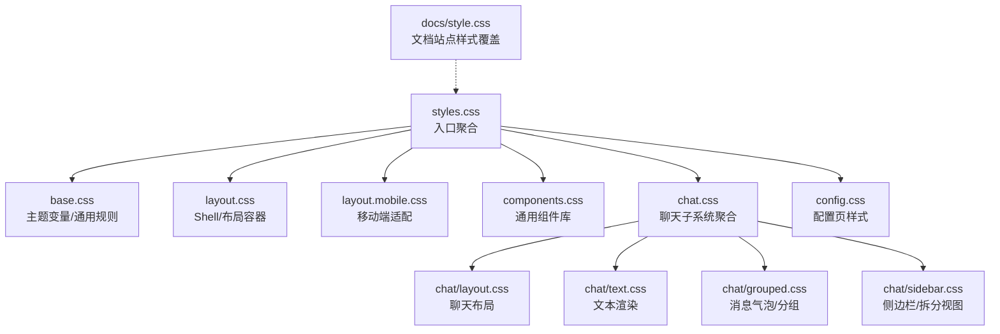
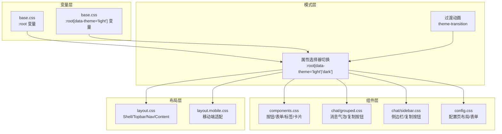
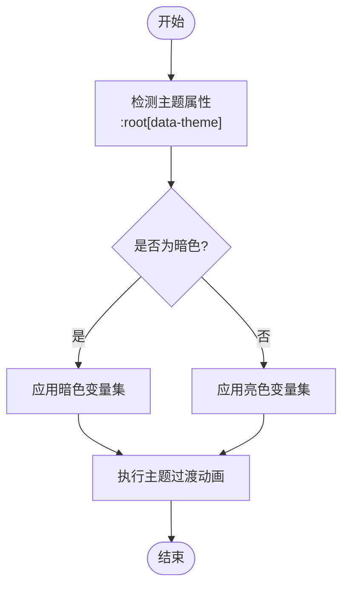
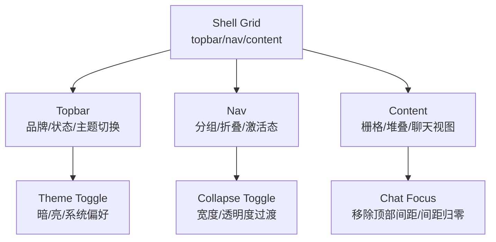
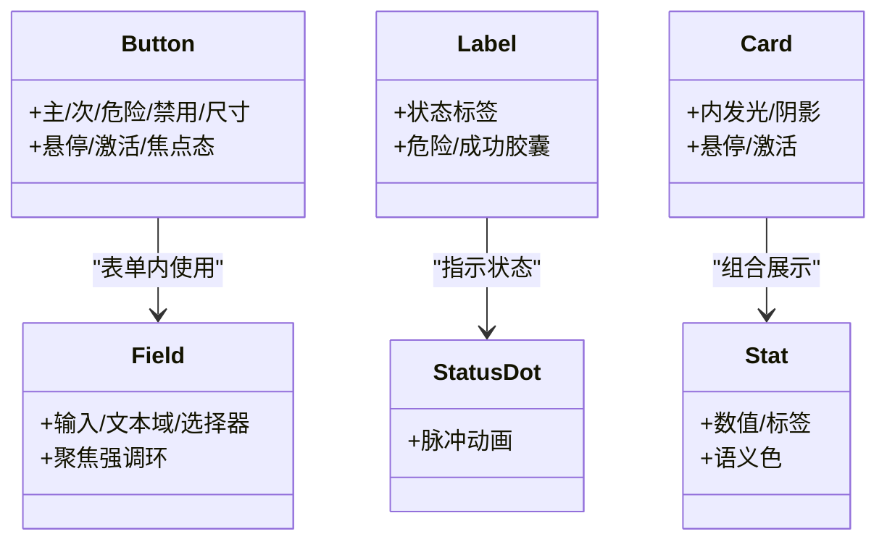
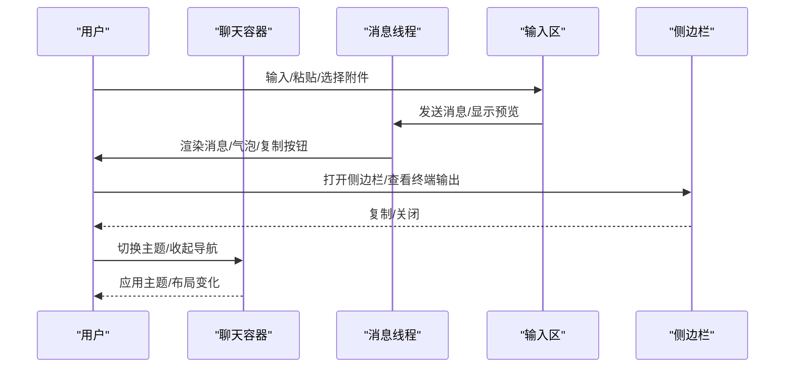
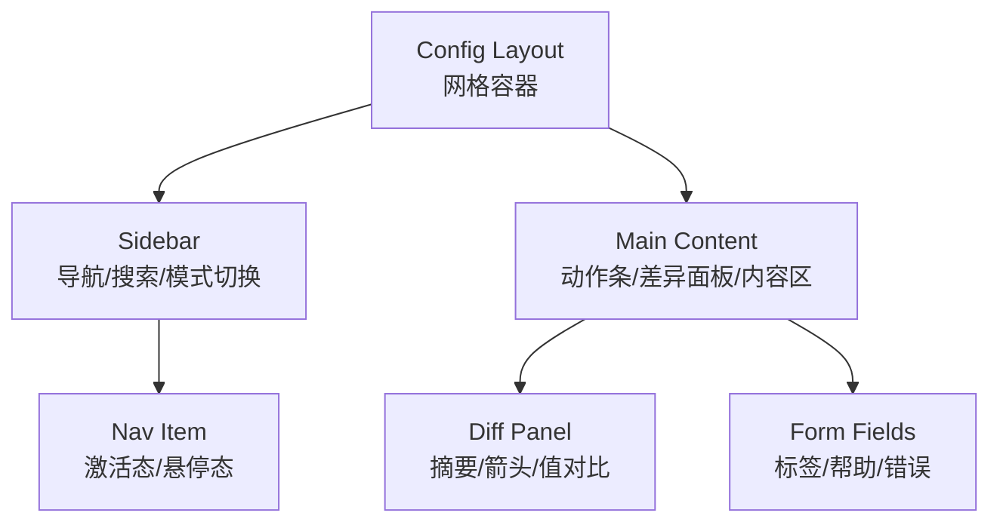
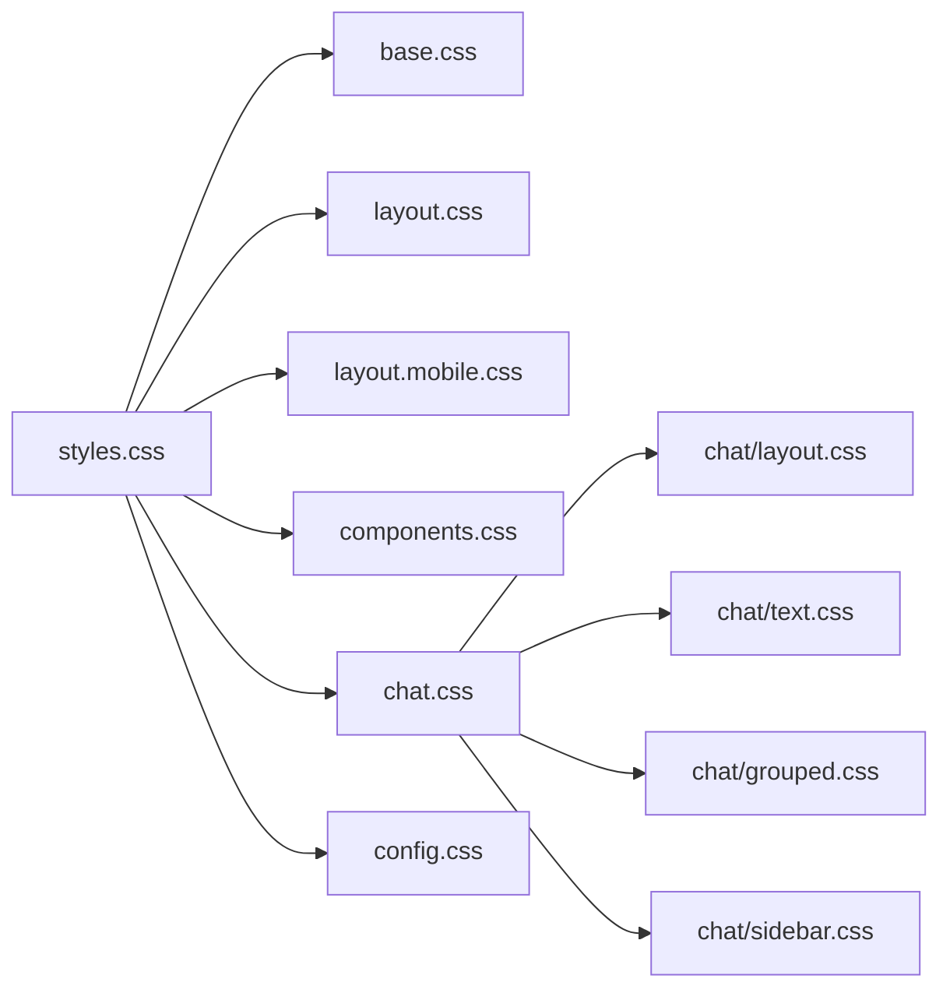

# 主题与样式

<cite>
**本文引用的文件**
- [ui/src/styles.css](file://ui/src/styles.css)
- [ui/src/styles/base.css](file://ui/src/styles/base.css)
- [ui/src/styles/config.css](file://ui/src/styles/config.css)
- [ui/src/styles/components.css](file://ui/src/styles/components.css)
- [ui/src/styles/layout.css](file://ui/src/styles/layout.css)
- [ui/src/styles/layout.mobile.css](file://ui/src/styles/layout.mobile.css)
- [ui/src/styles/chat.css](file://ui/src/styles/chat.css)
- [ui/src/styles/chat/layout.css](file://ui/src/styles/chat/layout.css)
- [ui/src/styles/chat/text.css](file://ui/src/styles/chat/text.css)
- [ui/src/styles/chat/grouped.css](file://ui/src/styles/chat/grouped.css)
- [ui/src/styles/chat/sidebar.css](file://ui/src/styles/chat/sidebar.css)
- [docs/style.css](file://docs/style.css)
</cite>

## 目录

1. [引言](#引言)
2. [项目结构](#项目结构)
3. [核心组件](#核心组件)
4. [架构总览](#架构总览)
5. [详细组件分析](#详细组件分析)
6. [依赖关系分析](#依赖关系分析)
7. [性能考量](#性能考量)
8. [故障排查指南](#故障排查指南)
9. [结论](#结论)
10. [附录](#附录)

## 引言

本文件面向OpenClaw前端主题与样式系统，系统性阐述主题架构、CSS变量管理、动态样式切换机制与品牌定制方案；并给出模块化组织、响应式设计、暗色/亮色模式实现、命名规范、颜色与字体体系、开发指南、覆盖策略与浏览器兼容建议，以及性能优化与动态加载实践。

## 项目结构

OpenClaw UI 样式采用模块化分层组织：顶层入口聚合各子模块样式，基础层定义主题变量与通用规则，布局层负责Shell与页面容器，组件层提供可复用UI构件，聊天层聚焦消息流与侧边栏等专用布局，配置页样式独立于通用组件样式以满足特定交互需求。

图表来源

- [ui/src/styles.css](file://ui/src/styles.css#L1-L7)
- [ui/src/styles/base.css](file://ui/src/styles/base.css#L1-L114)
- [ui/src/styles/layout.css](file://ui/src/styles/layout.css#L1-L622)
- [ui/src/styles/components.css](file://ui/src/styles/components.css#L1-L2480)
- [ui/src/styles/chat.css](file://ui/src/styles/chat.css#L1-L6)
- [ui/src/styles/chat/layout.css](file://ui/src/styles/chat/layout.css#L1-L443)
- [ui/src/styles/chat/text.css](file://ui/src/styles/chat/text.css#L1-L145)
- [ui/src/styles/chat/grouped.css](file://ui/src/styles/chat/grouped.css#L1-L351)
- [ui/src/styles/chat/sidebar.css](file://ui/src/styles/chat/sidebar.css#L1-L207)
- [ui/src/styles/config.css](file://ui/src/styles/config.css#L1-L1447)
- [docs/style.css](file://docs/style.css#L1-L4)

章节来源

- [ui/src/styles.css](file://ui/src/styles.css#L1-L7)
- [ui/src/styles/base.css](file://ui/src/styles/base.css#L1-L114)
- [ui/src/styles/layout.css](file://ui/src/styles/layout.css#L1-L622)
- [ui/src/styles/components.css](file://ui/src/styles/components.css#L1-L2480)
- [ui/src/styles/chat.css](file://ui/src/styles/chat.css#L1-L6)
- [ui/src/styles/chat/layout.css](file://ui/src/styles/chat/layout.css#L1-L443)
- [ui/src/styles/chat/text.css](file://ui/src/styles/chat/text.css#L1-L145)
- [ui/src/styles/chat/grouped.css](file://ui/src/styles/chat/grouped.css#L1-L351)
- [ui/src/styles/chat/sidebar.css](file://ui/src/styles/chat/sidebar.css#L1-L207)
- [ui/src/styles/config.css](file://ui/src/styles/config.css#L1-L1447)
- [docs/style.css](file://docs/style.css#L1-L4)

## 核心组件

- 主题变量与模式切换
  - 在根作用域集中声明主题变量，并通过属性选择器在不同主题间切换，支持暗色与亮色两套变量集，同时提供过渡动画与无障碍偏好适配。
- 布局与容器
  - Shell布局采用网格划分Topbar、导航与内容区域，支持折叠、聊天专注模式、引导页等场景；内容区提供栅格与堆叠等工具类。
- 组件库
  - 提供卡片、统计、标签、按钮、表单字段、状态点、调色板等通用组件，统一使用主题变量，确保跨页面一致性。
- 聊天系统
  - 包含消息分组、气泡、附件、输入区、侧边栏、拆分视图等专用布局，强调可读性与交互反馈。
- 配置页样式
  - 独立的配置页布局（侧边导航、主内容区、差异面板、表单字段）与组件样式，强调信息密度与操作效率。
- 文档站点样式覆盖
  - 对文档站点进行局部覆盖，如隐藏标题等。

章节来源

- [ui/src/styles/base.css](file://ui/src/styles/base.css#L3-L114)
- [ui/src/styles/layout.css](file://ui/src/styles/layout.css#L5-L622)
- [ui/src/styles/components.css](file://ui/src/styles/components.css#L7-L2480)
- [ui/src/styles/chat/layout.css](file://ui/src/styles/chat/layout.css#L6-L443)
- [ui/src/styles/chat/grouped.css](file://ui/src/styles/chat/grouped.css#L6-L351)
- [ui/src/styles/chat/sidebar.css](file://ui/src/styles/chat/sidebar.css#L2-L207)
- [ui/src/styles/config.css](file://ui/src/styles/config.css#L6-L1447)
- [docs/style.css](file://docs/style.css#L1-L4)

## 架构总览

主题系统围绕“变量—模式—组件—布局”的分层展开：变量层提供颜色、排版、阴影、圆角、动效参数；模式层通过属性选择器切换主题；组件层以变量驱动视觉；布局层以容器与网格组织页面结构；聊天与配置页作为领域特化样式在组件之上叠加。

图表来源

- [ui/src/styles/base.css](file://ui/src/styles/base.css#L3-L190)
- [ui/src/styles/components.css](file://ui/src/styles/components.css#L1-L2480)
- [ui/src/styles/chat/grouped.css](file://ui/src/styles/chat/grouped.css#L1-L351)
- [ui/src/styles/chat/sidebar.css](file://ui/src/styles/chat/sidebar.css#L1-L207)
- [ui/src/styles/config.css](file://ui/src/styles/config.css#L1-L1447)
- [ui/src/styles/layout.css](file://ui/src/styles/layout.css#L1-L622)
- [ui/src/styles/layout.mobile.css](file://ui/src/styles/layout.mobile.css#L1-L200)

## 详细组件分析

### 主题变量与模式切换

- 变量组织
  - 背景/卡片/面板/文本/边框/强调色/语义色/焦点/网格/字体/阴影/圆角/动效等变量集中定义，便于统一调整与扩展。
  - 暗色与亮色两套变量集，分别在根作用域与带属性选择器的块内声明，确保切换时变量值正确替换。
- 切换机制
  - 通过在根元素设置属性选择器实现主题切换，配合视图过渡动画实现平滑切换效果，并尊重用户“减少动效”偏好。
- 动画与无障碍
  - 定义主题切换动画帧序列，结合媒体查询在减少动效时禁用动画，提升可用性。

图表来源

- [ui/src/styles/base.css](file://ui/src/styles/base.css#L3-L190)
- [ui/src/styles/base.css](file://ui/src/styles/base.css#L212-L242)

章节来源

- [ui/src/styles/base.css](file://ui/src/styles/base.css#L3-L190)
- [ui/src/styles/base.css](file://ui/src/styles/base.css#L212-L242)

### 布局与容器（Shell/Topbar/Nav/Content）

- Shell网格布局
  - 使用CSS Grid将页面划分为Topbar、Nav、Content三区，支持导航折叠、聊天专注模式、引导页等场景，使用容器查询与媒体查询增强响应性。
- Topbar与导航
  - Topbar包含品牌、状态与主题切换控件；导航侧边栏支持折叠与分组，提供图标、文本与激活态样式。
- 内容区
  - 内容区提供栅格、堆叠、过滤器等工具类，支持聊天视图的特殊布局与间距控制。

图表来源

- [ui/src/styles/layout.css](file://ui/src/styles/layout.css#L5-L622)

章节来源

- [ui/src/styles/layout.css](file://ui/src/styles/layout.css#L5-L622)

### 组件库（按钮/表单/标签/卡片/状态）

- 按钮
  - 支持主次/危险/禁用/尺寸等变体，悬停/激活/焦点态具备一致的阴影与位移动画。
- 表单字段
  - 输入/文本域/选择器统一使用主题边框与高亮，聚焦时显示强调环与阴影。
- 标签与胶囊
  - 提供状态标签与危险/成功等语义胶囊，用于状态指示与紧凑信息展示。
- 卡片与统计
  - 卡片具备内发光与阴影，统计块突出数值与标签对比。
- 状态点
  - 提供脉冲动画的状态点，用于在线/离线/运行中等指示。

图表来源

- [ui/src/styles/components.css](file://ui/src/styles/components.css#L360-L473)
- [ui/src/styles/components.css](file://ui/src/styles/components.css#L478-L560)
- [ui/src/styles/components.css](file://ui/src/styles/components.css#L181-L210)
- [ui/src/styles/components.css](file://ui/src/styles/components.css#L7-L42)
- [ui/src/styles/components.css](file://ui/src/styles/components.css#L341-L355)

章节来源

- [ui/src/styles/components.css](file://ui/src/styles/components.css#L360-L473)
- [ui/src/styles/components.css](file://ui/src/styles/components.css#L478-L560)
- [ui/src/styles/components.css](file://ui/src/styles/components.css#L181-L210)
- [ui/src/styles/components.css](file://ui/src/styles/components.css#L7-L42)
- [ui/src/styles/components.css](file://ui/src/styles/components.css#L341-L355)

### 聊天系统（布局/文本/分组/侧边栏）

- 布局
  - 聊天容器采用Flex布局，头部固定、线程滚动、底部粘性输入区；支持新消息提示与附件预览。
- 文本
  - 统一段落、列表、代码、引用、分隔线等Markdown元素的排版与对比度，针对亮色模式提供更柔和的背景与边框。
- 分组与气泡
  - 用户与助手消息分组对齐，气泡具备复制按钮、流式打字光标、淡入动画与悬停态；支持流式边框脉冲。
- 侧边栏
  - 拆分视图容器，侧边栏支持粘性头部、复制按钮与Markdown渲染；移动端以全屏模态呈现。

图表来源

- [ui/src/styles/chat/layout.css](file://ui/src/styles/chat/layout.css#L6-L153)
- [ui/src/styles/chat/text.css](file://ui/src/styles/chat/text.css#L21-L124)
- [ui/src/styles/chat/grouped.css](file://ui/src/styles/chat/grouped.css#L131-L241)
- [ui/src/styles/chat/sidebar.css](file://ui/src/styles/chat/sidebar.css#L41-L167)

章节来源

- [ui/src/styles/chat/layout.css](file://ui/src/styles/chat/layout.css#L6-L153)
- [ui/src/styles/chat/text.css](file://ui/src/styles/chat/text.css#L21-L124)
- [ui/src/styles/chat/grouped.css](file://ui/src/styles/chat/grouped.css#L131-L241)
- [ui/src/styles/chat/sidebar.css](file://ui/src/styles/chat/sidebar.css#L41-L167)

### 配置页样式（布局/表单/差异面板）

- 布局
  - 采用网格布局，左侧导航、右侧主内容，支持搜索、模式切换、动作条与空态。
- 差异面板
  - 展示变更摘要与前后值对比，支持折叠与键盘可达性。
- 表单
  - 现代化表单网格、字段标签/帮助/错误提示、输入/文本域/数字输入等，均使用主题变量保持一致风格。

图表来源

- [ui/src/styles/config.css](file://ui/src/styles/config.css#L6-L250)
- [ui/src/styles/config.css](file://ui/src/styles/config.css#L289-L376)
- [ui/src/styles/config.css](file://ui/src/styles/config.css#L613-L800)

章节来源

- [ui/src/styles/config.css](file://ui/src/styles/config.css#L6-L250)
- [ui/src/styles/config.css](file://ui/src/styles/config.css#L289-L376)
- [ui/src/styles/config.css](file://ui/src/styles/config.css#L613-L800)

### 文档站点样式覆盖

- 文档站点对标题进行了隐藏覆盖，属于站点级样式调整，不影响主题系统核心逻辑。

章节来源

- [docs/style.css](file://docs/style.css#L1-L4)

## 依赖关系分析

- 入口聚合
  - 入口样式文件按层级顺序导入基础、布局、组件、配置与聊天子系统，形成稳定的依赖链。
- 组件与布局耦合
  - 组件样式依赖基础变量；聊天与配置页在组件之上叠加专用规则，避免污染通用组件。
- 移动端适配
  - 布局层提供媒体查询与容器查询，组件与聊天样式在小屏下调整间距、布局与可见性。

图表来源

- [ui/src/styles.css](file://ui/src/styles.css#L1-L7)
- [ui/src/styles/chat.css](file://ui/src/styles/chat.css#L1-L6)

章节来源

- [ui/src/styles.css](file://ui/src/styles.css#L1-L7)
- [ui/src/styles/chat.css](file://ui/src/styles/chat.css#L1-L6)

## 性能考量

- 变量驱动渲染
  - 通过CSS变量集中管理颜色与尺寸，减少重复样式与重绘成本。
- 动画与过渡
  - 使用轻量动画与过渡，配合媒体查询在减少动效时禁用，兼顾体验与性能。
- 响应式策略
  - 使用媒体查询与容器查询，避免过度重排；聊天与配置页在小屏下简化布局与交互。
- 文件体积与加载
  - 模块化导入，按需引入聊天或配置页样式，减少初始加载负担。

## 故障排查指南

- 主题切换无效
  - 检查根元素是否设置了正确的主题属性；确认变量块与属性选择器范围覆盖完整。
- 动画不生效
  - 确认未启用“减少动效”偏好；检查过渡动画关键帧与媒体查询条件。
- 聊天输入区遮挡
  - 检查粘性定位与背景渐变设置；确认在不同主题下的背景对比度。
- 移动端布局异常
  - 检查媒体查询断点与容器查询；验证侧边栏全屏模态逻辑。

章节来源

- [ui/src/styles/base.css](file://ui/src/styles/base.css#L212-L242)
- [ui/src/styles/chat/layout.css](file://ui/src/styles/chat/layout.css#L142-L153)
- [ui/src/styles/layout.css](file://ui/src/styles/layout.css#L568-L621)

## 结论

OpenClaw主题与样式系统以CSS变量为核心，通过属性选择器实现暗/亮主题切换，并以模块化方式组织布局、组件与领域特化样式。该架构在保证一致性的同时提供了良好的扩展性与可维护性，适合品牌定制与多端适配。

## 附录

### 主题变量命名规范

- 背景与表面
  - 背景：--bg、--bg-accent、--bg-elevated、--bg-hover、--bg-muted、--bg-content
  - 卡片/面板：--card、--card-foreground、--card-highlight、--panel、--panel-strong、--panel-hover、--chrome、--chrome-strong
- 文本与强调
  - 文本：--text、--text-strong、--chat-text、--muted、--muted-strong、--muted-foreground
  - 强调/语义：--accent、--accent-hover、--accent-muted、--accent-subtle、--accent-foreground、--accent-glow、--primary、--primary-foreground、--ok、--warn、--danger、--info
- 边框与输入
  - --border、--border-strong、--border-hover、--input、--ring
- 焦点与网格
  - --focus、--focus-ring、--focus-glow、--grid-line
- 字体与排版
  - --font-body、--font-display、--mono
- 阴影与圆角
  - --shadow-sm、--shadow-md、--shadow-lg、--shadow-xl、--shadow-glow、--radius、--radius-sm、--radius-md、--radius-lg、--radius-xl、--radius-full
- 动画与缓动
  - --ease-out、--ease-in-out、--ease-spring、--duration-fast、--duration-normal、--duration-slow
- 视图过渡
  - --theme-switch-x、--theme-switch-y

章节来源

- [ui/src/styles/base.css](file://ui/src/styles/base.css#L3-L114)

### 颜色系统与字体配置

- 颜色系统
  - 暗色：深沉背景、高对比卡片与面板、暖红为主强调色、青绿/琥珀/蓝色语义色
  - 亮色：浅色背景、柔和卡片与面板、暖红为主强调色、青绿/琥珀/蓝色语义色
- 字体
  - 正文字体：Space Grotesk；显示字体：Space Grotesk；等宽字体：JetBrains Mono及系统回退

章节来源

- [ui/src/styles/base.css](file://ui/src/styles/base.css#L1-L114)

### 命名约定与最佳实践

- 类名
  - 采用功能化命名，如 .btn、.field、.card、.chat-_、.config-_，避免与业务语义耦合
- 变量
  - 以语义前缀区分类型（--bg/--card/--text/--accent/--shadow/--radius/--ease/--duration），便于检索与维护
- 组件
  - 将通用组件置于components.css，领域特化样式置于对应子模块，避免全局污染
- 响应式
  - 使用媒体查询与容器查询，优先考虑小屏布局与交互简化

章节来源

- [ui/src/styles/components.css](file://ui/src/styles/components.css#L360-L473)
- [ui/src/styles/chat/grouped.css](file://ui/src/styles/chat/grouped.css#L131-L241)
- [ui/src/styles/layout.css](file://ui/src/styles/layout.css#L568-L621)

### 主题开发指南

- 新增主题
  - 在根作用域新增一套变量集，或在现有变量基础上扩展；确保与现有组件与布局变量兼容
- 自定义品牌
  - 通过覆盖关键变量（如强调色、主色、字体）实现品牌化；保持对比度与无障碍要求
- 样式覆盖
  - 使用更高特异性选择器或局部覆盖（如文档站点）；避免全局重写
- 浏览器兼容
  - 关注CSS变量、Grid、Container Queries、View Transitions等特性支持情况；必要时提供降级方案

章节来源

- [ui/src/styles/base.css](file://ui/src/styles/base.css#L3-L190)
- [docs/style.css](file://docs/style.css#L1-L4)

### 动态加载与缓存策略

- 动态加载
  - 通过脚本设置根元素的主题属性，触发变量切换；可结合视图过渡API实现平滑切换
- 缓存策略
  - 将主题变量与组件样式打包为稳定版本，利用浏览器缓存；在主题更新时采用版本化资源路径

章节来源

- [ui/src/styles/base.css](file://ui/src/styles/base.css#L212-L242)
