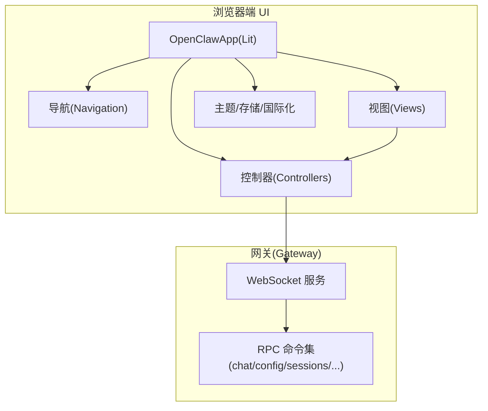
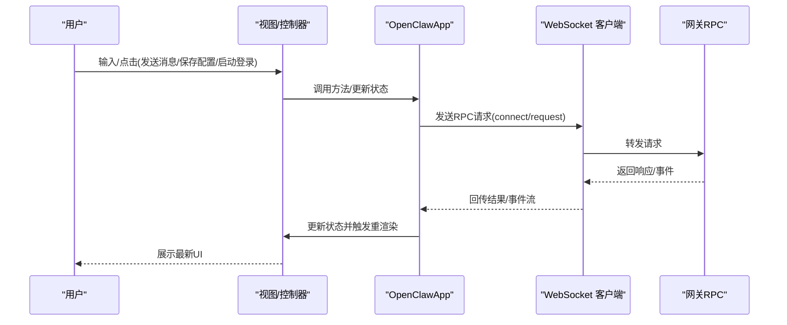
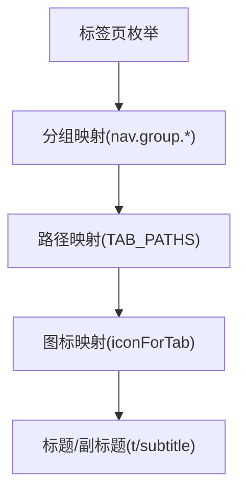
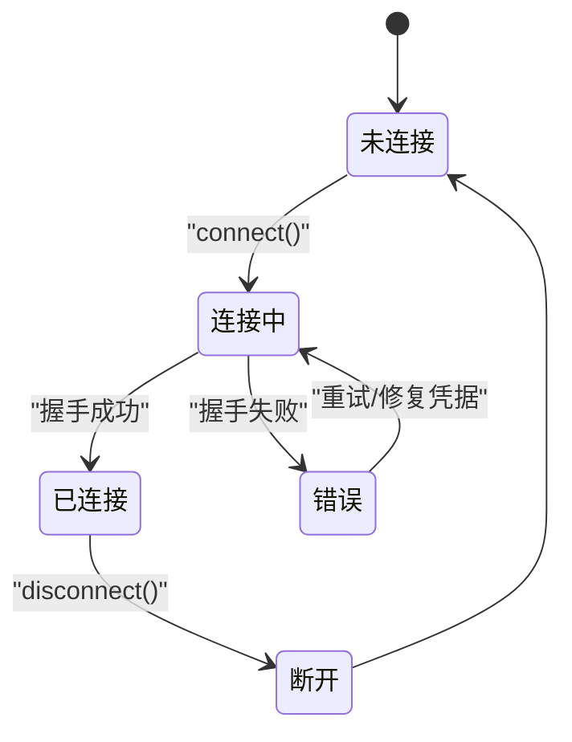
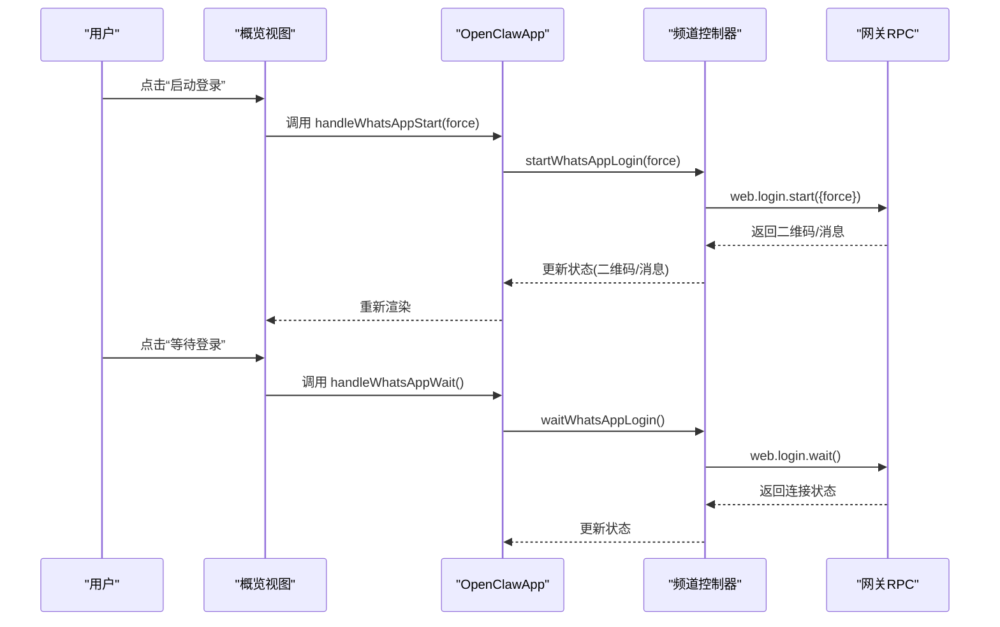
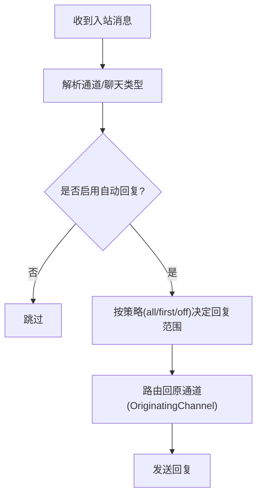
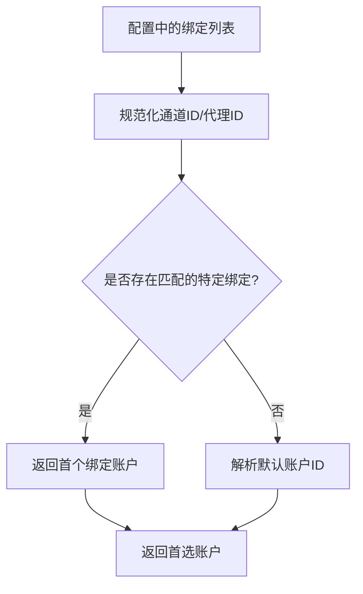
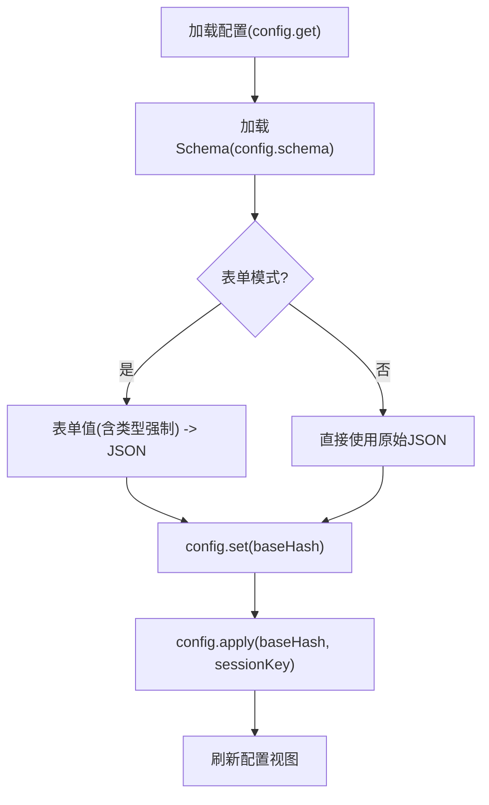
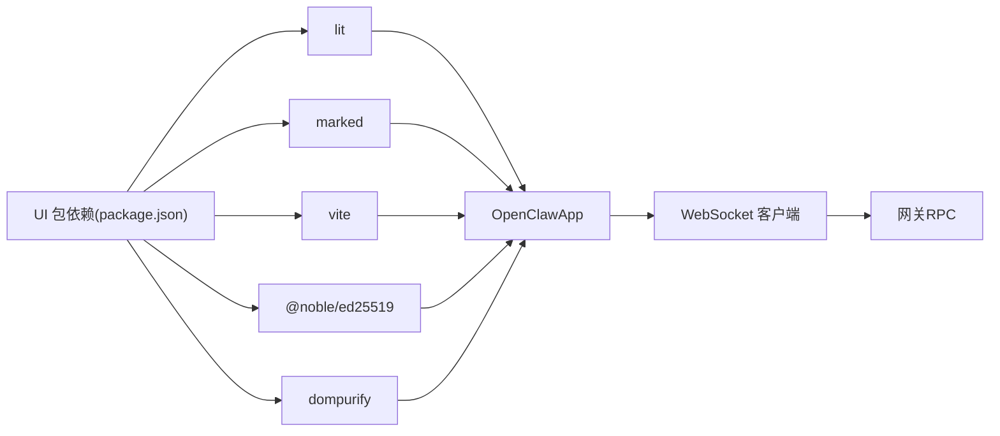

# 控制面板

<cite>
**本文引用的文件**
- [控制UI文档](file://docs/web/control-ui.md)
- [仪表盘文档](file://docs/web/dashboard.md)
- [UI 应用入口](file://ui/src/ui/app.ts)
- [导航与标签页](file://ui/src/ui/navigation.ts)
- [主题解析](file://ui/src/ui/theme.ts)
- [设置持久化](file://ui/src/ui/storage.ts)
- [概览视图](file://ui/src/ui/views/overview.ts)
- [配置控制器](file://ui/src/ui/controllers/config.ts)
- [频道控制器](file://ui/src/ui/controllers/channels.ts)
- [Flex 模板（设备控制卡）](file://src/line/flex-templates.ts)
- [Flex 模板测试](file://src/line/flex-templates.test.ts)
- [绑定解析](file://src/routing/bindings.ts)
- [自动回复路由](file://src/auto-reply/reply/route-reply.ts)
- [自动回复分发](file://src/auto-reply/reply/dispatch-from-config.ts)
- [自动回复路由测试](file://src/auto-reply/reply/reply-routing.test.ts)
- [插件配置模式（Mattermost）](file://extensions/mattermost/src/config-schema.ts)
- [UI 包依赖](file://ui/package.json)
</cite>

## 目录

1. [简介](#简介)
2. [项目结构](#项目结构)
3. [核心组件](#核心组件)
4. [架构总览](#架构总览)
5. [详细组件分析](#详细组件分析)
6. [依赖关系分析](#依赖关系分析)
7. [性能考虑](#性能考虑)
8. [故障排除指南](#故障排除指南)
9. [结论](#结论)
10. [附录](#附录)

## 简介

本文件面向 OpenClaw 控制面板（浏览器端 Control UI），系统性阐述其布局结构、功能模块组织、用户交互设计与状态管理机制。重点覆盖以下方面：

- 账户管理：通道登录（如 WhatsApp）、设备配对与身份验证
- 自动回复配置：按通道与聊天类型启用/禁用与策略
- 渠道绑定：默认账户选择、通道-代理绑定、优先级解析
- 设置管理：配置表单/原始 JSON 编辑、Schema 校验、应用重启与回滚保护
- 状态管理与数据流：UI 状态、WebSocket 事件驱动、控制器解耦
- 组件通信：控制器与视图、视图与控制器之间的调用链
- 响应式设计与主题：系统跟随、明暗主题、侧边栏折叠与分割比例
- 故障排除与性能优化建议

## 项目结构

控制面板由“网关 + 浏览器 UI”组成：

- 网关通过 WebSocket 提供 RPC 接口，UI 通过直连 WebSocket 与网关交互
- UI 采用 Vite + Lit 构建，提供聊天、通道、实例、会话、使用统计、定时任务、技能、节点、配置、调试、日志等功能视图
- 文档明确了 UI 的访问方式、认证模式、安全注意事项与远程访问方案

图表来源

- [UI 应用入口](file://ui/src/ui/app.ts#L111-L707)
- [导航与标签页](file://ui/src/ui/navigation.ts#L1-L175)
- [控制UI文档](file://docs/web/control-ui.md#L1-L224)

章节来源

- [控制UI文档](file://docs/web/control-ui.md#L1-L224)
- [UI 应用入口](file://ui/src/ui/app.ts#L111-L707)
- [导航与标签页](file://ui/src/ui/navigation.ts#L1-L175)

## 核心组件

- 应用根组件 OpenClawApp：集中管理 UI 状态、主题、语言、连接生命周期、视图渲染与控制器桥接
- 导航与标签页：定义标签页分组、路径映射、图标与标题
- 主题与系统偏好：支持 system/light/dark，运行时解析当前主题
- 设置持久化：localStorage 存储网关地址、令牌、会话键、主题、聊天焦点模式、侧边栏状态、分割比例等
- 视图层：概览、聊天、通道、实例、会话、使用统计、定时任务、技能、节点、配置、调试、日志
- 控制器层：配置、通道、会话、节点、技能、日志、调试、设备、执行审批等，封装 RPC 调用与状态更新

章节来源

- [UI 应用入口](file://ui/src/ui/app.ts#L111-L707)
- [导航与标签页](file://ui/src/ui/navigation.ts#L1-L175)
- [主题解析](file://ui/src/ui/theme.ts#L1-L17)
- [设置持久化](file://ui/src/ui/storage.ts#L1-L89)

## 架构总览

UI 通过 WebSocket 直连网关，使用统一的 RPC 请求/响应模型。控制器负责封装 RPC 并维护局部状态；视图通过控制器暴露的方法与状态进行渲染与交互。

图表来源

- [UI 应用入口](file://ui/src/ui/app.ts#L385-L473)
- [配置控制器](file://ui/src/ui/controllers/config.ts#L39-L178)
- [频道控制器](file://ui/src/ui/controllers/channels.ts#L6-L95)
- [控制UI文档](file://docs/web/control-ui.md#L26-L81)

章节来源

- [控制UI文档](file://docs/web/control-ui.md#L26-L81)
- [UI 应用入口](file://ui/src/ui/app.ts#L385-L473)
- [配置控制器](file://ui/src/ui/controllers/config.ts#L39-L178)
- [频道控制器](file://ui/src/ui/controllers/channels.ts#L6-L95)

## 详细组件分析

### 布局与导航

- 标签页分组：聊天、控制面板、智能体、设置四大类，每类包含若干子标签
- 路径与图标：每个标签对应固定路径，图标根据标签动态选择
- 基础路径：支持可配置 basePath，用于嵌入部署场景

图表来源

- [导航与标签页](file://ui/src/ui/navigation.ts#L4-L175)

章节来源

- [导航与标签页](file://ui/src/ui/navigation.ts#L1-L175)

### 状态管理与数据流

- OpenClawApp 聚合所有状态字段，包括连接状态、主题、语言、聊天消息、会话、通道、配置、节点、技能、日志、调试等
- 生命周期钩子：connectedCallback/firstUpdated/updated/disconnectedCallback 分别处理连接建立、首次渲染、状态变化与断开
- 控制器通过 RPC 与网关交互，更新状态并触发渲染

图表来源

- [UI 应用入口](file://ui/src/ui/app.ts#L367-L383)

章节来源

- [UI 应用入口](file://ui/src/ui/app.ts#L367-L383)

### 账户管理与通道绑定

- 设备配对与身份：首次从新设备访问需要一次性配对批准；本地连接自动批准；Serve/Tailscale 场景下可通过身份头校验
- 通道登录：以 WhatsApp 为例，提供启动登录、等待扫码、登出等流程
- 渠道绑定：默认账户解析、通道-代理绑定构建、首选账户选择逻辑

图表来源

- [概览视图](file://ui/src/ui/views/overview.ts#L122-L178)
- [频道控制器](file://ui/src/ui/controllers/channels.ts#L29-L77)
- [控制UI文档](file://docs/web/control-ui.md#L33-L62)

章节来源

- [概览视图](file://ui/src/ui/views/overview.ts#L122-L178)
- [频道控制器](file://ui/src/ui/controllers/channels.ts#L29-L77)
- [控制UI文档](file://docs/web/control-ui.md#L33-L62)

### 自动回复配置

- 默认策略：不同通道默认开启/关闭策略不同；可按聊天类型（如 direct/group/channel）覆盖
- 配置项：replyToMode、replyToModeByChatType 等
- 分发与路由：根据消息来源通道与会话上下文，将回复路由回原通道

图表来源

- [自动回复路由](file://src/auto-reply/reply/route-reply.ts#L1-L17)
- [自动回复分发](file://src/auto-reply/reply/dispatch-from-config.ts#L82-L118)
- [自动回复路由测试](file://src/auto-reply/reply/reply-routing.test.ts#L163-L198)

章节来源

- [自动回复路由](file://src/auto-reply/reply/route-reply.ts#L1-L17)
- [自动回复分发](file://src/auto-reply/reply/dispatch-from-config.ts#L82-L118)
- [自动回复路由测试](file://src/auto-reply/reply/reply-routing.test.ts#L163-L198)

### 渠道绑定与默认账户

- 默认账户解析：根据默认代理与通道匹配，解析默认账户 ID
- 绑定构建：将选择的通道与账户组合为绑定条目
- 优先级：若存在特定绑定，则优先使用；否则回退到默认账户

图表来源

- [绑定解析](file://src/routing/bindings.ts#L47-L120)

章节来源

- [绑定解析](file://src/routing/bindings.ts#L47-L120)

### 设置管理（配置表单与 Schema）

- 加载配置：config.get 获取快照，config.schema 获取 Schema 与 UI 提示
- 表单与原始 JSON：支持表单模式与原始 JSON 模式，二者互斥但可互相同步
- 类型强制：提交前对表单值按 Schema 强制类型，确保后端 Zod 校验通过
- 写入保护：基于 baseHash 的乐观并发控制，防止并发编辑覆盖
- 应用与重启：config.apply 支持指定 sessionKey 与重启延时参数

图表来源

- [配置控制器](file://ui/src/ui/controllers/config.ts#L39-L178)

章节来源

- [配置控制器](file://ui/src/ui/controllers/config.ts#L39-L178)

### 插件配置模式（以 Mattermost 为例）

- 账号模式：支持名称、能力、Markdown、启用开关、配置写入开关、botToken、baseUrl、聊天模式、前缀、@提及要求、允许来源、群组策略、文本切片、块流控等
- Schema 严格性：使用 zod.strict() 保证字段白名单，避免多余字段

章节来源

- [插件配置模式（Mattermost）](file://extensions/mattermost/src/config-schema.ts#L1-L32)

### 响应式设计与主题

- 主题模式：支持 system、light、dark；运行时解析当前主题
- 系统偏好：通过媒体查询检测系统主题
- UI 设置：主题、聊天焦点模式、会话侧边栏开关、分割比例、导航折叠状态等持久化于 localStorage

章节来源

- [主题解析](file://ui/src/ui/theme.ts#L1-L17)
- [设置持久化](file://ui/src/ui/storage.ts#L1-L89)

### 设备控制卡片（Flex 模板）

- 设计目标：设备聚焦的头部状态指示、清晰的控制网格与视觉层次
- 功能特性：设备名称/类型/状态、在线状态点、图片展示、最多 6 个按钮的三行两列布局

章节来源

- [Flex 模板（设备控制卡）](file://src/line/flex-templates.ts#L1217-L1392)
- [Flex 模板测试](file://src/line/flex-templates.test.ts#L283-L322)

## 依赖关系分析

- UI 依赖：@noble/ed25519、dompurify、lit、marked、vite
- UI 与网关：通过 WebSocket 直连，RPC 方法覆盖聊天、通道、实例、会话、技能、节点、配置、调试、日志、更新等
- 文档与配置：控制 UI 文档明确认证方式、远程访问与安全建议

图表来源

- [UI 包依赖](file://ui/package.json#L11-L22)
- [UI 应用入口](file://ui/src/ui/app.ts#L1-L100)

章节来源

- [UI 包依赖](file://ui/package.json#L11-L22)
- [UI 应用入口](file://ui/src/ui/app.ts#L1-L100)

## 性能考虑

- 渲染优化：Lit 的细粒度响应式更新，避免不必要的重渲染
- 数据缓存：配置 Schema 与快照缓存，减少重复请求
- 事件节流：聊天滚动、日志滚动等使用帧调度与超时控制
- 资源加载：静态资源按需构建，开发/生产环境区分
- 网络效率：WebSocket 长连接，RPC 批量请求，避免频繁握手

## 故障排除指南

- 认证失败（1008/Unauthorized）
  - 确认网关可达；从网关主机获取令牌或生成新令牌；在 UI 设置中粘贴令牌并连接
  - 若无令牌，使用密码或启用 Tailscale Serve
- 非安全上下文（HTTP）
  - 浏览器阻止 WebCrypto；使用 HTTPS（Tailscale Serve）或本地打开 http://127.0.0.1:18789
  - 如必须 HTTP，可在网关配置中允许非安全认证（仅限受信网络）
- 设备配对
  - 新设备首次访问需一次性批准；查看待处理请求并批准；本地连接自动批准
- 远程访问
  - 推荐 Tailscale Serve；或通过 SSH 隧道；或 tailnet 绑定 + 令牌
- UI 开发与跨域
  - UI 开发服务器可指向远端网关；需将 UI 来源加入 allowedOrigins；gatewayUrl 仅在顶级窗口接受

章节来源

- [控制UI文档](file://docs/web/control-ui.md#L42-L157)
- [仪表盘文档](file://docs/web/dashboard.md#L42-L47)

## 结论

OpenClaw 控制面板以“网关 + 浏览器 UI”的轻量架构实现全功能管理界面。通过清晰的控制器分层、严格的配置 Schema 与类型强制、完善的认证与安全策略，以及响应式主题与布局，满足从本地到远程的多样化部署需求。自动回复与通道绑定机制提供了灵活的消息路由与账户管理能力；配置应用与重启流程保障了变更的安全与可控。

## 附录

### 关键配置选项与参数

- 网关访问
  - WebSocket URL、Gateway Token、Password（不持久化）、默认会话键
- 主题与界面
  - 主题模式（system/light/dark）、聊天焦点模式、会话侧边栏开关、分割比例、导航折叠状态
- 自动回复
  - replyToMode（off/all/first）、replyToModeByChatType（按聊天类型覆盖）
- 渠道绑定
  - 默认账户解析、通道-代理绑定、首选账户选择
- 配置应用
  - baseHash 并发保护、sessionKey 应用、restartDelayMs（可选）

章节来源

- [概览视图](file://ui/src/ui/views/overview.ts#L122-L178)
- [设置持久化](file://ui/src/ui/storage.ts#L5-L17)
- [自动回复路由测试](file://src/auto-reply/reply/reply-routing.test.ts#L163-L198)
- [绑定解析](file://src/routing/bindings.ts#L47-L120)
- [配置控制器](file://ui/src/ui/controllers/config.ts#L130-L178)
