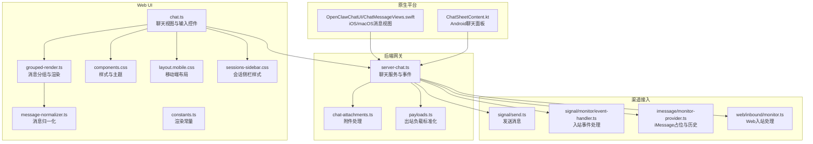
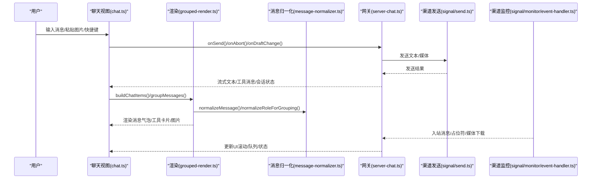
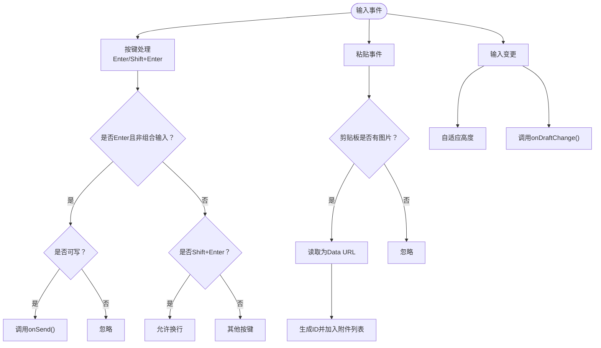
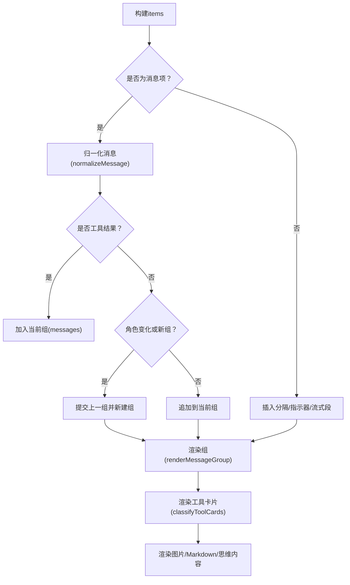
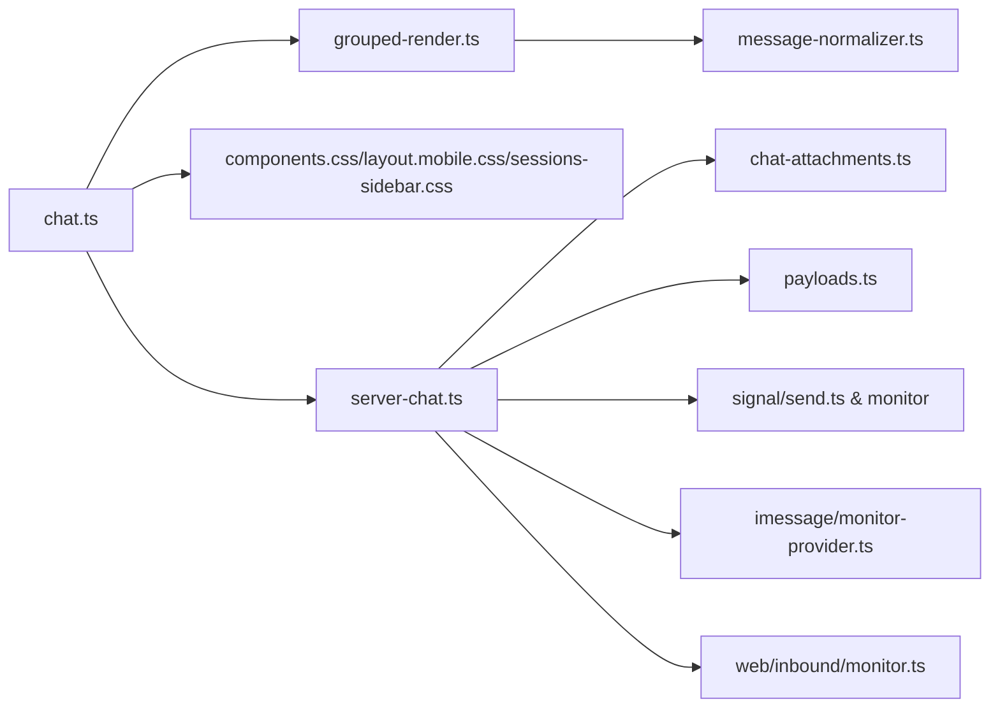

# 聊天界面

<cite>
**本文引用的文件**
- [ui/src/ui/views/chat.ts](file://ui/src/ui/views/chat.ts)
- [ui/src/ui/chat/grouped-render.ts](file://ui/src/ui/chat/grouped-render.ts)
- [ui/src/ui/chat/message-normalizer.ts](file://ui/src/ui/chat/message-normalizer.ts)
- [ui/src/ui/chat/constants.ts](file://ui/src/ui/chat/constants.ts)
- [ui/src/styles/components.css](file://ui/src/styles/components.css)
- [ui/src/styles/layout.mobile.css](file://ui/src/styles/layout.mobile.css)
- [ui/src/styles/chat/sessions-sidebar.css](file://ui/src/styles/chat/sessions-sidebar.css)
- [src/gateway/server-chat.ts](file://src/gateway/server-chat.ts)
- [src/gateway/chat-attachments.ts](file://src/gateway/chat-attachments.ts)
- [src/signal/send.ts](file://src/signal/send.ts)
- [src/signal/monitor/event-handler.ts](file://src/signal/monitor/event-handler.ts)
- [src/imessage/monitor/monitor-provider.ts](file://src/imessage/monitor/monitor-provider.ts)
- [src/web/inbound/monitor.ts](file://src/web/inbound/monitor.ts)
- [src/infra/outbound/payloads.ts](file://src/infra/outbound/payloads.ts)
- [apps/shared/OpenClawKit/Sources/OpenClawChatUI/ChatMessageViews.swift](file://apps/shared/OpenClawKit/Sources/OpenClawChatUI/ChatMessageViews.swift)
- [apps/shared/OpenClawKit/Tests/OpenClawKitTests/ChatThemeTests.swift](file://apps/shared/OpenClawKit/Tests/OpenClawKitTests/ChatThemeTests.swift)
- [apps/android/app/src/main/java/ai/openclaw/android/ui/chat/ChatSheetContent.kt](file://apps/android/app/src/main/java/ai/openclaw/android/ui/chat/ChatSheetContent.kt)
- [docs/refactor/chat-ui-refactor-design.md](file://docs/refactor/chat-ui-refactor-design.md)
</cite>

## 目录

1. [简介](#简介)
2. [项目结构](#项目结构)
3. [核心组件](#核心组件)
4. [架构总览](#架构总览)
5. [详细组件分析](#详细组件分析)
6. [依赖关系分析](#依赖关系分析)
7. [性能考量](#性能考量)
8. [故障排查指南](#故障排查指南)
9. [结论](#结论)
10. [附录](#附录)

## 简介

本文件面向OpenClaw聊天界面系统，提供从架构到实现细节的完整技术文档。重点覆盖以下方面：

- 组件架构与数据流：消息渲染、实时通信、状态管理与事件处理
- 消息输入与粘贴上传、媒体附件处理与预览
- 历史消息分页与滚动控制、状态指示器与可访问性
- 富文本与多媒体内容展示、Markdown渲染与工具卡片
- 可访问性设计、键盘导航与触摸交互
- 自定义样式、主题配置与跨平台扩展开发指南

## 项目结构

OpenClaw聊天界面由前端UI（Web/Lit）与多端原生组件（iOS/macOS/Android）构成，并通过网关（gateway）与各渠道（Signal/iMessage/Web等）进行消息收发与状态同步。

**图表来源**

- [ui/src/ui/views/chat.ts](file://ui/src/ui/views/chat.ts#L1-L596)
- [ui/src/ui/chat/grouped-render.ts](file://ui/src/ui/chat/grouped-render.ts#L1-L402)
- [ui/src/ui/chat/message-normalizer.ts](file://ui/src/ui/chat/message-normalizer.ts#L1-L91)
- [ui/src/ui/chat/constants.ts](file://ui/src/ui/chat/constants.ts#L1-L12)
- [ui/src/styles/components.css](file://ui/src/styles/components.css#L1451-L1523)
- [ui/src/styles/layout.mobile.css](file://ui/src/styles/layout.mobile.css#L176-L278)
- [ui/src/styles/chat/sessions-sidebar.css](file://ui/src/styles/chat/sessions-sidebar.css#L1-L222)
- [src/gateway/server-chat.ts](file://src/gateway/server-chat.ts)
- [src/gateway/chat-attachments.ts](file://src/gateway/chat-attachments.ts)
- [src/infra/outbound/payloads.ts](file://src/infra/outbound/payloads.ts#L40-L69)
- [src/signal/send.ts](file://src/signal/send.ts#L162-L204)
- [src/signal/monitor/event-handler.ts](file://src/signal/monitor/event-handler.ts#L562-L627)
- [src/imessage/monitor/monitor-provider.ts](file://src/imessage/monitor/monitor-provider.ts#L407-L432)
- [src/web/inbound/monitor.ts](file://src/web/inbound/monitor.ts#L219-L252)
- [apps/shared/OpenClawKit/Sources/OpenClawChatUI/ChatMessageViews.swift](file://apps/shared/OpenClawKit/Sources/OpenClawChatUI/ChatMessageViews.swift#L552-L587)
- [apps/android/app/src/main/java/ai/openclaw/android/ui/chat/ChatSheetContent.kt](file://apps/android/app/src/main/java/ai/openclaw/android/ui/chat/ChatSheetContent.kt#L29-L51)

**章节来源**

- [ui/src/ui/views/chat.ts](file://ui/src/ui/views/chat.ts#L1-L596)
- [ui/src/ui/chat/grouped-render.ts](file://ui/src/ui/chat/grouped-render.ts#L1-L402)
- [ui/src/ui/chat/message-normalizer.ts](file://ui/src/ui/chat/message-normalizer.ts#L1-L91)
- [ui/src/ui/chat/constants.ts](file://ui/src/ui/chat/constants.ts#L1-L12)
- [ui/src/styles/components.css](file://ui/src/styles/components.css#L1451-L1523)
- [ui/src/styles/layout.mobile.css](file://ui/src/styles/layout.mobile.css#L176-L278)
- [ui/src/styles/chat/sessions-sidebar.css](file://ui/src/styles/chat/sessions-sidebar.css#L1-L222)
- [src/gateway/server-chat.ts](file://src/gateway/server-chat.ts)
- [src/gateway/chat-attachments.ts](file://src/gateway/chat-attachments.ts)
- [src/infra/outbound/payloads.ts](file://src/infra/outbound/payloads.ts#L40-L69)
- [src/signal/send.ts](file://src/signal/send.ts#L162-L204)
- [src/signal/monitor/event-handler.ts](file://src/signal/monitor/event-handler.ts#L562-L627)
- [src/imessage/monitor/monitor-provider.ts](file://src/imessage/monitor/monitor-provider.ts#L407-L432)
- [src/web/inbound/monitor.ts](file://src/web/inbound/monitor.ts#L219-L252)
- [apps/shared/OpenClawKit/Sources/OpenClawChatUI/ChatMessageViews.swift](file://apps/shared/OpenClawKit/Sources/OpenClawChatUI/ChatMessageViews.swift#L552-L587)
- [apps/android/app/src/main/java/ai/openclaw/android/ui/chat/ChatSheetContent.kt](file://apps/android/app/src/main/java/ai/openclaw/android/ui/chat/ChatSheetContent.kt#L29-L51)

## 核心组件

- 聊天视图与输入控件：负责渲染消息线程、输入框、附件预览、发送/停止按钮、队列与新消息提示、分屏与侧栏控制。
- 消息分组与渲染：将消息按角色与时间分组，支持富文本、图片、工具卡片与“正在输入”指示器。
- 消息归一化：统一不同渠道的消息结构，识别工具结果消息并正确分组。
- 出站负载标准化：合并媒体URL、解析回复指令、过滤不可渲染负载。
- 附件处理：解析粘贴图像、生成临时ID、转换为Data URL并预览；发送时解析媒体路径与类型。
- 网关服务：接收/发送消息、维护会话与运行状态、触发事件驱动UI更新。
- 渠道接入：Signal/iMessage/Web等入站/出站桥接，处理占位符与媒体下载。

**章节来源**

- [ui/src/ui/views/chat.ts](file://ui/src/ui/views/chat.ts#L194-L438)
- [ui/src/ui/chat/grouped-render.ts](file://ui/src/ui/chat/grouped-render.ts#L65-L169)
- [ui/src/ui/chat/message-normalizer.ts](file://ui/src/ui/chat/message-normalizer.ts#L10-L91)
- [src/infra/outbound/payloads.ts](file://src/infra/outbound/payloads.ts#L40-L69)
- [src/gateway/chat-attachments.ts](file://src/gateway/chat-attachments.ts)
- [src/signal/send.ts](file://src/signal/send.ts#L162-L204)

## 架构总览

聊天界面采用“视图-渲染-网关-渠道”的分层架构。视图层基于Lit组件树，渲染层负责消息分组与富文本，网关层协调状态与事件，渠道层负责具体协议适配。

**图表来源**

- [ui/src/ui/views/chat.ts](file://ui/src/ui/views/chat.ts#L386-L438)
- [ui/src/ui/chat/grouped-render.ts](file://ui/src/ui/chat/grouped-render.ts#L171-L232)
- [ui/src/ui/chat/message-normalizer.ts](file://ui/src/ui/chat/message-normalizer.ts#L10-L91)
- [src/gateway/server-chat.ts](file://src/gateway/server-chat.ts)
- [src/signal/send.ts](file://src/signal/send.ts#L162-L204)
- [src/signal/monitor/event-handler.ts](file://src/signal/monitor/event-handler.ts#L562-L627)

## 详细组件分析

### 聊天视图与输入控件

- 输入框行为：支持单行/多行、Shift+Enter换行、Enter发送、粘贴图片自动转附件、动态高度调整、禁用态与占位符。
- 附件处理：粘贴图像读取为Data URL，生成唯一ID，支持移除与预览。
- 状态与按钮：根据连接状态、发送中/流式状态、是否可中断决定按钮可用性与文案。
- 历史与分屏：历史渲染限制、分屏比例控制、侧栏开关与可展开工具输出。
- 新消息提示：滚动到底部按钮，配合滚动事件回调。

**图表来源**

- [ui/src/ui/views/chat.ts](file://ui/src/ui/views/chat.ts#L386-L438)
- [ui/src/ui/views/chat.ts](file://ui/src/ui/views/chat.ts#L119-L158)
- [ui/src/ui/views/chat.ts](file://ui/src/ui/views/chat.ts#L440-L596)

**章节来源**

- [ui/src/ui/views/chat.ts](file://ui/src/ui/views/chat.ts#L194-L438)
- [ui/src/ui/views/chat.ts](file://ui/src/ui/views/chat.ts#L440-L596)

### 消息分组与渲染

- 分组策略：按角色与连续性分组，工具结果消息合并到前一个助手组，形成一次“轮次”。
- 实时流式：支持多段文本（segments）与工具卡片内联，单段则直接打字机效果。
- 多媒体：提取消息中的图片块，支持点击放大；Markdown安全渲染。
- 工具卡片：分类通用工具、命令卡、PTY终端卡，支持折叠展开与侧栏查看原始文本。
- 思维展示：根据会话推理级别与开关，条件性渲染助手的思考内容。

**图表来源**

- [ui/src/ui/chat/grouped-render.ts](file://ui/src/ui/chat/grouped-render.ts#L171-L232)
- [ui/src/ui/chat/grouped-render.ts](file://ui/src/ui/chat/grouped-render.ts#L379-L401)
- [ui/src/ui/chat/message-normalizer.ts](file://ui/src/ui/chat/message-normalizer.ts#L10-L91)

**章节来源**

- [ui/src/ui/chat/grouped-render.ts](file://ui/src/ui/chat/grouped-render.ts#L65-L169)
- [ui/src/ui/chat/grouped-render.ts](file://ui/src/ui/chat/grouped-render.ts#L171-L232)
- [ui/src/ui/chat/grouped-render.ts](file://ui/src/ui/chat/grouped-render.ts#L275-L367)
- [ui/src/ui/chat/message-normalizer.ts](file://ui/src/ui/chat/message-normalizer.ts#L10-L91)

### 消息归一化与角色分组

- 归一化：统一role/content/timestamp/id，识别工具消息（含toolCallId/工具内容/工具名）。
- 角色分组：将工具相关角色统一为“tool”，便于UI样式与交互一致。

**章节来源**

- [ui/src/ui/chat/message-normalizer.ts](file://ui/src/ui/chat/message-normalizer.ts#L10-L91)

### 出站负载标准化与媒体处理

- 合并媒体：将显式媒体URL与解析到的媒体URL合并，多图时拆分为多条消息。
- 解析回复指令：支持回复目标、静默发送、语音转文字等指令解析。
- 过滤不可渲染：对不可渲染负载进行过滤，避免空消息发送。

**章节来源**

- [src/infra/outbound/payloads.ts](file://src/infra/outbound/payloads.ts#L40-L69)
- [src/gateway/chat-attachments.ts](file://src/gateway/chat-attachments.ts)

### 渠道接入与实时通信

- Signal发送：支持纯文本与富文本样式，媒体URL解析为本地路径，避免空文本发送。
- Signal入站：占位符与媒体类型推断，必要时延迟下载附件以保留上下文。
- iMessage：群组/个人消息占位符生成，提及匹配与历史键生成。
- Web入站：位置信息拼接到正文，提取媒体占位符，自动发送已读回执。

**章节来源**

- [src/signal/send.ts](file://src/signal/send.ts#L162-L204)
- [src/signal/monitor/event-handler.ts](file://src/signal/monitor/event-handler.ts#L562-L627)
- [src/imessage/monitor/monitor-provider.ts](file://src/imessage/monitor/monitor-provider.ts#L407-L432)
- [src/web/inbound/monitor.ts](file://src/web/inbound/monitor.ts#L219-L252)

### 可访问性与交互设计

- 可访问性：线程容器role=log、aria-live=polite；输入框禁用态；指示器与按钮带aria-label。
- 键盘导航：Enter发送、Shift+Enter换行、Esc退出焦点模式、Tab顺序（由表单控件默认行为）。
- 触摸交互：移动端输入框增大、按钮尺寸优化、长按预览图片、滑动滚动。

**章节来源**

- [ui/src/ui/views/chat.ts](file://ui/src/ui/views/chat.ts#L216-L272)
- [ui/src/ui/views/chat.ts](file://ui/src/ui/views/chat.ts#L386-L438)
- [ui/src/styles/layout.mobile.css](file://ui/src/styles/layout.mobile.css#L176-L278)

### 主题与样式定制

- 主题变量：通过CSS变量在不同主题间切换，代码块、表格、工具卡片等有明确样式。
- 移动端适配：输入框、气泡、按钮尺寸与间距针对小屏优化。
- 会话侧栏：网格布局、悬停高亮、激活态边框、删除按钮可见性。
- 动画与折叠：工具卡片折叠使用CSS grid-template-rows过渡，无需JS计算高度。

**章节来源**

- [ui/src/styles/components.css](file://ui/src/styles/components.css#L1451-L1523)
- [ui/src/styles/layout.mobile.css](file://ui/src/styles/layout.mobile.css#L176-L278)
- [ui/src/styles/chat/sessions-sidebar.css](file://ui/src/styles/chat/sessions-sidebar.css#L1-L222)
- [docs/refactor/chat-ui-refactor-design.md](file://docs/refactor/chat-ui-refactor-design.md#L291-L338)

### 跨平台扩展与原生集成

- iOS/macOS：消息视图包含“正在输入”点阵动画，支持可访问性减少动画设置与场景状态监听。
- Android：Jetpack Compose聊天面板，收集消息、错误、运行计数、会话等状态，加载历史与会话列表。
- 主题测试：通过颜色亮度对比验证浅/深主题下助手气泡颜色一致性。

**章节来源**

- [apps/shared/OpenClawKit/Sources/OpenClawChatUI/ChatMessageViews.swift](file://apps/shared/OpenClawKit/Sources/OpenClawChatUI/ChatMessageViews.swift#L552-L587)
- [apps/shared/OpenClawKit/Tests/OpenClawKitTests/ChatThemeTests.swift](file://apps/shared/OpenClawKit/Tests/OpenClawKitTests/ChatThemeTests.swift#L1-L29)
- [apps/android/app/src/main/java/ai/openclaw/android/ui/chat/ChatSheetContent.kt](file://apps/android/app/src/main/java/ai/openclaw/android/ui/chat/ChatSheetContent.kt#L29-L51)

## 依赖关系分析

- 视图依赖渲染与归一化模块，渲染依赖消息提取与工具卡片分类。
- 网关作为中枢，依赖附件处理与负载标准化，向上提供事件驱动的UI更新。
- 渠道层独立于视图，通过网关暴露统一接口，保证多端一致性。

**图表来源**

- [ui/src/ui/views/chat.ts](file://ui/src/ui/views/chat.ts#L1-L17)
- [ui/src/ui/chat/grouped-render.ts](file://ui/src/ui/chat/grouped-render.ts#L1-L22)
- [ui/src/ui/chat/message-normalizer.ts](file://ui/src/ui/chat/message-normalizer.ts#L1-L9)
- [ui/src/styles/components.css](file://ui/src/styles/components.css#L1451-L1523)
- [ui/src/styles/layout.mobile.css](file://ui/src/styles/layout.mobile.css#L176-L278)
- [ui/src/styles/chat/sessions-sidebar.css](file://ui/src/styles/chat/sessions-sidebar.css#L1-L222)
- [src/gateway/server-chat.ts](file://src/gateway/server-chat.ts)
- [src/gateway/chat-attachments.ts](file://src/gateway/chat-attachments.ts)
- [src/infra/outbound/payloads.ts](file://src/infra/outbound/payloads.ts#L40-L69)
- [src/signal/send.ts](file://src/signal/send.ts#L162-L204)
- [src/signal/monitor/event-handler.ts](file://src/signal/monitor/event-handler.ts#L562-L627)
- [src/imessage/monitor/monitor-provider.ts](file://src/imessage/monitor/monitor-provider.ts#L407-L432)
- [src/web/inbound/monitor.ts](file://src/web/inbound/monitor.ts#L219-L252)

**章节来源**

- [ui/src/ui/views/chat.ts](file://ui/src/ui/views/chat.ts#L1-L17)
- [ui/src/ui/chat/grouped-render.ts](file://ui/src/ui/chat/grouped-render.ts#L1-L22)
- [ui/src/ui/chat/message-normalizer.ts](file://ui/src/ui/chat/message-normalizer.ts#L1-L9)
- [src/gateway/server-chat.ts](file://src/gateway/server-chat.ts)
- [src/infra/outbound/payloads.ts](file://src/infra/outbound/payloads.ts#L40-L69)

## 性能考量

- 渲染限制：历史消息仅渲染最近N条，隐藏条目提示，避免DOM膨胀。
- 文本流式：按segments渲染，已完成段落静态显示，活动段落打字机效果，降低重排压力。
- 图片懒加载：点击放大打开新窗口，避免一次性渲染大图。
- 工具卡片折叠：使用CSS过渡，避免JS逐帧动画带来的掉帧。
- 附件预览：粘贴即Data URL，避免额外网络请求；发送前统一解析为本地路径。

**章节来源**

- [ui/src/ui/views/chat.ts](file://ui/src/ui/views/chat.ts#L440-L596)
- [ui/src/ui/chat/grouped-render.ts](file://ui/src/ui/chat/grouped-render.ts#L118-L169)
- [ui/src/ui/chat/constants.ts](file://ui/src/ui/chat/constants.ts#L5-L12)
- [src/signal/send.ts](file://src/signal/send.ts#L162-L204)

## 故障排查指南

- 发送失败：检查文本与媒体至少其一；确认连接状态；查看错误提示与禁用原因。
- 附件无法显示：确认粘贴图片类型为image/\*；检查Data URL生成与预览渲染；发送前确保媒体解析成功。
- 媒体下载异常：Signal入站时若忽略附件则使用占位符；下载失败会记录错误日志。
- 会话历史缺失：iMessage群组使用chatId/GUID作为历史键；Web入站需提取媒体占位符或正文。
- 可访问性问题：确保线程容器role=log与aria-live；按钮具备aria-label；禁用态不可聚焦。

**章节来源**

- [ui/src/ui/views/chat.ts](file://ui/src/ui/views/chat.ts#L274-L279)
- [src/signal/monitor/event-handler.ts](file://src/signal/monitor/event-handler.ts#L562-L627)
- [src/imessage/monitor/monitor-provider.ts](file://src/imessage/monitor/monitor-provider.ts#L407-L432)
- [src/web/inbound/monitor.ts](file://src/web/inbound/monitor.ts#L219-L252)

## 结论

OpenClaw聊天界面通过清晰的分层架构与模块化设计，在Web与多端平台上实现了统一的消息体验。其渲染与状态管理逻辑稳健，富文本与多媒体支持完善，同时兼顾可访问性与移动端体验。出站负载标准化与渠道适配确保了跨平台一致性，为主题与扩展提供了良好的基础。

## 附录

- 自定义样式建议：通过CSS变量覆盖主题色值；为工具卡片与代码块补充暗色适配；移动端进一步优化输入区与按钮间距。
- 扩展开发指南：遵循消息归一化接口；在网关注册通道插件；实现入站/出站适配器；提供原生平台对应视图组件。
