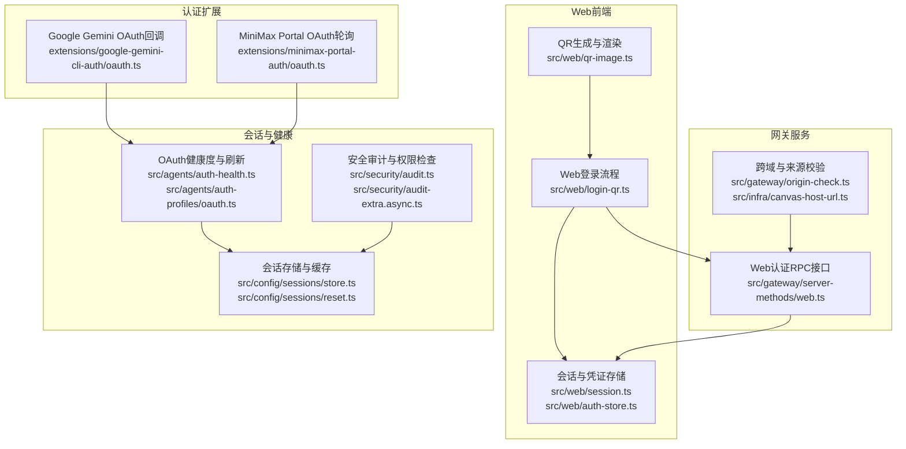
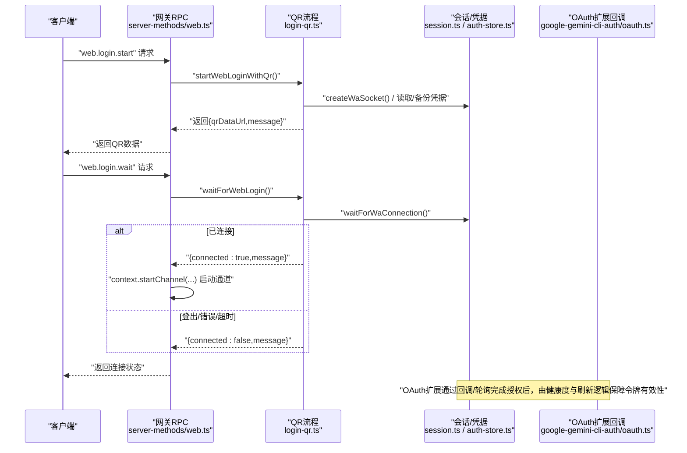
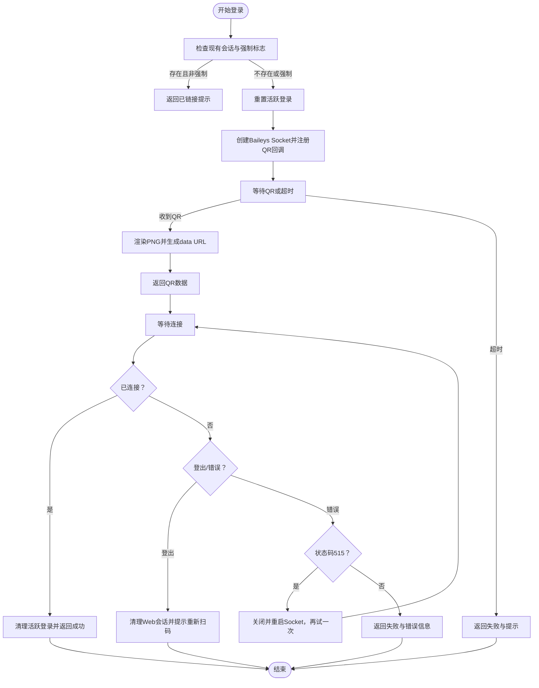
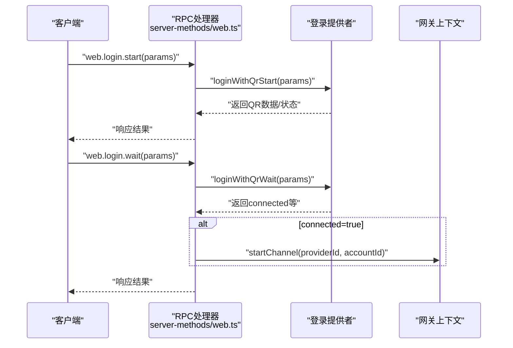
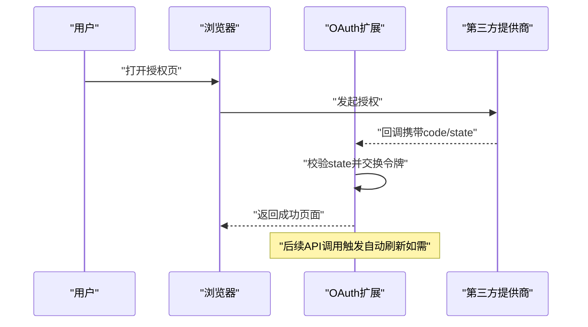
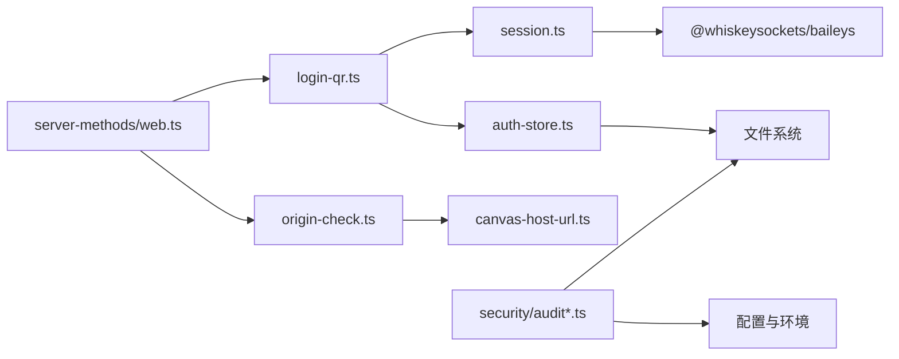

# 认证流程

<cite>
**本文引用的文件**
- [src/web/login-qr.ts](file://src/web/login-qr.ts)
- [src/web/session.ts](file://src/web/session.ts)
- [src/web/auth-store.ts](file://src/web/auth-store.ts)
- [src/web/qr-image.ts](file://src/web/qr-image.ts)
- [src/gateway/server-methods/web.ts](file://src/gateway/server-methods/web.ts)
- [extensions/google-gemini-cli-auth/oauth.ts](file://extensions/google-gemini-cli-auth/oauth.ts)
- [extensions/minimax-portal-auth/oauth.ts](file://extensions/minimax-portal-auth/oauth.ts)
- [src/agents/auth-health.ts](file://src/agents/auth-health.ts)
- [src/agents/auth-profiles/oauth.ts](file://src/agents/auth-profiles/oauth.ts)
- [src/commands/doctor-auth.ts](file://src/commands/doctor-auth.ts)
- [src/gateway/origin-check.ts](file://src/gateway/origin-check.ts)
- [src/infra/canvas-host-url.ts](file://src/infra/canvas-host-url.ts)
- [src/security/audit.ts](file://src/security/audit.ts)
- [src/security/audit-extra.async.ts](file://src/security/audit-extra.async.ts)
- [src/gateway/session-utils.ts](file://src/gateway/session-utils.ts)
- [src/config/sessions/store.ts](file://src/config/sessions/store.ts)
- [src/config/sessions/reset.ts](file://src/config/sessions/reset.ts)
- [apps/macos/Sources/OpenClaw/SessionData.swift](file://apps/macos/Sources/OpenClaw/SessionData.swift)
- [ui/src/ui/controllers/sessions.ts](file://ui/src/ui/controllers/sessions.ts)
</cite>

## 目录

1. [引言](#引言)
2. [项目结构](#项目结构)
3. [核心组件](#核心组件)
4. [架构总览](#架构总览)
5. [详细组件分析](#详细组件分析)
6. [依赖关系分析](#依赖关系分析)
7. [性能考量](#性能考量)
8. [故障排除指南](#故障排除指南)
9. [结论](#结论)
10. [附录](#附录)

## 引言

本技术文档聚焦于OpenClaw Web界面的认证流程，覆盖登录界面设计、QR码认证与会话管理机制。文档将深入解析多种认证方式（包括基于OAuth的令牌管理与自动刷新）、安全令牌策略、会话持久化与超时控制、认证状态机与错误处理、用户体验优化、跨域认证与多设备登录支持、以及认证审计与日志记录。读者可据此理解从“开始登录”到“等待连接”的完整链路，以及如何在不同平台与渠道中安全、稳定地维护会话。

## 项目结构

OpenClaw的Web认证相关代码主要分布在以下模块：

- Web端QR登录与会话管理：login-qr.ts、session.ts、auth-store.ts、qr-image.ts
- 网关侧Web认证RPC接口：server-methods/web.ts
- OAuth扩展实现：google-gemini-cli-auth/oauth.ts、minimax-portal-auth/oauth.ts
- OAuth健康度与自动刷新：agents/auth-health.ts、agents/auth-profiles/oauth.ts
- 安全与跨域：gateway/origin-check.ts、infra/canvas-host-url.ts、security/audit\*.ts
- 会话存储与重置策略：config/sessions/store.ts、config/sessions/reset.ts
- 多端集成与UI：apps/macos/Sources/OpenClaw/SessionData.swift、ui/src/ui/controllers/sessions.ts

图表来源

- [src/web/login-qr.ts](file://src/web/login-qr.ts#L108-L214)
- [src/web/session.ts](file://src/web/session.ts#L94-L165)
- [src/web/auth-store.ts](file://src/web/auth-store.ts#L77-L97)
- [src/web/qr-image.ts](file://src/web/qr-image.ts#L25-L54)
- [src/gateway/server-methods/web.ts](file://src/gateway/server-methods/web.ts#L19-L124)
- [src/gateway/origin-check.ts](file://src/gateway/origin-check.ts#L43-L71)
- [src/infra/canvas-host-url.ts](file://src/infra/canvas-host-url.ts#L46-L66)
- [extensions/google-gemini-cli-auth/oauth.ts](file://extensions/google-gemini-cli-auth/oauth.ts#L260-L296)
- [extensions/minimax-portal-auth/oauth.ts](file://extensions/minimax-portal-auth/oauth.ts#L222-L247)
- [src/agents/auth-health.ts](file://src/agents/auth-health.ts#L65-L166)
- [src/agents/auth-profiles/oauth.ts](file://src/agents/auth-profiles/oauth.ts#L36-L285)
- [src/config/sessions/store.ts](file://src/config/sessions/store.ts#L28-L61)
- [src/config/sessions/reset.ts](file://src/config/sessions/reset.ts#L84-L120)
- [src/security/audit.ts](file://src/security/audit.ts#L953-L963)
- [src/security/audit-extra.async.ts](file://src/security/audit-extra.async.ts#L436-L535)

章节来源

- [src/web/login-qr.ts](file://src/web/login-qr.ts#L1-L296)
- [src/web/session.ts](file://src/web/session.ts#L1-L317)
- [src/web/auth-store.ts](file://src/web/auth-store.ts#L1-L202)
- [src/web/qr-image.ts](file://src/web/qr-image.ts#L1-L55)
- [src/gateway/server-methods/web.ts](file://src/gateway/server-methods/web.ts#L19-L124)
- [src/gateway/origin-check.ts](file://src/gateway/origin-check.ts#L1-L71)
- [src/infra/canvas-host-url.ts](file://src/infra/canvas-host-url.ts#L1-L66)
- [extensions/google-gemini-cli-auth/oauth.ts](file://extensions/google-gemini-cli-auth/oauth.ts#L260-L296)
- [extensions/minimax-portal-auth/oauth.ts](file://extensions/minimax-portal-auth/oauth.ts#L222-L247)
- [src/agents/auth-health.ts](file://src/agents/auth-health.ts#L65-L166)
- [src/agents/auth-profiles/oauth.ts](file://src/agents/auth-profiles/oauth.ts#L36-L285)
- [src/config/sessions/store.ts](file://src/config/sessions/store.ts#L28-L61)
- [src/config/sessions/reset.ts](file://src/config/sessions/reset.ts#L84-L120)
- [src/security/audit.ts](file://src/security/audit.ts#L953-L963)
- [src/security/audit-extra.async.ts](file://src/security/audit-extra.async.ts#L436-L535)

## 核心组件

- QR码登录流程控制器：负责启动登录、生成QR数据、等待连接、错误处理与重试。
- Baileys会话与凭证管理：封装Web会话创建、事件监听、凭据保存与备份恢复。
- 凭证存储与身份读取：定位默认Web认证目录、读取当前自身份、清理旧态。
- QR图像渲染：将QR字符串渲染为PNG并以data URL形式返回。
- 网关RPC接口：暴露“开始登录”和“等待连接”两个方法，供客户端调用。
- OAuth健康度与自动刷新：评估OAuth状态、计算剩余有效期、在首次调用时自动刷新。
- 跨域与来源校验：解析请求头、校验Origin与Host，确保Canvas访问受控。
- 会话存储与缓存：会话存储缓存策略、TTL与失效；会话重置策略（按类型/空闲）。
- 安全审计：文件权限检查、敏感信息脱敏、远程探测等。

章节来源

- [src/web/login-qr.ts](file://src/web/login-qr.ts#L108-L214)
- [src/web/session.ts](file://src/web/session.ts#L94-L165)
- [src/web/auth-store.ts](file://src/web/auth-store.ts#L77-L97)
- [src/web/qr-image.ts](file://src/web/qr-image.ts#L25-L54)
- [src/gateway/server-methods/web.ts](file://src/gateway/server-methods/web.ts#L19-L124)
- [src/agents/auth-health.ts](file://src/agents/auth-health.ts#L65-L166)
- [src/agents/auth-profiles/oauth.ts](file://src/agents/auth-profiles/oauth.ts#L36-L285)
- [src/gateway/origin-check.ts](file://src/gateway/origin-check.ts#L43-L71)
- [src/config/sessions/store.ts](file://src/config/sessions/store.ts#L28-L61)
- [src/config/sessions/reset.ts](file://src/config/sessions/reset.ts#L84-L120)
- [src/security/audit.ts](file://src/security/audit.ts#L953-L963)

## 架构总览

下图展示了Web认证从客户端到网关、再到会话与凭证存储的整体交互路径，以及跨域与安全控制点。

图表来源

- [src/gateway/server-methods/web.ts](file://src/gateway/server-methods/web.ts#L19-L124)
- [src/web/login-qr.ts](file://src/web/login-qr.ts#L108-L214)
- [src/web/session.ts](file://src/web/session.ts#L94-L165)
- [src/web/auth-store.ts](file://src/web/auth-store.ts#L77-L97)
- [extensions/google-gemini-cli-auth/oauth.ts](file://extensions/google-gemini-cli-auth/oauth.ts#L260-L296)

## 详细组件分析

### 组件A：QR码登录与会话管理

- 设计要点
  - 登录启动：根据账户选择认证目录，检测已有Web会话；若未强制，则提示已链接；否则重置并创建新会话。
  - QR生成：创建Baileys Socket，注册QR回调，渲染PNG为data URL返回给客户端。
  - 等待连接：设置超时与截止时间，竞速等待连接或超时；处理登出、515重启、其他错误；成功后清理活跃登录。
  - 错误处理：格式化错误消息与状态码，区分登出与网络错误；必要时重启一次以应对特定状态。
  - 会话生命周期：TTL控制（默认3分钟）、活跃登录映射、连接状态与错误状态分离。
- 数据结构与复杂度
  - activeLogins：Map<accountId, ActiveLogin>，O(1)读写；TTL过期清理。
  - 事件监听：基于Baileys事件模型，无额外复杂度开销。
- 性能与可靠性
  - 并发控制：每个账号仅保留一个活跃登录实例；超时与竞速避免阻塞。
  - 备份恢复：凭据备份与恢复，降低崩溃后丢失风险。
  - 重试策略：对特定错误（如515）允许一次性重启尝试。

图表来源

- [src/web/login-qr.ts](file://src/web/login-qr.ts#L108-L214)
- [src/web/login-qr.ts](file://src/web/login-qr.ts#L216-L295)
- [src/web/session.ts](file://src/web/session.ts#L94-L165)
- [src/web/auth-store.ts](file://src/web/auth-store.ts#L126-L145)

章节来源

- [src/web/login-qr.ts](file://src/web/login-qr.ts#L108-L214)
- [src/web/login-qr.ts](file://src/web/login-qr.ts#L216-L295)
- [src/web/session.ts](file://src/web/session.ts#L94-L165)
- [src/web/auth-store.ts](file://src/web/auth-store.ts#L77-L97)

### 组件B：网关RPC接口与跨域控制

- 接口定义
  - web.login.start：启动QR登录，支持force、timeoutMs、verbose、accountId等参数。
  - web.login.wait：等待连接，支持timeoutMs、accountId；连接成功后启动对应通道。
- 跨域与来源校验
  - 解析Origin与Host，支持白名单、本地回环放行、X-Forwarded-\*兼容。
  - Canvas主机URL解析，结合协议头与端口生成最终访问地址。
- 错误处理
  - 参数校验失败返回INVALID_REQUEST；提供者不可用返回UNAVAILABLE；异常统一格式化。

图表来源

- [src/gateway/server-methods/web.ts](file://src/gateway/server-methods/web.ts#L19-L124)

章节来源

- [src/gateway/server-methods/web.ts](file://src/gateway/server-methods/web.ts#L19-L124)
- [src/gateway/origin-check.ts](file://src/gateway/origin-check.ts#L43-L71)
- [src/infra/canvas-host-url.ts](file://src/infra/canvas-host-url.ts#L46-L66)

### 组件C：OAuth扩展与令牌管理

- Google Gemini CLI OAuth回调
  - 校验state一致性，返回HTML页面提示完成；错误时返回400并记录。
- MiniMax Portal OAuth轮询
  - 基于轮询等待授权结果，动态增加轮询间隔，超时抛错。
- OAuth健康度与自动刷新
  - 计算剩余有效期，对即将过期或已过期的令牌在首次调用时自动刷新。
  - 支持主代理与次级代理间继承新鲜令牌，提升可用性。

图表来源

- [extensions/google-gemini-cli-auth/oauth.ts](file://extensions/google-gemini-cli-auth/oauth.ts#L260-L296)
- [extensions/minimax-portal-auth/oauth.ts](file://extensions/minimax-portal-auth/oauth.ts#L222-L247)
- [src/agents/auth-health.ts](file://src/agents/auth-health.ts#L65-L166)
- [src/agents/auth-profiles/oauth.ts](file://src/agents/auth-profiles/oauth.ts#L36-L285)

章节来源

- [extensions/google-gemini-cli-auth/oauth.ts](file://extensions/google-gemini-cli-auth/oauth.ts#L260-L296)
- [extensions/minimax-portal-auth/oauth.ts](file://extensions/minimax-portal-auth/oauth.ts#L222-L247)
- [src/agents/auth-health.ts](file://src/agents/auth-health.ts#L65-L166)
- [src/agents/auth-profiles/oauth.ts](file://src/agents/auth-profiles/oauth.ts#L36-L285)

### 组件D：会话存储与重置策略

- 会话存储缓存
  - 缓存条目包含store、loadedAt、storePath与mtimeMs；TTL默认约45秒，避免频繁磁盘IO。
- 会话重置策略
  - 支持按模式（idle/定时/atHour）与按类型（direct等）配置；兼容历史字段dm->direct别名。
  - 空闲分钟数与重置时刻可配置，默认行为明确。
- 多端集成与UI
  - macOS端通过ControlChannel请求sessions.list并处理“方法未知”等错误。
  - Web UI控制器支持includeGlobal/includeUnknown/activeMinutes/limit等筛选参数。

章节来源

- [src/config/sessions/store.ts](file://src/config/sessions/store.ts#L28-L61)
- [src/config/sessions/reset.ts](file://src/config/sessions/reset.ts#L84-L120)
- [apps/macos/Sources/OpenClaw/SessionData.swift](file://apps/macos/Sources/OpenClaw/SessionData.swift#L248-L275)
- [ui/src/ui/controllers/sessions.ts](file://ui/src/ui/controllers/sessions.ts#L58-L92)

## 依赖关系分析

- 组件耦合
  - login-qr.ts依赖session.ts与auth-store.ts；session.ts依赖Baileys与文件系统；auth-store.ts负责凭据路径与备份恢复。
  - server-methods/web.ts作为RPC入口，依赖具体登录提供者实现。
- 外部依赖
  - Baileys用于Web会话与QR事件；qrcode-terminal用于终端打印（可选）。
- 安全边界
  - 跨域校验与Canvas主机URL解析确保UI访问受控；安全审计检查文件权限与日志脱敏。

图表来源

- [src/web/login-qr.ts](file://src/web/login-qr.ts#L1-L296)
- [src/web/session.ts](file://src/web/session.ts#L1-L317)
- [src/web/auth-store.ts](file://src/web/auth-store.ts#L1-L202)
- [src/gateway/server-methods/web.ts](file://src/gateway/server-methods/web.ts#L19-L124)
- [src/gateway/origin-check.ts](file://src/gateway/origin-check.ts#L43-L71)
- [src/infra/canvas-host-url.ts](file://src/infra/canvas-host-url.ts#L46-L66)
- [src/security/audit.ts](file://src/security/audit.ts#L953-L963)
- [src/security/audit-extra.async.ts](file://src/security/audit-extra.async.ts#L436-L535)

章节来源

- [src/web/login-qr.ts](file://src/web/login-qr.ts#L1-L296)
- [src/web/session.ts](file://src/web/session.ts#L1-L317)
- [src/web/auth-store.ts](file://src/web/auth-store.ts#L1-L202)
- [src/gateway/server-methods/web.ts](file://src/gateway/server-methods/web.ts#L19-L124)
- [src/gateway/origin-check.ts](file://src/gateway/origin-check.ts#L1-L71)
- [src/infra/canvas-host-url.ts](file://src/infra/canvas-host-url.ts#L1-L66)
- [src/security/audit.ts](file://src/security/audit.ts#L953-L963)
- [src/security/audit-extra.async.ts](file://src/security/audit-extra.async.ts#L436-L535)

## 性能考量

- 会话存储缓存：通过TTL减少磁盘访问频率，建议结合实际负载调整OPENCLAW_SESSION_CACHE_TTL_MS。
- 连接等待：采用竞速超时策略，避免长时间阻塞；QR TTL默认3分钟，超时即清理，防止资源泄漏。
- 凭据保存队列：串行化保存，避免并发写入冲突与损坏。
- 日志与错误：格式化错误信息，避免大对象序列化；WebSocket错误事件处理防止进程崩溃。

## 故障排除指南

- 常见问题与处理
  - QR长时间未出现：检查网络与Baileys版本获取；确认未被防火墙拦截。
  - 登录失败（状态码515）：系统会自动重启一次；若仍失败，清理凭据后重试。
  - 已登出：检测到登出后清理Web会话并提示重新扫码。
  - 超时：适当增大timeoutMs；确认客户端与网关时间同步。
- OAuth健康度与刷新
  - 使用doctor-auth命令查看OAuth健康度摘要，必要时确认修复。
  - 对于缺少刷新令牌的OAuth，系统不会自动刷新，需重新授权。
- 安全配置与审计
  - 文件权限：确保auth-profiles.json与日志文件权限最小化，避免组/世界可读。
  - 日志脱敏：开启敏感信息脱敏，避免泄露私密内容。
  - 跨域访问：配置allowedOrigins或依赖本地回环放行；Canvas主机URL需与协议匹配。

章节来源

- [src/web/login-qr.ts](file://src/web/login-qr.ts#L216-L295)
- [src/web/session.ts](file://src/web/session.ts#L167-L188)
- [src/commands/doctor-auth.ts](file://src/commands/doctor-auth.ts#L264-L287)
- [src/agents/auth-health.ts](file://src/agents/auth-health.ts#L65-L166)
- [src/security/audit.ts](file://src/security/audit.ts#L953-L963)
- [src/security/audit-extra.async.ts](file://src/security/audit-extra.async.ts#L436-L535)

## 结论

OpenClaw的Web认证体系以QR码登录为核心，结合Baileys会话管理与凭据持久化，提供了可靠的跨设备登录体验。通过OAuth健康度与自动刷新机制，系统在令牌生命周期内保持可用性；跨域与来源校验确保UI访问安全可控；会话存储与重置策略兼顾性能与稳定性。配合安全审计与日志脱敏，整体方案在功能完备的同时强化了安全性与可观测性。

## 附录

- 用户隐私保护实施建议
  - 严格限制凭据文件权限（0600），避免共享环境下的越权读取。
  - 开启日志脱敏，避免在日志中输出敏感字段。
  - 跨域白名单最小化，仅允许受信来源访问Canvas UI。
- 多设备登录与会话同步
  - 通过会话存储与重置策略，支持多设备并存与按类型/空闲策略清理。
  - 在UI层提供includeGlobal/includeUnknown/activeMinutes/limit等筛选，便于用户管理。
- 认证审计与合规
  - 定期运行安全审计，检查文件权限、日志脱敏与远程探测结果。
  - 对关键配置（如网关绑定、鉴权模式）进行基线对比与变更追踪。
