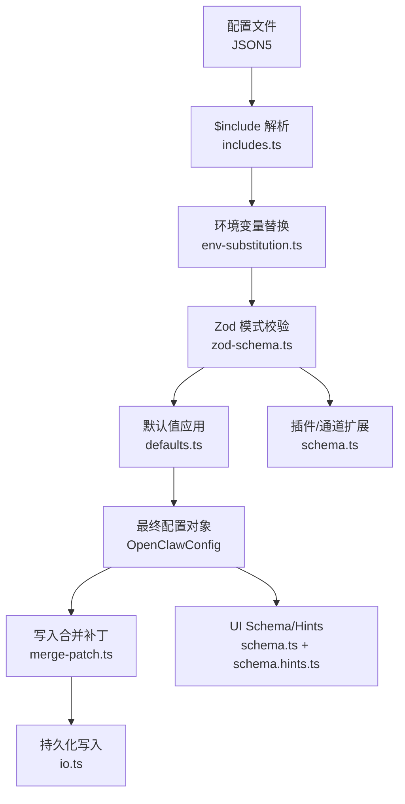
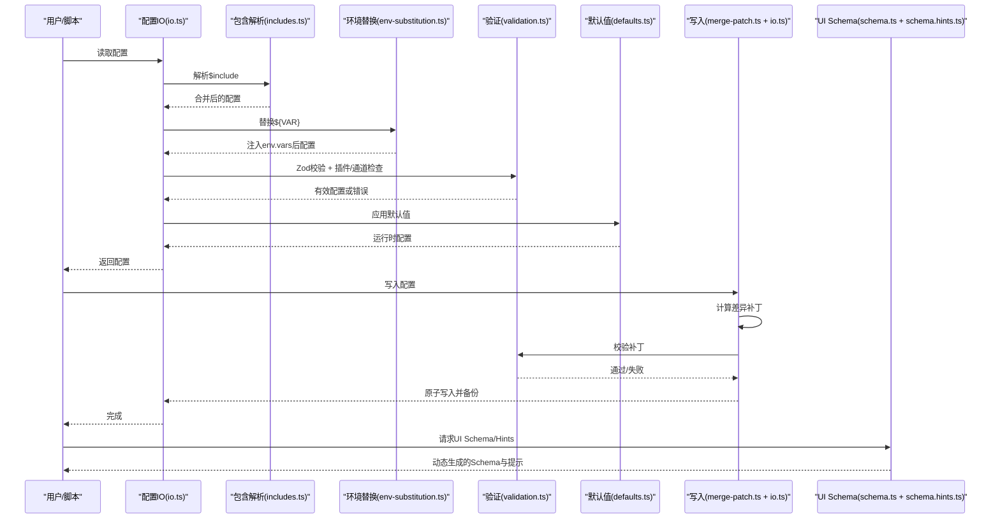
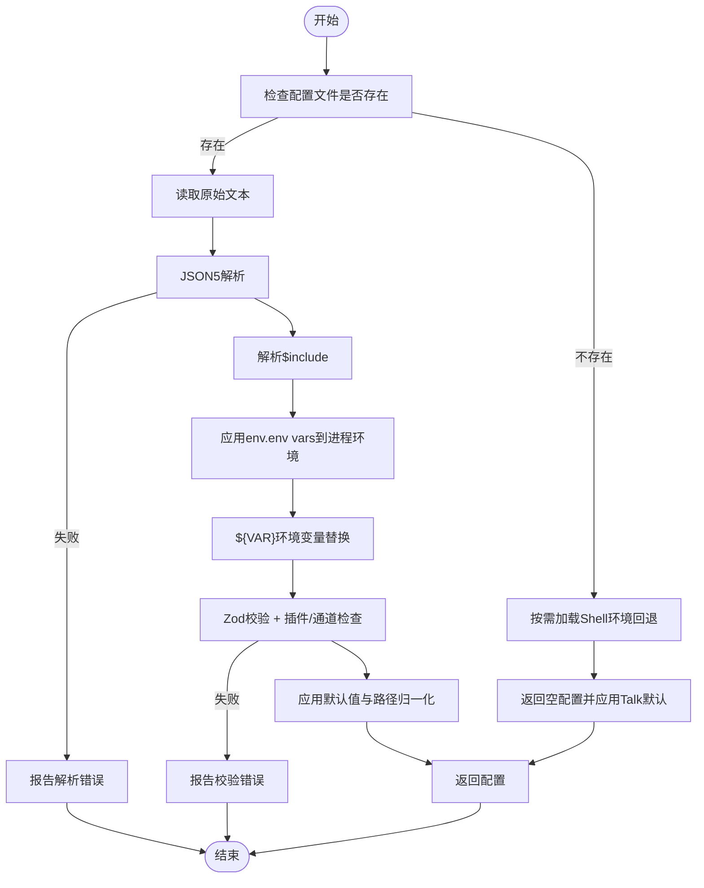
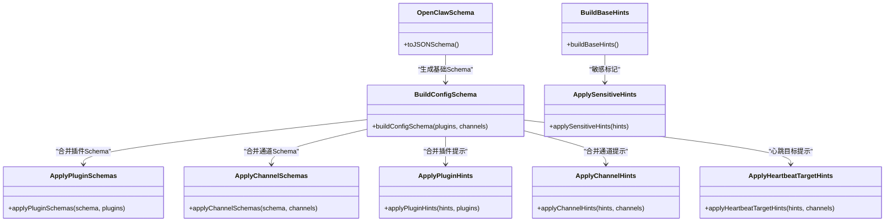
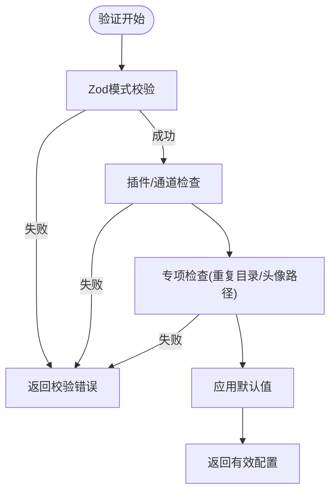
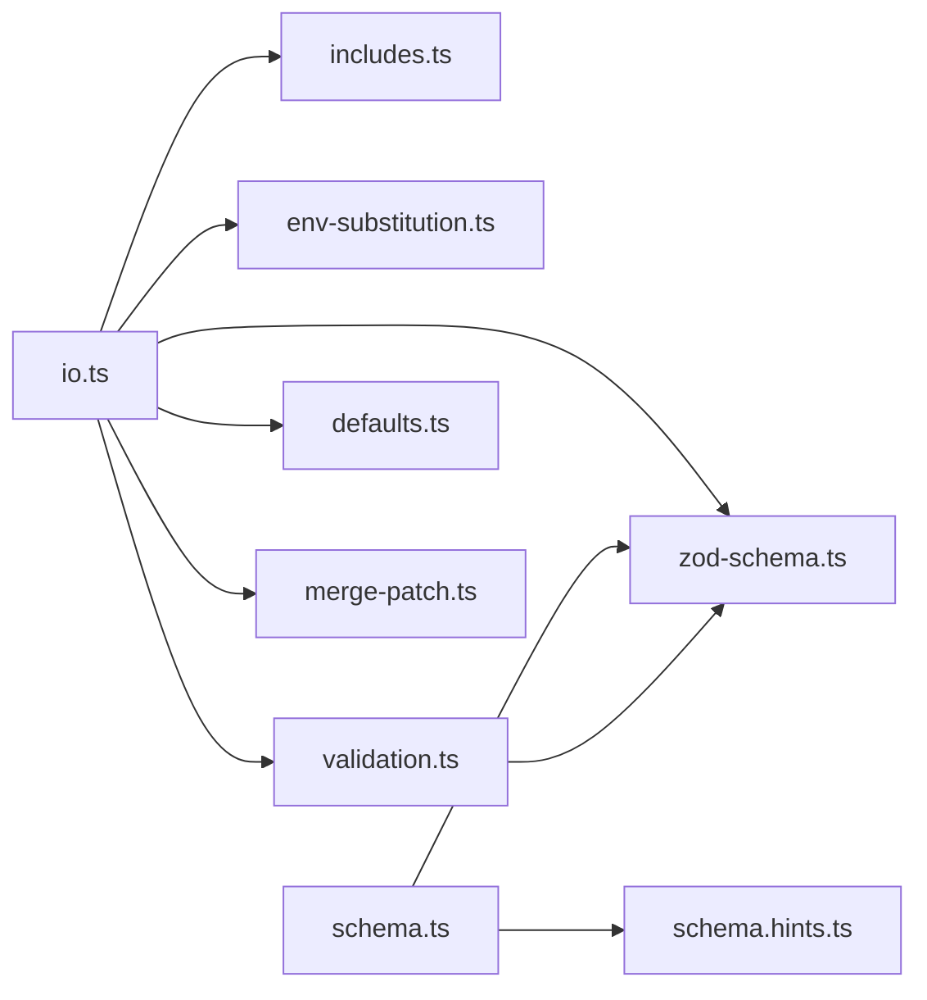

# 设置与配置

<cite>
**本文引用的文件**
- [src/config/config.ts](file://src/config/config.ts)
- [src/config/io.ts](file://src/config/io.ts)
- [src/config/schema.ts](file://src/config/schema.ts)
- [src/config/schema.hints.ts](file://src/config/schema.hints.ts)
- [src/config/zod-schema.ts](file://src/config/zod-schema.ts)
- [src/config/validation.ts](file://src/config/validation.ts)
- [src/config/defaults.ts](file://src/config/defaults.ts)
- [src/config/env-substitution.ts](file://src/config/env-substitution.ts)
- [src/config/env-vars.ts](file://src/config/env-vars.ts)
- [src/config/includes.ts](file://src/config/includes.ts)
- [src/config/merge-patch.ts](file://src/config/merge-patch.ts)
- [src/config/types.openclaw.ts](file://src/config/types.openclaw.ts)
- [src/config/legacy-migrate.ts](file://src/config/legacy-migrate.ts)
</cite>

## 目录

1. [简介](#简介)
2. [项目结构](#项目结构)
3. [核心组件](#核心组件)
4. [架构总览](#架构总览)
5. [详细组件分析](#详细组件分析)
6. [依赖分析](#依赖分析)
7. [性能考虑](#性能考虑)
8. [故障排查指南](#故障排查指南)
9. [结论](#结论)
10. [附录](#附录)

## 简介

本文件面向OpenClaw的“设置与配置”系统，系统性阐述配置模型、加载与写入流程、UI提示与动态生成、验证与迁移、导入导出与备份恢复、以及运行时生效与缓存管理等主题。目标是帮助开发者与运维人员理解并高效使用配置系统，覆盖账户配置、渠道设置、代理参数与系统选项，并提供可操作的实践建议。

## 项目结构

OpenClaw的配置子系统位于src/config目录，围绕“模式（Schema）+ 提示（Hints）+ 验证（Validation）+ 加载/写入（IO）+ 默认值（Defaults）+ 环境变量与包含（Env/Substitute/Includes）+ 合并补丁（Merge Patch）+ 兼容迁移（Legacy）”构建，形成从静态配置到动态UI、再到持久化与热更新的完整闭环。

图示来源

- [src/config/io.ts](file://src/config/io.ts#L272-L382)
- [src/config/includes.ts](file://src/config/includes.ts#L235-L241)
- [src/config/env-substitution.ts](file://src/config/env-substitution.ts#L125-L127)
- [src/config/zod-schema.ts](file://src/config/zod-schema.ts#L95-L606)
- [src/config/defaults.ts](file://src/config/defaults.ts#L128-L170)
- [src/config/merge-patch.ts](file://src/config/merge-patch.ts#L5-L26)
- [src/config/schema.ts](file://src/config/schema.ts#L313-L335)
- [src/config/schema.hints.ts](file://src/config/schema.hints.ts#L757-L789)

章节来源

- [src/config/config.ts](file://src/config/config.ts#L1-L20)
- [src/config/io.ts](file://src/config/io.ts#L263-L625)

## 核心组件

- 配置模式与类型：通过Zod模式定义配置结构，确保静态约束；类型导出统一入口便于消费。
- UI Schema与提示：基于基础Schema与插件/通道元数据动态生成UI Schema与提示信息，支持分组、顺序、敏感字段标记、占位符等。
- 加载与写入：负责解析、校验、默认值、路径归一化、缓存、备份与原子写入。
- 验证：除Zod外，还进行插件存在性、通道合法性、心跳目标有效性、重复工作区等专项检查。
- 默认值：对会话、代理并发、模型、日志、上下文修剪、压缩等进行合理默认。
- 环境变量与包含：支持$include模块化、${VAR}环境变量替换、env.vars注入、shell环境回退。
- 合并补丁：写入时仅持久化差异，避免泄漏运行时默认。
- 兼容迁移：对旧版配置执行迁移并二次校验。

章节来源

- [src/config/zod-schema.ts](file://src/config/zod-schema.ts#L95-L606)
- [src/config/types.openclaw.ts](file://src/config/types.openclaw.ts#L28-L100)
- [src/config/schema.ts](file://src/config/schema.ts#L313-L335)
- [src/config/schema.hints.ts](file://src/config/schema.hints.ts#L757-L789)
- [src/config/io.ts](file://src/config/io.ts#L272-L382)
- [src/config/validation.ts](file://src/config/validation.ts#L176-L404)
- [src/config/defaults.ts](file://src/config/defaults.ts#L128-L471)
- [src/config/env-substitution.ts](file://src/config/env-substitution.ts#L125-L127)
- [src/config/includes.ts](file://src/config/includes.ts#L235-L241)
- [src/config/merge-patch.ts](file://src/config/merge-patch.ts#L5-L26)
- [src/config/legacy-migrate.ts](file://src/config/legacy-migrate.ts#L5-L19)

## 架构总览

下图展示配置从磁盘到UI与运行时的关键流转：

图示来源

- [src/config/io.ts](file://src/config/io.ts#L272-L382)
- [src/config/includes.ts](file://src/config/includes.ts#L235-L241)
- [src/config/env-substitution.ts](file://src/config/env-substitution.ts#L125-L127)
- [src/config/validation.ts](file://src/config/validation.ts#L176-L404)
- [src/config/defaults.ts](file://src/config/defaults.ts#L128-L170)
- [src/config/merge-patch.ts](file://src/config/merge-patch.ts#L5-L26)
- [src/config/schema.ts](file://src/config/schema.ts#L313-L335)
- [src/config/schema.hints.ts](file://src/config/schema.hints.ts#L757-L789)

## 详细组件分析

### 组件A：配置加载与写入管线（IO）

- 职责
  - 解析JSON5，支持$include模块化。
  - 在校验前应用env.env vars到进程环境，再进行${VAR}替换。
  - 执行Zod校验与插件/通道专项检查。
  - 应用默认值与路径归一化。
  - 写入时计算差异补丁，仅持久化用户显式设置，避免泄漏运行时默认。
  - 原子写入并维护备份轮转。
  - 支持配置快照读取（含校验问题、警告、遗留问题）。
- 关键点
  - 缓存控制：可通过环境变量开启/关闭与设置缓存时长。
  - Shell环境回退：在未找到配置时可从登录shell注入期望的密钥。
  - 备份策略：最多保留若干个.bak文件，写入前自动轮转。
- 错误处理
  - 包含循环/深度超限、解析失败、环境变量缺失、校验失败、插件/通道未知、心跳目标非法等均抛出明确错误或返回空配置。

图示来源

- [src/config/io.ts](file://src/config/io.ts#L272-L382)
- [src/config/includes.ts](file://src/config/includes.ts#L235-L241)
- [src/config/env-substitution.ts](file://src/config/env-substitution.ts#L125-L127)
- [src/config/validation.ts](file://src/config/validation.ts#L176-L404)
- [src/config/defaults.ts](file://src/config/defaults.ts#L128-L170)

章节来源

- [src/config/io.ts](file://src/config/io.ts#L272-L382)
- [src/config/io.ts](file://src/config/io.ts#L551-L617)
- [src/config/io.ts](file://src/config/io.ts#L687-L689)

### 组件B：UI Schema与提示（Schema/Hints）

- 职责
  - 基于Zod模式生成可序列化的JSON Schema。
  - 合并插件与通道的Schema与UI提示，动态扩展配置树。
  - 为各字段提供标签、帮助、分组、顺序、占位符、敏感标记等。
  - 对心跳目标字段生成已知通道列表帮助文本。
- 特性
  - 分组与排序：按预设顺序组织大类（如Agents、Channels、Plugins等）。
  - 敏感字段：基于命名模式自动标记敏感字段（如token、password、api_key）。
  - 插件/通道扩展：允许插件与通道在运行时注入自身Schema与提示。

图示来源

- [src/config/schema.ts](file://src/config/schema.ts#L293-L335)
- [src/config/schema.hints.ts](file://src/config/schema.hints.ts#L757-L789)
- [src/config/zod-schema.ts](file://src/config/zod-schema.ts#L95-L606)

章节来源

- [src/config/schema.ts](file://src/config/schema.ts#L313-L335)
- [src/config/schema.hints.ts](file://src/config/schema.hints.ts#L16-L71)

### 组件C：验证与默认值（Validation/Defaults）

- 验证
  - Zod模式校验：严格约束结构与类型。
  - 插件/通道检查：未知插件、未知通道、心跳目标非法、插件Schema缺失等。
  - 专项检查：重复工作区目录、头像路径越权等。
- 默认值
  - 会话主键强制为“main”，并给出警告。
  - 代理并发默认值、模型输入/成本/上下文窗口/最大输出等默认填充。
  - 日志敏感信息脱敏策略默认值。
  - 上下文修剪与心跳策略根据认证模式自动调整。
  - Talk API Key自动注入（若存在）。

图示来源

- [src/config/validation.ts](file://src/config/validation.ts#L90-L146)
- [src/config/defaults.ts](file://src/config/defaults.ts#L128-L471)

章节来源

- [src/config/validation.ts](file://src/config/validation.ts#L176-L404)
- [src/config/defaults.ts](file://src/config/defaults.ts#L128-L471)

### 组件D：环境变量与包含（Env/Substitute/Includes）

- $include
  - 支持单文件与数组多文件合并，递归解析，限制最大深度，检测循环包含。
  - 与普通键共存时要求被包含内容为对象，否则报错。
- 环境变量替换
  - 仅匹配大写格式的环境变量名，支持转义$${VAR}。
  - 缺失或为空的必需变量会抛出错误并携带路径上下文。
- env.vars
  - 将配置中声明的环境变量注入到进程环境（若尚未存在），随后参与${VAR}替换。

章节来源

- [src/config/includes.ts](file://src/config/includes.ts#L235-L241)
- [src/config/env-substitution.ts](file://src/config/env-substitution.ts#L125-L127)
- [src/config/env-vars.ts](file://src/config/env-vars.ts#L3-L31)

### 组件E：写入与备份（Merge Patch/Backup）

- 差异补丁
  - 以当前磁盘配置为基，与新配置计算补丁，仅持久化差异，避免运行时默认进入磁盘。
- 原子写入
  - 先写临时文件，再rename覆盖；Windows上回退到copy+chmod+unlink。
  - 写入前轮转备份文件，最多保留若干个.bak。
- 快照
  - 读取快照包含原始文本、解析结果、校验问题、警告、遗留问题等，用于UI与诊断。

章节来源

- [src/config/merge-patch.ts](file://src/config/merge-patch.ts#L5-L26)
- [src/config/io.ts](file://src/config/io.ts#L551-L617)
- [src/config/io.ts](file://src/config/io.ts#L384-L549)

### 组件F：兼容迁移（Legacy）

- 对旧版配置执行迁移，再进行二次校验；若仍有问题，返回变更记录与提示。

章节来源

- [src/config/legacy-migrate.ts](file://src/config/legacy-migrate.ts#L5-L19)

## 依赖分析

- 模块耦合
  - io.ts是配置生命周期的中枢，依赖includes、env-substitution、validation、defaults、merge-patch、zod-schema等。
  - schema.ts依赖zod-schema与schema.hints，动态合并插件/通道Schema与提示。
  - validation.ts依赖zod-schema与插件注册表，进行插件/通道合法性检查。
- 外部依赖
  - JSON5解析、Node FS、路径工具、Zod校验库。
- 循环依赖
  - 通过导出函数与模块边界避免直接循环，例如schema.ts不直接依赖io.ts。

图示来源

- [src/config/io.ts](file://src/config/io.ts#L263-L625)
- [src/config/schema.ts](file://src/config/schema.ts#L313-L335)
- [src/config/validation.ts](file://src/config/validation.ts#L176-L404)

章节来源

- [src/config/io.ts](file://src/config/io.ts#L263-L625)
- [src/config/schema.ts](file://src/config/schema.ts#L313-L335)

## 性能考虑

- 缓存策略：通过环境变量控制IO层缓存时长，默认短缓存以平衡一致性与性能。
- 写入优化：仅写入差异补丁，减少磁盘写入量。
- 并发与I/O：$include与环境变量替换为纯内存操作，复杂度主要受配置体量影响。
- 建议
  - 在频繁读取场景启用缓存，但注意配置变更后及时刷新。
  - 合理拆分$include，避免过深嵌套与循环。
  - 使用env.vars集中管理敏感信息，减少硬编码。

## 故障排查指南

- 常见错误与定位
  - JSON5解析失败：检查语法与注释是否符合JSON5规范。
  - $include错误：检查路径、深度限制、循环包含。
  - 环境变量缺失：确认变量名大小写与拼写，必要时使用env.vars兜底。
  - 校验失败：根据issues路径逐项修正；关注插件/通道ID合法性、心跳目标、重复工作区等。
  - 写入失败：关注权限与磁盘空间；Windows平台可能触发回退逻辑。
- 诊断工具
  - 读取配置快照：获取raw、parsed、resolved、valid、issues、warnings、legacyIssues等。
  - 配置迁移：对旧配置执行迁移并查看变更记录。

章节来源

- [src/config/includes.ts](file://src/config/includes.ts#L34-L50)
- [src/config/env-substitution.ts](file://src/config/env-substitution.ts#L29-L37)
- [src/config/validation.ts](file://src/config/validation.ts#L176-L404)
- [src/config/io.ts](file://src/config/io.ts#L384-L549)
- [src/config/legacy-migrate.ts](file://src/config/legacy-migrate.ts#L5-L19)

## 结论

OpenClaw的配置系统以Zod模式为核心，结合动态UI Schema/Hints、严格的验证与默认值、模块化的$include与环境变量替换、差异补丁与原子写入，形成了稳定、可扩展且易于维护的配置生态。通过合理的分组与提示、完善的错误诊断与迁移能力，既满足了初学者的易用性，也兼顾了高级用户的灵活性与可扩展性。

## 附录

### 配置项分类与UI组织

- 分组与顺序：按wizard、update、diagnostics、gateway、nodeHost、agents、tools、bindings、audio、models、messages、commands、session、cron、hooks、ui、browser、talk、channels、skills、plugins、discovery、presence、voicewake等分组，保证UI呈现有序。
- 字段提示：为每个字段提供label/help/placeholder，敏感字段自动标记，便于UI安全渲染。
- 心跳目标：为agents.defaults.heartbeat.target与agents.list.\*.heartbeat.target生成已知通道列表帮助文本。

章节来源

- [src/config/schema.hints.ts](file://src/config/schema.hints.ts#L16-L71)
- [src/config/schema.hints.ts](file://src/config/schema.hints.ts#L369-L738)

### 账户配置（Auth）

- 支持多提供商、多模式（api_key/oauth/token）的认证资料与优先级顺序。
- 可配置账单冷却与失败窗口，实现智能降级与重试。

章节来源

- [src/config/zod-schema.ts](file://src/config/zod-schema.ts#L247-L273)
- [src/config/validation.ts](file://src/config/validation.ts#L269-L334)

### 渠道设置（Channels）

- 通过schema合并通道Schema与提示，支持Telegram、Discord、Slack、WhatsApp、Signal、iMessage、Mattermost、MS Teams等。
- 支持每通道的DM策略、重试、超时、流式发送等细粒度参数。

章节来源

- [src/config/schema.ts](file://src/config/schema.ts#L250-L274)
- [src/config/schema.hints.ts](file://src/config/schema.hints.ts#L369-L738)

### 代理参数与系统选项

- 代理并发默认值、模型输入/成本/上下文窗口/最大输出等默认填充。
- 日志级别与敏感信息脱敏策略默认值。
- 会话主键强制与告警、Talk API Key自动注入。

章节来源

- [src/config/defaults.ts](file://src/config/defaults.ts#L294-L471)
- [src/config/types.openclaw.ts](file://src/config/types.openclaw.ts#L28-L100)

### 配置导入导出、备份恢复与版本迁移

- 导入：通过$include与env.vars组合，实现模块化与环境隔离。
- 导出：写入时仅持久化差异补丁，保持磁盘配置简洁。
- 备份：写入前轮转.bak文件，最多保留若干个。
- 恢复：直接覆盖或回滚.bak文件。
- 迁移：对旧配置执行迁移并二次校验，保留变更记录。

章节来源

- [src/config/includes.ts](file://src/config/includes.ts#L235-L241)
- [src/config/env-vars.ts](file://src/config/env-vars.ts#L3-L31)
- [src/config/merge-patch.ts](file://src/config/merge-patch.ts#L5-L26)
- [src/config/io.ts](file://src/config/io.ts#L551-L617)
- [src/config/legacy-migrate.ts](file://src/config/legacy-migrate.ts#L5-L19)

### 设置界面的动态生成、条件显示与依赖关系

- 动态生成：基于Zod模式与插件/通道Schema/Hints动态生成UI结构与提示。
- 条件显示：通过提示中的advanced/sensitive/itemTemplate等字段驱动UI条件渲染。
- 依赖关系：心跳目标依赖已知通道集合，插件启用状态影响其配置可见性。

章节来源

- [src/config/schema.ts](file://src/config/schema.ts#L313-L335)
- [src/config/schema.hints.ts](file://src/config/schema.hints.ts#L3-L14)

### 配置模板、批量设置与高级选项

- 模板：通过$include将通用配置拆分为多个文件，按需合并。
- 批量设置：通过env.vars集中注入多处敏感配置，减少重复。
- 高级选项：通过schema.hints的advanced标记隐藏高级项，或通过敏感标记保护密钥。

章节来源

- [src/config/includes.ts](file://src/config/includes.ts#L235-L241)
- [src/config/env-vars.ts](file://src/config/env-vars.ts#L3-L31)
- [src/config/schema.hints.ts](file://src/config/schema.hints.ts#L3-L14)

### 设置变更的实时生效、缓存管理与错误处理

- 实时生效：写入采用差异补丁与原子覆盖，避免部分写入导致的不一致。
- 缓存管理：IO层支持缓存开关与时长控制，降低频繁读取开销。
- 错误处理：明确的异常类型与错误消息，配合快照输出便于诊断。

章节来源

- [src/config/io.ts](file://src/config/io.ts#L630-L684)
- [src/config/io.ts](file://src/config/io.ts#L551-L617)
- [src/config/io.ts](file://src/config/io.ts#L384-L549)
