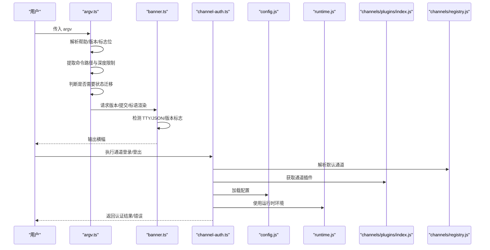
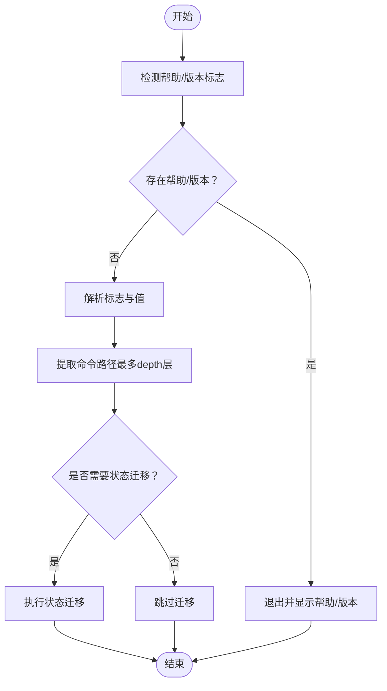
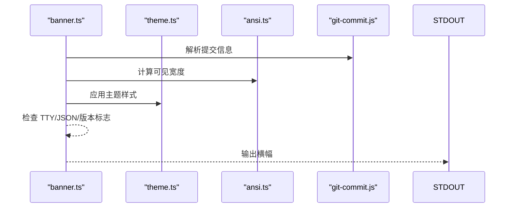
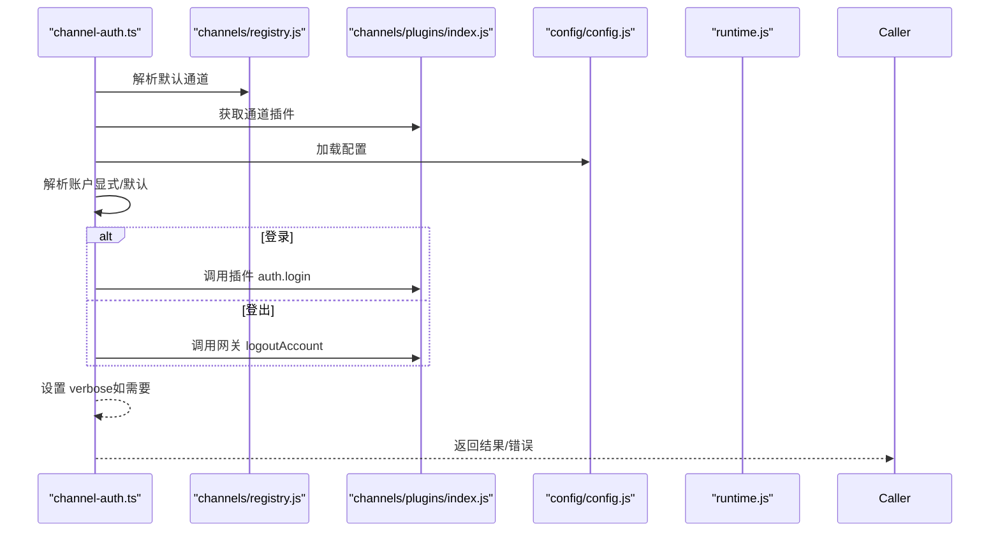
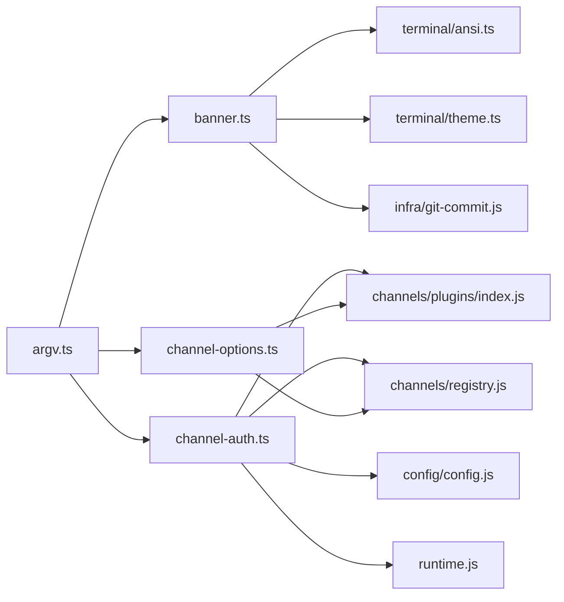

# CLI工具概览

<cite>
**本文档引用的文件**
- [src/cli/argv.ts](file://src/cli/argv.ts)
- [src/cli/banner.ts](file://src/cli/banner.ts)
- [src/cli/channel-auth.ts](file://src/cli/channel-auth.ts)
- [src/cli/channel-options.ts](file://src/cli/channel-options.ts)
- [src/terminal/ansi.ts](file://src/terminal/ansi.ts)
- [src/terminal/theme.ts](file://src/terminal/theme.ts)
- [src/infra/git-commit.js](file://src/infra/git-commit.js)
- [src/channels/plugins/index.js](file://src/channels/plugins/index.js)
- [src/channels/registry.js](file://src/channels/registry.js)
- [src/config/config.js](file://src/config/config.js)
- [src/runtime.js](file://src/runtime.js)
- [src/globals.js](file://src/globals.js)
</cite>

## 目录

1. [简介](#简介)
2. [项目结构](#项目结构)
3. [核心组件](#核心组件)
4. [架构总览](#架构总览)
5. [详细组件分析](#详细组件分析)
6. [依赖关系分析](#依赖关系分析)
7. [性能考量](#性能考量)
8. [故障排除指南](#故障排除指南)
9. [结论](#结论)

## 简介

本文件为 OpenClaw CLI 工具的综合概览文档，面向使用者与维护者，系统阐述命令行工具的整体架构、设计理念与使用模式。重点覆盖以下方面：

- 启动流程与参数解析机制
- 命令注册与路由（通过子命令路径）
- 全局选项与环境变量配置
- 版本信息、横幅展示与帮助系统
- 错误处理与状态迁移策略
- 与其他组件的集成方式与数据流向
- 安全考虑、权限管理与最佳实践

## 项目结构

OpenClaw 的 CLI 能力主要集中在 src/cli 目录下，并与终端渲染、主题、配置加载、通道插件等模块协同工作。关键文件职责如下：

- 参数解析：argv.ts 提供通用的 argv 解析、标志位检测、命令路径提取与可执行文件类型识别
- 横幅与版本：banner.ts 负责版本号、提交信息、标语与 TTY 友好输出
- 通道认证：channel-auth.ts 提供跨通道登录/登出能力
- 通道选项：channel-options.ts 提供通道选项枚举与格式化
- 终端支持：terminal/\* 提供 ANSI 计宽与主题渲染
- 集成点：config.js、runtime.js、channels/\*、registry.js 等

图表来源

- [src/cli/argv.ts](file://src/cli/argv.ts#L1-L170)
- [src/cli/banner.ts](file://src/cli/banner.ts#L1-L133)
- [src/cli/channel-auth.ts](file://src/cli/channel-auth.ts#L1-L64)
- [src/cli/channel-options.ts](file://src/cli/channel-options.ts#L1-L34)
- [src/terminal/ansi.ts](file://src/terminal/ansi.ts)
- [src/terminal/theme.ts](file://src/terminal/theme.ts)
- [src/infra/git-commit.js](file://src/infra/git-commit.js)
- [src/channels/plugins/index.js](file://src/channels/plugins/index.js)
- [src/channels/registry.js](file://src/channels/registry.js)
- [src/config/config.js](file://src/config/config.js)
- [src/runtime.js](file://src/runtime.js)

章节来源

- [src/cli/argv.ts](file://src/cli/argv.ts#L1-L170)
- [src/cli/banner.ts](file://src/cli/banner.ts#L1-L133)
- [src/cli/channel-auth.ts](file://src/cli/channel-auth.ts#L1-L64)
- [src/cli/channel-options.ts](file://src/cli/channel-options.ts#L1-L34)

## 核心组件

- 参数解析器（argv.ts）
  - 支持帮助/版本标志检测、正整数标志值解析、命令路径提取、可执行文件类型识别与 argv 归一化
  - 提供是否需要从旧路径迁移状态的判断，避免对健康/状态类命令进行无谓迁移
- 横幅与版本（banner.ts）
  - 输出带版本与提交信息的横幅，支持多行与着色渲染，自动检测 TTY 与 JSON 输出场景
  - 通过主题模块与 ANSI 计宽实现跨终端兼容
- 通道认证（channel-auth.ts）
  - 封装通道登录/登出流程，解析默认账户、调用插件认证接口或网关登出接口
  - 严格区分“仅认证”流程，不修改通道配置
- 通道选项（channel-options.ts）
  - 构建通道选项列表，支持按环境变量控制是否预加载插件注册表以扩展候选项
  - 提供格式化为“|”分隔字符串的能力

章节来源

- [src/cli/argv.ts](file://src/cli/argv.ts#L1-L170)
- [src/cli/banner.ts](file://src/cli/banner.ts#L1-L133)
- [src/cli/channel-auth.ts](file://src/cli/channel-auth.ts#L1-L64)
- [src/cli/channel-options.ts](file://src/cli/channel-options.ts#L1-L34)

## 架构总览

OpenClaw CLI 的启动与执行遵循“参数解析 → 状态迁移决策 → 命令路由 → 插件/通道交互”的主干流程。下图展示了 CLI 与核心模块的交互关系：

图表来源

- [src/cli/argv.ts](file://src/cli/argv.ts#L1-L170)
- [src/cli/banner.ts](file://src/cli/banner.ts#L1-L133)
- [src/cli/channel-auth.ts](file://src/cli/channel-auth.ts#L1-L64)
- [src/channels/plugins/index.js](file://src/channels/plugins/index.js)
- [src/channels/registry.js](file://src/channels/registry.js)
- [src/config/config.js](file://src/config/config.js)
- [src/runtime.js](file://src/runtime.js)

## 详细组件分析

### 参数解析器（argv.ts）

- 功能要点
  - 帮助/版本标志检测：支持 -h/--help、-v/-V/--version
  - 标志终止符：遇到 "--" 后停止解析后续标志
  - 值令牌判定：非以 "-" 开头且非数值形式的 token 视为值
  - 正整数解析：对指定标志的值进行正整数校验
  - 命令路径提取：从 argv 中提取最多 depth 层的命令路径，跳过标志与空值
  - 可执行文件类型识别：自动识别 node/bun 可执行文件，必要时归一化 argv
  - 状态迁移决策：根据命令路径决定是否需要从旧路径迁移状态
- 复杂度
  - 时间复杂度：O(n)，n 为 argv 长度；空间复杂度：O(k)，k 为命令路径长度
- 错误处理
  - 对无效值返回 undefined/null，由上层统一处理
  - 对未找到标志返回 undefined，避免误判

图表来源

- [src/cli/argv.ts](file://src/cli/argv.ts#L1-L170)

章节来源

- [src/cli/argv.ts](file://src/cli/argv.ts#L1-L170)

### 横幅与版本（banner.ts）

- 功能要点
  - 版本与提交信息：从 git 提交解析器获取提交哈希，若不可用则标记为 unknown
  - 标语选择：支持多种标语选项与主题风格
  - TTY 检测：在非 TTY 或 JSON 输出场景下跳过横幅
  - 多行渲染：根据终端列宽自动换行，支持 ANSI 计宽
  - 主题与着色：根据主题模块输出高亮/柔和/强调等样式
- 复杂度
  - 时间复杂度：O(L)，L 为横幅文本长度；空间复杂度：O(L)
- 错误处理
  - 对 Intl.Segmenter 不可用时回退字符分割
  - 对渲染异常进行容错，保证 CLI 可继续执行

图表来源

- [src/cli/banner.ts](file://src/cli/banner.ts#L1-L133)
- [src/terminal/theme.ts](file://src/terminal/theme.ts)
- [src/terminal/ansi.ts](file://src/terminal/ansi.ts)
- [src/infra/git-commit.js](file://src/infra/git-commit.js)

章节来源

- [src/cli/banner.ts](file://src/cli/banner.ts#L1-L133)

### 通道认证（channel-auth.ts）

- 功能要点
  - 登录流程：解析通道 ID、获取插件、调用插件 auth.login，支持显式账户与默认账户解析
  - 登出流程：解析账户并调用网关 logoutAccount，不修改配置
  - 运行时与配置：加载配置、设置 verbose、传递运行时环境
- 复杂度
  - 时间复杂度：O(1)（单次插件调用），受插件实现影响
- 错误处理
  - 不支持的通道或不支持登录/登出的通道会抛出明确错误
  - 输入账户名去除空白后处理

图表来源

- [src/cli/channel-auth.ts](file://src/cli/channel-auth.ts#L1-L64)
- [src/channels/plugins/index.js](file://src/channels/plugins/index.js)
- [src/channels/registry.js](file://src/channels/registry.js)
- [src/config/config.js](file://src/config/config.js)
- [src/runtime.js](file://src/runtime.js)

章节来源

- [src/cli/channel-auth.ts](file://src/cli/channel-auth.ts#L1-L64)

### 通道选项（channel-options.ts）

- 功能要点
  - 选项构建：合并默认通道顺序与插件目录中的通道 ID
  - 环境变量控制：OPENCLAW_EAGER_CHANNEL_OPTIONS 为真时预加载插件注册表以扩展候选项
  - 去重与格式化：去重后以“|”分隔输出
- 复杂度
  - 时间复杂度：O(m+n)，m 为默认通道数，n 为插件数；空间复杂度：O(m+n)

章节来源

- [src/cli/channel-options.ts](file://src/cli/channel-options.ts#L1-L34)

## 依赖关系分析

- 内部耦合
  - argv.ts 与 banner.ts：argv 提供命令路径与标志，banner 基于 argv 控制横幅输出
  - channel-auth.ts 依赖 channels/\*、config.js、runtime.js 实现认证与登出
  - channel-options.ts 依赖 channels/\* 与 registry.js 提供通道候选
- 外部依赖
  - 终端渲染：依赖 terminal/\* 提供 ANSI 计宽与主题
  - Git 提交：依赖 infra/git-commit.js 提供提交信息
- 潜在循环依赖
  - 当前模块间为单向依赖，未见循环导入迹象

图表来源

- [src/cli/argv.ts](file://src/cli/argv.ts#L1-L170)
- [src/cli/banner.ts](file://src/cli/banner.ts#L1-L133)
- [src/cli/channel-auth.ts](file://src/cli/channel-auth.ts#L1-L64)
- [src/cli/channel-options.ts](file://src/cli/channel-options.ts#L1-L34)
- [src/terminal/ansi.ts](file://src/terminal/ansi.ts)
- [src/terminal/theme.ts](file://src/terminal/theme.ts)
- [src/infra/git-commit.js](file://src/infra/git-commit.js)
- [src/channels/plugins/index.js](file://src/channels/plugins/index.js)
- [src/channels/registry.js](file://src/channels/registry.js)
- [src/config/config.js](file://src/config/config.js)
- [src/runtime.js](file://src/runtime.js)

章节来源

- [src/cli/argv.ts](file://src/cli/argv.ts#L1-L170)
- [src/cli/banner.ts](file://src/cli/banner.ts#L1-L133)
- [src/cli/channel-auth.ts](file://src/cli/channel-auth.ts#L1-L64)
- [src/cli/channel-options.ts](file://src/cli/channel-options.ts#L1-L34)

## 性能考量

- 参数解析
  - argv.ts 的解析为线性扫描，适合大多数 CLI 场景；建议避免过长的 argv 链
- 横幅渲染
  - ANSI 计宽与主题渲染为 O(L)，在宽屏终端上可能产生额外开销；可通过 JSON 输出模式规避
- 插件加载
  - channel-options.ts 在开启预加载时会枚举所有插件，可能增加启动时间；建议在需要完整候选项时启用
- 状态迁移
  - shouldMigrateStateFromPath 对特定命令路径短路，避免不必要的迁移成本

## 故障排除指南

- 无法显示横幅
  - 检查是否在非 TTY 环境（如管道/脚本）中运行
  - 若使用 --json 或 --version，横幅会被自动禁用
- 通道登录失败
  - 确认通道 ID 是否受支持，插件是否提供 auth.login
  - 检查账户解析逻辑与配置加载是否成功
- 通道选项不完整
  - 设置 OPENCLAW_EAGER_CHANNEL_OPTIONS=1 以预加载插件注册表
- 参数解析异常
  - 确认 argv 是否被正确归一化（例如通过 node/bun 执行）
  - 检查是否存在 "--" 导致的提前终止

章节来源

- [src/cli/banner.ts](file://src/cli/banner.ts#L111-L128)
- [src/cli/channel-auth.ts](file://src/cli/channel-auth.ts#L14-L38)
- [src/cli/channel-options.ts](file://src/cli/channel-options.ts#L20-L29)
- [src/cli/argv.ts](file://src/cli/argv.ts#L107-L132)

## 结论

OpenClaw CLI 采用清晰的分层设计：参数解析负责输入规范化与命令路由，横幅模块提供一致的版本与标语输出，通道认证与选项模块连接到插件生态。整体具备良好的可扩展性与跨平台兼容性。建议在生产环境中结合环境变量与运行时配置，合理启用预加载与状态迁移策略，确保性能与稳定性。
