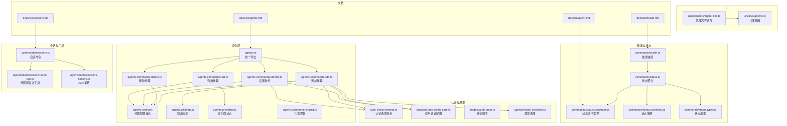
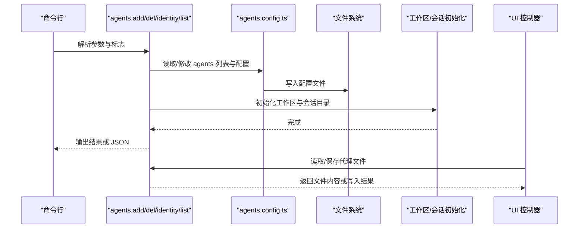
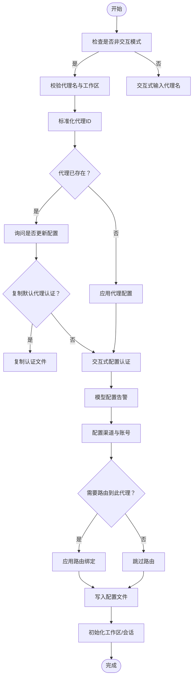
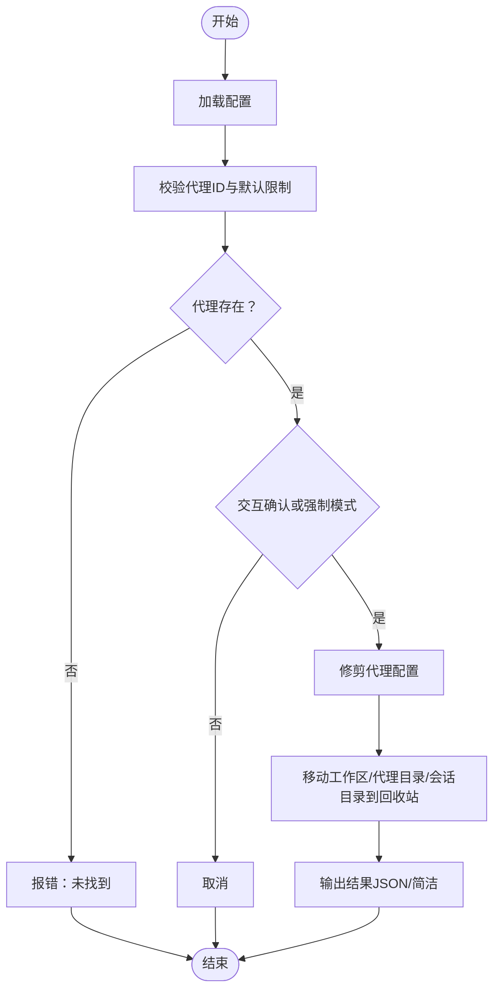
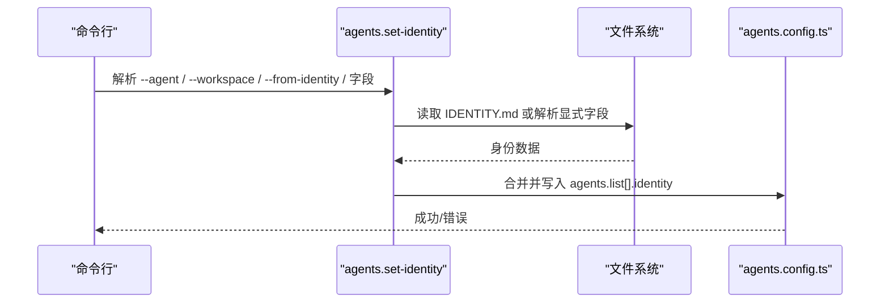
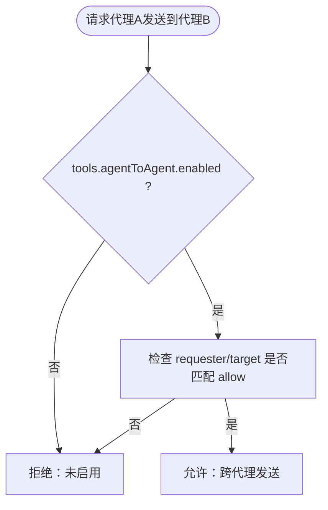
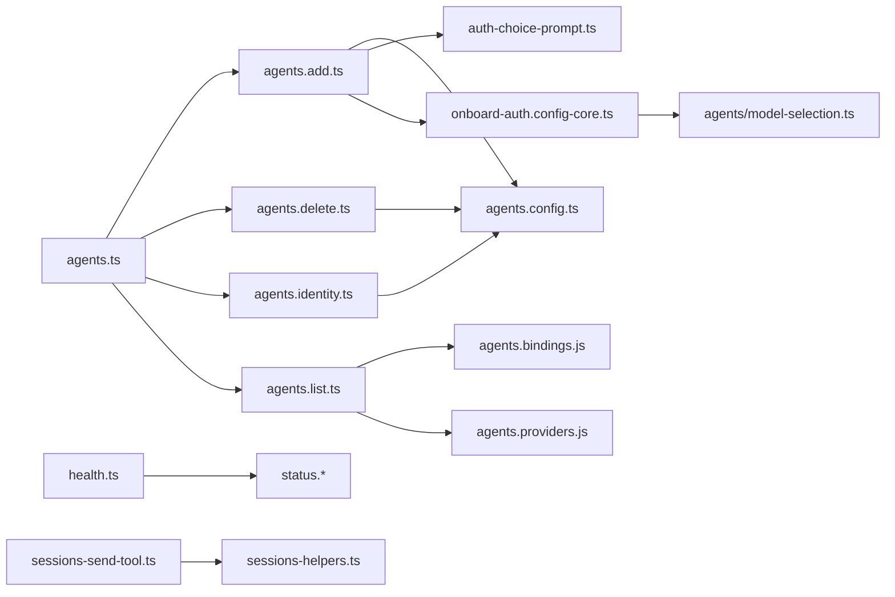

# 代理管理命令

<cite>
**本文引用的文件**
- [src/commands/agents.ts](file://src/commands/agents.ts)
- [src/commands/agents.commands.add.ts](file://src/commands/agents.commands.add.ts)
- [src/commands/agents.commands.delete.ts](file://src/commands/agents.commands.delete.ts)
- [src/commands/agents.commands.identity.ts](file://src/commands/agents.commands.identity.ts)
- [src/commands/agents.commands.list.ts](file://src/commands/agents.commands.list.ts)
- [src/commands/agents.config.ts](file://src/commands/agents.config.ts)
- [src/commands/agents.bindings.js](file://src/commands/agents.bindings.js)
- [src/commands/agents.providers.js](file://src/commands/agents.providers.js)
- [src/commands/agents.command-shared.js](file://src/commands/agents.command-shared.js)
- [src/commands/auth-choice-prompt.ts](file://src/commands/auth-choice-prompt.ts)
- [src/commands/onboard-auth.config-core.ts](file://src/commands/onboard-auth.config-core.ts)
- [src/commands/models/auth-order.ts](file://src/commands/models/auth-order.ts)
- [src/agents/model-selection.ts](file://src/agents/model-selection.ts)
- [src/commands/health.ts](file://src/commands/health.ts)
- [src/commands/status.ts](file://src/commands/status.ts)
- [src/commands/status.command.js](file://src/commands/status.command.js)
- [src/commands/status.summary.js](file://src/commands/status.summary.js)
- [src/commands/status.types.js](file://src/commands/status.types.js)
- [src/commands/sessions.ts](file://src/commands/sessions.ts)
- [src/agents/tools/sessions-send-tool.ts](file://src/agents/tools/sessions-send-tool.ts)
- [src/agents/tools/sessions-helpers.ts](file://src/agents/tools/sessions-helpers.ts)
- [src/gateway/server-methods/agents-mutate.test.ts](file://src/gateway/server-methods/agents-mutate.test.ts)
- [ui/src/ui/controllers/agent-files.ts](file://ui/src/ui/controllers/agent-files.ts)
- [ui/src/ui/views/agents.ts](file://ui/src/ui/views/agents.ts)
- [docs/cli/agents.md](file://docs/cli/agents.md)
- [docs/cli/agent.md](file://docs/cli/agent.md)
- [docs/cli/sessions.md](file://docs/cli/sessions.md)
- [docs/cli/health.md](file://docs/cli/health.md)
</cite>

## 目录

1. [简介](#简介)
2. [项目结构](#项目结构)
3. [核心组件](#核心组件)
4. [架构总览](#架构总览)
5. [详细组件分析](#详细组件分析)
6. [依赖关系分析](#依赖关系分析)
7. [性能考量](#性能考量)
8. [故障排查指南](#故障排查指南)
9. [结论](#结论)
10. [附录](#附录)

## 简介

本文件系统化梳理 OpenClaw 的“代理管理命令”，覆盖代理的创建、删除、配置与管理，包括身份认证、模型选择与工具配置；同时提供代理状态查询、会话管理与性能监控的使用示例，并说明代理配置文件的编辑、导入与导出能力，以及代理间通信、权限管理与资源共享的相关命令与策略。

## 项目结构

围绕代理管理的核心 CLI 命令位于 src/commands 下，按职责拆分为添加、删除、身份设置、列表等子命令模块，并通过 agents.ts 统一导出入口。UI 层在 ui/src/ui 提供代理文件与视图支持，文档位于 docs/cli。

图表来源

- [src/commands/agents.ts](file://src/commands/agents.ts#L1-L7)
- [src/commands/agents.commands.add.ts](file://src/commands/agents.commands.add.ts#L1-L368)
- [src/commands/agents.commands.delete.ts](file://src/commands/agents.commands.delete.ts#L1-L102)
- [src/commands/agents.commands.identity.ts](file://src/commands/agents.commands.identity.ts#L1-L234)
- [src/commands/agents.commands.list.ts](file://src/commands/agents.commands.list.ts#L1-L135)
- [src/commands/agents.config.ts](file://src/commands/agents.config.ts)
- [src/commands/agents.bindings.js](file://src/commands/agents.bindings.js)
- [src/commands/agents.providers.js](file://src/commands/agents.providers.js)
- [src/commands/agents.command-shared.js](file://src/commands/agents.command-shared.js)
- [src/commands/auth-choice-prompt.ts](file://src/commands/auth-choice-prompt.ts#L1-L60)
- [src/commands/onboard-auth.config-core.ts](file://src/commands/onboard-auth.config-core.ts#L901-L940)
- [src/commands/models/auth-order.ts](file://src/commands/models/auth-order.ts#L1-L39)
- [src/agents/model-selection.ts](file://src/agents/model-selection.ts#L256-L287)
- [src/commands/health.ts](file://src/commands/health.ts#L119-L412)
- [src/commands/status.ts](file://src/commands/status.ts#L1-L3)
- [src/commands/status.command.js](file://src/commands/status.command.js)
- [src/commands/status.summary.js](file://src/commands/status.summary.js)
- [src/commands/status.types.js](file://src/commands/status.types.js)
- [src/commands/sessions.ts](file://src/commands/sessions.ts)
- [src/agents/tools/sessions-send-tool.ts](file://src/agents/tools/sessions-send-tool.ts#L232-L248)
- [src/agents/tools/sessions-helpers.ts](file://src/agents/tools/sessions-helpers.ts#L78-L118)
- [ui/src/ui/controllers/agent-files.ts](file://ui/src/ui/controllers/agent-files.ts#L58-L126)
- [ui/src/ui/views/agents.ts](file://ui/src/ui/views/agents.ts#L875-L906)
- [docs/cli/agents.md](file://docs/cli/agents.md#L1-L76)
- [docs/cli/agent.md](file://docs/cli/agent.md#L1-L25)
- [docs/cli/sessions.md](file://docs/cli/sessions.md#L1-L17)
- [docs/cli/health.md](file://docs/cli/health.md#L1-L22)

章节来源

- [src/commands/agents.ts](file://src/commands/agents.ts#L1-L7)
- [docs/cli/agents.md](file://docs/cli/agents.md#L1-L76)

## 核心组件

- 代理添加命令：负责创建新代理、解析工作区与代理目录、应用绑定、写入配置、初始化工作区与会话目录，并可交互式配置认证与渠道路由。
- 代理删除命令：校验代理存在性与非默认限制，交互确认后清理配置、工作区、代理目录与会话目录。
- 代理身份设置命令：从 IDENTITY.md 或显式参数更新 agents.list[].identity 字段，支持名称、主题、表情与头像等。
- 代理列表命令：汇总各代理的工作区、代理目录、模型、路由规则与提供商状态，支持输出完整路由详情与 JSON。
- 认证与模型：提供认证选择提示、应用认证配置、模型允许集构建与认证顺序管理。
- 健康与状态：聚合多代理心跳、会话存储与通道账户状态，支持探针模式与详细输出。
- 会话与工具：会话命令用于查看存储会话；代理间消息工具受策略控制，支持启用与白名单匹配。
- UI 支持：代理文件读取/保存、视图渲染与草稿管理。

章节来源

- [src/commands/agents.commands.add.ts](file://src/commands/agents.commands.add.ts#L51-L368)
- [src/commands/agents.commands.delete.ts](file://src/commands/agents.commands.delete.ts#L19-L102)
- [src/commands/agents.commands.identity.ts](file://src/commands/agents.commands.identity.ts#L68-L234)
- [src/commands/agents.commands.list.ts](file://src/commands/agents.commands.list.ts#L74-L135)
- [src/commands/auth-choice-prompt.ts](file://src/commands/auth-choice-prompt.ts#L1-L60)
- [src/commands/onboard-auth.config-core.ts](file://src/commands/onboard-auth.config-core.ts#L901-L940)
- [src/agents/model-selection.ts](file://src/agents/model-selection.ts#L256-L287)
- [src/commands/health.ts](file://src/commands/health.ts#L385-L412)
- [src/commands/sessions.ts](file://src/commands/sessions.ts)
- [src/agents/tools/sessions-send-tool.ts](file://src/agents/tools/sessions-send-tool.ts#L232-L248)
- [src/agents/tools/sessions-helpers.ts](file://src/agents/tools/sessions-helpers.ts#L78-L118)
- [ui/src/ui/controllers/agent-files.ts](file://ui/src/ui/controllers/agent-files.ts#L58-L126)
- [ui/src/ui/views/agents.ts](file://ui/src/ui/views/agents.ts#L875-L906)

## 架构总览

下图展示代理管理命令的调用链与数据流：CLI 命令经由运行时加载配置，执行业务逻辑（如添加/删除/设置身份/列出），更新配置文件并触发工作区与会话初始化；健康与状态命令从配置与会话存储中聚合信息；UI 通过 RPC 请求代理文件内容并进行编辑。

图表来源

- [src/commands/agents.commands.add.ts](file://src/commands/agents.commands.add.ts#L107-L139)
- [src/commands/agents.commands.delete.ts](file://src/commands/agents.commands.delete.ts#L72-L82)
- [src/commands/agents.commands.identity.ts](file://src/commands/agents.commands.identity.ts#L190-L199)
- [src/commands/agents.config.ts](file://src/commands/agents.config.ts)
- [ui/src/ui/controllers/agent-files.ts](file://ui/src/ui/controllers/agent-files.ts#L73-L115)

## 详细组件分析

### 代理创建命令（agents add）

- 功能要点
  - 非交互模式要求提供工作区路径与代理名；保留默认代理 ID 不可重名。
  - 解析并应用绑定（路由到特定渠道/账号），冲突则跳过并提示。
  - 可选复制默认代理的认证配置至新代理目录。
  - 交互式引导配置模型/认证与渠道路由，必要时警告模型配置异常。
  - 写入配置、初始化工作区与会话目录，输出简洁或 JSON 结果。
- 关键流程

图表来源

- [src/commands/agents.commands.add.ts](file://src/commands/agents.commands.add.ts#L51-L368)
- [src/commands/agents.bindings.js](file://src/commands/agents.bindings.js)
- [src/commands/auth-choice-prompt.ts](file://src/commands/auth-choice-prompt.ts#L1-L60)
- [src/commands/onboard-auth.config-core.ts](file://src/commands/onboard-auth.config-core.ts#L923-L940)

章节来源

- [src/commands/agents.commands.add.ts](file://src/commands/agents.commands.add.ts#L51-L368)
- [src/commands/agents.bindings.js](file://src/commands/agents.bindings.js)
- [src/commands/auth-choice-prompt.ts](file://src/commands/auth-choice-prompt.ts#L1-L60)
- [src/commands/onboard-auth.config-core.ts](file://src/commands/onboard-auth.config-core.ts#L923-L940)

### 代理删除命令（agents delete）

- 功能要点
  - 校验代理 ID、禁止删除默认代理。
  - 交互确认（TTY 环境）或强制模式。
  - 清理配置、工作区、代理目录与会话目录。
  - 输出简洁或 JSON 结果，包含移除的绑定与授权项。
- 错误处理
  - 测试覆盖了不存在代理、非法参数与不可删除默认代理的场景。

图表来源

- [src/commands/agents.commands.delete.ts](file://src/commands/agents.commands.delete.ts#L19-L102)
- [src/gateway/server-methods/agents-mutate.test.ts](file://src/gateway/server-methods/agents-mutate.test.ts#L347-L373)

章节来源

- [src/commands/agents.commands.delete.ts](file://src/commands/agents.commands.delete.ts#L19-L102)
- [src/gateway/server-methods/agents-mutate.test.ts](file://src/gateway/server-methods/agents-mutate.test.ts#L347-L373)

### 代理身份设置命令（agents set-identity）

- 功能要点
  - 支持从 IDENTITY.md 或显式参数设置 name、emoji、theme、avatar。
  - 可根据工作区自动推断目标代理，或直接指定代理 ID。
  - 更新 agents.list[].identity 并写回配置文件。
- 文件解析
  - 从工作区根目录读取 IDENTITY.md，解析为代理身份字段。

图表来源

- [src/commands/agents.commands.identity.ts](file://src/commands/agents.commands.identity.ts#L68-L234)

章节来源

- [src/commands/agents.commands.identity.ts](file://src/commands/agents.commands.identity.ts#L68-L234)
- [docs/cli/agents.md](file://docs/cli/agents.md#L27-L76)

### 代理列表命令（agents list）

- 功能要点
  - 汇总每个代理的 ID、名称、工作区、代理目录、模型、路由规则与提供商状态。
  - 可输出完整路由详情与 JSON。
  - 提示路由规则映射渠道/账号/对端到代理，建议使用 --bindings 查看完整规则。
- 数据来源
  - 通过 agents.config.ts 生成摘要，结合 agents.bindings.js 与 agents.providers.js 补充路由与提供商信息。

章节来源

- [src/commands/agents.commands.list.ts](file://src/commands/agents.commands.list.ts#L74-L135)
- [src/commands/agents.bindings.js](file://src/commands/agents.bindings.js)
- [src/commands/agents.providers.js](file://src/commands/agents.providers.js)

### 认证与模型配置

- 认证选择与应用
  - 通过交互式分组提示选择认证方式，应用到配置并可覆盖代理模型。
  - 应用认证配置时写入 profiles，并设置默认模型。
- 模型选择
  - 允许集构建支持默认提供商与模型，若未显式允许则包含全部模型。
  - 认证顺序管理支持按提供商维护优先级。
- UI 中的模型选择
  - UI 视图提供主模型与回退模型列表选择，支持继承默认值。

章节来源

- [src/commands/auth-choice-prompt.ts](file://src/commands/auth-choice-prompt.ts#L1-L60)
- [src/commands/onboard-auth.config-core.ts](file://src/commands/onboard-auth.config-core.ts#L923-L940)
- [src/agents/model-selection.ts](file://src/agents/model-selection.ts#L256-L287)
- [src/commands/models/auth-order.ts](file://src/commands/models/auth-order.ts#L1-L39)
- [ui/src/ui/views/agents.ts](file://ui/src/ui/views/agents.ts#L875-L906)

### 代理间通信与权限管理

- 工具策略
  - 代理间消息工具受策略控制：需开启 tools.agentToAgent.enabled，且 requester 与 target 均需匹配 allow 白名单（支持通配符）。
- 默认行为
  - 若未启用或不在允许列表内，将拒绝跨代理发送。
- 会话辅助
  - 提供识别会话 ID 的辅助函数，便于工具层判断请求来源与目标。

图表来源

- [src/agents/tools/sessions-helpers.ts](file://src/agents/tools/sessions-helpers.ts#L78-L118)
- [src/agents/tools/sessions-send-tool.ts](file://src/agents/tools/sessions-send-tool.ts#L232-L248)

章节来源

- [src/agents/tools/sessions-helpers.ts](file://src/agents/tools/sessions-helpers.ts#L78-L118)
- [src/agents/tools/sessions-send-tool.ts](file://src/agents/tools/sessions-send-tool.ts#L232-L248)

### 会话管理与性能监控

- 会话命令
  - 列出存储的对话会话，支持筛选活跃会话与 JSON 输出。
- 健康快照
  - 聚合多代理的心跳、会话存储与通道账户状态，支持探针模式与详细输出。
- 状态聚合
  - 聚合状态摘要与类型定义，便于 UI 与 CLI 使用。

章节来源

- [docs/cli/sessions.md](file://docs/cli/sessions.md#L1-L17)
- [src/commands/sessions.ts](file://src/commands/sessions.ts)
- [docs/cli/health.md](file://docs/cli/health.md#L1-L22)
- [src/commands/health.ts](file://src/commands/health.ts#L385-L412)
- [src/commands/status.ts](file://src/commands/status.ts#L1-L3)
- [src/commands/status.command.js](file://src/commands/status.command.js)
- [src/commands/status.summary.js](file://src/commands/status.summary.js)
- [src/commands/status.types.js](file://src/commands/status.types.js)

### 代理配置文件的编辑、导入与导出

- 编辑
  - UI 支持加载与保存代理文件，保持草稿并在内容变更时标记脏状态。
- 导入/导出
  - 文档说明通过 IDENTITY.md 导入身份信息，支持从工作区根目录或指定文件路径读取。
  - 列表命令支持 JSON 输出，可用于导出代理概要信息。
- 注意事项
  - 头像路径相对工作区根目录解析；当未提供任何字段时，命令会提示必须至少提供一个身份字段。

章节来源

- [ui/src/ui/controllers/agent-files.ts](file://ui/src/ui/controllers/agent-files.ts#L58-L126)
- [ui/src/ui/views/agents.ts](file://ui/src/ui/views/agents.ts#L1285-L1306)
- [docs/cli/agents.md](file://docs/cli/agents.md#L27-L76)
- [src/commands/agents.commands.list.ts](file://src/commands/agents.commands.list.ts#L123-L126)

## 依赖关系分析

- 命令与配置
  - agents.ts 统一导出各命令，agents.config.ts 提供配置读写与代理条目操作。
- 认证与模型
  - auth-choice-prompt.ts 与 onboard-auth.config-core.ts 协作完成认证配置应用；agents/model-selection.ts 提供模型允许集构建。
- 路由与提供商
  - agents.bindings.js 与 agents.providers.js 分别处理路由绑定与提供商状态索引。
- 健康与状态
  - health.ts 与 status.\* 聚合多代理与会话信息，供 CLI 与 UI 使用。
- 工具与策略
  - sessions-send-tool.ts 与 sessions-helpers.ts 实现跨代理消息策略控制。

图表来源

- [src/commands/agents.ts](file://src/commands/agents.ts#L1-L7)
- [src/commands/agents.commands.add.ts](file://src/commands/agents.commands.add.ts#L1-L368)
- [src/commands/agents.commands.delete.ts](file://src/commands/agents.commands.delete.ts#L1-L102)
- [src/commands/agents.commands.identity.ts](file://src/commands/agents.commands.identity.ts#L1-L234)
- [src/commands/agents.commands.list.ts](file://src/commands/agents.commands.list.ts#L1-L135)
- [src/commands/agents.config.ts](file://src/commands/agents.config.ts)
- [src/commands/agents.bindings.js](file://src/commands/agents.bindings.js)
- [src/commands/agents.providers.js](file://src/commands/agents.providers.js)
- [src/commands/auth-choice-prompt.ts](file://src/commands/auth-choice-prompt.ts#L1-L60)
- [src/commands/onboard-auth.config-core.ts](file://src/commands/onboard-auth.config-core.ts#L901-L940)
- [src/agents/model-selection.ts](file://src/agents/model-selection.ts#L256-L287)
- [src/commands/health.ts](file://src/commands/health.ts#L119-L412)
- [src/commands/status.ts](file://src/commands/status.ts#L1-L3)
- [src/agents/tools/sessions-send-tool.ts](file://src/agents/tools/sessions-send-tool.ts#L232-L248)
- [src/agents/tools/sessions-helpers.ts](file://src/agents/tools/sessions-helpers.ts#L78-L118)

## 性能考量

- 非交互模式
  - 添加代理在非交互模式下要求提供必要参数，避免等待用户输入，减少启动时间。
- 批量与缓存
  - 健康快照对会话存储进行缓存以降低重复读取开销。
- 路由冲突检测
  - 在应用绑定前进行冲突检测，避免无效路由导致后续失败重试。
- UI 草稿与增量更新
  - UI 仅在内容变化时标记脏状态，减少不必要的保存与网络往返。

## 故障排查指南

- 删除失败
  - 若提示“不可删除”或“未找到”，请检查代理 ID 是否为默认代理或是否存在；在非 TTY 环境需使用 --force。
- 添加冲突
  - 路由绑定被其他代理占用时会跳过冲突项并提示；可在路由详情中查看冲突绑定。
- 认证问题
  - 若模型配置异常，命令会给出告警；可通过 set-identity 或重新配置认证解决。
- 跨代理消息被拒
  - 检查 tools.agentToAgent.enabled 与 allow 白名单；确保 requester 与 target 均匹配。

章节来源

- [src/commands/agents.commands.delete.ts](file://src/commands/agents.commands.delete.ts#L39-L49)
- [src/commands/agents.commands.add.ts](file://src/commands/agents.commands.add.ts#L163-L173)
- [src/commands/auth-choice-prompt.ts](file://src/commands/auth-choice-prompt.ts#L1-L60)
- [src/agents/tools/sessions-helpers.ts](file://src/agents/tools/sessions-helpers.ts#L78-L118)

## 结论

OpenClaw 的代理管理命令围绕“配置—工作区—会话—路由—认证—监控”的完整闭环设计，既支持交互式向导，也支持非交互批量自动化；通过策略化的代理间通信与完善的健康/状态监控，满足多代理场景下的隔离、治理与可观测性需求。

## 附录

- 相关 CLI 文档
  - 代理管理命令参考：[agents](file://docs/cli/agents.md#L1-L76)
  - 单次代理回合命令：[agent](file://docs/cli/agent.md#L1-L25)
  - 会话命令参考：[sessions](file://docs/cli/sessions.md#L1-L17)
  - 健康命令参考：[health](file://docs/cli/health.md#L1-L22)
