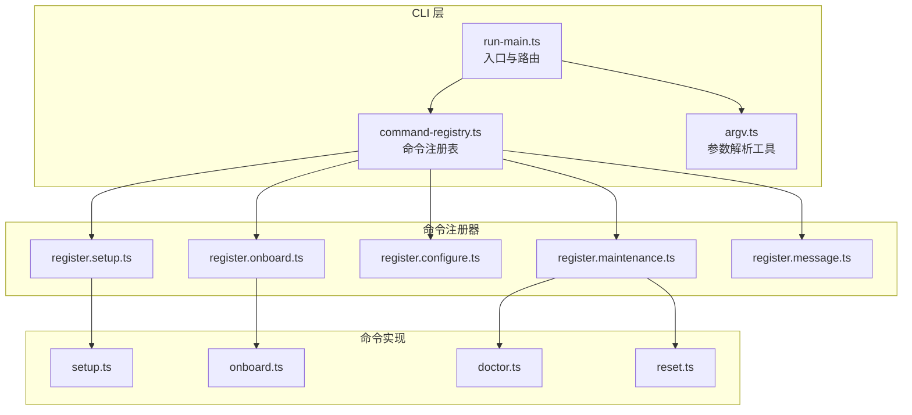
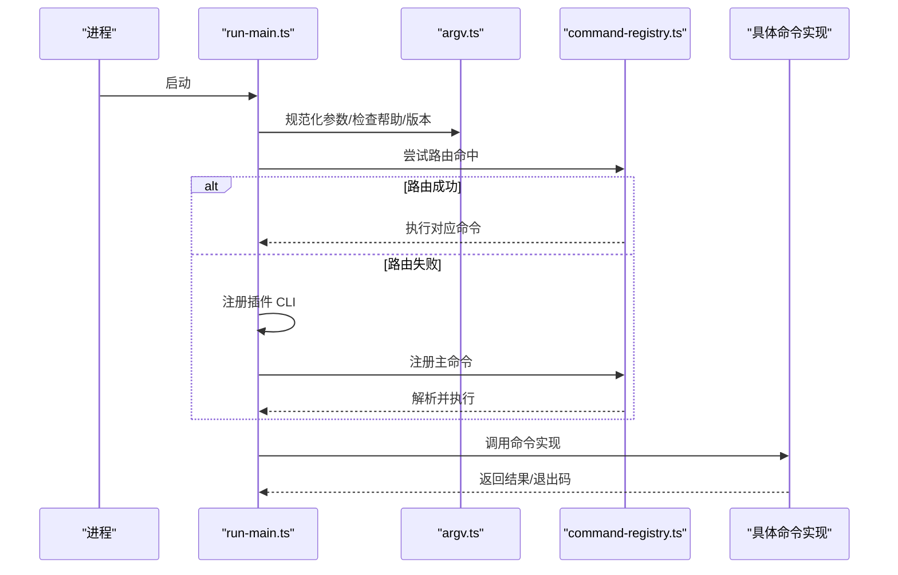
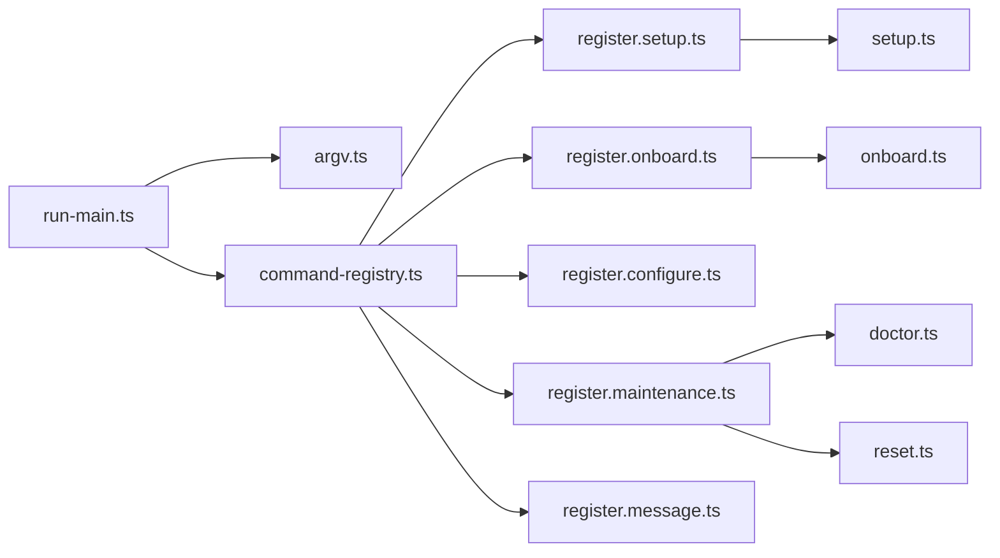

# 命令参考手册

<cite>
**本文引用的文件**
- [docs/cli/index.md](file://docs/cli/index.md)
- [src/cli/program/command-registry.ts](file://src/cli/program/command-registry.ts)
- [src/cli/argv.ts](file://src/cli/argv.ts)
- [src/cli/run-main.ts](file://src/cli/run-main.ts)
- [src/cli/program/register.setup.ts](file://src/cli/program/register.setup.ts)
- [src/cli/program/register.onboard.ts](file://src/cli/program/register.onboard.ts)
- [src/cli/program/register.configure.ts](file://src/cli/program/register.configure.ts)
- [src/cli/program/register.maintenance.ts](file://src/cli/program/register.maintenance.ts)
- [src/cli/program/register.message.ts](file://src/cli/program/register.message.ts)
- [src/commands/setup.ts](file://src/commands/setup.ts)
- [src/commands/onboard.ts](file://src/commands/onboard.ts)
- [src/commands/configure.ts](file://src/commands/configure.ts)
- [src/commands/doctor.ts](file://src/commands/doctor.ts)
- [src/commands/reset.ts](file://src/commands/reset.ts)
</cite>

## 目录

1. [简介](#简介)
2. [项目结构](#项目结构)
3. [核心组件](#核心组件)
4. [架构总览](#架构总览)
5. [详细组件分析](#详细组件分析)
6. [依赖关系分析](#依赖关系分析)
7. [性能考量](#性能考量)
8. [故障排查指南](#故障排查指南)
9. [结论](#结论)
10. [附录](#附录)

## 简介

本手册面向 OpenClaw 的命令行用户，系统梳理所有 CLI 命令的语法、参数与选项、别名与简写、组合用法、返回值与错误码、异常处理、使用示例、最佳实践以及版本兼容与废弃迁移提示。内容基于仓库中的 CLI 注册与命令实现，确保与实际代码一致。

## 项目结构

OpenClaw CLI 采用“主程序 + 子命令注册器 + 具体命令实现”的分层设计：

- 主程序负责解析全局标志、路由到具体子命令、加载插件 CLI 并执行。
- 子命令注册器集中定义各命令的名称、描述、选项与动作。
- 具体命令实现封装业务逻辑、错误处理与输出格式。

**图表来源**

- [src/cli/run-main.ts](file://src/cli/run-main.ts#L27-L72)
- [src/cli/program/command-registry.ts](file://src/cli/program/command-registry.ts#L115-L164)
- [src/cli/argv.ts](file://src/cli/argv.ts#L80-L100)

**章节来源**

- [src/cli/run-main.ts](file://src/cli/run-main.ts#L27-L72)
- [src/cli/program/command-registry.ts](file://src/cli/program/command-registry.ts#L115-L164)
- [src/cli/argv.ts](file://src/cli/argv.ts#L80-L100)

## 核心组件

- 入口与路由：负责规范化参数、加载环境、安装未捕获异常处理器、尝试路由命中、注册插件 CLI、最终解析并执行命令。
- 参数解析：提供通用的标志检测、值提取、正整数解析、命令路径提取、状态迁移策略判断等。
- 命令注册表：集中声明命令 ID、注册函数与可选路由规则，支持按路径匹配的快速路由。
- 子命令注册器：每个命令模块在自身文件中定义命令、选项与动作，统一通过注册表挂载。
- 命令实现：封装业务逻辑、交互式/非交互式流程、错误处理与退出码。

**章节来源**

- [src/cli/run-main.ts](file://src/cli/run-main.ts#L27-L72)
- [src/cli/argv.ts](file://src/cli/argv.ts#L30-L100)
- [src/cli/program/command-registry.ts](file://src/cli/program/command-registry.ts#L21-L37)

## 架构总览

下图展示 CLI 的调用链：从进程启动到命令执行，包括全局标志处理、插件注册、命令解析与执行。

**图表来源**

- [src/cli/run-main.ts](file://src/cli/run-main.ts#L27-L72)
- [src/cli/program/command-registry.ts](file://src/cli/program/command-registry.ts#L176-L189)

**章节来源**

- [src/cli/run-main.ts](file://src/cli/run-main.ts#L27-L72)
- [src/cli/program/command-registry.ts](file://src/cli/program/command-registry.ts#L176-L189)

## 详细组件分析

### 全局标志与输出样式

- 全局标志
  - --dev：隔离状态至 ~/.openclaw-dev，切换默认端口。
  - --profile <name>：隔离状态至 ~/.openclaw-<name>。
  - --no-color：禁用 ANSI 颜色。
  - --update：等价于 openclaw update（仅源码安装）。
  - -V, --version, -v：打印版本并退出。
- 输出样式
  - TTY 下启用 ANSI 颜色与进度指示；--json 与部分命令的 --plain 关闭样式以便机器解析；--no-color 或 NO_COLOR=1 禁用颜色。
  - 长任务显示进度指示（支持 OSC 9;4）。

**章节来源**

- [docs/cli/index.md](file://docs/cli/index.md#L55-L84)
- [src/cli/run-main.ts](file://src/cli/run-main.ts#L16-L25)

### setup 初始化

- 作用：初始化配置与代理工作区。
- 选项
  - --workspace <dir>：代理工作区目录（默认 ~/.openclaw/workspace；存储为 agents.defaults.workspace）。
  - --wizard：运行交互式引导向导。
  - --non-interactive：无提示运行向导。
  - --mode <local|remote>：向导模式。
  - --remote-url <url>：远程网关 WebSocket URL。
  - --remote-token <token>：远程网关令牌（可选）。
- 行为
  - 若传入 --wizard 或任一向导相关标志，则转交到 onboard 流程；否则执行最小初始化。
  - 写入或更新配置文件，确保工作区与会话目录存在。
- 返回值与错误码
  - 成功：0。
  - 失败：非零（如权限不足、路径无效）。
- 使用示例
  - openclaw setup --workspace ~/my-agent-workspace
  - openclaw setup --wizard --mode local
- 最佳实践
  - 首次使用建议配合 --wizard 自动完成网关与模型配置。
  - 远程模式需同时提供 --remote-url 与可选 --remote-token。
- 版本兼容与废弃
  - 无废弃项；注意 --wizard 与 --non-interactive 的组合使用。

**章节来源**

- [docs/cli/index.md](file://docs/cli/index.md#L280-L294)
- [src/cli/program/register.setup.ts](file://src/cli/program/register.setup.ts#L10-L53)
- [src/commands/setup.ts](file://src/commands/setup.ts#L27-L76)

### onboard 引导

- 作用：交互式设置网关、工作区与技能。
- 选项（节选）
  - --workspace <dir>、--reset、--non-interactive、--accept-risk、--flow <quickstart|advanced|manual>、--mode <local|remote>。
  - --auth-choice <choice>：支持多种提供商与自定义方案；部分旧值已废弃。
  - 认证相关：--token-provider、--token、--token-profile-id、--token-expires-in。
  - 网关相关：--gateway-port、--gateway-bind、--gateway-auth、--gateway-token、--gateway-password。
  - 远程：--remote-url、--remote-token。
  - Tailscale：--tailscale、--tailscale-reset-on-exit。
  - 服务安装：--install-daemon、--no-install-daemon、--skip-daemon、--daemon-runtime <node|bun>。
  - 跳过项：--skip-channels、--skip-skills、--skip-health、--skip-ui。
  - 包管理器：--node-manager <npm|pnpm|bun>。
  - --json：输出 JSON 摘要。
- 行为
  - 非交互模式要求显式风险确认；对已废弃的认证选择给出迁移提示。
  - 支持重置全量状态后再执行引导。
  - Windows 提示使用 WSL2。
- 返回值与错误码
  - 成功：0。
  - 失败：非零（如认证选择不被非交互模式支持、未确认风险）。
- 版本兼容与废弃
  - --auth-choice claude-cli 与 codex-cli 已废弃；非交互模式下禁止使用。
  - 迁移建议：改用 --auth-choice token（Anthropic setup-token）或 openai-codex。
- 使用示例
  - openclaw onboard --non-interactive --accept-risk --auth-choice token --token <YOUR_TOKEN>
  - openclaw onboard --flow quickstart --mode remote --remote-url wss://... --remote-token <TOKEN>

**章节来源**

- [docs/cli/index.md](file://docs/cli/index.md#L295-L343)
- [src/cli/program/register.onboard.ts](file://src/cli/program/register.onboard.ts#L40-L190)
- [src/commands/onboard.ts](file://src/commands/onboard.ts#L12-L83)

### configure 配置

- 作用：交互式配置凭据、设备与代理默认值。
- 选项
  - --section <section>：可重复，限定配置段；支持的段见实现常量。
- 行为
  - 不带段时进入完整向导；带段时校验并仅运行指定段。
- 返回值与错误码
  - 成功：0。
  - 失败：非零（如段名非法）。
- 使用示例
  - openclaw configure --section models
  - openclaw configure --section channels --section skills

**章节来源**

- [docs/cli/index.md](file://docs/cli/index.md#L345-L358)
- [src/cli/program/register.configure.ts](file://src/cli/program/register.configure.ts#L12-L51)
- [src/commands/configure.ts](file://src/commands/configure.ts#L1-L5)

### doctor 健康检查

- 作用：健康检查与快速修复（网关、通道、遗留状态、安全等）。
- 选项
  - --no-workspace-suggestions：禁用工作区内存系统建议。
  - --yes：接受默认无需提示。
  - --repair/--fix：应用推荐修复（同义词）。
  - --force：激进修复（可能覆盖自定义服务配置）。
  - --non-interactive：无提示运行（仅安全迁移）。
  - --generate-gateway-token：生成并配置网关令牌。
  - --deep：扫描系统服务发现额外网关实例。
- 行为
  - 检查配置有效性、网关健康、遗留状态迁移、沙箱镜像、安全告警、Shell 补全等。
  - 可能生成网关令牌并写回配置。
- 返回值与错误码
  - 成功：0。
  - 失败：非零（如配置无效、服务不可达）。
- 使用示例
  - openclaw doctor --fix
  - openclaw doctor --deep --non-interactive

**章节来源**

- [docs/cli/index.md](file://docs/cli/index.md#L360-L370)
- [src/cli/program/register.maintenance.ts](file://src/cli/program/register.maintenance.ts#L11-L40)
- [src/commands/doctor.ts](file://src/commands/doctor.ts#L65-L314)

### dashboard 控制面板

- 作用：打开控制界面（带当前令牌）。
- 选项
  - --no-open：仅打印 URL 不自动打开浏览器。
- 返回值与错误码
  - 成功：0。
  - 失败：非零（如无法打开浏览器）。
- 使用示例
  - openclaw dashboard
  - openclaw dashboard --no-open

**章节来源**

- [src/cli/program/register.maintenance.ts](file://src/cli/program/register.maintenance.ts#L42-L57)

### reset 重置

- 作用：重置本地配置/状态（保留 CLI 安装）。
- 选项
  - --scope <config|config+creds+sessions|full>：重置范围。
  - --yes：跳过确认提示。
  - --non-interactive：禁用提示（需明确 --scope 与 --yes）。
  - --dry-run：打印操作但不删除文件。
- 行为
  - 非交互模式必须显式提供 --scope 与 --yes。
  - full 范围会清理状态目录、工作区与 OAuth 目录（若不在状态内）。
- 返回值与错误码
  - 成功：0。
  - 失败：非零（如范围非法、缺少必要标志）。
- 使用示例
  - openclaw reset --scope full --yes --dry-run
  - openclaw reset --scope config+creds+sessions --non-interactive --yes

**章节来源**

- [docs/cli/index.md](file://docs/cli/index.md#L618-L632)
- [src/cli/program/register.maintenance.ts](file://src/cli/program/register.maintenance.ts#L60-L81)
- [src/commands/reset.ts](file://src/commands/reset.ts#L60-L169)

### uninstall 卸载

- 作用：卸载网关服务与本地数据（CLI 保留）。
- 选项
  - --service、--state、--workspace、--app、--all、--yes、--non-interactive、--dry-run。
- 行为
  - 非交互模式需显式提供 --yes 与至少一个目标范围或 --all。
- 返回值与错误码
  - 成功：0。
  - 失败：非零（如缺少必要标志）。
- 使用示例
  - openclaw uninstall --all --yes
  - openclaw uninstall --service --state --non-interactive --yes

**章节来源**

- [docs/cli/index.md](file://docs/cli/index.md#L633-L651)
- [src/cli/program/register.maintenance.ts](file://src/cli/program/register.maintenance.ts#L82-L112)

### message 消息发送与频道操作

- 作用：统一的出站消息与频道操作。
- 子命令（节选）
  - send、poll、react、reactions、read、edit、delete、pin、unpin、pins、permissions、search、timeout、kick、ban。
  - thread create|list|reply。
  - emoji list|upload。
  - sticker send|upload。
  - role info|add|remove。
  - channel info|list。
  - member info。
  - voice status。
  - event list|create。
- 示例
  - openclaw message send --target +15555550123 --message "Hi"
  - openclaw message poll --channel discord --target channel:123 --poll-question "Snack?" --poll-option Pizza --poll-option Sushi
- 返回值与错误码
  - 成功：0。
  - 失败：非零（如目标不可达、权限不足）。
- 使用示例
  - 参考文档示例与命令帮助。

**章节来源**

- [docs/cli/index.md](file://docs/cli/index.md#L474-L496)
- [src/cli/program/register.message.ts](file://src/cli/program/register.message.ts#L24-L69)

### status 健康状态

- 作用：显示链接会话健康与最近收件人。
- 选项
  - --json、--all（完整诊断）、--deep（探测频道）、--usage（显示提供商用量）、--timeout <ms>、--verbose/--debug。
- 返回值与错误码
  - 成功：0。
  - 失败：非零（如超时、RPC 失败）。
- 使用示例
  - openclaw status --usage
  - openclaw status --deep --json

**章节来源**

- [docs/cli/index.md](file://docs/cli/index.md#L560-L573)
- [src/cli/program/command-registry.ts](file://src/cli/program/command-registry.ts#L39-L70)

### health 网关健康

- 作用：从运行中的网关获取健康状态。
- 选项
  - --json、--timeout <ms>、--verbose。
- 返回值与错误码
  - 成功：0。
  - 失败：非零（如超时、RPC 失败）。
- 使用示例
  - openclaw health --timeout 5000

**章节来源**

- [docs/cli/index.md](file://docs/cli/index.md#L595-L604)
- [src/cli/program/command-registry.ts](file://src/cli/program/command-registry.ts#L39-L52)

### sessions 会话列表

- 作用：列出已存储的对话会话。
- 选项
  - --json、--verbose、--store <path>、--active <minutes>。
- 返回值与错误码
  - 成功：0。
  - 失败：非零（如存储路径无效）。
- 使用示例
  - openclaw sessions --active 30

**章节来源**

- [docs/cli/index.md](file://docs/cli/index.md#L605-L615)
- [src/cli/program/command-registry.ts](file://src/cli/program/command-registry.ts#L72-L87)

### agent 与 agents 代理管理

- agent
  - 作用：通过网关运行一次代理回合（或本地嵌入模式）。
  - 选项：--message <text>、--to <dest>、--session-id <id>、--thinking <off|minimal|low|medium|high|xhigh>、--verbose <on|full|off>、--channel <渠道>、--local、--deliver、--json、--timeout <seconds>。
  - 返回值与错误码：成功 0，失败非零。
- agents
  - list：列出配置的代理；支持 --json 与 --bindings。
  - add [name]：新增隔离代理；支持 --workspace、--model、--agent-dir、--bind <channel[:accountId]>（可重复）、--non-interactive、--json。
  - delete <id>：删除代理并修剪其工作区与状态；支持 --force、--json。
- 使用示例
  - openclaw agent --message "Hello"
  - openclaw agents add mybot --workspace ~/bots/mybot --non-interactive
  - openclaw agents delete mybot --force

**章节来源**

- [docs/cli/index.md](file://docs/cli/index.md#L497-L553)
- [src/cli/program/command-registry.ts](file://src/cli/program/command-registry.ts#L89-L97)

### models 模型管理

- 别名：openclaw models 等价于 models status。
- 子命令与选项（节选）
  - list [--all] [--local] [--provider <name>] [--json] [--plain]
  - status [--json] [--plain] [--check] [--probe] [--probe-provider <name>] [--probe-profile <id>] [--probe-timeout <ms>] [--probe-concurrency <n>] [--probe-max-tokens <n>]
  - set <model>（设置 agents.defaults.model.primary）
  - set-image <model>（设置 agents.defaults.imageModel.primary）
  - aliases list|add <alias> <model>|remove <alias>
  - fallbacks list|add <model>|remove <model>|clear
  - image-fallbacks list|add <model>|remove <model>|clear
  - scan [--min-params <b>] [--max-age-days <days>] [--provider <name>] [--max-candidates <n>] [--timeout <ms>] [--concurrency <n>] [--no-probe] [--yes] [--no-input] [--set-default] [--set-image] [--json]
  - auth add|setup-token|paste-token（setup-token 默认 provider=anthropic；paste-token 支持 --expires-in）
  - auth order get|set|clear（按 provider 与 agent 维度设置优先级）
- 返回值与错误码
  - 成功：0。
  - 失败：非零（如认证失败、探针超时）。
- 使用示例
  - openclaw models status --probe
  - openclaw models auth setup-token --provider anthropic

**章节来源**

- [docs/cli/index.md](file://docs/cli/index.md#L745-L860)

### memory 内存检索

- 子命令
  - status：显示索引统计；支持 --agent、--json、--deep、--index、--verbose。
- 返回值与错误码
  - 成功：0。
  - 失败：非零（如索引损坏、权限不足）。
- 使用示例
  - openclaw memory status --agent alice

**章节来源**

- [docs/cli/index.md](file://docs/cli/index.md#L260-L267)
- [src/cli/program/command-registry.ts](file://src/cli/program/command-registry.ts#L99-L113)

### channels 频道账户

- 子命令
  - list、status（支持 --probe）、logs（支持 --channel、--lines、--json）、add、remove（--delete）、login（支持 --channel、--account、--verbose）、logout（支持 --channel、--account）。
- 返回值与错误码
  - 成功：0。
  - 失败：非零（如登录失败、日志读取失败）。
- 使用示例
  - openclaw channels add --channel telegram --account alerts --name "Alerts Bot" --token $TELEGRAM_BOT_TOKEN
  - openclaw channels status --probe

**章节来源**

- [docs/cli/index.md](file://docs/cli/index.md#L371-L427)

### skills 技能

- 子命令
  - list（默认）、info <name>、check。
- 选项
  - --eligible、--json、-v/--verbose。
- 返回值与错误码
  - 成功：0。
  - 失败：非零（如技能不存在）。
- 使用示例
  - openclaw skills list --eligible

**章节来源**

- [docs/cli/index.md](file://docs/cli/index.md#L428-L444)

### pairing 配对请求

- 子命令
  - list <channel> [--json]
  - approve <channel> <code> [--notify]
- 返回值与错误码
  - 成功：0。
  - 失败：非零（如验证码无效）。
- 使用示例
  - openclaw pairing approve discord 123456

**章节来源**

- [docs/cli/index.md](file://docs/cli/index.md#L446-L454)

### webhooks gmail Gmail Pub/Sub

- 子命令
  - setup（支持 --account、--project、--topic、--subscription、--label、--hook-url、--hook-token、--push-token、--bind、--port、--path、--include-body、--max-bytes、--renew-minutes、--tailscale、--tailscale-path、--tailscale-target、--push-endpoint、--json）
  - run（运行时覆盖上述相同标志）
- 返回值与错误码
  - 成功：0。
  - 失败：非零（如订阅创建失败）。
- 使用示例
  - openclaw webhooks gmail setup --account user@gmail.com --project proj --topic hook-topic

**章节来源**

- [docs/cli/index.md](file://docs/cli/index.md#L455-L463)

### dns setup DNS 辅助

- 选项
  - --apply：安装/更新 CoreDNS 配置（需要 sudo；仅 macOS）。
- 返回值与错误码
  - 成功：0。
  - 失败：非零（如权限不足）。
- 使用示例
  - openclaw dns setup --apply

**章节来源**

- [docs/cli/index.md](file://docs/cli/index.md#L464-L471)

### gateway 网关

- 子命令
  - call <method> [--params <json>]、health、status、probe、discover、install|uninstall|start|stop|restart、run。
- 通用 RPC
  - config.apply（验证并写入配置后重启唤醒）、config.patch（合并部分更新后重启唤醒）、update.run（运行更新后重启唤醒）。
- 选项（节选）
  - --port、--bind、--token、--auth、--password、--tailscale、--tailscale-reset-on-exit、--allow-unconfigured、--dev、--reset、--force、--verbose、--claude-cli-logs、--ws-log、--raw-stream、--raw-stream-path。
- 返回值与错误码
  - 成功：0。
  - 失败：非零（如 RPC 失败、端口占用）。
- 使用示例
  - openclaw gateway call config.apply --params '{"agents.defaults.model.primary":"anthropic:claude-3-5-sonnet"}'

**章节来源**

- [docs/cli/index.md](file://docs/cli/index.md#L652-L744)

### logs 日志

- 作用：通过 RPC 尾随网关文件日志。
- 选项
  - --follow、--limit、--plain、--json、--no-color。
- 返回值与错误码
  - 成功：0。
  - 失败：非零（如无法连接 RPC）。
- 使用示例
  - openclaw logs --follow --limit 200

**章节来源**

- [docs/cli/index.md](file://docs/cli/index.md#L701-L718)

### system 系统事件与心跳

- 子命令
  - event：入队系统事件并可触发心跳。
  - heartbeat：last|enable|disable（Gateway RPC）。
  - presence：列出系统存在条目（Gateway RPC）。
- 选项（节选）
  - --text <text>、--mode <now|next-heartbeat>、--json、--url、--token、--timeout、--expect-final。
- 返回值与错误码
  - 成功：0。
  - 失败：非零（如 RPC 失败）。
- 使用示例
  - openclaw system event --text "System maintenance"

**章节来源**

- [docs/cli/index.md](file://docs/cli/index.md#L860-L893)

### cron 计划任务

- 子命令
  - status、list [--all] [--json]、add（别名 create；需 --name 且满足 exactly one of --at|--every|--cron，且 exactly one payload --system-event|--message）、edit <id>、rm|remove|delete <id>、enable <id>、disable <id>、runs --id <id> [--limit <n>]、run <id> [--force]。
- 选项
  - --url、--token、--timeout、--expect-final。
- 返回值与错误码
  - 成功：0。
  - 失败：非零（如任务不存在、RPC 失败）。
- 使用示例
  - openclaw cron add --name "daily-backup" --every 1d --system-event "backup"

**章节来源**

- [docs/cli/index.md](file://docs/cli/index.md#L894-L911)

### node 与 nodes 节点

- node
  - run、status、install|uninstall|start|stop|restart（支持 --host、--port、--tls、--tls-fingerprint、--node-id、--display-name、--runtime、--force）。
- nodes
  - status、describe、list、pending、approve <requestId>、reject <requestId>、rename --node <id|name|ip> --name <displayName>、invoke --node <id|name|ip> --command <command> [--params <json>] [--invoke-timeout <ms>] [--idempotency-key <key>]、run --node <id|name|ip> [--cwd <path>] [--env KEY=VAL] [--command-timeout <ms>] [--needs-screen-recording] [--invoke-timeout <ms>] <command...>、notify --node <id|name|ip> [--title <text>] [--body <text>] [--sound <name>] [--priority <passive|active|timeSensitive>] [--delivery <system|overlay|auto>] [--invoke-timeout <ms>]。
- 相机与屏幕
  - camera list|snap|clip（支持 facing、device-id、max-width、quality、delay-ms、invoke-timeout）。
  - canvas snapshot|present|hide|navigate <url>|eval [--js <code>]|a2ui push|reset（支持 --jsonl 或 --text）。
  - screen record（支持 screen、duration、fps、no-audio、out、invoke-timeout）。
- 位置
  - location get（支持 max-age、accuracy、location-timeout、invoke-timeout）。
- 返回值与错误码
  - 成功：0。
  - 失败：非零（如节点不可达、命令超时）。
- 使用示例
  - openclaw nodes run --node macbook -- echo "hello"

**章节来源**

- [docs/cli/index.md](file://docs/cli/index.md#L912-L967)

### browser 浏览器控制

- 子命令（节选）
  - manage：status、start、stop、reset-profile、tabs、open <url>、focus <targetId>、close [targetId]、profiles、create-profile、delete-profile。
  - inspect：screenshot、snapshot（支持 --format、--target-id、--limit、--interactive、--compact、--depth、--selector、--out）。
  - actions：navigate、resize、click、type、press、hover、drag、select、upload、fill、dialog、wait、evaluate、console、pdf。
- 选项（节选）
  - --url、--token、--timeout、--json、--browser-profile <name>。
- 返回值与错误码
  - 成功：0。
  - 失败：非零（如目标标签页不存在、CDP 连接失败）。
- 使用示例
  - openclaw browser open https://example.com

**章节来源**

- [docs/cli/index.md](file://docs/cli/index.md#L968-L1013)

### hooks 与 webhooks

- hooks
  - list、info、check、enable、disable、install、update。
- webhooks gmail
  - setup 与 run（详见上文）。
- 返回值与错误码
  - 成功：0。
  - 失败：非零（如钩子安装失败）。
- 使用示例
  - openclaw hooks list

**章节来源**

- [docs/cli/index.md](file://docs/cli/index.md#L455-L463)

### docs 文档搜索

- 子命令
  - docs [query...]：搜索在线文档索引。
- 返回值与错误码
  - 成功：0。
  - 失败：非零（如索引不可用）。
- 使用示例
  - openclaw docs "gateway"

**章节来源**

- [docs/cli/index.md](file://docs/cli/index.md#L1014-L1019)

### tui 终端界面

- 子命令
  - tui：打开连接到网关的终端界面。
- 选项
  - --url、--token、--password、--session、--deliver、--thinking、--message <text>、--timeout-ms、--history-limit。
- 返回值与错误码
  - 成功：0。
  - 失败：非零（如无法建立连接）。
- 使用示例
  - openclaw tui --message "Hello"

**章节来源**

- [docs/cli/index.md](file://docs/cli/index.md#L1020-L1037)

## 依赖关系分析

- 入口与参数
  - run-main.ts 依赖 argv.ts 进行参数规范化与帮助/版本检测；随后决定是否进行路由命中。
- 路由与注册
  - command-registry.ts 定义命令注册表与可选路由；register.\*.ts 文件各自注册命令。
- 命令实现
  - 各命令实现位于 src/commands/\*，由注册器的动作回调调用。

**图表来源**

- [src/cli/run-main.ts](file://src/cli/run-main.ts#L27-L72)
- [src/cli/program/command-registry.ts](file://src/cli/program/command-registry.ts#L115-L164)
- [src/cli/program/register.setup.ts](file://src/cli/program/register.setup.ts#L10-L53)
- [src/cli/program/register.onboard.ts](file://src/cli/program/register.onboard.ts#L40-L190)
- [src/cli/program/register.configure.ts](file://src/cli/program/register.configure.ts#L12-L51)
- [src/cli/program/register.maintenance.ts](file://src/cli/program/register.maintenance.ts#L11-L112)
- [src/cli/program/register.message.ts](file://src/cli/program/register.message.ts#L24-L69)

**章节来源**

- [src/cli/run-main.ts](file://src/cli/run-main.ts#L27-L72)
- [src/cli/program/command-registry.ts](file://src/cli/program/command-registry.ts#L115-L164)

## 性能考量

- 进度与输出
  - 长任务在 TTY 下启用进度指示；非 TTY 回退纯文本。
  - --json 与 --plain 用于机器解析，避免样式开销。
- 超时与并发
  - 多数命令支持 --timeout；探针类命令支持并发与超时控制。
- I/O 与磁盘
  - 重置/卸载涉及大量文件系统操作，建议在非高峰时段执行。
- 网络与 RPC
  - 网关健康检查与探针可能产生网络往返，建议合理设置超时。

[本节为通用指导，无需特定文件来源]

## 故障排查指南

- 全局标志
  - --update：源码安装场景下的便捷入口；若无效，检查安装方式与路径。
  - --no-color、NO_COLOR=1：在 CI 环境中关闭颜色输出。
- doctor 常见问题
  - 配置无效：根据提示修正字段或运行 doctor --fix。
  - 网关不可达：检查 --timeout、--url、--token、--password；必要时使用 --deep。
  - 权限不足：DNS 设置需要 sudo；浏览器相关操作需要正确配置 CDP。
- reset/uninstall
  - 非交互模式必须显式提供 --yes 与必要范围；dry-run 可预演。
- onboard
  - 非交互模式需 --accept-risk；认证选择 claude-cli/codex-cli 已废弃。
- message
  - 目标不可达或权限不足：检查频道登录状态与权限配置。
- nodes
  - 节点超时：增大 --invoke-timeout 或 --command-timeout；检查节点可达性。
- browser
  - CDP 连接失败：确认浏览器已开启调试端口与正确配置 --browser-profile。

**章节来源**

- [src/cli/run-main.ts](file://src/cli/run-main.ts#L16-L25)
- [src/commands/doctor.ts](file://src/commands/doctor.ts#L295-L314)
- [src/commands/reset.ts](file://src/commands/reset.ts#L60-L108)
- [src/commands/onboard.ts](file://src/commands/onboard.ts#L21-L52)
- [docs/cli/index.md](file://docs/cli/index.md#L968-L1013)

## 结论

本手册基于仓库中的 CLI 实现与文档，系统整理了 OpenClaw 的命令语法、选项、返回值与错误码、异常处理、使用示例与最佳实践。对于版本兼容与废弃项，遵循“非交互模式禁用已废弃认证选择”的原则；对于复杂命令（如 models、nodes、browser），建议结合具体场景调整超时与并发参数，确保稳定运行。

[本节为总结，无需特定文件来源]

## 附录

- 命令树与别名
  - 参考文档中的命令树与别名说明，如 openclaw models 等价于 models status。
- 插件扩展
  - 插件可添加顶级命令（例如 openclaw voicecall），需重启网关生效。
- 输出样式
  - TTY 下启用 ANSI 与进度；--json 与 --plain 关闭样式；--no-color 或 NO_COLOR=1 禁用颜色。

**章节来源**

- [docs/cli/index.md](file://docs/cli/index.md#L86-L241)
