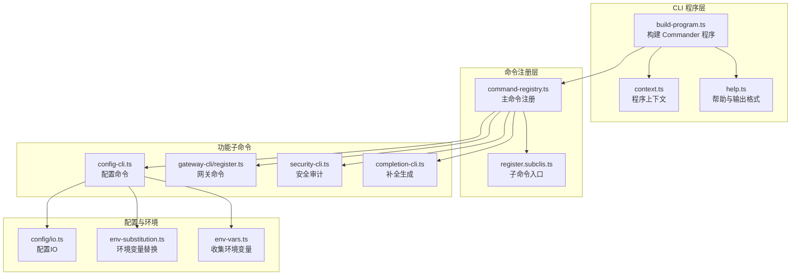
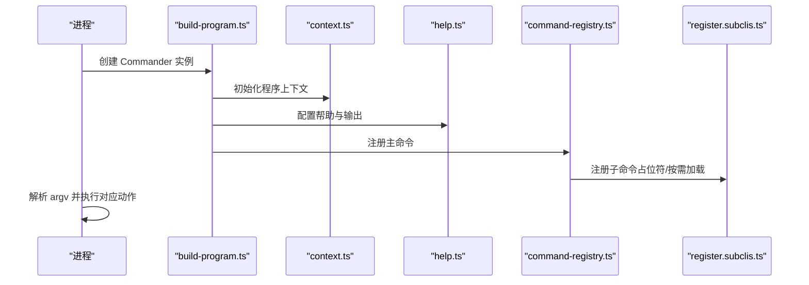
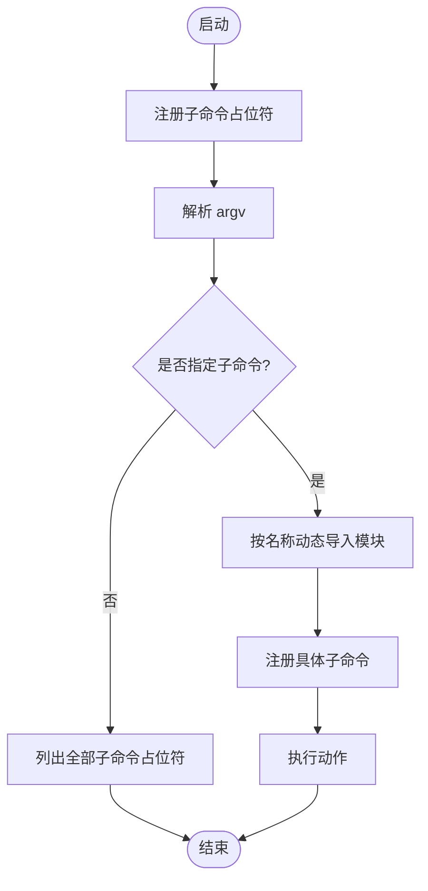
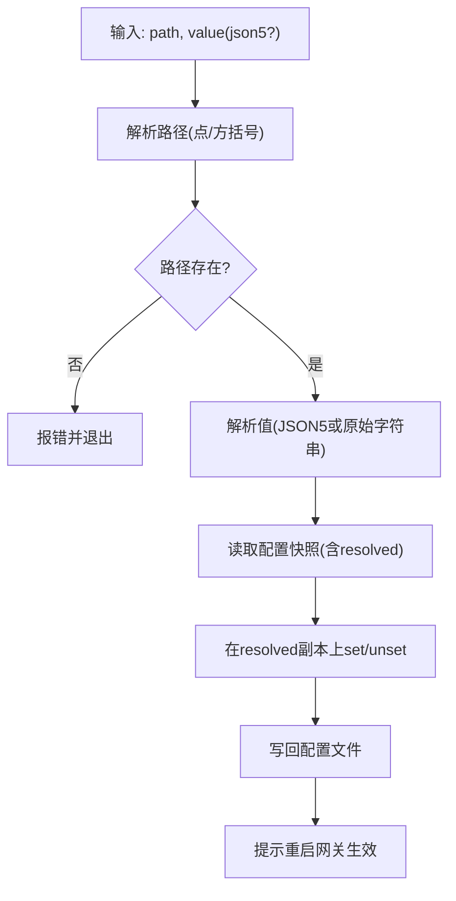
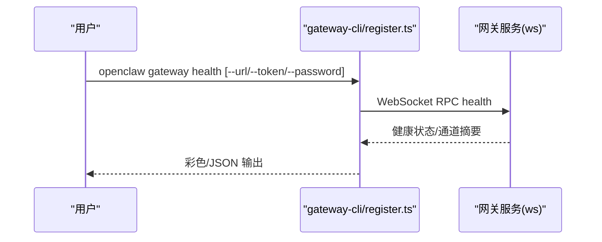
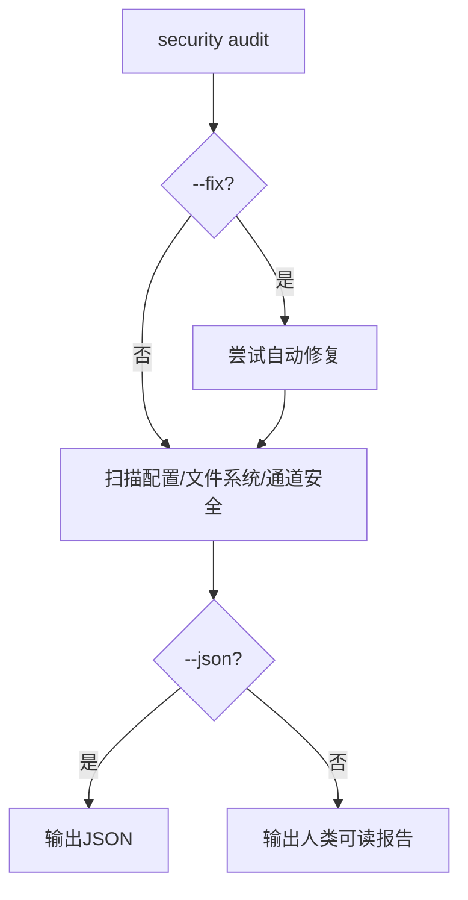
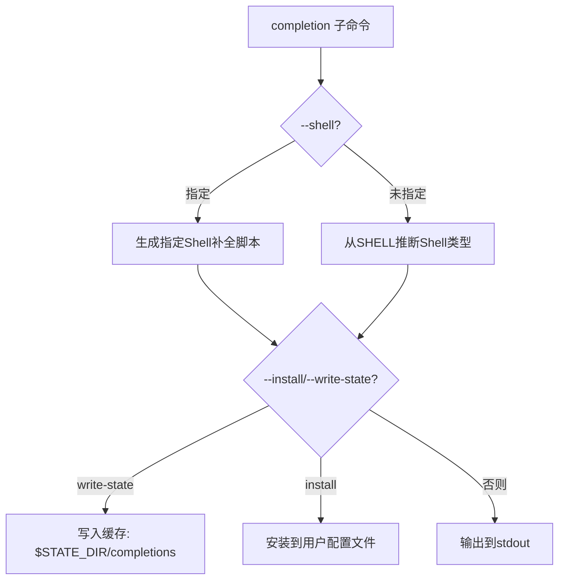
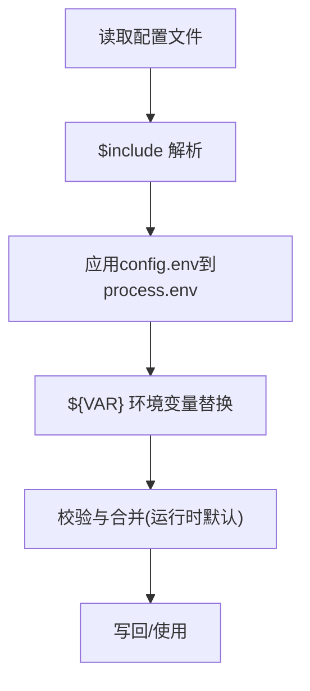
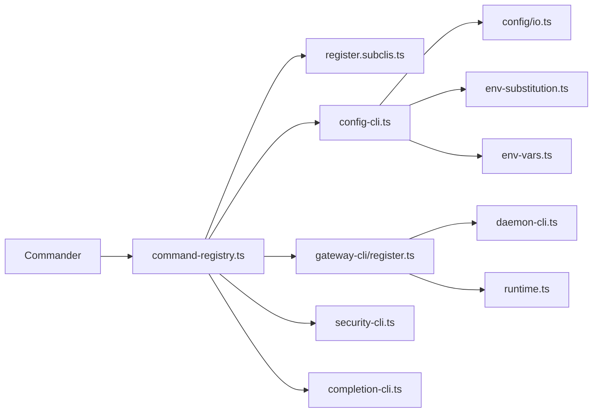

# 命令行工具

<cite>
**本文引用的文件**
- [src/cli/program/build-program.ts](file://src/cli/program/build-program.ts)
- [src/cli/program/context.ts](file://src/cli/program/context.ts)
- [src/cli/program/command-registry.ts](file://src/cli/program/command-registry.ts)
- [src/cli/program/register.subclis.ts](file://src/cli/program/register.subclis.ts)
- [src/cli/program/help.ts](file://src/cli/program/help.ts)
- [src/cli/completion-cli.ts](file://src/cli/completion-cli.ts)
- [src/cli/config-cli.ts](file://src/cli/config-cli.ts)
- [src/cli/gateway-cli/register.ts](file://src/cli/gateway-cli/register.ts)
- [src/cli/security-cli.ts](file://src/cli/security-cli.ts)
- [src/config/env-substitution.ts](file://src/config/env-substitution.ts)
- [src/config/env-vars.ts](file://src/config/env-vars.ts)
- [src/config/io.ts](file://src/config/io.ts)
- [docs/cli/index.md](file://docs/cli/index.md)
- [docs/cli/gateway.md](file://docs/cli/gateway.md)
- [docs/zh-CN/cli/gateway.md](file://docs/zh-CN/cli/gateway.md)
- [docs/zh-CN/cli/approvals.md](file://docs/zh-CN/cli/approvals.md)
- [docs/zh-CN/gateway/security/index.md](file://docs/zh-CN/gateway/security/index.md)
- [src/cli/program/register.subclis.test.ts](file://src/cli/program/register.subclis.test.ts)
</cite>

## 目录

1. [简介](#简介)
2. [项目结构](#项目结构)
3. [核心组件](#核心组件)
4. [架构总览](#架构总览)
5. [详细组件分析](#详细组件分析)
6. [依赖关系分析](#依赖关系分析)
7. [性能考量](#性能考量)
8. [故障排除指南](#故障排除指南)
9. [结论](#结论)
10. [附录](#附录)

## 简介

本文件面向 OpenClaw 命令行工具（CLI）的技术文档，系统阐述命令行接口的设计原理、常用命令详解、配置管理、补全机制、与网关服务的交互方式、安全与权限管理、以及自动化与集成方法。文档同时提供命令语法、参数、选项与返回值说明，并给出使用示例、最佳实践与排障建议。

## 项目结构

OpenClaw CLI 采用“主程序 + 子命令注册 + 配置与帮助模块”的分层组织方式：

- 程序构建与上下文：负责创建 Commander 程序、注入版本信息与全局选项、注册帮助与预动作钩子。
- 命令注册：集中注册主命令与子命令（如 gateway、config、security 等），并支持延迟加载子 CLI。
- 子命令实现：每个子命令模块独立定义其命令树、选项与动作。
- 配置与环境：支持配置文件加载、环境变量替换、Shell 环境回退与合并。
- 补全与帮助：生成多 Shell 的补全脚本、美化输出样式与示例。

图表来源

- [src/cli/program/build-program.ts](file://src/cli/program/build-program.ts#L1-L19)
- [src/cli/program/context.ts](file://src/cli/program/context.ts#L1-L20)
- [src/cli/program/help.ts](file://src/cli/program/help.ts#L1-L99)
- [src/cli/program/command-registry.ts](file://src/cli/program/command-registry.ts#L115-L188)
- [src/cli/program/register.subclis.ts](file://src/cli/program/register.subclis.ts#L34-L86)
- [src/cli/config-cli.ts](file://src/cli/config-cli.ts#L218-L351)
- [src/cli/gateway-cli/register.ts](file://src/cli/gateway-cli/register.ts#L121-L360)
- [src/cli/security-cli.ts](file://src/cli/security-cli.ts#L29-L159)
- [src/cli/completion-cli.ts](file://src/cli/completion-cli.ts#L222-L274)
- [src/config/io.ts](file://src/config/io.ts#L272-L302)
- [src/config/env-substitution.ts](file://src/config/env-substitution.ts#L1-L127)
- [src/config/env-vars.ts](file://src/config/env-vars.ts#L1-L31)

章节来源

- [src/cli/program/build-program.ts](file://src/cli/program/build-program.ts#L1-L19)
- [src/cli/program/context.ts](file://src/cli/program/context.ts#L1-L20)
- [src/cli/program/help.ts](file://src/cli/program/help.ts#L1-L99)
- [src/cli/program/command-registry.ts](file://src/cli/program/command-registry.ts#L115-L188)
- [src/cli/program/register.subclis.ts](file://src/cli/program/register.subclis.ts#L34-L86)

## 核心组件

- 程序构建器：创建 Commander 实例，注入版本、全局选项与帮助文本，注册预动作钩子与命令注册器。
- 命令注册器：集中注册主命令与路由；支持“子命令占位符”与“按需懒加载”两种模式。
- 子命令入口：定义子命令集合（如 acp、gateway、daemon、logs、system、models、approvals 等），按需动态注册。
- 配置 CLI：提供 config get/set/unset 与配置向导；路径解析支持点号与方括号；写入时使用“已解析配置”避免默认值污染。
- 网关 CLI：封装 gateway run/status/install/start/stop/restart/discover/probe/call 等能力，统一 RPC 选项与错误处理。
- 安全 CLI：提供 security audit，支持深探与自动修复；输出人类可读与 JSON。
- 补全 CLI：自动生成 zsh/bash/fish/powershell 补全脚本，支持缓存与安装到用户配置文件。
- 配置与环境：支持 $include、${VAR} 环境变量替换、Shell 环境回退、配置合并与校验。

章节来源

- [src/cli/program/build-program.ts](file://src/cli/program/build-program.ts#L1-L19)
- [src/cli/program/command-registry.ts](file://src/cli/program/command-registry.ts#L115-L188)
- [src/cli/program/register.subclis.ts](file://src/cli/program/register.subclis.ts#L223-L267)
- [src/cli/config-cli.ts](file://src/cli/config-cli.ts#L218-L351)
- [src/cli/gateway-cli/register.ts](file://src/cli/gateway-cli/register.ts#L121-L360)
- [src/cli/security-cli.ts](file://src/cli/security-cli.ts#L29-L159)
- [src/cli/completion-cli.ts](file://src/cli/completion-cli.ts#L222-L274)
- [src/config/env-substitution.ts](file://src/config/env-substitution.ts#L1-L127)
- [src/config/env-vars.ts](file://src/config/env-vars.ts#L1-L31)
- [src/config/io.ts](file://src/config/io.ts#L272-L302)

## 架构总览

CLI 的控制流从构建程序开始，经过上下文初始化、帮助与输出配置、命令注册，最终进入解析阶段。子命令通过“占位符 + 懒加载”策略减少启动开销；配置与环境变量在命令执行前完成解析与合并。

图表来源

- [src/cli/program/build-program.ts](file://src/cli/program/build-program.ts#L7-L18)
- [src/cli/program/context.ts](file://src/cli/program/context.ts#L11-L19)
- [src/cli/program/help.ts](file://src/cli/program/help.ts#L33-L98)
- [src/cli/program/command-registry.ts](file://src/cli/program/command-registry.ts#L166-L174)
- [src/cli/program/register.subclis.ts](file://src/cli/program/register.subclis.ts#L244-L267)

## 详细组件分析

### 命令注册与子命令机制

- 主命令注册：通过 command-registry.ts 统一注册 setup、onboard、configure、config、message、memory、agent、gateway、logs、system、models、memory、nodes、devices、node、approvals、browser、cron、dns、docs、hooks、webhooks、pairing、plugins、channels、security、skills、voicecall 等。
- 子命令入口：register.subclis.ts 定义子命令集合，支持按名称注册与去重；支持 completion 子命令自身不参与循环注册。
- 懒加载策略：首次解析到子命令时才动态导入对应模块，降低启动时间。

图表来源

- [src/cli/program/register.subclis.ts](file://src/cli/program/register.subclis.ts#L244-L267)
- [src/cli/program/register.subclis.test.ts](file://src/cli/program/register.subclis.test.ts#L39-L80)

章节来源

- [src/cli/program/command-registry.ts](file://src/cli/program/command-registry.ts#L115-L188)
- [src/cli/program/register.subclis.ts](file://src/cli/program/register.subclis.ts#L34-L86)
- [src/cli/program/register.subclis.ts](file://src/cli/program/register.subclis.ts#L223-L267)
- [src/cli/program/register.subclis.test.ts](file://src/cli/program/register.subclis.test.ts#L39-L80)

### 配置命令（config）

- 功能：config get/set/unset 与配置向导；支持 JSON5 值解析与路径定位（点号与方括号）。
- 写入策略：使用“已解析配置”（resolved）而非“运行时合并后的配置”，避免默认值污染写入文件。
- 错误处理：无效路径、类型不匹配、解析失败均输出错误并退出非零码。

图表来源

- [src/cli/config-cli.ts](file://src/cli/config-cli.ts#L69-L84)
- [src/cli/config-cli.ts](file://src/cli/config-cli.ts#L86-L202)
- [src/cli/config-cli.ts](file://src/cli/config-cli.ts#L204-L216)
- [src/cli/config-cli.ts](file://src/cli/config-cli.ts#L295-L320)
- [src/cli/config-cli.ts](file://src/cli/config-cli.ts#L322-L349)

章节来源

- [src/cli/config-cli.ts](file://src/cli/config-cli.ts#L218-L351)

### 网关命令（gateway）

- 子命令：run/status/install/uninstall/start/stop/restart/discover/probe/call/health/usage-cost。
- 共享选项：--url/--token/--password/--timeout/--expect-final；RPC 调用统一走 WebSocket。
- 输出风格：TTY 下彩色与进度条，--json 关闭样式；支持 OSC-8 超链接。
- 发现与探测：Bonjour 多播/单播扫描，支持 SSH 隧道探测远端网关。

图表来源

- [src/cli/gateway-cli/register.ts](file://src/cli/gateway-cli/register.ts#L147-L270)
- [docs/cli/gateway.md](file://docs/cli/gateway.md#L73-L82)
- [docs/zh-CN/cli/gateway.md](file://docs/zh-CN/cli/gateway.md#L80-L110)

章节来源

- [src/cli/gateway-cli/register.ts](file://src/cli/gateway-cli/register.ts#L121-L360)
- [docs/cli/gateway.md](file://docs/cli/gateway.md#L1-L203)
- [docs/zh-CN/cli/gateway.md](file://docs/zh-CN/cli/gateway.md#L80-L194)

### 安全审计（security audit）

- 功能：扫描配置与本地状态中的常见安全风险；支持 --deep 最大努力探测；--fix 自动收紧默认与权限修正。
- 输出：人类可读报告与 JSON；按严重级别分组展示；列出修复项与错误。

图表来源

- [src/cli/security-cli.ts](file://src/cli/security-cli.ts#L45-L157)
- [docs/zh-CN/gateway/security/index.md](file://docs/zh-CN/gateway/security/index.md#L17-L37)

章节来源

- [src/cli/security-cli.ts](file://src/cli/security-cli.ts#L29-L159)
- [docs/zh-CN/gateway/security/index.md](file://docs/zh-CN/gateway/security/index.md#L1-L157)

### 补全（completion）

- 支持 zsh/bash/fish/powershell；自动检测 SHELL 环境；生成缓存脚本与安装到用户配置文件。
- 支持写入状态目录（$OPENCLAW_STATE_DIR/completions）、安装补全、检测慢速动态模式并提示优化。
- 生成策略：递归遍历完整命令树，生成各 Shell 的 \_arguments/\_compdef/complete 函数或 Register-ArgumentCompleter。

图表来源

- [src/cli/completion-cli.ts](file://src/cli/completion-cli.ts#L16-L32)
- [src/cli/completion-cli.ts](file://src/cli/completion-cli.ts#L222-L274)
- [src/cli/completion-cli.ts](file://src/cli/completion-cli.ts#L276-L350)

章节来源

- [src/cli/completion-cli.ts](file://src/cli/completion-cli.ts#L1-L649)

### 配置与环境变量

- 环境变量替换：支持 ${VAR_NAME} 语法，大小写限制与转义规则；缺失变量抛出异常并携带配置路径。
- Shell 环境回退：在特定条件下回退到 Shell 环境变量，支持超时与预期键过滤。
- 配置合并：先解析 $include，再应用 config.env 到 process.env，最后进行 ${VAR} 替换。

图表来源

- [src/config/io.ts](file://src/config/io.ts#L272-L302)
- [src/config/env-substitution.ts](file://src/config/env-substitution.ts#L39-L127)
- [src/config/env-vars.ts](file://src/config/env-vars.ts#L3-L31)

章节来源

- [src/config/env-substitution.ts](file://src/config/env-substitution.ts#L1-L127)
- [src/config/env-vars.ts](file://src/config/env-vars.ts#L1-L31)
- [src/config/io.ts](file://src/config/io.ts#L272-L302)

## 依赖关系分析

- 组件耦合：命令注册器与子命令入口解耦；子命令模块通过动态导入实现弱耦合。
- 外部依赖：Commander 作为命令解析库；Node FS/Path/Os 用于补全缓存与安装；终端主题与链接格式化用于输出美化。
- 配置依赖：config-cli 依赖 config/io.ts 与 env-substitution.ts；gateway-cli 依赖 daemon-cli 与运行时包装。

图表来源

- [src/cli/program/command-registry.ts](file://src/cli/program/command-registry.ts#L115-L188)
- [src/cli/program/register.subclis.ts](file://src/cli/program/register.subclis.ts#L34-L86)
- [src/cli/config-cli.ts](file://src/cli/config-cli.ts#L1-L10)
- [src/cli/gateway-cli/register.ts](file://src/cli/gateway-cli/register.ts#L1-L31)
- [src/cli/security-cli.ts](file://src/cli/security-cli.ts#L1-L10)
- [src/cli/completion-cli.ts](file://src/cli/completion-cli.ts#L1-L10)
- [src/config/io.ts](file://src/config/io.ts#L272-L302)
- [src/config/env-substitution.ts](file://src/config/env-substitution.ts#L1-L127)
- [src/config/env-vars.ts](file://src/config/env-vars.ts#L1-L31)

章节来源

- [src/cli/program/command-registry.ts](file://src/cli/program/command-registry.ts#L115-L188)
- [src/cli/program/register.subclis.ts](file://src/cli/program/register.subclis.ts#L34-L86)

## 性能考量

- 启动性能：通过“子命令占位符 + 懒加载”减少初始模块加载；仅在解析到具体子命令时才导入对应模块。
- I/O 与网络：配置加载与环境变量替换在命令执行前完成；网关 RPC 调用支持超时与 JSON 输出，便于脚本化。
- 输出渲染：TTY 下启用 ANSI 与进度指示；非 TTY 下降级为纯文本；--json 与 --no-color 可切换输出风格。

[本节为通用指导，无需特定文件引用]

## 故障排除指南

- 配置无效：config get 报告无效路径或类型不匹配；建议运行 doctor 修复后重试。
- 网关不可达：使用 gateway probe 与 gateway discover；结合 --ssh 与 SSH 身份文件探测远端网关。
- 安全问题：运行 security audit --deep 与 --fix；收紧通道策略、日志脱敏与文件权限。
- 补全问题：使用 completion --write-state 生成缓存；completion --install 安装到用户配置；检测慢速动态模式并改用缓存脚本。
- 环境变量缺失：环境变量替换抛出 MissingEnvVarError，检查配置路径与变量名大小写。

章节来源

- [src/cli/config-cli.ts](file://src/cli/config-cli.ts#L204-L216)
- [src/cli/gateway-cli/register.ts](file://src/cli/gateway-cli/register.ts#L283-L358)
- [src/cli/security-cli.ts](file://src/cli/security-cli.ts#L45-L157)
- [src/cli/completion-cli.ts](file://src/cli/completion-cli.ts#L276-L350)
- [src/config/env-substitution.ts](file://src/config/env-substitution.ts#L29-L37)

## 结论

OpenClaw CLI 通过模块化与懒加载实现高性能启动，通过统一的命令注册与帮助系统提供一致的用户体验。配置与环境变量处理确保灵活性与安全性；网关命令提供强大的 RPC 能力与可观测性；安全审计与补全工具进一步完善运维体验。建议在生产环境中配合安全审计与严格的通道策略使用。

[本节为总结性内容，无需特定文件引用]

## 附录

### 常用命令与选项速查

- 全局选项
  - --dev：隔离状态至 ~/.openclaw-dev，调整默认端口。
  - --profile <name>：命名配置文件集，隔离状态目录。
  - --no-color / NO_COLOR=1：禁用 ANSI 颜色。
  - -V/--version/-v：打印版本并退出。
- 输出风格
  - TTY：ANSI 颜色、进度指示、OSC-8 超链接。
  - --json：机器可读 JSON（关闭样式/旋转器）。
  - --no-color：禁用 ANSI，保留人类布局。

章节来源

- [docs/cli/index.md](file://docs/cli/index.md#L55-L84)
- [src/cli/program/help.ts](file://src/cli/program/help.ts#L47-L67)

### 网关命令参考

- openclaw gateway run：前台运行网关进程。
- openclaw gateway status：显示服务状态并可选 RPC 探测。
- openclaw gateway install/uninstall/start/stop/restart：服务生命周期管理。
- openclaw gateway discover：Bonjour 发现网关。
- openclaw gateway probe：综合探测（本地+远程）。
- openclaw gateway call <method> [--params <json>]：低层 RPC 调用。
- openclaw gateway health：健康检查。
- openclaw gateway usage-cost [--days <n>]：会话成本统计。

章节来源

- [docs/cli/gateway.md](file://docs/cli/gateway.md#L22-L203)
- [docs/zh-CN/cli/gateway.md](file://docs/zh-CN/cli/gateway.md#L80-L194)
- [src/cli/gateway-cli/register.ts](file://src/cli/gateway-cli/register.ts#L147-L358)

### 配置命令参考

- openclaw config：无子命令时启动配置向导。
- openclaw config get <path> [--json]：按路径获取值。
- openclaw config set <path> <value> [--json]：设置值（JSON5 或原始字符串）。
- openclaw config unset <path>：移除值。

章节来源

- [docs/cli/index.md](file://docs/cli/index.md#L349-L360)
- [src/cli/config-cli.ts](file://src/cli/config-cli.ts#L258-L349)

### 安全审计参考

- openclaw security audit [--deep] [--fix] [--json]：扫描并可选修复安全风险。

章节来源

- [docs/cli/index.md](file://docs/cli/index.md#L242-L247)
- [src/cli/security-cli.ts](file://src/cli/security-cli.ts#L45-L157)

### 补全参考

- openclaw completion [-s, --shell <shell>] [-i, --install] [--write-state] [-y, --yes]：生成/安装/写入补全脚本。

章节来源

- [src/cli/completion-cli.ts](file://src/cli/completion-cli.ts#L222-L274)
- [src/cli/completion-cli.ts](file://src/cli/completion-cli.ts#L276-L350)

### 执行审批参考

- openclaw approvals get [--gateway|--node <id|name|ip>]：查看审批。
- openclaw approvals set --file <path> [--gateway|--node <id|name|ip>]：从文件替换审批。
- openclaw approvals allowlist add/remove <pattern> [--agent <id>] [--gateway|--node <id|name|ip>]：管理允许列表。

章节来源

- [docs/zh-CN/cli/approvals.md](file://docs/zh-CN/cli/approvals.md#L16-L57)

### 使用示例与自动化

- 非交互引导：onboard --non-interactive 与 --auth-choice 系列参数组合。
- 网关运行：openclaw gateway 与 openclaw --dev gateway。
- RPC 调用：openclaw gateway call status / logs.tail。
- 日志与诊断：openclaw logs --follow / --json；openclaw doctor。

章节来源

- [docs/start/wizard-cli-automation.md](file://docs/start/wizard-cli-automation.md#L34-L122)
- [docs/cli/index.md](file://docs/cli/index.md#L701-L720)
