# 实用工具命令

<cite>
**本文引用的文件**
- [docs/cli/index.md](file://docs/cli/index.md)
- [docs/cli/models.md](file://docs/cli/models.md)
- [docs/cli/skills.md](file://docs/cli/skills.md)
- [docs/cli/plugins.md](file://docs/cli/plugins.md)
- [docs/cli/directory.md](file://docs/cli/directory.md)
- [docs/cli/browser.md](file://docs/cli/browser.md)
- [docs/cli/dns.md](file://docs/cli/dns.md)
- [docs/cli/doctor.md](file://docs/cli/doctor.md)
- [docs/cli/configure.md](file://docs/cli/configure.md)
- [docs/cli/setup.md](file://docs/cli/setup.md)
- [docs/cli/onboard.md](file://docs/cli/onboard.md)
- [docs/cli/reset.md](file://docs/cli/reset.md)
- [docs/cli/update.md](file://docs/cli/update.md)
- [docs/cli/uninstall.md](file://docs/cli/uninstall.md)
- [docs/cli/system.md](file://docs/cli/system.md)
- [docs/cli/memory.md](file://docs/cli/memory.md)
</cite>

## 目录

1. [简介](#简介)
2. [项目结构](#项目结构)
3. [核心组件](#核心组件)
4. [架构总览](#架构总览)
5. [详细组件分析](#详细组件分析)
6. [依赖分析](#依赖分析)
7. [性能考虑](#性能考虑)
8. [故障排查指南](#故障排查指南)
9. [结论](#结论)
10. [附录](#附录)

## 简介

本文件面向OpenClaw实用工具命令（openclaw CLI）的使用者与维护者，系统化梳理以下主题：

- 模型管理：默认模型设置、别名与回退策略、认证配置与探测
- 技能配置：技能清单、详情与就绪检查
- 插件安装与管理：安装、启用/禁用、卸载、更新与诊断
- 目录浏览：通道联系人/群组/自我的查找与ID格式
- 浏览器控制：配置文件、标签页、截图/快照、动作与扩展中继
- DNS查询：广域发现DNS辅助（Tailscale + CoreDNS）
- 工具链管理与环境检测：doctor、update、system事件与心跳、presence
- 兼容性验证：模型认证探测、通道健康检查
- 自动化脚本与批处理：非交互式参数、JSON输出、定时任务
- 集成接口：Gateway RPC调用、钩子与Webhook
- 权限管理与版本控制：安全审计、重置与卸载、通道登录/登出
- 依赖解析：插件清单校验、内存索引与搜索

## 项目结构

OpenClaw CLI参考文档集中于docs/cli目录，按功能模块组织命令说明；同时在docs/concepts、docs/tools等目录提供概念与工具链支撑。

```mermaid
graph TB
A["CLI 参考总览<br/>docs/cli/index.md"] --> B["模型管理<br/>docs/cli/models.md"]
A --> C["技能配置<br/>docs/cli/skills.md"]
A --> D["插件管理<br/>docs/cli/plugins.md"]
A --> E["目录浏览<br/>docs/cli/directory.md"]
A --> F["浏览器控制<br/>docs/cli/browser.md"]
A --> G["DNS 查询<br/>docs/cli/dns.md"]
A --> H["环境检测/修复<br/>docs/cli/doctor.md"]
A --> I["配置向导<br/>docs/cli/configure.md"]
A --> J["初始化设置<br/>docs/cli/setup.md"]
A --> K["引导向导<br/>docs/cli/onboard.md"]
A --> L["重置本地状态<br/>docs/cli/reset.md"]
A --> M["更新工具链<br/>docs/cli/update.md"]
A --> N["卸载服务与数据<br/>docs/cli/uninstall.md"]
A --> O["系统事件/心跳/在线态<br/>docs/cli/system.md"]
A --> P["语义记忆管理<br/>docs/cli/memory.md"]
```

图表来源

- [docs/cli/index.md](file://docs/cli/index.md#L1-L240)
- [docs/cli/models.md](file://docs/cli/models.md#L1-L80)
- [docs/cli/skills.md](file://docs/cli/skills.md#L1-L27)
- [docs/cli/plugins.md](file://docs/cli/plugins.md#L1-L82)
- [docs/cli/directory.md](file://docs/cli/directory.md#L1-L64)
- [docs/cli/browser.md](file://docs/cli/browser.md#L1-L108)
- [docs/cli/dns.md](file://docs/cli/dns.md#L1-L24)
- [docs/cli/doctor.md](file://docs/cli/doctor.md#L1-L42)
- [docs/cli/configure.md](file://docs/cli/configure.md#L1-L34)
- [docs/cli/setup.md](file://docs/cli/setup.md#L1-L30)
- [docs/cli/onboard.md](file://docs/cli/onboard.md#L1-L77)
- [docs/cli/reset.md](file://docs/cli/reset.md#L1-L18)
- [docs/cli/update.md](file://docs/cli/update.md#L1-L99)
- [docs/cli/uninstall.md](file://docs/cli/uninstall.md#L1-L18)
- [docs/cli/system.md](file://docs/cli/system.md#L1-L61)
- [docs/cli/memory.md](file://docs/cli/memory.md#L1-L46)

章节来源

- [docs/cli/index.md](file://docs/cli/index.md#L1-L240)

## 核心组件

- 模型管理：提供模型扫描、状态查看、默认模型设置、图像模型设置、别名与回退策略、认证配置与实时探测
- 技能配置：列出可用技能、查看技能详情、检查就绪条件与缺失依赖
- 插件管理：安装/卸载、启用/禁用、更新、诊断加载错误
- 目录浏览：通道联系人/群组/“我”的ID查询，支持JSON输出便于脚本化
- 浏览器控制：配置文件、标签页、截图/快照、导航/点击/输入等动作，支持Chrome扩展中继与远程节点代理
- DNS查询：广域发现DNS辅助，当前聚焦macOS + Homebrew CoreDNS
- 环境检测与修复：doctor健康检查与快速修复，支持深度扫描与自动修复
- 工具链管理：update切换渠道、查看状态、向导流程、Git工作流与重启策略
- 系统事件：system事件入队、心跳启停、presence查看
- 语义记忆：memory状态、索引重建、语义检索

章节来源

- [docs/cli/models.md](file://docs/cli/models.md#L1-L80)
- [docs/cli/skills.md](file://docs/cli/skills.md#L1-L27)
- [docs/cli/plugins.md](file://docs/cli/plugins.md#L1-L82)
- [docs/cli/directory.md](file://docs/cli/directory.md#L1-L64)
- [docs/cli/browser.md](file://docs/cli/browser.md#L1-L108)
- [docs/cli/dns.md](file://docs/cli/dns.md#L1-L24)
- [docs/cli/doctor.md](file://docs/cli/doctor.md#L1-L42)
- [docs/cli/update.md](file://docs/cli/update.md#L1-L99)
- [docs/cli/system.md](file://docs/cli/system.md#L1-L61)
- [docs/cli/memory.md](file://docs/cli/memory.md#L1-L46)

## 架构总览

下图展示CLI各命令与核心子系统的交互关系，体现从用户到Gateway、通道、插件与外部Provider的调用路径。

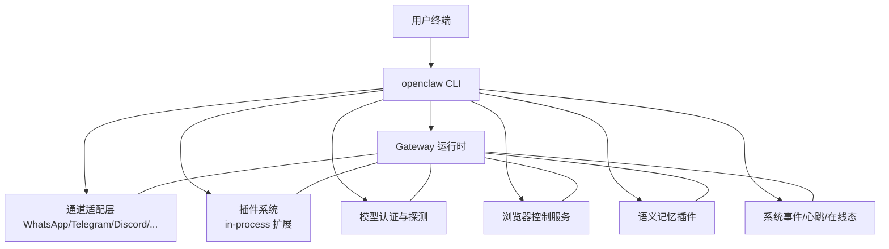

图表来源

- [docs/cli/index.md](file://docs/cli/index.md#L86-L240)
- [docs/cli/models.md](file://docs/cli/models.md#L1-L80)
- [docs/cli/plugins.md](file://docs/cli/plugins.md#L1-L82)
- [docs/cli/browser.md](file://docs/cli/browser.md#L1-L108)
- [docs/cli/memory.md](file://docs/cli/memory.md#L1-L46)
- [docs/cli/system.md](file://docs/cli/system.md#L1-L61)

## 详细组件分析

### 模型管理（models）

- 常用命令
  - 查看状态与认证概览：openclaw models status
  - 列出可用模型：openclaw models list
  - 设置默认主模型：openclaw models set <model或别名>
  - 设置图像模型：openclaw models set-image <model>
  - 扫描可用模型与Provider：openclaw models scan
  - 别名与回退：openclaw models aliases list / add / remove；fallbacks list / add / remove / clear
  - 认证配置：openclaw models auth add / login --provider <id> / setup-token / paste-token / auth order get / set / clear
- 关键行为
  - 支持对已配置认证档案进行实时探测（可能消耗Token并触发限流）
  - 默认模型设置支持别名与Provider前缀解析
  - Agent维度可选，未指定时使用默认Agent或环境变量指向的Agent目录
- 使用建议
  - 在批量部署中优先使用非交互式参数与--json输出
  - 对外部Provider进行认证探测前评估成本与限流风险

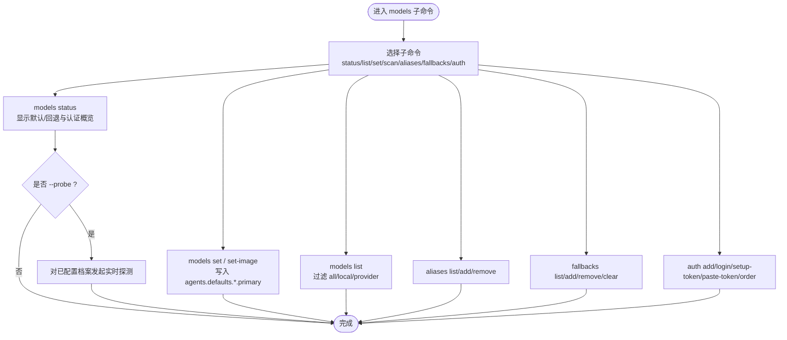

图表来源

- [docs/cli/models.md](file://docs/cli/models.md#L1-L80)
- [docs/cli/index.md](file://docs/cli/index.md#L153-L164)

章节来源

- [docs/cli/models.md](file://docs/cli/models.md#L1-L80)
- [docs/cli/index.md](file://docs/cli/index.md#L153-L164)

### 技能配置（skills）

- 常用命令
  - 列出技能：openclaw skills list
  - 查看技能详情：openclaw skills info <name>
  - 检查就绪情况：openclaw skills check
  - 仅显示就绪技能：openclaw skills list --eligible
- 行为说明
  - 展示内置、工作区与受管覆盖的技能集合
  - 就绪检查会指出缺失的二进制/环境/配置项
- 使用建议
  - 结合--json与--verbose进行自动化巡检
  - 使用npx clawhub进行技能搜索、安装与同步

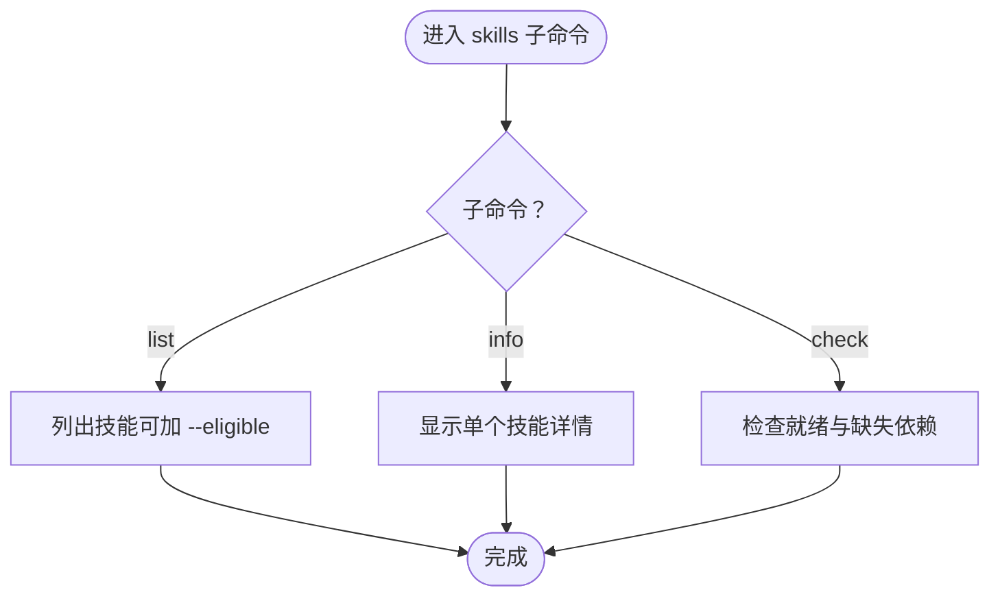

图表来源

- [docs/cli/skills.md](file://docs/cli/skills.md#L1-L27)
- [docs/cli/index.md](file://docs/cli/index.md#L428-L444)

章节来源

- [docs/cli/skills.md](file://docs/cli/skills.md#L1-L27)
- [docs/cli/index.md](file://docs/cli/index.md#L428-L444)

### 插件安装与管理（plugins）

- 常用命令
  - 列出插件：openclaw plugins list
  - 查看详情：openclaw plugins info <id>
  - 安装：openclaw plugins install <path|archive|npm-spec>（支持--link链接目录）
  - 启用/禁用：openclaw plugins enable <id> / disable <id>
  - 卸载：openclaw plugins uninstall <id>（支持--dry-run/--keep-files）
  - 更新：openclaw plugins update <id> / --all
  - 诊断：openclaw plugins doctor
- 安全与清单
  - 插件需提供openclaw.plugin.json内联JSON Schema（configSchema），缺失或无效将阻止加载
  - 建议固定版本，避免运行未知代码
- 使用建议
  - 大多数插件变更需要重启Gateway
  - 使用--json便于脚本化与CI集成

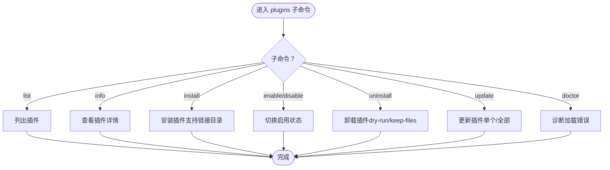

图表来源

- [docs/cli/plugins.md](file://docs/cli/plugins.md#L1-L82)
- [docs/cli/index.md](file://docs/cli/index.md#L115-L122)

章节来源

- [docs/cli/plugins.md](file://docs/cli/plugins.md#L1-L82)
- [docs/cli/index.md](file://docs/cli/index.md#L115-L122)

### 目录浏览（directory）

- 常用命令
  - 自己（me）：openclaw directory self --channel <id>
  - 联系人/用户：openclaw directory peers list [--query] [--limit]
  - 群组：openclaw directory groups list [--query]；成员：openclaw directory groups members --group-id <id>
- 输出与ID格式
  - 默认输出为Tab分隔的id/name；使用--json便于脚本化
  - 不同通道的ID格式不同（如WhatsApp、Telegram、Slack、Discord、Matrix、Teams、Zalo等）
- 使用建议
  - 将查询结果粘贴至openclaw message send --target以定向发送消息

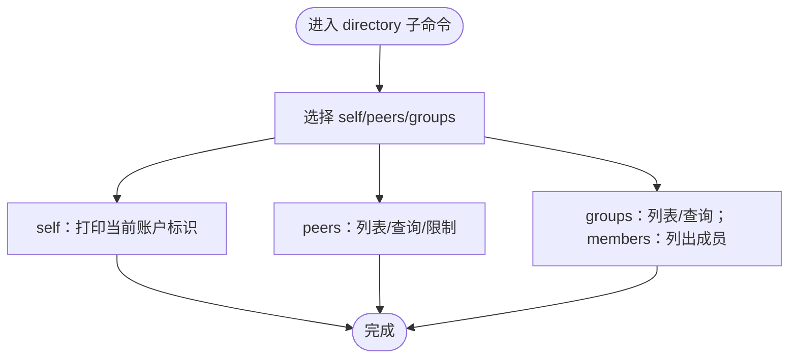

图表来源

- [docs/cli/directory.md](file://docs/cli/directory.md#L1-L64)
- [docs/cli/index.md](file://docs/cli/index.md#L103-L108)

章节来源

- [docs/cli/directory.md](file://docs/cli/directory.md#L1-L64)
- [docs/cli/index.md](file://docs/cli/index.md#L103-L108)

### 浏览器控制（browser）

- 常用命令
  - 配置文件：openclaw browser profiles；创建/删除：create-profile / delete-profile
  - 标签页：openclaw browser tabs；打开/聚焦/关闭：open / focus / close
  - 截图/快照：openclaw browser screenshot；openclaw browser snapshot
  - 导航/点击/输入：navigate / click / type
  - Chrome扩展中继：安装与路径查询
  - 远程控制：通过节点主机代理（gateway.nodes.browser.mode与node绑定）
- 行为说明
  - 支持--url/--token/--timeout/--browser-profile/--json等通用标志
  - 两种模式：OpenClaw托管实例与Chrome扩展中继
- 使用建议
  - 远程场景建议结合Tailscale与安全策略
  - 使用--json便于自动化流水线

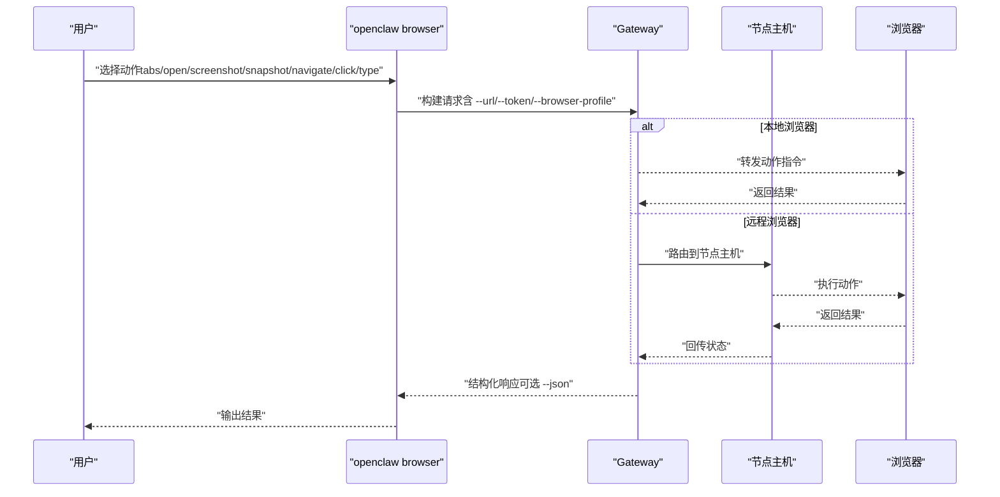

图表来源

- [docs/cli/browser.md](file://docs/cli/browser.md#L1-L108)
- [docs/cli/index.md](file://docs/cli/index.md#L192-L221)

章节来源

- [docs/cli/browser.md](file://docs/cli/browser.md#L1-L108)
- [docs/cli/index.md](file://docs/cli/index.md#L192-L221)

### DNS查询（dns）

- 常用命令
  - 广域发现DNS辅助：openclaw dns setup；带--apply可安装/更新CoreDNS配置（需sudo；macOS）
- 行为说明
  - 当前聚焦macOS + Homebrew CoreDNS
  - 与Gateway发现与配置相关

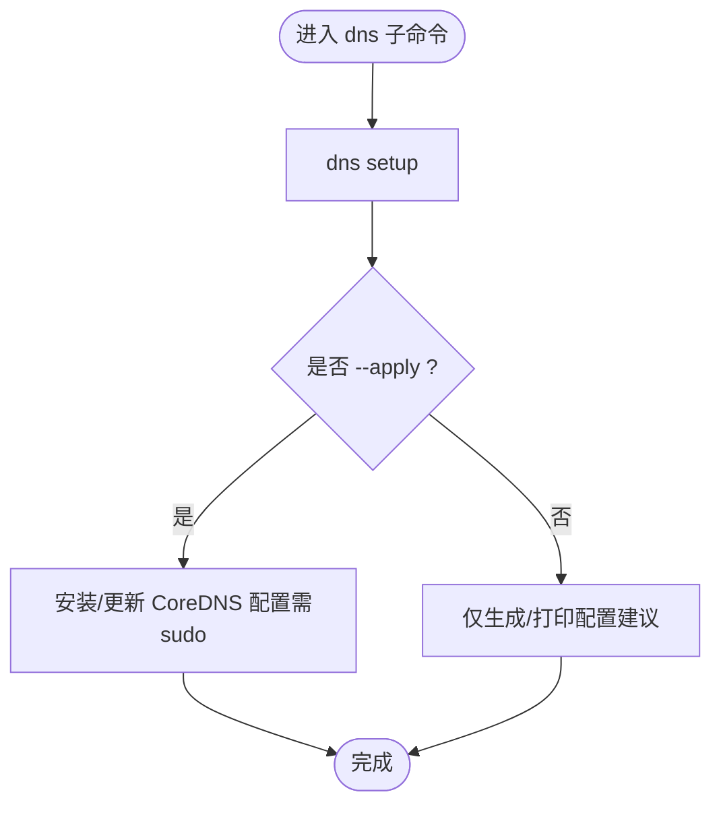

图表来源

- [docs/cli/dns.md](file://docs/cli/dns.md#L1-L24)
- [docs/cli/index.md](file://docs/cli/index.md#L235-L236)

章节来源

- [docs/cli/dns.md](file://docs/cli/dns.md#L1-L24)
- [docs/cli/index.md](file://docs/cli/index.md#L235-L236)

### 环境检测与修复（doctor）

- 常用命令
  - openclaw doctor（支持--repair/--deep/--fix等）
- 行为说明
  - 交互式提示仅在TTY且非--non-interactive时出现
  - --fix会备份配置并移除未知键，逐项列出清理项
  - macOS场景可检查launchctl环境变量覆盖导致的认证问题

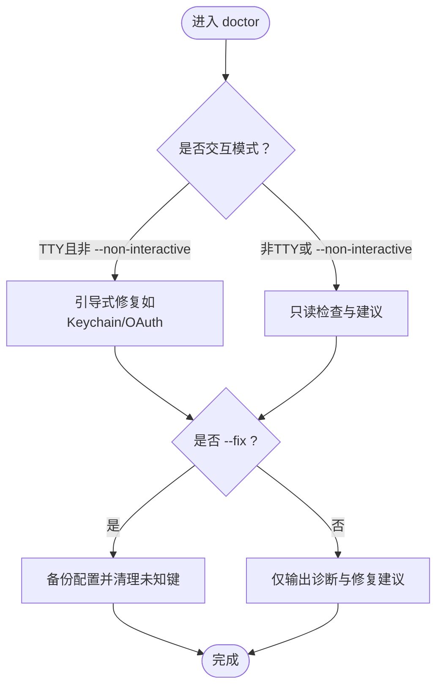

图表来源

- [docs/cli/doctor.md](file://docs/cli/doctor.md#L1-L42)
- [docs/cli/index.md](file://docs/cli/index.md#L360-L370)

章节来源

- [docs/cli/doctor.md](file://docs/cli/doctor.md#L1-L42)
- [docs/cli/index.md](file://docs/cli/index.md#L360-L370)

### 初始化与配置（setup/configure/onboard）

- 初始化设置：openclaw setup（可指定--workspace与--wizard）
- 配置向导：openclaw configure（交互式设置凭证、设备、代理默认值）
- 引导向导：openclaw onboard（本地/远程Gateway、通道与技能的引导式设置）
- 行为说明
  - configure与config无子命令等价
  - onboard支持非交互式自定义Provider与端到端自动化

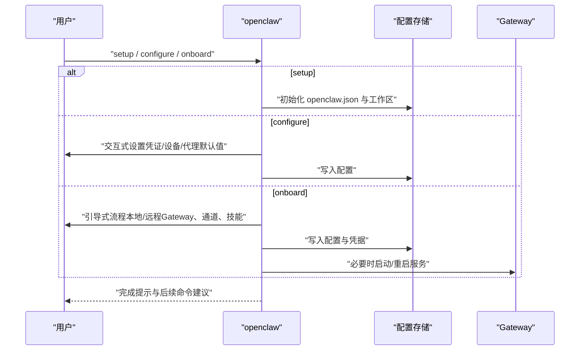

图表来源

- [docs/cli/setup.md](file://docs/cli/setup.md#L1-L30)
- [docs/cli/configure.md](file://docs/cli/configure.md#L1-L34)
- [docs/cli/onboard.md](file://docs/cli/onboard.md#L1-L77)
- [docs/cli/index.md](file://docs/cli/index.md#L280-L344)

章节来源

- [docs/cli/setup.md](file://docs/cli/setup.md#L1-L30)
- [docs/cli/configure.md](file://docs/cli/configure.md#L1-L34)
- [docs/cli/onboard.md](file://docs/cli/onboard.md#L1-L77)
- [docs/cli/index.md](file://docs/cli/index.md#L280-L344)

### 重置与卸载（reset/uninstall）

- 重置：openclaw reset（可dry-run、scope选择、非交互）
- 卸载：openclaw uninstall（可dry-run、scope选择、保留CLI）

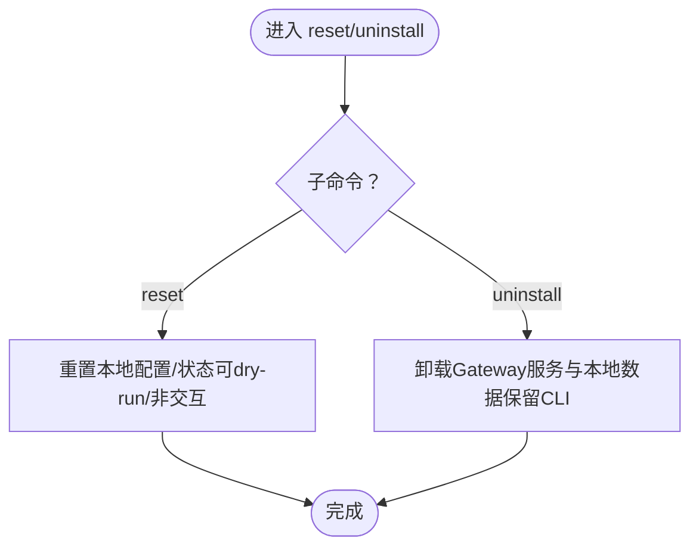

图表来源

- [docs/cli/reset.md](file://docs/cli/reset.md#L1-L18)
- [docs/cli/uninstall.md](file://docs/cli/uninstall.md#L1-L18)
- [docs/cli/index.md](file://docs/cli/index.md#L618-L651)

章节来源

- [docs/cli/reset.md](file://docs/cli/reset.md#L1-L18)
- [docs/cli/uninstall.md](file://docs/cli/uninstall.md#L1-L18)
- [docs/cli/index.md](file://docs/cli/index.md#L618-L651)

### 工具链管理与更新（update）

- 常用命令
  - openclaw update（切换渠道、查看状态、向导、非交互更新）
  - update status：查看当前渠道与可用更新
  - update wizard：交互式选择渠道与重启策略
- 行为说明
  - dev通道确保Git检出并从该仓库安装全局CLI
  - stable/beta通道通过npm使用匹配dist-tag安装
  - 支持--no-restart、--channel、--tag、--json、--timeout

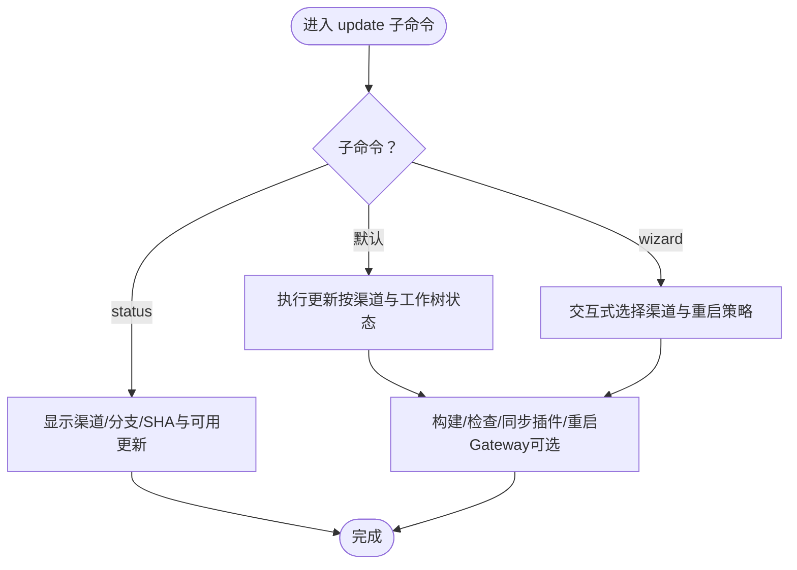

图表来源

- [docs/cli/update.md](file://docs/cli/update.md#L1-L99)
- [docs/cli/index.md](file://docs/cli/index.md#L10-L11)

章节来源

- [docs/cli/update.md](file://docs/cli/update.md#L1-L99)
- [docs/cli/index.md](file://docs/cli/index.md#L10-L11)

### 系统事件/心跳/在线态（system）

- 常用命令
  - system event：入队系统事件（now/next-heartbeat）
  - system heartbeat：last / enable / disable
  - system presence：查看Gateway已知的系统存在条目
- 行为说明
  - system event为临时性，不跨重启持久化
  - 需要可达的Gateway（本地或远程）

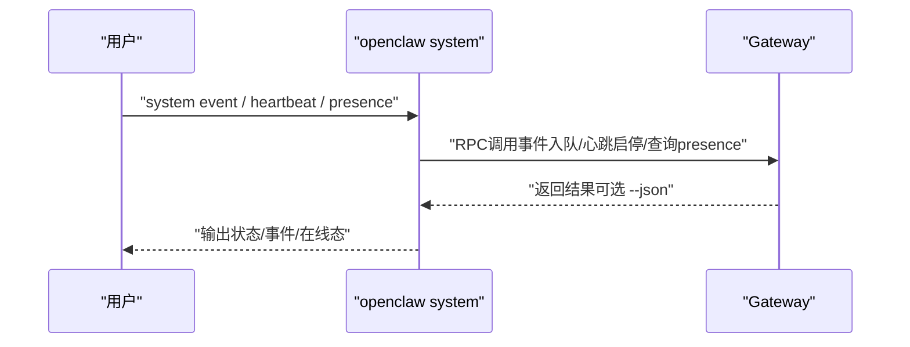

图表来源

- [docs/cli/system.md](file://docs/cli/system.md#L1-L61)
- [docs/cli/index.md](file://docs/cli/index.md#L150-L152)

章节来源

- [docs/cli/system.md](file://docs/cli/system.md#L1-L61)
- [docs/cli/index.md](file://docs/cli/index.md#L150-L152)

### 语义记忆管理（memory）

- 常用命令
  - memory status：查看索引统计（支持--deep/--index/--verbose）
  - memory index：重建索引（支持--agent/--verbose）
  - memory search "<query>"：对MEMORY.md与memory/\*.md进行语义检索
- 行为说明
  - 默认由memory-core插件提供；可通过配置禁用或替换
  - --deep会探测向量/嵌入可用性；--index会在脏状态下触发重建

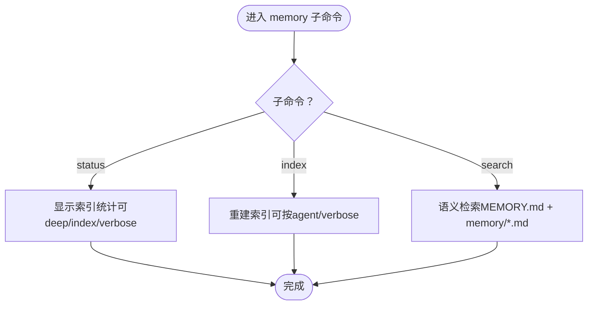

图表来源

- [docs/cli/memory.md](file://docs/cli/memory.md#L1-L46)
- [docs/cli/index.md](file://docs/cli/index.md#L122-L126)

章节来源

- [docs/cli/memory.md](file://docs/cli/memory.md#L1-L46)
- [docs/cli/index.md](file://docs/cli/index.md#L122-L126)

## 依赖分析

- 组件耦合
  - CLI通过Gateway RPC与运行时交互，Gateway再与通道、插件、Provider、浏览器与内存插件协作
  - doctor与update等工具链命令依赖Gateway状态与配置一致性
- 外部依赖
  - 模型Provider（Anthropic、OpenAI、Gemini等）认证与探测
  - 通道生态（WhatsApp/Telegram/Discord/Slack/Microsoft Teams等）登录/登出
  - 浏览器控制依赖Chrome扩展中继或节点主机代理
  - DNS广域发现依赖CoreDNS与Tailscale
- 循环依赖
  - 命令间无直接循环依赖；插件加载失败会影响相关子命令可用性

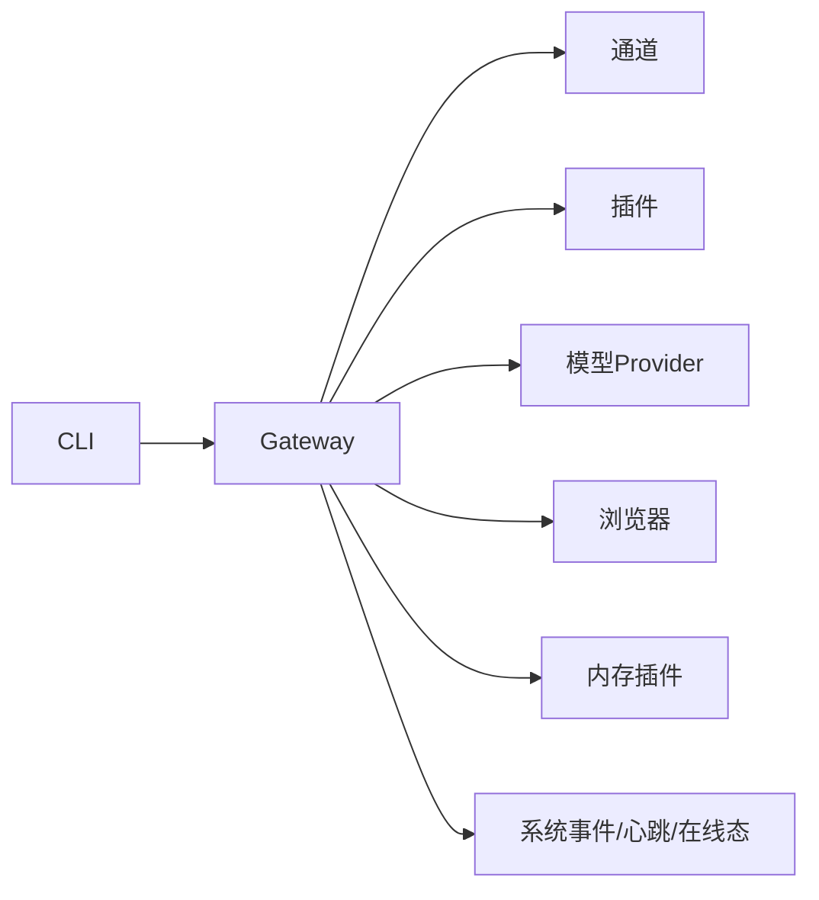

图表来源

- [docs/cli/index.md](file://docs/cli/index.md#L86-L240)

章节来源

- [docs/cli/index.md](file://docs/cli/index.md#L86-L240)

## 性能考虑

- 模型认证探测可能产生真实请求，注意Token消耗与限流
- memory index与search在大体量文档上耗时较长，建议在非高峰时段执行
- browser动作（截图/快照/导航）在远程节点代理场景下受网络延迟影响
- doctor与update的Git工作流在dev通道下可能进行预检与构建，首次执行时间较长

## 故障排查指南

- doctor
  - 交互式修复仅在TTY且非--non-interactive时出现
  - --fix会备份并清理未知配置键，逐项列出移除项
  - macOS场景检查launchctl环境变量覆盖导致的认证问题
- update
  - dev通道要求干净工作树；downgrade需确认
  - --timeout可调整步骤超时；--json便于CI日志解析
- system
  - 需要可达的Gateway；system event为临时性，不跨重启持久化
- memory
  - --deep与--index组合可在脏状态触发重建
- browser
  - 远程场景结合Tailscale与安全策略；--json便于自动化
- dns
  - --apply需sudo；macOS + Homebrew CoreDNS

章节来源

- [docs/cli/doctor.md](file://docs/cli/doctor.md#L1-L42)
- [docs/cli/update.md](file://docs/cli/update.md#L1-L99)
- [docs/cli/system.md](file://docs/cli/system.md#L1-L61)
- [docs/cli/memory.md](file://docs/cli/memory.md#L1-L46)
- [docs/cli/browser.md](file://docs/cli/browser.md#L1-L108)
- [docs/cli/dns.md](file://docs/cli/dns.md#L1-L24)

## 结论

OpenClaw CLI围绕Gateway构建了完整的工具链：从模型与技能配置、插件管理，到通道与浏览器控制、DNS发现与系统事件，形成覆盖开发、运维与自动化的一体化能力。通过非交互式参数、JSON输出与RPC调用，CLI既适合交互式使用也适合CI/CD流水线集成。建议在生产环境中配合doctor与update进行定期健康检查与安全更新，并遵循插件清单与安全策略。

## 附录

- 常用快捷方式
  - openclaw --update 等价于 openclaw update（适用于脚本与启动器）
- 最佳实践
  - 使用--json与--plain进行机器可读输出
  - 在非交互场景明确指定--non-interactive与必要参数
  - 对高风险操作（如--fix、--apply、--uninstall）先--dry-run
  - 结合channels status与gateway status进行端到端健康检查
