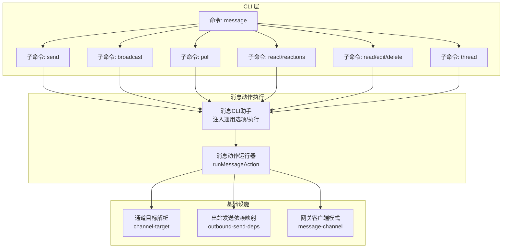
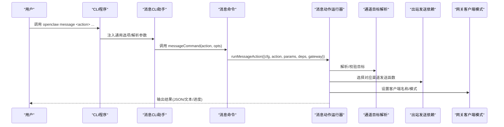
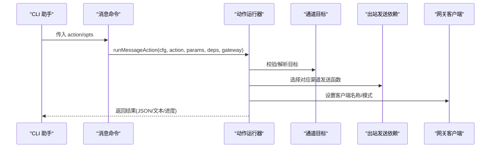
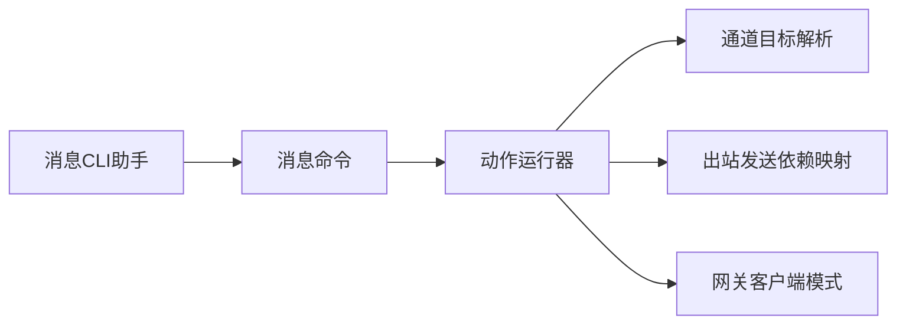

# 消息发送命令

<cite>
**本文引用的文件**
- [src/commands/message.ts](file://src/commands/message.ts)
- [src/cli/program/message/helpers.ts](file://src/cli/program/message/helpers.ts)
- [src/cli/program/register.message.ts](file://src/cli/program/register.message.ts)
- [src/cli/program/message/register.send.ts](file://src/cli/program/message/register.send.ts)
- [src/cli/program/message/register.broadcast.ts](file://src/cli/program/message/register.broadcast.ts)
- [src/cli/program/message/register.reactions.ts](file://src/cli/program/message/register.reactions.ts)
- [src/cli/program/message/register.read-edit-delete.ts](file://src/cli/program/message/register.read-edit-delete.ts)
- [src/cli/program/message/register.thread.ts](file://src/cli/program/message/register.thread.ts)
- [src/cli/outbound-send-deps.ts](file://src/cli/outbound-send-deps.ts)
- [src/infra/outbound/message-action-runner.ts](file://src/infra/outbound/message-action-runner.ts)
- [src/infra/outbound/channel-target.ts](file://src/infra/outbound/channel-target.ts)
- [src/utils/message-channel.ts](file://src/utils/message-channel.ts)
- [src/cli/program.smoke.test.ts](file://src/cli/program.smoke.test.ts)
- [docs/zh-CN/channels/broadcast-groups.md](file://docs/zh-CN/channels/broadcast-groups.md)
</cite>

## 目录

1. [简介](#简介)
2. [项目结构](#项目结构)
3. [核心组件](#核心组件)
4. [架构总览](#架构总览)
5. [详细组件分析](#详细组件分析)
6. [依赖关系分析](#依赖关系分析)
7. [性能考虑](#性能考虑)
8. [故障排查指南](#故障排查指南)
9. [结论](#结论)
10. [附录](#附录)

## 简介

本文件面向 OpenClaw 的“消息发送命令”能力，系统性梳理 CLI 命令注册、动作执行、消息格式与附件上传、富文本支持、群发广播、话题/线程回复、历史查询、转发与编辑、过滤与优先级、送达确认等关键能力。文档以代码为依据，结合 CLI 注册与执行链路，帮助用户正确使用命令并理解其行为。

## 项目结构

消息发送命令由 CLI 子命令“message”统一入口，按动作拆分为多个子命令（发送、广播、投票、反应、读取/编辑/删除、线程、表情包/贴图、权限/搜索等），并通过公共助手函数注入通用选项与执行逻辑。

图表来源

- [src/cli/program/register.message.ts](file://src/cli/program/register.message.ts#L24-L68)
- [src/cli/program/message/helpers.ts](file://src/cli/program/message/helpers.ts#L17-L73)
- [src/infra/outbound/message-action-runner.ts](file://src/infra/outbound/message-action-runner.ts)
- [src/infra/outbound/channel-target.ts](file://src/infra/outbound/channel-target.ts)
- [src/cli/outbound-send-deps.ts](file://src/cli/outbound-send-deps.ts#L1-L22)
- [src/utils/message-channel.ts](file://src/utils/message-channel.ts)

章节来源

- [src/cli/program/register.message.ts](file://src/cli/program/register.message.ts#L24-L68)
- [src/cli/program/message/helpers.ts](file://src/cli/program/message/helpers.ts#L17-L73)

## 核心组件

- 命令入口与动作选择
  - 入口命令“message”负责注册所有子命令，并根据 action 参数选择具体动作。
  - 动作名称来自通道消息动作常量集合，大小写不敏感匹配。
- CLI 助手
  - 提供通用选项注入（通道、账号、输出格式、干跑、详细日志）。
  - 统一执行流程：加载插件注册表、构建默认依赖、运行命令并处理错误。
- 动作执行器
  - 将 action 与参数交由消息动作运行器处理，支持进度提示、JSON 输出、干跑模式。
- 出站发送依赖映射
  - 将不同渠道的发送函数映射到统一接口，便于在 CLI 中按需调用。
- 通道目标解析
  - 提供目标描述与校验，确保目标格式正确。

章节来源

- [src/commands/message.ts](file://src/commands/message.ts#L14-L67)
- [src/cli/program/message/helpers.ts](file://src/cli/program/message/helpers.ts#L17-L73)
- [src/cli/outbound-send-deps.ts](file://src/cli/outbound-send-deps.ts#L1-L22)
- [src/infra/outbound/channel-target.ts](file://src/infra/outbound/channel-target.ts)

## 架构总览

下图展示从 CLI 到动作执行与基础设施的整体流程：

图表来源

- [src/cli/program/message/helpers.ts](file://src/cli/program/message/helpers.ts#L34-L61)
- [src/commands/message.ts](file://src/commands/message.ts#L32-L57)
- [src/infra/outbound/message-action-runner.ts](file://src/infra/outbound/message-action-runner.ts)
- [src/infra/outbound/channel-target.ts](file://src/infra/outbound/channel-target.ts)
- [src/utils/message-channel.ts](file://src/utils/message-channel.ts)

## 详细组件分析

### 发送命令（send）

- 功能要点
  - 必填：通道、账号（可选）、目标（必填）、消息正文（或媒体）。
  - 支持附件上传：本地路径或 URL；支持图片/音频/视频/文档。
  - 富文本与交互：Telegram 内联键盘按钮、Adaptive Card（部分通道支持）。
  - 回复与线程：支持 reply-to、thread-id（如 Telegram 论坛线程）。
  - 静默发送：Telegram 支持静默模式。
  - GIF 播放：WhatsApp 支持将视频作为 GIF 播放。
- 选项与行为
  - 通用选项：通道、账号、JSON 输出、干跑、详细日志。
  - 进度提示：非 JSON 且非干跑时显示发送进度。
  - 错误处理：异常通过运行器捕获并退出码 1。
- 示例参考
  - 文本消息、带媒体消息、Discord 投票、对消息加反应等示例在“message”命令帮助中给出。

章节来源

- [src/cli/program/message/register.send.ts](file://src/cli/program/message/register.send.ts#L4-L31)
- [src/cli/program/register.message.ts](file://src/cli/program/register.message.ts#L33-L47)
- [src/commands/message.ts](file://src/commands/message.ts#L44-L67)

### 广播命令（broadcast）

- 功能要点
  - 向多个目标同时发送相同内容（文本或媒体）。
  - 目标列表通过“--targets”传入，支持多目标。
- 使用场景
  - 对多个群组或联系人进行一致化通知。
- 注意事项
  - 广播策略与目标智能体配置由配置文件定义，支持并行/串行策略。

章节来源

- [src/cli/program/message/register.broadcast.ts](file://src/cli/program/message/register.broadcast.ts#L5-L16)
- [docs/zh-CN/channels/broadcast-groups.md](file://docs/zh-CN/channels/broadcast-groups.md#L125-L173)

### 反应命令（react/reactions）

- 功能要点
  - react：对指定消息添加/移除反应（支持特定通道的参与者字段）。
  - reactions：列出某消息的所有反应。
- 适用通道
  - 不同通道支持不同的反应参数（如 WhatsApp 反应参与者、Signal 目标作者）。

章节来源

- [src/cli/program/message/register.reactions.ts](file://src/cli/program/message/register.reactions.ts#L4-L33)

### 历史查询与编辑删除（read/edit/delete）

- 功能要点
  - read：读取最近消息，支持限制条数、时间范围、线程包含（Discord）。
  - edit：编辑已发送消息（需提供消息 ID 与新正文，Telegram 可选线程 ID）。
  - delete：删除已发送消息（需提供消息 ID）。
- 适用通道
  - 不同通道对“线程包含”“消息 ID”等支持程度不同，需按通道文档确认。

章节来源

- [src/cli/program/message/register.read-edit-delete.ts](file://src/cli/program/message/register.read-edit-delete.ts#L4-L50)

### 线程命令（thread/create/list/reply）

- 功能要点
  - create：创建线程（可选关联初始消息）。
  - list：列出线程（可选包含归档、分页、按 guild/channel 过滤）。
  - reply：在线程内回复（支持媒体与回复到指定消息）。
- 适用通道
  - 主要用于 Discord 等支持线程的通道。

章节来源

- [src/cli/program/message/register.thread.ts](file://src/cli/program/message/register.thread.ts#L4-L55)

### 投票命令（poll）

- 功能要点
  - 在支持的通道创建投票（如 Discord），需提供问题与选项。
- 适用通道
  - 仅在支持投票的通道可用。

章节来源

- [src/cli/program/register.message.ts](file://src/cli/program/register.message.ts#L18-L18)

### 表情包/贴图命令（emoji/sticker）

- 功能要点
  - 在支持的通道发送表情包/贴图。
- 适用通道
  - 仅在支持表情包/贴图的通道可用。

章节来源

- [src/cli/program/register.message.ts](file://src/cli/program/register.message.ts#L10-L12)

### 权限/搜索命令

- 功能要点
  - 权限搜索：查询通道权限相关能力。
  - 消息搜索：在通道内搜索消息（支持分页与范围）。
- 适用通道
  - 依通道能力而定。

章节来源

- [src/cli/program/register.message.ts](file://src/cli/program/register.message.ts#L13-L16)

### 消息动作执行流程（代码级）

图表来源

- [src/commands/message.ts](file://src/commands/message.ts#L32-L57)
- [src/infra/outbound/message-action-runner.ts](file://src/infra/outbound/message-action-runner.ts)
- [src/infra/outbound/channel-target.ts](file://src/infra/outbound/channel-target.ts)
- [src/cli/outbound-send-deps.ts](file://src/cli/outbound-send-deps.ts#L13-L22)
- [src/utils/message-channel.ts](file://src/utils/message-channel.ts)

## 依赖关系分析

- 组件耦合
  - CLI 助手与消息命令解耦，通过统一的 runMessageAction 流程执行。
  - 动作运行器依赖通道目标解析与出站发送依赖映射，保持对具体通道的低耦合。
- 外部依赖
  - 插件注册表需在执行前加载，保证渠道能力可用。
  - 网关客户端模式与名称用于标识 CLI 触发的动作来源。

图表来源

- [src/cli/program/message/helpers.ts](file://src/cli/program/message/helpers.ts#L34-L61)
- [src/commands/message.ts](file://src/commands/message.ts#L32-L57)
- [src/infra/outbound/channel-target.ts](file://src/infra/outbound/channel-target.ts)
- [src/cli/outbound-send-deps.ts](file://src/cli/outbound-send-deps.ts#L13-L22)
- [src/utils/message-channel.ts](file://src/utils/message-channel.ts)

章节来源

- [src/cli/program/message/helpers.ts](file://src/cli/program/message/helpers.ts#L17-L73)
- [src/commands/message.ts](file://src/commands/message.ts#L14-L67)

## 性能考虑

- 进度提示与 JSON 输出
  - 非 JSON 且非干跑时启用进度提示，避免长时间无反馈。
- 干跑模式
  - 通过“--dry-run”打印即将发送的载荷，便于验证与审计。
- 广播策略
  - 广播支持并行/串行策略，合理选择以平衡吞吐与资源占用。

章节来源

- [src/commands/message.ts](file://src/commands/message.ts#L44-L67)
- [src/cli/program/message/register.broadcast.ts](file://src/cli/program/message/register.broadcast.ts#L5-L16)
- [docs/zh-CN/channels/broadcast-groups.md](file://docs/zh-CN/channels/broadcast-groups.md#L151-L152)

## 故障排查指南

- 常见问题
  - 未知动作：确保 action 与通道消息动作常量匹配（大小写不敏感）。
  - 目标格式错误：检查通道目标描述与格式要求。
  - 缺少必要选项：如发送命令需提供目标与消息正文或媒体。
  - 通道不支持的功能：如线程/投票/表情包等需确认通道支持情况。
- 排查步骤
  - 使用“--verbose”开启详细日志。
  - 使用“--dry-run”查看即将发送的载荷。
  - 使用“--json”获取结构化输出，便于自动化处理。
  - 通过“read”命令验证消息是否到达目标。
- 单元测试参考
  - CLI 程序对“message send/ react/status”等命令的调用进行了冒烟测试，可作为行为参考。

章节来源

- [src/commands/message.ts](file://src/commands/message.ts#L25-L27)
- [src/cli/program/message/helpers.ts](file://src/cli/program/message/helpers.ts#L21-L27)
- [src/cli/program.smoke.test.ts](file://src/cli/program.smoke.test.ts#L76-L104)

## 结论

OpenClaw 的消息发送命令以“message”为统一入口，通过子命令覆盖发送、广播、投票、反应、历史与编辑、线程、表情包/贴图、权限/搜索等场景。CLI 助手提供一致的选项与执行流程，动作运行器对接通道目标解析与出站发送依赖映射，确保跨通道的一致体验。建议在生产使用中结合“--dry-run”与“--json”进行验证与集成。

## 附录

### 命令语法速览

- 通用选项
  - --channel <channel>：通道类型
  - --account <id>：通道账号 ID
  - --json：以 JSON 输出结果
  - --dry-run：打印载荷并跳过发送
  - --verbose：详细日志
- 发送（send）
  - -t, --target <dest>：目标（必填）
  - -m, --message <text>：消息正文（与媒体二选一或两者皆可）
  - --media <path-or-url>：媒体（图片/音频/视频/文档）
  - --buttons <json>：Telegram 内联键盘按钮（JSON）
  - --card <json>：Adaptive Card（部分通道支持）
  - --reply-to <id>：回复某消息
  - --thread-id <id>：线程 ID（如 Telegram 论坛）
  - --gif-playback：WhatsApp 将视频作为 GIF 播放
  - --silent：Telegram 静默发送
- 广播（broadcast）
  - --targets <target...>：多个目标
  - --message <text> 或 --media <url>：内容
- 反应（react/reactions）
  - --message-id <id>：消息 ID（必填）
  - --emoji <emoji>：表情
  - --remove：移除反应
  - --participant <id>：WhatsApp 反应参与者
  - --from-me：WhatsApp 反应 fromMe
  - --target-author <id> / --target-author-uuid <uuid>：Signal 目标作者
- 历史与编辑删除（read/edit/delete）
  - read：--limit/--before/--after/--around/--include-thread
  - edit：--message-id <id> 与 -m/--message
  - delete：--message-id <id>
- 线程（thread）
  - create：--thread-name <name> [--message-id <id>] [--message <text>] [--auto-archive-min <n>]
  - list：--guild-id <id> [--channel-id <id>] [--include-archived] [--before <id>] [--limit <n>]
  - reply：-m/--message 与 --media/--reply-to
- 投票（poll）
  - 在支持的通道创建投票（如 Discord），需提供问题与选项
- 表情包/贴图（emoji/sticker）
  - 在支持的通道发送表情包/贴图
- 权限/搜索
  - 权限搜索与消息搜索（分页与范围）

章节来源

- [src/cli/program/message/register.send.ts](file://src/cli/program/message/register.send.ts#L4-L31)
- [src/cli/program/message/register.broadcast.ts](file://src/cli/program/message/register.broadcast.ts#L5-L16)
- [src/cli/program/message/register.reactions.ts](file://src/cli/program/message/register.reactions.ts#L4-L33)
- [src/cli/program/message/register.read-edit-delete.ts](file://src/cli/program/message/register.read-edit-delete.ts#L4-L50)
- [src/cli/program/message/register.thread.ts](file://src/cli/program/message/register.thread.ts#L4-L55)
- [src/cli/program/register.message.ts](file://src/cli/program/register.message.ts#L18-L18)

### 使用示例（基于文档示例）

- 发送文本消息
  - openclaw message send --target +15555550123 --message "Hi"
- 发送带媒体的消息
  - openclaw message send --target +15555550123 --message "Hi" --media photo.jpg
- 创建 Discord 投票
  - openclaw message poll --channel discord --target channel:123 --poll-question "Snack?" --poll-option Pizza --poll-option Sushi
- 对消息加反应
  - openclaw message react --channel discord --target 123 --message-id 456 --emoji "✅"

章节来源

- [src/cli/program/register.message.ts](file://src/cli/program/register.message.ts#L33-L47)
