# 渠道管理命令

<cite>
**本文档引用的文件**
- [src/cli/channels-cli.ts](file://src/cli/channels-cli.ts)
- [src/cli/channel-auth.ts](file://src/cli/channel-auth.ts)
- [src/cli/channel-options.ts](file://src/cli/channel-options.ts)
- [docs/cli/channels.md](file://docs/cli/channels.md)
- [src/commands/channels/add.ts](file://src/commands/channels/add.ts)
- [src/commands/channels/remove.ts](file://src/commands/channels/remove.ts)
- [src/commands/channels/status.ts](file://src/commands/channels/status.ts)
- [src/commands/channels/logs.ts](file://src/commands/channels/logs.ts)
- [src/commands/channels/capabilities.ts](file://src/commands/channels/capabilities.ts)
- [src/commands/channels/resolve.ts](file://src/commands/channels/resolve.ts)
- [src/commands/channels/shared.ts](file://src/commands/channels/shared.ts)
- [src/slack/channel-migration.ts](file://src/slack/channel-migration.ts)
- [src/slack/channel-migration.test.ts](file://src/slack/channel-migration.test.ts)
- [src/agents/tools/discord-actions-guild.ts](file://src/agents/tools/discord-actions-guild.ts)
- [src/discord/audit.ts](file://src/discord/audit.ts)
- [src/security/audit.ts](file://src/security/audit.ts)
- [apps/shared/OpenClawKit/Sources/OpenClawProtocol/GatewayModels.swift](file://apps/shared/OpenClawKit/Sources/OpenClawProtocol/GatewayModels.swift)
- [apps/macos/Sources/OpenClawProtocol/GatewayModels.swift](file://apps/macos/Sources/OpenClawProtocol/GatewayModels.swift)
</cite>

## 目录

1. [简介](#简介)
2. [项目结构](#项目结构)
3. [核心组件](#核心组件)
4. [架构总览](#架构总览)
5. [详细组件分析](#详细组件分析)
6. [依赖关系分析](#依赖关系分析)
7. [性能考虑](#性能考虑)
8. [故障排除指南](#故障排除指南)
9. [结论](#结论)
10. [附录](#附录)

## 简介

本文件系统化梳理 OpenClaw 的“渠道管理命令”，覆盖以下能力：

- 添加/删除渠道账号（支持多平台：WhatsApp、Telegram、Discord、Google Chat、Slack、Mattermost、Signal、iMessage 等）
- 登录/登出（交互式认证）
- 渠道能力探测与权限审计
- 名称解析（用户名/群组名到 ID）
- 渠道状态监控与日志查看
- 批量管理、配置模板与迁移工具
- 权限管理、安全审计与性能优化建议

## 项目结构

围绕渠道管理命令的关键目录与文件：

- CLI 命令入口与子命令注册：src/cli/channels-cli.ts
- 认证流程封装：src/cli/channel-auth.ts
- 渠道选项格式化：src/cli/channel-options.ts
- 文档参考：docs/cli/channels.md
- 核心命令实现：
  - 添加：src/commands/channels/add.ts
  - 删除：src/commands/channels/remove.ts
  - 状态：src/commands/channels/status.ts
  - 日志：src/commands/channels/logs.ts
  - 能力探测：src/commands/channels/capabilities.ts
  - 名称解析：src/commands/channels/resolve.ts
  - 共享逻辑：src/commands/channels/shared.ts
- 迁移工具：
  - Slack 频道迁移：src/slack/channel-migration.ts
  - 测试用例：src/slack/channel-migration.test.ts
- 安全与权限：
  - Discord 权限审计：src/discord/audit.ts
  - 通用安全审计钩子：src/security/audit.ts
- 协议模型（跨平台）：apps/shared/OpenClawKit/Sources/OpenClawProtocol/GatewayModels.swift、apps/macos/Sources/OpenClawProtocol/GatewayModels.swift

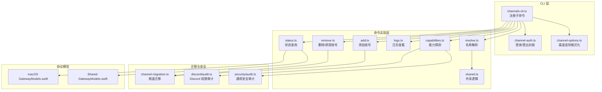

**图表来源**

- [src/cli/channels-cli.ts](file://src/cli/channels-cli.ts#L1-L247)
- [src/cli/channel-auth.ts](file://src/cli/channel-auth.ts#L1-L64)
- [src/cli/channel-options.ts](file://src/cli/channel-options.ts#L1-L34)
- [src/commands/channels/add.ts](file://src/commands/channels/add.ts#L1-L278)
- [src/commands/channels/remove.ts](file://src/commands/channels/remove.ts#L1-L143)
- [src/commands/channels/status.ts](file://src/commands/channels/status.ts#L1-L290)
- [src/commands/channels/logs.ts](file://src/commands/channels/logs.ts#L1-L114)
- [src/commands/channels/capabilities.ts](file://src/commands/channels/capabilities.ts#L1-L557)
- [src/commands/channels/resolve.ts](file://src/commands/channels/resolve.ts#L1-L150)
- [src/commands/channels/shared.ts](file://src/commands/channels/shared.ts)
- [src/slack/channel-migration.ts](file://src/slack/channel-migration.ts#L37-L102)
- [src/discord/audit.ts](file://src/discord/audit.ts#L82-L136)
- [src/security/audit.ts](file://src/security/audit.ts#L763-L804)
- [apps/macos/Sources/OpenClawProtocol/GatewayModels.swift](file://apps/macos/Sources/OpenClawProtocol/GatewayModels.swift#L1455-L1519)
- [apps/shared/OpenClawKit/Sources/OpenClawProtocol/GatewayModels.swift](file://apps/shared/OpenClawKit/Sources/OpenClawProtocol/GatewayModels.swift#L1455-L1519)

**章节来源**

- [src/cli/channels-cli.ts](file://src/cli/channels-cli.ts#L1-L247)
- [docs/cli/channels.md](file://docs/cli/channels.md#L1-L80)

## 核心组件

- 渠道命令入口与子命令注册：负责解析参数、调用具体命令并处理错误。
- 添加/删除账号：统一通过插件适配器写入配置，支持向导模式与批量操作。
- 登录/登出：针对支持认证的渠道执行交互式登录或会话清理。
- 状态监控：调用网关通道状态接口，聚合各账号运行态信息与健康检查。
- 日志查看：按渠道过滤尾部日志，支持 JSON 输出。
- 能力探测：拉取提供商能力、意图/权限、机器人信息等。
- 名称解析：将用户名/群组名解析为平台 ID，支持自动类型推断。
- 迁移工具：在配置中重命名/替换频道 ID，避免重复与遗漏。
- 安全审计：收集渠道安全警告、权限缺失提示。

**章节来源**

- [src/commands/channels/add.ts](file://src/commands/channels/add.ts#L79-L278)
- [src/commands/channels/remove.ts](file://src/commands/channels/remove.ts#L27-L143)
- [src/cli/channel-auth.ts](file://src/cli/channel-auth.ts#L14-L64)
- [src/commands/channels/status.ts](file://src/commands/channels/status.ts#L243-L290)
- [src/commands/channels/logs.ts](file://src/commands/channels/logs.ts#L76-L114)
- [src/commands/channels/capabilities.ts](file://src/commands/channels/capabilities.ts#L439-L557)
- [src/commands/channels/resolve.ts](file://src/commands/channels/resolve.ts#L70-L150)
- [src/slack/channel-migration.ts](file://src/slack/channel-migration.ts#L37-L102)
- [src/security/audit.ts](file://src/security/audit.ts#L763-L804)

## 架构总览

下图展示“渠道管理命令”的端到端调用链路与数据流：

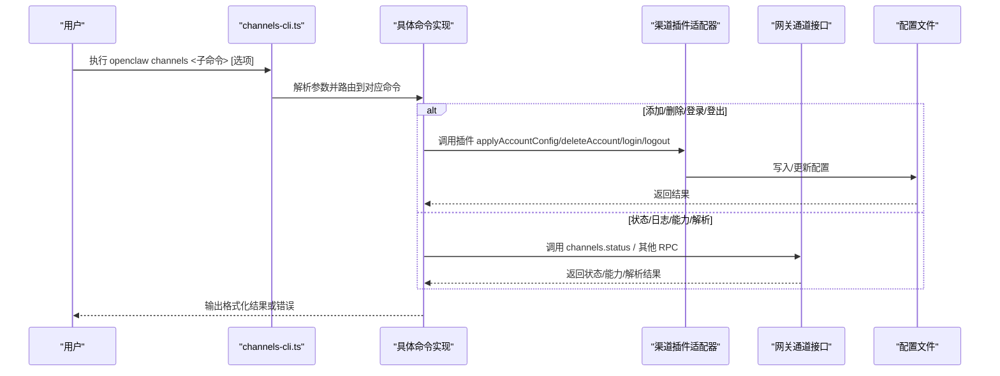

**图表来源**

- [src/cli/channels-cli.ts](file://src/cli/channels-cli.ts#L199-L247)
- [src/commands/channels/add.ts](file://src/commands/channels/add.ts#L176-L181)
- [src/commands/channels/remove.ts](file://src/commands/channels/remove.ts#L93-L98)
- [src/commands/channels/status.ts](file://src/commands/channels/status.ts#L260-L266)
- [src/commands/channels/capabilities.ts](file://src/commands/channels/capabilities.ts#L368-L379)
- [src/commands/channels/resolve.ts](file://src/commands/channels/resolve.ts#L87-L103)

## 详细组件分析

### 添加渠道账号（channels add）

- 支持多渠道输入与向导模式；可从插件目录安装扩展渠道。
- 输入校验由插件 setup.validateInput 完成；应用配置由 applyChannelAccountConfig 完成。
- 关键选项（示例，非完整列表）：token、botToken、appToken、signalNumber、cliPath、dbPath、service、region、authDir、httpUrl、httpHost、httpPort、webhookPath、webhookUrl、audienceType、audience、useEnv、homeserver、userId、accessToken、password、deviceName、initialSyncLimit、ship、url、code、groupChannels（逗号/换行分隔）、dmAllowlist、autoDiscoverChannels。
- 向导模式支持逐个渠道选择账户 ID，并可选填写显示名称。

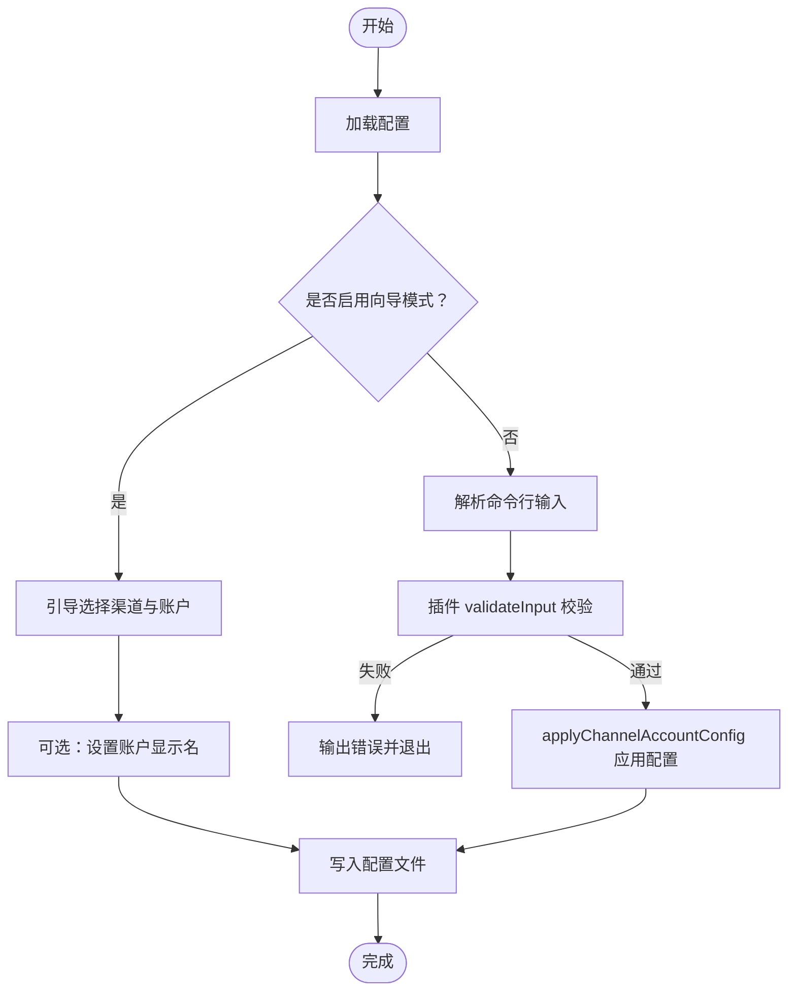

**图表来源**

- [src/commands/channels/add.ts](file://src/commands/channels/add.ts#L79-L278)

**章节来源**

- [src/commands/channels/add.ts](file://src/commands/channels/add.ts#L18-L52)
- [src/commands/channels/add.ts](file://src/commands/channels/add.ts#L195-L236)
- [src/commands/channels/add.ts](file://src/commands/channels/add.ts#L238-L273)
- [docs/cli/channels.md](file://docs/cli/channels.md#L29-L37)

### 删除/禁用渠道账号（channels remove）

- 支持“禁用”（保留配置）与“删除”（彻底移除）两种模式。
- 默认行为为禁用；删除需要显式 --delete 并确认。
- 通过插件 config.setAccountEnabled 或 config.deleteAccount 实现。

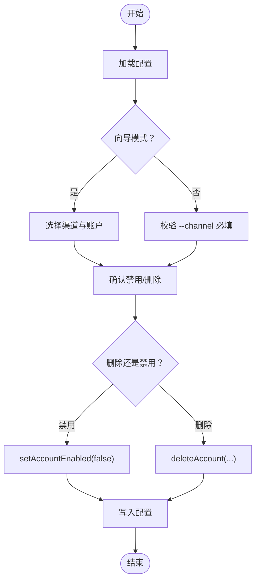

**图表来源**

- [src/commands/channels/remove.ts](file://src/commands/channels/remove.ts#L27-L143)

**章节来源**

- [src/commands/channels/remove.ts](file://src/commands/channels/remove.ts#L13-L17)
- [src/commands/channels/remove.ts](file://src/commands/channels/remove.ts#L100-L126)

### 登录/登出（channels login/logout）

- login：仅执行认证流程，不修改配置；支持指定渠道与账户。
- logout：清理会话状态，调用插件 gateway.logoutAccount。
- 未支持的渠道会抛出错误。

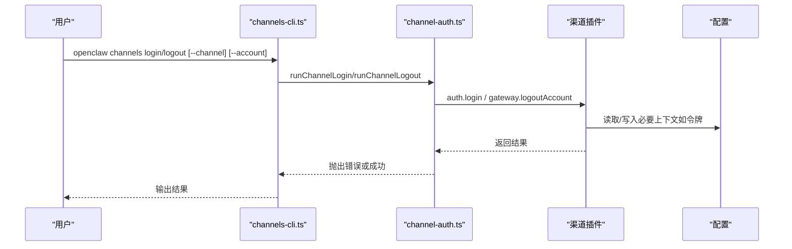

**图表来源**

- [src/cli/channels-cli.ts](file://src/cli/channels-cli.ts#L212-L246)
- [src/cli/channel-auth.ts](file://src/cli/channel-auth.ts#L14-L64)

**章节来源**

- [src/cli/channel-auth.ts](file://src/cli/channel-auth.ts#L14-L64)
- [docs/cli/channels.md](file://docs/cli/channels.md#L38-L43)

### 渠道状态监控（channels status）

- 调用网关 channels.status，支持 --probe 与超时控制。
- 输出包含 enabled/configured/linked/running/connected、最近收发时间、模式、机器人信息、DM 策略、允许来源、令牌来源、意图、URL、探测/审计结果、最后错误等。
- 网关不可达时回退到仅基于配置的快照输出。

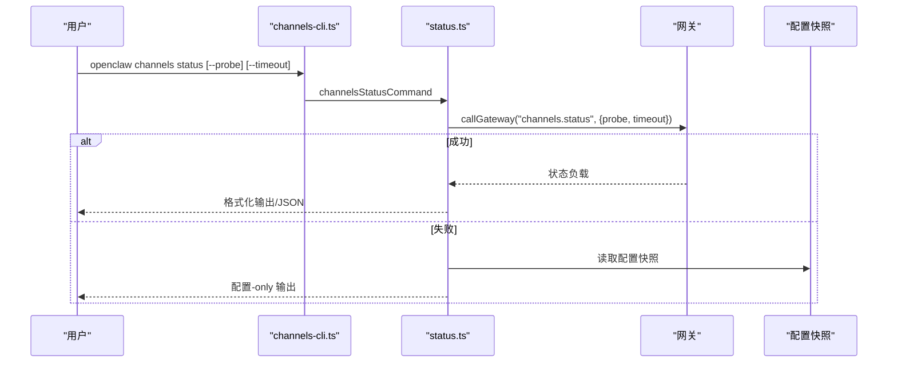

**图表来源**

- [src/commands/channels/status.ts](file://src/commands/channels/status.ts#L243-L290)
- [apps/shared/OpenClawKit/Sources/OpenClawProtocol/GatewayModels.swift](file://apps/shared/OpenClawKit/Sources/OpenClawProtocol/GatewayModels.swift#L1455-L1519)
- [apps/macos/Sources/OpenClawProtocol/GatewayModels.swift](file://apps/macos/Sources/OpenClawProtocol/GatewayModels.swift#L1455-L1519)

**章节来源**

- [src/commands/channels/status.ts](file://src/commands/channels/status.ts#L15-L19)
- [src/commands/channels/status.ts](file://src/commands/channels/status.ts#L21-L161)
- [src/commands/channels/status.ts](file://src/commands/channels/status.ts#L243-L290)

### 日志查看（channels logs）

- 按渠道过滤日志文件尾部内容，默认最多 200 行，最大读取 1MB。
- 支持 --json 输出原始结构。

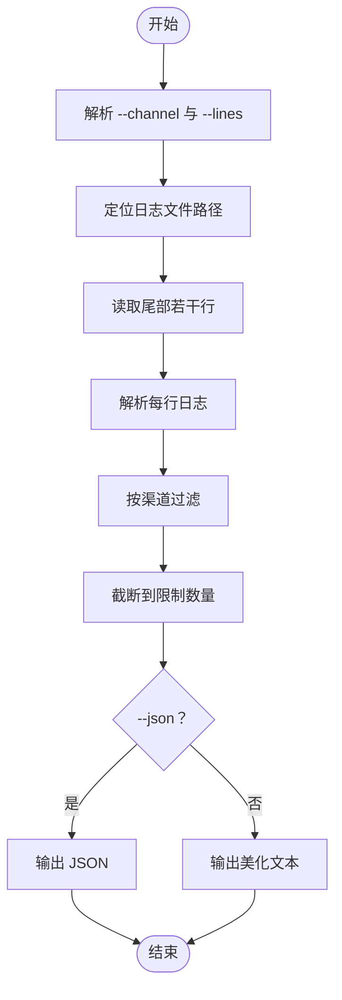

**图表来源**

- [src/commands/channels/logs.ts](file://src/commands/channels/logs.ts#L76-L114)

**章节来源**

- [src/commands/channels/logs.ts](file://src/commands/channels/logs.ts#L8-L12)
- [src/commands/channels/logs.ts](file://src/commands/channels/logs.ts#L76-L114)

### 能力探测与权限审计（channels capabilities）

- 支持对所有渠道或指定渠道列出支持特性（chatTypes/polls/reactions/edit/unsend/reply/effects/groupManagement/threads/media/nativeCommands/blockStreaming）。
- 对 Discord：可选 --target channel:<id>，返回所需权限（如 ViewChannel、SendMessages）与缺失项。
- 对 Slack：列出 Bot/User 令牌的作用域。
- 对 Telegram/Signal/MS Teams：返回机器人信息、Webhook、守护进程版本、Graph 角色/作用域等。
- 可通过 --json 输出机器可读结果。

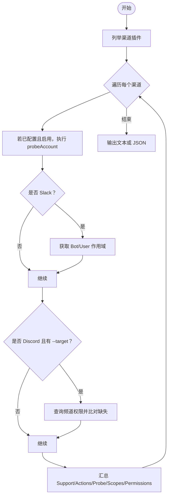

**图表来源**

- [src/commands/channels/capabilities.ts](file://src/commands/channels/capabilities.ts#L439-L557)
- [src/discord/audit.ts](file://src/discord/audit.ts#L82-L136)

**章节来源**

- [src/commands/channels/capabilities.ts](file://src/commands/channels/capabilities.ts#L13-L19)
- [src/commands/channels/capabilities.ts](file://src/commands/channels/capabilities.ts#L161-L279)
- [src/commands/channels/capabilities.ts](file://src/commands/channels/capabilities.ts#L439-L557)

### 名称解析（channels resolve）

- 将用户名/群组名解析为平台 ID；支持强制类型（auto/user/group）或自动推断。
- 支持 --json 输出结构化结果。

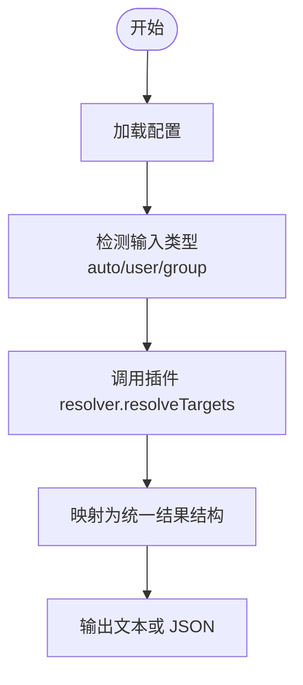

**图表来源**

- [src/commands/channels/resolve.ts](file://src/commands/channels/resolve.ts#L70-L150)

**章节来源**

- [src/commands/channels/resolve.ts](file://src/commands/channels/resolve.ts#L8-L14)
- [src/commands/channels/resolve.ts](file://src/commands/channels/resolve.ts#L70-L150)

### 渠道批量管理、配置模板与迁移工具

- 批量管理：通过向导模式一次选择多个渠道与账户，统一配置与命名。
- 配置模板：通过插件 catalog 提供的元信息与别名进行识别与安装。
- 迁移工具：Slack 频道迁移支持全局与账户级频道 ID 替换，避免重复并记录迁移范围。

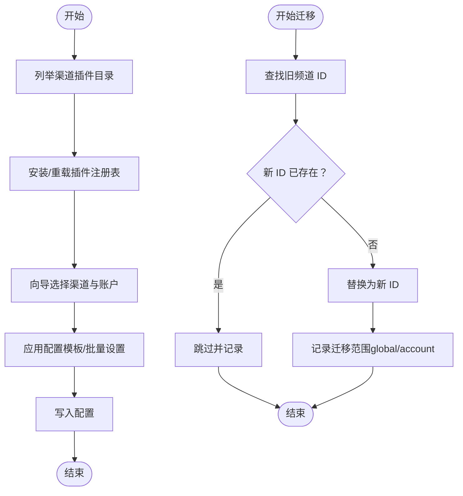

**图表来源**

- [src/commands/channels/add.ts](file://src/commands/channels/add.ts#L149-L165)
- [src/slack/channel-migration.ts](file://src/slack/channel-migration.ts#L37-L102)

**章节来源**

- [src/commands/channels/add.ts](file://src/commands/channels/add.ts#L90-L143)
- [src/slack/channel-migration.ts](file://src/slack/channel-migration.ts#L37-L102)
- [src/slack/channel-migration.test.ts](file://src/slack/channel-migration.test.ts#L1-L112)

### 权限管理、安全设置与性能优化

- 权限管理：
  - Discord：通过 auditDiscordChannelPermissions 检查频道所需权限（如 ViewChannel、SendMessages），并报告缺失项。
  - 通用安全审计：插件 security.collectWarnings 与 resolveDmPolicy 收集警告与 DM 策略提示。
- 安全设置：
  - 通过插件安全适配器收集渠道安全风险与策略建议。
  - 在 UI 中展示额外字段（如 groupPolicy、streamMode、dmPolicy）辅助配置核验。
- 性能优化：
  - 使用 --timeout 控制探测超时，避免阻塞。
  - 仅在需要时启用 --probe，减少外部请求。
  - 使用 --json 结合下游工具批处理分析。

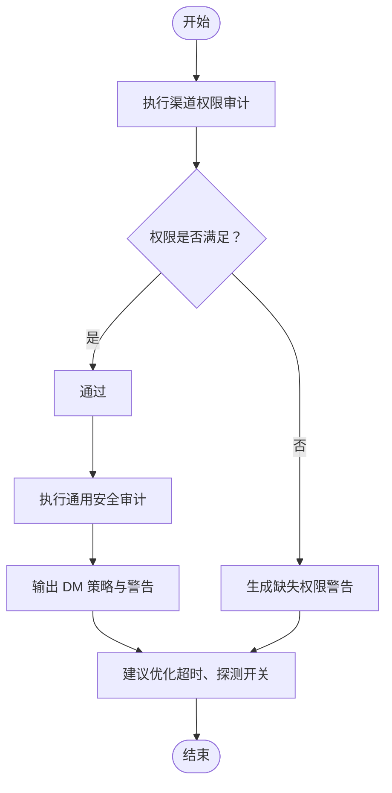

**图表来源**

- [src/discord/audit.ts](file://src/discord/audit.ts#L82-L136)
- [src/security/audit.ts](file://src/security/audit.ts#L763-L804)
- [src/commands/channels/capabilities.ts](file://src/commands/channels/capabilities.ts#L56-L66)

**章节来源**

- [src/discord/audit.ts](file://src/discord/audit.ts#L82-L136)
- [src/security/audit.ts](file://src/security/audit.ts#L763-L804)
- [src/commands/channels/capabilities.ts](file://src/commands/channels/capabilities.ts#L56-L66)

## 依赖关系分析

- CLI 子命令依赖具体命令实现模块。
- 命令实现依赖渠道插件适配器（setup/config/status/resolver/auth/gateway 等）。
- 状态与日志依赖网关 RPC 与配置快照。
- 能力探测依赖各平台 API（Slack 作用域、Discord 权限、MS Teams Graph 等）。
- 迁移工具依赖配置结构与账户解析。

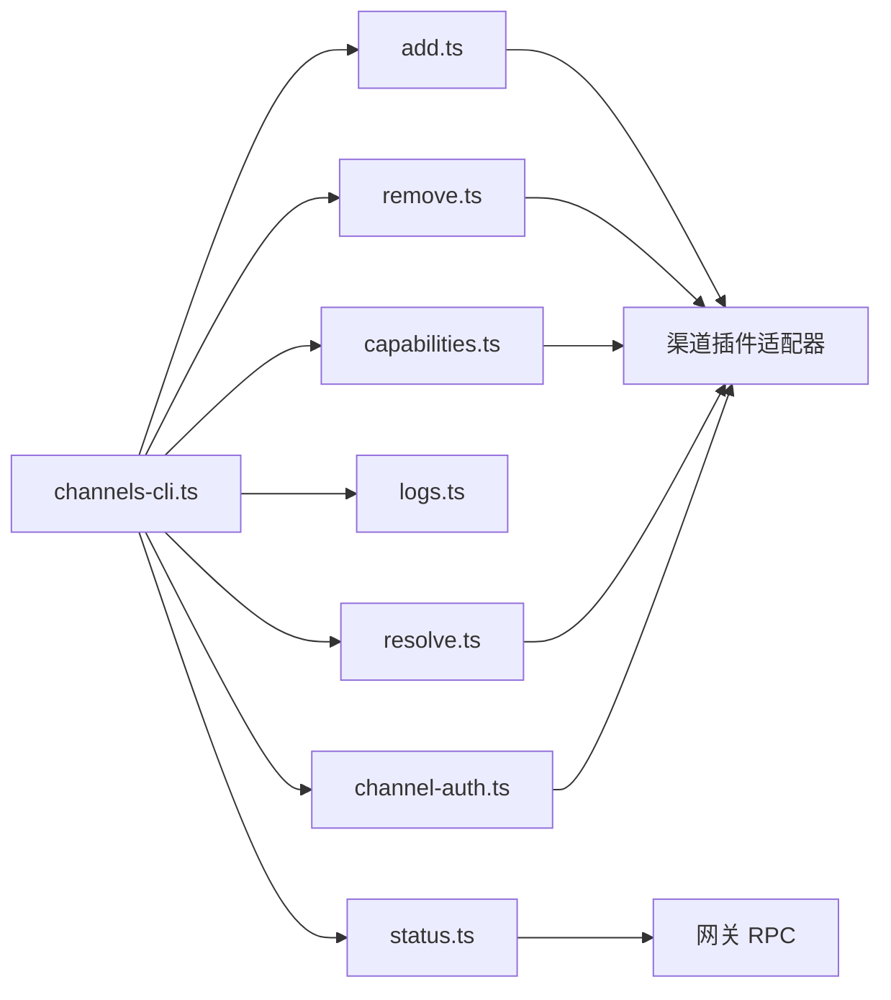

**图表来源**

- [src/cli/channels-cli.ts](file://src/cli/channels-cli.ts#L1-L247)
- [src/commands/channels/add.ts](file://src/commands/channels/add.ts#L1-L278)
- [src/commands/channels/remove.ts](file://src/commands/channels/remove.ts#L1-L143)
- [src/commands/channels/status.ts](file://src/commands/channels/status.ts#L1-L290)
- [src/commands/channels/logs.ts](file://src/commands/channels/logs.ts#L1-L114)
- [src/commands/channels/capabilities.ts](file://src/commands/channels/capabilities.ts#L1-L557)
- [src/commands/channels/resolve.ts](file://src/commands/channels/resolve.ts#L1-L150)
- [src/cli/channel-auth.ts](file://src/cli/channel-auth.ts#L1-L64)

**章节来源**

- [src/cli/channels-cli.ts](file://src/cli/channels-cli.ts#L1-L247)
- [src/commands/channels/add.ts](file://src/commands/channels/add.ts#L1-L278)
- [src/commands/channels/remove.ts](file://src/commands/channels/remove.ts#L1-L143)
- [src/commands/channels/status.ts](file://src/commands/channels/status.ts#L1-L290)
- [src/commands/channels/logs.ts](file://src/commands/channels/logs.ts#L1-L114)
- [src/commands/channels/capabilities.ts](file://src/commands/channels/capabilities.ts#L1-L557)
- [src/commands/channels/resolve.ts](file://src/commands/channels/resolve.ts#L1-L150)
- [src/cli/channel-auth.ts](file://src/cli/channel-auth.ts#L1-L64)

## 性能考虑

- 探测超时：合理设置 --timeout，避免长时间等待。
- 选择性探测：默认不带 --probe，仅在诊断问题时开启。
- 日志读取：限制读取大小与行数，避免大文件扫描开销。
- 批量操作：优先使用向导模式一次性配置，减少多次写盘。

## 故障排除指南

- 网关不可达：使用 status 回退到配置-only 输出，结合 logs 查看本地日志。
- Slack 作用域不足：根据 capabilities 输出的 Bot/User 作用域提示补齐。
- Discord 权限缺失：根据 capabilities 的缺失权限列表补齐 ViewChannel、SendMessages 等。
- 令牌问题：login/logout 重新建立会话；必要时更换令牌来源（token/botToken/appToken）。
- 常见命令组合：
  - openclaw channels capabilities
  - openclaw channels logs --channel <渠道> --lines 500
  - openclaw channels status --probe --timeout 15000
  - openclaw channels login --channel whatsapp
  - openclaw channels logout --channel whatsapp

**章节来源**

- [src/commands/channels/status.ts](file://src/commands/channels/status.ts#L272-L288)
- [src/commands/channels/logs.ts](file://src/commands/channels/logs.ts#L76-L114)
- [src/commands/channels/capabilities.ts](file://src/commands/channels/capabilities.ts#L508-L556)
- [docs/cli/channels.md](file://docs/cli/channels.md#L45-L80)

## 结论

OpenClaw 的渠道管理命令以插件化架构为核心，统一了多平台的配置、认证、状态与诊断能力。通过向导模式与迁移工具，可高效完成批量配置与升级；配合能力探测与安全审计，能够快速定位权限与策略问题。建议在生产环境中合理设置超时与探测范围，并定期使用 capabilities 与 logs 进行健康巡检。

## 附录

- 常用命令速查
  - 添加账号：openclaw channels add --channel <渠道> [选项]
  - 删除账号：openclaw channels remove --channel <渠道> [--delete]
  - 登录/登出：openclaw channels login/logout --channel <渠道> [--account]
  - 状态：openclaw channels status [--probe] [--timeout]
  - 日志：openclaw channels logs --channel <all|渠道> [--lines N] [--json]
  - 能力：openclaw channels capabilities [--channel] [--target] [--json]
  - 解析：openclaw channels resolve --channel <渠道> "<名称1>" "<名称2>" [--kind auto|user|group] [--json]
- 渠道选项来源：通过渠道目录与注册表动态生成，支持扩展渠道。

**章节来源**

- [docs/cli/channels.md](file://docs/cli/channels.md#L1-L80)
- [src/cli/channel-options.ts](file://src/cli/channel-options.ts#L20-L34)
