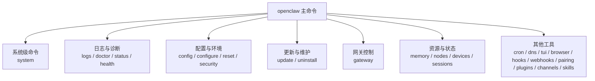
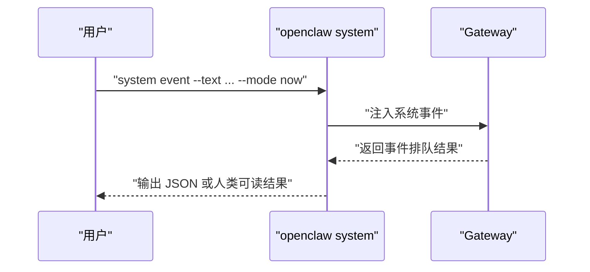
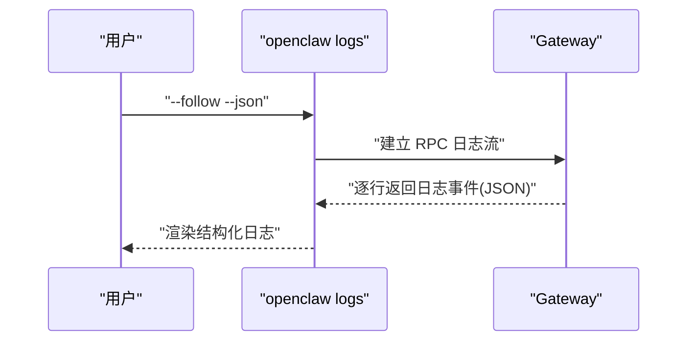
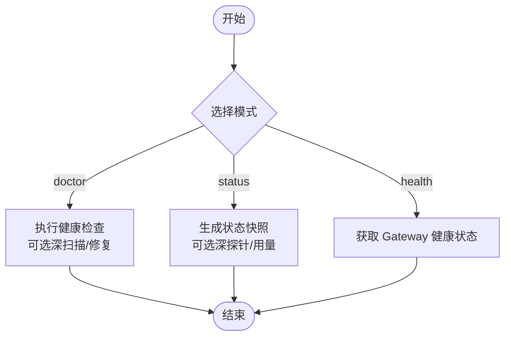
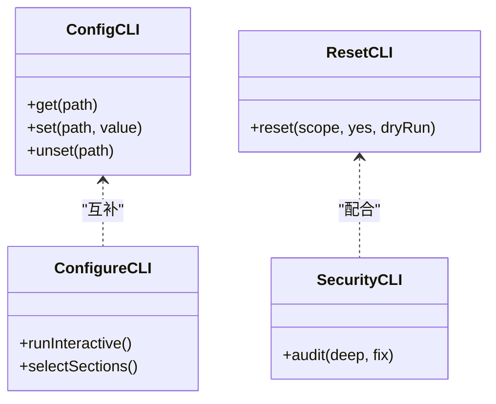
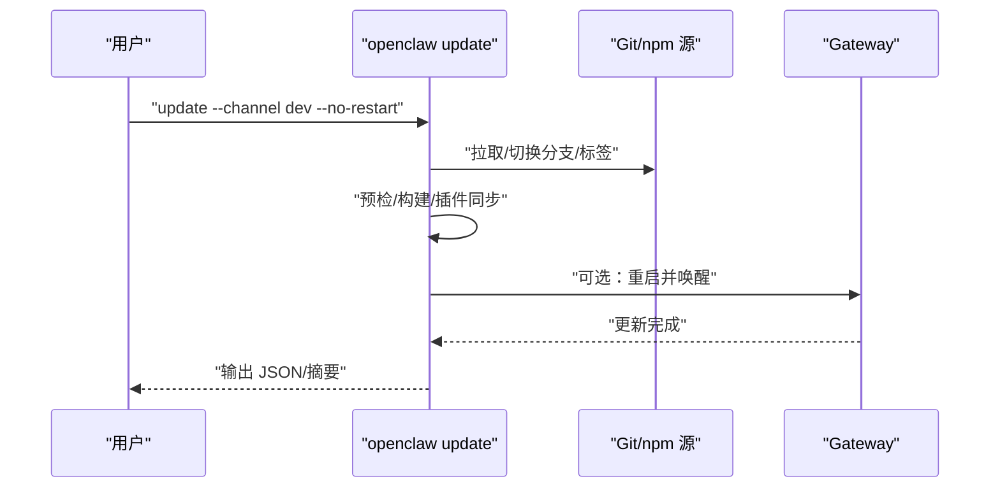
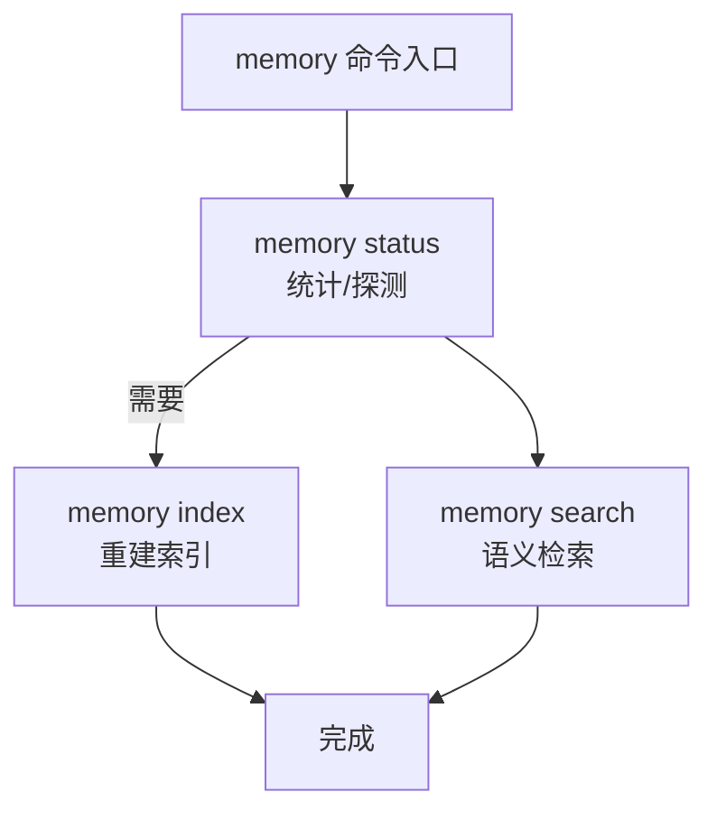
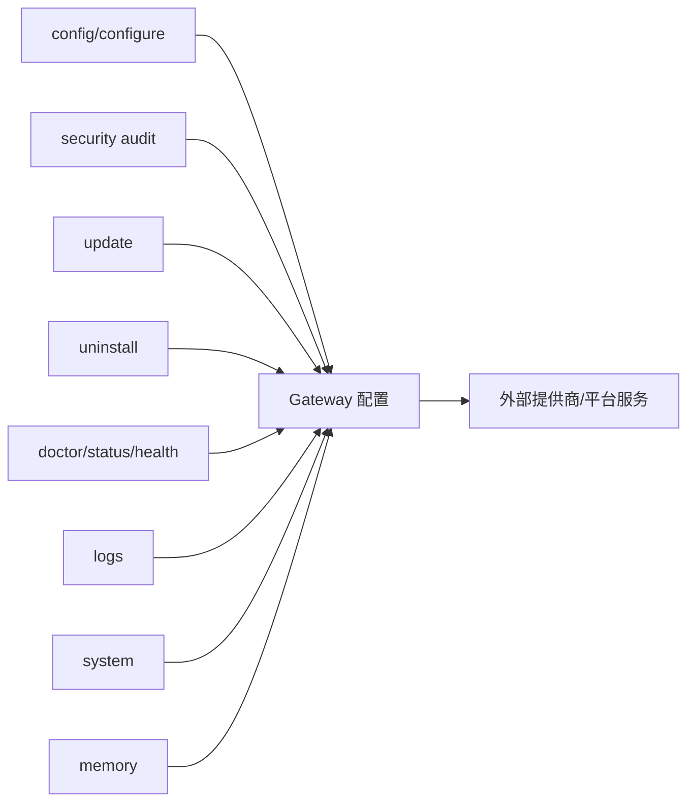

# 系统管理命令

<cite>
**本文引用的文件**
- [docs/cli/index.md](file://docs/cli/index.md)
- [docs/cli/system.md](file://docs/cli/system.md)
- [docs/cli/logs.md](file://docs/cli/logs.md)
- [docs/cli/doctor.md](file://docs/cli/doctor.md)
- [docs/cli/status.md](file://docs/cli/status.md)
- [docs/cli/memory.md](file://docs/cli/memory.md)
- [docs/cli/reset.md](file://docs/cli/reset.md)
- [docs/cli/uninstall.md](file://docs/cli/uninstall.md)
- [docs/cli/update.md](file://docs/cli/update.md)
- [docs/cli/security.md](file://docs/cli/security.md)
- [docs/cli/config.md](file://docs/cli/config.md)
- [docs/cli/configure.md](file://docs/cli/configure.md)
- [docs/cli/health.md](file://docs/cli/health.md)
- [docs/cli/nodes.md](file://docs/cli/nodes.md)
- [docs/cli/devices.md](file://docs/cli/devices.md)
- [docs/cli/sessions.md](file://docs/cli/sessions.md)
- [docs/cli/gateway.md](file://docs/cli/gateway.md)
- [docs/cli/setup.md](file://docs/cli/setup.md)
</cite>

## 目录

1. [简介](#简介)
2. [项目结构](#项目结构)
3. [核心组件](#核心组件)
4. [架构总览](#架构总览)
5. [详细组件分析](#详细组件分析)
6. [依赖关系分析](#依赖关系分析)
7. [性能考虑](#性能考虑)
8. [故障排除指南](#故障排除指南)
9. [结论](#结论)
10. [附录](#附录)

## 简介

本文件面向 OpenClaw 系统管理员与运维工程师，系统性梳理“系统管理命令”的使用方法与最佳实践，覆盖以下主题：

- 系统配置与环境管理：配置读取、设置、重置、安全审计
- 日志管理与诊断：远程日志跟踪、健康检查、状态快照
- 系统状态检查与性能监控：通道健康、会话状态、内存索引、节点与设备
- 备份与恢复、更新升级、卸载清理
- 系统优化、安全加固与故障排除
- 权限管理、环境隔离与依赖检查

## 项目结构

OpenClaw 的 CLI 命令体系以“主命令 + 子命令 + 全局标志”为核心组织方式，文档集中于 docs/cli 下，命令树与用法在 CLI 参考中给出。



图表来源

- [docs/cli/index.md](file://docs/cli/index.md#L86-L238)

章节来源

- [docs/cli/index.md](file://docs/cli/index.md#L1-L238)

## 核心组件

- 系统事件与心跳：通过 system 子命令注入系统事件、启用/禁用心跳、查看系统存在性（presence）
- 日志与诊断：logs 远程跟踪；status/doctor/health 提供诊断输出与快速修复
- 配置与环境：config/configure 提供非交互式与交互式配置；reset 清理本地状态；security 审计与修复
- 更新与维护：update 支持通道切换与安全更新；uninstall 卸载服务与数据
- 资源与状态：memory 索引与检索；nodes/devices/sessions 展示运行态资源与会话

章节来源

- [docs/cli/system.md](file://docs/cli/system.md#L1-L61)
- [docs/cli/logs.md](file://docs/cli/logs.md#L1-L29)
- [docs/cli/doctor.md](file://docs/cli/doctor.md#L1-L42)
- [docs/cli/status.md](file://docs/cli/status.md#L1-L27)
- [docs/cli/config.md](file://docs/cli/config.md#L1-L51)
- [docs/cli/configure.md](file://docs/cli/configure.md#L1-L34)
- [docs/cli/reset.md](file://docs/cli/reset.md#L1-L18)
- [docs/cli/security.md](file://docs/cli/security.md#L1-L28)
- [docs/cli/update.md](file://docs/cli/update.md#L1-L99)
- [docs/cli/uninstall.md](file://docs/cli/uninstall.md#L1-L18)
- [docs/cli/memory.md](file://docs/cli/memory.md#L1-L46)

## 架构总览

下图展示 CLI 与 Gateway 的交互关系，以及常用管理命令的调用路径。

```mermaid
graph TB
subgraph "CLI"
CLI["openclaw"]
CFG["config / configure"]
SYS["system"]
LOGS["logs"]
DOC["doctor / status / health"]
MEM["memory"]
UPD["update"]
UNI["uninstall"]
SEC["security"]
GW["gateway"]
end
subgraph "Gateway"
RPC["RPC 接口"]
LOGF["日志文件"]
MEMS["内存索引/向量库"]
end
CLI --> GW
GW --> RPC
LOGS --> LOGF
MEM --> MEMS
DOC --> RPC
SYS --> RPC
CFG --> RPC
UPD --> RPC
UNI --> RPC
SEC --> RPC
```

图表来源

- [docs/cli/index.md](file://docs/cli/index.md#L720-L744)
- [docs/cli/logs.md](file://docs/cli/logs.md#L9-L29)
- [docs/cli/system.md](file://docs/cli/system.md#L10-L61)
- [docs/cli/doctor.md](file://docs/cli/doctor.md#L9-L42)
- [docs/cli/status.md](file://docs/cli/status.md#L9-L27)
- [docs/cli/memory.md](file://docs/cli/memory.md#L9-L46)
- [docs/cli/update.md](file://docs/cli/update.md#L9-L99)
- [docs/cli/uninstall.md](file://docs/cli/uninstall.md#L9-L18)
- [docs/cli/security.md](file://docs/cli/security.md#L9-L28)

## 详细组件分析

### 系统事件与心跳（openclaw system）

- 功能要点
  - enqueuing 系统事件：将文本事件注入主会话提示词，支持立即触发或等待下次心跳
  - 心跳控制：查询上次心跳、启用/禁用心跳
  - 系统存在性：列出 Gateway 已知的节点/实例等存在条目
- 使用建议
  - 将临时提醒或紧急跟进事项以“now”模式立即注入，避免等待心跳周期
  - 在维护窗口或调试阶段禁用心跳，减少干扰
  - 结合 status/doctor 查看系统整体健康后再注入事件



图表来源

- [docs/cli/system.md](file://docs/cli/system.md#L24-L35)

章节来源

- [docs/cli/system.md](file://docs/cli/system.md#L1-L61)

### 日志管理（openclaw logs）

- 功能要点
  - 通过 RPC 远程跟踪 Gateway 日志，支持 follow、limit、json、本地时区显示等
  - 适用于远程环境与自动化脚本
- 使用建议
  - 非 TTY 环境使用 --json 获取结构化日志
  - 结合 --local-time 便于本地排障
  - 与 doctor/status 搭配定位问题根因



图表来源

- [docs/cli/logs.md](file://docs/cli/logs.md#L9-L29)

章节来源

- [docs/cli/logs.md](file://docs/cli/logs.md#L1-L29)

### 诊断与健康检查（openclaw doctor / status / health）

- doctor
  - 健康检查 + 快速修复，支持深扫描、自动修复、非交互模式
  - 注意：macOS launchctl 环境变量可能覆盖配置导致“未授权”
- status
  - 快速诊断通道健康、最近会话收件人、多代理会话存储
  - 支持 --deep 进行实时探测；--usage 展示模型提供商用量
- health
  - 从运行中的 Gateway 获取健康状态，支持超时与详细输出



图表来源

- [docs/cli/doctor.md](file://docs/cli/doctor.md#L9-L42)
- [docs/cli/status.md](file://docs/cli/status.md#L9-L27)
- [docs/cli/health.md](file://docs/cli/health.md)

章节来源

- [docs/cli/doctor.md](file://docs/cli/doctor.md#L1-L42)
- [docs/cli/status.md](file://docs/cli/status.md#L1-L27)
- [docs/cli/health.md](file://docs/cli/health.md)

### 配置与环境（openclaw config / configure / reset / security）

- config
  - 非交互式读取/设置/删除配置项，支持点/方括号路径与 JSON5 值
  - 修改后需重启 Gateway 生效
- configure
  - 交互式配置向导，支持分节选择
- reset
  - 清理本地配置/凭据/会话，保留 CLI 安装
  - 支持 dry-run 与非交互模式
- security
  - 安全审计与修复，包括权限收紧、默认值调整、常见安全风险提示



图表来源

- [docs/cli/config.md](file://docs/cli/config.md#L8-L51)
- [docs/cli/configure.md](file://docs/cli/configure.md#L8-L34)
- [docs/cli/reset.md](file://docs/cli/reset.md#L9-L18)
- [docs/cli/security.md](file://docs/cli/security.md#L9-L28)

章节来源

- [docs/cli/config.md](file://docs/cli/config.md#L1-L51)
- [docs/cli/configure.md](file://docs/cli/configure.md#L1-L34)
- [docs/cli/reset.md](file://docs/cli/reset.md#L1-L18)
- [docs/cli/security.md](file://docs/cli/security.md#L1-L28)

### 更新与维护（openclaw update / uninstall）

- update
  - 支持切换稳定/测试/开发通道；支持 tag/版本覆盖；可选择不重启 Gateway
  - 包含预检、构建、插件同步与最终 doctor 检查
- uninstall
  - 卸载 Gateway 服务与本地数据，CLI 保留
  - 支持 --all、--dry-run、非交互确认



图表来源

- [docs/cli/update.md](file://docs/cli/update.md#L9-L99)

章节来源

- [docs/cli/update.md](file://docs/cli/update.md#L1-L99)
- [docs/cli/uninstall.md](file://docs/cli/uninstall.md#L1-L18)

### 资源与状态（openclaw memory / nodes / devices / sessions）

- memory
  - 状态统计、深度探测、重建索引、语义检索
  - 支持按代理作用域与详细日志
- nodes/devices/sessions
  - 列出节点/设备/会话，支持过滤与活跃度阈值



图表来源

- [docs/cli/memory.md](file://docs/cli/memory.md#L9-L46)

章节来源

- [docs/cli/memory.md](file://docs/cli/memory.md#L1-L46)
- [docs/cli/nodes.md](file://docs/cli/nodes.md)
- [docs/cli/devices.md](file://docs/cli/devices.md)
- [docs/cli/sessions.md](file://docs/cli/sessions.md)

### 网关控制（openclaw gateway）

- 网关运行与服务管理：启动/停止/重启/安装/卸载
- RPC 辅助：call/health/status/probe/discover/run
- 常用选项：端口绑定、认证、tailscale、日志级别、强制启动等

章节来源

- [docs/cli/gateway.md](file://docs/cli/gateway.md)

### 初始化与引导（openclaw setup / onboard）

- setup：初始化工作空间与配置，支持向导与非交互模式
- onboard：交互式引导，设置网关、工作空间、技能等

章节来源

- [docs/cli/setup.md](file://docs/cli/setup.md)

## 依赖关系分析

- 命令耦合
  - system/doctor/status/health 依赖 Gateway RPC
  - logs 依赖 Gateway 日志文件并通过 RPC 流式传输
  - memory 依赖内存插件与向量/嵌入能力
  - config/configure/reset/security 影响 Gateway 配置与运行态
  - update/uninstall 影响安装与服务生命周期
- 外部依赖
  - 认证与模型提供商（Anthropic/GitHub Copilot/OpenAI 等）影响 usage 报告
  - 平台服务（Tailscale、systemd/launchd/schtasks）影响服务安装与启停



图表来源

- [docs/cli/index.md](file://docs/cli/index.md#L720-L744)
- [docs/cli/update.md](file://docs/cli/update.md#L60-L87)

章节来源

- [docs/cli/index.md](file://docs/cli/index.md#L720-L744)
- [docs/cli/update.md](file://docs/cli/update.md#L60-L87)

## 性能考虑

- 使用 --json 与 --plain 降低输出开销，便于工具链集成
- logs 与 memory 的深度探测会增加 IO 与计算负载，建议在维护窗口执行
- status --deep 会对多个通道进行实时探测，注意速率限制与网络抖动
- update 在 dev 通道包含预检与构建，首次执行耗时较长，后续增量更新更快

## 故障排除指南

- 常见问题
  - 未授权/认证失败：检查 launchctl 环境变量覆盖；使用 doctor --repair 自动修复
  - 日志无法查看：确认 RPC 可达性与 --url/--token/--password 参数
  - 心跳异常：system heartbeat enable 启用心跳；必要时 system heartbeat disable 暂停
  - 内存检索无结果：memory index 重建索引；检查 memory 插件与向量库可用性
- 建议流程
  1. 使用 status --all 生成可复现的诊断信息
  2. doctor --deep 执行系统性检查与修复
  3. logs --follow --json 定位错误堆栈
  4. memory status --deep --index 修复索引问题
  5. system event 注入临时提醒，验证 Gateway 响应

章节来源

- [docs/cli/doctor.md](file://docs/cli/doctor.md#L26-L42)
- [docs/cli/system.md](file://docs/cli/system.md#L36-L47)
- [docs/cli/logs.md](file://docs/cli/logs.md#L9-L29)
- [docs/cli/memory.md](file://docs/cli/memory.md#L40-L46)
- [docs/cli/status.md](file://docs/cli/status.md#L20-L27)

## 结论

OpenClaw 的系统管理命令围绕“配置—诊断—维护—监控”闭环设计，既满足日常运维需求，又提供深入的诊断与修复能力。通过合理组合 system、logs、doctor、status、memory、gateway、update、uninstall、security 等命令，可实现从状态检查到性能优化、从安全加固到故障排除的全场景覆盖。

## 附录

- 全局标志
  - --dev：隔离状态至 ~/.openclaw-dev，切换默认端口
  - --profile <name>：按配置文件名隔离状态
  - --no-color：禁用 ANSI 颜色
  - --update：等价于 openclaw update（仅源码安装）
  - -V/--version/-v：打印版本并退出
- 输出样式
  - TTY 渲染彩色与进度指示；--json/--plain 关闭样式；--no-color 显式禁用颜色

章节来源

- [docs/cli/index.md](file://docs/cli/index.md#L55-L84)
