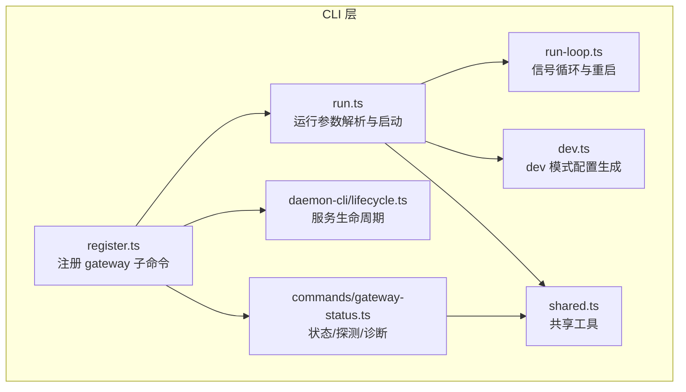
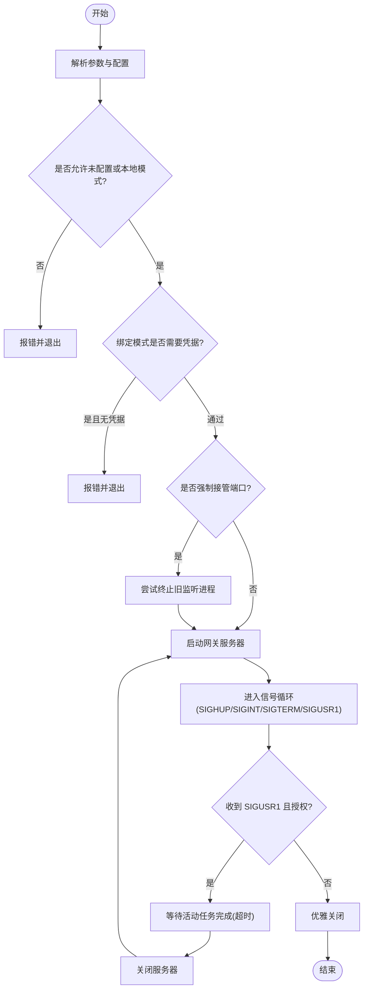
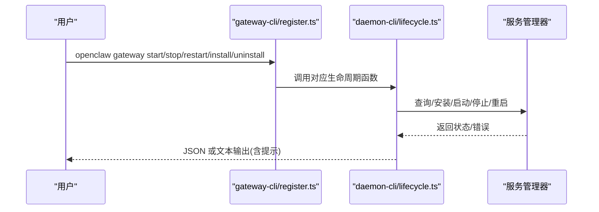
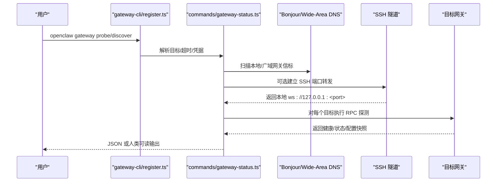
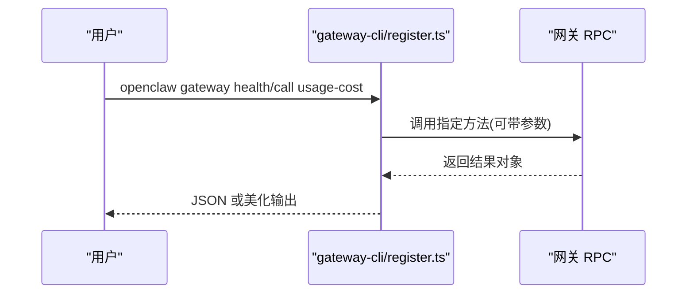
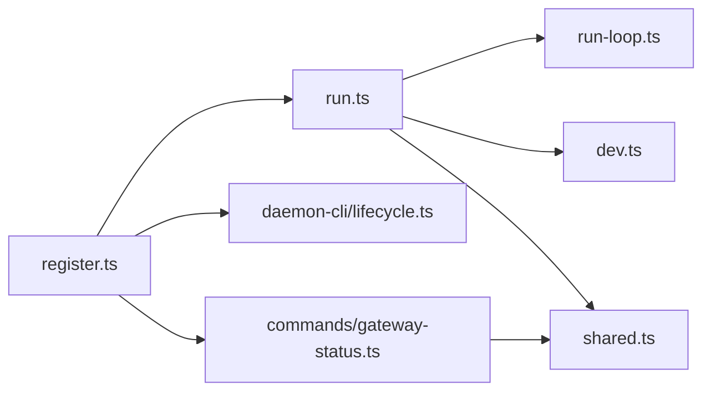

# 网关管理命令

<cite>
**本文引用的文件**
- [docs/cli/gateway.md](file://docs/cli/gateway.md)
- [docs/gateway/index.md](file://docs/gateway/index.md)
- [src/cli/gateway-cli.ts](file://src/cli/gateway-cli.ts)
- [src/cli/gateway-cli/register.ts](file://src/cli/gateway-cli/register.ts)
- [src/cli/gateway-cli/run.ts](file://src/cli/gateway-cli/run.ts)
- [src/cli/gateway-cli/run-loop.ts](file://src/cli/gateway-cli/run-loop.ts)
- [src/cli/gateway-cli/dev.ts](file://src/cli/gateway-cli/dev.ts)
- [src/cli/gateway-cli/shared.ts](file://src/cli/gateway-cli/shared.ts)
- [src/cli/daemon-cli/lifecycle.ts](file://src/cli/daemon-cli/lifecycle.ts)
- [src/commands/gateway-status.ts](file://src/commands/gateway-status.ts)
</cite>

## 目录

1. [简介](#简介)
2. [项目结构](#项目结构)
3. [核心组件](#核心组件)
4. [架构总览](#架构总览)
5. [详细组件分析](#详细组件分析)
6. [依赖关系分析](#依赖关系分析)
7. [性能考量](#性能考量)
8. [故障排除指南](#故障排除指南)
9. [结论](#结论)
10. [附录](#附录)

## 简介

本文件系统化梳理 OpenClaw 网关管理命令，覆盖网关启动、停止、重启、状态查询、健康检查、诊断、服务生命周期管理、发现与探测、日志与调试、安全与权限、网络与远程访问等主题。内容基于 CLI 文档与源码实现，帮助运维与开发者快速掌握从本地开发到生产运行的完整操作链路。

## 项目结构

围绕“网关管理命令”的相关模块分布如下：

- CLI 注册与子命令：gateway-cli/register.ts 定义 openclaw gateway 子命令族（run/status/install/start/stop/restart/call/discover/probe/usage-cost）
- 运行时与守护进程：gateway-cli/run.ts 负责参数解析、配置校验、端口占用处理、认证解析与启动；run-loop.ts 实现信号驱动的优雅关闭与原地重启
- 服务生命周期：daemon-cli/lifecycle.ts 封装 launchd/systemd/schtasks 的安装、启动、停止、重启、卸载
- 状态与诊断：commands/gateway-status.ts 提供多目标探测、SSH 隧道、广域发现、健康摘要输出
- 开发辅助：gateway-cli/dev.ts 生成 dev 模式配置与工作区
- 共享工具：gateway-cli/shared.ts 提供端口解析、错误描述、配置键误用检测、平台提示



**图表来源**

- [src/cli/gateway-cli/register.ts](file://src/cli/gateway-cli/register.ts#L121-L360)
- [src/cli/gateway-cli/run.ts](file://src/cli/gateway-cli/run.ts#L54-L309)
- [src/cli/gateway-cli/run-loop.ts](file://src/cli/gateway-cli/run-loop.ts#L15-L127)
- [src/cli/daemon-cli/lifecycle.ts](file://src/cli/daemon-cli/lifecycle.ts#L83-L319)
- [src/commands/gateway-status.ts](file://src/commands/gateway-status.ts#L24-L344)
- [src/cli/gateway-cli/dev.ts](file://src/cli/gateway-cli/dev.ts#L90-L130)
- [src/cli/gateway-cli/shared.ts](file://src/cli/gateway-cli/shared.ts#L10-L126)

**章节来源**

- [docs/cli/gateway.md](file://docs/cli/gateway.md#L1-L203)
- [docs/gateway/index.md](file://docs/gateway/index.md#L1-L255)

## 核心组件

- 网关运行命令（gateway run/run）：负责端口解析、绑定模式、认证模式与凭据、Tailscale 暴露、强制端口接管、日志风格与原始流输出、dev 模式初始化与重置
- 网关服务生命周期（gateway install/start/stop/restart/uninstall）：封装跨平台服务管理器（launchd/systemd/schtasks），支持 JSON 输出与提示信息
- 网关状态与探测（gateway status/probe/discover）：多目标探测、本地/远程、SSH 隧道、广域 Bonjour 发现、健康摘要与配置摘要
- 低层调用（gateway call/usage-cost）：通过 RPC 方法名直接调用网关方法，支持参数与 JSON 输出
- 健康检查（gateway health）：返回健康状态与通道健康明细，带耗时统计

**章节来源**

- [src/cli/gateway-cli/register.ts](file://src/cli/gateway-cli/register.ts#L121-L360)
- [src/cli/gateway-cli/run.ts](file://src/cli/gateway-cli/run.ts#L54-L309)
- [src/cli/daemon-cli/lifecycle.ts](file://src/cli/daemon-cli/lifecycle.ts#L83-L319)
- [src/commands/gateway-status.ts](file://src/commands/gateway-status.ts#L24-L344)

## 架构总览

下图展示“网关管理命令”的关键交互：CLI 子命令将用户输入转换为运行时行为，运行时根据配置与环境变量解析参数，启动或控制网关进程，并在必要时通过 SSH 隧道或服务管理器进行远程/系统级操作。

```mermaid
sequenceDiagram
participant U as "用户"
participant CLI as "gateway-cli/register.ts"
participant RUN as "gateway-cli/run.ts"
participant LOOP as "gateway-cli/run-loop.ts"
participant LIFE as "daemon-cli/lifecycle.ts"
participant STAT as "commands/gateway-status.ts"
U->>CLI : 执行 openclaw gateway <subcmd> [options]
CLI->>RUN : 解析参数/配置/认证/Tailscale
RUN->>LOOP : 启动服务器并进入信号循环
U->>CLI : gateway status/probe/discover
CLI->>STAT : 多目标探测/SSH隧道/广域发现
U->>CLI : gateway install/start/stop/restart
CLI->>LIFE : 调用对应生命周期函数
LIFE-->>U : JSON/文本输出结果与提示
```

**图表来源**

- [src/cli/gateway-cli/register.ts](file://src/cli/gateway-cli/register.ts#L121-L360)
- [src/cli/gateway-cli/run.ts](file://src/cli/gateway-cli/run.ts#L54-L309)
- [src/cli/gateway-cli/run-loop.ts](file://src/cli/gateway-cli/run-loop.ts#L15-L127)
- [src/cli/daemon-cli/lifecycle.ts](file://src/cli/daemon-cli/lifecycle.ts#L83-L319)
- [src/commands/gateway-status.ts](file://src/commands/gateway-status.ts#L24-L344)

## 详细组件分析

### 启动与运行（gateway run/run）

- 关键职责
  - 参数解析：端口、绑定模式、认证模式与凭据、Tailscale 模式与退出重置、dev 模式与重置、强制接管端口、日志风格、原始流输出
  - 配置校验：要求本地模式或允许未配置；非 loopback 绑定需凭据；token/password 配置正确
  - 启动流程：获取锁、启动服务器、信号循环（SIGINT/SIGTERM 优雅退出；SIGUSR1 受限授权后原地重启）
- 重要选项
  - --port/--bind/--auth/--token/--password/--tailscale/--tailscale-reset-on-exit/--allow-unconfigured/--dev/--reset/--force/--verbose/--claude-cli-logs/--ws-log/--compact/--raw-stream/--raw-stream-path



**图表来源**

- [src/cli/gateway-cli/run.ts](file://src/cli/gateway-cli/run.ts#L54-L309)
- [src/cli/gateway-cli/run-loop.ts](file://src/cli/gateway-cli/run-loop.ts#L15-L127)

**章节来源**

- [src/cli/gateway-cli/run.ts](file://src/cli/gateway-cli/run.ts#L54-L309)
- [src/cli/gateway-cli/run-loop.ts](file://src/cli/gateway-cli/run-loop.ts#L15-L127)
- [src/cli/gateway-cli/dev.ts](file://src/cli/gateway-cli/dev.ts#L90-L130)
- [src/cli/gateway-cli/shared.ts](file://src/cli/gateway-cli/shared.ts#L10-L126)

### 服务生命周期（gateway install/start/stop/restart/uninstall）

- 关键职责
  - 安装/卸载：检测服务是否已加载，必要时先停止再卸载；卸载后确认未加载
  - 启动/停止/重启：检查服务状态，失败时给出平台相关提示；Linux 下若 systemd 用户服务不可用，补充提示
  - JSON 输出：统一以 JSON 结构返回结果、消息、错误与服务快照
- 平台适配
  - macOS：launchd
  - Linux：systemd 用户服务/系统服务
  - Windows：schtasks



**图表来源**

- [src/cli/gateway-cli/register.ts](file://src/cli/gateway-cli/register.ts#L156-L198)
- [src/cli/daemon-cli/lifecycle.ts](file://src/cli/daemon-cli/lifecycle.ts#L83-L319)

**章节来源**

- [src/cli/gateway-cli/register.ts](file://src/cli/gateway-cli/register.ts#L156-L198)
- [src/cli/daemon-cli/lifecycle.ts](file://src/cli/daemon-cli/lifecycle.ts#L83-L319)

### 状态与诊断（gateway status/probe/discover）

- gateway status
  - 支持 JSON 输出、深度扫描系统服务、RPC 探测超时、跳过探测
  - 输出服务状态与可选 RPC 探测结果
- gateway probe
  - “调试一切”命令：同时探测已配置远程网关与本机回环网关
  - 支持 SSH 目标、自动选择首个发现主机、统一凭据传递
- gateway discover
  - 本地 mDNS 与可选广域 Bonjour（Split DNS）扫描
  - 去重、排序、输出机器可读 JSON 或人类可读列表



**图表来源**

- [src/cli/gateway-cli/register.ts](file://src/cli/gateway-cli/register.ts#L272-L287)
- [src/cli/gateway-cli/register.ts](file://src/cli/gateway-cli/register.ts#L289-L358)
- [src/commands/gateway-status.ts](file://src/commands/gateway-status.ts#L24-L344)

**章节来源**

- [src/cli/gateway-cli/register.ts](file://src/cli/gateway-cli/register.ts#L137-L154)
- [src/cli/gateway-cli/register.ts](file://src/cli/gateway-cli/register.ts#L272-L287)
- [src/cli/gateway-cli/register.ts](file://src/cli/gateway-cli/register.ts#L289-L358)
- [src/commands/gateway-status.ts](file://src/commands/gateway-status.ts#L24-L344)

### 健康检查与低层调用（gateway health/gateway call/usage-cost）

- gateway health
  - 返回健康 OK 与耗时；通道健康按状态着色显示
- gateway call
  - 通用 RPC 调用，支持参数 JSON 传入，输出 JSON 或美化文本
- usage-cost
  - 从会话日志汇总成本与 token 使用，支持天数参数



**图表来源**

- [src/cli/gateway-cli/register.ts](file://src/cli/gateway-cli/register.ts#L245-L270)
- [src/cli/gateway-cli/register.ts](file://src/cli/gateway-cli/register.ts#L200-L243)

**章节来源**

- [src/cli/gateway-cli/register.ts](file://src/cli/gateway-cli/register.ts#L245-L270)
- [src/cli/gateway-cli/register.ts](file://src/cli/gateway-cli/register.ts#L200-L243)

### 日志查看、调试模式与远程连接

- 日志与调试
  - --verbose：开启详细日志
  - --claude-cli-logs：仅输出 claude-cli 子系统日志并启用其 stdout/stderr
  - --ws-log/--compact：WebSocket 日志样式（auto/full/compact）
  - --raw-stream/--raw-stream-path：原始模型流事件写入 jsonl 文件
- 远程连接
  - SSH 端口转发：将远端网关（可能仅回环绑定）映射到本地 127.0.0.1:<port>
  - CLI 等价于在本地通过 ws://127.0.0.1:<port> 访问远端网关
  - 支持自动推断 SSH 目标（从 Bonjour 发现结果）

**章节来源**

- [docs/cli/gateway.md](file://docs/cli/gateway.md#L30-L62)
- [docs/gateway/index.md](file://docs/gateway/index.md#L101-L116)
- [src/cli/gateway-cli/register.ts](file://src/cli/gateway-cli/register.ts#L272-L287)
- [src/commands/gateway-status.ts](file://src/commands/gateway-status.ts#L83-L183)

### 安全配置、权限管理与网络设置

- 认证与绑定
  - 默认要求认证；非 loopback 绑定必须配置 token/password
  - 支持 token/password 两种模式，可通过配置或 CLI 覆盖
  - 支持 Tailscale 暴露（serve/funnel/off），支持退出时重置
- 权限与提示
  - 若检测到配置中的误用键（如旧版 gateway.token 或远程专用 gateway.remote.token），给出迁移提示
  - 当服务已加载但无法启动时，提供平台相关停止指令提示

**章节来源**

- [docs/cli/gateway.md](file://docs/cli/gateway.md#L36-L62)
- [src/cli/gateway-cli/run.ts](file://src/cli/gateway-cli/run.ts#L164-L258)
- [src/cli/gateway-cli/shared.ts](file://src/cli/gateway-cli/shared.ts#L66-L82)
- [src/cli/gateway-cli/shared.ts](file://src/cli/gateway-cli/shared.ts#L107-L126)

## 依赖关系分析

- CLI 注册层依赖运行时与守护进程实现
- 运行时依赖配置解析、端口占用检测、锁机制、日志过滤与子系统日志器
- 状态命令依赖 Bonjour/广域 DNS、SSH 隧道、网关探测与配置摘要提取
- 生命周期命令依赖服务抽象与平台检测



**图表来源**

- [src/cli/gateway-cli/register.ts](file://src/cli/gateway-cli/register.ts#L121-L360)
- [src/cli/gateway-cli/run.ts](file://src/cli/gateway-cli/run.ts#L54-L309)
- [src/cli/gateway-cli/run-loop.ts](file://src/cli/gateway-cli/run-loop.ts#L15-L127)
- [src/cli/daemon-cli/lifecycle.ts](file://src/cli/daemon-cli/lifecycle.ts#L83-L319)
- [src/commands/gateway-status.ts](file://src/commands/gateway-status.ts#L24-L344)
- [src/cli/gateway-cli/dev.ts](file://src/cli/gateway-cli/dev.ts#L90-L130)
- [src/cli/gateway-cli/shared.ts](file://src/cli/gateway-cli/shared.ts#L10-L126)

**章节来源**

- [src/cli/gateway-cli/register.ts](file://src/cli/gateway-cli/register.ts#L121-L360)
- [src/cli/gateway-cli/run.ts](file://src/cli/gateway-cli/run.ts#L54-L309)
- [src/cli/gateway-cli/run-loop.ts](file://src/cli/gateway-cli/run-loop.ts#L15-L127)
- [src/cli/daemon-cli/lifecycle.ts](file://src/cli/daemon-cli/lifecycle.ts#L83-L319)
- [src/commands/gateway-status.ts](file://src/commands/gateway-status.ts#L24-L344)
- [src/cli/gateway-cli/dev.ts](file://src/cli/gateway-cli/dev.ts#L90-L130)
- [src/cli/gateway-cli/shared.ts](file://src/cli/gateway-cli/shared.ts#L10-L126)

## 性能考量

- 探测预算与超时：status/probe/discover 均支持整体超时与目标级预算分配，避免长时间阻塞
- 端口接管策略：强制接管前会尝试优雅终止旧监听进程，并可记录等待时间与是否升级为 SIGKILL
- 重启排水：SIGUSR1 触发的原地重启会等待活动任务完成后再关闭服务器，减少消息丢失
- 日志开销：WebSocket 日志样式与原始流输出可按需开启，避免在高吞吐场景下产生额外 IO

[本节为通用指导，不直接分析具体文件]

## 故障排除指南

- 常见签名与定位
  - “拒绝绑定到非回环且无认证”：检查 token/password 配置或改为 loopback 绑定
  - “另一个网关实例已在监听”/“EADDRINUSE”：端口冲突，使用 --force 强制接管或更换端口
  - “网关启动被阻止：请设置 gateway.mode=local”：当前配置为远程模式，使用 --allow-unconfigured 或调整配置
  - “未授权”：客户端与网关认证不一致，核对 token/password
- 诊断步骤
  - 使用 gateway status 核查服务状态与 RPC 探测
  - 使用 gateway probe 同时探测远程与本地网关，必要时通过 --ssh 建立隧道
  - 使用 gateway discover 查看本地/广域网关信标
  - 使用 gateway health 获取健康摘要与通道状态
- 平台提示
  - Linux 若 systemd 用户服务不可用，将给出替代提示
  - macOS/Linux/Windows 分别提供服务停止的命令提示

**章节来源**

- [docs/gateway/index.md](file://docs/gateway/index.md#L228-L237)
- [src/cli/gateway-cli/run.ts](file://src/cli/gateway-cli/run.ts#L283-L308)
- [src/cli/daemon-cli/lifecycle.ts](file://src/cli/daemon-cli/lifecycle.ts#L122-L128)
- [src/cli/gateway-cli/shared.ts](file://src/cli/gateway-cli/shared.ts#L107-L126)

## 结论

OpenClaw 网关管理命令提供了从本地开发到生产运行的一体化操作面：既能在 CLI 中完成启动、停止、重启与健康检查，也能通过服务管理器实现跨平台守护；配合探测与诊断命令，可快速定位网络与认证问题；通过日志与调试选项，便于在复杂场景下进行排障与性能观测。

[本节为总结性内容，不直接分析具体文件]

## 附录

- 快速上手（5 分钟本地启动）
  - 启动：openclaw gateway --port 18789
  - 调试：openclaw gateway --port 18789 --verbose
  - 强制接管：openclaw gateway --force
  - 校验健康：openclaw gateway status / openclaw status / openclaw logs --follow
- 远程访问
  - SSH 端口转发：ssh -N -L 18789:127.0.0.1:18789 user@host
  - 本地客户端连接：ws://127.0.0.1:18789
- 常用命令清单
  - 启动/停止/重启/安装/卸载：openclaw gateway start/stop/restart/install/uninstall
  - 状态与健康：openclaw gateway status / openclaw gateway health
  - 诊断与发现：openclaw gateway probe / openclaw gateway discover
  - 低层调用：openclaw gateway call <method> [--params '...']
  - 成本统计：openclaw gateway usage-cost [--days N]

**章节来源**

- [docs/gateway/index.md](file://docs/gateway/index.md#L21-L116)
- [docs/cli/gateway.md](file://docs/cli/gateway.md#L22-L203)
