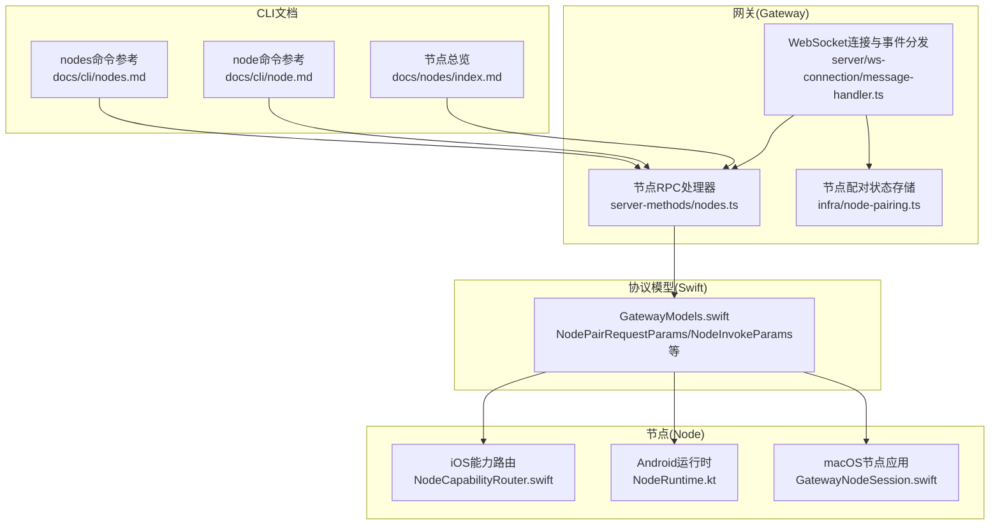
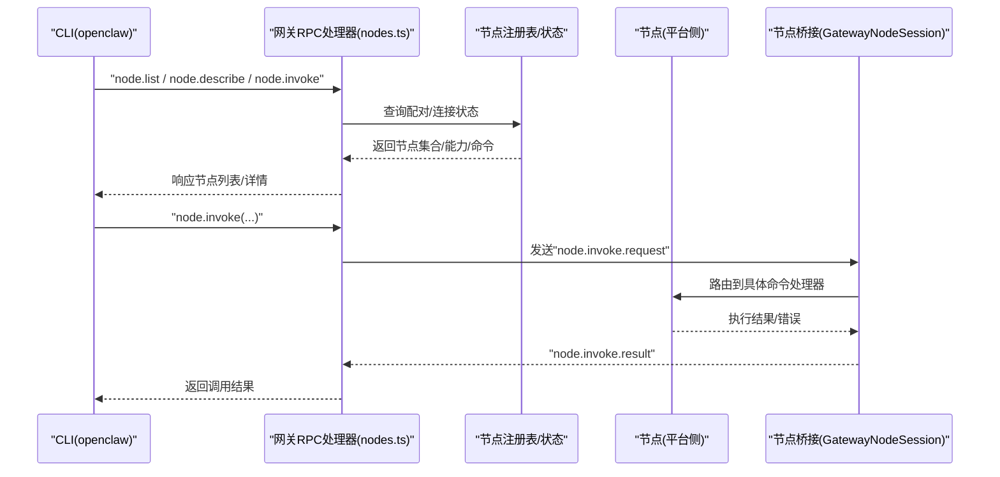
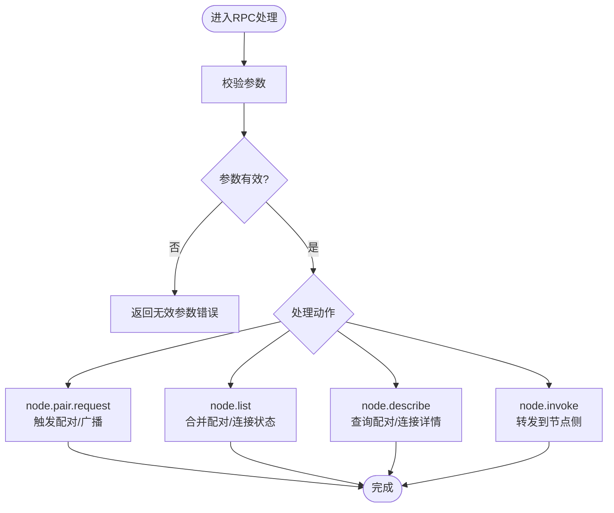
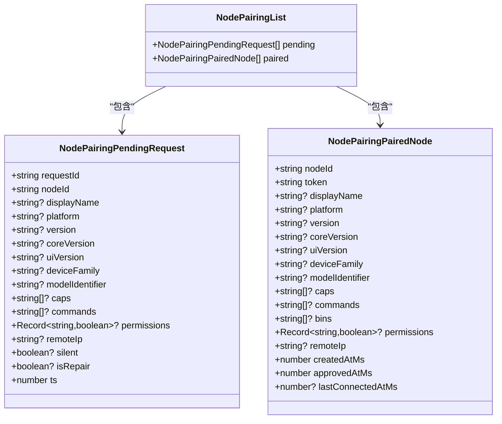
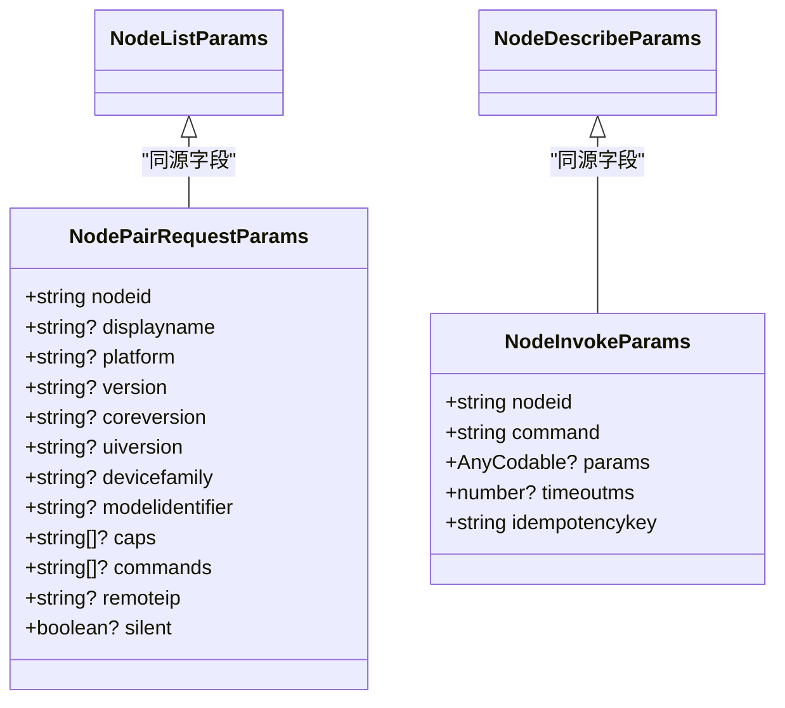
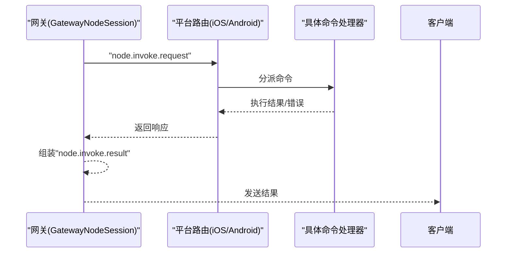
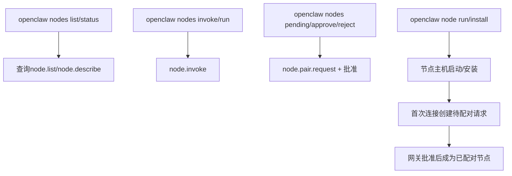
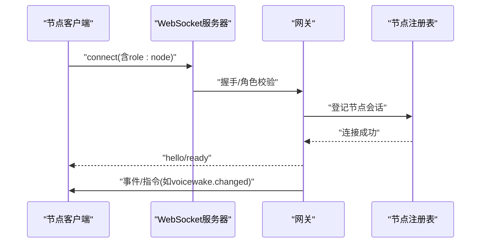
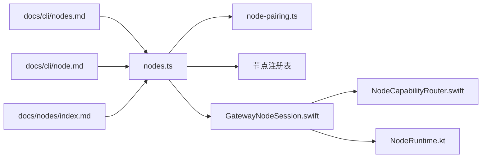

# 节点管理命令

<cite>
**本文引用的文件**
- [src/gateway/server-methods/nodes.ts](file://src/gateway/server-methods/nodes.ts)
- [src/infra/node-pairing.ts](file://src/infra/node-pairing.ts)
- [apps/shared/OpenClawKit/Sources/OpenClawProtocol/GatewayModels.swift](file://apps/shared/OpenClawKit/Sources/OpenClawProtocol/GatewayModels.swift)
- [apps/macos/Sources/OpenClawProtocol/GatewayModels.swift](file://apps/macos/Sources/OpenClawProtocol/GatewayModels.swift)
- [apps/shared/OpenClawKit/Sources/OpenClawKit/GatewayNodeSession.swift](file://apps/shared/OpenClawKit/Sources/OpenClawKit/GatewayNodeSession.swift)
- [apps/ios/Sources/Capabilities/NodeCapabilityRouter.swift](file://apps/ios/Sources/Capabilities/NodeCapabilityRouter.swift)
- [apps/ios/Sources/Model/NodeAppModel.swift](file://apps/ios/Sources/Model/NodeAppModel.swift)
- [apps/android/app/src/main/java/ai/openclaw/android/NodeRuntime.kt](file://apps/android/app/src/main/java/ai/openclaw/android/NodeRuntime.kt)
- [docs/cli/nodes.md](file://docs/cli/nodes.md)
- [docs/cli/node.md](file://docs/cli/node.md)
- [docs/nodes/index.md](file://docs/nodes/index.md)
- [docs/nodes/troubleshooting.md](file://docs/nodes/troubleshooting.md)
- [src/gateway/server.ios-client-id.e2e.test.ts](file://src/gateway/server.ios-client-id.e2e.test.ts)
- [src/gateway/server.roles-allowlist-update.e2e.test.ts](file://src/gateway/server.roles-allowlist-update.e2e.test.ts)
- [scripts/dev/ios-node-e2e.ts](file://scripts/dev/ios-node-e2e.ts)
- [src/gateway/server/ws-connection/message-handler.ts](file://src/gateway/server/ws-connection/message-handler.ts)
- [src/infra/skills-remote.ts](file://src/infra/skills-remote.ts)
</cite>

## 目录

1. [简介](#简介)
2. [项目结构](#项目结构)
3. [核心组件](#核心组件)
4. [架构总览](#架构总览)
5. [详细组件分析](#详细组件分析)
6. [依赖关系分析](#依赖关系分析)
7. [性能考量](#性能考量)
8. [故障排查指南](#故障排查指南)
9. [结论](#结论)
10. [附录](#附录)

## 简介

本文件面向OpenClaw节点管理命令的使用者与维护者，系统化梳理节点的发现、配对、连接、状态查询、命令调用、设备控制与媒体管理、配置与权限、安全认证、批量管理、自动发现与远程控制等能力。文档以仓库中的实现与官方文档为依据，结合协议模型与端到端测试，帮助读者快速掌握节点生命周期与操作方法。

## 项目结构

围绕“节点管理命令”，相关代码与文档主要分布在以下区域：

- 网关侧节点RPC处理：gateway/server-methods/nodes.ts
- 节点配对状态存储：infra/node-pairing.ts
- 协议模型（Swift）：OpenClawProtocol/GatewayModels.swift（共享与macOS）
- 节点会话与调用桥接：OpenClawKit/GatewayNodeSession.swift
- 平台侧能力路由与实现：iOS NodeCapabilityRouter.swift、NodeAppModel.swift；Android NodeRuntime.kt
- CLI参考与使用说明：docs/cli/nodes.md、docs/cli/node.md、docs/nodes/index.md
- 故障排查：docs/nodes/troubleshooting.md
- 端到端测试与协议交互：gateway/\*.e2e.test.ts、scripts/dev/ios-node-e2e.ts
- 连接建立与事件分发：gateway/server/ws-connection/message-handler.ts
- 远程技能缓存与平台识别：infra/skills-remote.ts

**图表来源**

- [src/gateway/server-methods/nodes.ts](file://src/gateway/server-methods/nodes.ts#L65-L337)
- [src/infra/node-pairing.ts](file://src/infra/node-pairing.ts#L1-L55)
- [apps/shared/OpenClawKit/Sources/OpenClawProtocol/GatewayModels.swift](file://apps/shared/OpenClawKit/Sources/OpenClawProtocol/GatewayModels.swift#L635-L823)
- [apps/macos/Sources/OpenClawProtocol/GatewayModels.swift](file://apps/macos/Sources/OpenClawProtocol/GatewayModels.swift#L635-L713)
- [apps/shared/OpenClawKit/Sources/OpenClawKit/GatewayNodeSession.swift](file://apps/shared/OpenClawKit/Sources/OpenClawKit/GatewayNodeSession.swift#L340-L398)
- [apps/ios/Sources/Capabilities/NodeCapabilityRouter.swift](file://apps/ios/Sources/Capabilities/NodeCapabilityRouter.swift#L1-L25)
- [apps/android/app/src/main/java/ai/openclaw/android/NodeRuntime.kt](file://apps/android/app/src/main/java/ai/openclaw/android/NodeRuntime.kt#L828-L855)
- [docs/cli/nodes.md](file://docs/cli/nodes.md#L1-L74)
- [docs/cli/node.md](file://docs/cli/node.md#L1-L113)
- [docs/nodes/index.md](file://docs/nodes/index.md#L1-L343)

**章节来源**

- [src/gateway/server-methods/nodes.ts](file://src/gateway/server-methods/nodes.ts#L65-L337)
- [src/infra/node-pairing.ts](file://src/infra/node-pairing.ts#L1-L55)
- [apps/shared/OpenClawKit/Sources/OpenClawProtocol/GatewayModels.swift](file://apps/shared/OpenClawProtocol/GatewayModels.swift#L635-L823)
- [apps/macos/Sources/OpenClawProtocol/GatewayModels.swift](file://apps/macos/Sources/OpenClawProtocol/GatewayModels.swift#L635-L713)
- [apps/shared/OpenClawKit/Sources/OpenClawKit/GatewayNodeSession.swift](file://apps/shared/OpenClawKit/Sources/OpenClawKit/GatewayNodeSession.swift#L340-L398)
- [apps/ios/Sources/Capabilities/NodeCapabilityRouter.swift](file://apps/ios/Sources/Capabilities/NodeCapabilityRouter.swift#L1-L25)
- [apps/android/app/src/main/java/ai/openclaw/android/NodeRuntime.kt](file://apps/android/app/src/main/java/ai/openclaw/android/NodeRuntime.kt#L828-L855)
- [docs/cli/nodes.md](file://docs/cli/nodes.md#L1-L74)
- [docs/cli/node.md](file://docs/cli/node.md#L1-L113)
- [docs/nodes/index.md](file://docs/nodes/index.md#L1-L343)

## 核心组件

- 节点RPC处理器：提供节点配对请求、节点列表、节点描述、节点调用等RPC接口，负责参数校验、状态查询与广播通知。
- 节点配对状态存储：定义待配对与已配对节点的数据结构，支持持久化与过期清理。
- 协议模型：定义节点配对、节点调用、节点列表、节点描述等请求/响应参数结构，跨平台一致。
- 节点会话与调用桥接：在节点侧接收“node.invoke.request”，解码后路由到具体命令处理器，并返回结果。
- 平台侧能力路由与实现：iOS/Android/macOS根据能力与权限决定是否执行命令或返回错误码。
- CLI参考与使用说明：提供nodes与node命令的完整用法、参数与示例。
- 端到端测试与协议交互：验证WebSocket握手、角色与命令声明、事件分发与超时处理。
- 远程技能缓存：基于配对信息与命令集更新远程节点能力快照。

**章节来源**

- [src/gateway/server-methods/nodes.ts](file://src/gateway/server-methods/nodes.ts#L65-L337)
- [src/infra/node-pairing.ts](file://src/infra/node-pairing.ts#L1-L55)
- [apps/shared/OpenClawKit/Sources/OpenClawProtocol/GatewayModels.swift](file://apps/shared/OpenClawProtocol/GatewayModels.swift#L635-L823)
- [apps/shared/OpenClawKit/Sources/OpenClawKit/GatewayNodeSession.swift](file://apps/shared/OpenClawKit/Sources/OpenClawKit/GatewayNodeSession.swift#L340-L398)
- [apps/ios/Sources/Capabilities/NodeCapabilityRouter.swift](file://apps/ios/Sources/Capabilities/NodeCapabilityRouter.swift#L1-L25)
- [apps/android/app/src/main/java/ai/openclaw/android/NodeRuntime.kt](file://apps/android/app/src/main/java/ai/openclaw/android/NodeRuntime.kt#L828-L855)
- [docs/cli/nodes.md](file://docs/cli/nodes.md#L1-L74)
- [docs/cli/node.md](file://docs/cli/node.md#L1-L113)
- [src/gateway/server.ws-connection/message-handler.ts](file://src/gateway/server/ws-connection/message-handler.ts#L905-L932)
- [src/infra/skills-remote.ts](file://src/infra/skills-remote.ts#L77-L169)

## 架构总览

下图展示从CLI到网关RPC，再到节点侧命令执行的整体流程，以及配对状态与权限控制的关键节点。

**图表来源**

- [src/gateway/server-methods/nodes.ts](file://src/gateway/server-methods/nodes.ts#L231-L337)
- [apps/shared/OpenClawKit/Sources/OpenClawKit/GatewayNodeSession.swift](file://apps/shared/OpenClawKit/Sources/OpenClawKit/GatewayNodeSession.swift#L340-L398)
- [apps/ios/Sources/Capabilities/NodeCapabilityRouter.swift](file://apps/ios/Sources/Capabilities/NodeCapabilityRouter.swift#L1-L25)
- [apps/android/app/src/main/java/ai/openclaw/android/NodeRuntime.kt](file://apps/android/app/src/main/java/ai/openclaw/android/NodeRuntime.kt#L828-L855)

## 详细组件分析

### 节点RPC接口与命令

- 节点配对请求
  - 方法：node.pair.request
  - 参数：nodeId、displayName、platform、version、coreVersion、uiVersion、deviceFamily、modelIdentifier、caps、commands、remoteIp、silent等
  - 行为：校验参数，触发配对流程，必要时广播“node.pair.requested”事件
- 节点列表
  - 方法：node.list
  - 行为：合并已配对与已连接节点，按连接状态与显示名排序，返回节点数组
- 节点描述
  - 方法：node.describe
  - 行为：查询指定nodeId的配对与连接状态，汇总能力与命令
- 节点调用
  - 方法：node.invoke
  - 行为：通过网关桥接转发到节点侧，节点侧路由到具体命令处理器，返回结果或错误

**图表来源**

- [src/gateway/server-methods/nodes.ts](file://src/gateway/server-methods/nodes.ts#L65-L337)

**章节来源**

- [src/gateway/server-methods/nodes.ts](file://src/gateway/server-methods/nodes.ts#L65-L337)

### 节点配对与状态存储

- 数据结构
  - 待配对请求：包含请求ID、节点ID、设备信息、能力、命令、权限、远端IP、静默标志、创建时间等
  - 已配对节点：包含节点ID、令牌、设备信息、能力、命令、二进制路径、权限、远端IP、创建/批准/最近连接时间等
  - 列表：pending/paired两个数组
- 生命周期
  - 待配对请求具备TTL（默认5分钟），过期自动清理
  - 首次连接创建待配对请求，后续批准后转为已配对

**图表来源**

- [src/infra/node-pairing.ts](file://src/infra/node-pairing.ts#L1-L55)

**章节来源**

- [src/infra/node-pairing.ts](file://src/infra/node-pairing.ts#L1-L55)

### 协议模型与参数

- 节点配对请求参数：nodeId、displayName、platform、version、coreVersion、uiVersion、deviceFamily、modelIdentifier、caps、commands、remoteIp、silent
- 节点调用参数：nodeId、command、params、timeoutMs、idempotencyKey
- 节点列表/描述参数：无额外参数，用于过滤与查询

**图表来源**

- [apps/shared/OpenClawKit/Sources/OpenClawProtocol/GatewayModels.swift](file://apps/shared/OpenClawKit/Sources/OpenClawProtocol/GatewayModels.swift#L635-L823)
- [apps/macos/Sources/OpenClawProtocol/GatewayModels.swift](file://apps/macos/Sources/OpenClawProtocol/GatewayModels.swift#L635-L713)

**章节来源**

- [apps/shared/OpenClawKit/Sources/OpenClawProtocol/GatewayModels.swift](file://apps/shared/OpenClawKit/Sources/OpenClawProtocol/GatewayModels.swift#L635-L823)
- [apps/macos/Sources/OpenClawProtocol/GatewayModels.swift](file://apps/macos/Sources/OpenClawProtocol/GatewayModels.swift#L635-L713)

### 节点调用桥接与平台实现

- 网关侧桥接
  - 接收“node.invoke.request”，解码请求，调用回调执行命令，发送“node.invoke.result”
- 平台侧路由
  - iOS：NodeCapabilityRouter根据命令查找处理器，未知命令返回错误
  - Android：前置检查前台与权限，不满足条件直接返回错误码
  - macOS：GatewayNodeSession负责事件广播与结果回传

**图表来源**

- [apps/shared/OpenClawKit/Sources/OpenClawKit/GatewayNodeSession.swift](file://apps/shared/OpenClawKit/Sources/OpenClawKit/GatewayNodeSession.swift#L340-L398)
- [apps/ios/Sources/Capabilities/NodeCapabilityRouter.swift](file://apps/ios/Sources/Capabilities/NodeCapabilityRouter.swift#L1-L25)
- [apps/android/app/src/main/java/ai/openclaw/android/NodeRuntime.kt](file://apps/android/app/src/main/java/ai/openclaw/android/NodeRuntime.kt#L828-L855)

**章节来源**

- [apps/shared/OpenClawKit/Sources/OpenClawKit/GatewayNodeSession.swift](file://apps/shared/OpenClawKit/Sources/OpenClawKit/GatewayNodeSession.swift#L340-L398)
- [apps/ios/Sources/Capabilities/NodeCapabilityRouter.swift](file://apps/ios/Sources/Capabilities/NodeCapabilityRouter.swift#L1-L25)
- [apps/android/app/src/main/java/ai/openclaw/android/NodeRuntime.kt](file://apps/android/app/src/main/java/ai/openclaw/android/NodeRuntime.kt#L828-L855)

### CLI命令与使用示例

- nodes命令族
  - list/status：列出/查看节点状态，支持筛选“仅已连接”、“最近连接时间窗口”
  - pending/approve/reject：查看待配对请求并批准/拒绝
  - invoke/run：调用节点命令，支持参数、超时、幂等键、代理执行等
- node命令族（节点主机）
  - run/install：前台/后台运行节点主机，支持TLS指纹校验、节点ID/显示名覆盖
  - status/stop/restart/uninstall：服务管理
  - 配对与命名：首次连接创建待配对请求，随后批准；支持重命名

**图表来源**

- [docs/cli/nodes.md](file://docs/cli/nodes.md#L1-L74)
- [docs/cli/node.md](file://docs/cli/node.md#L1-L113)
- [docs/nodes/index.md](file://docs/nodes/index.md#L1-L343)

**章节来源**

- [docs/cli/nodes.md](file://docs/cli/nodes.md#L1-L74)
- [docs/cli/node.md](file://docs/cli/node.md#L1-L113)
- [docs/nodes/index.md](file://docs/nodes/index.md#L1-L343)

### 节点间通信协议与数据传输

- WebSocket握手与角色声明
  - 客户端声明role为node，提供commands、caps、permissions等
  - 网关校验协议版本与角色，建立会话
- 事件与帧格式
  - 请求/响应：req/res
  - 事件：event
  - 端到端测试验证消息类型与等待响应
- 连接建立后的事件分发
  - 更新远程节点信息、刷新可执行二进制探针、下发语音唤醒配置变更等

**图表来源**

- [src/gateway/server.ios-client-id.e2e.test.ts](file://src/gateway/server.ios-client-id.e2e.test.ts#L18-L54)
- [src/gateway/server.roles-allowlist-update.e2e.test.ts](file://src/gateway/server.roles-allowlist-update.e2e.test.ts#L49-L105)
- [scripts/dev/ios-node-e2e.ts](file://scripts/dev/ios-node-e2e.ts#L127-L180)
- [src/gateway/server/ws-connection/message-handler.ts](file://src/gateway/server/ws-connection/message-handler.ts#L905-L932)

**章节来源**

- [src/gateway/server.ios-client-id.e2e.test.ts](file://src/gateway/server.ios-client-id.e2e.test.ts#L18-L54)
- [src/gateway/server.roles-allowlist-update.e2e.test.ts](file://src/gateway/server.roles-allowlist-update.e2e.test.ts#L49-L105)
- [scripts/dev/ios-node-e2e.ts](file://scripts/dev/ios-node-e2e.ts#L127-L180)
- [src/gateway/server/ws-connection/message-handler.ts](file://src/gateway/server/ws-connection/message-handler.ts#L905-L932)

### 设备控制与媒体管理

- Canvas/屏幕截图/控制
  - canvas.snapshot、canvas.present、canvas.hide、canvas.navigate、canvas.eval
  - 支持A2UI推送与重置
- 相机/视频
  - camera.list、camera.snap、camera.clip
  - 持续时间限制、权限要求
- 屏幕录制
  - screen.record，支持音频开关、多屏选择
- 位置
  - location.get，支持精度与超时参数
- 系统命令
  - system.run/system.notify/system.execApprovals.get/set
  - 支持工作目录、环境变量、命令/调用超时、前台需求

**章节来源**

- [docs/nodes/index.md](file://docs/nodes/index.md#L145-L343)

### 配置管理、权限设置与安全认证

- 节点配对与批准
  - 首次连接创建待配对请求，随后批准成为已配对节点
- 权限映射
  - 节点可在列表/描述中携带permissions映射（如screenRecording/accessibility）
- 执行审批（节点主机）
  - system.run受本地执行审批策略约束，策略存储于节点主机
- 安全认证
  - WebSocket握手阶段进行角色与凭据校验
- 远程技能缓存
  - 基于配对信息与命令集更新远程节点能力快照，识别macOS节点与system.run能力

**章节来源**

- [docs/nodes/index.md](file://docs/nodes/index.md#L312-L343)
- [src/infra/skills-remote.ts](file://src/infra/skills-remote.ts#L77-L169)

### 批量管理、自动发现与远程控制

- 自动发现
  - 通过WebSocket连接与配对请求实现节点自动发现与配对
- 批量管理
  - 使用nodes list/status筛选与批量操作（批准/拒绝/重命名）
- 远程控制
  - 通过网关转发节点命令，支持system.run/system.which等远程执行
  - 支持SSH隧道场景下的远程节点主机连接

**章节来源**

- [docs/nodes/index.md](file://docs/nodes/index.md#L45-L144)

## 依赖关系分析

- 组件耦合
  - 网关RPC处理器依赖节点注册表与配对状态存储
  - 节点桥接依赖平台侧能力路由与命令实现
  - CLI文档与实现依赖网关RPC接口
- 外部依赖
  - WebSocket协议与事件模型
  - 平台侧权限与前台状态约束

**图表来源**

- [src/gateway/server-methods/nodes.ts](file://src/gateway/server-methods/nodes.ts#L65-L337)
- [src/infra/node-pairing.ts](file://src/infra/node-pairing.ts#L1-L55)
- [apps/shared/OpenClawKit/Sources/OpenClawKit/GatewayNodeSession.swift](file://apps/shared/OpenClawKit/Sources/OpenClawKit/GatewayNodeSession.swift#L340-L398)
- [apps/ios/Sources/Capabilities/NodeCapabilityRouter.swift](file://apps/ios/Sources/Capabilities/NodeCapabilityRouter.swift#L1-L25)
- [apps/android/app/src/main/java/ai/openclaw/android/NodeRuntime.kt](file://apps/android/app/src/main/java/ai/openclaw/android/NodeRuntime.kt#L828-L855)
- [docs/cli/nodes.md](file://docs/cli/nodes.md#L1-L74)
- [docs/cli/node.md](file://docs/cli/node.md#L1-L113)
- [docs/nodes/index.md](file://docs/nodes/index.md#L1-L343)

**章节来源**

- [src/gateway/server-methods/nodes.ts](file://src/gateway/server-methods/nodes.ts#L65-L337)
- [src/infra/node-pairing.ts](file://src/infra/node-pairing.ts#L1-L55)
- [apps/shared/OpenClawKit/Sources/OpenClawKit/GatewayNodeSession.swift](file://apps/shared/OpenClawKit/Sources/OpenClawKit/GatewayNodeSession.swift#L340-L398)
- [apps/ios/Sources/Capabilities/NodeCapabilityRouter.swift](file://apps/ios/Sources/Capabilities/NodeCapabilityRouter.swift#L1-L25)
- [apps/android/app/src/main/java/ai/openclaw/android/NodeRuntime.kt](file://apps/android/app/src/main/java/ai/openclaw/android/NodeRuntime.kt#L828-L855)
- [docs/cli/nodes.md](file://docs/cli/nodes.md#L1-L74)
- [docs/cli/node.md](file://docs/cli/node.md#L1-L113)
- [docs/nodes/index.md](file://docs/nodes/index.md#L1-L343)

## 性能考量

- 节点列表排序与去重：按连接状态与显示名排序，避免重复节点项
- 调用超时与幂等：invoke支持timeoutMs与idempotencyKey，减少重复执行与资源占用
- 远程技能缓存：基于配对信息与命令集更新快照，降低查询成本
- 媒体理解：并发度可控，默认并发2，避免过度占用资源

[本节为通用指导，无需特定文件来源]

## 故障排查指南

- 命令阶梯
  - 先看status/gateway status/logs/doctor，再检查nodes status/describe/执行审批
- 前台要求
  - canvas/camera/screen需前台运行，否则返回“NODE_BACKGROUND_UNAVAILABLE”
- 权限矩阵
  - 不同能力在iOS/Android/macOS上的权限差异明确，缺失权限导致“\*\_PERMISSION_REQUIRED”或类似错误
- 配对与审批
  - 设备配对与执行审批是两道不同的门，先确认配对，再检查执行审批策略与白名单

**章节来源**

- [docs/nodes/troubleshooting.md](file://docs/nodes/troubleshooting.md#L1-L113)

## 结论

OpenClaw的节点管理命令围绕“配对—连接—状态—调用—控制—媒体—权限—安全”的完整闭环展开。通过统一的RPC接口、一致的协议模型与严格的平台侧权限控制，用户可以在多平台节点之间进行高效、安全的协作与远程控制。CLI文档与端到端测试进一步保障了可用性与可维护性。

[本节为总结性内容，无需特定文件来源]

## 附录

- 常用命令速查
  - 节点列表/状态：openclaw nodes list/status
  - 查看待配对/批准：openclaw nodes pending/approve
  - 调用命令：openclaw nodes invoke/run
  - 节点主机：openclaw node run/install/status
- 关键参数
  - 节点调用：nodeId、command、params、timeoutMs、idempotencyKey
  - 节点配对：nodeId、displayName、platform、version、coreVersion、uiVersion、deviceFamily、modelIdentifier、caps、commands、remoteIp、silent

[本节为补充说明，无需特定文件来源]
