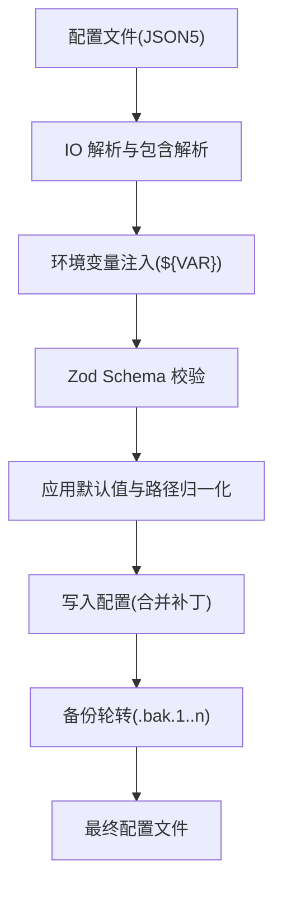
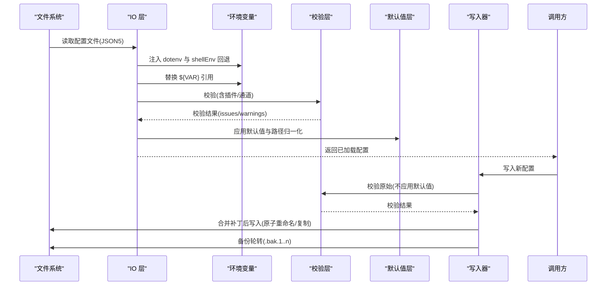
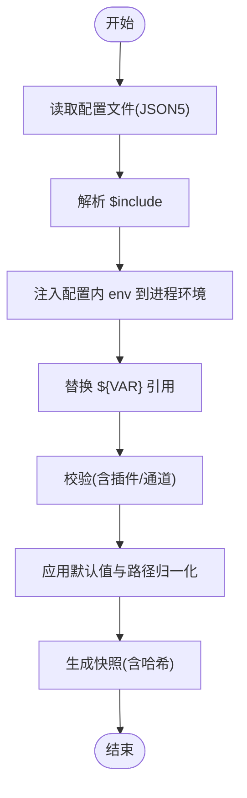
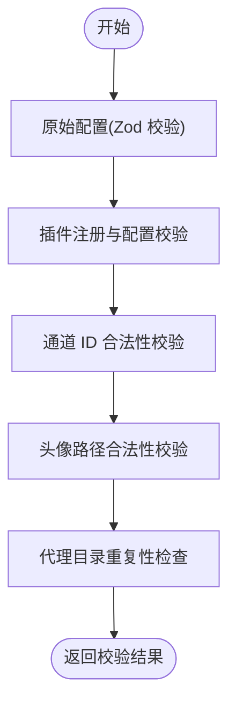
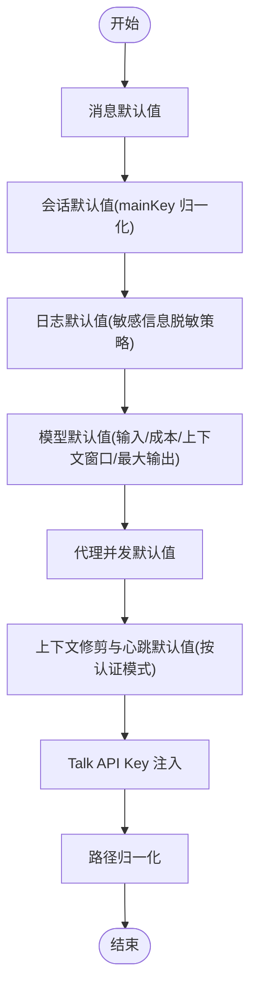
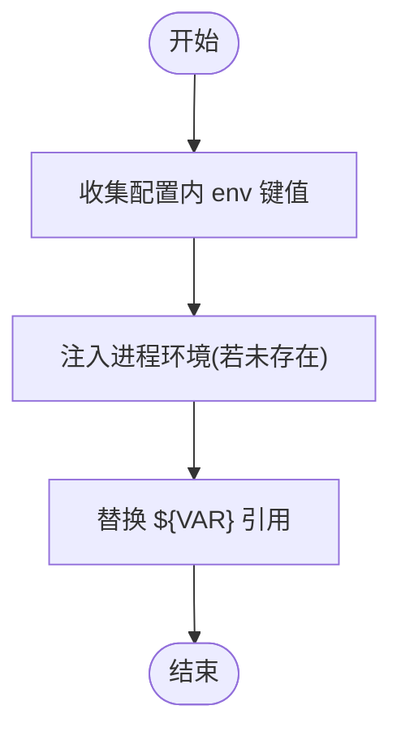
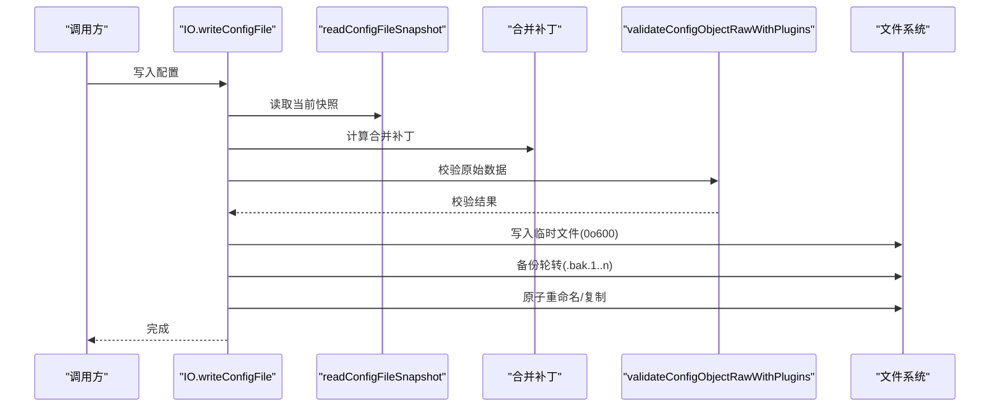
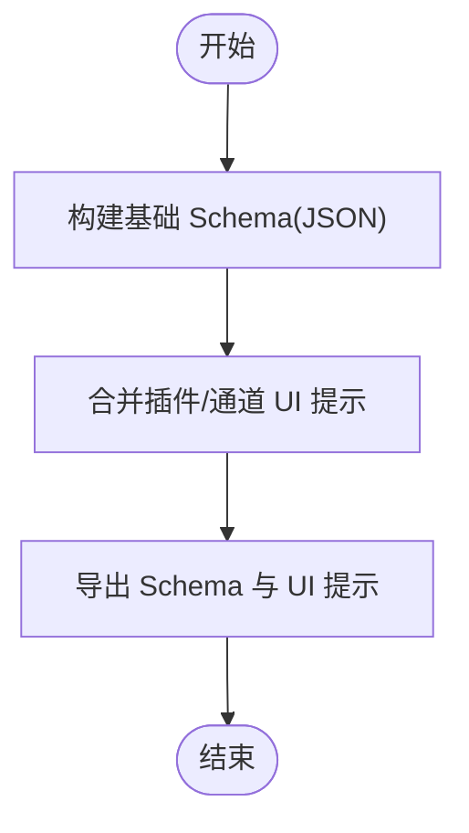
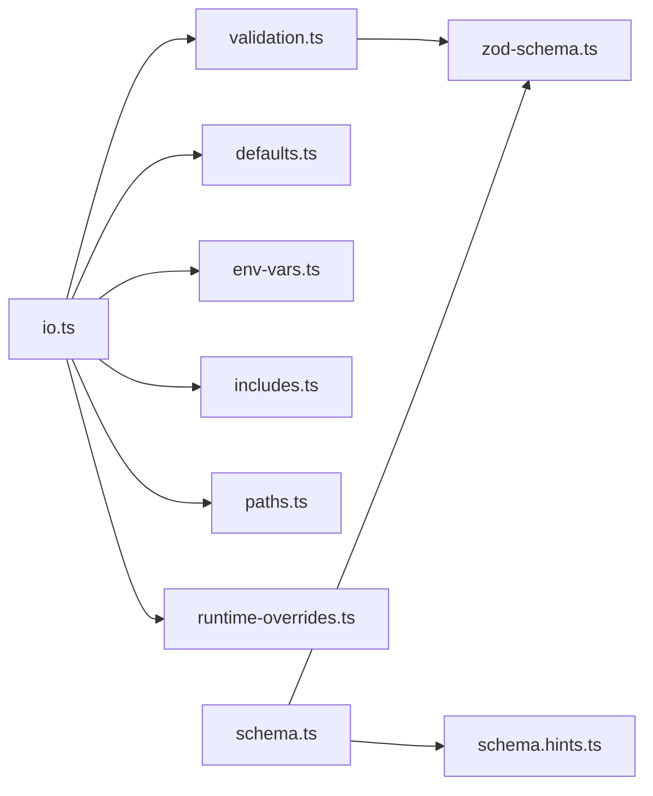

# 配置管理

<cite>
**本文引用的文件**
- [src/config/config.ts](file://src/config/config.ts)
- [src/config/io.ts](file://src/config/io.ts)
- [src/config/validation.ts](file://src/config/validation.ts)
- [src/config/defaults.ts](file://src/config/defaults.ts)
- [src/config/schema.ts](file://src/config/schema.ts)
- [src/config/zod-schema.ts](file://src/config/zod-schema.ts)
- [src/config/types.openclaw.ts](file://src/config/types.openclaw.ts)
- [src/config/env-vars.ts](file://src/config/env-vars.ts)
- [src/config/legacy-migrate.ts](file://src/config/legacy-migrate.ts)
</cite>

## 目录

1. [简介](#简介)
2. [项目结构](#项目结构)
3. [核心组件](#核心组件)
4. [架构总览](#架构总览)
5. [详细组件分析](#详细组件分析)
6. [依赖关系分析](#依赖关系分析)
7. [性能考量](#性能考量)
8. [故障排查指南](#故障排查指南)
9. [结论](#结论)
10. [附录](#附录)

## 简介

本文件面向 OpenClaw 的配置管理子系统，系统性阐述配置文件的结构、语法与验证机制，覆盖配置项的读取、修改与验证流程；同时说明配置模板、环境变量与默认值的使用方式，并提供配置迁移、备份恢复与版本管理的操作指南，以及配置权限控制、安全存储与加密保护的相关建议与命令入口。

## 项目结构

OpenClaw 的配置管理位于 src/config 目录，围绕“解析—合并—校验—写回—备份”的闭环设计，关键模块包括：

- IO 层：负责配置文件读取、快照生成、写入与备份轮转
- 校验层：基于 Zod Schema 的强类型校验，扩展插件与通道校验
- 默认值层：应用运行时默认值与上下文推断
- 模式层：导出可复用的 JSON Schema 与 UI 提示
- 类型层：统一的配置类型定义
- 环境变量层：收集与注入环境变量
- 兼容迁移层：旧配置迁移与问题检测

图表来源

- [src/config/io.ts](file://src/config/io.ts#L272-L382)
- [src/config/validation.ts](file://src/config/validation.ts#L90-L146)
- [src/config/defaults.ts](file://src/config/defaults.ts#L128-L152)

章节来源

- [src/config/io.ts](file://src/config/io.ts#L263-L382)
- [src/config/validation.ts](file://src/config/validation.ts#L90-L146)
- [src/config/defaults.ts](file://src/config/defaults.ts#L128-L152)

## 核心组件

- 配置读取与写入
  - 通过 IO 接口加载配置，支持 dotenv 注入、shell 环境回退、包含解析与环境变量替换
  - 写入采用“合并补丁”策略，仅持久化显式变更，避免泄漏运行时默认值
- 验证与模式
  - 基于 Zod Schema 的强类型校验，扩展插件与通道合法性检查
  - 导出 JSON Schema 与 UI 提示，便于前端与工具链集成
- 默认值与上下文推断
  - 应用会话、消息、日志、模型、代理并发等默认值
  - 根据认证模式与模型别名自动推断缓存保留策略
- 环境变量与模板
  - 收集配置内 env 定义与进程环境，支持 ${VAR} 变量替换
  - 支持 shellEnv 回退从登录 shell 注入缺失密钥
- 迁移与兼容
  - 旧配置迁移与遗留问题检测，保证平滑升级

章节来源

- [src/config/config.ts](file://src/config/config.ts#L1-L20)
- [src/config/io.ts](file://src/config/io.ts#L263-L382)
- [src/config/validation.ts](file://src/config/validation.ts#L148-L174)
- [src/config/schema.ts](file://src/config/schema.ts#L293-L335)
- [src/config/zod-schema.ts](file://src/config/zod-schema.ts#L95-L607)
- [src/config/env-vars.ts](file://src/config/env-vars.ts#L3-L31)
- [src/config/legacy-migrate.ts](file://src/config/legacy-migrate.ts#L5-L19)

## 架构总览

下图展示配置生命周期的关键交互：从文件到内存、再到持久化的完整流程。

图表来源

- [src/config/io.ts](file://src/config/io.ts#L272-L382)
- [src/config/io.ts](file://src/config/io.ts#L551-L617)
- [src/config/validation.ts](file://src/config/validation.ts#L162-L174)
- [src/config/defaults.ts](file://src/config/defaults.ts#L128-L152)

章节来源

- [src/config/io.ts](file://src/config/io.ts#L272-L382)
- [src/config/io.ts](file://src/config/io.ts#L551-L617)

## 详细组件分析

### 组件A：配置读取与快照（IO）

- 功能要点
  - 自动定位配置路径（支持 OPENCLAW_CONFIG_PATH 与候选路径）
  - 支持 $include 指令进行多文件拆分与组合
  - 在校验前将配置内的 env 注入进程环境，使 ${VAR} 可引用
  - 生成配置快照（包含原始、解析后、最终有效配置与哈希）
  - 对未来版本写入的配置发出警告
- 性能与可靠性
  - 可选配置缓存（OPENCLAW_CONFIG_CACHE_MS），减少重复 IO
  - 写入采用临时文件+原子重命名，Windows 下回退复制+chmod
  - 备份轮转（默认保留 5 份 .bak）

图表来源

- [src/config/io.ts](file://src/config/io.ts#L272-L382)
- [src/config/io.ts](file://src/config/io.ts#L384-L549)

章节来源

- [src/config/io.ts](file://src/config/io.ts#L263-L382)
- [src/config/io.ts](file://src/config/io.ts#L384-L549)

### 组件B：配置验证与模式（Schema/Validation）

- 校验范围
  - Zod Schema 强类型校验
  - 插件存在性与启用状态校验
  - 通道 ID 合法性与心跳目标校验
  - 代理工作区头像路径合法性
  - 代理目录重复性检查
- 模式导出
  - 生成 JSON Schema 与 UI 提示，支持插件与通道扩展
  - 敏感信息标注，便于 UI 与工具链屏蔽显示

图表来源

- [src/config/validation.ts](file://src/config/validation.ts#L90-L146)
- [src/config/validation.ts](file://src/config/validation.ts#L176-L404)
- [src/config/schema.ts](file://src/config/schema.ts#L293-L335)

章节来源

- [src/config/validation.ts](file://src/config/validation.ts#L90-L146)
- [src/config/validation.ts](file://src/config/validation.ts#L176-L404)
- [src/config/schema.ts](file://src/config/schema.ts#L293-L335)

### 组件C：默认值与上下文推断（Defaults）

- 默认值应用顺序
  - 消息、会话、日志、模型、代理并发、压缩与修剪、上下文心跳、Talk API Key 等
- 上下文推断
  - 根据认证模式（API Key/OAuth）推断模型缓存保留策略
  - 将 session.mainKey 归一化为主会话键“main”
- 性能与一致性
  - 仅在加载阶段应用默认值，写回时保持最小化持久化

图表来源

- [src/config/defaults.ts](file://src/config/defaults.ts#L113-L170)
- [src/config/defaults.ts](file://src/config/defaults.ts#L172-L292)
- [src/config/defaults.ts](file://src/config/defaults.ts#L294-L333)
- [src/config/defaults.ts](file://src/config/defaults.ts#L352-L441)
- [src/config/defaults.ts](file://src/config/defaults.ts#L443-L466)

章节来源

- [src/config/defaults.ts](file://src/config/defaults.ts#L113-L170)
- [src/config/defaults.ts](file://src/config/defaults.ts#L172-L292)
- [src/config/defaults.ts](file://src/config/defaults.ts#L294-L333)
- [src/config/defaults.ts](file://src/config/defaults.ts#L352-L441)
- [src/config/defaults.ts](file://src/config/defaults.ts#L443-L466)

### 组件D：环境变量与模板（Env/Vars）

- 收集策略
  - 从配置 env.vars 与 env 下的字符串字段收集键值对
  - 优先使用进程环境中的现有值，避免覆盖
- 注入时机
  - 在环境变量替换之前，先将配置内的 env 注入进程环境
- shellEnv 回退
  - 当开启或显式启用时，从登录 shell 注入期望的密钥集合

图表来源

- [src/config/env-vars.ts](file://src/config/env-vars.ts#L3-L31)
- [src/config/io.ts](file://src/config/io.ts#L296-L302)
- [src/config/io.ts](file://src/config/io.ts#L358-L367)

章节来源

- [src/config/env-vars.ts](file://src/config/env-vars.ts#L3-L31)
- [src/config/io.ts](file://src/config/io.ts#L296-L302)
- [src/config/io.ts](file://src/config/io.ts#L358-L367)

### 组件E：配置写入与备份（IO/合并补丁）

- 写入策略
  - 使用“合并补丁”算法计算差异，仅写入显式变更
  - 写入前对原始数据进行校验（不应用默认值），避免泄漏运行时默认
- 备份与权限
  - 写入前进行备份轮转（.bak → .bak.1 → …），并复制当前配置为 .bak
  - 文件权限设置为 0o600，确保私密性
- 平台兼容
  - Windows 下 rename 不可靠时回退为 copy+chmod+unlink

图表来源

- [src/config/io.ts](file://src/config/io.ts#L551-L617)

章节来源

- [src/config/io.ts](file://src/config/io.ts#L551-L617)

### 组件F：配置模式与 UI 提示（Schema）

- 模式构建
  - 基于 Zod Schema 生成 JSON Schema，并添加敏感信息提示
  - 支持插件与通道的动态 schema 扩展与 UI 提示合并
- 心跳目标提示
  - 为 agents.defaults.heartbeat.target 与 agents.list.\*.heartbeat.target 提供通道列表帮助文本

图表来源

- [src/config/schema.ts](file://src/config/schema.ts#L293-L335)

章节来源

- [src/config/schema.ts](file://src/config/schema.ts#L293-L335)

### 组件G：类型与快照（Types）

- 类型定义
  - OpenClawConfig 作为顶层配置对象，包含 auth、env、logging、models、agents、plugins、channels、gateway、memory 等子系统
- 快照结构
  - 包含 path、exists、raw、parsed、resolved、valid、config、hash、issues、warnings、legacyIssues 等字段
  - resolved 字段用于 set/unset 操作，避免泄漏运行时默认值

章节来源

- [src/config/types.openclaw.ts](file://src/config/types.openclaw.ts#L28-L130)

### 组件H：旧配置迁移（Legacy Migrate）

- 迁移流程
  - 应用旧配置迁移规则，得到新配置与变更清单
  - 对迁移后的配置再次进行带插件的校验，若仍无效则提示手动修复

章节来源

- [src/config/legacy-migrate.ts](file://src/config/legacy-migrate.ts#L5-L19)

## 依赖关系分析

- 模块耦合
  - IO 依赖 validation、defaults、env-substitution、includes、paths、runtime-overrides
  - validation 依赖 zod-schema、plugins、agents、channels 等子系统
  - schema 依赖 zod-schema 与 hints，动态合并插件/通道 schema
- 外部依赖
  - JSON5 解析、Node Crypto/FS/Path、dotenv 加载、shellEnv 回退

图表来源

- [src/config/io.ts](file://src/config/io.ts#L10-L39)
- [src/config/validation.ts](file://src/config/validation.ts#L1-L16)
- [src/config/schema.ts](file://src/config/schema.ts#L1-L7)

章节来源

- [src/config/io.ts](file://src/config/io.ts#L10-L39)
- [src/config/validation.ts](file://src/config/validation.ts#L1-L16)
- [src/config/schema.ts](file://src/config/schema.ts#L1-L7)

## 性能考量

- 缓存策略
  - 可通过 OPENCLAW_CONFIG_CACHE_MS 控制配置缓存时间；设为 0 关闭缓存
- IO 优化
  - 合并补丁写入减少磁盘写入量
  - 原子重命名避免部分写入导致的损坏
- 校验优化
  - 分离“原始校验”与“应用默认值”，写回阶段避免默认值污染

章节来源

- [src/config/io.ts](file://src/config/io.ts#L630-L684)
- [src/config/io.ts](file://src/config/io.ts#L551-L617)

## 故障排查指南

- 常见错误与处理
  - 无效配置（INVALID_CONFIG）：检查 JSON5 语法与字段拼写；关注 issues/warnings 输出
  - 环境变量缺失：确认 dotenv 已加载或 shellEnv 回退是否启用；检查 ${VAR} 引用
  - 代理目录重复：调整 agents.list 中的 agentDir，避免冲突
  - 未知通道 ID 或心跳目标非法：核对 channels.\* 与 heartbeat.target 的合法值
  - 未来版本写入：更新 OpenClaw 至更高版本以兼容新字段
- 建议排查步骤
  - 使用 readConfigFileSnapshot 获取当前快照，定位 issues 与 warnings
  - 通过 writeConfigFile 写回时观察 warnings，必要时逐项修正
  - 若怀疑旧配置问题，使用 migrateLegacyConfig 获取迁移后的配置与变更清单

章节来源

- [src/config/io.ts](file://src/config/io.ts#L316-L329)
- [src/config/validation.ts](file://src/config/validation.ts#L176-L404)
- [src/config/legacy-migrate.ts](file://src/config/legacy-migrate.ts#L5-L19)

## 结论

OpenClaw 的配置管理以强类型校验为核心，结合包含解析、环境变量注入、默认值应用与备份轮转，形成稳定可靠的配置生命周期。通过 JSON Schema 与 UI 提示，系统具备良好的可扩展性与可观测性。遵循本文的操作指南与最佳实践，可在保障安全与一致性的前提下高效管理配置。

## 附录

### 配置文件结构与语法

- 文件格式：JSON5（支持注释与尾随逗号）
- 顶层字段：参考 OpenClawConfig 类型定义，包含 auth、env、logging、models、agents、plugins、channels、gateway、memory 等
- 包含指令：$include 支持多文件拆分与组合
- 环境变量：${VAR} 引用，支持 dotenv 与 shellEnv 回退

章节来源

- [src/config/types.openclaw.ts](file://src/config/types.openclaw.ts#L28-L100)
- [src/config/zod-schema.ts](file://src/config/zod-schema.ts#L95-L607)
- [src/config/io.ts](file://src/config/io.ts#L290-L294)
- [src/config/io.ts](file://src/config/io.ts#L301-L302)

### 配置读取、修改与验证命令

- 读取配置
  - 函数：loadConfig
  - 行为：自动定位配置路径、解析包含、注入环境变量、替换 ${VAR}、校验、应用默认值、返回配置
- 读取快照
  - 函数：readConfigFileSnapshot
  - 行为：返回包含 raw、parsed、resolved、valid、config、hash、issues、warnings、legacyIssues 的快照
- 写入配置
  - 函数：writeConfigFile
  - 行为：计算合并补丁、对原始数据校验、原子写入、备份轮转、设置权限 0o600

章节来源

- [src/config/io.ts](file://src/config/io.ts#L663-L684)
- [src/config/io.ts](file://src/config/io.ts#L687-L689)
- [src/config/io.ts](file://src/config/io.ts#L691-L694)
- [src/config/io.ts](file://src/config/io.ts#L272-L382)
- [src/config/io.ts](file://src/config/io.ts#L384-L549)
- [src/config/io.ts](file://src/config/io.ts#L551-L617)

### 配置模板、环境变量与默认值

- 模板位置
  - 参考 docs/reference/templates 目录下的模板文件（如 AGENTS.default.md 等）
- 环境变量
  - 收集：collectConfigEnvVars
  - 注入：在替换 ${VAR} 前将配置内 env 注入进程环境
  - shellEnv：可从登录 shell 注入期望密钥集合
- 默认值
  - 消息、会话、日志、模型、代理并发、压缩与修剪、上下文心跳、Talk API Key 等

章节来源

- [src/config/env-vars.ts](file://src/config/env-vars.ts#L3-L31)
- [src/config/io.ts](file://src/config/io.ts#L296-L302)
- [src/config/io.ts](file://src/config/io.ts#L358-L367)
- [src/config/defaults.ts](file://src/config/defaults.ts#L113-L170)
- [src/config/defaults.ts](file://src/config/defaults.ts#L172-L292)
- [src/config/defaults.ts](file://src/config/defaults.ts#L294-L333)
- [src/config/defaults.ts](file://src/config/defaults.ts#L352-L441)

### 配置迁移、备份恢复与版本管理

- 迁移
  - migrateLegacyConfig：应用旧配置迁移规则并校验，返回迁移后的配置与变更清单
- 备份与恢复
  - 写入前自动进行备份轮转（.bak → .bak.1 → …），并复制当前配置为 .bak
  - 恢复：直接删除 .bak 或 .bak.1 并重命名为配置文件
- 版本管理
  - 配置元信息包含 lastTouchedVersion 与 lastTouchedAt
  - 对未来版本写入的配置发出警告，提示升级

章节来源

- [src/config/legacy-migrate.ts](file://src/config/legacy-migrate.ts#L5-L19)
- [src/config/io.ts](file://src/config/io.ts#L143-L160)
- [src/config/io.ts](file://src/config/io.ts#L590-L595)
- [src/config/io.ts](file://src/config/io.ts#L186-L196)
- [src/config/io.ts](file://src/config/io.ts#L198-L212)

### 配置权限控制、安全存储与加密保护

- 权限控制
  - 写入文件权限设置为 0o600，限制其他用户访问
- 安全存储
  - 日志脱敏：logging.redactSensitive 默认为 "tools"，可进一步通过 redactPatterns 自定义
  - 头像路径约束：限制在代理工作区内，禁止绝对路径与越界访问
- 加密保护
  - 建议通过外部密管或 KMS 管理敏感密钥，避免直接写入配置文件
  - shellEnv 回退仅在必要时启用，避免无意暴露密钥

章节来源

- [src/config/io.ts](file://src/config/io.ts#L585-L588)
- [src/config/validation.ts](file://src/config/validation.ts#L36-L84)
- [src/config/defaults.ts](file://src/config/defaults.ts#L335-L350)
