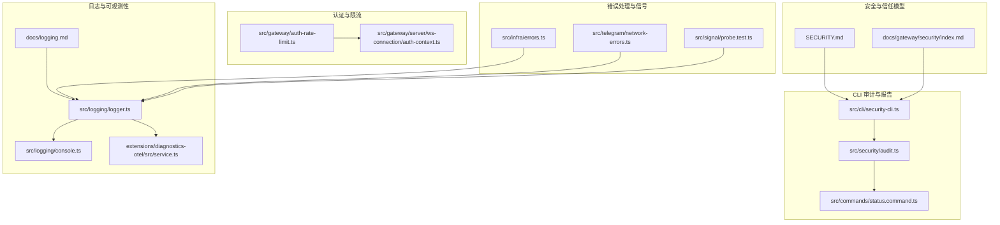
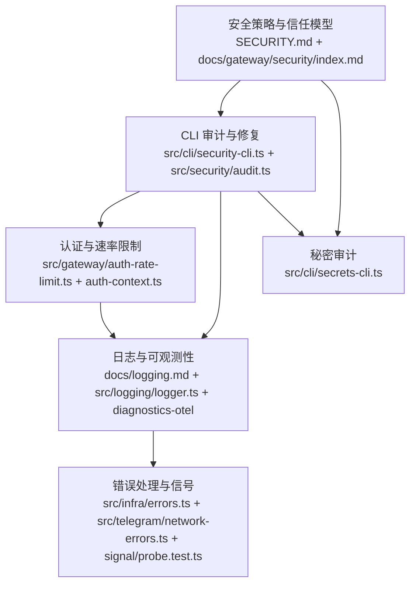
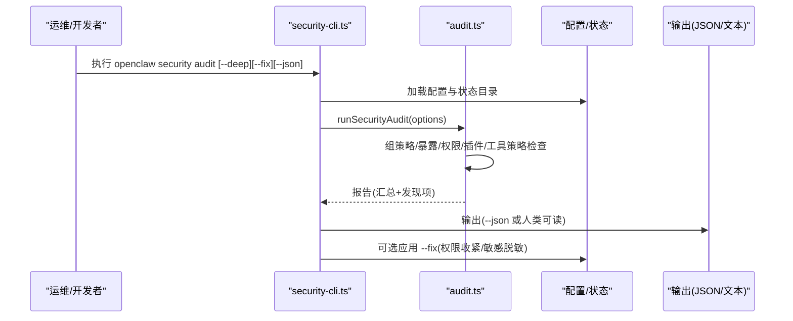
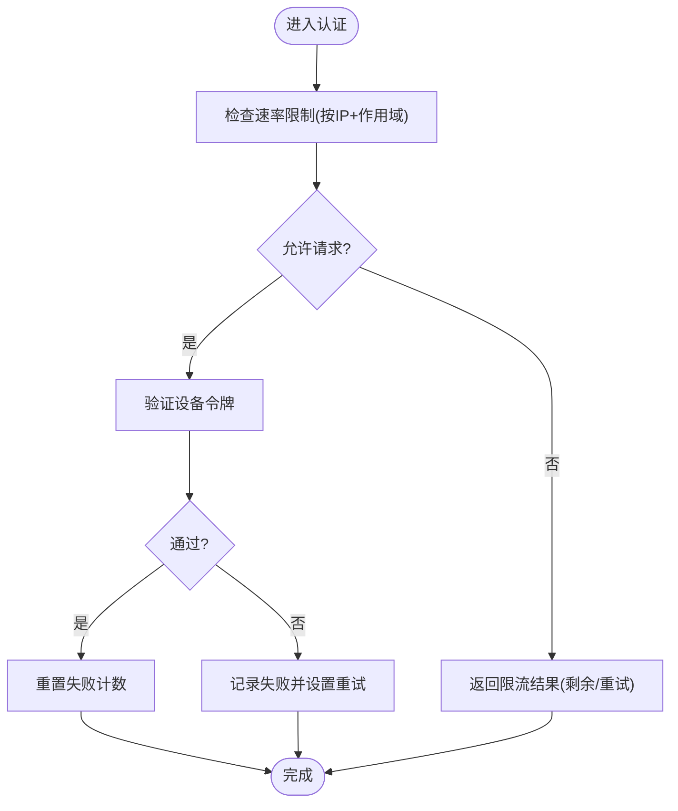
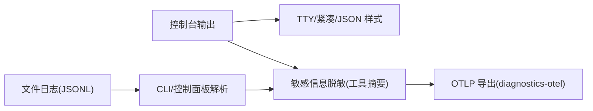
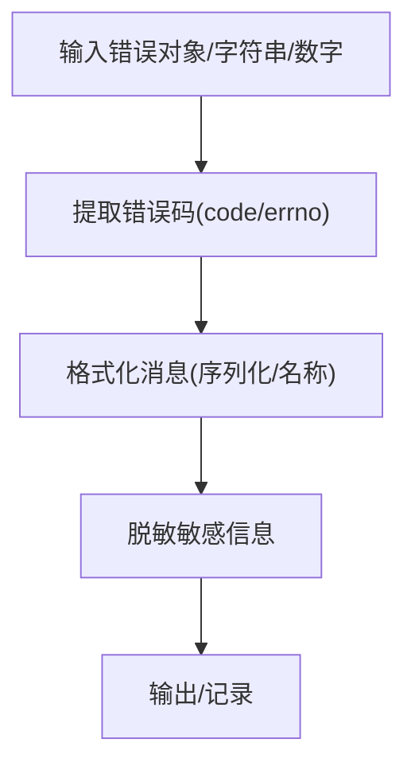
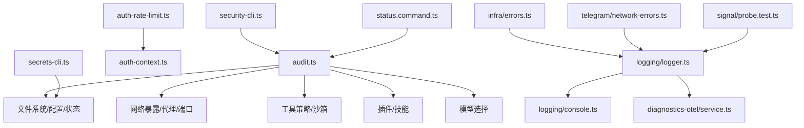

# 安全与故障排除

<cite>
**本文引用的文件**
- [SECURITY.md](file://SECURITY.md)
- [README.md](file://README.md)
- [docs/gateway/security/index.md](file://docs/gateway/security/index.md)
- [docs/logging.md](file://docs/logging.md)
- [src/cli/security-cli.ts](file://src/cli/security-cli.ts)
- [src/security/audit.ts](file://src/security/audit.ts)
- [src/commands/status.command.ts](file://src/commands/status.command.ts)
- [src/gateway/auth-rate-limit.ts](file://src/gateway/auth-rate-limit.ts)
- [src/gateway/auth-rate-limit.test.ts](file://src/gateway/auth-rate-limit.test.ts)
- [src/gateway/server/ws-connection/auth-context.ts](file://src/gateway/server/ws-connection/auth-context.ts)
- [src/infra/errors.ts](file://src/infra/errors.ts)
- [src/telegram/network-errors.ts](file://src/telegram/network-errors.ts)
- [src/logger.ts](file://src/logger.ts)
- [src/logging/logger.ts](file://src/logging/logger.ts)
- [src/logging/console.ts](file://src/logging/console.ts)
- [extensions/diagnostics-otel/src/service.ts](file://extensions/diagnostics-otel/src/service.ts)
- [extensions/diagnostics-otel/src/service.test.ts](file://extensions/diagnostics-otel/src/service.test.ts)
- [src/signal/probe.test.ts](file://src/signal/probe.test.ts)
- [src/cli/secrets-cli.ts](file://src/cli/secrets-cli.ts)
</cite>

## 目录

1. [简介](#简介)
2. [项目结构](#项目结构)
3. [核心组件](#核心组件)
4. [架构总览](#架构总览)
5. [详细组件分析](#详细组件分析)
6. [依赖关系分析](#依赖关系分析)
7. [性能考量](#性能考量)
8. [故障排除指南](#故障排除指南)
9. [结论](#结论)
10. [附录](#附录)

## 简介

本指南面向运维与开发者，系统性阐述 OpenClaw 的安全模型、认证与授权控制、数据保护策略、默认安全配置、风险评估与最佳实践，并提供故障排除、日志分析、性能调优、漏洞预防与响应、以及紧急恢复与数据保护方法。内容基于仓库中的安全策略文档、CLI 审计工具、认证限流实现、日志与可观测性扩展、错误处理与信号解析等源码与文档。

## 项目结构

围绕安全与故障排除的关键目录与文件：

- 安全策略与信任模型：SECURITY.md、docs/gateway/security/index.md
- CLI 审计与修复：src/cli/security-cli.ts、src/security/audit.ts、src/commands/status.command.ts
- 认证与速率限制：src/gateway/auth-rate-limit.ts、src/gateway/server/ws-connection/auth-context.ts
- 日志与可观测性：docs/logging.md、src/logging/logger.ts、src/logging/console.ts、extensions/diagnostics-otel/src/service.ts
- 错误处理与信号分类：src/infra/errors.ts、src/telegram/network-errors.ts、src/signal/probe.test.ts
- 秘密审计：src/cli/secrets-cli.ts

图表来源

- [SECURITY.md](file://SECURITY.md#L1-L268)
- [docs/gateway/security/index.md](file://docs/gateway/security/index.md#L1-L800)
- [src/cli/security-cli.ts](file://src/cli/security-cli.ts#L1-L60)
- [src/security/audit.ts](file://src/security/audit.ts#L54-L1020)
- [src/commands/status.command.ts](file://src/commands/status.command.ts#L447-L491)
- [src/gateway/auth-rate-limit.ts](file://src/gateway/auth-rate-limit.ts#L1-L117)
- [src/gateway/server/ws-connection/auth-context.ts](file://src/gateway/server/ws-connection/auth-context.ts#L180-L218)
- [docs/logging.md](file://docs/logging.md#L1-L353)
- [src/logging/logger.ts](file://src/logging/logger.ts#L148-L198)
- [src/logging/console.ts](file://src/logging/console.ts#L168-L195)
- [extensions/diagnostics-otel/src/service.ts](file://extensions/diagnostics-otel/src/service.ts#L22-L161)
- [src/infra/errors.ts](file://src/infra/errors.ts#L1-L59)
- [src/telegram/network-errors.ts](file://src/telegram/network-errors.ts#L54-L83)
- [src/signal/probe.test.ts](file://src/signal/probe.test.ts#L42-L69)

章节来源

- [SECURITY.md](file://SECURITY.md#L1-L268)
- [docs/gateway/security/index.md](file://docs/gateway/security/index.md#L1-L800)
- [docs/logging.md](file://docs/logging.md#L1-L353)

## 核心组件

- 安全策略与信任模型：定义个人助理模型、多用户隔离、网关与节点信任边界、插件与技能信任、临时目录边界、运行时要求与 Docker 安全建议。
- CLI 审计与修复：提供本地配置与状态审计、深度探测、自动修复（权限收紧、敏感信息脱敏开关）、JSON 输出与退出码。
- 认证与速率限制：内存滑动窗口限流器，按作用域区分凭据类型（共享密钥、设备令牌、钩子），对回环地址豁免，周期清理避免内存膨胀。
- 日志与可观测性：文件日志（JSON Lines）、控制台输出、CLI 实时跟踪、控制面板日志页签；支持敏感信息脱敏、OTLP 导出、指标与追踪。
- 错误处理与信号：统一错误格式化与脱敏、网络错误码提取、信号日志行分类（日志/错误）。
- 秘密审计：检测明文密钥、未解析引用、优先级漂移与遗留残留，支持检查模式与 JSON 输出。

章节来源

- [SECURITY.md](file://SECURITY.md#L84-L268)
- [src/cli/security-cli.ts](file://src/cli/security-cli.ts#L1-L60)
- [src/security/audit.ts](file://src/security/audit.ts#L54-L1020)
- [src/gateway/auth-rate-limit.ts](file://src/gateway/auth-rate-limit.ts#L1-L117)
- [docs/logging.md](file://docs/logging.md#L1-L353)
- [src/infra/errors.ts](file://src/infra/errors.ts#L1-L59)
- [src/signal/probe.test.ts](file://src/signal/probe.test.ts#L42-L69)
- [src/cli/secrets-cli.ts](file://src/cli/secrets-cli.ts#L80-L113)

## 架构总览

OpenClaw 的安全与可观测性由“策略—审计—认证—日志—错误处理—秘密管理”构成闭环。策略与信任模型决定边界；CLI 审计与修复用于持续加固；认证与限流防止暴力破解与滥用；日志与 OTLP 提供可追溯性；错误处理与信号分类确保问题可诊断；秘密审计降低泄露风险。

图表来源

- [SECURITY.md](file://SECURITY.md#L1-L268)
- [docs/gateway/security/index.md](file://docs/gateway/security/index.md#L1-L800)
- [src/cli/security-cli.ts](file://src/cli/security-cli.ts#L1-L60)
- [src/security/audit.ts](file://src/security/audit.ts#L54-L1020)
- [src/gateway/auth-rate-limit.ts](file://src/gateway/auth-rate-limit.ts#L1-L117)
- [src/gateway/server/ws-connection/auth-context.ts](file://src/gateway/server/ws-connection/auth-context.ts#L180-L218)
- [docs/logging.md](file://docs/logging.md#L1-L353)
- [src/logging/logger.ts](file://src/logging/logger.ts#L148-L198)
- [extensions/diagnostics-otel/src/service.ts](file://extensions/diagnostics-otel/src/service.ts#L22-L161)
- [src/infra/errors.ts](file://src/infra/errors.ts#L1-L59)
- [src/telegram/network-errors.ts](file://src/telegram/network-errors.ts#L54-L83)
- [src/signal/probe.test.ts](file://src/signal/probe.test.ts#L42-L69)
- [src/cli/secrets-cli.ts](file://src/cli/secrets-cli.ts#L80-L113)

## 详细组件分析

### 安全策略与信任模型

- 个人助理模型：单用户/单边界，不提供对抗多租户场景的强制隔离；若需对抗性隔离，应按边界拆分（独立网关/凭证/主机/用户）。
- 网关与节点：网关是控制面，节点是远程执行扩展；经配对后节点命令视为受信操作；会话标识仅路由选择，非授权令牌。
- 插件与技能：在进程内加载，视为受信代码；建议显式允许列表与版本固定。
- 临时目录边界：媒体与沙箱相关临时文件根目录受控，避免任意主机临时路径信任。
- 运行时与容器：要求 Node 版本含关键补丁；官方镜像以非 root 用户运行，建议只读文件系统与能力降级。

章节来源

- [SECURITY.md](file://SECURITY.md#L84-L268)
- [docs/gateway/security/index.md](file://docs/gateway/security/index.md#L1-L800)

### CLI 审计与修复

- 命令入口：security audit 子命令，支持 --deep（最佳努力探测）、--fix（安全修复）、--json（机器可读输出）。
- 报告结构：时间戳、汇总统计（critical/warn/info）、具体发现项（checkId、严重性、标题、详情、修复建议）。
- 修复范围：常见组策略开放、敏感信息脱敏关闭、状态/配置/敏感文件权限收紧；不旋转密钥、不禁用工具、不变更暴露策略。
- 集成状态命令：status 命令展示安全审计摘要与修复建议链接。

图表来源

- [src/cli/security-cli.ts](file://src/cli/security-cli.ts#L1-L60)
- [src/security/audit.ts](file://src/security/audit.ts#L54-L1020)
- [src/commands/status.command.ts](file://src/commands/status.command.ts#L447-L491)

章节来源

- [src/cli/security-cli.ts](file://src/cli/security-cli.ts#L1-L60)
- [src/security/audit.ts](file://src/security/audit.ts#L54-L1020)
- [src/commands/status.command.ts](file://src/commands/status.command.ts#L447-L491)

### 认证与速率限制

- 滑动窗口限流：按 {scope, clientIp} 跟踪失败尝试；作用域区分共享密钥/设备令牌/钩子等；默认对回环地址豁免；定时清理避免增长。
- 设备令牌校验流程：先检查速率限制，再验证设备令牌；成功则重置计数，失败则记录并返回原因与重试时间。
- 测试覆盖：基本滑动窗口行为、剩余次数递减、锁定与重试时间。

图表来源

- [src/gateway/auth-rate-limit.ts](file://src/gateway/auth-rate-limit.ts#L1-L117)
- [src/gateway/server/ws-connection/auth-context.ts](file://src/gateway/server/ws-connection/auth-context.ts#L180-L218)
- [src/gateway/auth-rate-limit.test.ts](file://src/gateway/auth-rate-limit.test.ts#L1-L32)

章节来源

- [src/gateway/auth-rate-limit.ts](file://src/gateway/auth-rate-limit.ts#L1-L117)
- [src/gateway/server/ws-connection/auth-context.ts](file://src/gateway/server/ws-connection/auth-context.ts#L180-L218)
- [src/gateway/auth-rate-limit.test.ts](file://src/gateway/auth-rate-limit.test.ts#L1-L32)

### 日志与可观测性

- 日志位置与读取：默认滚动文件位于 /tmp/openclaw/openclaw-YYYY-MM-DD.log；CLI 支持实时跟踪、TTY/JSON/plain 模式；控制面板日志页签同源。
- 配置：日志级别、控制台级别、控制台样式、敏感信息脱敏与自定义脱敏模式。
- 敏感信息脱敏：工具摘要默认脱敏；OTLP 导出保留结构化记录，尊重文件日志级别，控制台脱敏不应用于 OTLP。
- 诊断事件：模型用量、消息流转、队列与会话状态、心跳聚合计数；可启用 diagnostics-otel 插件导出至 OTLP/HTTP 收集器。

图表来源

- [docs/logging.md](file://docs/logging.md#L1-L353)
- [src/logging/logger.ts](file://src/logging/logger.ts#L148-L198)
- [src/logging/console.ts](file://src/logging/console.ts#L168-L195)
- [extensions/diagnostics-otel/src/service.ts](file://extensions/diagnostics-otel/src/service.ts#L22-L161)

章节来源

- [docs/logging.md](file://docs/logging.md#L1-L353)
- [src/logging/logger.ts](file://src/logging/logger.ts#L148-L198)
- [src/logging/console.ts](file://src/logging/console.ts#L168-L195)
- [extensions/diagnostics-otel/src/service.ts](file://extensions/diagnostics-otel/src/service.ts#L22-L161)

### 错误处理与信号分类

- 统一错误格式化：提取错误码、序列化对象、脱敏后再输出；未捕获错误也进行脱敏。
- 网络错误码提取：从错误对象或嵌套结构中提取 errno/code，便于分类与定位。
- 信号日志分类：INFO/DEBUG 即使在 stderr 也被视为日志；WARN/ERROR 视为错误；失败类语句被归类为错误；空行忽略。

图表来源

- [src/infra/errors.ts](file://src/infra/errors.ts#L1-L59)
- [src/telegram/network-errors.ts](file://src/telegram/network-errors.ts#L54-L83)
- [src/signal/probe.test.ts](file://src/signal/probe.test.ts#L42-L69)

章节来源

- [src/infra/errors.ts](file://src/infra/errors.ts#L1-L59)
- [src/telegram/network-errors.ts](file://src/telegram/network-errors.ts#L54-L83)
- [src/signal/probe.test.ts](file://src/signal/probe.test.ts#L42-L69)

### 秘密审计

- 功能：检测明文密钥、未解析引用、优先级漂移与遗留残留；支持 --check（非零退出）、--json 输出。
- 输出：状态、摘要（明文数量/未解析数量/遮蔽数量/遗留数量）与前若干条具体发现。
- 适用场景：CI/策略检查、部署前扫描。

章节来源

- [src/cli/secrets-cli.ts](file://src/cli/secrets-cli.ts#L80-L113)

## 依赖关系分析

- 审计依赖：CLI 入口依赖配置加载与状态目录解析；审计模块汇总多项检查维度（暴露、工具、权限、插件、模型）；状态命令展示摘要与修复建议。
- 认证依赖：速率限制器依赖客户端 IP 解析与回环豁免；设备令牌校验依赖作用域与失败计数。
- 日志依赖：日志模块负责文件写入、大小轮转、控制台捕获与样式；OTLP 导出依赖插件与环境变量。
- 错误处理依赖：错误提取与格式化贯穿日志与异常路径；信号测试辅助日志分类规则验证。

图表来源

- [src/cli/security-cli.ts](file://src/cli/security-cli.ts#L1-L60)
- [src/security/audit.ts](file://src/security/audit.ts#L54-L1020)
- [src/commands/status.command.ts](file://src/commands/status.command.ts#L447-L491)
- [src/gateway/auth-rate-limit.ts](file://src/gateway/auth-rate-limit.ts#L1-L117)
- [src/gateway/server/ws-connection/auth-context.ts](file://src/gateway/server/ws-connection/auth-context.ts#L180-L218)
- [src/logging/logger.ts](file://src/logging/logger.ts#L148-L198)
- [src/logging/console.ts](file://src/logging/console.ts#L168-L195)
- [extensions/diagnostics-otel/src/service.ts](file://extensions/diagnostics-otel/src/service.ts#L22-L161)
- [src/infra/errors.ts](file://src/infra/errors.ts#L1-L59)
- [src/telegram/network-errors.ts](file://src/telegram/network-errors.ts#L54-L83)
- [src/signal/probe.test.ts](file://src/signal/probe.test.ts#L42-L69)
- [src/cli/secrets-cli.ts](file://src/cli/secrets-cli.ts#L80-L113)

## 性能考量

- 速率限制：滑动窗口与周期清理避免无限增长；回环豁免减少本地调试干扰。
- 日志：文件滚动与控制台样式可按需求调整；OTLP 导出采样率与刷新间隔影响吞吐与资源占用。
- 审计：--deep 探测存在超时上限，建议在受控环境下使用；--fix 仅应用确定性修复，避免大规模变更。
- 沙箱与工具策略：在高风险输入场景启用沙箱与严格工具策略，可降低执行开销与风险。

## 故障排除指南

- 快速诊断
  - 使用 openclaw security audit 生成安全审计报告，关注 critical/warn 发现项与修复建议。
  - 使用 openclaw logs --follow 实时查看文件日志；必要时切换 --json 或 --plain 模式。
  - 使用 openclaw doctor 检查运行时健康与配置问题。
- 常见问题与定位
  - 网关不可达：检查绑定模式、认证方式、反向代理配置与可信代理列表。
  - 速率限制触发：确认客户端 IP 归一化、作用域区分、失败计数与锁定时间。
  - 日志为空：确认 Gateway 是否运行、日志文件路径是否正确、日志级别是否过低。
  - 敏感信息泄露：开启 logging.redactSensitive 并添加自定义脱敏模式。
  - 插件/技能风险：仅安装可信来源，使用 plugins.allow 明确白名单。
- 错误代码与信号
  - 统一提取错误码与 errno，结合日志与信号分类快速定位网络/系统类问题。
  - 对于 Telegram 等通道，网络错误码提取有助于区分连接、权限与业务错误。

章节来源

- [src/cli/security-cli.ts](file://src/cli/security-cli.ts#L1-L60)
- [src/security/audit.ts](file://src/security/audit.ts#L54-L1020)
- [docs/logging.md](file://docs/logging.md#L347-L353)
- [src/infra/errors.ts](file://src/infra/errors.ts#L1-L59)
- [src/telegram/network-errors.ts](file://src/telegram/network-errors.ts#L54-L83)
- [src/signal/probe.test.ts](file://src/signal/probe.test.ts#L42-L69)

## 结论

OpenClaw 的安全以“个人助理模型”为核心，强调身份控制、作用域收敛与模型选择的协同。通过 CLI 审计与修复、认证限流、日志与可观测性、错误处理与秘密审计，形成闭环保障。建议在生产环境中坚持最小暴露、最小权限、最小工具面原则，配合定期审计与演练，确保系统在可控边界内稳定运行。

## 附录

- 默认安全配置要点
  - 网关：bind=loopback、auth=token/password、工具策略最小化、沙箱模式按需启用。
  - DM：dmPolicy=pairing 或严格 allowlist；多用户场景启用 per-channel-peer。
  - 文件权限：~/.openclaw 开启严格权限；状态/配置/凭据文件最小权限。
  - 日志：开启敏感信息脱敏；必要时启用 OTLP 导出与采样。
- 紧急响应流程
  - 立即：隔离受影响实例、轮换认证凭据、收紧工具策略与暴露面。
  - 诊断：运行安全审计与日志分析，提取错误码与信号分类证据。
  - 修复：应用 --fix 自动修复；补充手动加固；验证修复效果。
  - 恢复：逐步恢复服务，持续监控与回归测试。
