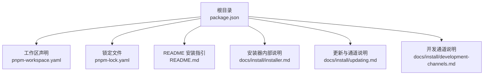
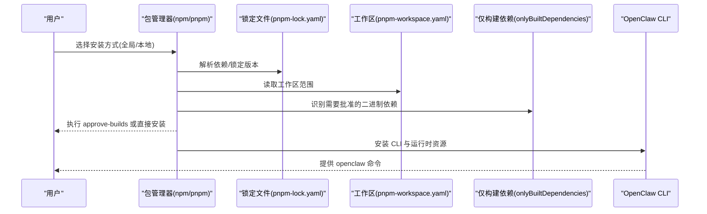
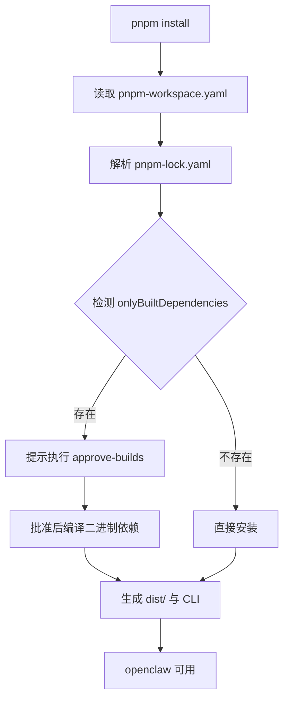
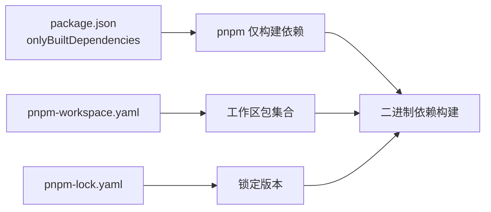

# 包管理器安装

<cite>
**本文引用的文件**
- [package.json](file://package.json)
- [pnpm-workspace.yaml](file://pnpm-workspace.yaml)
- [pnpm-lock.yaml](file://pnpm-lock.yaml)
- [README.md](file://README.md)
- [docs/install/installer.md](file://docs/install/installer.md)
- [docs/install/updating.md](file://docs/install/updating.md)
- [docs/install/development-channels.md](file://docs/install/development-channels.md)
</cite>

## 目录

1. [简介](#简介)
2. [项目结构](#项目结构)
3. [核心组件](#核心组件)
4. [架构总览](#架构总览)
5. [详细组件分析](#详细组件分析)
6. [依赖关系分析](#依赖关系分析)
7. [性能考虑](#性能考虑)
8. [故障排查指南](#故障排查指南)
9. [结论](#结论)
10. [附录](#附录)

## 简介

本指南面向通过 npm 与 pnpm 安装 OpenClaw 的用户，覆盖以下主题：

- 两种包管理器的选择建议与差异
- 全局安装与本地安装的区别
- pnpm 特有的 approve-builds 步骤与构建脚本批准流程
- sharp 库构建错误与 libvips 冲突的解决方案
- 包管理器环境最佳实践与常见问题排查

OpenClaw 在安装与开发流程中对包管理器有明确偏好：推荐使用 pnpm 进行源码构建；同时支持 npm 全局安装与本地安装路径。

## 项目结构

OpenClaw 使用 pnpm 工作区组织多包与扩展，根目录的 package.json 指定包管理器版本与仅构建依赖列表，pnpm-workspace.yaml 声明工作区范围，pnpm-lock.yaml 记录锁定信息。



图示来源

- [package.json](file://package.json#L1-L268)
- [pnpm-workspace.yaml](file://pnpm-workspace.yaml#L1-L17)
- [pnpm-lock.yaml](file://pnpm-lock.yaml#L1-L200)
- [README.md](file://README.md#L1-L556)
- [docs/install/installer.md](file://docs/install/installer.md#L1-L406)
- [docs/install/updating.md](file://docs/install/updating.md#L1-L258)
- [docs/install/development-channels.md](file://docs/install/development-channels.md#L1-L78)

章节来源

- [package.json](file://package.json#L1-L268)
- [pnpm-workspace.yaml](file://pnpm-workspace.yaml#L1-L17)
- [pnpm-lock.yaml](file://pnpm-lock.yaml#L1-L200)
- [README.md](file://README.md#L1-L556)

## 核心组件

- 包管理器与安装方式
  - npm 全局安装：适合快速体验与生产运行时。
  - pnpm 全局安装：推荐用于源码构建与开发。
  - 本地安装（prefix）：无需系统级权限，适合隔离环境。
- 构建与批准机制
  - pnpm 的 onlyBuiltDependencies 与 approve-builds 流程，确保仅在受控条件下编译二进制依赖。
- sharp 与 libvips
  - 默认通过环境变量避免系统 libvips 干扰，必要时可按需放开以使用系统库。

章节来源

- [README.md](file://README.md#L50-L111)
- [docs/install/installer.md](file://docs/install/installer.md#L16-L164)
- [package.json](file://package.json#L239-L266)

## 架构总览

下图展示从包管理器到构建、安装与运行的整体流程，突出 pnpm 的 approve-builds 与 npm 的直接安装差异。



图示来源

- [pnpm-workspace.yaml](file://pnpm-workspace.yaml#L1-L17)
- [pnpm-lock.yaml](file://pnpm-lock.yaml#L1-L200)
- [package.json](file://package.json#L239-L266)
- [docs/install/installer.md](file://docs/install/installer.md#L16-L164)

## 详细组件分析

### npm 安装流程

- 全局安装
  - 通过 npm 将 openclaw 安装为全局命令，适合直接运行与生产部署。
  - 更新与回滚可通过 npm 版本标签或指定版本进行。
- 本地安装（prefix）
  - 通过本地前缀安装，避免系统级权限，适合 CI 或隔离环境。
  - 安装器支持非交互模式与 JSON 输出，便于自动化集成。

```mermaid
flowchart TD
Start(["开始"]) --> Choice{"选择安装方式"}
Choice --> |全局(npm)| NPMGlobal["npm 全局安装"]
Choice --> |本地(prefix)| LocalPrefix["本地前缀安装"]
NPMGlobal --> Post["运行 doctor/健康检查"]
LocalPrefix --> Post
Post --> End(["完成"])
```

图示来源

- [docs/install/installer.md](file://docs/install/installer.md#L16-L164)
- [docs/install/updating.md](file://docs/install/updating.md#L46-L73)

章节来源

- [docs/install/installer.md](file://docs/install/installer.md#L16-L164)
- [docs/install/updating.md](file://docs/install/updating.md#L46-L73)

### pnpm 安装与 approve-builds 流程

- 工作区与锁定
  - pnpm-workspace.yaml 声明工作区包与扩展范围。
  - pnpm-lock.yaml 锁定所有依赖版本，保证一致性。
- 仅构建依赖与批准
  - package.json 中的 onlyBuiltDependencies 列表标识需要“批准”的二进制依赖。
  - 首次安装时，pnpm 会提示执行 approve-builds，以允许这些依赖进行原生编译。
- 从源码构建
  - 推荐使用 pnpm 进行源码构建，配合 UI 构建与打包脚本。



图示来源

- [pnpm-workspace.yaml](file://pnpm-workspace.yaml#L1-L17)
- [pnpm-lock.yaml](file://pnpm-lock.yaml#L1-L200)
- [package.json](file://package.json#L239-L266)

章节来源

- [pnpm-workspace.yaml](file://pnpm-workspace.yaml#L1-L17)
- [pnpm-lock.yaml](file://pnpm-lock.yaml#L1-L200)
- [package.json](file://package.json#L239-L266)

### sharp 与 libvips 冲突处理

- 默认策略
  - 安装器默认设置环境变量以忽略系统 libvips，避免 sharp 在构建时绑定系统库。
- 覆盖策略
  - 如需使用系统 libvips，请显式设置相关环境变量以放开默认行为。
- 建议
  - 在 CI 或容器环境中固定依赖版本，减少系统库差异导致的构建失败。

章节来源

- [docs/install/installer.md](file://docs/install/installer.md#L373-L380)

### 开发通道与更新

- 通道说明
  - stable/beta/dev 三档通道，分别对应 npm dist-tag 与 git 分支策略。
- 更新方式
  - 全局安装：通过 npm/pnpm dist-tag 或指定版本更新。
  - 源码安装：通过 openclaw update 或 git 拉取与构建。
- 回滚与固定版本
  - 支持固定版本与按日期回退到历史提交。

章节来源

- [docs/install/development-channels.md](file://docs/install/development-channels.md#L13-L78)
- [docs/install/updating.md](file://docs/install/updating.md#L13-L112)

## 依赖关系分析

OpenClaw 的依赖与包管理器紧密耦合，主要体现在：

- 仅构建依赖：通过 onlyBuiltDependencies 控制原生模块的构建范围。
- 工作区：通过 pnpm-workspace.yaml 统一管理多包与扩展。
- 锁定文件：通过 pnpm-lock.yaml 保证跨平台一致性。



图示来源

- [package.json](file://package.json#L239-L266)
- [pnpm-workspace.yaml](file://pnpm-workspace.yaml#L1-L17)
- [pnpm-lock.yaml](file://pnpm-lock.yaml#L1-L200)

章节来源

- [package.json](file://package.json#L239-L266)
- [pnpm-workspace.yaml](file://pnpm-workspace.yaml#L1-L17)
- [pnpm-lock.yaml](file://pnpm-lock.yaml#L1-L200)

## 性能考虑

- 优先使用 pnpm 进行源码构建，以获得更快的安装速度与更小的磁盘占用。
- 在 CI 环境中复用缓存与锁定文件，减少重复下载与构建时间。
- 对于 sharp 等二进制依赖，尽量避免频繁切换系统库，保持环境稳定。

## 故障排查指南

- npm 安装报错（EACCES）
  - 通常由于 npm 全局前缀指向受保护路径。可切换到用户前缀并更新 PATH。
- Windows 下找不到 openclaw
  - 检查 npm prefix 并将 bin 目录加入 PATH，重启终端后重试。
- sharp/libvips 构建失败
  - 默认已设置忽略系统 libvips；如需使用系统库，请显式设置相关环境变量。
- PATH 未生效
  - 重新加载 shell 配置或重启终端；确认包管理器安装路径在 PATH 中。

章节来源

- [docs/install/installer.md](file://docs/install/installer.md#L369-L404)

## 结论

- 若追求开发效率与一致性，推荐使用 pnpm，并遵循 approve-builds 流程。
- 若仅需快速运行与生产部署，npm 全局安装同样可行。
- 遇到 sharp/libvips 冲突时，按需调整环境变量即可解决。
- 建议结合通道与更新策略，定期运行 doctor 与健康检查，确保系统稳定。

## 附录

- 快速命令参考（来自 README 与安装器文档）
  - 全局安装（npm/pnpm）
    - npm: npm i -g openclaw@latest
    - pnpm: pnpm add -g openclaw@latest
  - 本地安装（prefix）
    - install-cli.sh 支持自定义前缀与非交互输出，适合 CI。
  - 更新与通道
    - openclaw update 切换通道或更新版本；doctor 与健康检查保障安全。

章节来源

- [README.md](file://README.md#L50-L111)
- [docs/install/installer.md](file://docs/install/installer.md#L16-L164)
- [docs/install/updating.md](file://docs/install/updating.md#L46-L112)
