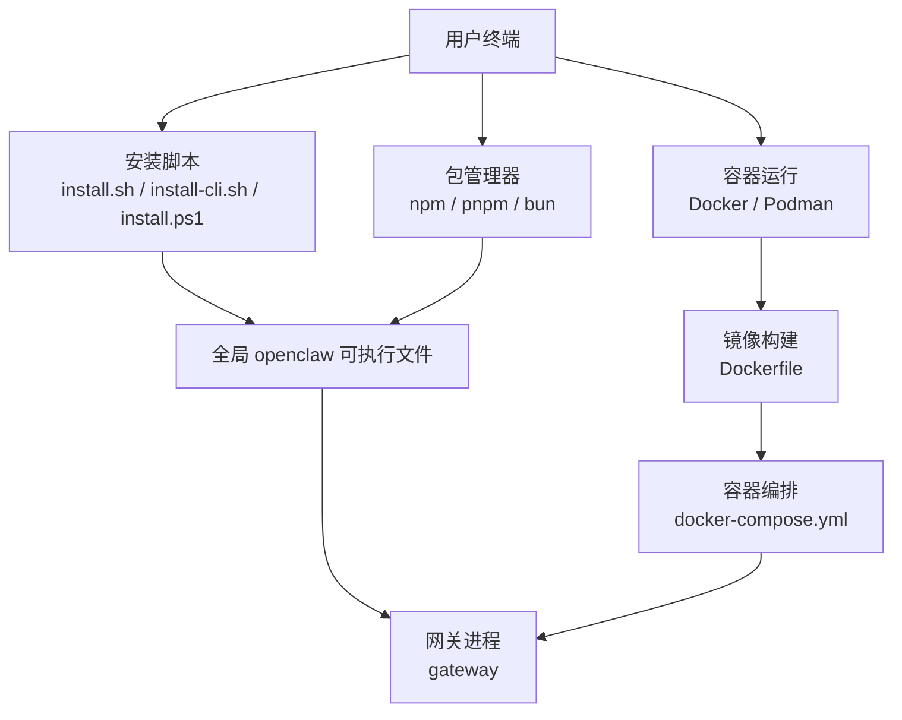
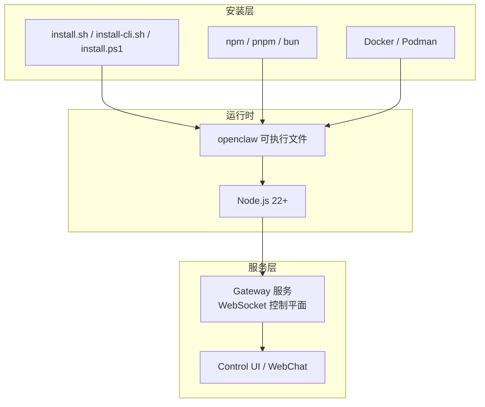
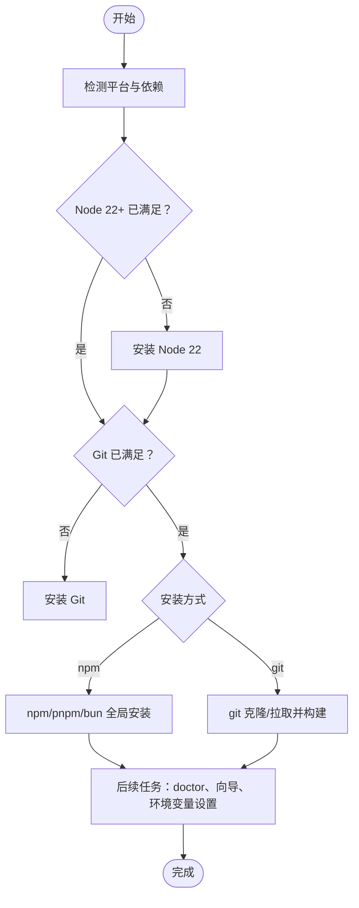
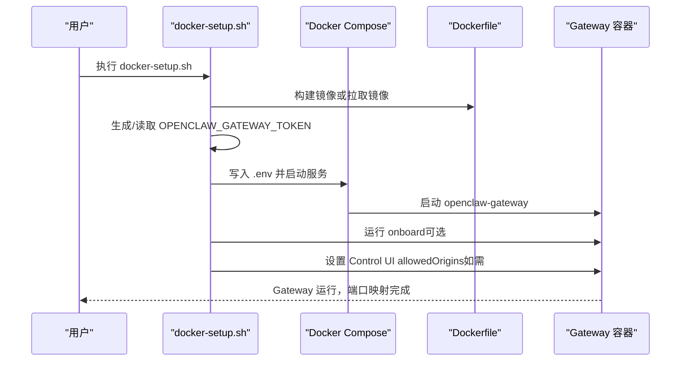
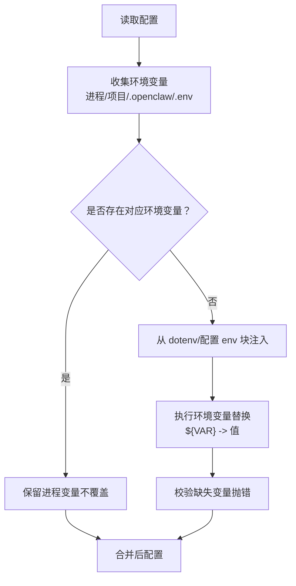
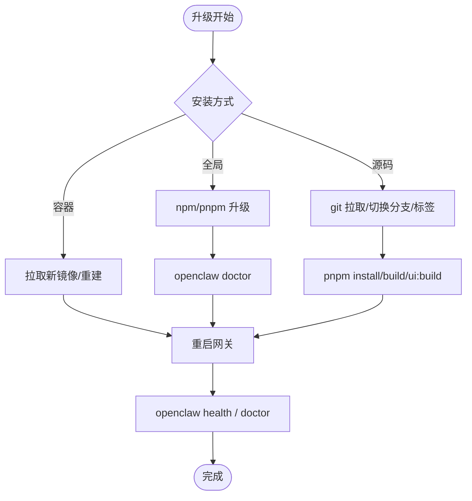
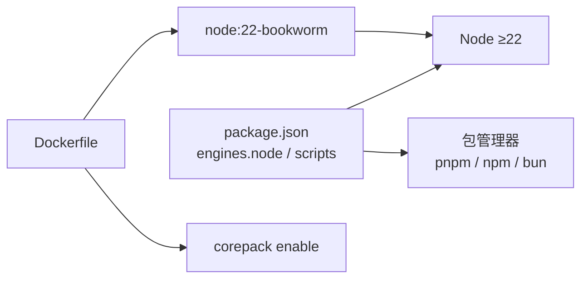

# 安装与配置

<cite>
**本文引用的文件**
- [README.md](file://README.md)
- [package.json](file://package.json)
- [docs/install/installer.md](file://docs/install/installer.md)
- [docs/install/updating.md](file://docs/install/updating.md)
- [docker-setup.sh](file://docker-setup.sh)
- [setup-podman.sh](file://setup-podman.sh)
- [Dockerfile](file://Dockerfile)
- [docker-compose.yml](file://docker-compose.yml)
- [.env.example](file://.env.example)
- [src/config/env-substitution.ts](file://src/config/env-substitution.ts)
- [src/config/env-vars.ts](file://src/config/env-vars.ts)
- [src/commands/uninstall.ts](file://src/commands/uninstall.ts)
- [src/cli/update-cli/update-command.ts](file://src/cli/update-cli/update-command.ts)
</cite>

## 目录

1. [简介](#简介)
2. [项目结构](#项目结构)
3. [核心组件](#核心组件)
4. [架构总览](#架构总览)
5. [详细组件分析](#详细组件分析)
6. [依赖关系分析](#依赖关系分析)
7. [性能考虑](#性能考虑)
8. [故障排查指南](#故障排查指南)
9. [结论](#结论)
10. [附录](#附录)

## 简介

本指南面向在不同平台部署 OpenClaw 的用户，覆盖从 Node.js 环境准备、包管理器选择、Docker/Podman 安装到生产与开发环境配置、环境变量与配置文件结构、升级与卸载迁移等全生命周期运维操作。目标是帮助你以最小成本完成安装，并在生产环境中安全稳定运行。

## 项目结构

OpenClaw 提供多种安装路径与运行模式：

- 全局安装：通过 npm/pnpm/bun（推荐 pnpm）安装全局包，使用 openclaw 命令启动网关与工具链。
- 源码安装：克隆仓库后本地构建，适合开发与定制。
- 容器化安装：使用 Docker 或 Podman 运行，便于隔离与跨平台部署。
- 安装脚本：官方提供的 install.sh/install-cli.sh/install.ps1，支持非交互式自动化安装。

图表来源

- [docs/install/installer.md](file://docs/install/installer.md#L10-L58)
- [package.json](file://package.json#L16-L18)
- [Dockerfile](file://Dockerfile#L1-L73)
- [docker-compose.yml](file://docker-compose.yml#L1-L47)

章节来源

- [README.md](file://README.md#L50-L111)
- [package.json](file://package.json#L16-L18)

## 核心组件

- CLI 与安装器：提供统一入口，支持多平台安装、非交互式安装与自动化。
- 网关服务：WebSocket 控制平面，承载会话、通道、工具与事件。
- 配置系统：支持 openclaw.json、.env、环境变量注入与嵌套键值替换。
- 容器化运行：Dockerfile 与 docker-compose.yml 提供标准化镜像与编排。
- 更新与卸载：内置 update 命令与清理命令，支持回滚与迁移。

章节来源

- [README.md](file://README.md#L185-L239)
- [docs/install/installer.md](file://docs/install/installer.md#L10-L58)
- [docker-setup.sh](file://docker-setup.sh#L1-L380)
- [setup-podman.sh](file://setup-podman.sh#L1-L252)

## 架构总览

OpenClaw 的安装与运行由“安装层（脚本/包管理器/容器）—运行时（Node 与 openclaw 可执行）—网关服务（WebSocket）”三层构成。容器化部署通过 Docker/Podman 将 Node 运行时、应用代码与依赖打包为镜像，并通过 docker-compose 编排服务。

图表来源

- [docs/install/installer.md](file://docs/install/installer.md#L14-L18)
- [package.json](file://package.json#L16-L18)
- [Dockerfile](file://Dockerfile#L1-L73)
- [docker-compose.yml](file://docker-compose.yml#L1-L47)

## 详细组件分析

### 安装器与包管理器选择

- install.sh：推荐用于 macOS/Linux/WSL 的交互式安装，自动检测并安装 Node 22、Git，支持 npm/git 两种安装方式，可选择跳过向导或干跑。
- install-cli.sh：将 Node 与 openclaw 安装到本地前缀（默认 ~/.openclaw），无需系统级 Node，适合受限环境与自动化。
- install.ps1：Windows PowerShell 安装脚本，支持 npm/git 安装与非交互式参数。
- 包管理器：README 推荐 npm/pnpm/bun；源码构建建议使用 pnpm；运行时建议使用 Node ≥22。

图表来源

- [docs/install/installer.md](file://docs/install/installer.md#L67-L88)
- [docs/install/installer.md](file://docs/install/installer.md#L168-L187)
- [docs/install/installer.md](file://docs/install/installer.md#L246-L265)

章节来源

- [docs/install/installer.md](file://docs/install/installer.md#L10-L58)
- [docs/install/installer.md](file://docs/install/installer.md#L61-L165)
- [docs/install/installer.md](file://docs/install/installer.md#L168-L242)
- [docs/install/installer.md](file://docs/install/installer.md#L246-L324)
- [README.md](file://README.md#L50-L111)

### Docker 与 Podman 安装

- Docker：使用 docker-setup.sh 自动化镜像构建/拉取、生成令牌、写入 .env、执行 onboarding、启动服务，并处理 Control UI 跨域白名单。
- Podman：使用 setup-podman.sh 创建非特权用户、构建镜像、加载到用户存储、生成令牌与最小配置、可选安装 systemd Quadlet 用户服务。

图表来源

- [docker-setup.sh](file://docker-setup.sh#L1-L380)
- [Dockerfile](file://Dockerfile#L1-L73)
- [docker-compose.yml](file://docker-compose.yml#L1-L47)

章节来源

- [docker-setup.sh](file://docker-setup.sh#L1-L380)
- [setup-podman.sh](file://setup-podman.sh#L1-L252)
- [Dockerfile](file://Dockerfile#L1-L73)
- [docker-compose.yml](file://docker-compose.yml#L1-L47)

### 环境变量与配置文件

- 环境变量优先级：进程环境 > 项目根目录 .env > ~/.openclaw/.env > openclaw.json 中的 env 块。已有非空进程变量不会被 dotenv 或配置覆盖。
- 环境变量替换：支持在配置中使用 ${VAR_NAME} 语法进行替换，仅匹配大写格式的环境变量名；缺失变量会抛出错误。
- 示例 .env：包含网关认证令牌、路径覆盖、模型与渠道密钥、工具与语音媒体密钥等常用项。

图表来源

- [.env.example](file://.env.example#L8-L12)
- [src/config/env-substitution.ts](file://src/config/env-substitution.ts#L1-L49)
- [src/config/env-vars.ts](file://src/config/env-vars.ts#L56-L80)

章节来源

- [.env.example](file://.env.example#L1-L81)
- [src/config/env-substitution.ts](file://src/config/env-substitution.ts#L1-L49)
- [src/config/env-vars.ts](file://src/config/env-vars.ts#L56-L80)

### 生产与开发环境配置

- 生产环境建议：
  - 使用容器化部署（Docker/Podman），绑定 loopback 并启用令牌认证。
  - 使用 systemd/launchd 用户服务自启动，确保开机自启与用户会话可用性。
  - 严格控制网关暴露面，必要时结合 Tailscale Serve/Funnel 与密码认证。
- 开发环境建议：
  - 源码安装 + pnpm 构建，使用 openclaw gateway --watch 或 pnpm gateway:watch 实现热重载。
  - 使用 install-cli.sh 将 Node 与 openclaw 放入本地前缀，避免系统级依赖污染。

章节来源

- [README.md](file://README.md#L213-L239)
- [README.md](file://README.md#L92-L111)
- [docker-setup.sh](file://docker-setup.sh#L326-L339)
- [setup-podman.sh](file://setup-podman.sh#L163-L170)

### 升级与回滚

- 推荐使用网站安装器重新运行以原地升级，自动检测并升级，必要时运行 doctor。
- npm/pnpm 全局安装：npm/pnpm add -g openclaw@latest；可通过 openclaw update 切换通道（stable/beta/dev）。
- 源码安装：openclaw update 或 git pull + pnpm install + pnpm build；完成后运行 doctor 与 health。
- 回滚策略：固定版本（pin）或按日期检出历史提交；必要时停止服务、回退后重启。

图表来源

- [docs/install/updating.md](file://docs/install/updating.md#L13-L73)
- [docs/install/updating.md](file://docs/install/updating.md#L113-L130)
- [docs/install/updating.md](file://docs/install/updating.md#L141-L167)
- [src/cli/update-cli/update-command.ts](file://src/cli/update-cli/update-command.ts#L323-L335)

章节来源

- [docs/install/updating.md](file://docs/install/updating.md#L1-L258)
- [src/cli/update-cli/update-command.ts](file://src/cli/update-cli/update-command.ts#L323-L335)

### 卸载与迁移

- 卸载范围：服务（gateway）、状态目录（~/.openclaw）、工作空间、macOS 应用等；CLI 仍保留，可自行通过包管理器移除。
- 迁移策略：在升级前备份 openclaw.json、credentials、workspace；升级后运行 doctor 自动迁移与修复。
- 插件卸载：支持预览与确认卸载，可选择是否删除已安装目录与相关记录。

章节来源

- [src/commands/uninstall.ts](file://src/commands/uninstall.ts#L154-L190)
- [docs/install/updating.md](file://docs/install/updating.md#L37-L45)

## 依赖关系分析

- Node.js 版本：引擎要求 Node ≥22.12.0；README 明确 Node ≥22。
- 包管理器：package.json 指定 pnpm 作为首选；README 推荐 npm/pnpm/bun。
- 容器镜像：基于 node:22-bookworm，启用 corepack，支持可选安装浏览器依赖以加速容器启动。

图表来源

- [package.json](file://package.json#L236-L238)
- [package.json](file://package.json#L49-L150)
- [Dockerfile](file://Dockerfile#L1-L7)
- [README.md](file://README.md#L50-L61)

章节来源

- [package.json](file://package.json#L236-L238)
- [README.md](file://README.md#L50-L61)
- [Dockerfile](file://Dockerfile#L1-L7)

## 性能考虑

- 容器构建内存：Dockerfile 在安装依赖阶段限制 Node 最大堆内存，降低小规格主机构建失败风险。
- 浏览器依赖预装：Dockerfile 支持通过构建参数预装 Chromium/Xvfb，减少容器启动时 Playwright 下载等待。
- 非 root 运行：容器以非 root 用户运行，提升安全性，避免权限逃逸风险。

章节来源

- [Dockerfile](file://Dockerfile#L25-L28)
- [Dockerfile](file://Dockerfile#L34-L45)
- [Dockerfile](file://Dockerfile#L61-L64)

## 故障排查指南

- Node 未找到或 PATH 问题：参考安装器“Node.js troubleshooting”，确保 PATH 正确或使用 install-cli.sh 将 Node 安装到本地前缀。
- Linux 权限问题（EACCES）：install.sh 可切换 npm 全局前缀至用户目录并追加 PATH。
- Windows Git/Node 未安装：install.ps1 会尝试 winget/choco/scoop 安装 Node；若使用 git 安装方式，需先安装 Git for Windows。
- sharp/libvips 构建冲突：install.sh 默认关闭系统 libvips 检测，如需使用系统库可显式设置环境变量。
- 容器启动失败：检查 OPENCLAW_GATEWAY_TOKEN 是否正确写入 .env；确认端口映射与防火墙；必要时查看容器日志。

章节来源

- [docs/install/installer.md](file://docs/install/installer.md#L362-L405)
- [docker-setup.sh](file://docker-setup.sh#L340-L380)

## 结论

通过安装器、包管理器与容器化三种方式，你可以灵活选择适合的安装路径。生产环境建议采用容器化与用户服务托管，配合严格的认证与暴露策略；开发环境推荐源码安装与本地构建。升级与卸载流程清晰，配合 doctor 与健康检查可显著降低变更风险。

## 附录

- 快速开始（Node ≥22）：npm/pnpm/bun 安装 openclaw，运行 openclaw onboard --install-daemon，随后启动网关并发送消息测试。
- 开发环境（源码）：git clone 后 pnpm install/build/ui:build，再运行 openclaw onboard --install-daemon 与 gateway:watch。
- 容器化（Docker）：执行 docker-setup.sh，按提示完成 onboarding 与服务启动。
- Podman（生产）：执行 setup-podman.sh，按需启用 systemd Quadlet 用户服务。

章节来源

- [README.md](file://README.md#L50-L111)
- [docker-setup.sh](file://docker-setup.sh#L340-L380)
- [setup-podman.sh](file://setup-podman.sh#L238-L252)
