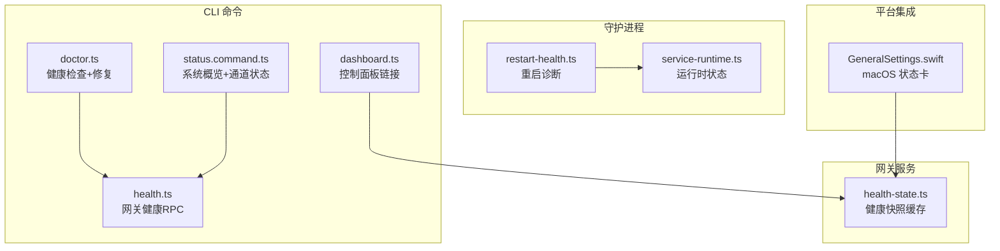
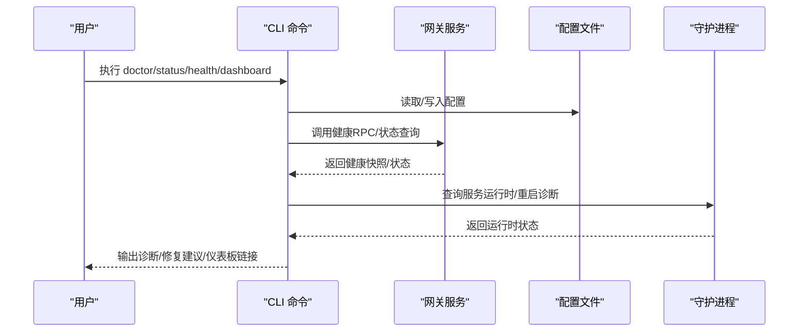
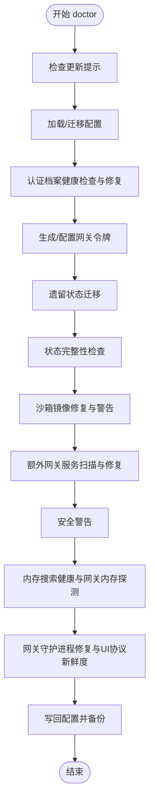
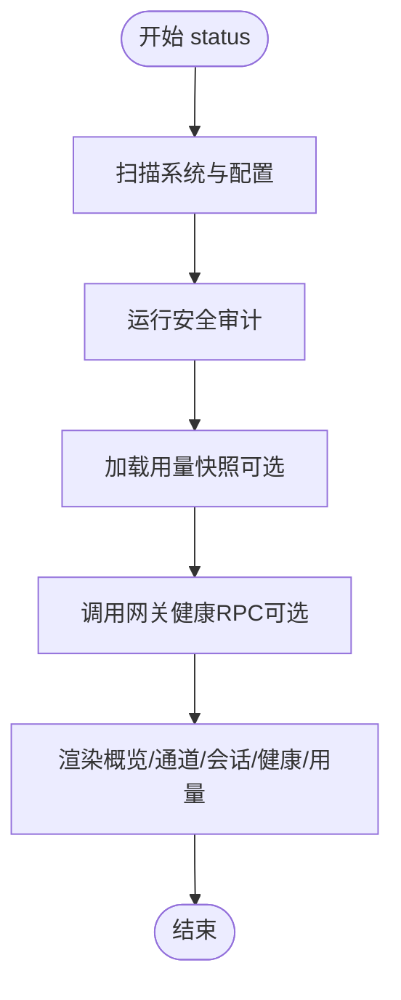
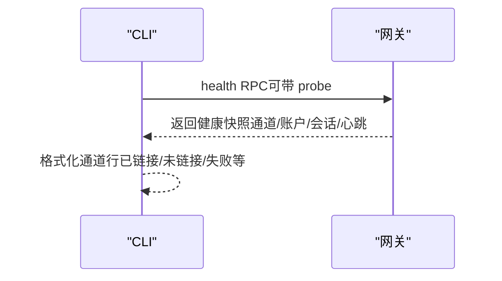
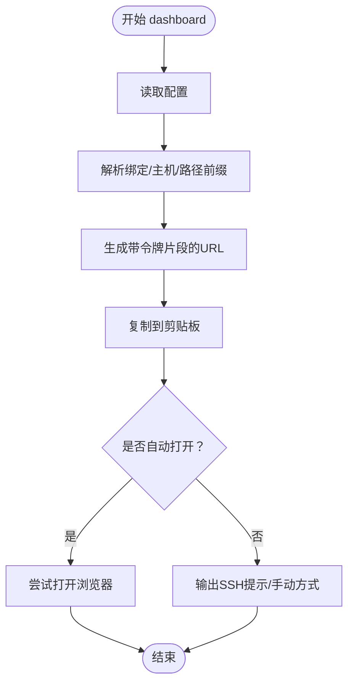
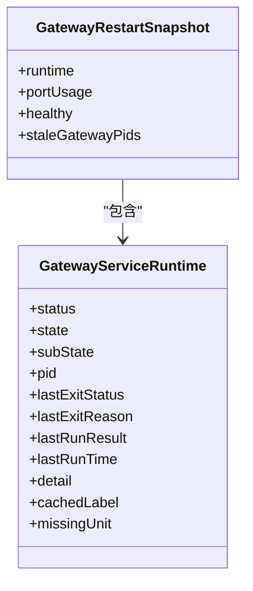
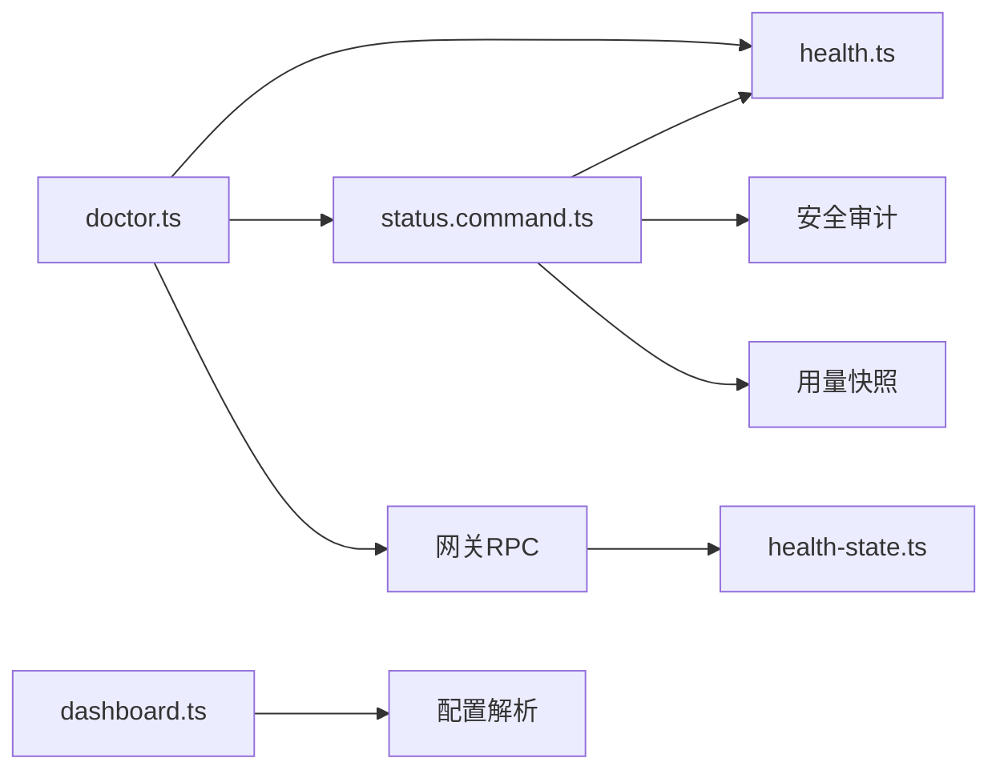

# 安装后配置

<cite>
**本文引用的文件**
- [README.md](file://README.md)
- [doctor.ts](file://src/commands/doctor.ts)
- [status.command.ts](file://src/commands/status.command.ts)
- [health.ts](file://src/commands/health.ts)
- [dashboard.ts](file://src/commands/dashboard.ts)
- [health-state.ts](file://src/gateway/server/health-state.ts)
- [restart-health.ts](file://src/cli/daemon-cli/restart-health.ts)
- [service-runtime.ts](file://src/daemon/service-runtime.ts)
- [GeneralSettings.swift](file://apps/macos/Sources/OpenClaw/GeneralSettings.swift)
- [doctor.md](file://docs/cli/doctor.md)
- [status.md](file://docs/cli/status.md)
</cite>

## 目录

1. [简介](#简介)
2. [项目结构](#项目结构)
3. [核心组件](#核心组件)
4. [架构总览](#架构总览)
5. [详细组件分析](#详细组件分析)
6. [依赖关系分析](#依赖关系分析)
7. [性能考虑](#性能考虑)
8. [故障排查指南](#故障排查指南)
9. [结论](#结论)
10. [附录](#附录)

## 简介

本指南面向完成 OpenClaw 安装与首次运行后的用户，提供“安装后配置”的完整流程：如何使用 openclaw doctor、openclaw status、openclaw dashboard 进行健康检查与问题定位；如何理解网关状态与常见故障；如何通过浏览器 UI 访问与基础配置；以及安装完成后初始化配置建议与性能优化提示。内容基于仓库中的 CLI 命令实现与文档，确保可操作性与准确性。

## 项目结构

围绕安装后验证与配置的关键文件与职责如下：

- doctor 命令：集中执行健康检查、迁移修复、安全审计与引导式修复（src/commands/doctor.ts）
- status 命令：汇总系统概览、通道状态、会话与内存、更新与心跳等信息（src/commands/status.command.ts）
- health 命令：调用网关 RPC 获取健康快照，支持探测各通道账户连通性（src/commands/health.ts）
- dashboard 命令：生成并打开控制面板链接，支持复制与无浏览器场景提示（src/commands/dashboard.ts）
- 网关健康状态：服务端缓存与广播健康快照（src/gateway/server/health-state.ts）
- 重启诊断：守护进程与端口占用检查、健康等待逻辑（src/cli/daemon-cli/restart-health.ts）
- 守护进程运行时状态：服务状态、PID、退出原因等（src/daemon/service-runtime.ts）
- macOS UI：菜单栏应用中网关状态展示与刷新（apps/macos/Sources/OpenClaw/GeneralSettings.swift）

图表来源

- [doctor.ts](file://src/commands/doctor.ts#L67-L327)
- [status.command.ts](file://src/commands/status.command.ts#L67-L672)
- [health.ts](file://src/commands/health.ts#L525-L752)
- [dashboard.ts](file://src/commands/dashboard.ts#L16-L70)
- [health-state.ts](file://src/gateway/server/health-state.ts#L17-L85)
- [restart-health.ts](file://src/cli/daemon-cli/restart-health.ts#L31-L128)
- [service-runtime.ts](file://src/daemon/service-runtime.ts#L1-L13)
- [GeneralSettings.swift](file://apps/macos/Sources/OpenClaw/GeneralSettings.swift#L385-L430)

章节来源

- [README.md](file://README.md#L1-L546)

## 核心组件

- doctor 命令：在运行前进行更新提示、配置迁移、认证与网关令牌修复、遗留状态迁移、内存搜索健康、沙箱镜像修复、安全警告、工作区与补丁建议，并最终写回配置或提示使用 --fix 应用变更。
- status 命令：输出仪表板链接、操作系统与 Node 版本、Tailscale 状态、更新通道与 Git 标签、网关模式与可达性、服务安装与运行状态、代理数量与会话、内存插件状态、探针开关、事件队列、心跳间隔与最近心跳、通道状态表、会话列表、安全审计摘要与通道问题、深度健康块（可选）。
- health 命令：通过网关 RPC 获取健康快照，按通道聚合账户探测结果，输出“已链接/未链接/未配置/已配置/未知/失败（含耗时与错误）”等状态行。
- dashboard 命令：解析配置决定绑定模式与路径前缀，生成带令牌片段的 URL，尝试自动打开浏览器，否则给出 SSH 提示与手动方式。
- 网关健康状态：构建快照时注入默认代理、主键、会话作用域、系统存在性、运行时、认证模式与更新可用性；支持异步刷新与广播。
- 重启诊断：检测端口占用、服务运行时状态、健康判定与超时重试，输出诊断行。
- 守护进程运行时：统一描述服务状态、子状态、PID、最后退出码与原因、缓存标签与缺失单元等。
- macOS UI：展示网关状态卡片、最后失败原因、自动启动提示与刷新按钮。

章节来源

- [doctor.ts](file://src/commands/doctor.ts#L67-L327)
- [status.command.ts](file://src/commands/status.command.ts#L67-L672)
- [health.ts](file://src/commands/health.ts#L525-L752)
- [dashboard.ts](file://src/commands/dashboard.ts#L16-L70)
- [health-state.ts](file://src/gateway/server/health-state.ts#L17-L85)
- [restart-health.ts](file://src/cli/daemon-cli/restart-health.ts#L31-L128)
- [service-runtime.ts](file://src/daemon/service-runtime.ts#L1-L13)
- [GeneralSettings.swift](file://apps/macos/Sources/OpenClaw/GeneralSettings.swift#L385-L430)

## 架构总览

下图展示了安装后验证与配置的关键交互：CLI 命令通过网关 RPC 获取健康信息，结合本地配置与守护进程状态，形成“诊断—修复—确认”的闭环。

图表来源

- [doctor.ts](file://src/commands/doctor.ts#L96-L327)
- [status.command.ts](file://src/commands/status.command.ts#L133-L156)
- [health.ts](file://src/commands/health.ts#L525-L752)
- [dashboard.ts](file://src/commands/dashboard.ts#L16-L70)
- [health-state.ts](file://src/gateway/server/health-state.ts#L69-L85)
- [restart-health.ts](file://src/cli/daemon-cli/restart-health.ts#L31-L128)
- [service-runtime.ts](file://src/daemon/service-runtime.ts#L1-L13)

## 详细组件分析

### doctor 命令：安装后健康检查与修复

- 功能要点
  - 更新提示与源安装问题提示
  - 配置迁移与向导元数据写入
  - 认证档案健康检查与 OAuth 修复
  - 网关令牌生成与配置（推荐 token 模式）
  - 遗留状态迁移（会话/代理/WhatsApp 认证）
  - 状态完整性与会话锁检查
  - 沙箱镜像修复与范围警告
  - 额外网关服务扫描与修复
  - 安全警告与 Shell 补全修复
  - 内存搜索健康检查与网关内存探测
  - 网关守护进程修复与 UI 协议新鲜度
  - 写回配置与备份提示
- 使用建议
  - 首次安装后运行 doctor，必要时使用 --fix 应用修复
  - 在非交互环境（CI/无终端）使用 --non-interactive 与 --yes/--generate-gateway-token
  - 结合 README 的“安全模型”与“安全审计”进行二次核验

图表来源

- [doctor.ts](file://src/commands/doctor.ts#L67-L327)

章节来源

- [doctor.ts](file://src/commands/doctor.ts#L67-L327)
- [doctor.md](file://docs/cli/doctor.md#L1-L45)

### status 命令：系统健康检查与问题识别

- 功能要点
  - 输出仪表板链接（受控绑定模式影响）
  - OS 与 Node 版本、Tailscale 状态、更新通道与 Git 标签
  - 网关模式、URL、可达性、认证方式、自检信息
  - 网关服务与节点服务安装/运行状态
  - 代理数量、待处理引导文件、会话总数与默认代理活跃度
  - 内存插件启用、文件/分块/脏标记、向量/全文/缓存状态
  - 探针开关、系统事件队列、心跳间隔与最近心跳
  - 会话列表（最近活动）
  - 安全审计摘要与通道问题
  - 可选深度健康块（通道探测）
- 使用建议
  - 日常巡检使用 openclaw status
  - 需要通道连通性时使用 --deep
  - 需要共享或调试时使用 --all
  - 需要用量快照时使用 --usage

图表来源

- [status.command.ts](file://src/commands/status.command.ts#L67-L672)

章节来源

- [status.command.ts](file://src/commands/status.command.ts#L67-L672)
- [status.md](file://docs/cli/status.md#L1-L27)

### health 命令：通道健康与网关状态

- 功能要点
  - 通过网关 RPC 获取健康快照，包含通道顺序、标签、默认代理、代理心跳、会话统计
  - 对每个通道聚合账户探测结果，输出“已链接/未链接/未配置/已配置/未知/失败（含耗时与错误）”
  - 支持 --verbose 输出绑定映射与探测详情
- 使用建议
  - 作为 status --deep 的底层实现
  - 结合通道插件状态构建器与探测器进行问题定位

图表来源

- [health.ts](file://src/commands/health.ts#L525-L752)

章节来源

- [health.ts](file://src/commands/health.ts#L525-L752)

### dashboard 命令：浏览器 UI 访问与基本配置

- 功能要点
  - 解析配置决定绑定模式（LAN 自动降级为 loopback 以满足安全上下文要求），计算控制面板 URL
  - 优先使用 URL 片段传递令牌，避免查询参数泄露
  - 尝试自动打开浏览器，若失败则输出 SSH 提示与手动方式
  - 复制到剪贴板并提示
- 使用建议
  - 首次访问时建议允许浏览器自动打开
  - 若无法自动打开，使用输出的 URL 或 --no-open 后的手动方式
  - 控制面板路径可通过 gateway.controlUi.basePath 自定义

图表来源

- [dashboard.ts](file://src/commands/dashboard.ts#L16-L70)

章节来源

- [dashboard.ts](file://src/commands/dashboard.ts#L16-L70)

### 网关状态与故障排除

- 网关健康快照
  - 构建时注入默认代理、主键、会话作用域、系统存在性、运行时、认证模式与更新可用性
  - 异步刷新并广播更新，版本号递增
- 重启诊断
  - 检测端口占用、服务运行时状态（含 PID、最后退出码、原因）、健康判定与超时重试
  - 输出运行时摘要与诊断行
- 守护进程运行时
  - 统一描述服务状态、子状态、PID、最后退出码与原因、缓存标签与缺失单元
- macOS 状态卡
  - 展示网关状态颜色（OK/检查中/缺失网关/缺失节点/不兼容/错误）
  - 显示最后失败原因与自动启动提示，支持刷新

图表来源

- [service-runtime.ts](file://src/daemon/service-runtime.ts#L1-L13)
- [restart-health.ts](file://src/cli/daemon-cli/restart-health.ts#L17-L22)

章节来源

- [health-state.ts](file://src/gateway/server/health-state.ts#L17-L85)
- [restart-health.ts](file://src/cli/daemon-cli/restart-health.ts#L31-L128)
- [service-runtime.ts](file://src/daemon/service-runtime.ts#L1-L13)
- [GeneralSettings.swift](file://apps/macos/Sources/OpenClaw/GeneralSettings.swift#L385-L430)

## 依赖关系分析

- doctor 依赖 health 与网关 RPC，同时与配置、认证、守护进程、内存与安全模块耦合
- status 依赖 health 与安全审计、用量、通道探测与网关连接细节
- health 依赖通道插件体系与账户绑定映射
- dashboard 依赖配置解析与浏览器打开能力
- 网关侧 health-state 依赖健康快照生成与广播机制

图表来源

- [doctor.ts](file://src/commands/doctor.ts#L67-L327)
- [status.command.ts](file://src/commands/status.command.ts#L67-L672)
- [health.ts](file://src/commands/health.ts#L525-L752)
- [dashboard.ts](file://src/commands/dashboard.ts#L16-L70)
- [health-state.ts](file://src/gateway/server/health-state.ts#L69-L85)

章节来源

- [doctor.ts](file://src/commands/doctor.ts#L67-L327)
- [status.command.ts](file://src/commands/status.command.ts#L67-L672)
- [health.ts](file://src/commands/health.ts#L525-L752)
- [dashboard.ts](file://src/commands/dashboard.ts#L16-L70)
- [health-state.ts](file://src/gateway/server/health-state.ts#L69-L85)

## 性能考虑

- doctor 默认对网关健康探测设置合理超时，非交互模式缩短超时时间以提升响应速度
- status 的 --deep 仅在需要时触发通道探测，避免不必要的网络开销
- health 命令支持按代理与账户绑定集合缩小探测范围，减少无效探测
- dashboard 仅做本地解析与 URL 生成，不进行远程探测
- 网关健康快照采用异步刷新与版本号递增，避免重复计算

[本节为通用指导，无需特定文件引用]

## 故障排查指南

- doctor 常见修复
  - 生成并配置网关令牌（推荐 token 模式）
  - 修复遗留状态迁移（会话/代理/认证）
  - 修复沙箱镜像与范围警告
  - 修复额外网关服务配置
  - 修复 Shell 补全与 UI 协议新鲜度
  - 写回配置并生成备份
- status 常见问题
  - 网关不可达：使用 openclaw gateway probe 定位
  - 通道未链接/失败：查看通道状态表与健康块，按提示修复
  - 安全审计发现高危/警告项：按修复建议处理
  - 内存插件不可用：检查插件槽位与启用状态
- dashboard 无法打开
  - 使用 --no-open 输出 URL 并手动打开
  - 若为 LAN 绑定，浏览器可能因安全上下文限制拒绝，建议使用 loopback 或 SSH 隧道
- 网关重启与健康
  - 使用 restart-health 诊断端口占用与服务运行时
  - 观察 staleGatewayPids 与 runtime 状态，必要时清理僵尸进程并重启服务

章节来源

- [doctor.ts](file://src/commands/doctor.ts#L128-L292)
- [status.command.ts](file://src/commands/status.command.ts#L591-L644)
- [dashboard.ts](file://src/commands/dashboard.ts#L46-L68)
- [restart-health.ts](file://src/cli/daemon-cli/restart-health.ts#L31-L128)

## 结论

通过 doctor、status、health、dashboard 四大命令与网关健康状态、守护进程运行时、macOS 状态卡的协同，可以快速完成安装后的健康检查、问题定位与修复。建议将 doctor 作为每次升级后的标准流程，status 作为日常巡检工具，dashboard 作为可视化控制入口。结合 README 的安全模型与平台指南，可进一步完善配置与性能优化。

[本节为总结，无需特定文件引用]

## 附录

### 安装后标准流程清单

- 运行 doctor 进行健康检查与修复
- 使用 status 查看系统概览与通道状态
- 如需深度诊断，使用 status --deep
- 通过 dashboard 打开控制面板并进行基础配置
- 根据安全审计与通道问题逐项修复
- 必要时使用 restart-health 诊断与修复网关重启问题

章节来源

- [doctor.ts](file://src/commands/doctor.ts#L67-L327)
- [status.command.ts](file://src/commands/status.command.ts#L67-L672)
- [health.ts](file://src/commands/health.ts#L525-L752)
- [dashboard.ts](file://src/commands/dashboard.ts#L16-L70)
- [restart-health.ts](file://src/cli/daemon-cli/restart-health.ts#L31-L128)
