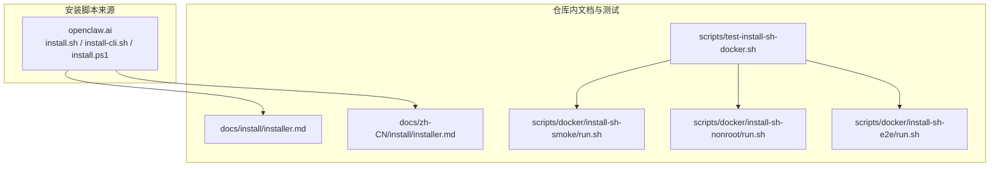
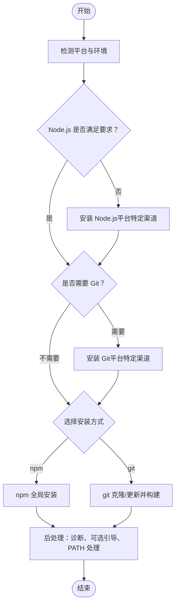
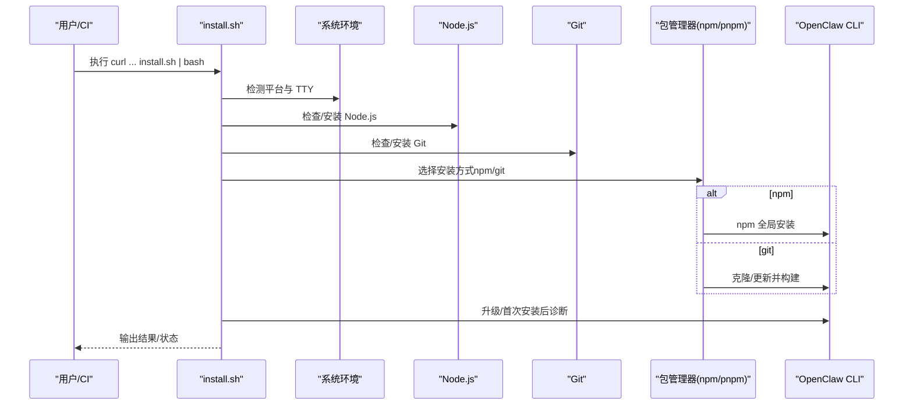
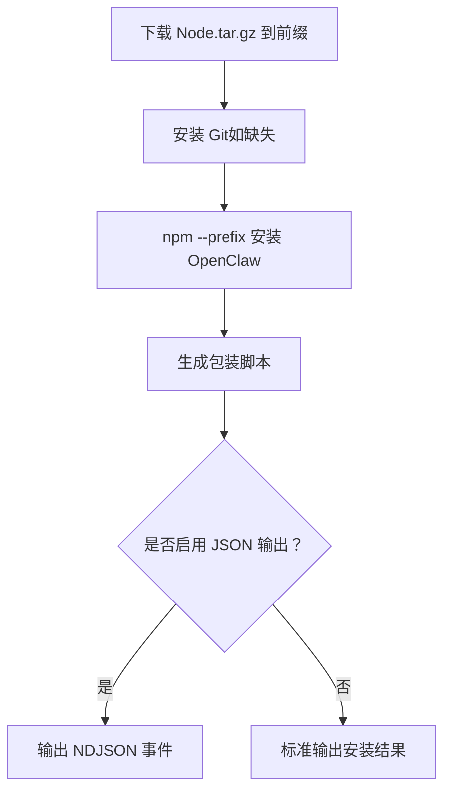
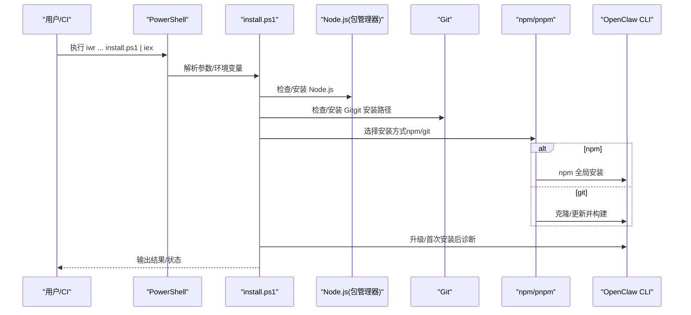
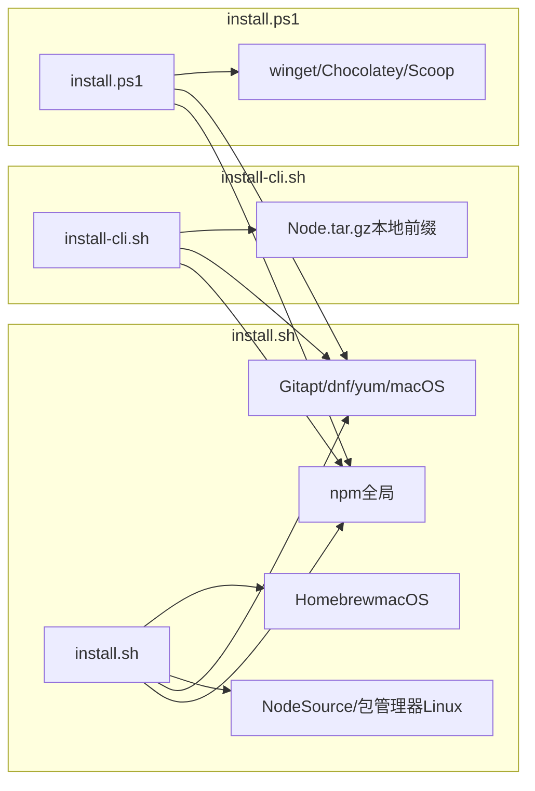

# 安装脚本

<cite>
**本文引用的文件**
- [docs/install/installer.md](file://docs/install/installer.md)
- [docs/zh-CN/install/installer.md](file://docs/zh-CN/install/installer.md)
- [scripts/test-install-sh-docker.sh](file://scripts/test-install-sh-docker.sh)
- [scripts/docker/install-sh-smoke/run.sh](file://scripts/docker/install-sh-smoke/run.sh)
- [scripts/docker/install-sh-nonroot/run.sh](file://scripts/docker/install-sh-nonroot/run.sh)
- [scripts/docker/install-sh-e2e/run.sh](file://scripts/docker/install-sh-e2e/run.sh)
- [docs/help/faq.md](file://docs/help/faq.md)
</cite>

## 目录

1. [简介](#简介)
2. [项目结构](#项目结构)
3. [核心组件](#核心组件)
4. [架构总览](#架构总览)
5. [详细组件分析](#详细组件分析)
6. [依赖关系分析](#依赖关系分析)
7. [性能考虑](#性能考虑)
8. [故障排除指南](#故障排除指南)
9. [结论](#结论)
10. [附录](#附录)

## 简介

本指南面向希望使用官方安装脚本快速部署 OpenClaw 的用户与自动化团队。内容覆盖：

- curl 安装脚本的工作原理与自动安装流程
- macOS/Linux 与 Windows PowerShell 两种安装方式的步骤与差异
- --no-onboard 参数的作用与适用场景
- CI/CD 环境下的自动化安装配置
- 高级选项、环境变量与故障排除方法

## 项目结构

OpenClaw 将安装脚本托管于 openclaw.ai 域名，仓库内提供了对应的中文与英文安装文档，以及用于验证安装流程的 Docker 测试脚本与镜像。

**图表来源**

- [docs/install/installer.md](file://docs/install/installer.md#L1-L406)
- [docs/zh-CN/install/installer.md](file://docs/zh-CN/install/installer.md#L1-L129)
- [scripts/test-install-sh-docker.sh](file://scripts/test-install-sh-docker.sh#L1-L73)
- [scripts/docker/install-sh-smoke/run.sh](file://scripts/docker/install-sh-smoke/run.sh#L1-L93)
- [scripts/docker/install-sh-nonroot/run.sh](file://scripts/docker/install-sh-nonroot/run.sh#L1-L67)
- [scripts/docker/install-sh-e2e/run.sh](file://scripts/docker/install-sh-e2e/run.sh#L1-L536)

**章节来源**

- [docs/install/installer.md](file://docs/install/installer.md#L10-L406)
- [docs/zh-CN/install/installer.md](file://docs/zh-CN/install/installer.md#L17-L129)

## 核心组件

- install.sh（macOS/Linux/WSL 推荐）
  - 自动检测平台，按需安装 Node.js 与 Git
  - 支持 npm 与 git 两种安装路径，默认 npm
  - 升级或 git 安装后尝试运行诊断命令
  - 默认开启 sharp/libvips 兼容性设置
- install-cli.sh（无需 root，本地前缀）
  - 将 OpenClaw 与独立 Node 安装至本地前缀（默认 ~/.openclaw）
  - 可输出 JSON 事件流，便于自动化集成
- install.ps1（Windows PowerShell）
  - 自动检测 PowerShell 与 Node.js（winget/Chocolatey/Scoop）
  - 支持 npm 与 git 安装，默认 npm
  - 升级或 git 安装后尝试运行诊断命令

**章节来源**

- [docs/install/installer.md](file://docs/install/installer.md#L61-L164)
- [docs/zh-CN/install/installer.md](file://docs/zh-CN/install/installer.md#L39-L129)

## 架构总览

下图展示了三种安装脚本在不同平台上的典型工作流与关键决策点。

**图表来源**

- [docs/install/installer.md](file://docs/install/installer.md#L67-L88)
- [docs/zh-CN/install/installer.md](file://docs/zh-CN/install/installer.md#L41-L51)

## 详细组件分析

### install.sh（macOS/Linux/WSL）

- 工作流要点
  - 平台检测与 Homebrew（macOS）/ 包管理器（Linux）集成
  - Node.js 版本检查与按需安装
  - Git 安装与校验（即使 npm 安装也会确保 Git 存在）
  - 安装方式选择：npm（默认）或 git
  - 升级与 git 安装后运行诊断命令
  - 默认设置 sharp/libvips 兼容性变量
- 关键标志与环境变量
  - --install-method/--method、--npm、--git、--version、--beta、--git-dir、--no-git-update、--no-prompt、--no-onboard、--onboard、--dry-run、--verbose、--help
  - OPENCLAW\_\* 与 npm 日志级别等环境变量
- 适用场景
  - 交互式安装（含 TTY）
  - 非交互式安装（CI/无头）

**图表来源**

- [docs/install/installer.md](file://docs/install/installer.md#L67-L88)
- [docs/zh-CN/install/installer.md](file://docs/zh-CN/install/installer.md#L41-L51)

**章节来源**

- [docs/install/installer.md](file://docs/install/installer.md#L61-L164)
- [docs/zh-CN/install/installer.md](file://docs/zh-CN/install/installer.md#L39-L81)

### install-cli.sh（macOS/Linux/WSL，无需 root）

- 工作流要点
  - 下载指定版本 Node.tar.gz 至本地前缀并校验哈希
  - 安装 Git（如缺失）
  - 使用 --prefix 安装 OpenClaw，并生成包装脚本
  - 可输出 NDJSON 事件，便于自动化解析
- 关键标志与环境变量
  - --prefix、--version、--node-version、--json、--onboard、--no-onboard、--set-npm-prefix、--help
  - OPENCLAW\_\* 与 npm 日志级别等环境变量
- 适用场景
  - 无 root 权限的沙箱环境
  - 需要将所有组件置于用户前缀目录

**图表来源**

- [docs/install/installer.md](file://docs/install/installer.md#L174-L186)
- [docs/zh-CN/install/installer.md](file://docs/zh-CN/install/installer.md#L82-L90)

**章节来源**

- [docs/install/installer.md](file://docs/install/installer.md#L168-L242)
- [docs/zh-CN/install/installer.md](file://docs/zh-CN/install/installer.md#L82-L90)

### install.ps1（Windows PowerShell）

- 工作流要点
  - 检查 PowerShell 版本与 Node.js（winget/Chocolatey/Scoop）
  - 安装方式：npm（默认）或 git
  - 升级与 git 安装后尝试运行诊断命令
  - 尽可能将所需 bin 目录加入用户 PATH
- 关键标志与环境变量
  - -InstallMethod、-Tag、-GitDir、-NoOnboard、-NoGitUpdate、-DryRun
  - OPENCLAW\_\* 等环境变量
- 适用场景
  - Windows 本地安装
  - 需要跳过引导流程的自动化场景

**图表来源**

- [docs/install/installer.md](file://docs/install/installer.md#L248-L264)
- [docs/zh-CN/install/installer.md](file://docs/zh-CN/install/installer.md#L92-L129)

**章节来源**

- [docs/install/installer.md](file://docs/install/installer.md#L246-L324)
- [docs/zh-CN/install/installer.md](file://docs/zh-CN/install/installer.md#L92-L129)

### --no-onboard 参数详解与适用场景

- 作用
  - 跳过安装后的引导流程（onboarding），直接完成安装与基础配置
- 适用场景
  - CI/CD 环境（自动化、无头）
  - 预先配置好凭据与工作区的批量部署
  - 需要最小化交互与等待时间的场景
- 注意事项
  - 跳过引导后需自行完成模型配置、凭据注入与健康检查
  - 在 Windows 上，若未正确配置 PATH，仍可能出现命令不可用的情况

**章节来源**

- [docs/install/installer.md](file://docs/install/installer.md#L139-L140)
- [docs/zh-CN/install/installer.md](file://docs/zh-CN/install/installer.md#L39-L51)

### CI/CD 环境下的自动化安装配置

- macOS/Linux/WSL（install.sh）
  - 使用 --no-prompt 与 --no-onboard 实现非交互安装
  - 可通过 OPENCLAW_INSTALL_METHOD、OPENCLAW_VERSION、OPENCLAW_BETA 等环境变量控制安装细节
- Linux（install-cli.sh）
  - 使用 --json 输出事件流，便于解析与监控
  - 可通过 --set-npm-prefix 处理权限问题
- Windows（install.ps1）
  - 使用 -NoOnboard 跳过引导
  - 如需调试，可通过 PowerShell 跟踪模式获取脚本级诊断信息

**章节来源**

- [docs/install/installer.md](file://docs/install/installer.md#L332-L358)
- [scripts/test-install-sh-docker.sh](file://scripts/test-install-sh-docker.sh#L1-L73)

## 依赖关系分析

安装脚本在不同平台上的依赖与外部工具如下：

**图表来源**

- [docs/install/installer.md](file://docs/install/installer.md#L73-L77)
- [docs/zh-CN/install/installer.md](file://docs/zh-CN/install/installer.md#L43-L49)

**章节来源**

- [docs/install/installer.md](file://docs/install/installer.md#L67-L88)
- [docs/zh-CN/install/installer.md](file://docs/zh-CN/install/installer.md#L41-L51)

## 性能考虑

- 选择安装方式
  - npm 安装通常更快且更稳定，适合大多数场景
  - git 安装适合需要从源码构建或参与开发的场景
- 非交互安装
  - 在 CI/CD 中使用 --no-prompt 与 --no-onboard 可显著减少等待与交互开销
- 依赖准备
  - 在容器或受限环境中，提前准备 Node.js 与 Git 可减少安装脚本的探测与安装时间
- 诊断与健康检查
  - 升级或 git 安装后运行诊断命令有助于早期发现问题，避免后续失败

[本节为通用建议，不直接分析具体文件]

## 故障排除指南

- 为什么需要 Git？
  - 即使 npm 安装也会检查/安装 Git，以避免因依赖使用 git URL 导致的 spawn git ENOENT 错误
- Linux 上 npm 报 EACCES
  - 安装脚本会尝试将 npm 全局前缀切换到用户目录，并在存在时追加 PATH 到 shell 配置文件
- sharp/libvips 问题
  - 默认设置兼容变量以避免 sharp 链接系统 libvips；如需链接系统库，请显式关闭兼容变量
- Windows：git 未找到或 openclaw 未被识别
  - 安装 Git for Windows 并确保其在 PATH 中；确认 npm 全局 bin 目录已在 PATH 中
- 获取更详细的日志
  - install.sh：使用 --verbose
  - install.ps1：使用 PowerShell 跟踪模式进行脚本级诊断

**章节来源**

- [docs/install/installer.md](file://docs/install/installer.md#L362-L405)
- [docs/help/faq.md](file://docs/help/faq.md#L532-L585)
- [docs/zh-CN/install/installer.md](file://docs/zh-CN/install/installer.md#L68-L81)

## 结论

- 三类安装脚本分别针对不同平台与使用场景，具备清晰的流程与可配置项
- 在 CI/CD 中，优先采用非交互参数与环境变量，结合容器预热与依赖缓存，可获得更稳定的安装体验
- 若遇到平台特定问题，可参考内置的故障排除建议或使用脚本提供的调试能力

[本节为总结性内容，不直接分析具体文件]

## 附录

### 三类安装脚本对比与适用场景

- install.sh
  - 适用：macOS/Linux/WSL 交互式与非交互式安装
  - 特点：默认 npm 安装，支持 git 安装与引导
- install-cli.sh
  - 适用：无需 root、需要将组件置于本地前缀的场景
  - 特点：下载指定 Node 版本，输出 JSON 事件
- install.ps1
  - 适用：Windows 本地安装与自动化
  - 特点：支持多种 Node 安装渠道，可跳过引导

**章节来源**

- [docs/install/installer.md](file://docs/install/installer.md#L14-L18)
- [docs/zh-CN/install/installer.md](file://docs/zh-CN/install/installer.md#L19-L23)

### CI/CD 最佳实践清单

- 明确安装方式与版本
  - 使用 OPENCLAW_INSTALL_METHOD 与 OPENCLAW_VERSION 控制
- 非交互安装
  - 使用 --no-prompt 与 --no-onboard
- Windows 调试
  - 使用 PowerShell 跟踪模式
- Linux 权限
  - 必要时使用 --set-npm-prefix 或调整 npm 前缀

**章节来源**

- [docs/install/installer.md](file://docs/install/installer.md#L332-L358)
- [scripts/test-install-sh-docker.sh](file://scripts/test-install-sh-docker.sh#L337-L358)
