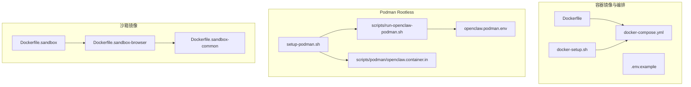
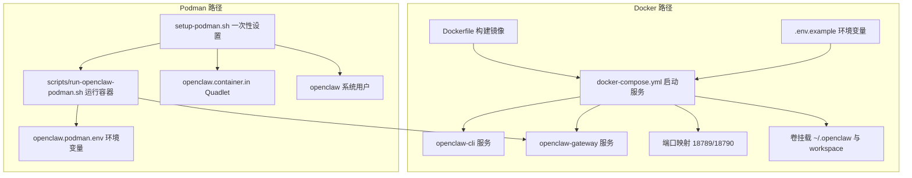
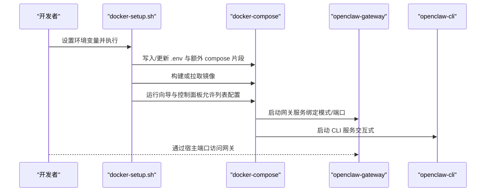
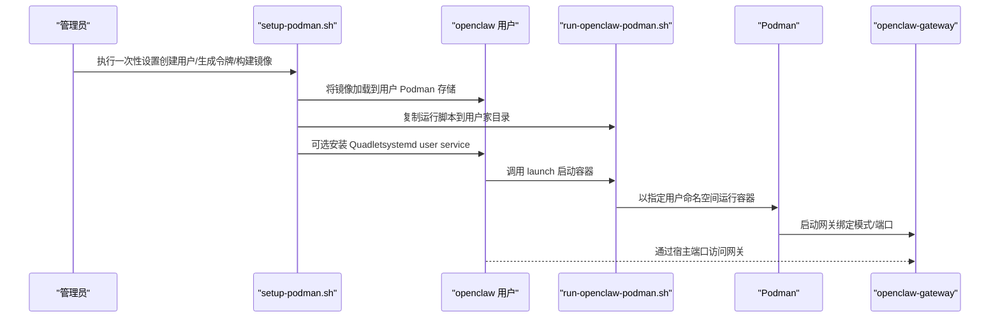
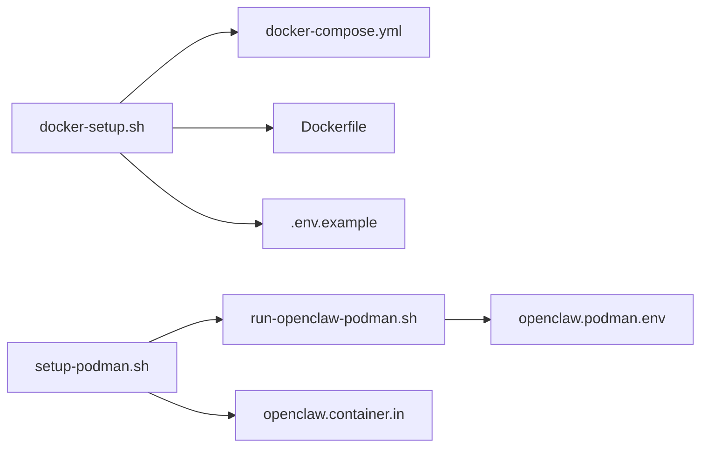

# 容器化部署

<cite>
**本文引用的文件**
- [Dockerfile](file://Dockerfile)
- [docker-compose.yml](file://docker-compose.yml)
- [docker-setup.sh](file://docker-setup.sh)
- [.env.example](file://.env.example)
- [setup-podman.sh](file://setup-podman.sh)
- [scripts/run-openclaw-podman.sh](file://scripts/run-openclaw-podman.sh)
- [openclaw.podman.env](file://openclaw.podman.env)
- [scripts/podman/openclaw.container.in](file://scripts/podman/openclaw.container.in)
- [Dockerfile.sandbox](file://Dockerfile.sandbox)
- [Dockerfile.sandbox-browser](file://Dockerfile.sandbox-browser)
- [Dockerfile.sandbox-common](file://Dockerfile.sandbox-common)
</cite>

## 目录

1. [简介](#简介)
2. [项目结构](#项目结构)
3. [核心组件](#核心组件)
4. [架构总览](#架构总览)
5. [详细组件分析](#详细组件分析)
6. [依赖关系分析](#依赖关系分析)
7. [性能与资源考虑](#性能与资源考虑)
8. [故障排查指南](#故障排查指南)
9. [结论](#结论)
10. [附录](#附录)

## 简介

本指南面向在本地或生产环境中以容器方式运行 OpenClaw 网关（Gateway）与 CLI 的用户，覆盖以下主题：

- 使用 Docker 与 Podman 两种容器技术进行部署与差异对比
- 提供完整的 Dockerfile 与 docker-compose.yml 配置说明
- 解释容器网络、卷挂载与环境变量的配置方法
- 详述 Podman rootless 部署的特殊配置与 setup-podman.sh 脚本用法
- 给出生产环境的容器编排与监控建议

## 项目结构

仓库中与容器化直接相关的文件主要集中在根目录与 scripts 子目录：

- 根级镜像构建与编排：Dockerfile、docker-compose.yml、docker-setup.sh、.env.example
- Podman rootless 部署：setup-podman.sh、scripts/run-openclaw-podman.sh、openclaw.podman.env、scripts/podman/openclaw.container.in
- 沙箱镜像（可选）：Dockerfile.sandbox、Dockerfile.sandbox-browser、Dockerfile.sandbox-common

图表来源

- [Dockerfile](file://Dockerfile#L1-L73)
- [docker-compose.yml](file://docker-compose.yml#L1-L47)
- [docker-setup.sh](file://docker-setup.sh#L1-L380)
- [.env.example](file://.env.example#L1-L81)
- [setup-podman.sh](file://setup-podman.sh#L1-L252)
- [scripts/run-openclaw-podman.sh](file://scripts/run-openclaw-podman.sh#L1-L214)
- [openclaw.podman.env](file://openclaw.podman.env#L1-L25)
- [scripts/podman/openclaw.container.in](file://scripts/podman/openclaw.container.in#L1-L27)
- [Dockerfile.sandbox](file://Dockerfile.sandbox#L1-L21)
- [Dockerfile.sandbox-browser](file://Dockerfile.sandbox-browser#L1-L33)
- [Dockerfile.sandbox-common](file://Dockerfile.sandbox-common#L1-L46)

章节来源

- [Dockerfile](file://Dockerfile#L1-L73)
- [docker-compose.yml](file://docker-compose.yml#L1-L47)
- [docker-setup.sh](file://docker-setup.sh#L1-L380)
- [.env.example](file://.env.example#L1-L81)
- [setup-podman.sh](file://setup-podman.sh#L1-L252)
- [scripts/run-openclaw-podman.sh](file://scripts/run-openclaw-podman.sh#L1-L214)
- [openclaw.podman.env](file://openclaw.podman.env#L1-L25)
- [scripts/podman/openclaw.container.in](file://scripts/podman/openclaw.container.in#L1-L27)
- [Dockerfile.sandbox](file://Dockerfile.sandbox#L1-L21)
- [Dockerfile.sandbox-browser](file://Dockerfile.sandbox-browser#L1-L33)
- [Dockerfile.sandbox-common](file://Dockerfile.sandbox-common#L1-L46)

## 核心组件

- Docker 镜像构建与运行
  - 基于 Node.js 22 的官方镜像，启用 Bun 并安装 pnpm；支持可选预装浏览器依赖以降低冷启动时间
  - 默认以非 root 用户运行，暴露网关端口，入口命令为启动 Gateway
- Docker Compose 编排
  - 定义 openclaw-gateway 与 openclaw-cli 两个服务，支持环境变量注入、卷挂载与端口映射
  - 支持通过环境变量控制绑定模式、端口与令牌等
- Podman Rootless 部署
  - 一次性脚本 setup-podman.sh 创建专用系统用户、生成令牌、构建镜像并加载到目标用户 Podman 存储
  - 运行脚本 scripts/run-openclaw-podman.sh 负责容器启动、环境注入与可选的向导初始化
  - 可选 systemd Quadlet（openclaw.container.in）实现开机自启与自动重启
- 沙箱镜像（可选）
  - 提供基础开发/测试沙箱镜像，以及带浏览器与 VNC 的可选变体

章节来源

- [Dockerfile](file://Dockerfile#L1-L73)
- [docker-compose.yml](file://docker-compose.yml#L1-L47)
- [docker-setup.sh](file://docker-setup.sh#L1-L380)
- [setup-podman.sh](file://setup-podman.sh#L1-L252)
- [scripts/run-openclaw-podman.sh](file://scripts/run-openclaw-podman.sh#L1-L214)
- [openclaw.podman.env](file://openclaw.podman.env#L1-L25)
- [scripts/podman/openclaw.container.in](file://scripts/podman/openclaw.container.in#L1-L27)
- [Dockerfile.sandbox](file://Dockerfile.sandbox#L1-L21)
- [Dockerfile.sandbox-browser](file://Dockerfile.sandbox-browser#L1-L33)
- [Dockerfile.sandbox-common](file://Dockerfile.sandbox-common#L1-L46)

## 架构总览

下图展示 Docker 与 Podman 两种部署路径的高层交互。

图表来源

- [Dockerfile](file://Dockerfile#L1-L73)
- [docker-compose.yml](file://docker-compose.yml#L1-L47)
- [.env.example](file://.env.example#L1-L81)
- [setup-podman.sh](file://setup-podman.sh#L1-L252)
- [scripts/run-openclaw-podman.sh](file://scripts/run-openclaw-podman.sh#L1-L214)
- [openclaw.podman.env](file://openclaw.podman.env#L1-L25)
- [scripts/podman/openclaw.container.in](file://scripts/podman/openclaw.container.in#L1-L27)

## 详细组件分析

### Docker 部署流程（含 docker-compose）

- 镜像构建
  - 使用 Node.js 22 基础镜像，启用 Bun 与 pnpm；支持通过构建参数安装浏览器依赖以减少容器启动时的下载等待
  - 构建后以非 root 用户运行，入口命令启动 Gateway，并默认绑定到回环地址
- 编排与运行
  - docker-compose 定义两个服务：openclaw-gateway（网关）与 openclaw-cli（交互式 CLI）
  - 环境变量通过 .env 注入，支持令牌、通道与模型提供商密钥等
  - 卷挂载将宿主上的配置目录与工作区映射到容器内，便于持久化与外部管理
  - 端口映射将容器内的网关与桥接端口映射到宿主，便于访问与调试

图表来源

- [docker-setup.sh](file://docker-setup.sh#L1-L380)
- [docker-compose.yml](file://docker-compose.yml#L1-L47)
- [.env.example](file://.env.example#L1-L81)

章节来源

- [Dockerfile](file://Dockerfile#L1-L73)
- [docker-compose.yml](file://docker-compose.yml#L1-L47)
- [docker-setup.sh](file://docker-setup.sh#L1-L380)
- [.env.example](file://.env.example#L1-L81)

### Podman Rootless 部署流程

- 一次性设置（setup-podman.sh）
  - 创建专用系统用户（无登录 shell），生成并写入网关令牌，初始化最小配置
  - 构建镜像并保存到临时归档，再加载到目标用户的 Podman 存储
  - 可选安装 systemd Quadlet，使容器作为用户服务开机自启
- 运行容器（scripts/run-openclaw-podman.sh）
  - 自动创建配置与工作区目录，注入环境变量（优先使用 openclaw.podman.env）
  - 支持以 keep-id 或 host 用户命名空间运行，必要时传入 --user 参数确保挂载权限一致
  - 启动网关容器并映射端口；如传入 setup/onboard，则进入向导初始化

图表来源

- [setup-podman.sh](file://setup-podman.sh#L1-L252)
- [scripts/run-openclaw-podman.sh](file://scripts/run-openclaw-podman.sh#L1-L214)
- [openclaw.podman.env](file://openclaw.podman.env#L1-L25)
- [scripts/podman/openclaw.container.in](file://scripts/podman/openclaw.container.in#L1-L27)

章节来源

- [setup-podman.sh](file://setup-podman.sh#L1-L252)
- [scripts/run-openclaw-podman.sh](file://scripts/run-openclaw-podman.sh#L1-L214)
- [openclaw.podman.env](file://openclaw.podman.env#L1-L25)
- [scripts/podman/openclaw.container.in](file://scripts/podman/openclaw.container.in#L1-L27)

### 网络、卷挂载与环境变量配置

- 网络
  - Docker：通过 ports 映射容器端口到宿主端口；默认绑定模式可在 compose 中覆盖
  - Podman：通过 -p 映射端口；默认绑定模式为 loopback，如需外网访问需配置控制面板允许列表
- 卷挂载
  - Docker：通过 volumes 将宿主配置目录与工作区映射到容器内，便于持久化与外部管理
  - Podman：通过 -v 将宿主配置目录与工作区映射到容器内，注意用户命名空间与权限一致性
- 环境变量
  - Docker：通过 environment 注入令牌、通道与模型提供商密钥等
  - Podman：通过 --env-file 或直接注入令牌；支持从 openclaw.podman.env 加载
  - 通用示例：参考 .env.example，其中包含令牌、通道与工具类 API 密钥等键位

章节来源

- [docker-compose.yml](file://docker-compose.yml#L1-L47)
- [scripts/run-openclaw-podman.sh](file://scripts/run-openclaw-podman.sh#L1-L214)
- [.env.example](file://.env.example#L1-L81)
- [openclaw.podman.env](file://openclaw.podman.env#L1-L25)

### Dockerfile 与 docker-compose 关键点

- Dockerfile
  - 使用 Node.js 22 基础镜像，启用 Bun 与 pnpm；支持可选安装浏览器依赖
  - 构建后以非 root 用户运行，入口命令启动 Gateway，默认绑定到回环地址
- docker-compose
  - 定义 openclaw-gateway 与 openclaw-cli 两个服务
  - 支持通过环境变量控制绑定模式、端口与令牌等
  - 卷挂载将宿主配置目录与工作区映射到容器内

章节来源

- [Dockerfile](file://Dockerfile#L1-L73)
- [docker-compose.yml](file://docker-compose.yml#L1-L47)

### Podman Rootless 特殊配置

- 用户与命名空间
  - 一次性脚本创建专用系统用户（无登录 shell），并检查子 UID/GID 范围
  - 运行脚本支持 keep-id/host 用户命名空间，必要时传入 --user 参数确保挂载权限一致
- 环境与配置
  - 自动生成网关令牌并写入 openclaw.podman.env；首次运行创建最小配置
  - 可选安装 systemd Quadlet，实现开机自启与自动重启
- 端口与绑定
  - 默认绑定模式为 loopback；如需外网访问需配置控制面板允许列表

章节来源

- [setup-podman.sh](file://setup-podman.sh#L1-L252)
- [scripts/run-openclaw-podman.sh](file://scripts/run-openclaw-podman.sh#L1-L214)
- [openclaw.podman.env](file://openclaw.podman.env#L1-L25)
- [scripts/podman/openclaw.container.in](file://scripts/podman/openclaw.container.in#L1-L27)

### 沙箱镜像（可选）

- 基础沙箱镜像：提供常用工具与用户，适合开发与测试
- 浏览器与 VNC 沙箱镜像：包含 Chromium、Xvfb、novnc、websockify、x11vnc 等，便于远程可视化调试
- 通用沙箱基础镜像：可定制安装 pnpm、Bun、Homebrew 等工具链

章节来源

- [Dockerfile.sandbox](file://Dockerfile.sandbox#L1-L21)
- [Dockerfile.sandbox-browser](file://Dockerfile.sandbox-browser#L1-L33)
- [Dockerfile.sandbox-common](file://Dockerfile.sandbox-common#L1-L46)

## 依赖关系分析

- Docker 路径
  - docker-setup.sh 依赖 docker 与 docker-compose，负责生成 .env、写入额外 compose 片段、构建/拉取镜像、运行向导与启动服务
  - docker-compose.yml 依赖 Dockerfile 与 .env 示例中的键位
- Podman 路径
  - setup-podman.sh 依赖 podman、sudo（可选）、subuid/subgid；负责创建用户、生成令牌、构建镜像并加载到用户存储
  - scripts/run-openclaw-podman.sh 依赖 podman 与 openclaw.podman.env；负责容器运行、环境注入与可选向导初始化
  - openclaw.container.in 为 systemd Quadlet 模板，用于开机自启

图表来源

- [docker-setup.sh](file://docker-setup.sh#L1-L380)
- [docker-compose.yml](file://docker-compose.yml#L1-L47)
- [Dockerfile](file://Dockerfile#L1-L73)
- [.env.example](file://.env.example#L1-L81)
- [setup-podman.sh](file://setup-podman.sh#L1-L252)
- [scripts/run-openclaw-podman.sh](file://scripts/run-openclaw-podman.sh#L1-L214)
- [openclaw.podman.env](file://openclaw.podman.env#L1-L25)
- [scripts/podman/openclaw.container.in](file://scripts/podman/openclaw.container.in#L1-L27)

章节来源

- [docker-setup.sh](file://docker-setup.sh#L1-L380)
- [docker-compose.yml](file://docker-compose.yml#L1-L47)
- [Dockerfile](file://Dockerfile#L1-L73)
- [.env.example](file://.env.example#L1-L81)
- [setup-podman.sh](file://setup-podman.sh#L1-L252)
- [scripts/run-openclaw-podman.sh](file://scripts/run-openclaw-podman.sh#L1-L214)
- [openclaw.podman.env](file://openclaw.podman.env#L1-L25)
- [scripts/podman/openclaw.container.in](file://scripts/podman/openclaw.container.in#L1-L27)

## 性能与资源考虑

- 构建阶段
  - Docker：可通过构建参数预装浏览器依赖，减少容器启动时的下载等待
  - Podman：一次性设置阶段构建镜像并加载到用户存储，避免重复构建
- 运行阶段
  - 非 root 用户运行降低逃逸风险，但需确保卷挂载权限正确
  - 控制面板允许列表仅在需要外网访问时配置，避免不必要的安全开销
- 资源限制
  - 生产环境建议在编排层设置 CPU/内存限制与健康检查，结合自动重启策略

[本节为通用指导，不直接分析具体文件]

## 故障排查指南

- Docker
  - 端口冲突：确认宿主端口未被占用；修改 docker-compose.yml 中的端口映射
  - 权限问题：确认卷挂载目录属主与容器内用户一致；必要时调整宿主目录权限
  - 环境变量缺失：检查 .env 文件是否包含必需键值；确保 docker-compose.yml 正确注入
- Podman
  - 用户命名空间：若使用 keep-id，请确保 --user 与宿主目录属主一致；否则可能需要手动修复权限
  - 子 UID/GID：确认 /etc/subuid 与 /etc/subgid 中存在目标用户的范围
  - Quadlet：若使用 systemd Quadlet，检查服务状态与日志输出
- 通用
  - 令牌与绑定：确保 OPENCLAW_GATEWAY_TOKEN 设置且有效；如需外网访问，配置控制面板允许列表
  - 日志：使用 docker compose logs 或 podman logs 查看容器日志定位问题

章节来源

- [docker-setup.sh](file://docker-setup.sh#L1-L380)
- [scripts/run-openclaw-podman.sh](file://scripts/run-openclaw-podman.sh#L1-L214)
- [openclaw.podman.env](file://openclaw.podman.env#L1-L25)

## 结论

- Docker 适合快速本地验证与 CI/CD 场景，具备成熟的生态与工具链
- Podman Rootless 更贴近生产环境的权限与安全模型，适合长期运行与系统集成
- 两种路径均支持通过环境变量与卷挂载实现灵活配置与持久化
- 建议在生产环境结合健康检查、自动重启与监控告警，确保高可用性

[本节为总结性内容，不直接分析具体文件]

## 附录

### A. Docker 与 Podman 差异速览

- 用户与权限
  - Docker：默认 root 用户运行，权限较高
  - Podman：支持 rootless，更贴近生产安全模型
- 命名空间与挂载
  - Docker：默认 host 命名空间
  - Podman：支持 keep-id/host 命名空间，需显式传入 --user
- 自动重启与开机自启
  - Docker：restart 策略由编排层控制
  - Podman：可使用 systemd Quadlet 实现开机自启与自动重启

章节来源

- [Dockerfile](file://Dockerfile#L1-L73)
- [docker-compose.yml](file://docker-compose.yml#L1-L47)
- [setup-podman.sh](file://setup-podman.sh#L1-L252)
- [scripts/run-openclaw-podman.sh](file://scripts/run-openclaw-podman.sh#L1-L214)

### B. 环境变量清单（摘自 .env.example 与 Podman 环境文件）

- 网关认证与路径
  - OPENCLAW_GATEWAY_TOKEN：网关访问令牌
  - OPENCLAW_GATEWAY_PASSWORD：可选密码认证
  - OPENCLAW_STATE_DIR、OPENCLAW_CONFIG_PATH、OPENCLAW_HOME：可选路径覆盖
- 模型提供商 API 密钥
  - OPENAI_API_KEY、ANTHROPIC_API_KEY、GEMINI_API_KEY 等
- 通道令牌
  - TELEGRAM_BOT_TOKEN、DISCORD_BOT_TOKEN、SLACK_BOT_TOKEN 等
- 工具与媒体
  - BRAVE_API_KEY、PERPLEXITY_API_KEY、ELEVENLABS_API_KEY 等

章节来源

- [.env.example](file://.env.example#L1-L81)
- [openclaw.podman.env](file://openclaw.podman.env#L1-L25)

### C. 生产环境容器编排与监控建议

- 健康检查
  - 在编排层添加健康检查，确保容器启动完成后再对外提供服务
- 自动重启与资源限制
  - 设置 restart 策略与 CPU/内存限制，避免资源耗尽导致的服务中断
- 监控与日志
  - 集成日志收集与指标采集，定期巡检容器状态与错误日志
- 备份与迁移
  - 定期备份配置目录与工作区，确保数据可恢复

[本节为通用指导，不直接分析具体文件]
