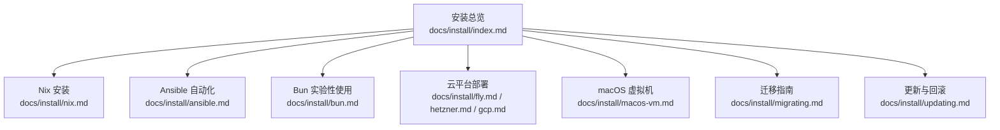
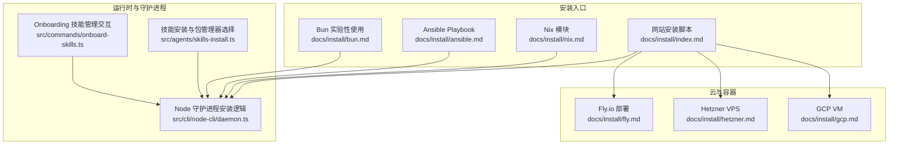
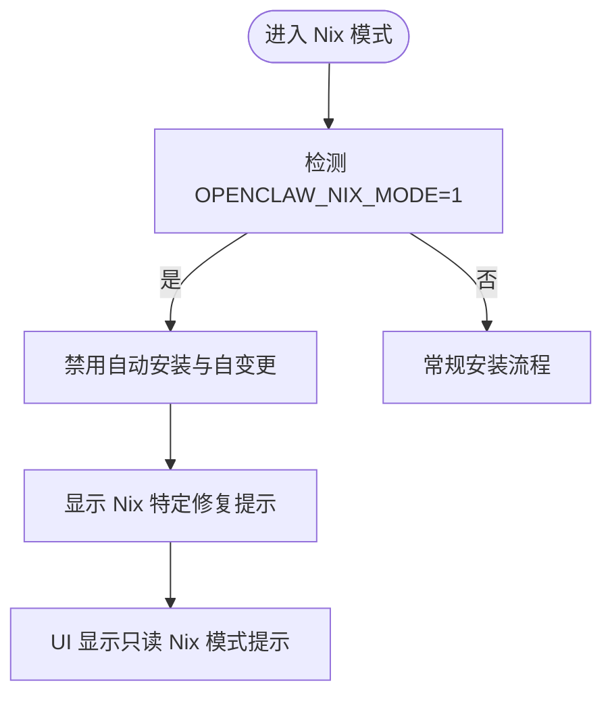
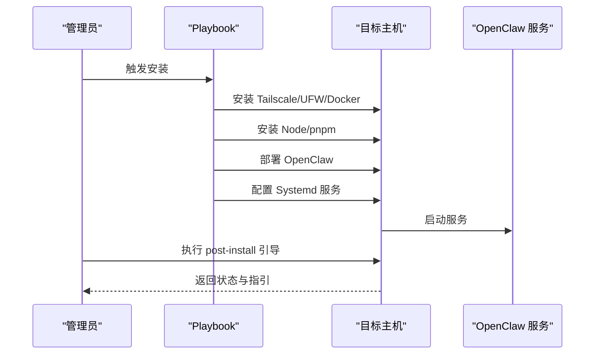
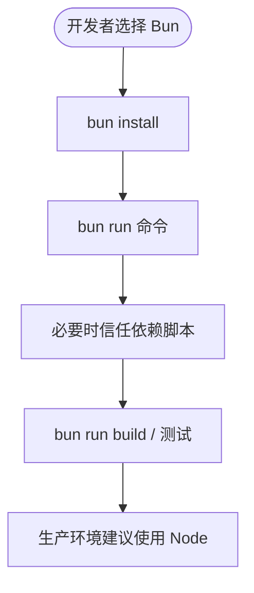
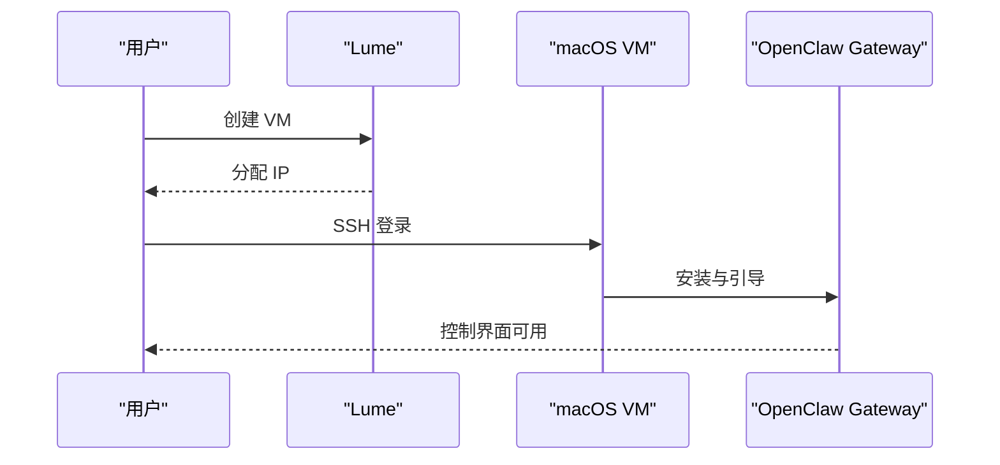
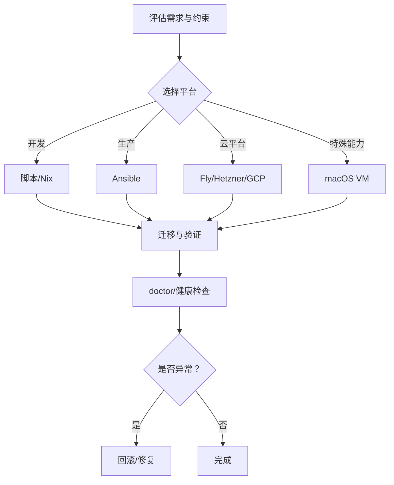
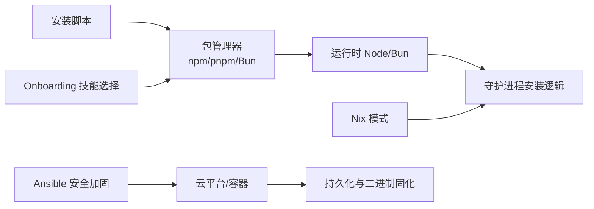

# 平台特定安装

<cite>
**本文引用的文件**
- [docs/install/index.md](file://docs/install/index.md)
- [docs/install/nix.md](file://docs/install/nix.md)
- [docs/install/ansible.md](file://docs/install/ansible.md)
- [docs/install/bun.md](file://docs/install/bun.md)
- [docs/install/fly.md](file://docs/install/fly.md)
- [docs/install/hetzner.md](file://docs/install/hetzner.md)
- [docs/install/gcp.md](file://docs/install/gcp.md)
- [docs/install/macos-vm.md](file://docs/install/macos-vm.md)
- [docs/install/migrating.md](file://docs/install/migrating.md)
- [docs/install/updating.md](file://docs/install/updating.md)
- [src/cli/node-cli/daemon.ts](file://src/cli/node-cli/daemon.ts)
- [src/agents/skills-install.ts](file://src/agents/skills-install.ts)
- [src/commands/onboard-skills.ts](file://src/commands/onboard-skills.ts)
- [README.md](file://README.md)
</cite>

## 目录

1. [简介](#简介)
2. [项目结构](#项目结构)
3. [核心组件](#核心组件)
4. [架构总览](#架构总览)
5. [详细组件分析](#详细组件分析)
6. [依赖分析](#依赖分析)
7. [性能考虑](#性能考虑)
8. [故障排除指南](#故障排除指南)
9. [结论](#结论)
10. [附录](#附录)

## 简介

本指南聚焦“平台特定安装”，围绕以下主题展开：Nix 包管理器的声明式安装与优势；Ansible 自动化部署的最佳实践；Bun 运行时的 CLI-only 使用场景与性能特征；以及云平台市场镜像、虚拟专用服务器（VPS）等特殊环境的安装注意事项。同时提供平台选择的决策依据与迁移建议，帮助你在不同操作系统、容器与云环境中稳定、可重复地部署 OpenClaw。

## 项目结构

本仓库提供了多平台安装与部署文档，涵盖从本地开发到生产云主机的多种路径。安装相关文档主要位于 docs/install 目录，配合源码中的安装与运行逻辑实现，形成“文档—代码—实践”的闭环。

图表来源

- [docs/install/index.md](file://docs/install/index.md#L1-L219)
- [docs/install/nix.md](file://docs/install/nix.md#L1-L99)
- [docs/install/ansible.md](file://docs/install/ansible.md#L1-L209)
- [docs/install/bun.md](file://docs/install/bun.md#L1-L60)
- [docs/install/fly.md](file://docs/install/fly.md#L1-L491)
- [docs/install/hetzner.md](file://docs/install/hetzner.md#L1-L357)
- [docs/install/gcp.md](file://docs/install/gcp.md#L1-L525)
- [docs/install/macos-vm.md](file://docs/install/macos-vm.md#L1-L282)
- [docs/install/migrating.md](file://docs/install/migrating.md#L1-L193)
- [docs/install/updating.md](file://docs/install/updating.md#L1-L258)

章节来源

- [docs/install/index.md](file://docs/install/index.md#L1-L219)

## 核心组件

- 安装入口与脚本：网站安装脚本支持多平台一键安装与引导，适合快速上手与自动化部署。
- 包管理器集成：支持 npm/pnpm（推荐），并兼容 Bun 的实验性使用场景。
- 声明式安装：Nix 模块提供确定性、可回滚的安装体验，适合对可重复性与可审计性有要求的用户。
- 自动化部署：Ansible Playbook 提供安全加固、防火墙隔离与系统服务集成的一站式方案。
- 云平台部署：Fly.io、Hetzner、GCP 等提供从单实例到容器化的完整部署参考。
- 特殊环境：macOS VM 场景用于隔离与 iMessage 集成；VPS 场景强调持久化与二进制固化。
- 迁移与更新：提供状态目录与工作区迁移策略，以及更新与回滚流程。

章节来源

- [docs/install/index.md](file://docs/install/index.md#L14-L219)
- [docs/install/nix.md](file://docs/install/nix.md#L1-L99)
- [docs/install/ansible.md](file://docs/install/ansible.md#L1-L209)
- [docs/install/bun.md](file://docs/install/bun.md#L1-L60)
- [docs/install/fly.md](file://docs/install/fly.md#L1-L491)
- [docs/install/hetzner.md](file://docs/install/hetzner.md#L1-L357)
- [docs/install/gcp.md](file://docs/install/gcp.md#L1-L525)
- [docs/install/macos-vm.md](file://docs/install/macos-vm.md#L1-L282)
- [docs/install/migrating.md](file://docs/install/migrating.md#L1-L193)
- [docs/install/updating.md](file://docs/install/updating.md#L1-L258)

## 架构总览

下图展示了从安装入口到运行态的关键路径，体现不同平台安装方式与运行时行为的关系。

图表来源

- [docs/install/index.md](file://docs/install/index.md#L34-L141)
- [docs/install/nix.md](file://docs/install/nix.md#L46-L81)
- [docs/install/ansible.md](file://docs/install/ansible.md#L42-L53)
- [docs/install/bun.md](file://docs/install/bun.md#L16-L59)
- [src/cli/node-cli/daemon.ts](file://src/cli/node-cli/daemon.ts#L93-L126)
- [src/agents/skills-install.ts](file://src/agents/skills-install.ts#L101-L154)
- [src/commands/onboard-skills.ts](file://src/commands/onboard-skills.ts#L116-L157)
- [docs/install/fly.md](file://docs/install/fly.md#L21-L81)
- [docs/install/hetzner.md](file://docs/install/hetzner.md#L47-L202)
- [docs/install/gcp.md](file://docs/install/gcp.md#L39-L281)

## 详细组件分析

### Nix 声明式安装

- 确定性与可回滚：通过 nix-openclaw 模块统一安装、配置与服务管理，支持一键回滚。
- Nix 模式限制：在 Nix 模式下禁用自动安装与自变更流程，强制显式修复缺失依赖。
- 环境变量与路径：通过 OPENCLAW\_\* 系列变量控制配置与状态目录，避免写入不可变存储。
- 适用场景：追求可重复性、可审计性的团队或个人，尤其在 NixOS 或 Home Manager 环境中。

图表来源

- [docs/install/nix.md](file://docs/install/nix.md#L46-L81)

章节来源

- [docs/install/nix.md](file://docs/install/nix.md#L1-L99)

### Ansible 自动化部署

- 安全优先：UFW 防火墙、Docker 隔离、Systemd 硬化、Tailscale VPN。
- 一键安装：预置 Ansible Collections，执行 playbook 完成环境准备与服务安装。
- 运维友好：提供日志查看、服务重启、沙箱镜像构建等运维命令。
- 适用场景：需要安全加固与远程访问能力的生产服务器部署。

图表来源

- [docs/install/ansible.md](file://docs/install/ansible.md#L42-L85)
- [docs/install/ansible.md](file://docs/install/ansible.md#L112-L143)

章节来源

- [docs/install/ansible.md](file://docs/install/ansible.md#L1-L209)

### Bun 运行时（CLI-only）

- 使用场景：本地开发与热迭代，Bun 可直接运行 TypeScript，提升开发效率。
- 注意事项：Bun 无法使用 pnpm 锁定文件；部分生命周期脚本可能被阻断，需显式信任。
- 生产建议：不推荐用于 Gateway 运行时（WhatsApp/Telegram 存在已知问题），生产仍以 Node 为主。

图表来源

- [docs/install/bun.md](file://docs/install/bun.md#L22-L59)

章节来源

- [docs/install/bun.md](file://docs/install/bun.md#L1-L60)

### 云平台与 VPS 安装

- Fly.io：提供持久卷、HTTPS、私有部署选项，适合快速上线与公网暴露需求。
- Hetzner：Docker 部署，强调二进制固化与持久化，适合长期稳定运行。
- GCP：基于 Compute Engine 的 VM 部署，提供 IAM 最小权限与 SSH 隧道访问。
- 通用原则：持久化状态目录、二进制固化、最小暴露面、SSH 隧道访问。

图表来源

- [docs/install/fly.md](file://docs/install/fly.md#L21-L137)
- [docs/install/hetzner.md](file://docs/install/hetzner.md#L47-L202)
- [docs/install/gcp.md](file://docs/install/gcp.md#L39-L281)

章节来源

- [docs/install/fly.md](file://docs/install/fly.md#L1-L491)
- [docs/install/hetzner.md](file://docs/install/hetzner.md#L1-L357)
- [docs/install/gcp.md](file://docs/install/gcp.md#L1-L525)

### 特殊环境：macOS VM

- 隔离与复现：通过 Lume 在本地或云端创建沙盒 macOS VM，便于 iMessage/BlueBubbles 集成与环境复现。
- 工作流：创建 VM → 完成设置 → SSH 登录 → 安装 OpenClaw → 配置通道 → 头起运行。
- 适用场景：需要 macOS 能力但又希望隔离与可克隆的用户。

图表来源

- [docs/install/macos-vm.md](file://docs/install/macos-vm.md#L45-L196)

章节来源

- [docs/install/macos-vm.md](file://docs/install/macos-vm.md#L1-L282)

### 平台选择与迁移建议

- 平台选择决策：
  - 开发与本地：优先使用网站安装脚本或 Nix（确定性）。
  - 生产服务器：优先 Ansible（安全加固、系统服务集成）。
  - 云平台：Fly.io 快速上线，Hetzner/GCP 注重可控性与合规。
  - 特殊能力：需要 iMessage/BlueBubbles 或严格隔离时，采用 macOS VM。
- 迁移策略：
  - 复制状态目录与工作区，确保凭据、会话与通道状态不丢失。
  - 注意 profile 与 state 目录一致性，避免权限与所有权问题。
  - 更新后运行 doctor 与健康检查，必要时回滚至已知稳定版本。

图表来源

- [docs/install/index.md](file://docs/install/index.md#L14-L32)
- [docs/install/migrating.md](file://docs/install/migrating.md#L68-L132)
- [docs/install/updating.md](file://docs/install/updating.md#L206-L257)

章节来源

- [docs/install/index.md](file://docs/install/index.md#L14-L32)
- [docs/install/migrating.md](file://docs/install/migrating.md#L1-L193)
- [docs/install/updating.md](file://docs/install/updating.md#L1-L258)

## 依赖分析

- 安装入口与运行时耦合点：
  - 安装脚本与包管理器（npm/pnpm/Bun）共同决定运行时环境。
  - Nix 模式下禁用自动安装，强调显式修复与外部依赖管理。
  - Onboarding 与技能安装流程根据用户选择的包管理器生成相应命令。
- 云平台与容器：
  - Fly/Hetzner/GCP 文档强调持久化与二进制固化，避免运行时安装导致的状态丢失。
- 运维与安全：
  - Ansible 提供防火墙、VPN、Docker 隔离与 Systemd 硬化，形成四层防御。

图表来源

- [src/cli/node-cli/daemon.ts](file://src/cli/node-cli/daemon.ts#L106-L126)
- [src/agents/skills-install.ts](file://src/agents/skills-install.ts#L101-L154)
- [src/commands/onboard-skills.ts](file://src/commands/onboard-skills.ts#L139-L157)
- [docs/install/ansible.md](file://docs/install/ansible.md#L87-L111)
- [docs/install/hetzner.md](file://docs/install/hetzner.md#L205-L264)
- [docs/install/gcp.md](file://docs/install/gcp.md#L284-L343)

章节来源

- [src/cli/node-cli/daemon.ts](file://src/cli/node-cli/daemon.ts#L93-L126)
- [src/agents/skills-install.ts](file://src/agents/skills-install.ts#L101-L154)
- [src/commands/onboard-skills.ts](file://src/commands/onboard-skills.ts#L116-L157)
- [docs/install/ansible.md](file://docs/install/ansible.md#L87-L111)
- [docs/install/hetzner.md](file://docs/install/hetzner.md#L205-L264)
- [docs/install/gcp.md](file://docs/install/gcp.md#L284-L343)

## 性能考虑

- Bun 在本地开发中具备更快的冷启动与热迭代优势，但不适合生产运行时。
- 云平台部署应合理分配内存与 CPU，避免 OOM 与频繁重启。
- Docker 部署需注意二进制固化，避免每次启动重新安装导致的延迟与失败。
- Nix 模式下所有状态与配置均来自受控位置，减少运行时 IO 与不确定性。

## 故障排除指南

- 安装脚本与 PATH 问题：确认全局安装路径在 PATH 中，必要时重新加载 shell 配置。
- Nix 模式：若出现自动安装被禁用，按提示修复缺失依赖或切换到非 Nix 环境。
- Ansible：若服务无法启动，检查 systemd 日志与权限，确认 Docker 与 UFW 配置正确。
- 云平台：Fly.io 内存不足、Hetzner/GCP 构建 OOM、macOS VM SSH 不通等问题均有对应排查步骤。
- 迁移与更新：doctor 为“安全更新”命令，更新后务必重启并进行健康检查；异常时使用 pin 回滚。

章节来源

- [docs/install/index.md](file://docs/install/index.md#L181-L204)
- [docs/install/nix.md](file://docs/install/nix.md#L76-L81)
- [docs/install/ansible.md](file://docs/install/ansible.md#L147-L194)
- [docs/install/fly.md](file://docs/install/fly.md#L245-L327)
- [docs/install/hetzner.md](file://docs/install/hetzner.md#L293-L316)
- [docs/install/gcp.md](file://docs/install/gcp.md#L382-L422)
- [docs/install/migrating.md](file://docs/install/migrating.md#L133-L187)
- [docs/install/updating.md](file://docs/install/updating.md#L169-L257)

## 结论

- 对于追求确定性与可回滚的用户，优先选择 Nix。
- 对于需要安全加固与系统服务集成的生产环境，优先选择 Ansible。
- 对于云平台快速上线与公网暴露，Fly.io 是便捷之选；对于可控性与合规，Hetzner/GCP 更合适。
- 对于需要 macOS 能力或严格隔离的场景，采用 macOS VM。
- 迁移与更新遵循“备份—复制—doctor—重启—验证”的流程，异常时使用 pin 回滚。

## 附录

- 平台选择速查表（简化版）
  - 开发/本地：脚本安装或 Nix
  - 生产服务器：Ansible
  - 云平台：Fly（快速）、Hetzner/GCP（可控）
  - 特殊能力：macOS VM
- 关键环境变量与路径
  - OPENCLAW_STATE_DIR：状态目录
  - OPENCLAW_CONFIG_PATH：配置文件路径
  - OPENCLAW_HOME：基础家目录（可选）

章节来源

- [docs/install/index.md](file://docs/install/index.md#L173-L179)
- [docs/install/nix.md](file://docs/install/nix.md#L64-L75)
- [README.md](file://README.md#L50-L81)
