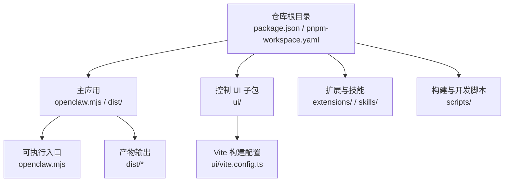
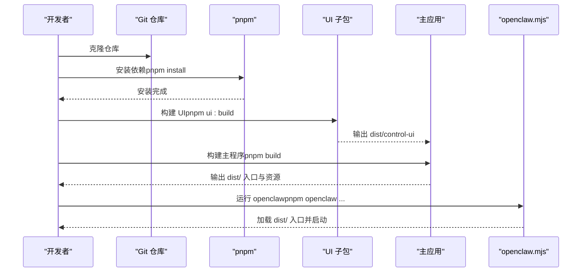
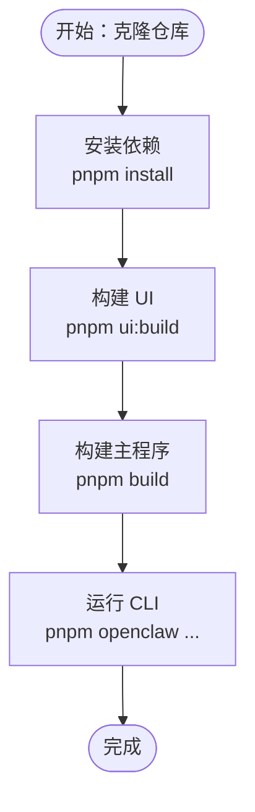
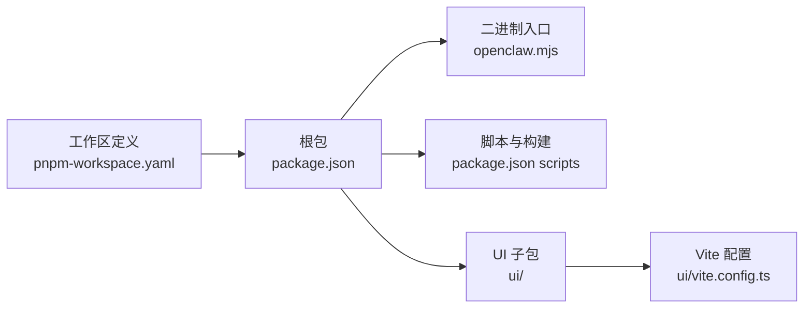

# 源码编译安装

<cite>
**本文引用的文件**
- [README.md](file://README.md)
- [package.json](file://package.json)
- [pnpm-workspace.yaml](file://pnpm-workspace.yaml)
- [scripts/ui.js](file://scripts/ui.js)
- [openclaw.mjs](file://openclaw.mjs)
- [ui/package.json](file://ui/package.json)
- [ui/vite.config.ts](file://ui/vite.config.ts)
- [CONTRIBUTING.md](file://CONTRIBUTING.md)
- [docs/start/wizard.md](file://docs/start/wizard.md)
</cite>

## 目录

1. [简介](#简介)
2. [项目结构](#项目结构)
3. [核心组件](#核心组件)
4. [架构总览](#架构总览)
5. [详细组件分析](#详细组件分析)
6. [依赖关系分析](#依赖关系分析)
7. [性能与构建特性](#性能与构建特性)
8. [故障排查与常见问题](#故障排查与常见问题)
9. [贡献者工作流与最佳实践](#贡献者工作流与最佳实践)
10. [结论](#结论)

## 简介

本指南面向希望从源码编译并安装 OpenClaw 的开发者与高级用户，覆盖以下关键目标：

- 克隆仓库与准备开发环境（Node、pnpm）
- 安装依赖、构建 UI 与主程序
- 解释 pnpm link --global 命令的作用与替代方案
- 提供开发环境设置与调试配置建议
- 总结构建过程中的常见问题与解决思路
- 说明贡献者工作流程与本地开发最佳实践

## 项目结构

OpenClaw 采用多包工作区（pnpm workspace）组织，根目录包含主应用与 UI 子包、扩展与技能等模块；构建脚本通过顶层 package.json 脚本统一协调。

图表来源

- [package.json](file://package.json#L49-L149)
- [pnpm-workspace.yaml](file://pnpm-workspace.yaml#L1-L6)
- [ui/vite.config.ts](file://ui/vite.config.ts#L21-L43)
- [openclaw.mjs](file://openclaw.mjs#L1-L57)

章节来源

- [package.json](file://package.json#L49-L149)
- [pnpm-workspace.yaml](file://pnpm-workspace.yaml#L1-L6)

## 核心组件

- 主应用入口与运行器
  - 可执行入口 openclaw.mjs：负责加载构建产物入口文件，并在缺失时给出明确提示。
  - 运行脚本：通过 scripts/run-node.mjs 提供开发模式与 watch 模式支持。
- UI 子包与构建工具链
  - 控制 UI 子包位于 ui/，使用 Vite 构建，产物输出到 dist/control-ui。
  - scripts/ui.js 统一管理 UI 的安装、开发与构建流程，自动检测 pnpm 并在必要时安装依赖。
- 工作区与仅构建依赖
  - pnpm-workspace.yaml 定义了工作区范围与仅构建依赖列表，确保二进制原生依赖按需编译。

章节来源

- [openclaw.mjs](file://openclaw.mjs#L1-L57)
- [scripts/ui.js](file://scripts/ui.js#L162-L194)
- [ui/package.json](file://ui/package.json#L1-L28)
- [ui/vite.config.ts](file://ui/vite.config.ts#L21-L43)
- [pnpm-workspace.yaml](file://pnpm-workspace.yaml#L1-L17)

## 架构总览

下图展示从源码到可运行程序的关键路径：克隆 → 安装依赖 → 构建 UI → 构建主程序 → 启动网关与控制 UI。

图表来源

- [README.md](file://README.md#L92-L111)
- [package.json](file://package.json#L49-L149)
- [scripts/ui.js](file://scripts/ui.js#L162-L194)
- [openclaw.mjs](file://openclaw.mjs#L35-L56)

## 详细组件分析

### 从源码编译安装流程

- 克隆与初始化
  - 使用 Git 克隆仓库后，进入目录执行 pnpm install 安装所有依赖。
- 构建 UI
  - 执行 pnpm ui:build，内部会调用 scripts/ui.js，若 UI 子包缺少依赖则自动安装，随后运行 pnpm run build。
  - UI 构建产物输出至 dist/control-ui。
- 构建主程序
  - 执行 pnpm build，该脚本会串联多个子任务（如打包 Canvas A2UI、生成插件 SDK 类型、复制模板与元数据、写入构建信息与 CLI 兼容层等），最终生成 dist/ 下的运行产物。
- 启动与验证
  - 可通过 pnpm openclaw 或直接运行 openclaw.mjs 来启动 CLI；首次运行会检查 dist/ 入口是否存在并加载。

图表来源

- [README.md](file://README.md#L92-L111)
- [package.json](file://package.json#L49-L149)
- [scripts/ui.js](file://scripts/ui.js#L162-L194)
- [openclaw.mjs](file://openclaw.mjs#L35-L56)

章节来源

- [README.md](file://README.md#L92-L111)
- [package.json](file://package.json#L49-L149)
- [scripts/ui.js](file://scripts/ui.js#L162-L194)
- [openclaw.mjs](file://openclaw.mjs#L35-L56)

### pnpm link --global 的作用与替代方案

- 作用
  - 将当前工作区的 openclaw 包全局链接为可执行命令 openclaw，便于在任意位置直接运行。
- 替代方案
  - 在本地通过 pnpm 命令别名或直接使用 npx/tsx 运行 openclaw.mjs。
  - 在开发时使用 pnpm openclaw 或 pnpm run openclaw，避免全局链接带来的版本混淆。
  - 若需快速测试改动，可在根目录执行 pnpm build 后直接运行 openclaw.mjs。

章节来源

- [package.json](file://package.json#L16-L18)
- [README.md](file://README.md#L100-L111)

### 开发环境设置与调试配置

- Node 版本要求
  - 项目声明 Node >= 22.12.0，请确保本地 Node 版本满足要求。
- 开发模式
  - 使用 pnpm gateway:watch 启动网关的热重载开发模式，适合修改 TypeScript 源码后即时生效。
  - 使用 pnpm ui:dev 在本地启动 UI 开发服务器，端口默认 5173。
- 构建与产物
  - UI 构建配置中启用了 sourcemap，便于调试；产物输出到 dist/control-ui。
  - 主程序构建脚本会生成 dist/ 下的入口与资源，openclaw.mjs 作为可执行入口加载这些产物。

章节来源

- [package.json](file://package.json#L236-L238)
- [package.json](file://package.json#L87-L88)
- [ui/vite.config.ts](file://ui/vite.config.ts#L30-L41)
- [openclaw.mjs](file://openclaw.mjs#L35-L56)

### UI 构建与子包管理

- UI 子包脚本
  - scripts/ui.js 统一处理 install/dev/build/test 四类动作，优先检测 pnpm 是否可用，若不可用则提示安装 pnpm。
  - 当 UI 子包缺少依赖时，会根据当前任务选择安装生产依赖或开发依赖。
- UI 产物与基路径
  - UI 构建产物输出到 dist/control-ui；可通过 OPENCLAW_CONTROL_UI_BASE_PATH 环境变量调整公共路径前缀。

章节来源

- [scripts/ui.js](file://scripts/ui.js#L162-L194)
- [ui/package.json](file://ui/package.json#L1-L28)
- [ui/vite.config.ts](file://ui/vite.config.ts#L21-L26)

## 依赖关系分析

- 工作区与包范围
  - pnpm-workspace.yaml 指定根目录、ui 子包与 packages/_、extensions/_ 为工作区成员，保证跨包引用与统一安装。
- 仅构建依赖
  - 仅对特定原生依赖启用“仅构建”策略，减少不必要的系统级依赖安装成本。
- 主包导出与二进制入口
  - package.json 定义了二进制 openclaw 指向 openclaw.mjs，并在 exports 中导出主入口与插件 SDK。

图表来源

- [pnpm-workspace.yaml](file://pnpm-workspace.yaml#L1-L6)
- [package.json](file://package.json#L16-L18)
- [package.json](file://package.json#L49-L149)
- [ui/vite.config.ts](file://ui/vite.config.ts#L21-L43)

章节来源

- [pnpm-workspace.yaml](file://pnpm-workspace.yaml#L1-L17)
- [package.json](file://package.json#L16-L18)
- [package.json](file://package.json#L49-L149)

## 性能与构建特性

- UI 构建优化
  - Vite 优化依赖包含 lit 的 repeat 指令，有助于提升开发体验。
  - 构建输出开启 sourcemap，便于定位问题。
- 主程序构建
  - 构建脚本包含多阶段任务，涵盖 Canvas A2UI 打包、插件 SDK 类型生成、模板与元数据复制、构建信息与 CLI 兼容层写入等，确保产物完整性。
- 产物输出
  - UI 产物输出到 dist/control-ui；主程序入口与资源位于 dist/，由 openclaw.mjs 加载。

章节来源

- [ui/vite.config.ts](file://ui/vite.config.ts#L27-L36)
- [package.json](file://package.json#L55-L57)
- [openclaw.mjs](file://openclaw.mjs#L35-L56)

## 故障排查与常见问题

- 缺少 pnpm
  - UI 构建流程会检测 pnpm，若未安装会提示安装 pnpm 后重试。
- Node 版本不满足要求
  - 请升级 Node 至 >= 22.12.0。
- 构建产物缺失
  - openclaw.mjs 在加载时会检查 dist/ 下的入口文件是否存在，若缺失请先执行 pnpm build。
- UI 依赖缺失
  - pnpm ui:build 会在需要时自动安装 UI 子包依赖；若失败，请先执行 pnpm install 再重试。
- 环境变量与基路径
  - UI 支持通过 OPENCLAW_CONTROL_UI_BASE_PATH 自定义公共路径前缀，确保部署时静态资源路径正确。

章节来源

- [scripts/ui.js](file://scripts/ui.js#L169-L173)
- [scripts/ui.js](file://scripts/ui.js#L186-L191)
- [package.json](file://package.json#L236-L238)
- [openclaw.mjs](file://openclaw.mjs#L35-L56)
- [ui/vite.config.ts](file://ui/vite.config.ts#L21-L26)

## 贡献者工作流与最佳实践

- 快速起步
  - 先阅读贡献指南，了解维护者团队与贡献方式；新功能建议先发起讨论。
- 本地开发
  - 使用 pnpm build 与 pnpm check 进行构建与质量检查；使用 pnpm test 运行单元测试；使用 pnpm test:e2e 运行端到端测试。
- UI 开发
  - 使用 pnpm ui:dev 启动 UI 开发服务器；遵循 CONTRIBUTING.md 中关于装饰器与构建工具链的要求。
- 提交规范
  - 保持每次 PR 聚焦单一主题；在 PR 描述中清晰说明“做了什么/为什么做”；AI 辅助 PR 需标注并提供测试情况与相关提示/会话记录。

章节来源

- [CONTRIBUTING.md](file://CONTRIBUTING.md#L62-L102)
- [package.json](file://package.json#L120-L132)
- [docs/start/wizard.md](file://docs/start/wizard.md#L10-L19)

## 结论

通过本指南，您可以从零开始完成 OpenClaw 的源码编译与安装，理解 UI 与主程序的构建流程，掌握 pnpm link --global 的作用与替代方案，并建立规范的开发与调试流程。遇到问题时，可依据故障排查章节逐项定位与修复。欢迎按照贡献指南参与社区建设，共同完善 OpenClaw 的生态与能力。
