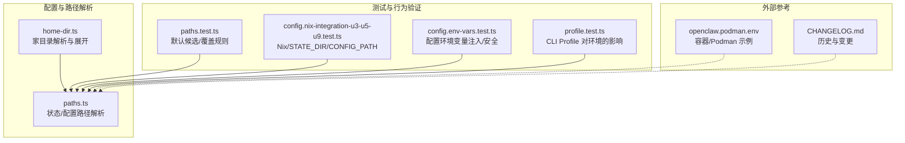
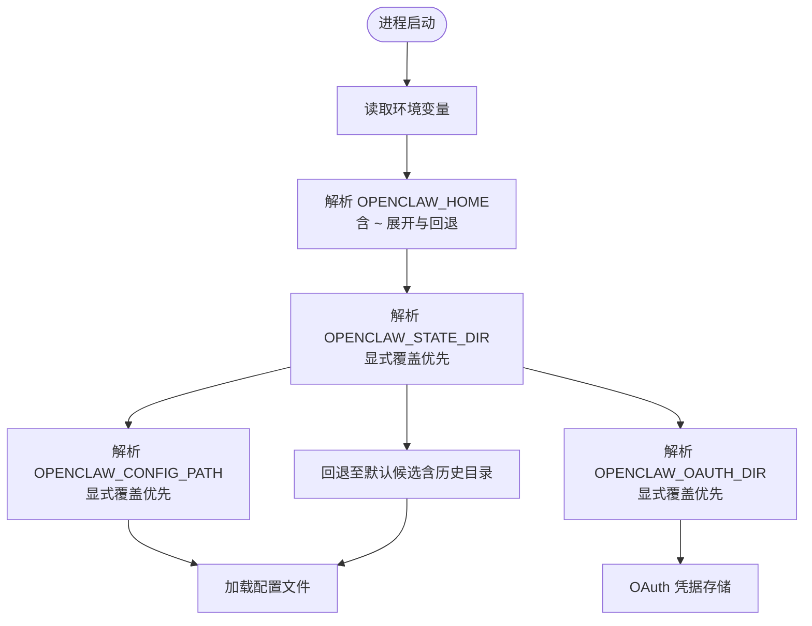
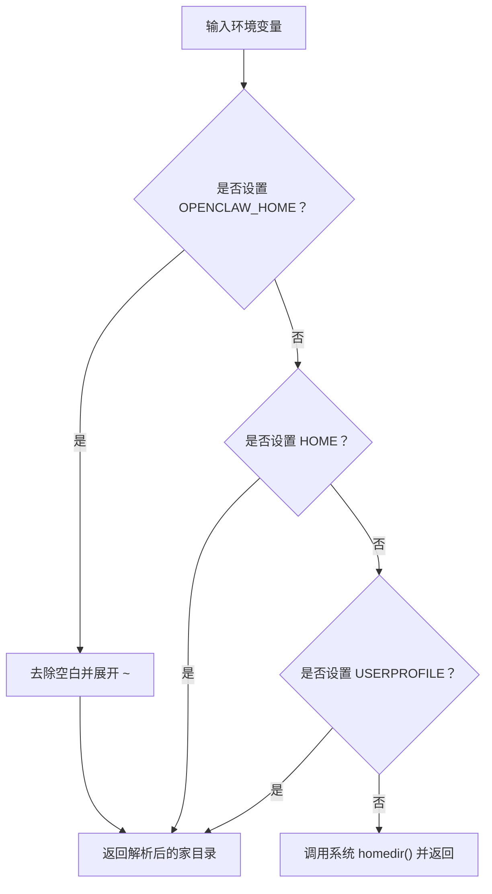
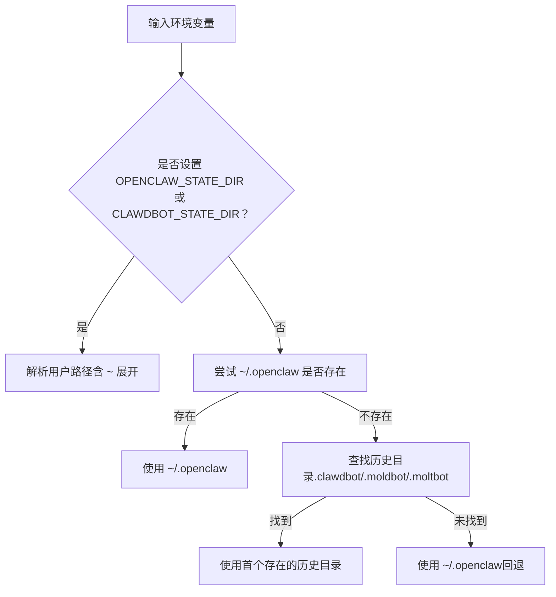
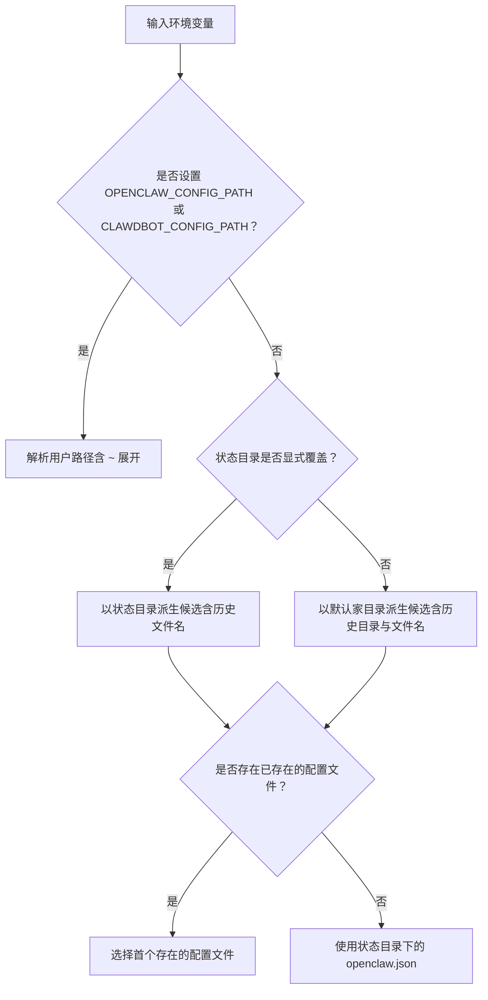
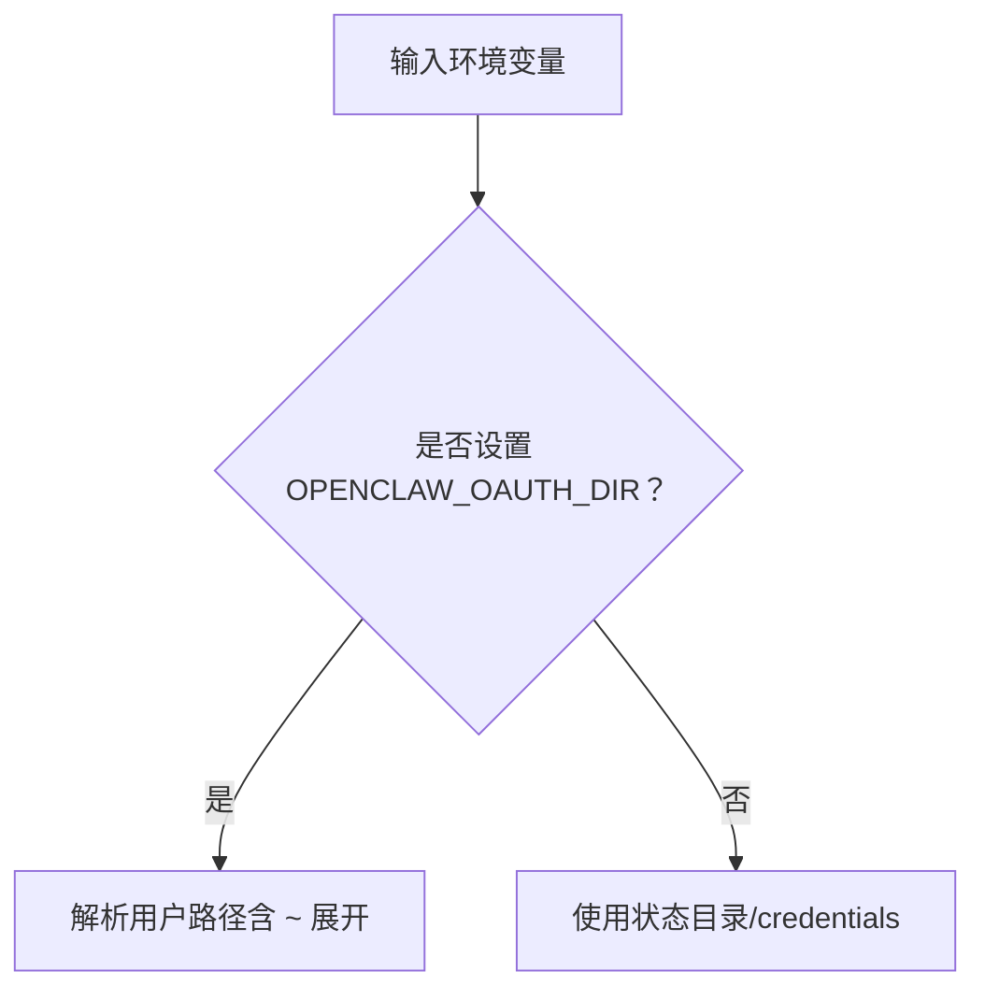
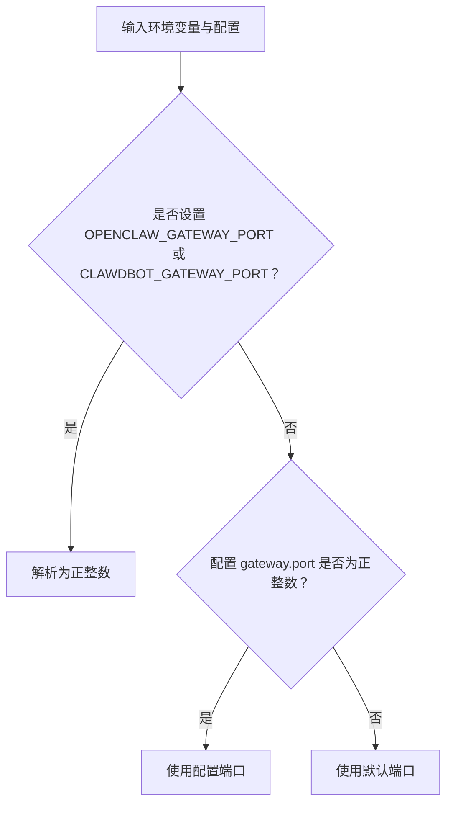
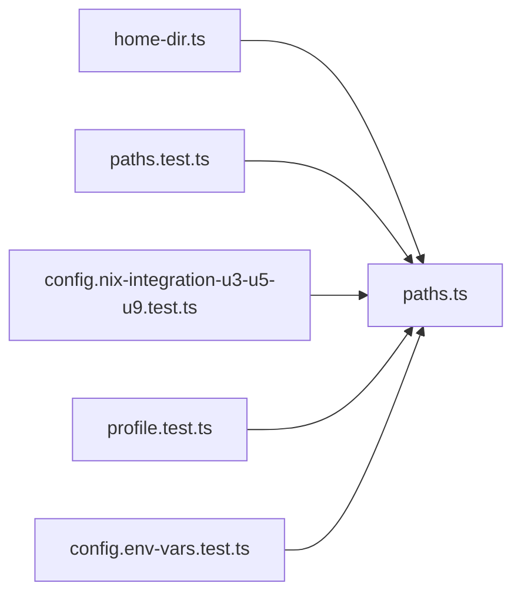

# 环境配置

<cite>
**本文引用的文件**
- [src/config/paths.ts](file://src/config/paths.ts)
- [src/infra/home-dir.ts](file://src/infra/home-dir.ts)
- [src/config/paths.test.ts](file://src/config/paths.test.ts)
- [src/config/config.nix-integration-u3-u5-u9.test.ts](file://src/config/config.nix-integration-u3-u5-u9.test.ts)
- [src/config/config.env-vars.test.ts](file://src/config/config.env-vars.test.ts)
- [src/cli/profile.test.ts](file://src/cli/profile.test.ts)
- [openclaw.podman.env](file://openclaw.podman.env)
- [CHANGELOG.md](file://CHANGELOG.md)
</cite>

## 目录

1. [简介](#简介)
2. [项目结构](#项目结构)
3. [核心组件](#核心组件)
4. [架构总览](#架构总览)
5. [详细组件分析](#详细组件分析)
6. [依赖关系分析](#依赖关系分析)
7. [性能考量](#性能考量)
8. [故障排查指南](#故障排查指南)
9. [结论](#结论)
10. [附录](#附录)

## 简介

本指南面向在不同平台与部署形态（本地开发、容器/Podman、Nix 等）中使用 OpenClaw 的用户与运维人员，系统讲解以下关键环境变量及其作用、优先级与覆盖规则：

- OPENCLAW_HOME：用于重写“家目录”语义，决定默认状态目录与配置候选位置
- OPENCLAW_STATE_DIR：用于重写“状态目录”，存放会话、日志、缓存等可变数据
- OPENCLAW_CONFIG_PATH：用于重写“配置文件路径”，直接指定 openclaw.json 的位置
- 其他相关变量：OPENCLAW*OAUTH_DIR、OPENCLAW_GATEWAY_PORT、OPENCLAW_NIX_MODE、OPENCLAW_PODMAN*\* 等

同时提供：

- 不同部署场景下的配置示例与最佳实践
- 敏感信息的安全配置与密钥管理建议
- 环境变量的验证与调试方法

## 项目结构

围绕环境变量与路径解析的相关代码主要位于以下模块：

- 路径解析与默认值：src/config/paths.ts
- 家目录解析与展开：src/infra/home-dir.ts
- 行为与优先级测试：src/config/paths.test.ts、src/config/config.nix-integration-u3-u5-u9.test.ts、src/cli/profile.test.ts
- 配置文件中的环境变量注入与安全策略：src/config/config.env-vars.test.ts
- 容器化示例：openclaw.podman.env
- 变更记录与历史演进：CHANGELOG.md

图表来源

- [src/config/paths.ts](file://src/config/paths.ts#L1-L276)
- [src/infra/home-dir.ts](file://src/infra/home-dir.ts#L1-L50)
- [src/config/paths.test.ts](file://src/config/paths.test.ts#L1-L153)
- [src/config/config.nix-integration-u3-u5-u9.test.ts](file://src/config/config.nix-integration-u3-u5-u9.test.ts#L46-L118)
- [src/config/config.env-vars.test.ts](file://src/config/config.env-vars.test.ts#L1-L120)
- [src/cli/profile.test.ts](file://src/cli/profile.test.ts#L84-L101)
- [openclaw.podman.env](file://openclaw.podman.env#L1-L25)
- [CHANGELOG.md](file://CHANGELOG.md#L1269-L1551)

章节来源

- [src/config/paths.ts](file://src/config/paths.ts#L1-L276)
- [src/infra/home-dir.ts](file://src/infra/home-dir.ts#L1-L50)
- [src/config/paths.test.ts](file://src/config/paths.test.ts#L1-L153)
- [src/config/config.nix-integration-u3-u5-u9.test.ts](file://src/config/config.nix-integration-u3-u5-u9.test.ts#L46-L118)
- [src/config/config.env-vars.test.ts](file://src/config/config.env-vars.test.ts#L1-L120)
- [src/cli/profile.test.ts](file://src/cli/profile.test.ts#L84-L101)
- [openclaw.podman.env](file://openclaw.podman.env#L1-L25)
- [CHANGELOG.md](file://CHANGELOG.md#L1269-L1551)

## 核心组件

- OPENCLAW_HOME
  - 作用：重写“家目录”语义，影响默认状态目录与配置候选路径的推导
  - 默认回退：若未设置，按 HOME、USERPROFILE、系统 homedir 顺序回退
  - 展开规则：支持 ~ 前缀展开；当仅设为 ~ 时，使用回退的家目录进行展开
- OPENCLAW_STATE_DIR
  - 作用：重写“状态目录”（存放会话、日志、缓存等）
  - 默认回退：若未设置，优先使用 ~/.openclaw；若不存在则回退到旧版目录（如 .clawdbot/.moldbot/.moltbot），最后才回到 ~/.openclaw
  - 覆盖规则：显式设置时，直接使用该路径；若仅设置了状态目录而未设置配置路径，则配置文件默认为该状态目录下的 openclaw.json
- OPENCLAW_CONFIG_PATH
  - 作用：重写“配置文件路径”
  - 默认回退：若未设置，优先查找已存在的配置候选（含新旧目录与文件名），否则落到状态目录下的 openclaw.json
  - 覆盖规则：显式设置时，直接使用该路径；支持 ~ 展开
- OPENCLAW_OAUTH_DIR
  - 作用：重写 OAuth 凭据存储目录，默认为状态目录下的 credentials 子目录
  - 优先级：显式设置优先于状态目录派生路径
- OPENCLAW_GATEWAY_PORT
  - 作用：网关端口
  - 优先级：显式设置优先；其次来自配置；否则使用默认端口
- OPENCLAW_NIX_MODE
  - 作用：Nix 模式开关（1 表示启用），影响依赖处理与错误提示
- OPENCLAW*PODMAN*\* 系列
  - 作用：容器/Podman 运行时的环境变量示例（如令牌、端口映射等）

章节来源

- [src/config/paths.ts](file://src/config/paths.ts#L55-L276)
- [src/infra/home-dir.ts](file://src/infra/home-dir.ts#L9-L50)
- [src/config/paths.test.ts](file://src/config/paths.test.ts#L39-L152)
- [src/config/config.nix-integration-u3-u5-u9.test.ts](file://src/config/config.nix-integration-u3-u5-u9.test.ts#L46-L118)
- [openclaw.podman.env](file://openclaw.podman.env#L1-L25)

## 架构总览

下图展示了环境变量在路径解析与配置加载中的总体流程与优先级。

图表来源

- [src/config/paths.ts](file://src/config/paths.ts#L55-L276)
- [src/infra/home-dir.ts](file://src/infra/home-dir.ts#L9-L50)
- [src/config/paths.test.ts](file://src/config/paths.test.ts#L39-L152)

## 详细组件分析

### OPENCLAW_HOME 解析与回退

- 优先级：OPENCLAW_HOME > HOME > USERPROFILE > 系统 homedir
- 展开规则：支持 ~ 前缀；当仅设为 ~ 时，使用回退的家目录进行展开
- 影响范围：默认状态目录与配置候选路径均基于该家目录推导

图表来源

- [src/infra/home-dir.ts](file://src/infra/home-dir.ts#L9-L50)

章节来源

- [src/infra/home-dir.ts](file://src/infra/home-dir.ts#L9-L50)
- [src/config/paths.test.ts](file://src/config/paths.test.ts#L69-L82)

### OPENCLAW_STATE_DIR 与默认状态目录

- 显式覆盖优先：若设置 OPENCLAW_STATE_DIR 或 CLAWDBOT_STATE_DIR，直接使用该路径
- 回退策略：若未设置，优先 ~/.openclaw；若不存在则回退到历史目录（.clawdbot/.moldbot/.moltbot）；最后回退到 ~/.openclaw
- 与配置路径的关系：若仅设置了状态目录而未设置配置路径，则配置文件默认为该状态目录下的 openclaw.json

图表来源

- [src/config/paths.ts](file://src/config/paths.ts#L60-L86)
- [src/config/paths.test.ts](file://src/config/paths.test.ts#L109-L125)

章节来源

- [src/config/paths.ts](file://src/config/paths.ts#L60-L86)
- [src/config/paths.test.ts](file://src/config/paths.test.ts#L109-L125)

### OPENCLAW_CONFIG_PATH 与默认候选

- 显式覆盖优先：OPENCLAW_CONFIG_PATH 或 CLAWDBOT_CONFIG_PATH 直接生效
- 默认候选顺序（稳定）：显式路径 > 状态目录派生路径 > 新旧默认目录与文件名组合
- 回退逻辑：若状态目录被显式覆盖但配置文件不存在，则仍落回状态目录下的 openclaw.json

图表来源

- [src/config/paths.ts](file://src/config/paths.ts#L115-L183)
- [src/config/paths.test.ts](file://src/config/paths.test.ts#L84-L151)

章节来源

- [src/config/paths.ts](file://src/config/paths.ts#L115-L183)
- [src/config/paths.test.ts](file://src/config/paths.test.ts#L84-L151)
- [src/config/config.nix-integration-u3-u5-u9.test.ts](file://src/config/config.nix-integration-u3-u5-u9.test.ts#L73-L118)

### OPENCLAW_OAUTH_DIR 与 OAuth 凭据存储

- 显式覆盖优先：OPENCLAW_OAUTH_DIR 直接生效
- 默认位置：状态目录下的 credentials 子目录
- 影响范围：OAuth 凭据文件（oauth.json）的存储位置

图表来源

- [src/config/paths.ts](file://src/config/paths.ts#L239-L255)

章节来源

- [src/config/paths.ts](file://src/config/paths.ts#L239-L255)
- [src/config/paths.test.ts](file://src/config/paths.test.ts#L14-L36)

### OPENCLAW_GATEWAY_PORT 与端口解析

- 显式覆盖优先：OPENCLAW_GATEWAY_PORT 或 CLAWDBOT_GATEWAY_PORT
- 配置回退：若未设置，使用配置项 gateway.port
- 默认值：若以上均未设置，使用固定默认端口

图表来源

- [src/config/paths.ts](file://src/config/paths.ts#L257-L276)

章节来源

- [src/config/paths.ts](file://src/config/paths.ts#L257-L276)

### CLI Profile 对环境的影响

- 当通过 CLI 应用 Profile 时，会根据 OPENCLAW_HOME 推导出带后缀的状态目录与配置路径（例如 .openclaw-work）
- 体现 OPENCLAW_HOME 在默认路径推导中的优先级

章节来源

- [src/cli/profile.test.ts](file://src/cli/profile.test.ts#L84-L101)

## 依赖关系分析

- 路径解析模块（paths.ts）依赖家目录解析模块（home-dir.ts）来确定“家目录”
- 测试模块（paths.test.ts、config.nix-integration-u3-u5-u9.test.ts、profile.test.ts）验证了上述优先级与回退逻辑
- 配置环境变量注入与安全策略由 config.env-vars.test.ts 验证（不覆盖危险键、支持 ~/.openclaw/.env 加载等）

图表来源

- [src/infra/home-dir.ts](file://src/infra/home-dir.ts#L1-L50)
- [src/config/paths.ts](file://src/config/paths.ts#L1-L276)
- [src/config/paths.test.ts](file://src/config/paths.test.ts#L1-L153)
- [src/config/config.nix-integration-u3-u5-u9.test.ts](file://src/config/config.nix-integration-u3-u5-u9.test.ts#L46-L118)
- [src/config/config.env-vars.test.ts](file://src/config/config.env-vars.test.ts#L1-L120)
- [src/cli/profile.test.ts](file://src/cli/profile.test.ts#L84-L101)

章节来源

- [src/infra/home-dir.ts](file://src/infra/home-dir.ts#L1-L50)
- [src/config/paths.ts](file://src/config/paths.ts#L1-L276)
- [src/config/paths.test.ts](file://src/config/paths.test.ts#L1-L153)
- [src/config/config.nix-integration-u3-u5-u9.test.ts](file://src/config/config.nix-integration-u3-u5-u9.test.ts#L46-L118)
- [src/config/config.env-vars.test.ts](file://src/config/config.env-vars.test.ts#L1-L120)
- [src/cli/profile.test.ts](file://src/cli/profile.test.ts#L84-L101)

## 性能考量

- 路径解析与文件存在性检查均为轻量操作，对启动时间影响极小
- 在容器或 Nix 环境中，避免频繁切换状态目录可减少不必要的 IO
- 使用显式覆盖（OPENCLAW_STATE_DIR/OPENCLAW_CONFIG_PATH）可减少候选扫描与回退逻辑的执行次数

## 故障排查指南

- 症状：配置文件未按预期加载
  - 检查 OPENCLAW_CONFIG_PATH 是否正确（含 ~ 展开）
  - 若仅设置了 OPENCLAW_STATE_DIR，请确认该目录下是否存在 openclaw.json 或其他历史候选文件
  - 参考默认候选顺序与回退逻辑
- 症状：状态目录与配置目录不一致
  - 确认是否仅设置了 OPENCLAW_STATE_DIR 而未设置 OPENCLAW_CONFIG_PATH
  - 此时配置文件默认为状态目录下的 openclaw.json
- 症状：OAuth 凭据未写入预期位置
  - 检查 OPENCLAW_OAUTH_DIR 是否设置
  - 默认应为状态目录下的 credentials 子目录
- 症状：端口异常
  - 检查 OPENCLAW_GATEWAY_PORT 或 CLAWDBOT_GATEWAY_PORT 是否为正整数
  - 若未设置，确认配置项 gateway.port 是否有效
- 症状：家目录解析异常（尤其是 ~ 展开）
  - 检查 HOME/USERPROFILE 是否存在且可访问
  - 确认 OPENCLAW_HOME 仅设为 ~ 时，系统能正确回退到可用的家目录
- 症状：容器/Podman 环境变量未生效
  - 参考 openclaw.podman.env 中的示例，确保令牌与端口映射正确
  - 确保运行脚本正确加载了该环境文件

章节来源

- [src/config/paths.ts](file://src/config/paths.ts#L55-L276)
- [src/config/paths.test.ts](file://src/config/paths.test.ts#L84-L151)
- [src/config/config.env-vars.test.ts](file://src/config/config.env-vars.test.ts#L88-L118)
- [openclaw.podman.env](file://openclaw.podman.env#L1-L25)

## 结论

- OPENCLAW_HOME 是“家目录”的权威来源，影响默认状态与配置候选
- OPENCLAW_STATE_DIR 与 OPENCLAW_CONFIG_PATH 提供了明确的覆盖点，遵循“显式覆盖优先”的原则
- OAuth 凭据与网关端口同样遵循显式覆盖优先与合理回退
- 在容器与 Nix 环境中，建议显式设置状态与配置路径，以减少回退与候选扫描带来的不确定性

## 附录

### 环境变量优先级与覆盖规则总结

- OPENCLAW_HOME
  - 优先级：最高（影响默认家目录）
  - 展开：支持 ~ 与 ~/<子路径>
- OPENCLAW_STATE_DIR / CLAWDBOT_STATE_DIR
  - 优先级：高于默认状态目录
  - 影响：若仅设置状态目录，配置文件默认为该目录下的 openclaw.json
- OPENCLAW_CONFIG_PATH / CLAWDBOT_CONFIG_PATH
  - 优先级：最高（直接指定配置文件）
  - 影响：支持 ~ 展开；若未设置且状态目录被覆盖，仍会落回该状态目录下的 openclaw.json
- OPENCLAW_OAUTH_DIR
  - 优先级：高于状态目录派生路径
- OPENCLAW_GATEWAY_PORT / CLAWDBOT_GATEWAY_PORT
  - 优先级：高于配置项 gateway.port
- OPENCLAW_NIX_MODE
  - 作用：启用 Nix 模式，影响依赖与错误提示

章节来源

- [src/config/paths.ts](file://src/config/paths.ts#L55-L276)
- [src/infra/home-dir.ts](file://src/infra/home-dir.ts#L9-L50)
- [src/config/paths.test.ts](file://src/config/paths.test.ts#L39-L152)
- [src/config/config.nix-integration-u3-u5-u9.test.ts](file://src/config/config.nix-integration-u3-u5-u9.test.ts#L46-L118)

### 不同部署场景下的配置示例与最佳实践

- 本地开发（单用户）
  - 设置 OPENCLAW_HOME 为当前用户家目录，便于统一管理状态与配置
  - 保持默认状态目录（~/.openclaw），避免频繁覆盖
- 多用户或多环境
  - 使用 OPENCLAW_STATE_DIR 与 OPENCLAW_CONFIG_PATH 分别指向各自的状态与配置目录
  - 通过 CLI Profile（如 work）配合 OPENCLAW_HOME 推导出带后缀的状态目录
- 容器/Podman
  - 参考 openclaw.podman.env，设置 OPENCLAW_GATEWAY_TOKEN、端口映射等
  - 将状态目录挂载到持久卷，并通过 OPENCLAW_STATE_DIR 指向挂载路径
- Nix
  - 设置 OPENCLAW_NIX_MODE=1，避免自动安装流程
  - 通过外部工具管理配置文件，显式设置 OPENCLAW_CONFIG_PATH

章节来源

- [src/cli/profile.test.ts](file://src/cli/profile.test.ts#L84-L101)
- [openclaw.podman.env](file://openclaw.podman.env#L1-L25)
- [src/config/config.nix-integration-u3-u5-u9.test.ts](file://src/config/config.nix-integration-u3-u5-u9.test.ts#L46-L52)

### 敏感信息的安全配置与密钥管理建议

- 避免在配置文件中硬编码敏感信息；优先通过环境变量注入
- 配置环境变量注入时，系统会过滤危险键（如 SHELL、HOME、BASH_ENV 等），防止破坏性覆盖
- 支持从 ~/.openclaw/.env 加载变量，作为全局回退；请确保该文件权限最小化
- 在容器/Podman 中，通过环境文件或编排工具注入令牌与密钥，避免明文写入镜像或脚本

章节来源

- [src/config/config.env-vars.test.ts](file://src/config/config.env-vars.test.ts#L32-L86)
- [CHANGELOG.md](file://CHANGELOG.md#L3135-L3135)
