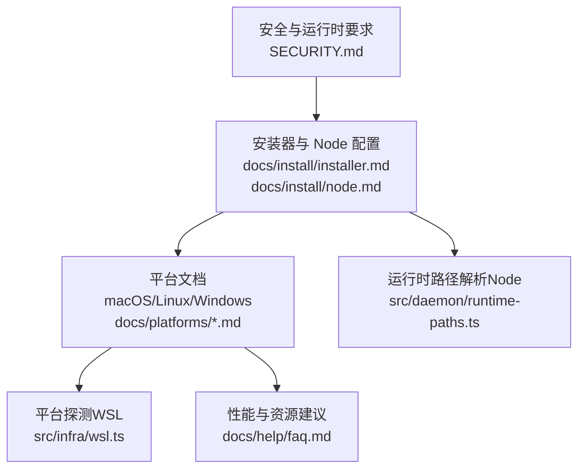
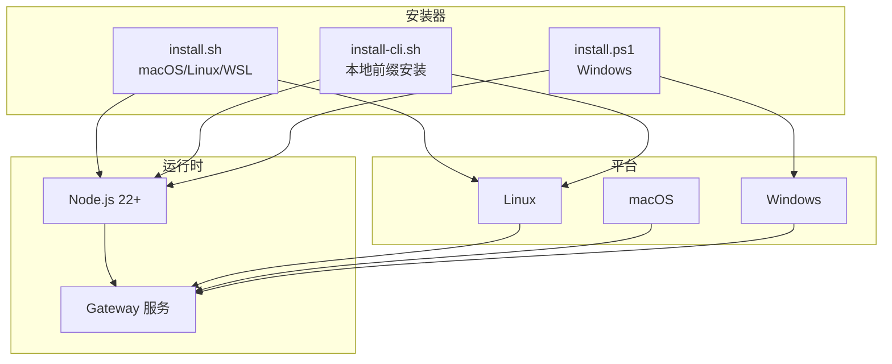
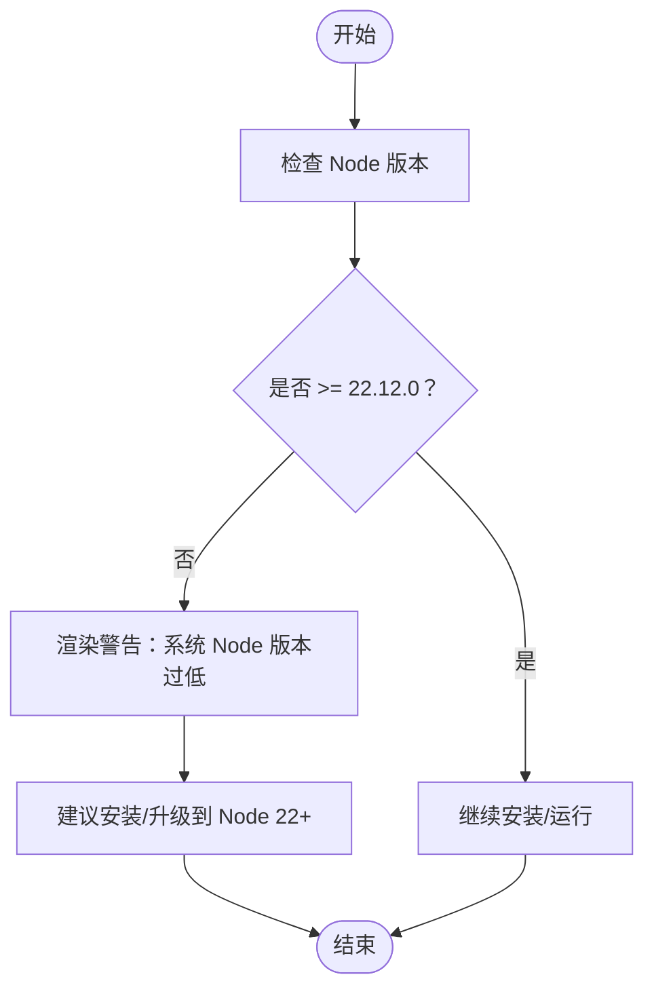
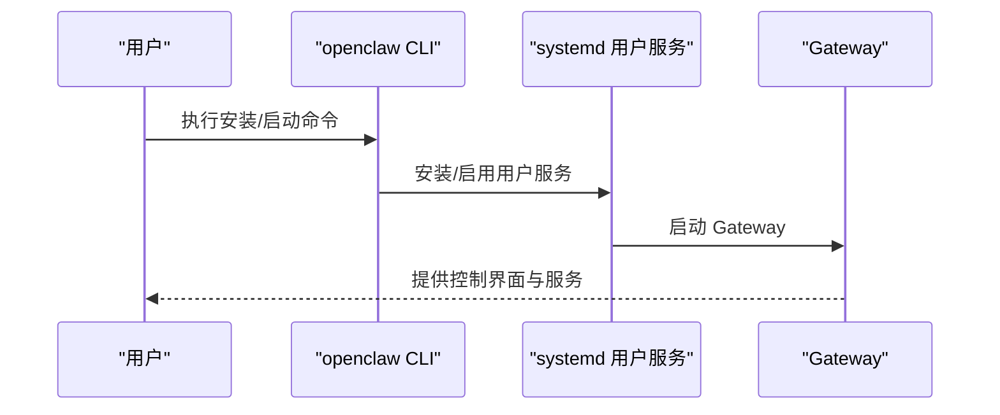
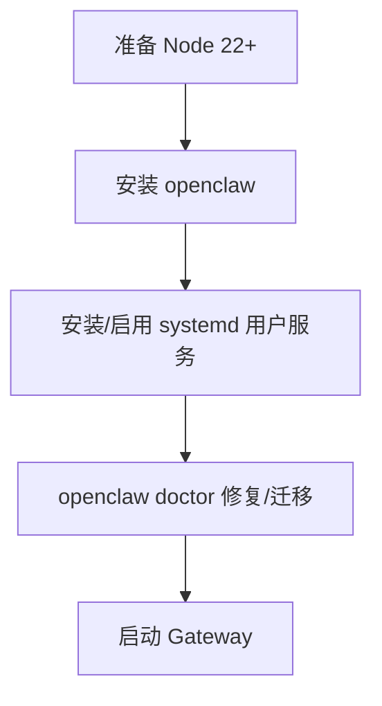
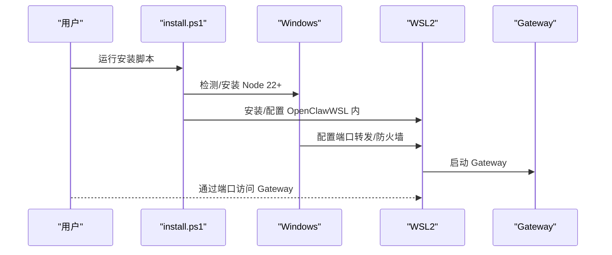
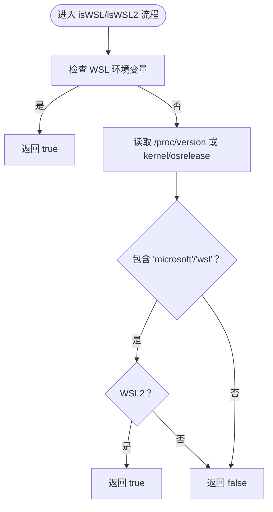
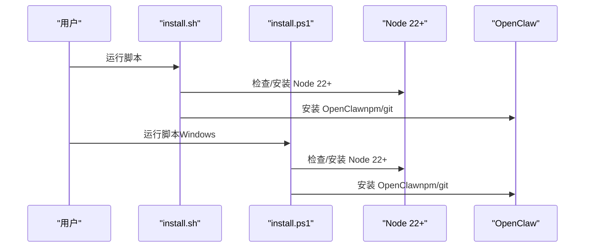
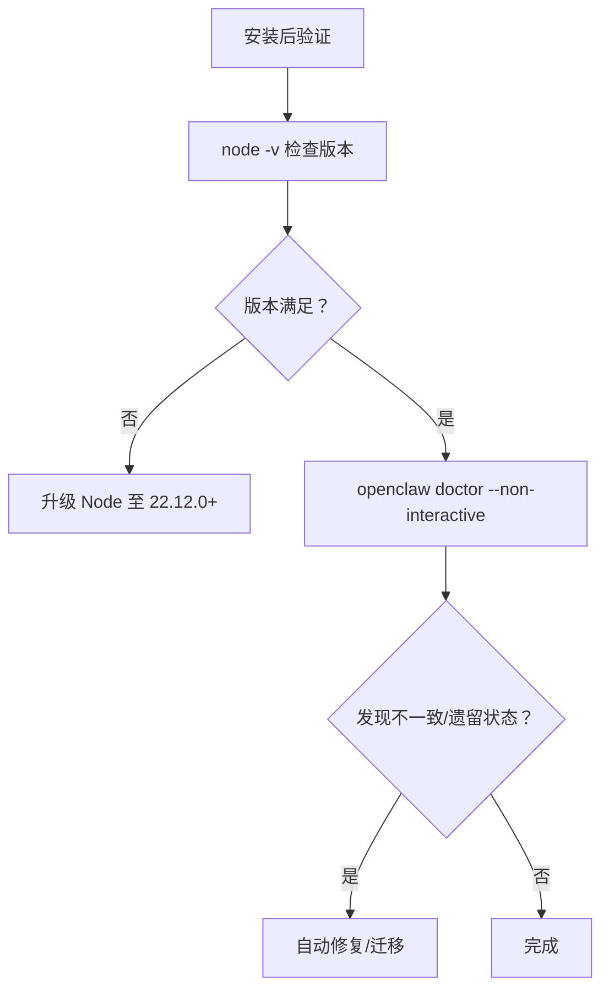
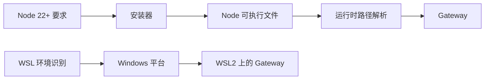

# 系统要求

<cite>
**本文引用的文件**
- [SECURITY.md](file://SECURITY.md)
- [docs/install/installer.md](file://docs/install/installer.md)
- [docs/install/node.md](file://docs/install/node.md)
- [docs/platforms/linux.md](file://docs/platforms/linux.md)
- [docs/platforms/macos.md](file://docs/platforms/macos.md)
- [docs/platforms/windows.md](file://docs/platforms/windows.md)
- [docs/zh-CN/platforms/windows.md](file://docs/zh-CN/platforms/windows.md)
- [docs/help/faq.md](file://docs/help/faq.md)
- [src/daemon/runtime-paths.ts](file://src/daemon/runtime-paths.ts)
- [src/infra/wsl.ts](file://src/infra/wsl.ts)
- [scripts/test-parallel.mjs](file://scripts/test-parallel.mjs)
</cite>

## 目录

1. [简介](#简介)
2. [项目结构](#项目结构)
3. [核心组件](#核心组件)
4. [架构总览](#架构总览)
5. [详细组件分析](#详细组件分析)
6. [依赖关系分析](#依赖关系分析)
7. [性能考量](#性能考量)
8. [故障排查指南](#故障排查指南)
9. [结论](#结论)
10. [附录](#附录)

## 简介

本文件面向部署与运维 OpenClaw 的用户，系统化说明系统要求与前置条件，重点包括：

- Node.js 22+ 的必要性与安全影响
- 不同操作系统（macOS、Linux、Windows）的具体要求与差异
- Windows 下 WSL2 的重要性与推荐原因
- 硬件资源建议与性能考虑
- 系统兼容性检查方法与前置条件验证步骤
- 常见系统环境问题与解决方案

## 项目结构

围绕“系统要求”的相关知识主要分布在以下位置：

- 安全与运行时要求：安全策略与 Node 版本要求
- 安装器与 Node 配置：自动检测与安装 Node 的流程
- 平台文档：各平台的安装与服务配置要点
- 平台探测：WSL 环境识别与 WSL2 判定
- 性能与资源：FAQ 中的最小/推荐配置与内存压力处理

图表来源

- [SECURITY.md](file://SECURITY.md#L226-L239)
- [docs/install/installer.md](file://docs/install/installer.md#L61-L88)
- [docs/platforms/linux.md](file://docs/platforms/linux.md#L1-L95)
- [docs/platforms/macos.md](file://docs/platforms/macos.md#L1-L208)
- [docs/platforms/windows.md](file://docs/platforms/windows.md#L103-L133)
- [src/infra/wsl.ts](file://src/infra/wsl.ts#L1-L63)
- [docs/help/faq.md](file://docs/help/faq.md#L897-L931)
- [src/daemon/runtime-paths.ts](file://src/daemon/runtime-paths.ts#L37-L165)

章节来源

- [SECURITY.md](file://SECURITY.md#L226-L239)
- [docs/install/installer.md](file://docs/install/installer.md#L61-L88)
- [docs/platforms/linux.md](file://docs/platforms/linux.md#L1-L95)
- [docs/platforms/macos.md](file://docs/platforms/macos.md#L1-L208)
- [docs/platforms/windows.md](file://docs/platforms/windows.md#L103-L133)
- [src/infra/wsl.ts](file://src/infra/wsl.ts#L1-L63)
- [docs/help/faq.md](file://docs/help/faq.md#L897-L931)
- [src/daemon/runtime-paths.ts](file://src/daemon/runtime-paths.ts#L37-L165)

## 核心组件

- Node.js 版本要求与安全补丁：OpenClaw 要求 Node.js 22.12.0 或更高版本，并明确列出包含的安全修复项。
- 安装器与 Node 自动化：install.sh/install-cli.sh/install.ps1 在各平台自动检测并安装 Node 22+，确保运行时可用。
- 平台适配与服务安装：Linux 推荐 Node 作为网关运行时；macOS 提供菜单栏应用与 LaunchAgent；Windows 支持 WSL2 作为首选虚拟化方案。
- 平台探测：WSL 环境识别与 WSL2 判定逻辑，便于在 Windows 上进行正确的安装与网络配置。
- 性能与资源：FAQ 提供最小/推荐配置与内存压力下的测试并行策略。

章节来源

- [SECURITY.md](file://SECURITY.md#L226-L239)
- [docs/install/installer.md](file://docs/install/installer.md#L61-L88)
- [docs/platforms/linux.md](file://docs/platforms/linux.md#L11-L12)
- [docs/platforms/macos.md](file://docs/platforms/macos.md#L24-L33)
- [docs/platforms/windows.md](file://docs/platforms/windows.md#L103-L133)
- [src/infra/wsl.ts](file://src/infra/wsl.ts#L1-L63)
- [docs/help/faq.md](file://docs/help/faq.md#L897-L931)

## 架构总览

下图展示 OpenClaw 在不同平台上的运行时与安装器交互关系，以及 Node 版本要求如何贯穿安装与运行阶段。

图表来源

- [docs/install/installer.md](file://docs/install/installer.md#L61-L88)
- [docs/platforms/linux.md](file://docs/platforms/linux.md#L11-L12)
- [docs/platforms/macos.md](file://docs/platforms/macos.md#L24-L33)
- [docs/platforms/windows.md](file://docs/platforms/windows.md#L103-L133)

## 详细组件分析

### Node.js 22+ 的必要性与安全影响

- 必要性：OpenClaw 要求 Node.js 22.12.0 或更高版本，以获得关键安全补丁与功能稳定性。
- 安全补丁：明确包含若干安全修复，建议在安装后执行版本检查命令确认版本满足要求。
- 运行时路径解析：系统会尝试解析系统 Node 路径并校验版本，若低于要求将提示升级。

图表来源

- [SECURITY.md](file://SECURITY.md#L226-L239)
- [src/daemon/runtime-paths.ts](file://src/daemon/runtime-paths.ts#L144-L154)

章节来源

- [SECURITY.md](file://SECURITY.md#L226-L239)
- [src/daemon/runtime-paths.ts](file://src/daemon/runtime-paths.ts#L144-L154)

### macOS 系统要求与服务安装

- 运行时：推荐 Node 作为网关运行时；Bun 不推荐用于网关（存在特定通道的已知问题）。
- 服务安装：可通过 CLI 安装 systemd 用户服务或系统服务，按需选择。
- macOS 应用：菜单栏应用负责权限管理、网关连接与本地/远程模式切换。

图表来源

- [docs/platforms/linux.md](file://docs/platforms/linux.md#L37-L57)
- [docs/platforms/linux.md](file://docs/platforms/linux.md#L65-L95)
- [docs/platforms/macos.md](file://docs/platforms/macos.md#L24-L33)

章节来源

- [docs/platforms/linux.md](file://docs/platforms/linux.md#L11-L12)
- [docs/platforms/linux.md](file://docs/platforms/linux.md#L37-L57)
- [docs/platforms/linux.md](file://docs/platforms/linux.md#L65-L95)
- [docs/platforms/macos.md](file://docs/platforms/macos.md#L24-L33)

### Linux 系统要求与服务安装

- 运行时：推荐 Node；Bun 不推荐用于网关。
- 服务安装：提供 systemd 用户服务示例与启用方式；也可通过 CLI 安装/修复。
- 最小/推荐配置：FAQ 提供了绝对最小与推荐的 CPU/内存/磁盘配置，适用于 VPS 或 VM 场景。

图表来源

- [docs/platforms/linux.md](file://docs/platforms/linux.md#L11-L12)
- [docs/platforms/linux.md](file://docs/platforms/linux.md#L37-L57)
- [docs/platforms/linux.md](file://docs/platforms/linux.md#L65-L95)
- [docs/help/faq.md](file://docs/help/faq.md#L907-L916)

章节来源

- [docs/platforms/linux.md](file://docs/platforms/linux.md#L11-L12)
- [docs/platforms/linux.md](file://docs/platforms/linux.md#L37-L57)
- [docs/platforms/linux.md](file://docs/platforms/linux.md#L65-L95)
- [docs/help/faq.md](file://docs/help/faq.md#L907-L916)

### Windows 系统要求与 WSL2 推荐

- 运行时：install.ps1 支持自动安装 Node 22+（winget/Chocolatey/Scoop），并处理 PATH。
- WSL2 推荐：FAQ 明确指出在 Windows 上 WSL2 是“最简单的虚拟机式设置”，且具备最佳工具链兼容性。
- WSL2 安装与 systemd：提供分步安装指南，包括启用 systemd、重启生效与验证步骤。
- 端口转发：提供 Windows 主机与 WSL 内部端口映射与防火墙规则示例，便于远程访问与联调。

图表来源

- [docs/platforms/windows.md](file://docs/platforms/windows.md#L103-L133)
- [docs/zh-CN/platforms/windows.md](file://docs/zh-CN/platforms/windows.md#L101-L151)
- [docs/help/faq.md](file://docs/help/faq.md#L929-L930)

章节来源

- [docs/platforms/windows.md](file://docs/platforms/windows.md#L103-L133)
- [docs/zh-CN/platforms/windows.md](file://docs/zh-CN/platforms/windows.md#L101-L151)
- [docs/help/faq.md](file://docs/help/faq.md#L929-L930)

### 平台探测与 WSL 环境识别

- 环境变量优先：通过环境变量快速判断是否处于 WSL 环境。
- 同步检测：读取 /proc/version 或 /proc/sys/kernel/osrelease 判断 WSL 与 WSL2。
- 缓存机制：避免重复 IO，提升检测效率。

图表来源

- [src/infra/wsl.ts](file://src/infra/wsl.ts#L1-L63)

章节来源

- [src/infra/wsl.ts](file://src/infra/wsl.ts#L1-L63)

### 安装器与 Node 自动化

- install.sh：支持 macOS/Linux/WSL，自动检测/安装 Node 22+、Git，再安装 OpenClaw，并在合适场景运行 onboarding。
- install-cli.sh：将 Node 22.22.0 下载至本地前缀，避免系统 Node 依赖，适合受限环境。
- install.ps1：Windows 下自动检测/安装 Node 22+，支持 npm/git 安装方式与 PATH 注入。

图表来源

- [docs/install/installer.md](file://docs/install/installer.md#L61-L88)
- [docs/install/installer.md](file://docs/install/installer.md#L168-L186)
- [docs/install/installer.md](file://docs/install/installer.md#L246-L264)

章节来源

- [docs/install/installer.md](file://docs/install/installer.md#L61-L88)
- [docs/install/installer.md](file://docs/install/installer.md#L168-L186)
- [docs/install/installer.md](file://docs/install/installer.md#L246-L264)

### 系统兼容性检查与前置条件验证

- Node 版本检查：使用版本检查命令确认 Node 是否满足 22.12.0+。
- PATH 与全局安装：若出现命令未找到，检查 npm prefix 与 PATH 设置。
- Linux 权限问题：当遇到权限错误时，调整 npm prefix 为用户可写目录。
- doctor 修复：通过 doctor 命令自动修复配置不一致与遗留状态迁移。

图表来源

- [SECURITY.md](file://SECURITY.md#L235-L239)
- [docs/install/node.md](file://docs/install/node.md#L91-L139)
- [docs/install/installer.md](file://docs/install/installer.md#L362-L405)

章节来源

- [SECURITY.md](file://SECURITY.md#L235-L239)
- [docs/install/node.md](file://docs/install/node.md#L91-L139)
- [docs/install/installer.md](file://docs/install/installer.md#L362-L405)

## 依赖关系分析

- Node 版本要求贯穿安装器与运行时解析：安装器负责安装 Node 22+，运行时解析负责检测系统 Node 并校验版本。
- 平台差异：Linux/macOS 推荐 Node 作为网关运行时；Windows 推荐 WSL2 以获得最佳工具链兼容性。
- WSL 环境识别：在 Windows 上通过环境变量与内核信息判断 WSL/WSL2，为后续网络与服务配置提供依据。

图表来源

- [SECURITY.md](file://SECURITY.md#L226-L239)
- [docs/install/installer.md](file://docs/install/installer.md#L61-L88)
- [src/daemon/runtime-paths.ts](file://src/daemon/runtime-paths.ts#L37-L165)
- [src/infra/wsl.ts](file://src/infra/wsl.ts#L1-L63)

章节来源

- [SECURITY.md](file://SECURITY.md#L226-L239)
- [docs/install/installer.md](file://docs/install/installer.md#L61-L88)
- [src/daemon/runtime-paths.ts](file://src/daemon/runtime-paths.ts#L37-L165)
- [src/infra/wsl.ts](file://src/infra/wsl.ts#L1-L63)

## 性能考量

- FAQ 提供最小/推荐配置：绝对最小 1 vCPU、1GB RAM、约 500MB 磁盘；推荐 1–2 vCPU、2GB RAM 或更高，以应对日志、媒体与多通道。
- 内存压力与并行度：本地主机内存较低时，测试并行策略会降低单元测试与扩展测试的并发度，避免 OOM。
- 资源密集型工具：浏览器自动化与节点工具可能较耗资源，建议预留额外内存。

章节来源

- [docs/help/faq.md](file://docs/help/faq.md#L907-L916)
- [scripts/test-parallel.mjs](file://scripts/test-parallel.mjs#L239-L269)

## 故障排查指南

- 命令未找到（PATH 问题）：查找 npm prefix 并将其加入 PATH；macOS/Linux 在 shell 启动文件中追加导出；Windows 在系统环境变量中添加。
- Linux 权限错误（EACCES）：将 npm prefix 设为用户可写目录，并更新 PATH。
- Windows：Git 未安装导致 spawn 失败；Windows 无法识别 openclaw 命令；PowerShell 调试输出。
- doctor 修复：自动修复配置不一致与遗留状态迁移，减少启动验证崩溃风险。

章节来源

- [docs/install/node.md](file://docs/install/node.md#L91-L139)
- [docs/install/installer.md](file://docs/install/installer.md#L362-L405)
- [src/infra/update-runner.ts](file://src/infra/update-runner.ts#L751-L782)

## 结论

- Node.js 22+ 是 OpenClaw 的强制运行时要求，且包含关键安全补丁。
- 各平台均提供自动化的 Node 安装与 OpenClaw 安装流程；Windows 强烈推荐 WSL2 以获得最佳工具链兼容性。
- FAQ 提供了最小/推荐的硬件配置与内存压力下的并行策略，便于在不同环境中稳定运行。
- 通过 doctor 与安装器的前置检查，可有效规避 PATH、权限与配置不一致等问题。

## 附录

- 快速检查清单
  - Node 版本：使用版本检查命令确认满足 22.12.0+。
  - PATH：确保 npm prefix/bin 已加入 PATH。
  - Linux 权限：如遇权限错误，调整 npm prefix 为用户可写目录。
  - Windows：确保已安装 Node 22+、Git；必要时启用 WSL2 并配置端口转发。
  - doctor：首次安装或升级后运行 doctor 以修复潜在问题。
