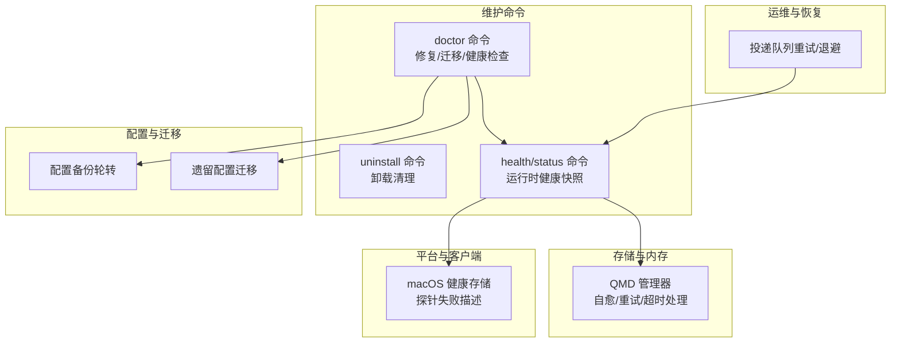
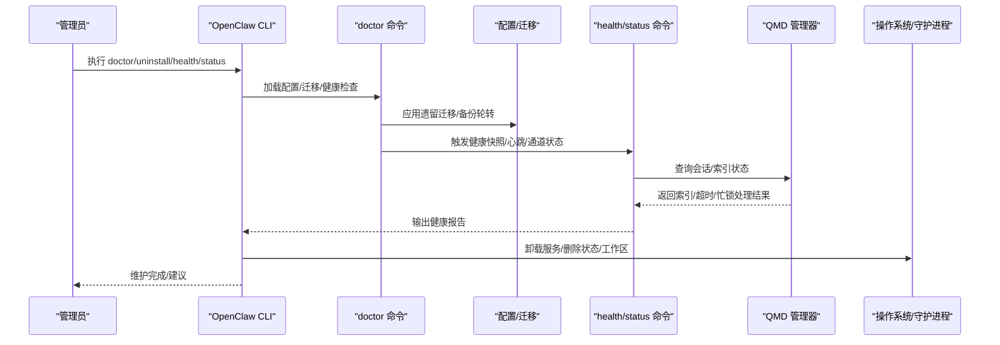
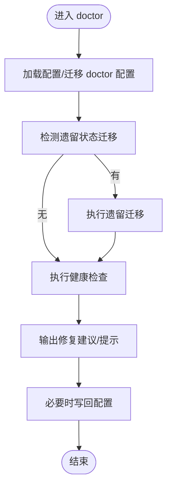
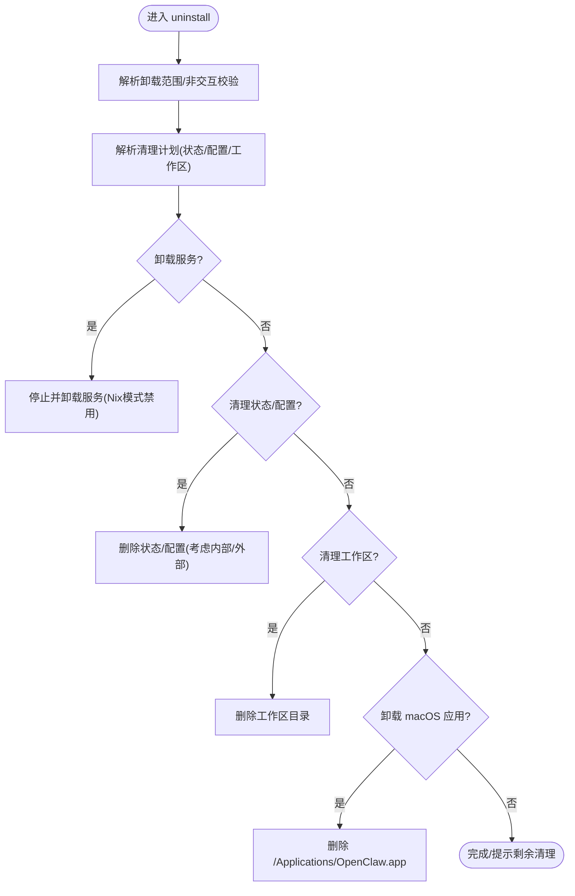
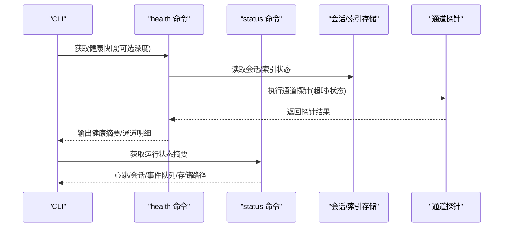
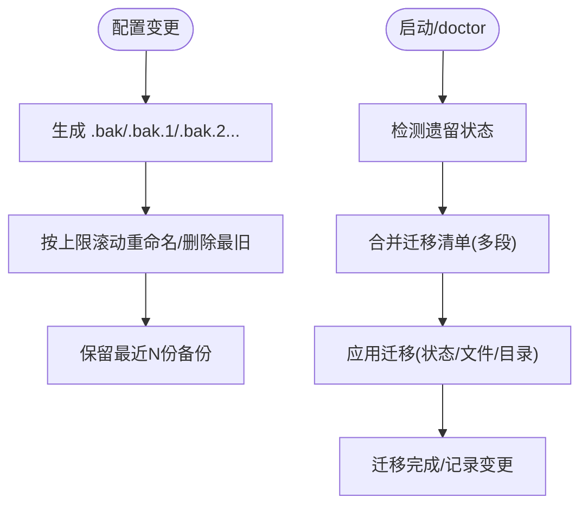
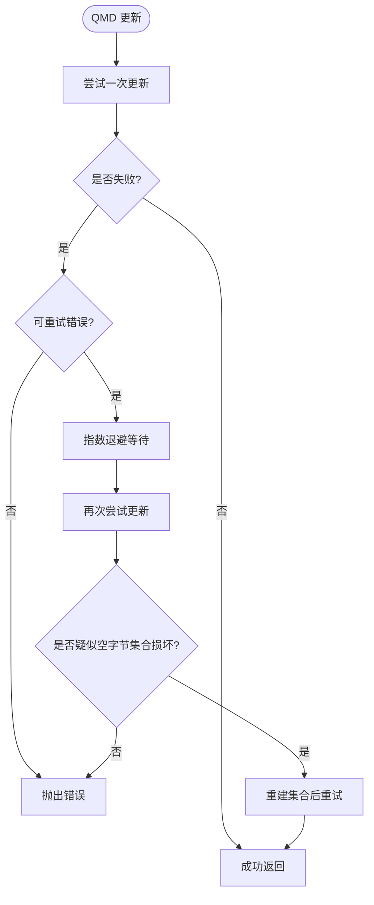
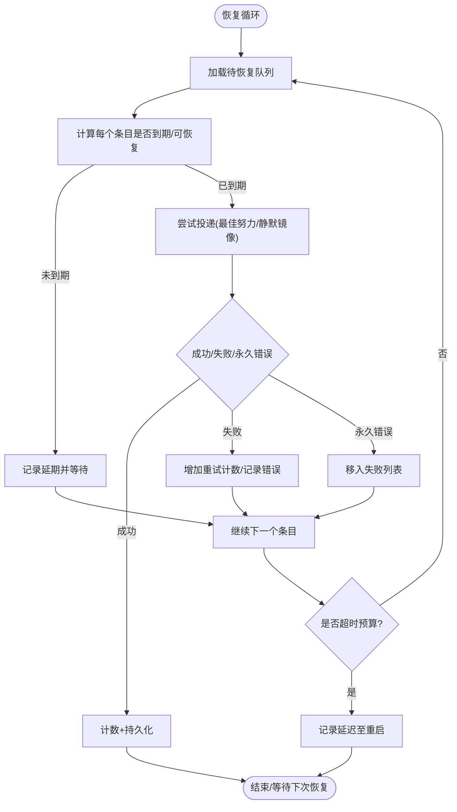
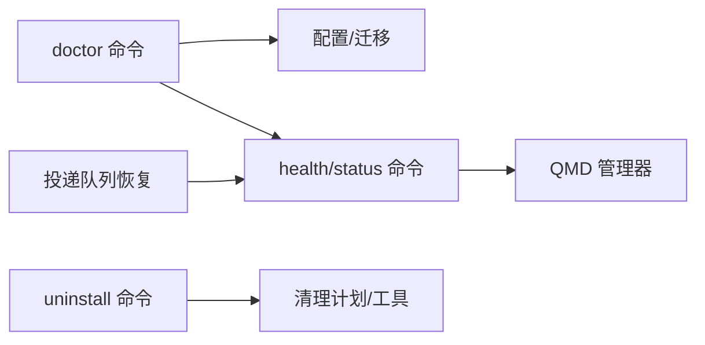

# 维护操作

<cite>
**本文引用的文件**   
- [src/commands/doctor.ts](file://src/commands/doctor.ts)
- [docs/gateway/doctor.md](file://docs/gateway/doctor.md)
- [src/commands/uninstall.ts](file://src/commands/uninstall.ts)
- [src/commands/cleanup-plan.ts](file://src/commands/cleanup-plan.ts)
- [src/commands/cleanup-utils.ts](file://src/commands/cleanup-utils.ts)
- [src/config/backup-rotation.ts](file://src/config/backup-rotation.ts)
- [src/config/legacy.migrations.ts](file://src/config/legacy.migrations.ts)
- [src/memory/qmd-manager.ts](file://src/memory/qmd-manager.ts)
- [src/commands/health.ts](file://src/commands/health.ts)
- [apps/macos/Sources/OpenClaw/HealthStore.swift](file://apps/macos/Sources/OpenClaw/HealthStore.swift)
- [src/commands/status.command.ts](file://src/commands/status.command.ts)
- [src/agents/failover-error.ts](file://src/agents/failover-error.ts)
- [src/infra/outbound/outbound.test.ts](file://src/infra/outbound/outbound.test.ts)
- [CHANGELOG.md](file://CHANGELOG.md)
- [.agents/maintainers.md](file://.agents/maintainers.md)
</cite>

## 目录

1. [简介](#简介)
2. [项目结构](#项目结构)
3. [核心组件](#核心组件)
4. [架构总览](#架构总览)
5. [详细组件分析](#详细组件分析)
6. [依赖关系分析](#依赖关系分析)
7. [性能考量](#性能考量)
8. [故障排查指南](#故障排查指南)
9. [结论](#结论)
10. [附录](#附录)

## 简介

本指南面向OpenClaw系统的维护者与运维人员，提供从日常维护到版本升级、数据迁移、完全卸载清理与备份、健康检查与自动化维护、以及回滚与应急处理的全链路操作说明。内容基于仓库中的命令实现、文档与平台适配层，确保可执行、可验证且具备向后兼容性保障。

## 项目结构

OpenClaw的维护能力主要由以下模块构成：

- 命令与工具：doctor（修复与迁移）、uninstall（卸载）、health/status（健康检查）
- 配置与迁移：配置备份轮转、遗留状态迁移
- 存储与内存：QMD索引管理与自愈逻辑
- 平台与客户端：macOS端健康状态展示与诊断
- 运维与恢复：投递队列重试与退避策略
- 文档与变更记录：官方维护文档与变更日志

**图示来源**

- [src/commands/doctor.ts](file://src/commands/doctor.ts#L67-L200)
- [src/commands/uninstall.ts](file://src/commands/uninstall.ts#L95-L191)
- [src/commands/health.ts](file://src/commands/health.ts#L348-L673)
- [src/config/backup-rotation.ts](file://src/config/backup-rotation.ts#L1-L26)
- [src/config/legacy.migrations.ts](file://src/config/legacy.migrations.ts#L1-L10)
- [src/memory/qmd-manager.ts](file://src/memory/qmd-manager.ts#L576-L945)
- [apps/macos/Sources/OpenClaw/HealthStore.swift](file://apps/macos/Sources/OpenClaw/HealthStore.swift#L153-L180)
- [src/infra/outbound/outbound.test.ts](file://src/infra/outbound/outbound.test.ts#L220-L490)

**章节来源**

- [src/commands/doctor.ts](file://src/commands/doctor.ts#L67-L200)
- [docs/gateway/doctor.md](file://docs/gateway/doctor.md#L1-L57)

## 核心组件

- doctor命令：负责加载配置、执行迁移、健康检查、修复建议与服务/沙箱等环境问题的提示与应用。
- uninstall命令：交互式或非交互式选择卸载范围（服务、状态/配置、工作区、macOS应用），并执行清理。
- health/status命令：生成健康快照、会话统计、心跳与通道绑定状态，支持深度探测。
- 配置备份轮转：按数量上限滚动备份配置文件，避免无限增长。
- 遗留配置迁移：分段迁移清单合并，自动处理历史状态到新布局。
- QMD管理器：对索引更新进行重试、超时与SQLite忙锁处理，并在特定错误时重建集合以自愈。
- 投递队列：带退避与到期窗口的恢复重试，避免永久饥饿与过期重试。
- macOS健康存储：对探针失败进行人性化描述，辅助定位超时与状态异常。

**章节来源**

- [src/commands/doctor.ts](file://src/commands/doctor.ts#L67-L200)
- [src/commands/uninstall.ts](file://src/commands/uninstall.ts#L95-L191)
- [src/commands/health.ts](file://src/commands/health.ts#L348-L673)
- [src/config/backup-rotation.ts](file://src/config/backup-rotation.ts#L1-L26)
- [src/config/legacy.migrations.ts](file://src/config/legacy.migrations.ts#L1-L10)
- [src/memory/qmd-manager.ts](file://src/memory/qmd-manager.ts#L576-L945)
- [src/infra/outbound/outbound.test.ts](file://src/infra/outbound/outbound.test.ts#L220-L490)
- [apps/macos/Sources/OpenClaw/HealthStore.swift](file://apps/macos/Sources/OpenClaw/HealthStore.swift#L153-L180)

## 架构总览

下图展示了维护操作的关键调用路径与组件交互：

**图示来源**

- [src/commands/doctor.ts](file://src/commands/doctor.ts#L67-L200)
- [src/commands/uninstall.ts](file://src/commands/uninstall.ts#L95-L191)
- [src/commands/health.ts](file://src/commands/health.ts#L348-L673)
- [src/memory/qmd-manager.ts](file://src/memory/qmd-manager.ts#L576-L945)

## 详细组件分析

### doctor：修复、迁移与健康检查

- 功能要点
  - 在执行前可提示并引导更新；加载并迁移doctor专用配置；检测并迁移遗留状态；输出状态完整性与会话锁健康提示；针对网关服务、沙箱镜像、安全与平台差异给出修复建议。
  - 支持非交互模式仅应用安全迁移，跳过需要人工确认的服务重启/沙箱变更。
- 与维护的关系
  - 作为“一次性修复”入口，覆盖配置规范化、遗留状态迁移、服务与环境问题修复，是版本升级后的第一道维护防线。

**图示来源**

- [src/commands/doctor.ts](file://src/commands/doctor.ts#L67-L200)
- [docs/gateway/doctor.md](file://docs/gateway/doctor.md#L1-L57)

**章节来源**

- [src/commands/doctor.ts](file://src/commands/doctor.ts#L67-L200)
- [docs/gateway/doctor.md](file://docs/gateway/doctor.md#L1-L57)

### uninstall：完全卸载与清理

- 功能要点
  - 支持交互式多选或非交互式全量卸载范围（服务、状态/配置、工作区、macOS应用）。
  - 对Nix模式禁用服务卸载；对非Darwin平台忽略macOS应用卸载。
  - 清理计划从磁盘解析，区分config/oauth是否位于state目录内，避免误删。
  - 提供dry-run模式预演。
- 与维护的关系
  - 用于彻底移除OpenClaw运行痕迹，配合备份与迁移策略，确保干净重装。

**图示来源**

- [src/commands/uninstall.ts](file://src/commands/uninstall.ts#L95-L191)
- [src/commands/cleanup-plan.ts](file://src/commands/cleanup-plan.ts#L10-L26)
- [src/commands/cleanup-utils.ts](file://src/commands/cleanup-utils.ts#L78-L128)

**章节来源**

- [src/commands/uninstall.ts](file://src/commands/uninstall.ts#L95-L191)
- [src/commands/cleanup-plan.ts](file://src/commands/cleanup-plan.ts#L10-L26)
- [src/commands/cleanup-utils.ts](file://src/commands/cleanup-utils.ts#L78-L128)

### health/status：系统健康检查与自动化

- 功能要点
  - 生成健康快照，汇总代理、会话、心跳、通道绑定与账户映射；支持深度探测与通道探针状态。
  - 状态命令输出心跳间隔、最近心跳时间、会话存储路径与事件队列情况，便于快速判断运行态。
- 与维护的关系
  - 作为自动化巡检的基础，结合定时任务与告警，形成“健康检查—告警—修复”的闭环。

**图示来源**

- [src/commands/health.ts](file://src/commands/health.ts#L348-L673)
- [src/commands/status.command.ts](file://src/commands/status.command.ts#L295-L335)

**章节来源**

- [src/commands/health.ts](file://src/commands/health.ts#L348-L673)
- [src/commands/status.command.ts](file://src/commands/status.command.ts#L295-L335)

### 配置备份轮转与遗留迁移

- 备份轮转
  - 按固定数量上限滚动备份配置文件，删除最旧备份并依次上移，保证历史可追溯且不无限膨胀。
- 遗留迁移
  - 将多个迁移片段合并为统一清单，自动处理历史状态到新布局的迁移，减少手动干预。

**图示来源**

- [src/config/backup-rotation.ts](file://src/config/backup-rotation.ts#L1-L26)
- [src/config/legacy.migrations.ts](file://src/config/legacy.migrations.ts#L1-L10)

**章节来源**

- [src/config/backup-rotation.ts](file://src/config/backup-rotation.ts#L1-L26)
- [src/config/legacy.migrations.ts](file://src/config/legacy.migrations.ts#L1-L10)

### QMD索引管理：自愈与重试

- 能力概述
  - 对索引更新进行最多次数重试，指数退避延迟；识别SQLite忙锁与超时错误；在特定元数据损坏迹象时重建集合后重试一次。
- 与维护的关系
  - 降低因并发写入或短暂锁导致的索引更新失败率，提升系统稳定性与可维护性。

**图示来源**

- [src/memory/qmd-manager.ts](file://src/memory/qmd-manager.ts#L576-L945)

**章节来源**

- [src/memory/qmd-manager.ts](file://src/memory/qmd-manager.ts#L576-L945)

### 投递队列恢复：退避与到期窗口

- 能力概述
  - 基于上次尝试时间与重试次数计算下次重试窗口，避免高退避阻塞其他条目；对永久性错误直接转入失败列表；在时间预算耗尽时延迟至下次重启处理。
- 与维护的关系
  - 保障消息投递的可靠性与公平性，防止重试风暴与饥饿，适合纳入自动化巡检与告警。

**图示来源**

- [src/infra/outbound/outbound.test.ts](file://src/infra/outbound/outbound.test.ts#L220-L490)

**章节来源**

- [src/infra/outbound/outbound.test.ts](file://src/infra/outbound/outbound.test.ts#L220-L490)

### macOS健康存储：探针失败描述

- 能力概述
  - 对通道探针超时与状态异常进行人性化描述，包含耗时、状态码与错误原因，辅助快速定位问题。
- 与维护的关系
  - 作为前端/桌面侧的诊断提示，提升问题可见性与定位效率。

**章节来源**

- [apps/macos/Sources/OpenClaw/HealthStore.swift](file://apps/macos/Sources/OpenClaw/HealthStore.swift#L153-L180)

## 依赖关系分析

- doctor命令依赖配置加载、迁移、健康检查与修复流程，贯穿服务、沙箱、安全与平台差异的修复。
- uninstall命令依赖清理计划解析与安全路径校验，避免误删危险路径。
- health/status命令依赖会话与索引状态，QMD管理器提供底层索引一致性保障。
- 投递队列恢复与退避策略独立于健康命令，但共同支撑系统可靠性。

**图示来源**

- [src/commands/doctor.ts](file://src/commands/doctor.ts#L67-L200)
- [src/commands/uninstall.ts](file://src/commands/uninstall.ts#L95-L191)
- [src/commands/health.ts](file://src/commands/health.ts#L348-L673)
- [src/memory/qmd-manager.ts](file://src/memory/qmd-manager.ts#L576-L945)
- [src/infra/outbound/outbound.test.ts](file://src/infra/outbound/outbound.test.ts#L220-L490)

**章节来源**

- [src/commands/doctor.ts](file://src/commands/doctor.ts#L67-L200)
- [src/commands/uninstall.ts](file://src/commands/uninstall.ts#L95-L191)
- [src/commands/health.ts](file://src/commands/health.ts#L348-L673)
- [src/memory/qmd-manager.ts](file://src/memory/qmd-manager.ts#L576-L945)
- [src/infra/outbound/outbound.test.ts](file://src/infra/outbound/outbound.test.ts#L220-L490)

## 性能考量

- QMD更新重试与指数退避：在高并发写入场景下降低冲突概率，避免瞬时失败放大。
- 投递队列退避与到期窗口：避免高退避条目阻塞低退避条目，保障公平性与吞吐。
- doctor非交互模式：仅应用安全迁移，减少不必要的重启与服务变更，缩短维护窗口。
- 健康检查深度探测：建议在业务低峰时段执行深度探测，避免对在线服务造成额外压力。

[本节为通用指导，无需具体文件分析]

## 故障排查指南

- 常见问题与定位
  - 探针超时/状态异常：查看macOS健康存储的探针失败描述，关注耗时与状态码；结合health/status输出的心跳与通道明细定位。
  - SQLite忙锁/索引更新失败：检查QMD管理器的重试与自愈逻辑是否生效；观察是否有大量并发写入。
  - 投递失败/重试堆积：检查投递队列的退避窗口与永久错误条目；评估网络/第三方接口可用性。
  - 配置迁移失败：使用doctor的非交互模式先应用安全迁移，再逐步处理需要人工确认的修复项。
- 应急处理
  - 临时降级：通过doctor关闭高风险功能或切换到远程网关模式，确保基本可用。
  - 回滚策略：利用配置备份轮转的历史备份快速回滚；若涉及数据库/索引，优先回滚配置并重新触发QMD重建。
  - 服务恢复：若服务异常，先通过doctor扫描多余网关实例并修复服务配置，再执行uninstall清理残留后重装。

**章节来源**

- [apps/macos/Sources/OpenClaw/HealthStore.swift](file://apps/macos/Sources/OpenClaw/HealthStore.swift#L153-L180)
- [src/memory/qmd-manager.ts](file://src/memory/qmd-manager.ts#L576-L945)
- [src/infra/outbound/outbound.test.ts](file://src/infra/outbound/outbound.test.ts#L220-L490)
- [src/commands/doctor.ts](file://src/commands/doctor.ts#L67-L200)
- [src/config/backup-rotation.ts](file://src/config/backup-rotation.ts#L1-L26)

## 结论

OpenClaw的维护体系以doctor为核心入口，结合uninstall的彻底清理、health/status的健康快照、QMD的自愈与重试、投递队列的退避策略，以及配置备份轮转与遗留迁移，形成了从“发现—修复—验证—回滚—清理”的闭环。遵循本指南可在保证业务连续性的前提下，高效完成版本升级、数据迁移与系统健康维护。

[本节为总结，无需具体文件分析]

## 附录

### 版本升级与向后兼容

- 变更记录参考：通过变更日志了解破坏性变更与修复项，提前评估影响面。
- doctor迁移：在升级后优先运行doctor，自动应用遗留迁移与安全修复。
- 非交互模式：在CI/自动化环境中使用非交互模式，仅应用安全迁移，避免意外重启。

**章节来源**

- [CHANGELOG.md](file://CHANGELOG.md#L1-L200)
- [src/commands/doctor.ts](file://src/commands/doctor.ts#L67-L200)

### 数据迁移步骤与注意事项

- 步骤
  - 升级前：备份配置与工作区；运行doctor进行状态完整性检查。
  - 升级中：执行doctor自动迁移遗留状态；如遇破坏性变更，按变更日志指引调整配置。
  - 升级后：运行health/status进行健康验证；观察QMD索引与投递队列状态。
- 注意事项
  - 避免在迁移过程中中断；如需回滚，使用配置备份轮转的历史备份。
  - 对于数据库/索引类变更，优先回滚配置并重新触发重建。

**章节来源**

- [src/config/backup-rotation.ts](file://src/config/backup-rotation.ts#L1-L26)
- [src/config/legacy.migrations.ts](file://src/config/legacy.migrations.ts#L1-L10)
- [src/commands/health.ts](file://src/commands/health.ts#L348-L673)

### 完全卸载与清理

- 卸载范围
  - 服务：停止并卸载系统服务（Nix模式禁用）。
  - 状态/配置：删除状态目录与配置文件（注意config/oauth是否位于state内）。
  - 工作区：删除agent相关工作区目录。
  - macOS应用：删除应用程序包。
- 清理建议
  - 使用dry-run预演；确认危险路径安全后再执行；卸载后检查残留文件与服务。

**章节来源**

- [src/commands/uninstall.ts](file://src/commands/uninstall.ts#L95-L191)
- [src/commands/cleanup-plan.ts](file://src/commands/cleanup-plan.ts#L10-L26)
- [src/commands/cleanup-utils.ts](file://src/commands/cleanup-utils.ts#L78-L128)

### 定期维护与健康检查自动化

- 建议周期
  - 每日：运行health/status，关注心跳与会话状态。
  - 每周：运行doctor，应用安全迁移与修复建议。
  - 每月：检查投递队列与QMD索引状态，评估退避与失败条目。
- 自动化方法
  - 将doctor与health/status封装为定时任务；结合日志与告警系统，触发紧急修复或通知。

**章节来源**

- [src/commands/doctor.ts](file://src/commands/doctor.ts#L67-L200)
- [src/commands/health.ts](file://src/commands/health.ts#L348-L673)
- [src/infra/outbound/outbound.test.ts](file://src/infra/outbound/outbound.test.ts#L220-L490)

### 回滚策略与应急处理

- 回滚策略
  - 配置回滚：使用配置备份轮转的历史备份快速回滚。
  - 数据库/索引回滚：优先回滚配置并重新触发QMD重建；必要时重建索引。
- 应急处理
  - 服务异常：通过doctor扫描多余网关实例并修复服务配置；如需，执行uninstall清理后重装。
  - 重大故障：临时降级到远程网关模式，确保基本可用；随后进行隔离修复与验证。

**章节来源**

- [src/config/backup-rotation.ts](file://src/config/backup-rotation.ts#L1-L26)
- [src/commands/doctor.ts](file://src/commands/doctor.ts#L67-L200)
- [src/commands/uninstall.ts](file://src/commands/uninstall.ts#L95-L191)

### 维护技能与团队

- 维护技能位置变更：维护技能已迁移到独立仓库，请参考维护者说明。

**章节来源**

- [.agents/maintainers.md](file://.agents/maintainers.md#L1-L2)
