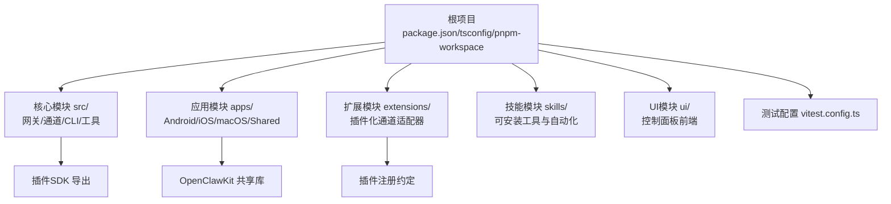
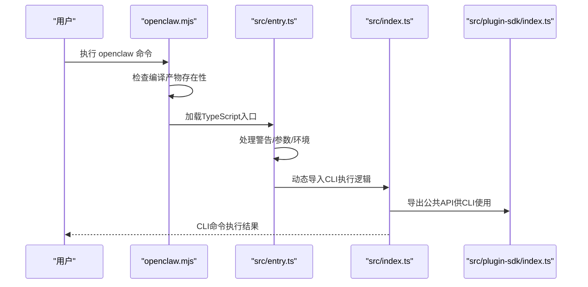
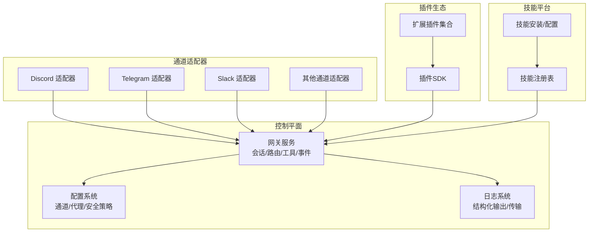
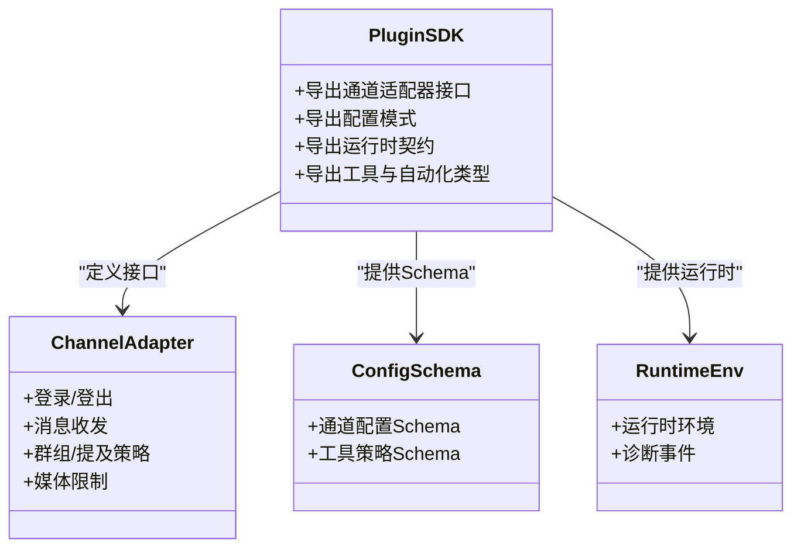
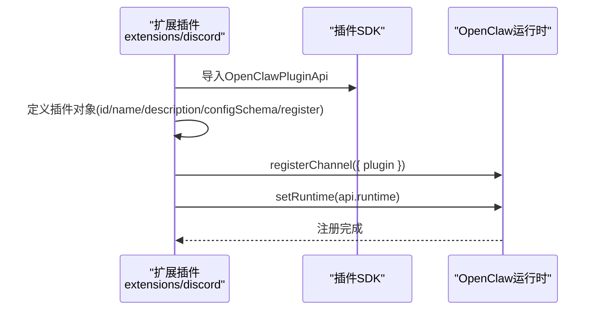
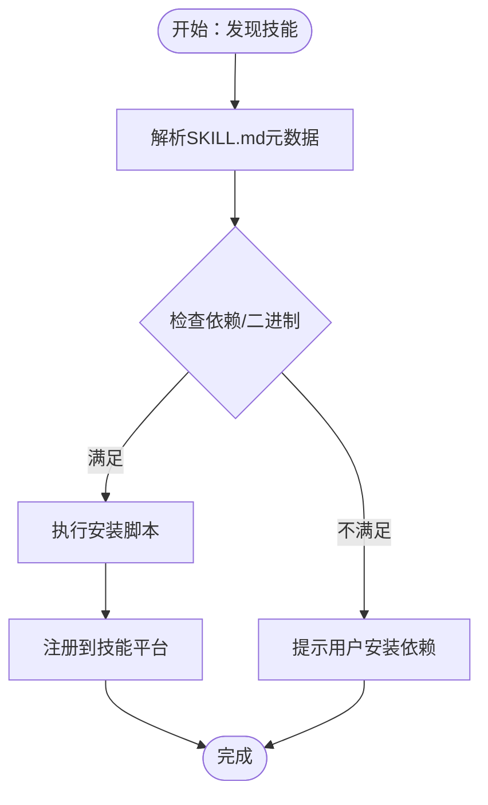
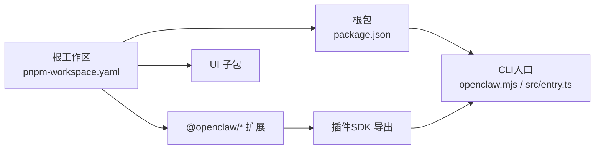

# 代码结构说明

<cite>
**本文档引用的文件**
- [package.json](file://package.json)
- [tsconfig.json](file://tsconfig.json)
- [pnpm-workspace.yaml](file://pnpm-workspace.yaml)
- [README.md](file://README.md)
- [src/index.ts](file://src/index.ts)
- [src/entry.ts](file://src/entry.ts)
- [openclaw.mjs](file://openclaw.mjs)
- [vitest.config.ts](file://vitest.config.ts)
- [ui/package.json](file://ui/package.json)
- [src/plugin-sdk/index.ts](file://src/plugin-sdk/index.ts)
- [extensions/discord/index.ts](file://extensions/discord/index.ts)
- [extensions/discord/package.json](file://extensions/discord/package.json)
- [extensions/discord/openclaw.plugin.json](file://extensions/discord/openclaw.plugin.json)
- [skills/1password/SKILL.md](file://skills/1password/SKILL.md)
</cite>

## 目录

1. [简介](#简介)
2. [项目结构](#项目结构)
3. [核心组件](#核心组件)
4. [架构总览](#架构总览)
5. [详细组件分析](#详细组件分析)
6. [依赖关系分析](#依赖关系分析)
7. [性能考虑](#性能考虑)
8. [故障排除指南](#故障排除指南)
9. [结论](#结论)
10. [附录](#附录)

## 简介

本文件面向OpenClaw项目的开发者与维护者，系统性梳理项目的代码结构、模块划分与职责边界，重点覆盖以下方面：

- 目录组织：核心模块(src/)、应用模块(apps/)、扩展模块(extensions/)、技能模块(skills/)
- 模块间依赖关系、接口定义与数据流向
- TypeScript项目配置、构建系统与代码组织原则
- Monorepo结构与各子项目的职责边界
- 代码导航指南、常用开发模式与最佳实践

OpenClaw是一个个人AI助手平台，支持多通道消息集成（如WhatsApp、Telegram、Slack、Discord、Google Chat、Signal、iMessage、Microsoft Teams等），并提供网关控制平面、浏览器控制、Canvas可视化工作区、节点设备能力、自动化与技能生态等能力。

**章节来源**

- [README.md](file://README.md#L1-L550)

## 项目结构

OpenClaw采用Monorepo结构，根目录通过pnpm工作区管理多个子包与扩展。核心目录与职责如下：

- 根级入口与构建
  - openclaw.mjs：打包后的CLI入口，负责加载编译产物或回退到TypeScript运行
  - src/entry.ts：TypeScript CLI入口，处理实验性警告抑制、参数规范化与运行时初始化
  - package.json：脚本、依赖与导出配置；声明主入口与插件SDK导出
  - tsconfig.json：TypeScript编译配置，启用NodeNext模块解析与严格模式
  - pnpm-workspace.yaml：工作区配置，统一管理packages、extensions与UI子包

- 核心模块(src/)
  - 职责：网关控制平面、通道适配器、CLI、会话与自动回复、工具与自动化、日志与基础设施等
  - 特点：集中于TypeScript源码，遵循严格的类型约束与测试覆盖率策略

- 应用模块(apps/)
  - 包含移动端与桌面端应用（Android、iOS、macOS）与共享库（OpenClawKit）
  - 采用Swift与Kotlin实现，通过Package.swift与Gradle/Kotlin DSL管理

- 扩展模块(extensions/)
  - 插件化通道适配器集合，每个扩展独立子包，遵循openclaw.plugin.json与index.ts注册约定
  - 示例：Discord、Telegram、Slack、Google Chat、Signal、iMessage、Matrix、Mattermost、Zalo等

- 技能模块(skills/)
  - 可安装的工具与自动化技能，以Markdown描述与元数据标注，支持安装、依赖与运行时要求

- UI模块(ui/)
  - 控制面板前端，使用Vite与Lit构建，独立子包管理

- 测试与质量
  - vitest.config.ts：统一测试配置，包含覆盖率阈值与排除规则
  - 多个子包的package.json脚本用于构建、开发与测试

**图表来源**

- [package.json](file://package.json#L1-L219)
- [tsconfig.json](file://tsconfig.json#L1-L28)
- [pnpm-workspace.yaml](file://pnpm-workspace.yaml#L1-L17)
- [vitest.config.ts](file://vitest.config.ts#L1-L105)

**章节来源**

- [package.json](file://package.json#L1-L219)
- [tsconfig.json](file://tsconfig.json#L1-L28)
- [pnpm-workspace.yaml](file://pnpm-workspace.yaml#L1-L17)
- [vitest.config.ts](file://vitest.config.ts#L1-L105)

## 核心组件

本节聚焦核心运行时与入口组件，解释其职责与交互方式。

- CLI入口与运行时
  - openclaw.mjs：优先尝试加载dist/entry.(m)js，若不存在则抛出错误提示
  - src/entry.ts：处理实验性警告抑制、环境变量标准化、CLI参数解析与profile注入，随后动态导入CLI执行逻辑
  - src/index.ts：作为TypeScript导出入口，暴露核心API供CLI与运行时使用

- 插件SDK与类型导出
  - src/plugin-sdk/index.ts：集中导出通道适配器、配置模式、运行时接口、工具与自动化相关类型，形成稳定的插件开发契约

- 测试与覆盖率
  - vitest.config.ts：设置测试超时、并发池、覆盖率阈值与排除列表，确保核心逻辑与关键路径得到验证

**图表来源**

- [openclaw.mjs](file://openclaw.mjs#L1-L57)
- [src/entry.ts](file://src/entry.ts#L1-L172)
- [src/index.ts](file://src/index.ts#L1-L94)
- [src/plugin-sdk/index.ts](file://src/plugin-sdk/index.ts#L1-L392)

**章节来源**

- [openclaw.mjs](file://openclaw.mjs#L1-L57)
- [src/entry.ts](file://src/entry.ts#L1-L172)
- [src/index.ts](file://src/index.ts#L1-L94)
- [src/plugin-sdk/index.ts](file://src/plugin-sdk/index.ts#L1-L392)
- [vitest.config.ts](file://vitest.config.ts#L1-L105)

## 架构总览

OpenClaw采用“网关控制平面 + 多通道适配器 + 插件生态 + 技能工具”的分层架构。核心数据流如下：

- 数据流向
  - 通道适配器接收外部消息，转换为内部消息模型，路由至会话与代理
  - 网关控制平面维护会话状态、工具注册、事件与钩子
  - 插件通过SDK注册通道适配器与运行时，扩展新渠道
  - 技能通过技能平台进行安装、配置与调用

- 关键接口
  - 插件SDK导出通道适配器、配置模式、运行时接口与工具类型
  - 通道适配器需实现登录、消息收发、群组/提及策略、媒体限制等接口

**图表来源**

- [src/plugin-sdk/index.ts](file://src/plugin-sdk/index.ts#L1-L392)
- [extensions/discord/index.ts](file://extensions/discord/index.ts#L1-L18)

**章节来源**

- [src/plugin-sdk/index.ts](file://src/plugin-sdk/index.ts#L1-L392)
- [extensions/discord/index.ts](file://extensions/discord/index.ts#L1-L18)

## 详细组件分析

### 组件A：插件SDK与通道适配器

- 职责
  - 提供统一的通道适配器接口、配置模式与运行时契约
  - 支持通道账户解析、消息动作、提及策略、群组工具策略、媒体限制等
- 关键类型与导出
  - 通道适配器接口、认证/配置/消息/群组/心跳/安全等上下文类型
  - 配置Schema与工具策略类型
  - 运行时环境与诊断事件类型
- 设计要点
  - 类型驱动的插件开发体验，降低耦合度
  - 通过配置Schema与工具策略实现安全与可控的通道行为

**图表来源**

- [src/plugin-sdk/index.ts](file://src/plugin-sdk/index.ts#L1-L392)

**章节来源**

- [src/plugin-sdk/index.ts](file://src/plugin-sdk/index.ts#L1-L392)

### 组件B：扩展插件注册流程（以Discord为例）

- 职责
  - 将通道适配器注册到OpenClaw运行时，注入运行时环境
- 注册约定
  - index.ts中通过registerChannel注册插件
  - openclaw.plugin.json声明插件ID与支持的通道类型
  - package.json的openclaw.extensions字段指向入口文件

**图表来源**

- [extensions/discord/index.ts](file://extensions/discord/index.ts#L1-L18)
- [extensions/discord/openclaw.plugin.json](file://extensions/discord/openclaw.plugin.json#L1-L10)
- [extensions/discord/package.json](file://extensions/discord/package.json#L1-L15)

**章节来源**

- [extensions/discord/index.ts](file://extensions/discord/index.ts#L1-L18)
- [extensions/discord/openclaw.plugin.json](file://extensions/discord/openclaw.plugin.json#L1-L10)
- [extensions/discord/package.json](file://extensions/discord/package.json#L1-L15)

### 组件C：技能模块与安装流程

- 职责
  - 以Markdown描述技能功能、元数据与安装指引
  - 通过技能平台进行安装、依赖检查与运行时注入
- 结构特征
  - 每个技能包含SKILL.md与可选的脚本与参考文件
  - 元数据中声明所需二进制、安装方式与运行约束

**图表来源**

- [skills/1password/SKILL.md](file://skills/1password/SKILL.md#L1-L71)

**章节来源**

- [skills/1password/SKILL.md](file://skills/1password/SKILL.md#L1-L71)

### 组件D：UI模块与构建系统

- 职责
  - 控制面板前端，提供Web界面与交互
- 构建与测试
  - 使用Vite构建，配合Playwright的浏览器测试
  - 通过独立package.json管理依赖与脚本

**章节来源**

- [ui/package.json](file://ui/package.json#L1-L24)

## 依赖关系分析

- Monorepo边界
  - 根工作区通过pnpm-workspace.yaml统一管理packages、extensions与UI子包
  - 扩展插件通过devDependencies引用根openclaw包，遵循workspace:\*约定
- 内部依赖
  - src/plugin-sdk/index.ts集中导出类型与接口，被扩展插件与核心模块复用
  - CLI入口通过openclaw.mjs与src/entry.ts串联，确保运行时一致性
- 测试隔离
  - vitest.config.ts对核心模块设置覆盖率阈值与排除规则，避免过度测试非关键路径

**图表来源**

- [pnpm-workspace.yaml](file://pnpm-workspace.yaml#L1-L17)
- [package.json](file://package.json#L1-L219)
- [src/plugin-sdk/index.ts](file://src/plugin-sdk/index.ts#L1-L392)

**章节来源**

- [pnpm-workspace.yaml](file://pnpm-workspace.yaml#L1-L17)
- [package.json](file://package.json#L1-L219)
- [src/plugin-sdk/index.ts](file://src/plugin-sdk/index.ts#L1-L392)

## 性能考虑

- 构建与运行
  - 使用tsdown与插件SDK类型生成，减少重复编译开销
  - CLI入口在Windows上调整超时与并发，提升稳定性
- 测试效率
  - Vitest并发池与阈值设置，平衡覆盖率与CI时间
  - 排除复杂集成面（如网关服务器、浏览器控制、通道表面）的单元测试，通过手动/端到端验证
- 运行时优化
  - 实验性警告抑制与进程标题设置，减少启动噪音
  - 编译缓存启用，提升TypeScript运行时性能

**章节来源**

- [package.json](file://package.json#L33-L110)
- [vitest.config.ts](file://vitest.config.ts#L12-L105)
- [src/entry.ts](file://src/entry.ts#L1-L172)
- [openclaw.mjs](file://openclaw.mjs#L1-L57)

## 故障排除指南

- CLI启动失败
  - 确认dist/entry.(m)js是否存在；若缺失，先执行构建脚本
  - 检查NODE_OPTIONS与实验性警告相关参数是否正确传递
- 扩展插件未生效
  - 确认openclaw.plugin.json中的channels与插件ID一致
  - 检查package.json的openclaw.extensions字段是否指向正确的入口
- 测试覆盖率异常
  - 查看vitest.config.ts的排除规则，确认目标文件是否被意外排除
  - 在CI环境下核对maxWorkers与pool设置

**章节来源**

- [openclaw.mjs](file://openclaw.mjs#L35-L57)
- [src/entry.ts](file://src/entry.ts#L34-L77)
- [extensions/discord/openclaw.plugin.json](file://extensions/discord/openclaw.plugin.json#L1-L10)
- [extensions/discord/package.json](file://extensions/discord/package.json#L9-L15)
- [vitest.config.ts](file://vitest.config.ts#L23-L102)

## 结论

OpenClaw通过清晰的Monorepo结构、严格的TypeScript配置与插件SDK，实现了可扩展的多通道消息网关。核心模块聚焦控制平面与工具生态，扩展模块以插件形式接入新通道，技能模块提供可安装的自动化能力。建议在开发中遵循以下原则：

- 以插件SDK为中心设计通道适配器，保持接口稳定
- 通过配置Schema与工具策略实现安全与可控
- 利用工作区与构建脚本统一管理依赖与发布
- 重视测试策略，核心逻辑单元测试+手动/端到端验证相结合

## 附录

- 开发模式
  - 快速开发：使用pnpm gateway:watch或pnpm ios:run等脚本进入热重载模式
  - 构建与打包：先构建插件SDK类型，再执行主构建脚本
  - 文档与格式：使用oxfmt与swiftlint保证代码风格一致
- 最佳实践
  - 扩展插件应最小化副作用，通过openclaw.plugin.json声明通道能力
  - 技能应明确依赖与安装步骤，提供可执行的tmux会话示例
  - 配置变更应通过Schema校验，避免运行时错误

**章节来源**

- [README.md](file://README.md#L87-L106)
- [package.json](file://package.json#L33-L110)
- [skills/1password/SKILL.md](file://skills/1password/SKILL.md#L44-L62)
