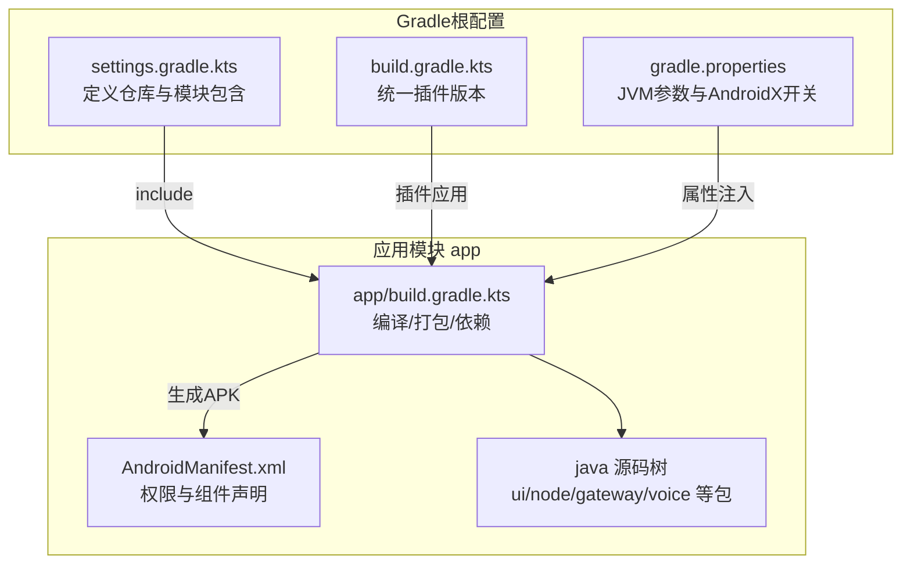
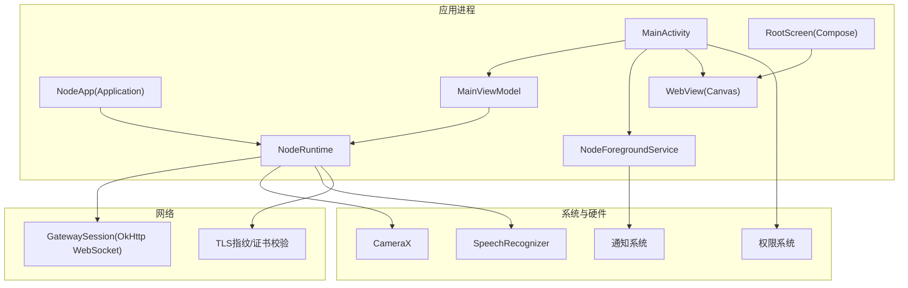
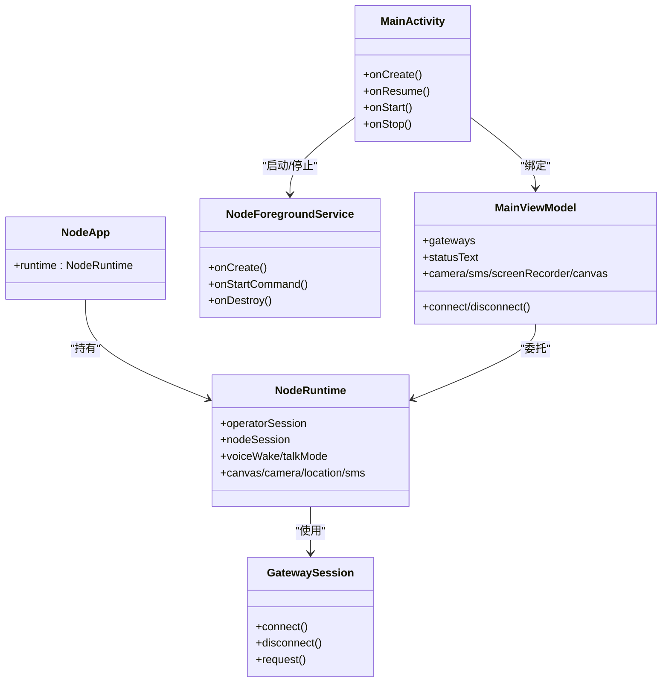

# Android应用

<cite>
**本文引用的文件**
- [apps/android/app/build.gradle.kts](file://apps/android/app/build.gradle.kts)
- [apps/android/build.gradle.kts](file://apps/android/build.gradle.kts)
- [apps/android/settings.gradle.kts](file://apps/android/settings.gradle.kts)
- [apps/android/gradle.properties](file://apps/android/gradle.properties)
- [apps/android/app/src/main/AndroidManifest.xml](file://apps/android/app/src/main/AndroidManifest.xml)
- [apps/android/app/src/main/java/ai/openclaw/android/NodeApp.kt](file://apps/android/app/src/main/java/ai/openclaw/android/NodeApp.kt)
- [apps/android/app/src/main/java/ai/openclaw/android/MainActivity.kt](file://apps/android/app/src/main/java/ai/openclaw/android/MainActivity.kt)
- [apps/android/app/src/main/java/ai/openclaw/android/NodeForegroundService.kt](file://apps/android/app/src/main/java/ai/openclaw/android/NodeForegroundService.kt)
- [apps/android/app/src/main/java/ai/openclaw/android/MainViewModel.kt](file://apps/android/app/src/main/java/ai/openclaw/android/MainViewModel.kt)
- [apps/android/app/src/main/java/ai/openclaw/android/NodeRuntime.kt](file://apps/android/app/src/main/java/ai/openclaw/android/NodeRuntime.kt)
- [apps/android/app/src/main/java/ai/openclaw/android/gateway/GatewaySession.kt](file://apps/android/app/src/main/java/ai/openclaw/android/gateway/GatewaySession.kt)
- [apps/android/app/src/main/java/ai/openclaw/android/ui/RootScreen.kt](file://apps/android/app/src/main/java/ai/openclaw/android/ui/RootScreen.kt)
- [apps/android/app/src/main/java/ai/openclaw/android/node/CameraCaptureManager.kt](file://apps/android/app/src/main/java/ai/openclaw/android/node/CameraCaptureManager.kt)
- [apps/android/app/src/main/java/ai/openclaw/android/voice/VoiceWakeManager.kt](file://apps/android/app/src/main/java/ai/openclaw/android/voice/VoiceWakeManager.kt)
</cite>

## 目录

1. [简介](#简介)
2. [项目结构](#项目结构)
3. [核心组件](#核心组件)
4. [架构总览](#架构总览)
5. [详细组件分析](#详细组件分析)
6. [依赖关系分析](#依赖关系分析)
7. [性能与内存优化](#性能与内存优化)
8. [故障排查指南](#故障排查指南)
9. [结论](#结论)
10. [附录：构建、签名与发布](#附录构建签名与发布)

## 简介

本文件面向OpenClaw Android应用，系统化梳理其移动架构设计与实现要点，覆盖Gradle构建配置、模块结构与依赖管理；应用包结构、Activity/Fragment/Service组织方式；Android特有能力（权限、后台服务、通知、硬件访问）；生命周期与状态管理、网络通信与本地存储策略；以及版本兼容、性能优化与打包签名发布流程。

## 项目结构

Android应用位于apps/android目录，采用单模块结构，根级settings与plugin管理统一版本，app模块负责应用实现与资源。

图表来源

- [apps/android/settings.gradle.kts](file://apps/android/settings.gradle.kts#L1-L19)
- [apps/android/build.gradle.kts](file://apps/android/build.gradle.kts#L1-L7)
- [apps/android/gradle.properties](file://apps/android/gradle.properties#L1-L5)
- [apps/android/app/build.gradle.kts](file://apps/android/app/build.gradle.kts#L1-L129)
- [apps/android/app/src/main/AndroidManifest.xml](file://apps/android/app/src/main/AndroidManifest.xml#L1-L50)

章节来源

- [apps/android/settings.gradle.kts](file://apps/android/settings.gradle.kts#L1-L19)
- [apps/android/build.gradle.kts](file://apps/android/build.gradle.kts#L1-L7)
- [apps/android/gradle.properties](file://apps/android/gradle.properties#L1-L5)
- [apps/android/app/build.gradle.kts](file://apps/android/app/build.gradle.kts#L1-L129)
- [apps/android/app/src/main/AndroidManifest.xml](file://apps/android/app/src/main/AndroidManifest.xml#L1-L50)

## 核心组件

- 应用入口与运行时
  - Application节点：NodeApp在调试模式下启用StrictMode，统一持有NodeRuntime实例。
  - Activity节点：MainActivity负责沉浸式窗口、权限请求、前台服务启动、ViewModel绑定与Compose UI渲染。
  - 前台服务：NodeForegroundService维持连接状态通知，动态更新通知类型与内容。
  - 视图模型：MainViewModel聚合NodeRuntime状态与操作，暴露给UI层。
  - 运行时：NodeRuntime封装网关会话、语音唤醒、屏幕录制、相机、短信、聊天等能力，并通过协程流对外暴露状态。

- 网络与协议
  - GatewaySession基于OkHttp WebSocket实现，支持重连、超时、TLS指纹校验、设备签名与鉴权、事件与invoke处理。

- UI与交互
  - RootScreen以Compose承载，内嵌WebView作为Canvas容器，桥接A2UI动作；提供悬浮按钮、底部弹窗、状态指示器等。

- 硬件与系统能力
  - 相机：CameraCaptureManager基于CameraX实现拍照与视频录制，含EXIF旋转、尺寸压缩与Base64编码。
  - 语音唤醒：VoiceWakeManager基于系统SpeechRecognizer实现热词触发与命令分发。
  - 通知：NodeForegroundService创建通知通道并动态更新通知内容与类型。

章节来源

- [apps/android/app/src/main/java/ai/openclaw/android/NodeApp.kt](file://apps/android/app/src/main/java/ai/openclaw/android/NodeApp.kt#L1-L27)
- [apps/android/app/src/main/java/ai/openclaw/android/MainActivity.kt](file://apps/android/app/src/main/java/ai/openclaw/android/MainActivity.kt#L1-L131)
- [apps/android/app/src/main/java/ai/openclaw/android/NodeForegroundService.kt](file://apps/android/app/src/main/java/ai/openclaw/android/NodeForegroundService.kt#L1-L181)
- [apps/android/app/src/main/java/ai/openclaw/android/MainViewModel.kt](file://apps/android/app/src/main/java/ai/openclaw/android/MainViewModel.kt#L1-L175)
- [apps/android/app/src/main/java/ai/openclaw/android/NodeRuntime.kt](file://apps/android/app/src/main/java/ai/openclaw/android/NodeRuntime.kt#L1-L800)
- [apps/android/app/src/main/java/ai/openclaw/android/gateway/GatewaySession.kt](file://apps/android/app/src/main/java/ai/openclaw/android/gateway/GatewaySession.kt#L1-L684)
- [apps/android/app/src/main/java/ai/openclaw/android/ui/RootScreen.kt](file://apps/android/app/src/main/java/ai/openclaw/android/ui/RootScreen.kt#L1-L430)
- [apps/android/app/src/main/java/ai/openclaw/android/node/CameraCaptureManager.kt](file://apps/android/app/src/main/java/ai/openclaw/android/node/CameraCaptureManager.kt#L1-L317)
- [apps/android/app/src/main/java/ai/openclaw/android/voice/VoiceWakeManager.kt](file://apps/android/app/src/main/java/ai/openclaw/android/voice/VoiceWakeManager.kt#L1-L174)

## 架构总览

应用采用“Application/Runtime/ViewModel/UI”的分层设计，配合“前台服务+WebSocket网关”实现持续连接与跨端控制。

图表来源

- [apps/android/app/src/main/java/ai/openclaw/android/NodeApp.kt](file://apps/android/app/src/main/java/ai/openclaw/android/NodeApp.kt#L1-L27)
- [apps/android/app/src/main/java/ai/openclaw/android/NodeRuntime.kt](file://apps/android/app/src/main/java/ai/openclaw/android/NodeRuntime.kt#L1-L800)
- [apps/android/app/src/main/java/ai/openclaw/android/MainActivity.kt](file://apps/android/app/src/main/java/ai/openclaw/android/MainActivity.kt#L1-L131)
- [apps/android/app/src/main/java/ai/openclaw/android/NodeForegroundService.kt](file://apps/android/app/src/main/java/ai/openclaw/android/NodeForegroundService.kt#L1-L181)
- [apps/android/app/src/main/java/ai/openclaw/android/ui/RootScreen.kt](file://apps/android/app/src/main/java/ai/openclaw/android/ui/RootScreen.kt#L1-L430)
- [apps/android/app/src/main/java/ai/openclaw/android/gateway/GatewaySession.kt](file://apps/android/app/src/main/java/ai/openclaw/android/gateway/GatewaySession.kt#L1-L684)

## 详细组件分析

### Gradle构建与模块管理

- 插件与版本
  - 应用与Kotlin插件由根级build脚本集中声明，避免版本漂移。
  - app模块启用Compose、序列化、Kotlin编译器严格警告。
- 编译与打包
  - compileSdk/targetSdk/minSdk设定，Java 17目标兼容。
  - 关闭混淆，保留Compose BOM统一依赖版本。
  - 自定义输出命名规则，按版本名与构建类型生成APK文件名。
- 依赖
  - Compose UI/Material3/Navigation；Kotlin协程与序列化；OkHttp；CameraX；安全加密与EXIF工具；测试框架。
- Lint与测试
  - 部分规则禁用，开启警告即错误；单元测试包含Android资源。

章节来源

- [apps/android/build.gradle.kts](file://apps/android/build.gradle.kts#L1-L7)
- [apps/android/app/build.gradle.kts](file://apps/android/app/build.gradle.kts#L1-L129)
- [apps/android/gradle.properties](file://apps/android/gradle.properties#L1-L5)

### 包结构与组件组织

- 包层次
  - ai.openclaw.android：主包，包含入口类、运行时、权限与请求器、语音与工具等。
  - ai.openclaw.android.ui：Compose UI与主题、根界面、对话框与覆盖层。
  - ai.openclaw.android.node：相机、屏幕录制、位置、短信等节点能力封装。
  - ai.openclaw.android.gateway：网关发现、端点、协议、TLS、会话与鉴权存储。
  - ai.openclaw.android.voice：语音唤醒与说话模式管理。
- 组件职责
  - NodeApp：进程级初始化与StrictMode。
  - MainActivity：窗口沉浸、权限、前台服务、ViewModel绑定、Compose根。
  - NodeForegroundService：通知通道、动态通知类型、状态更新。
  - MainViewModel：状态聚合与命令转发。
  - NodeRuntime：核心业务编排、网关会话、A2UI桥接、能力开关与策略。

章节来源

- [apps/android/app/src/main/java/ai/openclaw/android/NodeApp.kt](file://apps/android/app/src/main/java/ai/openclaw/android/NodeApp.kt#L1-L27)
- [apps/android/app/src/main/java/ai/openclaw/android/MainActivity.kt](file://apps/android/app/src/main/java/ai/openclaw/android/MainActivity.kt#L1-L131)
- [apps/android/app/src/main/java/ai/openclaw/android/NodeForegroundService.kt](file://apps/android/app/src/main/java/ai/openclaw/android/NodeForegroundService.kt#L1-L181)
- [apps/android/app/src/main/java/ai/openclaw/android/MainViewModel.kt](file://apps/android/app/src/main/java/ai/openclaw/android/MainViewModel.kt#L1-L175)
- [apps/android/app/src/main/java/ai/openclaw/android/NodeRuntime.kt](file://apps/android/app/src/main/java/ai/openclaw/android/NodeRuntime.kt#L1-L800)

### Activity与Fragment使用

- Activity
  - MainActivity继承ComponentActivity，设置沉浸式窗口、请求必要权限、启动前台服务、绑定ViewModel与相机/录屏权限请求器。
  - 生命周期中处理前台状态、保持屏幕常亮、恢复沉浸式布局。
- Fragment
  - 未直接使用Fragment；UI通过Compose ModalBottomSheet承载“聊天/设置”底部弹窗，复用状态与导航逻辑。
- 选择依据
  - 使用Compose与AndroidView集成WebView，减少Fragment复杂度；底部弹窗以状态驱动，避免Fragment状态碎片化。

章节来源

- [apps/android/app/src/main/java/ai/openclaw/android/MainActivity.kt](file://apps/android/app/src/main/java/ai/openclaw/android/MainActivity.kt#L1-L131)
- [apps/android/app/src/main/java/ai/openclaw/android/ui/RootScreen.kt](file://apps/android/app/src/main/java/ai/openclaw/android/ui/RootScreen.kt#L1-L430)

### Service与前台服务

- NodeForegroundService
  - 创建低重要性通知通道，启动前台服务并动态更新通知类型（数据同步/麦克风）。
  - 订阅NodeRuntime状态流，实时更新标题、文本与语音唤醒后缀。
  - 提供停止动作，触发断开连接并停止自身。
- 启动与停止
  - 由MainActivity在onCreate阶段启动；支持显式意图停止。

章节来源

- [apps/android/app/src/main/java/ai/openclaw/android/NodeForegroundService.kt](file://apps/android/app/src/main/java/ai/openclaw/android/NodeForegroundService.kt#L1-L181)
- [apps/android/app/src/main/java/ai/openclaw/android/MainActivity.kt](file://apps/android/app/src/main/java/ai/openclaw/android/MainActivity.kt#L37-L37)

### 权限管理与系统能力

- 权限声明
  - INTERNET、网络状态、前台服务类型、通知、近场Wi-Fi、定位、相机、录音、短信等。
- 动态权限
  - MainActivity在Android 13+请求NEARBY_WIFI_DEVICES；在Android 13以下请求ACCESS_FINE_LOCATION。
  - 请求POST_NOTIFICATIONS（Android 13+）。
- 能力封装
  - CameraCaptureManager：相机权限校验、EXIF旋转、尺寸压缩、Base64编码。
  - VoiceWakeManager：系统SpeechRecognizer热词监听与错误处理。
  - NodeRuntime：根据权限与模式决定是否启用语音唤醒与通话模式。

章节来源

- [apps/android/app/src/main/AndroidManifest.xml](file://apps/android/app/src/main/AndroidManifest.xml#L1-L50)
- [apps/android/app/src/main/java/ai/openclaw/android/MainActivity.kt](file://apps/android/app/src/main/java/ai/openclaw/android/MainActivity.kt#L97-L129)
- [apps/android/app/src/main/java/ai/openclaw/android/node/CameraCaptureManager.kt](file://apps/android/app/src/main/java/ai/openclaw/android/node/CameraCaptureManager.kt#L51-L73)
- [apps/android/app/src/main/java/ai/openclaw/android/voice/VoiceWakeManager.kt](file://apps/android/app/src/main/java/ai/openclaw/android/voice/VoiceWakeManager.kt#L43-L76)
- [apps/android/app/src/main/java/ai/openclaw/android/NodeRuntime.kt](file://apps/android/app/src/main/java/ai/openclaw/android/NodeRuntime.kt#L572-L598)

### 通知系统

- 通道与通知
  - 创建“Connection”通道，低重要性，不显示徽章。
  - 通知内容包含标题、文本、点击跳转到MainActivity、断开连接动作。
- 类型切换
  - 当语音唤醒处于“总是”且具备录音权限时，通知类型包含麦克风类型，否则仅数据同步类型。
- 更新策略
  - 避免重复启动与类型不变时的无谓更新，仅在变化时调用startForeground或notify。

章节来源

- [apps/android/app/src/main/java/ai/openclaw/android/NodeForegroundService.kt](file://apps/android/app/src/main/java/ai/openclaw/android/NodeForegroundService.kt#L86-L153)

### 硬件访问与媒体能力

- 相机
  - CameraX：绑定生命周期，支持前后摄像头、音频录制、EXIF方向修正、尺寸缩放与JPEG压缩。
  - 输出限制：Base64编码上限约5MB，防止超限。
- 屏幕录制
  - 通过CameraX VideoCapture录制MP4，支持音频开关与时长控制。
- 语音
  - 语音唤醒：热词匹配与去抖，错误分类与自动重启。
  - 通话模式：与网关事件联动，支持状态文本与收听/说话状态。

章节来源

- [apps/android/app/src/main/java/ai/openclaw/android/node/CameraCaptureManager.kt](file://apps/android/app/src/main/java/ai/openclaw/android/node/CameraCaptureManager.kt#L75-L198)
- [apps/android/app/src/main/java/ai/openclaw/android/voice/VoiceWakeManager.kt](file://apps/android/app/src/main/java/ai/openclaw/android/voice/VoiceWakeManager.kt#L111-L169)
- [apps/android/app/src/main/java/ai/openclaw/android/NodeRuntime.kt](file://apps/android/app/src/main/java/ai/openclaw/android/NodeRuntime.kt#L223-L231)

### 生命周期管理与状态保存

- Application
  - NodeApp在调试模式启用StrictMode，便于早期发现线程与VM违规。
- Activity
  - onCreate中初始化WebView调试、沉浸式窗口、权限请求、前台服务与ViewModel绑定。
  - onStart/onStop维护“前台”状态，影响语音唤醒策略与UI提示。
  - onResume/onWindowFocusChanged确保沉浸式布局生效。
- ViewModel
  - MainViewModel将NodeRuntime的状态与操作映射为可观察的StateFlow与函数。
- 状态流
  - NodeRuntime通过combine与distinctUntilChanged组合多源状态，避免冗余更新。
  - 例如：语音唤醒监听状态由“模式+前台+外部音频占用+热词列表”共同决定。

章节来源

- [apps/android/app/src/main/java/ai/openclaw/android/NodeApp.kt](file://apps/android/app/src/main/java/ai/openclaw/android/NodeApp.kt#L9-L25)
- [apps/android/app/src/main/java/ai/openclaw/android/MainActivity.kt](file://apps/android/app/src/main/java/ai/openclaw/android/MainActivity.kt#L30-L87)
- [apps/android/app/src/main/java/ai/openclaw/android/MainViewModel.kt](file://apps/android/app/src/main/java/ai/openclaw/android/MainViewModel.kt#L13-L69)
- [apps/android/app/src/main/java/ai/openclaw/android/NodeRuntime.kt](file://apps/android/app/src/main/java/ai/openclaw/android/NodeRuntime.kt#L305-L389)

### 网络通信与本地存储策略

- 网络
  - GatewaySession基于OkHttp WebSocket，支持：
    - 连接重试与指数回退；
    - 设备身份与签名、令牌/密码鉴权；
    - connect挑战nonce处理；
    - node.invoke请求/响应与结果回传；
    - TLS指纹校验与持久化。
- 本地存储
  - SecurePrefs封装偏好读写，包括显示名、相机/定位/睡眠策略、语音唤醒模式与热词、手动连接参数、Canvas调试状态等。
  - DeviceAuthStore/DeviceIdentityStore负责设备标识与令牌持久化。
- 数据流
  - NodeRuntime将网关事件映射为UI状态与聊天/语音控制，同时向Canvas注入A2UI动作桥。

章节来源

- [apps/android/app/src/main/java/ai/openclaw/android/gateway/GatewaySession.kt](file://apps/android/app/src/main/java/ai/openclaw/android/gateway/GatewaySession.kt#L102-L125)
- [apps/android/app/src/main/java/ai/openclaw/android/NodeRuntime.kt](file://apps/android/app/src/main/java/ai/openclaw/android/NodeRuntime.kt#L61-L72)
- [apps/android/app/src/main/java/ai/openclaw/android/NodeRuntime.kt](file://apps/android/app/src/main/java/ai/openclaw/android/NodeRuntime.kt#L616-L650)

### A2UI与WebView集成

- 桥接机制
  - RootScreen通过addJavascriptInterface注入openclawCanvasA2UIAction桥，接收来自Canvas的用户动作payload。
  - NodeRuntime解析payload，构造agent.request消息并发送至网关，同时在Canvas侧回显执行状态。
- 安全与调试
  - 开启JavaScript与DOM存储；调试模式下记录WebView错误与控制台日志；禁用算法深色以避免内容异常。
- 页面生命周期
  - onPageFinished回调用于Canvas内部状态同步。

章节来源

- [apps/android/app/src/main/java/ai/openclaw/android/ui/RootScreen.kt](file://apps/android/app/src/main/java/ai/openclaw/android/ui/RootScreen.kt#L317-L430)
- [apps/android/app/src/main/java/ai/openclaw/android/NodeRuntime.kt](file://apps/android/app/src/main/java/ai/openclaw/android/NodeRuntime.kt#L652-L722)

### 语音唤醒与通话模式

- 语音唤醒
  - VoiceWakeManager基于系统识别器，支持热词提取、部分结果与错误分类、自动重启。
  - NodeRuntime根据模式（关闭/前台/总是）、前台状态与外部音频占用决定是否监听。
- 通话模式
  - TalkModeManager与operator会话联动，提供“正在收听/正在说话”状态与文本描述。

章节来源

- [apps/android/app/src/main/java/ai/openclaw/android/voice/VoiceWakeManager.kt](file://apps/android/app/src/main/java/ai/openclaw/android/voice/VoiceWakeManager.kt#L18-L174)
- [apps/android/app/src/main/java/ai/openclaw/android/NodeRuntime.kt](file://apps/android/app/src/main/java/ai/openclaw/android/NodeRuntime.kt#L305-L337)
- [apps/android/app/src/main/java/ai/openclaw/android/NodeRuntime.kt](file://apps/android/app/src/main/java/ai/openclaw/android/NodeRuntime.kt#L223-L231)

## 依赖关系分析

图表来源

- [apps/android/app/src/main/java/ai/openclaw/android/NodeApp.kt](file://apps/android/app/src/main/java/ai/openclaw/android/NodeApp.kt#L1-L27)
- [apps/android/app/src/main/java/ai/openclaw/android/MainActivity.kt](file://apps/android/app/src/main/java/ai/openclaw/android/MainActivity.kt#L1-L131)
- [apps/android/app/src/main/java/ai/openclaw/android/NodeForegroundService.kt](file://apps/android/app/src/main/java/ai/openclaw/android/NodeForegroundService.kt#L1-L181)
- [apps/android/app/src/main/java/ai/openclaw/android/MainViewModel.kt](file://apps/android/app/src/main/java/ai/openclaw/android/MainViewModel.kt#L1-L175)
- [apps/android/app/src/main/java/ai/openclaw/android/NodeRuntime.kt](file://apps/android/app/src/main/java/ai/openclaw/android/NodeRuntime.kt#L1-L800)
- [apps/android/app/src/main/java/ai/openclaw/android/gateway/GatewaySession.kt](file://apps/android/app/src/main/java/ai/openclaw/android/gateway/GatewaySession.kt#L1-L684)

## 性能与内存优化

- 协程与调度
  - 使用SupervisorJob隔离子任务，IO主线程分离；避免主线程阻塞。
- 网络与重试
  - WebSocket连接采用指数回退与超时控制，降低频繁重连对CPU与电量的影响。
- UI与WebView
  - 仅在状态变化时更新通知与Canvas调试状态，避免无效刷新。
  - WebView启用DOM存储与JavaScript，调试模式下记录错误以便定位问题。
- 相机与媒体
  - JPEG压缩与尺寸缩放在Main线程完成，但耗时短；Base64上限控制在5MB以内，防止OOM。
- 内存与资源
  - EXIF旋转后及时回收中间Bitmap；录屏完成后删除临时文件。
- 版本与兼容
  - minSdk 31，充分利用现代权限模型与前台服务类型；对旧版Android进行条件分支处理。

[本节为通用建议，无需特定文件引用]

## 故障排查指南

- 无法连接网关
  - 检查权限：INTERNET、网络状态、前台服务类型、通知（Android 13+）、定位（发现与连接）、相机/录音（功能启用时）。
  - 查看NodeForegroundService通知中的状态文本与语音唤醒后缀，确认是否因权限不足导致暂停。
  - 在调试模式下，检查日志中WebSocket错误与HTTP错误信息。
- 语音唤醒无效
  - 确认已授予录音权限；检查VoiceWakeManager状态文本与错误分类；确认热词列表与模式设置。
- 相机/录屏失败
  - 检查相机权限与生命周期绑定；关注EXIF旋转与尺寸压缩过程中的异常；确认临时文件清理。
- WebView异常
  - 调试模式下查看控制台日志与页面完成回调；确认混合内容策略与强制深色设置。

章节来源

- [apps/android/app/src/main/java/ai/openclaw/android/NodeForegroundService.kt](file://apps/android/app/src/main/java/ai/openclaw/android/NodeForegroundService.kt#L133-L153)
- [apps/android/app/src/main/java/ai/openclaw/android/voice/VoiceWakeManager.kt](file://apps/android/app/src/main/java/ai/openclaw/android/voice/VoiceWakeManager.kt#L137-L158)
- [apps/android/app/src/main/java/ai/openclaw/android/node/CameraCaptureManager.kt](file://apps/android/app/src/main/java/ai/openclaw/android/node/CameraCaptureManager.kt#L180-L198)
- [apps/android/app/src/main/java/ai/openclaw/android/ui/RootScreen.kt](file://apps/android/app/src/main/java/ai/openclaw/android/ui/RootScreen.kt#L342-L386)

## 结论

该Android应用以清晰的分层与协程流为核心，结合前台服务与WebSocket网关实现稳定的后台连接与跨端控制；UI采用Compose与WebView融合方案，兼顾灵活性与兼容性；在权限、通知、硬件访问方面遵循Android最佳实践。通过严格的构建配置与状态管理，应用在功能完整性与用户体验之间取得平衡。

[本节为总结，无需特定文件引用]

## 附录：构建、签名与发布

- 构建
  - 使用Gradle Kotlin DSL，启用Compose与序列化插件；Java 17目标兼容；关闭混淆以利于调试。
  - 输出文件名包含版本名与构建类型，便于区分渠道与版本。
- 签名与发布
  - 仓库未包含签名配置与发布脚本；建议在CI中配置密钥与发布流程，遵循Google Play或自有渠道的签名规范。
- 版本兼容
  - minSdk 31，targetSdk 36；对Android 13+的权限模型与前台服务类型进行适配。

章节来源

- [apps/android/app/build.gradle.kts](file://apps/android/app/build.gradle.kts#L1-L129)
- [apps/android/app/src/main/AndroidManifest.xml](file://apps/android/app/src/main/AndroidManifest.xml#L1-L50)
