# iOS应用

<cite>
**本文引用的文件**
- [OpenClawApp.swift](file://apps/ios/Sources/OpenClawApp.swift)
- [RootView.swift](file://apps/ios/Sources/RootView.swift)
- [RootCanvas.swift](file://apps/ios/Sources/RootCanvas.swift)
- [RootTabs.swift](file://apps/ios/Sources/RootTabs.swift)
- [NodeAppModel.swift](file://apps/ios/Sources/Model/NodeAppModel.swift)
- [CameraController.swift](file://apps/ios/Sources/Camera/CameraController.swift)
- [ScreenController.swift](file://apps/ios/Sources/Screen/ScreenController.swift)
- [VoiceWakeManager.swift](file://apps/ios/Sources/Voice/VoiceWakeManager.swift)
- [GatewayConnectionController.swift](file://apps/ios/Sources/Gateway/GatewayConnectionController.swift)
- [NotificationService.swift](file://apps/ios/Sources/Services/NotificationService.swift)
- [SettingsTab.swift](file://apps/ios/Sources/Settings/SettingsTab.swift)
</cite>

## 目录

1. [简介](#简介)
2. [项目结构](#项目结构)
3. [核心组件](#核心组件)
4. [架构总览](#架构总览)
5. [详细组件分析](#详细组件分析)
6. [依赖关系分析](#依赖关系分析)
7. [性能考虑](#性能考虑)
8. [故障排查指南](#故障排查指南)
9. [结论](#结论)

## 简介

本文件为 OpenClaw iOS 应用的功能架构文档，聚焦于应用的模块化组织与实现，涵盖主应用 OpenClawApp、根视图 RootView/RootCanvas、以及围绕功能域（日历、相机、设备、网关、位置、媒体、模型、运动、提醒、屏幕、服务、设置、状态、语音）的 SwiftUI 实现。文档同时记录应用生命周期管理、状态持久化、网络通信与本地存储实现，并说明 iOS 特有功能集成（推送通知、后台任务、权限管理、设备传感器访问）。

## 项目结构

应用采用以功能域为中心的模块化组织方式，通过 SwiftUI 的环境注入与 Observable 模型实现跨模块协作。主要入口与结构如下：

- 应用入口：OpenClawApp 负责初始化应用模型与网关控制器，并将模型注入到根画布中。
- 根视图：RootView 包裹 RootCanvas，后者承载主界面布局与交互。
- 功能域模块：按领域划分（如 Camera、Screen、Voice、Gateway、Settings 等），每个模块提供独立的服务与视图。
- 核心模型：NodeAppModel 统一协调网关连接、能力路由、系统服务调用与 UI 状态。

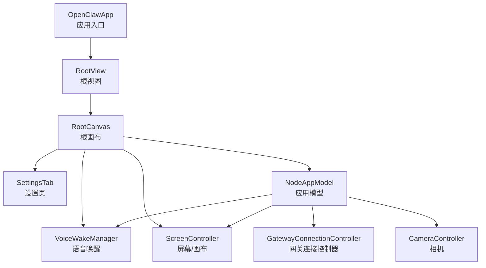

图表来源

- [OpenClawApp.swift](file://apps/ios/Sources/OpenClawApp.swift#L1-L32)
- [RootView.swift](file://apps/ios/Sources/RootView.swift#L1-L8)
- [RootCanvas.swift](file://apps/ios/Sources/RootCanvas.swift#L1-L157)
- [NodeAppModel.swift](file://apps/ios/Sources/Model/NodeAppModel.swift#L1-L186)
- [GatewayConnectionController.swift](file://apps/ios/Sources/Gateway/GatewayConnectionController.swift#L1-L60)
- [CameraController.swift](file://apps/ios/Sources/Camera/CameraController.swift#L1-L40)
- [ScreenController.swift](file://apps/ios/Sources/Screen/ScreenController.swift#L1-L51)
- [VoiceWakeManager.swift](file://apps/ios/Sources/Voice/VoiceWakeManager.swift#L1-L83)

章节来源

- [OpenClawApp.swift](file://apps/ios/Sources/OpenClawApp.swift#L1-L32)
- [RootView.swift](file://apps/ios/Sources/RootView.swift#L1-L8)
- [RootCanvas.swift](file://apps/ios/Sources/RootCanvas.swift#L1-L157)

## 核心组件

- 应用入口与生命周期
  - OpenClawApp 初始化网关设置持久化、构建 NodeAppModel 与 GatewayConnectionController，并在窗口场景中注入环境变量，处理深链入与场景状态变化。
- 根画布与状态展示
  - RootCanvas/RootTabs 提供主界面布局、状态指示器、悬浮操作按钮、聊天与设置弹窗、语音唤醒提示等；通过 AppStorage 与环境变量驱动 UI 与行为。
- 应用模型与能力路由
  - NodeAppModel 负责网关会话管理、命令分发、系统服务调用（相机、屏幕录制、通知、位置、设备状态、相册、联系人、日历、提醒、运动）、A2UI 行为处理、深链与 Canvas 交互、Talk 模式与语音唤醒协同、后台挂起策略等。

章节来源

- [OpenClawApp.swift](file://apps/ios/Sources/OpenClawApp.swift#L9-L28)
- [RootCanvas.swift](file://apps/ios/Sources/RootCanvas.swift#L4-L107)
- [NodeAppModel.swift](file://apps/ios/Sources/Model/NodeAppModel.swift#L42-L186)

## 架构总览

应用采用“模型-视图-服务”分层：

- 视图层：RootCanvas/RootTabs、SettingsTab 等 SwiftUI 视图，负责用户交互与状态展示。
- 模型层：NodeAppModel 作为单一真相源，统一调度网关连接、能力路由与系统服务。
- 服务层：各功能域服务（相机、屏幕、语音唤醒、网关连接、通知、位置、设备状态等）通过协议抽象与注入，降低耦合。

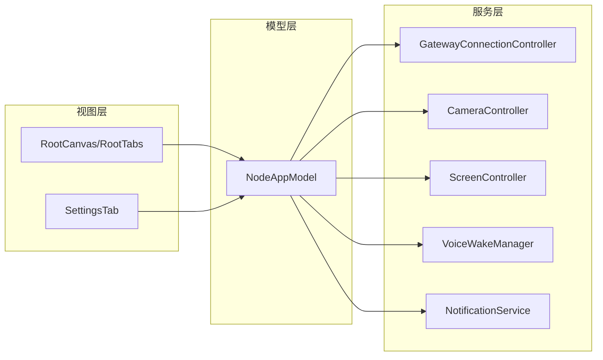

图表来源

- [RootCanvas.swift](file://apps/ios/Sources/RootCanvas.swift#L4-L107)
- [SettingsTab.swift](file://apps/ios/Sources/Settings/SettingsTab.swift#L8-L44)
- [NodeAppModel.swift](file://apps/ios/Sources/Model/NodeAppModel.swift#L42-L186)
- [GatewayConnectionController.swift](file://apps/ios/Sources/Gateway/GatewayConnectionController.swift#L18-L40)
- [CameraController.swift](file://apps/ios/Sources/Camera/CameraController.swift#L5-L37)
- [ScreenController.swift](file://apps/ios/Sources/Screen/ScreenController.swift#L8-L51)
- [VoiceWakeManager.swift](file://apps/ios/Sources/Voice/VoiceWakeManager.swift#L83-L120)
- [NotificationService.swift](file://apps/ios/Sources/Services/NotificationService.swift#L12-L58)

## 详细组件分析

### OpenClawApp 应用入口

- 职责
  - 初始化网关设置持久化、构建 NodeAppModel 与 GatewayConnectionController。
  - 注入环境变量（NodeAppModel、VoiceWakeManager、GatewayConnectionController）至根画布。
  - 处理深链入与场景状态变化（前台/后台）。
- 关键点
  - 使用 AppStorage 与环境注入简化状态传播。
  - 场景状态变更用于控制后台任务与健康监测。

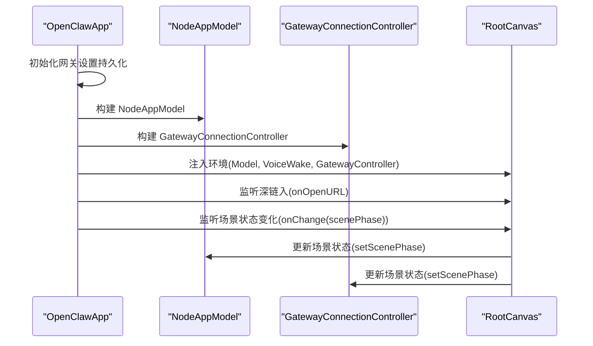

图表来源

- [OpenClawApp.swift](file://apps/ios/Sources/OpenClawApp.swift#L9-L28)
- [RootCanvas.swift](file://apps/ios/Sources/RootCanvas.swift#L67-L72)

章节来源

- [OpenClawApp.swift](file://apps/ios/Sources/OpenClawApp.swift#L9-L28)

### RootCanvas/RootTabs 主界面

- 职责
  - 展示屏幕标签页、语音标签页、设置标签页。
  - 提供状态指示器（网关连接、活动状态）、悬浮操作按钮（聊天、Talk 模式、设置）。
  - 处理深链入与 Canvas A2UI 动作回调。
- 关键点
  - 顶部状态指示器根据网关状态与活动状态动态更新。
  - 语音唤醒触发后显示 Toast 提示，自动消失。
  - 防止休眠可通过 AppStorage 控制。

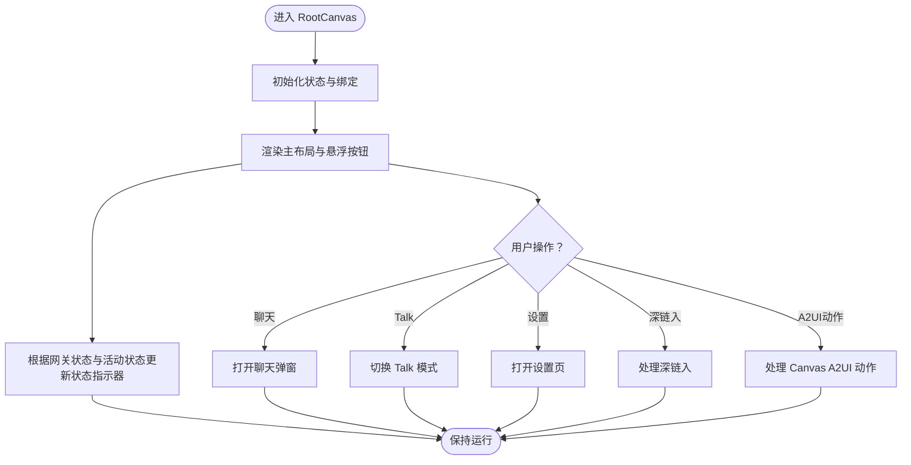

图表来源

- [RootCanvas.swift](file://apps/ios/Sources/RootCanvas.swift#L34-L107)
- [RootTabs.swift](file://apps/ios/Sources/RootTabs.swift#L12-L87)

章节来源

- [RootCanvas.swift](file://apps/ios/Sources/RootCanvas.swift#L34-L107)
- [RootTabs.swift](file://apps/ios/Sources/RootTabs.swift#L12-L87)

### NodeAppModel 应用模型

- 职责
  - 网关连接与健康监测（节点会话与操作员会话分离）。
  - 命令分发与能力路由（相机、屏幕、位置、设备、相册、联系人、日历、提醒、运动、通知、聊天推送等）。
  - Canvas/A2UI 行为处理与深链入转发。
  - Talk 模式与语音唤醒协同、后台挂起策略。
- 关键点
  - 使用 @Observable 与 @MainActor 确保主线程一致性。
  - 通过 GatewayNodeSession 发送事件与请求，订阅服务器事件进行状态同步。
  - 对后台受限命令进行保护（如 canvas/camera/screen/talk 前台限制）。

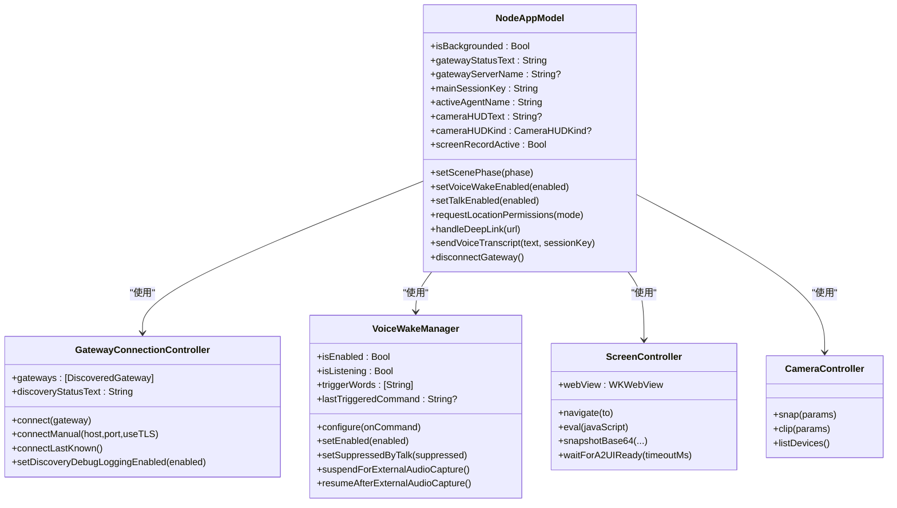

图表来源

- [NodeAppModel.swift](file://apps/ios/Sources/Model/NodeAppModel.swift#L42-L186)
- [GatewayConnectionController.swift](file://apps/ios/Sources/Gateway/GatewayConnectionController.swift#L18-L40)
- [VoiceWakeManager.swift](file://apps/ios/Sources/Voice/VoiceWakeManager.swift#L83-L120)
- [ScreenController.swift](file://apps/ios/Sources/Screen/ScreenController.swift#L8-L51)
- [CameraController.swift](file://apps/ios/Sources/Camera/CameraController.swift#L5-L37)

章节来源

- [NodeAppModel.swift](file://apps/ios/Sources/Model/NodeAppModel.swift#L42-L186)

### 相机模块 CameraController

- 职责
  - 提供拍照、拍短视频、设备列表查询。
  - 权限检查与捕获会话管理，输出转码与质量控制。
- 关键点
  - 支持前置/后置摄像头选择与设备 ID 指定。
  - 录像时可选音频输入，最终统一转码为 MP4。
  - 对参数进行边界约束（质量、时长、最大宽度）以控制负载。

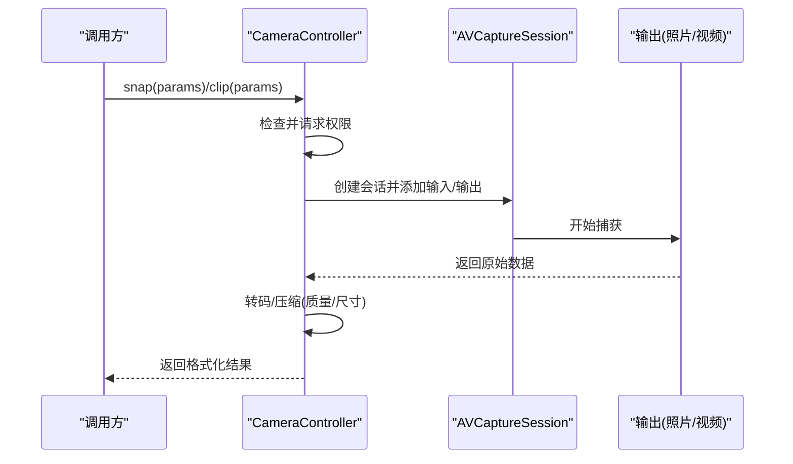

图表来源

- [CameraController.swift](file://apps/ios/Sources/Camera/CameraController.swift#L39-L190)

章节来源

- [CameraController.swift](file://apps/ios/Sources/Camera/CameraController.swift#L39-L190)

### 屏幕模块 ScreenController

- 职责
  - 承载 WKWebView，提供导航、快照、脚本执行、A2UI 动作拦截与调试状态。
  - 安全策略：仅允许受信来源（Canvas 内嵌或本地网络页面）触发 A2UI 动作。
- 关键点
  - 默认非持久化数据存储，避免本地缓存污染。
  - 支持 Canvas 调试状态注入与 A2UI 消息通道。

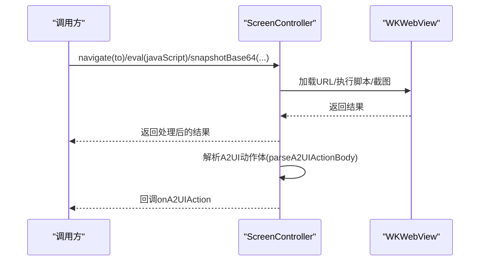

图表来源

- [ScreenController.swift](file://apps/ios/Sources/Screen/ScreenController.swift#L53-L170)
- [ScreenController.swift](file://apps/ios/Sources/Screen/ScreenController.swift#L415-L437)

章节来源

- [ScreenController.swift](file://apps/ios/Sources/Screen/ScreenController.swift#L53-L170)

### 语音模块 VoiceWakeManager

- 职责
  - 语音唤醒识别、麦克风与语音识别权限管理、音频引擎与识别任务管理。
  - 与其他音频子系统（相机录音、Talk 模式）协同，避免资源抢占。
- 关键点
  - 在后台或外部音频占用时暂停识别，恢复后自动重启。
  - 触发词匹配与去抖动策略，避免重复触发。

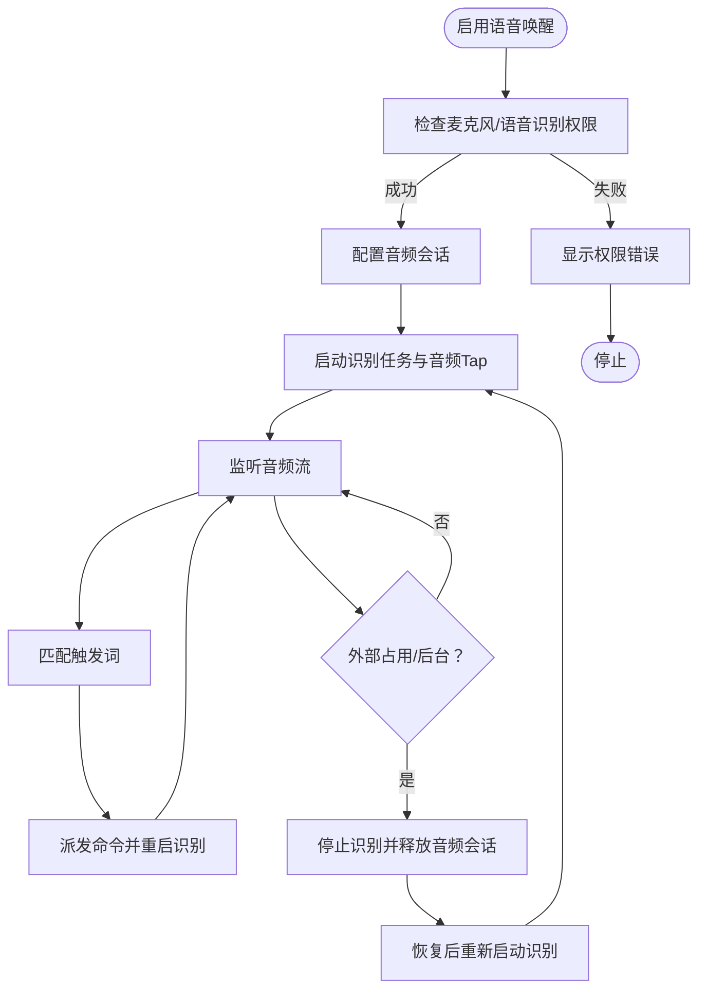

图表来源

- [VoiceWakeManager.swift](file://apps/ios/Sources/Voice/VoiceWakeManager.swift#L160-L364)
- [VoiceWakeManager.swift](file://apps/ios/Sources/Voice/VoiceWakeManager.swift#L391-L452)

章节来源

- [VoiceWakeManager.swift](file://apps/ios/Sources/Voice/VoiceWakeManager.swift#L160-L364)

### 网关模块 GatewayConnectionController

- 职责
  - 自动发现网关、解析 TLS 参数、生成连接选项与命令集、维护权限状态。
  - 根据场景状态（前台/后台）启停发现与自动重连。
- 关键点
  - 支持 mDNS/Bonjour 发现与手动连接两种模式。
  - 连接前进行可达性探测与尾网（Tailscale）校验。

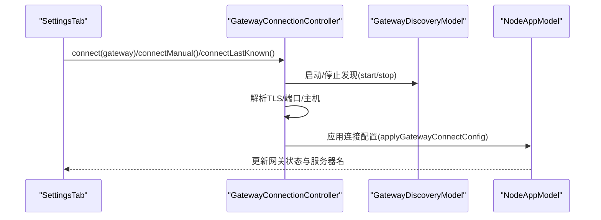

图表来源

- [GatewayConnectionController.swift](file://apps/ios/Sources/Gateway/GatewayConnectionController.swift#L59-L148)
- [GatewayConnectionController.swift](file://apps/ios/Sources/Gateway/GatewayConnectionController.swift#L173-L289)

章节来源

- [GatewayConnectionController.swift](file://apps/ios/Sources/Gateway/GatewayConnectionController.swift#L59-L148)

### 通知服务 NotificationService

- 职责
  - 抽象通知中心接口，支持授权状态查询、请求授权、添加通知。
- 关键点
  - 通过协议隔离系统实现，便于测试与替换。

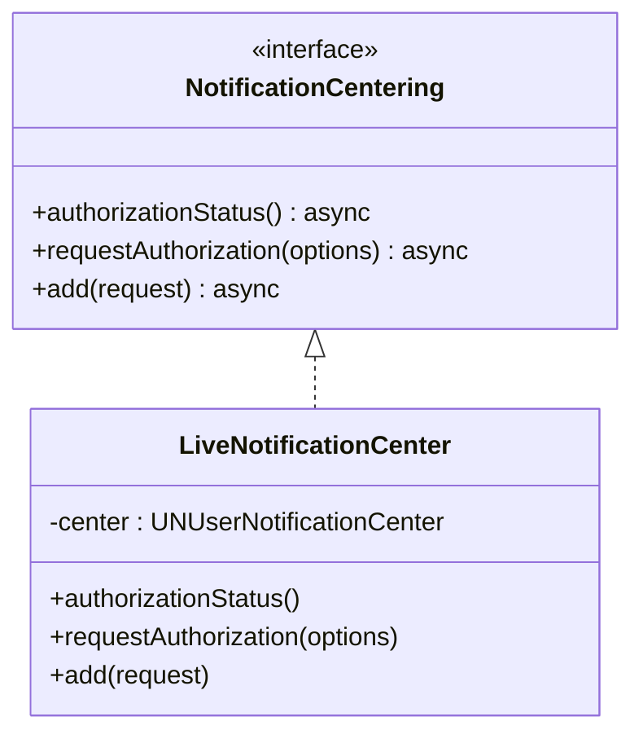

图表来源

- [NotificationService.swift](file://apps/ios/Sources/Services/NotificationService.swift#L12-L58)

章节来源

- [NotificationService.swift](file://apps/ios/Sources/Services/NotificationService.swift#L12-L58)

### 设置模块 SettingsTab

- 职责
  - 提供网关连接（自动发现/手动）、设备特性开关（相机、位置、语音唤醒、Talk 模式）、调试信息与偏好设置。
  - 支持设置码解析与预连接探测（TCP 探测）。
- 关键点
  - 使用 AppStorage 持久化用户偏好。
  - 位置权限变更即时生效并回滚不合法值。

章节来源

- [SettingsTab.swift](file://apps/ios/Sources/Settings/SettingsTab.swift#L44-L379)

## 依赖关系分析

- 组件耦合
  - RootCanvas/RootTabs 依赖 NodeAppModel 与 VoiceWakeManager 的状态与回调。
  - NodeAppModel 依赖各功能域服务（Camera、Screen、VoiceWake、Gateway、Notification 等）并通过能力路由分发命令。
  - SettingsTab 通过 GatewayConnectionController 与 NodeAppModel 协同完成连接与配置。
- 外部依赖
  - 系统框架：AVFoundation、Speech、WebKit、UserNotifications、CoreLocation、CoreMotion、Photos、Contacts、EventKit、ReplayKit 等。
  - 协议与类型：OpenClawKit/Protocol 中定义的命令、参数与消息格式。

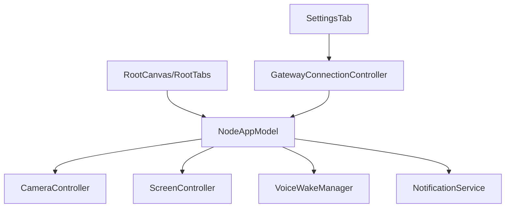

图表来源

- [RootCanvas.swift](file://apps/ios/Sources/RootCanvas.swift#L4-L107)
- [SettingsTab.swift](file://apps/ios/Sources/Settings/SettingsTab.swift#L8-L44)
- [NodeAppModel.swift](file://apps/ios/Sources/Model/NodeAppModel.swift#L42-L186)
- [GatewayConnectionController.swift](file://apps/ios/Sources/Gateway/GatewayConnectionController.swift#L18-L40)

章节来源

- [RootCanvas.swift](file://apps/ios/Sources/RootCanvas.swift#L4-L107)
- [SettingsTab.swift](file://apps/ios/Sources/Settings/SettingsTab.swift#L8-L44)
- [NodeAppModel.swift](file://apps/ios/Sources/Model/NodeAppModel.swift#L42-L186)

## 性能考虑

- 捕获与转码
  - 相机拍照与录视频均进行质量与尺寸控制，避免超大负载；默认最大宽度与质量参数已做上限约束。
- 后台策略
  - 应用进入后台时释放麦克风与停止健康监测，前台恢复后进行健康检查或必要时断开重连，避免“已连接但死”的状态。
- UI 渲染
  - RootCanvas 使用透明材料与阴影效果，注意在低端设备上的渲染开销；可通过系统深色/浅色模式影响性能。
- 网络与连接
  - 网关连接前进行 TCP 可达性探测，减少无效连接尝试；自动重连策略基于健康检查结果决定是否重建会话。

## 故障排查指南

- 无法连接网关
  - 检查设置页中的“自动连接/手动连接”与“发现日志”，确认主机、端口、TLS 与尾网状态。
  - 使用“预连接探测”确认可达性。
- 语音唤醒无响应
  - 确认麦克风与语音识别权限已授予；检查是否被相机或其他音频占用导致暂停。
  - 查看状态指示器中的权限提示与暂停原因。
- 相机/录屏异常
  - 确认相机权限与设备可用性；检查参数（时长、质量、最大宽度）是否合理。
- 通知未送达
  - 检查通知授权状态与优先级设置；确保应用处于前台或满足系统中断级别要求。

章节来源

- [SettingsTab.swift](file://apps/ios/Sources/Settings/SettingsTab.swift#L701-L758)
- [VoiceWakeManager.swift](file://apps/ios/Sources/Voice/VoiceWakeManager.swift#L160-L215)
- [CameraController.swift](file://apps/ios/Sources/Camera/CameraController.swift#L202-L221)
- [NotificationService.swift](file://apps/ios/Sources/Services/NotificationService.swift#L25-L41)

## 结论

OpenClaw iOS 应用通过清晰的模块化设计与统一的模型层，实现了对多领域功能的高效编排。RootCanvas/RootTabs 提供直观的用户界面，NodeAppModel 作为中枢协调网关、系统服务与 UI 状态，GatewayConnectionController 与 SettingsTab 则保障了连接的灵活性与可运维性。配合 iOS 特有的权限管理、后台任务与设备传感器访问，应用在功能完整性与用户体验上达到良好平衡。
