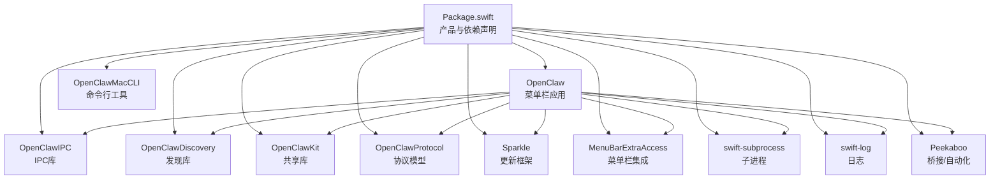
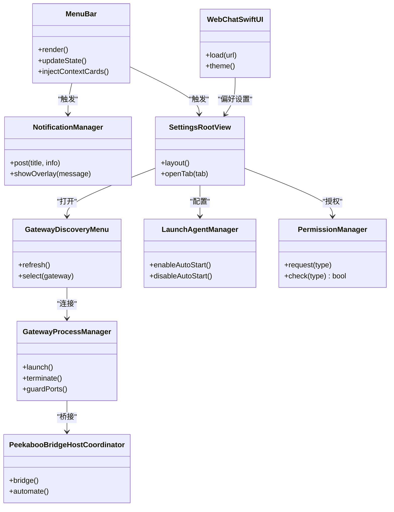
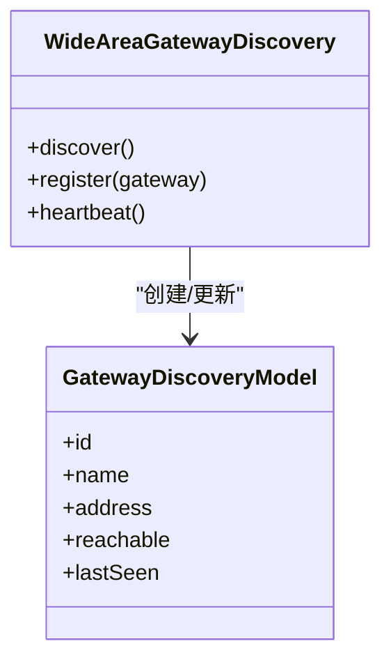
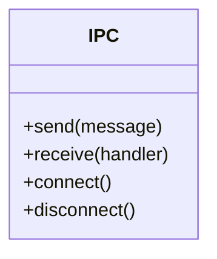
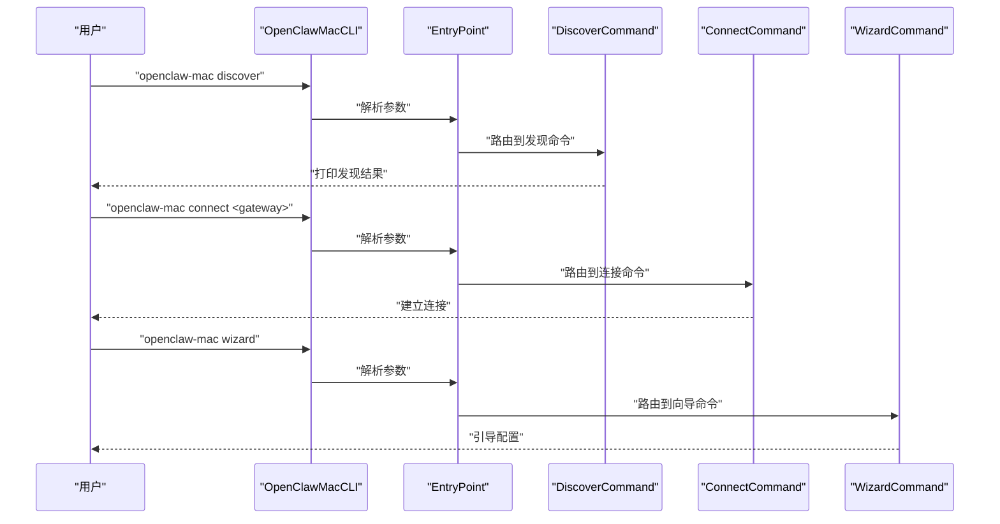
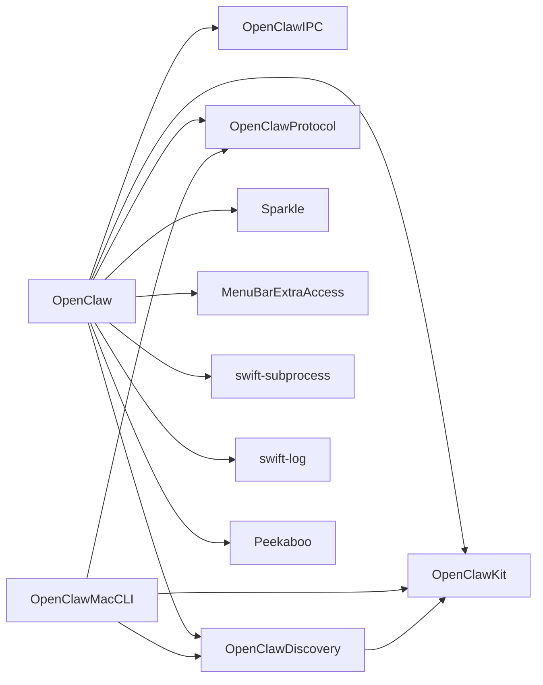

# macOS应用

<cite>
**本文引用的文件**
- [apps/macos/Package.swift](file://apps/macos/Package.swift)
- [apps/macos/Sources/OpenClaw/MenuBar.swift](file://apps/macos/Sources/OpenClaw/MenuBar.swift)
- [apps/macos/Sources/OpenClaw/NotificationManager.swift](file://apps/macos/Sources/OpenClaw/NotificationManager.swift)
- [apps/macos/Sources/OpenClaw/Resources/Info.plist](file://apps/macos/Sources/OpenClaw/Resources/Info.plist)
- [apps/macos/Sources/OpenClaw/AboutSettings.swift](file://apps/macos/Sources/OpenClaw/AboutSettings.swift)
- [apps/macos/Sources/OpenClaw/SettingsRootView.swift](file://apps/macos/Sources/OpenClaw/SettingsRootView.swift)
- [apps/macos/Sources/OpenClaw/GatewayDiscoveryMenu.swift](file://apps/macos/Sources/OpenClaw/GatewayDiscoveryMenu.swift)
- [apps/macos/Sources/OpenClaw/GatewayProcessManager.swift](file://apps/macos/Sources/OpenClaw/GatewayProcessManager.swift)
- [apps/macos/Sources/OpenClaw/LaunchAgentManager.swift](file://apps/macos/Sources/OpenClaw/LaunchAgentManager.swift)
- [apps/macos/Sources/OpenClaw/PermissionManager.swift](file://apps/macos/Sources/OpenClaw/PermissionManager.swift)
- [apps/macos/Sources/OpenClaw/PeekabooBridgeHostCoordinator.swift](file://apps/macos/Sources/OpenClaw/PeekabooBridgeHostCoordinator.swift)
- [apps/macos/Sources/OpenClaw/WebChatSwiftUI.swift](file://apps/macos/Sources/OpenClaw/WebChatSwiftUI.swift)
- [apps/macos/Sources/OpenClawMacCLI/EntryPoint.swift](file://apps/macos/Sources/OpenClawMacCLI/EntryPoint.swift)
- [apps/macos/Sources/OpenClawMacCLI/DiscoverCommand.swift](file://apps/macos/Sources/OpenClawMacCLI/DiscoverCommand.swift)
- [apps/macos/Sources/OpenClawMacCLI/ConnectCommand.swift](file://apps/macos/Sources/OpenClawMacCLI/ConnectCommand.swift)
- [apps/macos/Sources/OpenClawMacCLI/WizardCommand.swift](file://apps/macos/Sources/OpenClawMacCLI/WizardCommand.swift)
- [apps/macos/Sources/OpenClawDiscovery/GatewayDiscoveryModel.swift](file://apps/macos/Sources/OpenClawDiscovery/GatewayDiscoveryModel.swift)
- [apps/macos/Sources/OpenClawDiscovery/WideAreaGatewayDiscovery.swift](file://apps/macos/Sources/OpenClawDiscovery/WideAreaGatewayDiscovery.swift)
- [apps/macos/Sources/OpenClawIPC/IPC.swift](file://apps/macos/Sources/OpenClawIPC/IPC.swift)
- [apps/macos/Sources/OpenClawProtocol/GatewayModels.swift](file://apps/macos/Sources/OpenClawProtocol/GatewayModels.swift)
- [scripts/build_and_run_mac.sh](file://scripts/build_and_run_mac.sh)
- [scripts/package-mac-app.sh](file://scripts/package-mac-app.sh)
- [scripts/codesign-mac-app.sh](file://scripts/codesign-mac-app.sh)
- [scripts/notarize-mac-artifact.sh](file://scripts/notarize-mac-artifact.sh)
- [scripts/create-dmg.sh](file://scripts/create-dmg.sh)
- [scripts/make_appcast.sh](file://scripts/make_appcast.sh)
</cite>

## 目录

1. [简介](#简介)
2. [项目结构](#项目结构)
3. [核心组件](#核心组件)
4. [架构总览](#架构总览)
5. [详细组件分析](#详细组件分析)
6. [依赖关系分析](#依赖关系分析)
7. [性能考虑](#性能考虑)
8. [故障排除指南](#故障排除指南)
9. [结论](#结论)
10. [附录](#附录)

## 简介

本文件面向OpenClaw在macOS平台的应用架构文档，聚焦以下模块化子系统：OpenClaw主应用（菜单栏集成、通知系统、偏好设置）、OpenClawDiscovery发现服务、OpenClawIPC进程间通信库、OpenClawMacCLI命令行工具。文档将从整体架构、包管理与依赖、构建与打包流程、macOS系统集成功能（菜单栏、通知、系统偏好设置、后台服务）等方面进行深入说明，并给出可视化图示与最佳实践建议。

## 项目结构

OpenClaw macOS子项目采用Swift Package Manager组织多目标产物，包含可执行程序、库与测试目标。核心目录与产物如下：

- 可执行程序
  - OpenClaw：菜单栏应用，集成通知、偏好设置、网关连接与运行时管理
  - openclaw-mac：命令行工具，提供发现、连接与向导等CLI能力
- 库
  - OpenClawIPC：跨进程通信抽象与实现
  - OpenClawDiscovery：网关发现模型与广域发现逻辑
  - OpenClawProtocol：网关协议数据模型
- 测试
  - OpenClawIPCTests：IPC相关单元与集成测试

图表来源

- [apps/macos/Package.swift](file://apps/macos/Package.swift#L6-L92)

章节来源

- [apps/macos/Package.swift](file://apps/macos/Package.swift#L1-L93)

## 核心组件

- OpenClaw主应用
  - 菜单栏集成与上下文卡片注入
  - 通知系统与覆盖提示
  - 系统偏好设置窗口与视图
  - 网关发现、连接与进程管理
  - 后台服务与启动项管理
  - 权限管理与系统权限请求
  - Peekaboo桥接与自动化
  - Web聊天界面集成
- OpenClawDiscovery
  - 网关发现模型与广域发现实现
- OpenClawIPC
  - 进程间通信抽象与实现
- OpenClawMacCLI
  - 发现、连接与向导命令入口
- OpenClawProtocol
  - 网关协议相关数据模型

章节来源

- [apps/macos/Sources/OpenClaw/MenuBar.swift](file://apps/macos/Sources/OpenClaw/MenuBar.swift)
- [apps/macos/Sources/OpenClaw/NotificationManager.swift](file://apps/macos/Sources/OpenClaw/NotificationManager.swift)
- [apps/macos/Sources/OpenClaw/SettingsRootView.swift](file://apps/macos/Sources/OpenClaw/SettingsRootView.swift)
- [apps/macos/Sources/OpenClaw/GatewayDiscoveryMenu.swift](file://apps/macos/Sources/OpenClaw/GatewayDiscoveryMenu.swift)
- [apps/macos/Sources/OpenClaw/GatewayProcessManager.swift](file://apps/macos/Sources/OpenClaw/GatewayProcessManager.swift)
- [apps/macos/Sources/OpenClaw/LaunchAgentManager.swift](file://apps/macos/Sources/OpenClaw/LaunchAgentManager.swift)
- [apps/macos/Sources/OpenClaw/PermissionManager.swift](file://apps/macos/Sources/OpenClaw/PermissionManager.swift)
- [apps/macos/Sources/OpenClaw/PeekabooBridgeHostCoordinator.swift](file://apps/macos/Sources/OpenClaw/PeekabooBridgeHostCoordinator.swift)
- [apps/macos/Sources/OpenClaw/WebChatSwiftUI.swift](file://apps/macos/Sources/OpenClaw/WebChatSwiftUI.swift)
- [apps/macos/Sources/OpenClawDiscovery/GatewayDiscoveryModel.swift](file://apps/macos/Sources/OpenClawDiscovery/GatewayDiscoveryModel.swift)
- [apps/macos/Sources/OpenClawDiscovery/WideAreaGatewayDiscovery.swift](file://apps/macos/Sources/OpenClawDiscovery/WideAreaGatewayDiscovery.swift)
- [apps/macos/Sources/OpenClawIPC/IPC.swift](file://apps/macos/Sources/OpenClawIPC/IPC.swift)
- [apps/macos/Sources/OpenClawProtocol/GatewayModels.swift](file://apps/macos/Sources/OpenClawProtocol/GatewayModels.swift)

## 架构总览

OpenClaw macOS应用采用“菜单栏应用 + 发现服务 + IPC库 + 命令行工具”的模块化架构。主应用通过菜单栏集成用户交互，借助通知系统与覆盖提示提升可用性；通过OpenClawDiscovery与OpenClawIPC实现与本地或远程网关的连接与通信；OpenClawMacCLI提供非GUI场景下的自动化能力；OpenClawProtocol统一协议数据模型。

```mermaid
graph TB
subgraph "用户层"
menu["菜单栏"]
prefs["系统偏好设置"]
notify["通知/覆盖提示"]
webchat["Web聊天界面"]
end
subgraph "主应用"
oc_main["OpenClaw 主应用"]
disc["OpenClawDiscovery"]
ipc["OpenClawIPC"]
proto["OpenClawProtocol"]
perms["PermissionManager"]
la["LaunchAgentManager"]
ga["GatewayProcessManager"]
noti["NotificationManager"]
peek["PeekabooBridgeHostCoordinator"]
end
subgraph "外部"
sparkle["Sparkle 更新"]
menubar["MenuBarExtraAccess"]
subprocess["swift-subprocess"]
logging["swift-log"]
kit["OpenClawKit"]
end
subgraph "CLI"
cli_main["OpenClawMacCLI"]
discover["DiscoverCommand"]
connect["ConnectCommand"]
wizard["WizardCommand"]
end
menu --> oc_main
prefs --> oc_main
notify --> oc_main
webchat --> oc_main
oc_main --> disc
oc_main --> ipc
oc_main --> proto
oc_main --> perms
oc_main --> la
oc_main --> ga
oc_main --> noti
oc_main --> peek
oc_main --> sparkle
oc_main --> menubar
oc_main --> subprocess
oc_main --> logging
oc_main --> kit
cli_main --> disc
cli_main --> connect
cli_main --> wizard
cli_main --> proto
```

图表来源

- [apps/macos/Package.swift](file://apps/macos/Package.swift#L26-L78)
- [apps/macos/Sources/OpenClaw/MenuBar.swift](file://apps/macos/Sources/OpenClaw/MenuBar.swift)
- [apps/macos/Sources/OpenClaw/NotificationManager.swift](file://apps/macos/Sources/OpenClaw/NotificationManager.swift)
- [apps/macos/Sources/OpenClaw/SettingsRootView.swift](file://apps/macos/Sources/OpenClaw/SettingsRootView.swift)
- [apps/macos/Sources/OpenClaw/GatewayDiscoveryMenu.swift](file://apps/macos/Sources/OpenClaw/GatewayDiscoveryMenu.swift)
- [apps/macos/Sources/OpenClaw/GatewayProcessManager.swift](file://apps/macos/Sources/OpenClaw/GatewayProcessManager.swift)
- [apps/macos/Sources/OpenClaw/LaunchAgentManager.swift](file://apps/macos/Sources/OpenClaw/LaunchAgentManager.swift)
- [apps/macos/Sources/OpenClaw/PermissionManager.swift](file://apps/macos/Sources/OpenClaw/PermissionManager.swift)
- [apps/macos/Sources/OpenClaw/PeekabooBridgeHostCoordinator.swift](file://apps/macos/Sources/OpenClaw/PeekabooBridgeHostCoordinator.swift)
- [apps/macos/Sources/OpenClaw/WebChatSwiftUI.swift](file://apps/macos/Sources/OpenClaw/WebChatSwiftUI.swift)
- [apps/macos/Sources/OpenClawMacCLI/EntryPoint.swift](file://apps/macos/Sources/OpenClawMacCLI/EntryPoint.swift)
- [apps/macos/Sources/OpenClawMacCLI/DiscoverCommand.swift](file://apps/macos/Sources/OpenClawMacCLI/DiscoverCommand.swift)
- [apps/macos/Sources/OpenClawMacCLI/ConnectCommand.swift](file://apps/macos/Sources/OpenClawMacCLI/ConnectCommand.swift)
- [apps/macos/Sources/OpenClawMacCLI/WizardCommand.swift](file://apps/macos/Sources/OpenClawMacCLI/WizardCommand.swift)

## 详细组件分析

### OpenClaw主应用

- 菜单栏集成
  - 通过菜单栏库实现图标状态、上下文菜单与卡片注入
  - 支持会话预览、使用量显示与快捷操作
- 通知系统
  - 统一的通知管理器负责系统通知与覆盖提示
  - 支持错误、健康检查与重要事件提醒
- 系统偏好设置
  - 偏好设置窗口根视图组织各功能模块
  - 包含通用设置、通道设置、技能设置、定时任务等
- 网关发现与连接
  - 发现菜单展示本地/远程网关列表
  - 连接协调器处理连接生命周期与重连策略
- 后台服务与启动项
  - LaunchAgent管理开机自启与守护进程
  - 网关进程管理器负责启动、停止与端口占用保护
- 权限管理
  - 统一权限请求与状态检测，涵盖麦克风、摄像头、屏幕录制等
- Peekaboo桥接
  - 桥接宿主协调器负责与Peekaboo生态协作
- Web聊天界面
  - SwiftUI容器承载Web聊天UI，支持深色/浅色主题与窗口管理

图表来源

- [apps/macos/Sources/OpenClaw/MenuBar.swift](file://apps/macos/Sources/OpenClaw/MenuBar.swift)
- [apps/macos/Sources/OpenClaw/NotificationManager.swift](file://apps/macos/Sources/OpenClaw/NotificationManager.swift)
- [apps/macos/Sources/OpenClaw/SettingsRootView.swift](file://apps/macos/Sources/OpenClaw/SettingsRootView.swift)
- [apps/macos/Sources/OpenClaw/GatewayDiscoveryMenu.swift](file://apps/macos/Sources/OpenClaw/GatewayDiscoveryMenu.swift)
- [apps/macos/Sources/OpenClaw/GatewayProcessManager.swift](file://apps/macos/Sources/OpenClaw/GatewayProcessManager.swift)
- [apps/macos/Sources/OpenClaw/LaunchAgentManager.swift](file://apps/macos/Sources/OpenClaw/LaunchAgentManager.swift)
- [apps/macos/Sources/OpenClaw/PermissionManager.swift](file://apps/macos/Sources/OpenClaw/PermissionManager.swift)
- [apps/macos/Sources/OpenClaw/PeekabooBridgeHostCoordinator.swift](file://apps/macos/Sources/OpenClaw/PeekabooBridgeHostCoordinator.swift)
- [apps/macos/Sources/OpenClaw/WebChatSwiftUI.swift](file://apps/macos/Sources/OpenClaw/WebChatSwiftUI.swift)

章节来源

- [apps/macos/Sources/OpenClaw/MenuBar.swift](file://apps/macos/Sources/OpenClaw/MenuBar.swift)
- [apps/macos/Sources/OpenClaw/NotificationManager.swift](file://apps/macos/Sources/OpenClaw/NotificationManager.swift)
- [apps/macos/Sources/OpenClaw/SettingsRootView.swift](file://apps/macos/Sources/OpenClaw/SettingsRootView.swift)
- [apps/macos/Sources/OpenClaw/GatewayDiscoveryMenu.swift](file://apps/macos/Sources/OpenClaw/GatewayDiscoveryMenu.swift)
- [apps/macos/Sources/OpenClaw/GatewayProcessManager.swift](file://apps/macos/Sources/OpenClaw/GatewayProcessManager.swift)
- [apps/macos/Sources/OpenClaw/LaunchAgentManager.swift](file://apps/macos/Sources/OpenClaw/LaunchAgentManager.swift)
- [apps/macos/Sources/OpenClaw/PermissionManager.swift](file://apps/macos/Sources/OpenClaw/PermissionManager.swift)
- [apps/macos/Sources/OpenClaw/PeekabooBridgeHostCoordinator.swift](file://apps/macos/Sources/OpenClaw/PeekabooBridgeHostCoordinator.swift)
- [apps/macos/Sources/OpenClaw/WebChatSwiftUI.swift](file://apps/macos/Sources/OpenClaw/WebChatSwiftUI.swift)

### OpenClawDiscovery发现服务

- 网关发现模型
  - 定义网关实体、状态与元数据
- 广域网关发现
  - 实现跨网络的网关探测与注册

图表来源

- [apps/macos/Sources/OpenClawDiscovery/GatewayDiscoveryModel.swift](file://apps/macos/Sources/OpenClawDiscovery/GatewayDiscoveryModel.swift)
- [apps/macos/Sources/OpenClawDiscovery/WideAreaGatewayDiscovery.swift](file://apps/macos/Sources/OpenClawDiscovery/WideAreaGatewayDiscovery.swift)

章节来源

- [apps/macos/Sources/OpenClawDiscovery/GatewayDiscoveryModel.swift](file://apps/macos/Sources/OpenClawDiscovery/GatewayDiscoveryModel.swift)
- [apps/macos/Sources/OpenClawDiscovery/WideAreaGatewayDiscovery.swift](file://apps/macos/Sources/OpenClawDiscovery/WideAreaGatewayDiscovery.swift)

### OpenClawIPC进程间通信

- IPC抽象与实现
  - 提供跨进程消息传递、握手与状态同步能力

图表来源

- [apps/macos/Sources/OpenClawIPC/IPC.swift](file://apps/macos/Sources/OpenClawIPC/IPC.swift)

章节来源

- [apps/macos/Sources/OpenClawIPC/IPC.swift](file://apps/macos/Sources/OpenClawIPC/IPC.swift)

### OpenClawMacCLI命令行工具

- 入口与命令分发
  - 解析参数并路由到具体命令
- 发现命令
  - 执行网关发现与结果输出
- 连接命令
  - 建立与网关的连接
- 向导命令
  - 引导用户完成初始配置

图表来源

- [apps/macos/Sources/OpenClawMacCLI/EntryPoint.swift](file://apps/macos/Sources/OpenClawMacCLI/EntryPoint.swift)
- [apps/macos/Sources/OpenClawMacCLI/DiscoverCommand.swift](file://apps/macos/Sources/OpenClawMacCLI/DiscoverCommand.swift)
- [apps/macos/Sources/OpenClawMacCLI/ConnectCommand.swift](file://apps/macos/Sources/OpenClawMacCLI/ConnectCommand.swift)
- [apps/macos/Sources/OpenClawMacCLI/WizardCommand.swift](file://apps/macos/Sources/OpenClawMacCLI/WizardCommand.swift)

章节来源

- [apps/macos/Sources/OpenClawMacCLI/EntryPoint.swift](file://apps/macos/Sources/OpenClawMacCLI/EntryPoint.swift)
- [apps/macos/Sources/OpenClawMacCLI/DiscoverCommand.swift](file://apps/macos/Sources/OpenClawMacCLI/DiscoverCommand.swift)
- [apps/macos/Sources/OpenClawMacCLI/ConnectCommand.swift](file://apps/macos/Sources/OpenClawMacCLI/ConnectCommand.swift)
- [apps/macos/Sources/OpenClawMacCLI/WizardCommand.swift](file://apps/macos/Sources/OpenClawMacCLI/WizardCommand.swift)

### 协议模型

- 网关协议数据模型
  - 统一描述网关状态、配置与事件

章节来源

- [apps/macos/Sources/OpenClawProtocol/GatewayModels.swift](file://apps/macos/Sources/OpenClawProtocol/GatewayModels.swift)

## 依赖关系分析

- 平台与工具
  - macOS 15+，Swift 6.2
  - Sparkle：应用更新
  - MenuBarExtraAccess：菜单栏集成
  - swift-subprocess：子进程管理
  - swift-log：日志
  - Peekaboo：桥接与自动化
- 内部依赖
  - OpenClaw主应用依赖IPC、Discovery、Protocol、Kit与第三方库
  - CLI依赖Discovery与Protocol
  - Discovery依赖OpenClawKit

图表来源

- [apps/macos/Package.swift](file://apps/macos/Package.swift#L17-L56)

章节来源

- [apps/macos/Package.swift](file://apps/macos/Package.swift#L1-L93)

## 性能考虑

- 菜单栏渲染与上下文卡片注入应避免频繁刷新，建议批量更新状态
- 通知系统与覆盖提示需控制频率，防止干扰用户体验
- 发现与心跳机制应合理设置超时与重试间隔，降低网络开销
- IPC消息应尽量小而明确，避免大对象频繁传输
- 子进程管理需及时回收僵尸进程，避免资源泄漏
- Web聊天界面加载时启用懒加载与缓存策略

## 故障排除指南

- 菜单栏无响应
  - 检查菜单栏库初始化与主线程调用
  - 确认权限已授予
- 无法接收通知
  - 核对系统通知权限与应用内开关
  - 查看日志输出定位问题
- 网关连接失败
  - 使用CLI发现命令验证可达性
  - 检查防火墙与端口占用
  - 查看进程管理器日志
- 启动项无效
  - 确认LaunchAgent配置正确
  - 验证签名与权限
- IPC通信异常
  - 检查握手与消息格式
  - 关注断线重连逻辑

章节来源

- [apps/macos/Sources/OpenClaw/MenuBar.swift](file://apps/macos/Sources/OpenClaw/MenuBar.swift)
- [apps/macos/Sources/OpenClaw/NotificationManager.swift](file://apps/macos/Sources/OpenClaw/NotificationManager.swift)
- [apps/macos/Sources/OpenClaw/GatewayDiscoveryMenu.swift](file://apps/macos/Sources/OpenClaw/GatewayDiscoveryMenu.swift)
- [apps/macos/Sources/OpenClaw/GatewayProcessManager.swift](file://apps/macos/Sources/OpenClaw/GatewayProcessManager.swift)
- [apps/macos/Sources/OpenClaw/LaunchAgentManager.swift](file://apps/macos/Sources/OpenClaw/LaunchAgentManager.swift)

## 结论

OpenClaw macOS应用以模块化设计为核心，通过菜单栏应用、发现服务、IPC库与CLI工具形成完整的系统闭环。借助Sparkle、MenuBarExtraAccess、swift-subprocess、swift-log与Peekaboo等成熟组件，应用在功能完整性与可维护性上取得平衡。建议持续优化IPC与发现机制的性能，完善权限与启动项的自动化配置，进一步提升用户体验与稳定性。

## 附录

### 包管理与构建流程

- 包定义与产品
  - 产品包括OpenClawIPC库、OpenClawDiscovery库、OpenClaw主应用与openclaw-mac CLI
  - 平台要求macOS 15+
- 依赖声明
  - 外部依赖：Sparkle、MenuBarExtraAccess、swift-subprocess、swift-log、Peekaboo、OpenClawKit、Swabble
- 资源与图标
  - 主应用复制OpenClaw.icns与设备模型资源
- 构建脚本
  - 构建与运行：用于本地开发调试
  - 打包：生成.app与.dmg分发包
  - 代码签名：对.app进行签名
  - 服务器公证：提交Apple公证
  - 更新通道：生成appcast与发布渠道

章节来源

- [apps/macos/Package.swift](file://apps/macos/Package.swift#L6-L92)
- [scripts/build_and_run_mac.sh](file://scripts/build_and_run_mac.sh)
- [scripts/package-mac-app.sh](file://scripts/package-mac-app.sh)
- [scripts/codesign-mac-app.sh](file://scripts/codesign-mac-app.sh)
- [scripts/notarize-mac-artifact.sh](file://scripts/notarize-mac-artifact.sh)
- [scripts/create-dmg.sh](file://scripts/create-dmg.sh)
- [scripts/make_appcast.sh](file://scripts/make_appcast.sh)

### macOS系统集成要点

- 菜单栏集成
  - 使用菜单栏库实现图标、状态与上下文菜单
- 通知系统
  - 使用系统通知与覆盖提示，确保关键信息及时传达
- 系统偏好设置
  - 通过窗口与视图组织设置项，提供直观的配置体验
- 后台服务
  - 通过LaunchAgent与进程管理器实现开机自启与守护
- 权限管理
  - 针对麦克风、摄像头、屏幕录制等权限进行请求与检测
- 快捷键与系统事件
  - 可结合系统快捷键与事件响应扩展功能（建议在后续版本中完善）
- Info.plist与沙盒
  - 通过Info.plist声明权限与特性，遵循沙盒限制与安全最佳实践

章节来源

- [apps/macos/Sources/OpenClaw/Resources/Info.plist](file://apps/macos/Sources/OpenClaw/Resources/Info.plist)
- [apps/macos/Sources/OpenClaw/MenuBar.swift](file://apps/macos/Sources/OpenClaw/MenuBar.swift)
- [apps/macos/Sources/OpenClaw/NotificationManager.swift](file://apps/macos/Sources/OpenClaw/NotificationManager.swift)
- [apps/macos/Sources/OpenClaw/SettingsRootView.swift](file://apps/macos/Sources/OpenClaw/SettingsRootView.swift)
- [apps/macos/Sources/OpenClaw/LaunchAgentManager.swift](file://apps/macos/Sources/OpenClaw/LaunchAgentManager.swift)
- [apps/macos/Sources/OpenClaw/PermissionManager.swift](file://apps/macos/Sources/OpenClaw/PermissionManager.swift)
