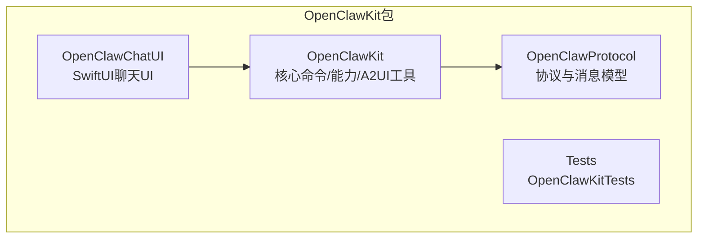
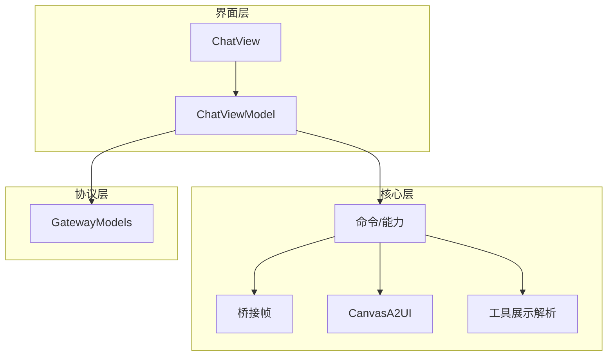
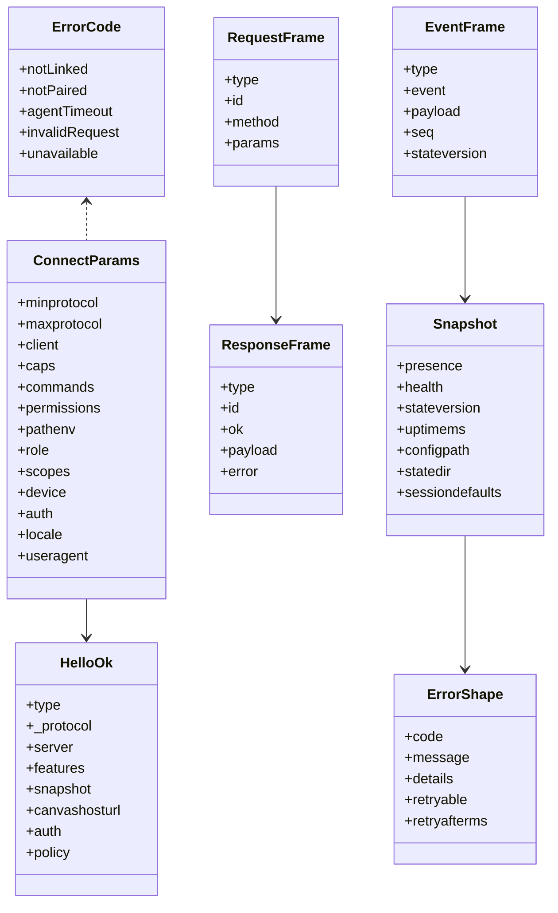
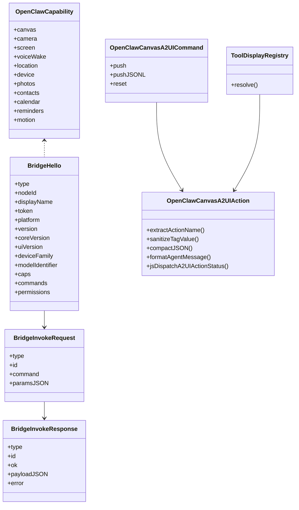
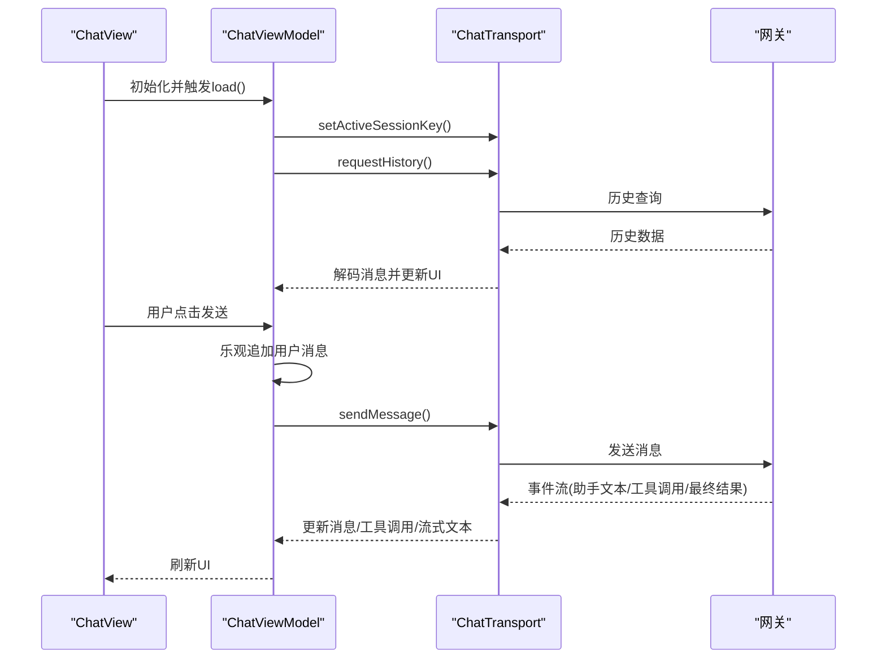
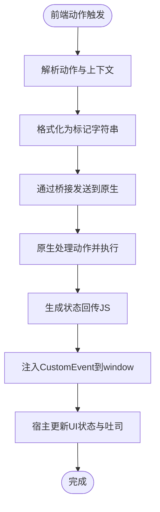
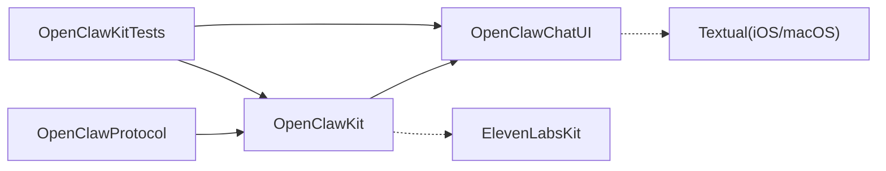

# 共享OpenClawKit模块

<cite>
**本文引用的文件**
- [apps/shared/OpenClawKit/Package.swift](file://apps/shared/OpenClawKit/Package.swift)
- [apps/shared/OpenClawKit/Sources/OpenClawProtocol/GatewayModels.swift](file://apps/shared/OpenClawKit/Sources/OpenClawProtocol/GatewayModels.swift)
- [apps/shared/OpenClawKit/Sources/OpenClawKit/Capabilities.swift](file://apps/shared/OpenClawKit/Sources/OpenClawKit/Capabilities.swift)
- [apps/shared/OpenClawKit/Sources/OpenClawKit/BridgeFrames.swift](file://apps/shared/OpenClawKit/Sources/OpenClawKit/BridgeFrames.swift)
- [apps/shared/OpenClawKit/Sources/OpenClawKit/ChatCommands.swift](file://apps/shared/OpenClawKit/Sources/OpenClawKit/ChatCommands.swift)
- [apps/shared/OpenClawKit/Sources/OpenClawKit/CanvasA2UIAction.swift](file://apps/shared/OpenClawKit/Sources/OpenClawKit/CanvasA2UIAction.swift)
- [apps/shared/OpenClawKit/Sources/OpenClawKit/CanvasA2UICommands.swift](file://apps/shared/OpenClawKit/Sources/OpenClawKit/CanvasA2UICommands.swift)
- [apps/shared/OpenClawKit/Sources/OpenClawKit/ToolDisplay.swift](file://apps/shared/OpenClawKit/Sources/OpenClawKit/ToolDisplay.swift)
- [apps/shared/OpenClawKit/Sources/OpenClawChatUI/ChatView.swift](file://apps/shared/OpenClawKit/Sources/OpenClawChatUI/ChatView.swift)
- [apps/shared/OpenClawKit/Sources/OpenClawChatUI/ChatViewModel.swift](file://apps/shared/OpenClawKit/Sources/OpenClawChatUI/ChatViewModel.swift)
- [apps/shared/OpenClawKit/Sources/OpenClawChatUI/ChatModels.swift](file://apps/shared/OpenClawKit/Sources/OpenClawChatUI/ChatModels.swift)
- [apps/shared/OpenClawKit/Sources/OpenClawChatUI/ChatTransport.swift](file://apps/shared/OpenClawKit/Sources/OpenClawChatUI/ChatTransport.swift)
- [apps/shared/OpenClawKit/Sources/OpenClawChatUI/ChatPayloadDecoding.swift](file://apps/shared/OpenClawKit/Sources/OpenClawChatUI/ChatPayloadDecoding.swift)
- [apps/shared/OpenClawKit/Sources/OpenClawChatUI/ChatSessions.swift](file://apps/shared/OpenClawKit/Sources/OpenClawChatUI/ChatSessions.swift)
- [apps/shared/OpenClawKit/Sources/OpenClawChatUI/ChatSheets.swift](file://apps/shared/OpenClawKit/Sources/OpenClawChatUI/ChatSheets.swift)
- [apps/shared/OpenClawKit/Sources/OpenClawChatUI/ChatTheme.swift](file://apps/shared/OpenClawKit/Sources/OpenClawChatUI/ChatTheme.swift)
- [apps/shared/OpenClawKit/Sources/OpenClawChatUI/ChatView.swift](file://apps/shared/OpenClawKit/Sources/OpenClawChatUI/ChatView.swift)
- [apps/shared/OpenClawKit/Sources/OpenClawChatUI/ChatViewModel.swift](file://apps/shared/OpenClawKit/Sources/OpenClawChatUI/ChatViewModel.swift)
- [apps/shared/OpenClawKit/Sources/OpenClawChatUI/ChatMessageViews.swift](file://apps/shared/OpenClawKit/Sources/OpenClawChatUI/ChatMessageViews.swift)
- [apps/shared/OpenClawKit/Sources/OpenClawChatUI/ChatMarkdownPreprocessor.swift](file://apps/shared/OpenClawKit/Sources/OpenClawChatUI/ChatMarkdownPreprocessor.swift)
- [apps/shared/OpenClawKit/Sources/OpenClawChatUI/ChatMarkdownRenderer.swift](file://apps/shared/OpenClawKit/Sources/OpenClawChatUI/ChatMarkdownRenderer.swift)
- [apps/shared/OpenClawKit/Sources/OpenClawChatUI/AssistantTextParser.swift](file://apps/shared/OpenClawKit/Sources/OpenClawChatUI/AssistantTextParser.swift)
- [apps/shared/OpenClawKit/Sources/OpenClawChatUI/ChatComposer.swift](file://apps/shared/OpenClawKit/Sources/OpenClawChatUI/ChatComposer.swift)
- [apps/shared/OpenClawKit/Sources/OpenClawChatUI/ChatTransport.swift](file://apps/shared/OpenClawKit/Sources/OpenClawChatUI/ChatTransport.swift)
- [apps/shared/OpenClawKit/Sources/OpenClawChatUI/ChatView.swift](file://apps/shared/OpenClawKit/Sources/OpenClawChatUI/ChatView.swift)
- [apps/shared/OpenClawKit/Sources/OpenClawChatUI/ChatViewModel.swift](file://apps/shared/OpenClawKit/Sources/OpenClawChatUI/ChatViewModel.swift)
- [apps/shared/OpenClawKit/Sources/OpenClawChatUI/ChatModels.swift](file://apps/shared/OpenClawKit/Sources/OpenClawChatUI/ChatModels.swift)
- [apps/shared/OpenClawKit/Sources/OpenClawChatUI/ChatPayloadDecoding.swift](file://apps/shared/OpenClawKit/Sources/OpenClawChatUI/ChatPayloadDecoding.swift)
- [apps/shared/OpenClawKit/Sources/OpenClawChatUI/ChatSessions.swift](file://apps/shared/OpenClawKit/Sources/OpenClawChatUI/ChatSessions.swift)
- [apps/shared/OpenClawKit/Sources/OpenClawChatUI/ChatSheets.swift](file://apps/shared/OpenClawKit/Sources/OpenClawChatUI/ChatSheets.swift)
- [apps/shared/OpenClawKit/Sources/OpenClawChatUI/ChatTheme.swift](file://apps/shared/OpenClawKit/Sources/OpenClawChatUI/ChatTheme.swift)
- [apps/shared/OpenClawKit/Sources/OpenClawChatUI/ChatView.swift](file://apps/shared/OpenClawKit/Sources/OpenClawChatUI/ChatView.swift)
- [apps/shared/OpenClawKit/Sources/OpenClawChatUI/ChatViewModel.swift](file://apps/shared/OpenClawKit/Sources/OpenClawChatUI/ChatViewModel.swift)
- [apps/shared/OpenClawKit/Sources/OpenClawChatUI/ChatMessageViews.swift](file://apps/shared/OpenClawKit/Sources/OpenClawChatUI/ChatMessageViews.swift)
- [apps/shared/OpenClawKit/Sources/OpenClawChatUI/ChatMarkdownPreprocessor.swift](file://apps/shared/OpenClawKit/Sources/OpenClawChatUI/ChatMarkdownPreprocessor.swift)
- [apps/shared/OpenClawKit/Sources/OpenClawChatUI/ChatMarkdownRenderer.swift](file://apps/shared/OpenClawKit/Sources/OpenClawChatUI/ChatMarkdownRenderer.swift)
- [apps/shared/OpenClawKit/Sources/OpenClawChatUI/AssistantTextParser.swift](file://apps/shared/OpenClawKit/Sources/OpenClawChatUI/AssistantTextParser.swift)
- [apps/shared/OpenClawKit/Sources/OpenClawChatUI/ChatComposer.swift](file://apps/shared/OpenClawKit/Sources/OpenClawChatUI/ChatComposer.swift)
- [apps/shared/OpenClawKit/Sources/OpenClawChatUI/ChatTransport.swift](file://apps/shared/OpenClawKit/Sources/OpenClawChatUI/ChatTransport.swift)
- [apps/shared/OpenClawKit/Sources/OpenClawChatUI/ChatView.swift](file://apps/shared/OpenClawKit/Sources/OpenClawChatUI/ChatView.swift)
- [apps/shared/OpenClawKit/Sources/OpenClawChatUI/ChatViewModel.swift](file://apps/shared/OpenClawKit/Sources/OpenClawChatUI/ChatViewModel.swift)
- [apps/shared/OpenClawKit/Sources/OpenClawChatUI/ChatModels.swift](file://apps/shared/OpenClawKit/Sources/OpenClawChatUI/ChatModels.swift)
- [apps/shared/OpenClawKit/Sources/OpenClawChatUI/ChatPayloadDecoding.swift](file://apps/shared/OpenClawKit/Sources/OpenClawChatUI/ChatPayloadDecoding.swift)
- [apps/shared/OpenClawKit/Sources/OpenClawChatUI/ChatSessions.swift](file://apps/shared/OpenClawKit/Sources/OpenClawChatUI/ChatSessions.swift)
- [apps/shared/OpenClawKit/Sources/OpenClawChatUI/ChatSheets.swift](file://apps/shared/OpenClawKit/Sources/OpenClawChatUI/ChatSheets.swift)
- [apps/shared/OpenClawKit/Sources/OpenClawChatUI/ChatTheme.swift](file://apps/shared/OpenClawKit/Sources/OpenClawChatUI/ChatTheme.swift)
- [apps/shared/OpenClawKit/Sources/OpenClawChatUI/ChatView.swift](file://apps/shared/OpenClawKit/Sources/OpenClawChatUI/ChatView.swift)
- [apps/shared/OpenClawKit/Sources/OpenClawChatUI/ChatViewModel.swift](file://apps/shared/OpenClawKit/Sources/OpenClawChatUI/ChatViewModel.swift)
- [apps/shared/OpenClawKit/Sources/OpenClawChatUI/ChatMessageViews.swift](file://apps/shared/OpenClawKit/Sources/OpenClawChatUI/ChatMessageViews.swift)
- [apps/shared/OpenClawKit/Sources/OpenClawChatUI/ChatMarkdownPreprocessor.swift](file://apps/shared/OpenClawKit/Sources/OpenClawChatUI/ChatMarkdownPreprocessor.swift)
- [apps/shared/OpenClawKit/Sources/OpenClawChatUI/ChatMarkdownRenderer.swift](file://apps/shared/OpenClawKit/Sources/OpenClawChatUI/ChatMarkdownRenderer.swift)
- [apps/shared/OpenClawKit/Sources/OpenClawChatUI/AssistantTextParser.swift](file://apps/shared/OpenClawKit/Sources/OpenClawChatUI/AssistantTextParser.swift)
- [apps/shared/OpenClawKit/Sources/OpenClawChatUI/ChatComposer.swift](file://apps/shared/OpenClawKit/Sources/OpenClawChatUI/ChatComposer.swift)
- [apps/shared/OpenClawKit/Sources/OpenClawChatUI/ChatTransport.swift](file://apps/shared/OpenClawKit/Sources/OpenClawChatUI/ChatTransport.swift)
- [apps/shared/OpenClawKit/Tools/CanvasA2UI/bootstrap.js](file://apps/shared/OpenClawKit/Tools/CanvasA2UI/bootstrap.js)
- [apps/shared/OpenClawKit/Sources/OpenClawKit/Resources/tool-display.json](file://apps/shared/OpenClawKit/Sources/OpenClawKit/Resources/tool-display.json)
</cite>

## 目录

1. [引言](#引言)
2. [项目结构](#项目结构)
3. [核心组件](#核心组件)
4. [架构总览](#架构总览)
5. [详细组件分析](#详细组件分析)
6. [依赖关系分析](#依赖关系分析)
7. [性能考虑](#性能考虑)
8. [故障排查指南](#故障排查指南)
9. [结论](#结论)
10. [附录](#附录)

## 引言

本文件面向希望在多平台（iOS、macOS）上共享与复用OpenClawKit模块的开发者，系统化阐述OpenClawKit的设计目标、跨平台代码复用策略、模块间依赖关系与接口契约，并聚焦以下主题：

- OpenClawChatUI聊天界面组件：SwiftUI视图层、状态管理与事件处理机制
- OpenClawKit核心功能模块：协议桥接、命令体系、能力枚举、A2UI集成
- OpenClawProtocol协议定义：消息帧、参数模型、错误与健康检查
- CanvasA2UI工具的集成与使用：跨平台渲染、动作分发与平台适配
- 构建配置、测试策略与版本管理方案
- 跨平台代码复用与平台特定功能的适配方案

## 项目结构

OpenClawKit以Swift Package形式组织，采用“按产品库划分”的目标结构，分别导出三个库：OpenClawProtocol、OpenClawKit与OpenClawChatUI。其核心目录如下：

- Sources/OpenClawProtocol：协议与消息模型（严格并发启用）
- Sources/OpenClawKit：核心能力与命令、资源、A2UI相关工具
- Sources/OpenClawChatUI：SwiftUI聊天UI组件与视图模型
- Tools/CanvasA2UI：前端A2UI宿主与样式脚本
- Tests/OpenClawKitTests：单元测试目标

图表来源

- [apps/shared/OpenClawKit/Package.swift](file://apps/shared/OpenClawKit/Package.swift#L11-L15)
- [apps/shared/OpenClawKit/Package.swift](file://apps/shared/OpenClawKit/Package.swift#L20-L52)

章节来源

- [apps/shared/OpenClawKit/Package.swift](file://apps/shared/OpenClawKit/Package.swift#L1-L62)

## 核心组件

- OpenClawProtocol：定义网关协议版本、错误码、连接参数、请求/响应/事件帧、快照与状态版本等核心数据结构，确保跨端一致的通信语义。
- OpenClawKit：提供命令体系（如聊天推送、A2UI操作）、能力枚举（如画布、相机、屏幕、语音唤醒等）、资源加载（工具展示配置）、桥接帧（hello/pair/事件/调用等）与工具显示摘要解析。
- OpenClawChatUI：基于SwiftUI的聊天界面，包含视图、视图模型、会话管理、Markdown预处理与渲染、主题与样式、消息内容解析与流式助手文本处理。

章节来源

- [apps/shared/OpenClawKit/Sources/OpenClawProtocol/GatewayModels.swift](file://apps/shared/OpenClawKit/Sources/OpenClawProtocol/GatewayModels.swift#L1-L800)
- [apps/shared/OpenClawKit/Sources/OpenClawKit/Capabilities.swift](file://apps/shared/OpenClawKit/Sources/OpenClawKit/Capabilities.swift#L1-L16)
- [apps/shared/OpenClawKit/Sources/OpenClawKit/BridgeFrames.swift](file://apps/shared/OpenClawKit/Sources/OpenClawKit/BridgeFrames.swift#L1-L262)
- [apps/shared/OpenClawKit/Sources/OpenClawKit/ChatCommands.swift](file://apps/shared/OpenClawKit/Sources/OpenClawKit/ChatCommands.swift#L1-L24)
- [apps/shared/OpenClawKit/Sources/OpenClawKit/CanvasA2UIAction.swift](file://apps/shared/OpenClawKit/Sources/OpenClawKit/CanvasA2UIAction.swift#L1-L105)
- [apps/shared/OpenClawKit/Sources/OpenClawKit/CanvasA2UICommands.swift](file://apps/shared/OpenClawKit/Sources/OpenClawKit/CanvasA2UICommands.swift#L1-L27)
- [apps/shared/OpenClawKit/Sources/OpenClawChatUI/ChatView.swift](file://apps/shared/OpenClawKit/Sources/OpenClawChatUI/ChatView.swift#L1-L508)
- [apps/shared/OpenClawKit/Sources/OpenClawChatUI/ChatViewModel.swift](file://apps/shared/OpenClawKit/Sources/OpenClawChatUI/ChatViewModel.swift#L1-L555)

## 架构总览

OpenClawKit通过三层协作实现跨平台统一体验：

- 协议层（OpenClawProtocol）：定义消息帧与参数模型，保证客户端与网关之间的稳定契约
- 核心层（OpenClawKit）：封装命令、能力、桥接帧与A2UI工具，提供资源与工具展示解析
- 界面层（OpenClawChatUI）：SwiftUI视图与视图模型，负责状态管理、事件处理与用户交互

图表来源

- [apps/shared/OpenClawKit/Sources/OpenClawChatUI/ChatView.swift](file://apps/shared/OpenClawKit/Sources/OpenClawChatUI/ChatView.swift#L4-L56)
- [apps/shared/OpenClawKit/Sources/OpenClawChatUI/ChatViewModel.swift](file://apps/shared/OpenClawKit/Sources/OpenClawChatUI/ChatViewModel.swift#L15-L69)
- [apps/shared/OpenClawKit/Sources/OpenClawProtocol/GatewayModels.swift](file://apps/shared/OpenClawKit/Sources/OpenClawProtocol/GatewayModels.swift#L5-L115)
- [apps/shared/OpenClawKit/Sources/OpenClawKit/BridgeFrames.swift](file://apps/shared/OpenClawKit/Sources/OpenClawKit/BridgeFrames.swift#L3-L122)
- [apps/shared/OpenClawKit/Sources/OpenClawKit/CanvasA2UIAction.swift](file://apps/shared/OpenClawKit/Sources/OpenClawKit/CanvasA2UIAction.swift#L3-L81)
- [apps/shared/OpenClawKit/Sources/OpenClawKit/ToolDisplay.swift](file://apps/shared/OpenClawKit/Sources/OpenClawKit/ToolDisplay.swift#L26-L90)

## 详细组件分析

### OpenClawProtocol：协议与消息模型

- 协议版本常量与错误码：统一错误语义，便于跨端一致处理
- 连接参数（ConnectParams）：支持最小/最大协议版本、客户端信息、能力列表、命令列表、权限、设备与认证等
- HelloOk：握手成功后的服务器信息、特性、快照、画布主机URL与策略
- 请求/响应/事件帧：统一的类型、ID、方法与载荷结构，支持错误字段
- 快照与状态版本：包含在线节点、健康状态、状态版本号与运行时长等
- 错误形状：包含可重试标志与重试间隔
- 代理事件与聊天/代理参数：用于消息推送、轮询、代理调用与身份参数

图表来源

- [apps/shared/OpenClawKit/Sources/OpenClawProtocol/GatewayModels.swift](file://apps/shared/OpenClawKit/Sources/OpenClawProtocol/GatewayModels.swift#L5-L115)
- [apps/shared/OpenClawKit/Sources/OpenClawProtocol/GatewayModels.swift](file://apps/shared/OpenClawKit/Sources/OpenClawProtocol/GatewayModels.swift#L117-L198)
- [apps/shared/OpenClawKit/Sources/OpenClawProtocol/GatewayModels.swift](file://apps/shared/OpenClawKit/Sources/OpenClawProtocol/GatewayModels.swift#L290-L325)
- [apps/shared/OpenClawKit/Sources/OpenClawProtocol/GatewayModels.swift](file://apps/shared/OpenClawKit/Sources/OpenClawProtocol/GatewayModels.swift#L327-L354)

章节来源

- [apps/shared/OpenClawKit/Sources/OpenClawProtocol/GatewayModels.swift](file://apps/shared/OpenClawKit/Sources/OpenClawProtocol/GatewayModels.swift#L1-L800)

### OpenClawKit：核心功能与A2UI工具

- 能力枚举：涵盖画布、相机、屏幕、语音唤醒、位置、设备、相册、联系人、日历、提醒、运动等
- 桥接帧：Hello/Pair/Invoke/RPC/事件/心跳/错误等帧结构，支持双向通信
- 聊天命令：chat.push推送文本与可选朗读
- A2UI命令与动作：canvas.a2ui.push/reset与动作格式化、上下文JSON序列化、状态回传JS注入
- 工具展示解析：从工具名与参数解析出展示摘要（表情、标题、标签、动词、详情）

图表来源

- [apps/shared/OpenClawKit/Sources/OpenClawKit/Capabilities.swift](file://apps/shared/OpenClawKit/Sources/OpenClawKit/Capabilities.swift#L3-L15)
- [apps/shared/OpenClawKit/Sources/OpenClawKit/BridgeFrames.swift](file://apps/shared/OpenClawKit/Sources/OpenClawKit/BridgeFrames.swift#L59-L122)
- [apps/shared/OpenClawKit/Sources/OpenClawKit/BridgeFrames.swift](file://apps/shared/OpenClawKit/Sources/OpenClawKit/BridgeFrames.swift#L11-L45)
- [apps/shared/OpenClawKit/Sources/OpenClawKit/CanvasA2UICommands.swift](file://apps/shared/OpenClawKit/Sources/OpenClawKit/CanvasA2UICommands.swift#L3-L10)
- [apps/shared/OpenClawKit/Sources/OpenClawKit/CanvasA2UIAction.swift](file://apps/shared/OpenClawKit/Sources/OpenClawKit/CanvasA2UIAction.swift#L3-L81)
- [apps/shared/OpenClawKit/Sources/OpenClawKit/ToolDisplay.swift](file://apps/shared/OpenClawKit/Sources/OpenClawKit/ToolDisplay.swift#L26-L90)

章节来源

- [apps/shared/OpenClawKit/Sources/OpenClawKit/Capabilities.swift](file://apps/shared/OpenClawKit/Sources/OpenClawKit/Capabilities.swift#L1-L16)
- [apps/shared/OpenClawKit/Sources/OpenClawKit/BridgeFrames.swift](file://apps/shared/OpenClawKit/Sources/OpenClawKit/BridgeFrames.swift#L1-L262)
- [apps/shared/OpenClawKit/Sources/OpenClawKit/ChatCommands.swift](file://apps/shared/OpenClawKit/Sources/OpenClawKit/ChatCommands.swift#L1-L24)
- [apps/shared/OpenClawKit/Sources/OpenClawKit/CanvasA2UIAction.swift](file://apps/shared/OpenClawKit/Sources/OpenClawKit/CanvasA2UIAction.swift#L1-L105)
- [apps/shared/OpenClawKit/Sources/OpenClawKit/CanvasA2UICommands.swift](file://apps/shared/OpenClawKit/Sources/OpenClawKit/CanvasA2UICommands.swift#L1-L27)
- [apps/shared/OpenClawKit/Sources/OpenClawKit/ToolDisplay.swift](file://apps/shared/OpenClawKit/Sources/OpenClawKit/ToolDisplay.swift#L1-L266)

### OpenClawChatUI：SwiftUI聊天界面与状态管理

- 视图层（OpenClawChatView）：根据平台（macOS/iOS）调整布局与间距；支持标准与引导样式；内置消息列表、输入框、会话切换器与空态提示
- 视图模型（OpenClawChatViewModel）：@Observable状态管理，负责历史拉取、发送、中止、会话切换、工具调用跟踪、健康检查轮询与超时控制
- 事件处理：监听传输事件流，更新消息、工具调用与流式助手文本；对错误进行分类与提示
- Markdown与主题：预处理与渲染、主题卡片与通知样式
- 附件上传：图片类型校验、大小限制与预览生成

图表来源

- [apps/shared/OpenClawKit/Sources/OpenClawChatUI/ChatView.swift](file://apps/shared/OpenClawKit/Sources/OpenClawChatUI/ChatView.swift#L58-L87)
- [apps/shared/OpenClawKit/Sources/OpenClawChatUI/ChatViewModel.swift](file://apps/shared/OpenClawKit/Sources/OpenClawChatUI/ChatViewModel.swift#L78-L181)
- [apps/shared/OpenClawKit/Sources/OpenClawChatUI/ChatViewModel.swift](file://apps/shared/OpenClawKit/Sources/OpenClawChatUI/ChatViewModel.swift#L216-L300)
- [apps/shared/OpenClawKit/Sources/OpenClawChatUI/ChatViewModel.swift](file://apps/shared/OpenClawKit/Sources/OpenClawChatUI/ChatViewModel.swift#L357-L451)

章节来源

- [apps/shared/OpenClawKit/Sources/OpenClawChatUI/ChatView.swift](file://apps/shared/OpenClawKit/Sources/OpenClawChatUI/ChatView.swift#L1-L508)
- [apps/shared/OpenClawKit/Sources/OpenClawChatUI/ChatViewModel.swift](file://apps/shared/OpenClawKit/Sources/OpenClawChatUI/ChatViewModel.swift#L1-L555)

### CanvasA2UI工具集成与使用

- 前端宿主（bootstrap.js）：定义自定义元素openclaw-a2ui-host，处理A2UI消息、动作事件、状态与吐司提示，暴露applyMessages与reset接口
- 动作格式化：将动作名称、会话、组件与上下文规范化为字符串标记，便于后端识别
- JS状态回传：通过CustomEvent向窗口广播动作状态，供宿主更新UI
- 平台适配：iOS通过WKScriptMessageHandler接收动作；Android通过JS接口接收字符串对象；Canvas宿主验证A2UI v0.8消息格式

图表来源

- [apps/shared/OpenClawKit/Sources/OpenClawKit/CanvasA2UIAction.swift](file://apps/shared/OpenClawKit/Sources/OpenClawKit/CanvasA2UIAction.swift#L69-L103)
- [apps/shared/OpenClawKit/Tools/CanvasA2UI/bootstrap.js](file://apps/shared/OpenClawKit/Tools/CanvasA2UI/bootstrap.js#L333-L422)
- [apps/shared/OpenClawKit/Tools/CanvasA2UI/bootstrap.js](file://apps/shared/OpenClawKit/Tools/CanvasA2UI/bootstrap.js#L424-L444)

章节来源

- [apps/shared/OpenClawKit/Sources/OpenClawKit/CanvasA2UIAction.swift](file://apps/shared/OpenClawKit/Sources/OpenClawKit/CanvasA2UIAction.swift#L1-L105)
- [apps/shared/OpenClawKit/Tools/CanvasA2UI/bootstrap.js](file://apps/shared/OpenClawKit/Tools/CanvasA2UI/bootstrap.js#L1-L491)

## 依赖关系分析

- OpenClawChatUI依赖OpenClawKit（命令、传输、主题、Markdown等），并通过资源加载工具展示配置
- OpenClawKit依赖OpenClawProtocol（消息模型与错误定义），并引入ElevenLabsKit与Textual（条件依赖于macOS/iOS）
- 测试目标依赖OpenClawKit与OpenClawChatUI，启用SwiftTesting实验特性

图表来源

- [apps/shared/OpenClawKit/Package.swift](file://apps/shared/OpenClawKit/Package.swift#L16-L19)
- [apps/shared/OpenClawKit/Package.swift](file://apps/shared/OpenClawKit/Package.swift#L29-L47)
- [apps/shared/OpenClawKit/Package.swift](file://apps/shared/OpenClawKit/Package.swift#L53-L60)

章节来源

- [apps/shared/OpenClawKit/Package.swift](file://apps/shared/OpenClawKit/Package.swift#L1-L62)

## 性能考虑

- 视图模型中的事件流与异步任务需在取消时清理，避免悬垂任务与内存泄漏
- 附件上传前进行类型与大小校验，减少无效网络传输
- 流式助手文本与工具调用的合并渲染，降低UI刷新频率
- 健康检查轮询间隔控制，避免频繁请求造成资源浪费

## 故障排查指南

- 断开连接/超时错误：根据错误文本提示进行刷新或检查网络
- 事件流中断：提示“事件流中断”，建议刷新页面重新同步
- 超时等待回复：超过阈值未收到回复，提示超时并允许重试
- A2UI动作失败：检查原生桥接是否可用、宿主是否已就绪、消息格式是否符合v0.8规范

章节来源

- [apps/shared/OpenClawKit/Sources/OpenClawChatUI/ChatView.swift](file://apps/shared/OpenClawKit/Sources/OpenClawChatUI/ChatView.swift#L316-L325)
- [apps/shared/OpenClawKit/Sources/OpenClawChatUI/ChatViewModel.swift](file://apps/shared/OpenClawKit/Sources/OpenClawChatUI/ChatViewModel.swift#L367-L370)
- [apps/shared/OpenClawKit/Sources/OpenClawChatUI/ChatViewModel.swift](file://apps/shared/OpenClawKit/Sources/OpenClawChatUI/ChatViewModel.swift#L462-L464)

## 结论

OpenClawKit通过清晰的分层设计与严格的协议契约，在iOS与macOS上实现了高度一致的聊天体验与A2UI渲染能力。借助SwiftUI的状态管理与事件驱动模型，结合OpenClawProtocol的强类型消息模型与OpenClawKit的命令/能力抽象，开发者可以高效地在多平台上复用核心逻辑，并通过平台适配层实现差异化体验。

## 附录

- 构建与测试
  - 使用Swift Package Manager构建，启用严格并发与实验特性（SwiftTesting）
  - 在iOS与macOS平台限定最低系统版本
- 版本管理
  - 协议版本常量集中管理，便于升级与兼容性控制
- 资源与配置
  - 工具展示配置由bundle资源加载，支持动态解析与回退策略

章节来源

- [apps/shared/OpenClawKit/Package.swift](file://apps/shared/OpenClawKit/Package.swift#L7-L10)
- [apps/shared/OpenClawKit/Package.swift](file://apps/shared/OpenClawKit/Package.swift#L24-L39)
- [apps/shared/OpenClawKit/Package.swift](file://apps/shared/OpenClawKit/Package.swift#L57-L60)
- [apps/shared/OpenClawKit/Sources/OpenClawProtocol/GatewayModels.swift](file://apps/shared/OpenClawKit/Sources/OpenClawProtocol/GatewayModels.swift#L5-L5)
- [apps/shared/OpenClawKit/Sources/OpenClawKit/Resources/tool-display.json](file://apps/shared/OpenClawKit/Sources/OpenClawKit/Resources/tool-display.json#L1-L198)
