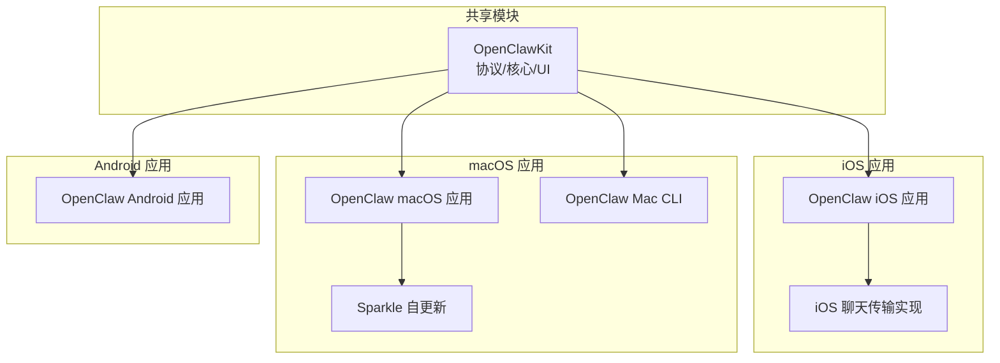
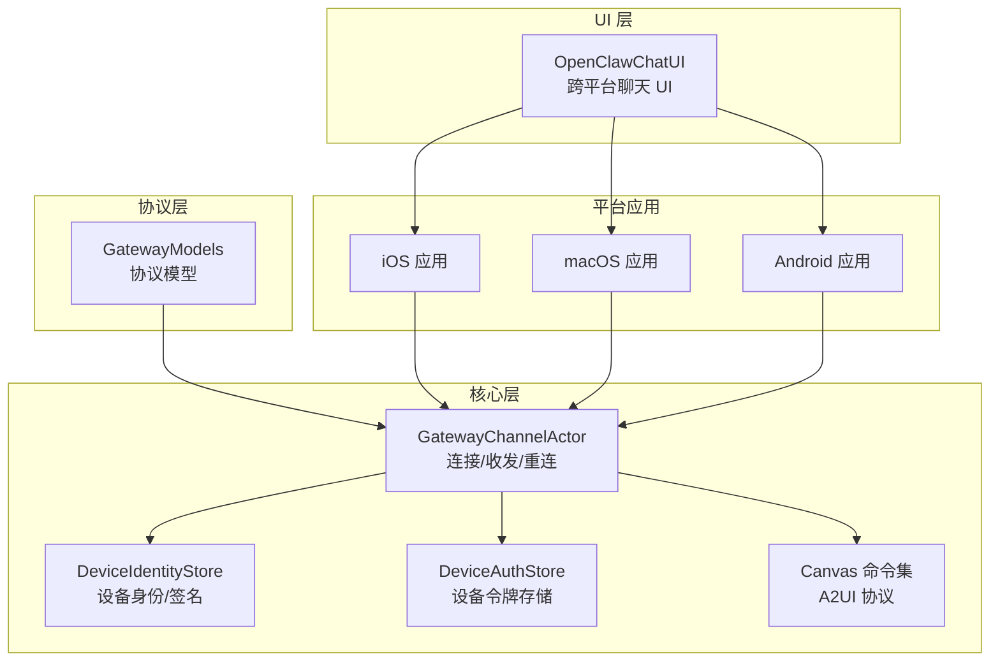
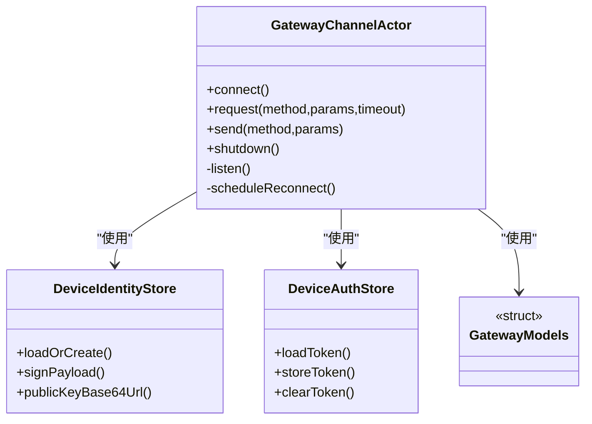
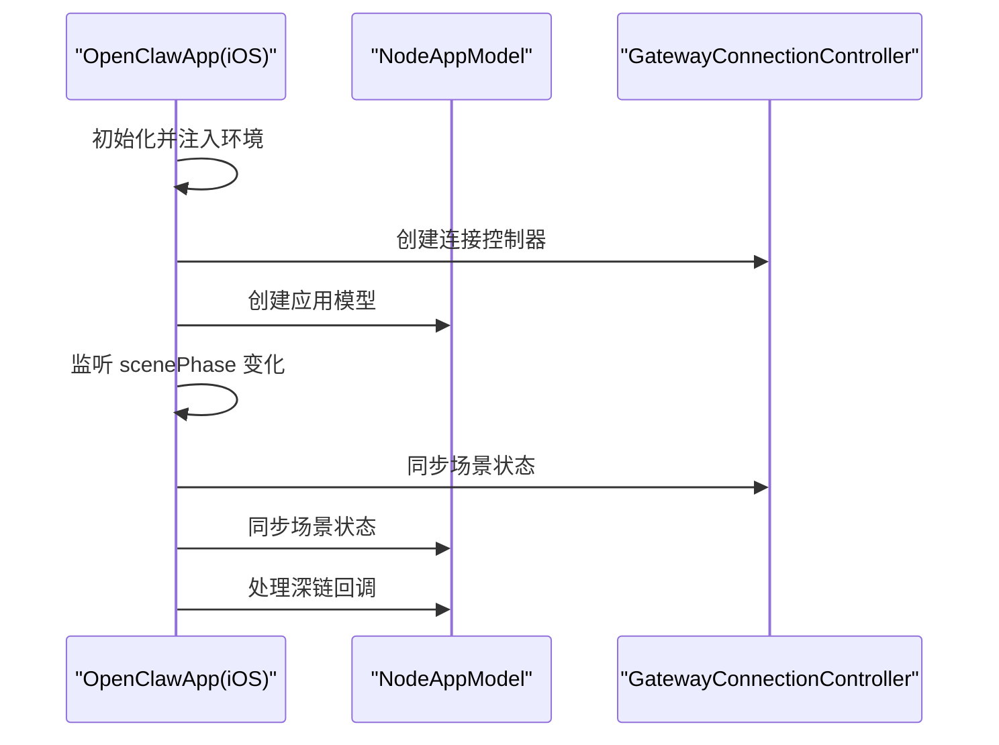
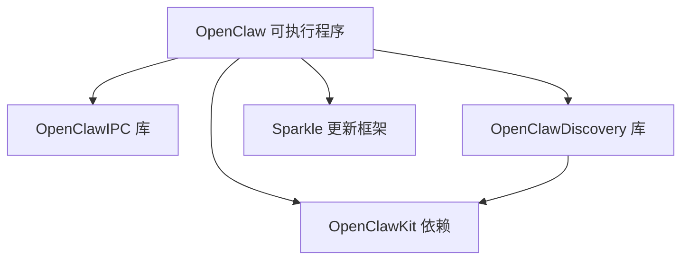
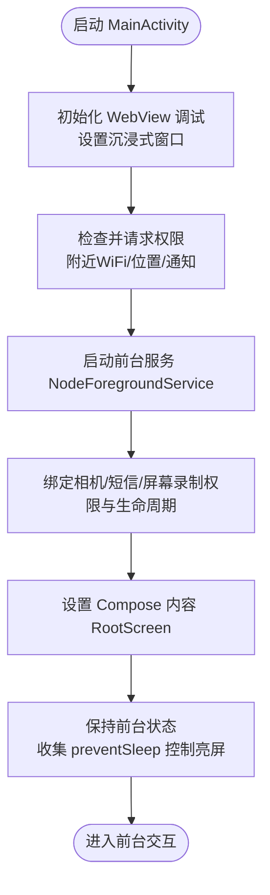
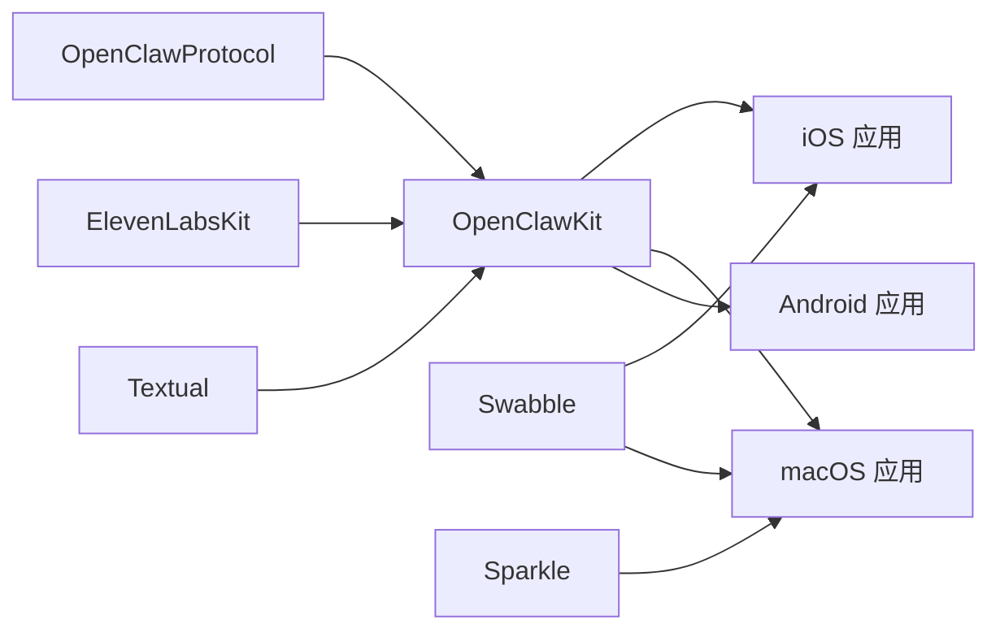

# 应用模块结构

<cite>
**本文档引用的文件**
- [apps/shared/OpenClawKit/Package.swift](file://apps/shared/OpenClawKit/Package.swift)
- [apps/macos/Package.swift](file://apps/macos/Package.swift)
- [apps/ios/project.yml](file://apps/ios/project.yml)
- [apps/android/build.gradle.kts](file://apps/android/build.gradle.kts)
- [apps/shared/OpenClawKit/Sources/OpenClawProtocol/GatewayModels.swift](file://apps/shared/OpenClawKit/Sources/OpenClawProtocol/GatewayModels.swift)
- [apps/shared/OpenClawKit/Sources/OpenClawKit/GatewayChannel.swift](file://apps/shared/OpenClawKit/Sources/OpenClawKit/GatewayChannel.swift)
- [apps/ios/Sources/OpenClawApp.swift](file://apps/ios/Sources/OpenClawApp.swift)
- [apps/android/app/src/main/java/ai/openclaw/android/MainActivity.kt](file://apps/android/app/src/main/java/ai/openclaw/android/MainActivity.kt)
</cite>

## 目录

1. [简介](#简介)
2. [项目结构](#项目结构)
3. [核心组件](#核心组件)
4. [架构总览](#架构总览)
5. [详细组件分析](#详细组件分析)
6. [依赖关系分析](#依赖关系分析)
7. [性能考虑](#性能考虑)
8. [故障排查指南](#故障排查指南)
9. [结论](#结论)
10. [附录](#附录)

## 简介

本文件系统性梳理 OpenClaw 多平台应用模块的代码结构与实现要点，覆盖 macOS、iOS 和 Android 三端应用，并重点阐述共享模块 OpenClawKit 的模块化设计、协议与接口定义、平台适配层以及原生能力集成方案。同时给出跨平台代码复用策略、构建配置与资源管理方式、以及打包、签名与分发流程的关键技术细节。

## 项目结构

apps/ 目录采用“共享模块 + 平台应用”的分层组织：

- 共享模块：apps/shared/OpenClawKit 提供协议、核心库与聊天 UI 组件，支持 iOS/macOS 平台复用。
- 平台应用：
  - iOS：Xcode 工程与 XcodeGen 配置，SwiftUI 应用入口与平台服务。
  - macOS：SwiftPM 包，菜单栏应用与 CLI 工具，集成 Sparkle 自更新。
  - Android：Gradle 应用工程，Kotlin 实现的 UI、网关通信与原生能力封装。



图表来源

- [apps/shared/OpenClawKit/Package.swift](file://apps/shared/OpenClawKit/Package.swift#L1-L62)
- [apps/macos/Package.swift](file://apps/macos/Package.swift#L1-L93)
- [apps/ios/project.yml](file://apps/ios/project.yml#L1-L135)
- [apps/android/build.gradle.kts](file://apps/android/build.gradle.kts#L1-L7)

章节来源

- [apps/shared/OpenClawKit/Package.swift](file://apps/shared/OpenClawKit/Package.swift#L1-L62)
- [apps/macos/Package.swift](file://apps/macos/Package.swift#L1-L93)
- [apps/ios/project.yml](file://apps/ios/project.yml#L1-L135)
- [apps/android/build.gradle.kts](file://apps/android/build.gradle.kts#L1-L7)

## 核心组件

- OpenClawProtocol：定义网关通信协议模型（连接参数、帧类型、事件、错误等），作为跨平台协议层。
- OpenClawKit：提供网关通道、设备身份、权限存储、Canvas A2UI 命令集、聊天 UI 组件等核心能力。
- OpenClawChatUI：基于 Textual 的跨平台聊天 UI 组件库，面向 macOS/iOS。
- 平台应用：
  - iOS：SwiftUI 应用入口，场景生命周期管理，深链处理，平台服务集成。
  - macOS：菜单栏应用 + CLI，集成 Sparkle 自更新；提供 IPC 与发现模块。
  - Android：Compose UI，权限请求与前台服务，网关通信与 Canvas A2UI 协议对接。

章节来源

- [apps/shared/OpenClawKit/Sources/OpenClawProtocol/GatewayModels.swift](file://apps/shared/OpenClawKit/Sources/OpenClawProtocol/GatewayModels.swift#L1-L800)
- [apps/shared/OpenClawKit/Sources/OpenClawKit/GatewayChannel.swift](file://apps/shared/OpenClawKit/Sources/OpenClawKit/GatewayChannel.swift#L1-L737)
- [apps/ios/Sources/OpenClawApp.swift](file://apps/ios/Sources/OpenClawApp.swift#L1-L32)
- [apps/android/app/src/main/java/ai/openclaw/android/MainActivity.kt](file://apps/android/app/src/main/java/ai/openclaw/android/MainActivity.kt#L1-L131)

## 架构总览

OpenClaw 通过 OpenClawKit 将协议与核心逻辑抽象为共享模块，平台应用仅负责 UI、系统服务与平台适配，从而最大化复用。iOS/macOS 使用 Swift，Android 使用 Kotlin，但均消费同一套协议与核心能力。



图表来源

- [apps/shared/OpenClawKit/Sources/OpenClawProtocol/GatewayModels.swift](file://apps/shared/OpenClawKit/Sources/OpenClawProtocol/GatewayModels.swift#L1-L800)
- [apps/shared/OpenClawKit/Sources/OpenClawKit/GatewayChannel.swift](file://apps/shared/OpenClawKit/Sources/OpenClawKit/GatewayChannel.swift#L1-L737)
- [apps/shared/OpenClawKit/Package.swift](file://apps/shared/OpenClawKit/Package.swift#L1-L62)

## 详细组件分析

### OpenClawKit 模块结构与接口

- 模块划分
  - OpenClawProtocol：协议模型与常量，如连接参数、帧类型、事件、错误码、快照与状态版本等。
  - OpenClawKit：网关通道、设备身份与认证、Canvas A2UI 命令、聊天命令、系统命令、资源与工具显示等。
  - OpenClawChatUI：聊天视图、会话、主题、Markdown 渲染与解析器等。
- 关键接口
  - GatewayChannelActor：封装 WebSocket 连接、鉴权挑战、心跳保活、请求/响应编解码、超时与重连。
  - 设备身份与认证：设备 ID 生成/加载、公私钥签名、令牌存储与回退策略。
  - Canvas A2UI：将网关推送的 JSONL 流转换为 UI 动作，支持 Canvas 命令与参数解析。



图表来源

- [apps/shared/OpenClawKit/Sources/OpenClawKit/GatewayChannel.swift](file://apps/shared/OpenClawKit/Sources/OpenClawKit/GatewayChannel.swift#L117-L737)
- [apps/shared/OpenClawKit/Sources/OpenClawProtocol/GatewayModels.swift](file://apps/shared/OpenClawKit/Sources/OpenClawProtocol/GatewayModels.swift#L1-L800)

章节来源

- [apps/shared/OpenClawKit/Package.swift](file://apps/shared/OpenClawKit/Package.swift#L1-L62)
- [apps/shared/OpenClawKit/Sources/OpenClawProtocol/GatewayModels.swift](file://apps/shared/OpenClawKit/Sources/OpenClawProtocol/GatewayModels.swift#L1-L800)
- [apps/shared/OpenClawKit/Sources/OpenClawKit/GatewayChannel.swift](file://apps/shared/OpenClawKit/Sources/OpenClawKit/GatewayChannel.swift#L1-L737)

### iOS 应用架构与平台适配

- 应用入口：SwiftUI 主应用，初始化网关设置持久化与连接控制器，处理深链与场景生命周期。
- 平台服务：日历、联系人、位置、媒体、屏幕录制、相机、提醒事项、语音唤醒等服务。
- UI 适配：RootCanvas/RootView/RootTabs 组织界面，ChatSheet 与 iOS 特定的 GatewayChatTransport。
- 权限与安全：Info.plist 中声明网络、麦克风、相机、位置、Bonjour 服务等用途描述；Xcode 预设签名与配置。



图表来源

- [apps/ios/Sources/OpenClawApp.swift](file://apps/ios/Sources/OpenClawApp.swift#L1-L32)
- [apps/ios/project.yml](file://apps/ios/project.yml#L1-L135)

章节来源

- [apps/ios/Sources/OpenClawApp.swift](file://apps/ios/Sources/OpenClawApp.swift#L1-L32)
- [apps/ios/project.yml](file://apps/ios/project.yml#L1-L135)

### macOS 应用架构与 IPC/自更新

- 包结构：SwiftPM 定义可执行目标 OpenClaw、OpenClawMacCLI、库 OpenClawIPC/OpenClawDiscovery，依赖 OpenClawKit 与 Swabble。
- 功能：菜单栏应用 + CLI，Bonjour 发现与 IPC，Sparkle 自更新。
- 资源：拷贝图标与设备模型资源，严格并发启用。



图表来源

- [apps/macos/Package.swift](file://apps/macos/Package.swift#L1-L93)

章节来源

- [apps/macos/Package.swift](file://apps/macos/Package.swift#L1-L93)

### Android 应用架构与原生集成

- 构建：Gradle 插件统一管理 Kotlin/Compose/Serialization 版本。
- UI：Compose RootScreen，主题与沉浸式窗口，Surface 包裹。
- 权限：运行时请求附近 WiFi/位置/通知权限，按 Android 版本差异化处理。
- 原生：NodeForegroundService 前台服务，相机/短信/屏幕录制权限与生命周期绑定，WebView 调试开关。



图表来源

- [apps/android/app/src/main/java/ai/openclaw/android/MainActivity.kt](file://apps/android/app/src/main/java/ai/openclaw/android/MainActivity.kt#L1-L131)
- [apps/android/build.gradle.kts](file://apps/android/build.gradle.kts#L1-L7)

章节来源

- [apps/android/app/src/main/java/ai/openclaw/android/MainActivity.kt](file://apps/android/app/src/main/java/ai/openclaw/android/MainActivity.kt#L1-L131)
- [apps/android/build.gradle.kts](file://apps/android/build.gradle.kts#L1-L7)

### 网关连接与重连机制

GatewayChannelActor 是跨平台连接的核心，负责握手、鉴权、心跳与重连。其关键流程如下：

```mermaid
sequenceDiagram
participant App as "应用"
participant Actor as "GatewayChannelActor"
participant WS as "WebSocket 任务"
participant GW as "网关"
App->>Actor : connect()
Actor->>WS : 创建并启动任务
Actor->>GW : 发送 connect 请求(含客户端信息/权限/鉴权)
GW-->>Actor : 返回连接挑战/响应
Actor->>Actor : 解析策略/心跳间隔
Actor->>Actor : 启动心跳监控
Actor-->>App : 连接成功/推送快照
Note over Actor,GW : 断线后指数退避重连
```

图表来源

- [apps/shared/OpenClawKit/Sources/OpenClawKit/GatewayChannel.swift](file://apps/shared/OpenClawKit/Sources/OpenClawKit/GatewayChannel.swift#L219-L266)
- [apps/shared/OpenClawKit/Sources/OpenClawProtocol/GatewayModels.swift](file://apps/shared/OpenClawKit/Sources/OpenClawProtocol/GatewayModels.swift#L15-L115)

章节来源

- [apps/shared/OpenClawKit/Sources/OpenClawKit/GatewayChannel.swift](file://apps/shared/OpenClawKit/Sources/OpenClawKit/GatewayChannel.swift#L1-L737)
- [apps/shared/OpenClawKit/Sources/OpenClawProtocol/GatewayModels.swift](file://apps/shared/OpenClawKit/Sources/OpenClawProtocol/GatewayModels.swift#L1-L800)

## 依赖关系分析

- 共享模块依赖
  - OpenClawKit 依赖 OpenClawProtocol，依赖外部库 ElevenLabsKit 与 Textual（macOS/iOS）。
  - macOS 应用依赖 OpenClawKit、Swabble、MenuBarExtraAccess、Subprocess、Logging、Sparkle、Peekaboo。
  - iOS 应用依赖 OpenClawKit（ChatUI/Protocol）、Swabble、AppIntents。
  - Android 应用依赖 OpenClawKit（通过 AAR/JitPack 或本地模块方式，见工程配置）。
- 平台差异
  - iOS：SwiftUI + AppIntents + Xcode 配置；Info.plist 声明权限与网络策略。
  - macOS：SwiftPM + Sparkle；菜单栏 + CLI；资源拷贝与图标。
  - Android：Compose + 权限与前台服务；Gradle 插件版本统一。



图表来源

- [apps/shared/OpenClawKit/Package.swift](file://apps/shared/OpenClawKit/Package.swift#L1-L62)
- [apps/macos/Package.swift](file://apps/macos/Package.swift#L1-L93)
- [apps/ios/project.yml](file://apps/ios/project.yml#L1-L135)

章节来源

- [apps/shared/OpenClawKit/Package.swift](file://apps/shared/OpenClawKit/Package.swift#L1-L62)
- [apps/macos/Package.swift](file://apps/macos/Package.swift#L1-L93)
- [apps/ios/project.yml](file://apps/ios/project.yml#L1-L135)

## 性能考虑

- 连接与消息
  - WebSocket 最大消息尺寸提升以避免大快照/历史载荷被截断。
  - 异步超时与请求去重，避免阻塞与重复请求。
- 心跳与重连
  - 基于策略的心跳间隔与容忍度，missed 心跳触发自动重连与挂起请求失败。
- UI 与资源
  - iOS/macOS 使用 Textual 渲染 Markdown，减少 UI 线程负担。
  - macOS 资源复制与缓存，避免运行时 IO 开销。
- Android
  - 前台服务与 keep-screen-on 控制，降低后台限制影响。
  - WebView 调试仅在调试构建开启，避免生产性能损耗。

章节来源

- [apps/shared/OpenClawKit/Sources/OpenClawKit/GatewayChannel.swift](file://apps/shared/OpenClawKit/Sources/OpenClawKit/GatewayChannel.swift#L49-L56)
- [apps/shared/OpenClawKit/Sources/OpenClawKit/GatewayChannel.swift](file://apps/shared/OpenClawKit/Sources/OpenClawKit/GatewayChannel.swift#L558-L578)
- [apps/android/app/src/main/java/ai/openclaw/android/MainActivity.kt](file://apps/android/app/src/main/java/ai/openclaw/android/MainActivity.kt#L46-L56)

## 故障排查指南

- 连接问题
  - 检查 connect 超时与鉴权挑战是否超时；确认设备令牌/共享令牌/密码来源。
  - 心跳缺失导致断线，查看日志与重连退避是否正常。
- iOS 权限
  - Info.plist 中网络、麦克风、相机、位置、Bonjour 服务描述需完整；Xcode 配置中签名与 Provisioning Profile 正确。
- macOS
  - Sparkle 更新失败时检查证书与公证流程；资源拷贝路径正确。
- Android
  - 附近 WiFi/位置/通知权限未授予会导致发现与通知异常；WebView 调试仅在调试构建开启。

章节来源

- [apps/shared/OpenClawKit/Sources/OpenClawKit/GatewayChannel.swift](file://apps/shared/OpenClawKit/Sources/OpenClawKit/GatewayChannel.swift#L498-L525)
- [apps/ios/project.yml](file://apps/ios/project.yml#L79-L111)
- [apps/android/app/src/main/java/ai/openclaw/android/MainActivity.kt](file://apps/android/app/src/main/java/ai/openclaw/android/MainActivity.kt#L97-L129)

## 结论

OpenClaw 通过 OpenClawKit 将协议与核心能力抽象为共享模块，在 iOS/macOS/Kotlin 生态下实现高复用与一致体验。平台应用专注于 UI 与系统服务集成，配合完善的权限与资源管理、健壮的网关连接与心跳重连机制，形成清晰的跨平台架构。后续可在以下方面持续优化：协议演进的向后兼容、平台特定 UI 组件的进一步抽象、自动化测试与发布流水线的完善。

## 附录

### 构建配置与资源管理

- iOS
  - XcodeGen 配置集中管理包依赖、目标产物、预设签名与 Info.plist 字段。
  - SwiftLint/SwiftFormat 预构建脚本保证代码风格一致性。
- macOS
  - SwiftPM 定义可执行与库产物，资源拷贝至最终包内。
  - Sparkle 集成用于应用更新。
- Android
  - Gradle 插件统一版本，Compose/Serialization/Kotlin 支持。

章节来源

- [apps/ios/project.yml](file://apps/ios/project.yml#L1-L135)
- [apps/macos/Package.swift](file://apps/macos/Package.swift#L58-L64)
- [apps/android/build.gradle.kts](file://apps/android/build.gradle.kts#L1-L7)

### 打包、签名与分发

- iOS
  - Xcode 预设签名与开发团队、Provisioning Profile；App Store Connect 与 TestFlight 分发。
  - Info.plist 中 Bundle 显示名、版本号、权限用途描述齐全。
- macOS
  - Sparkle 配合 Apple 签名与公证；DMG 制作与 appcast 更新。
- Android
  - Gradle 构建 APK/AAB；签名与混淆配置；Google Play/内部测试轨道分发。

章节来源

- [apps/ios/project.yml](file://apps/ios/project.yml#L71-L78)
- [apps/macos/Package.swift](file://apps/macos/Package.swift#L61-L64)
