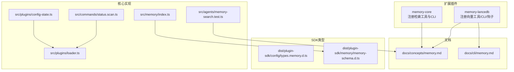
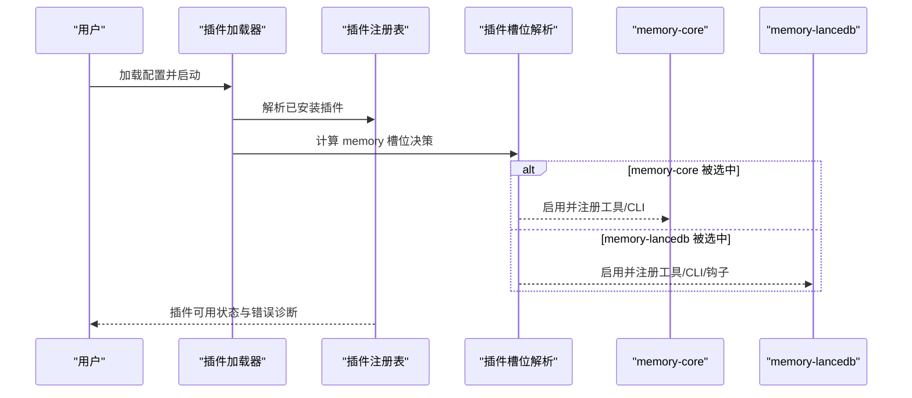
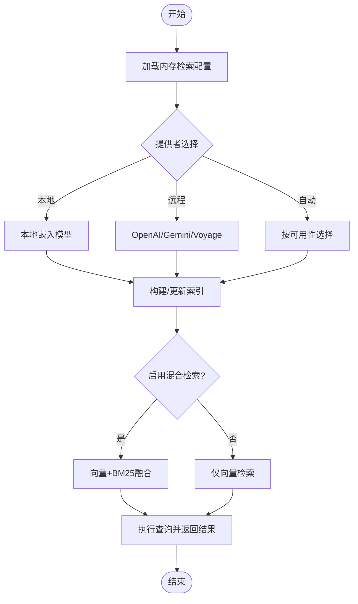
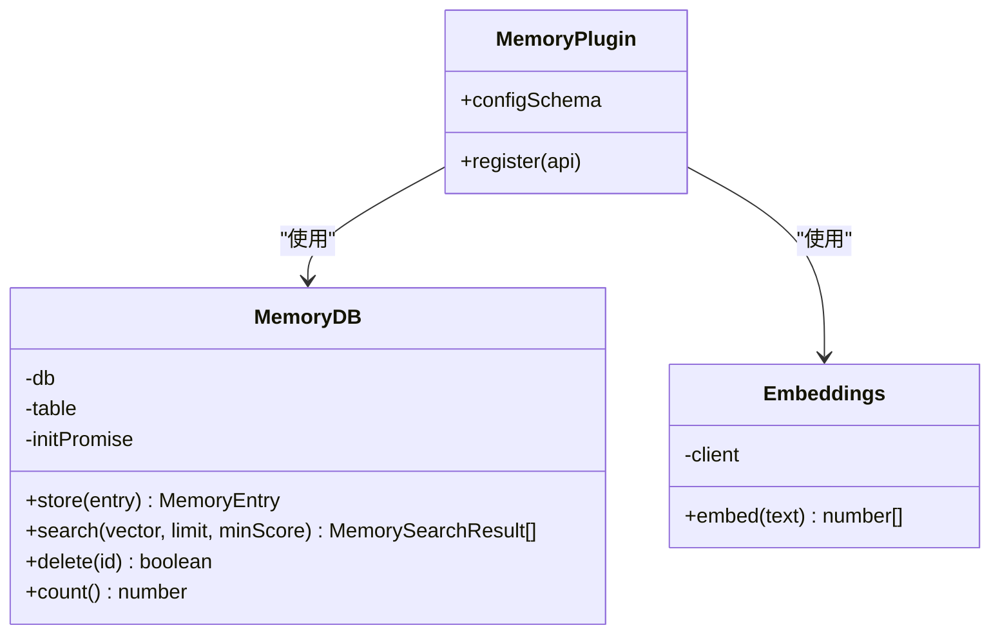
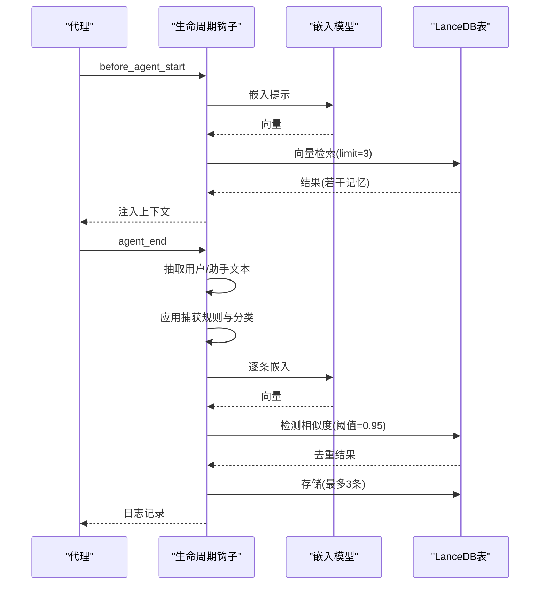
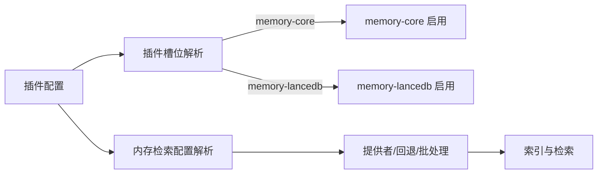

# 内存插件

<cite>
**本文引用的文件**
- [extensions/memory-core/index.ts](file://extensions/memory-core/index.ts)
- [extensions/memory-core/openclaw.plugin.json](file://extensions/memory-core/openclaw.plugin.json)
- [extensions/memory-lancedb/index.ts](file://extensions/memory-lancedb/index.ts)
- [extensions/memory-lancedb/config.ts](file://extensions/memory-lancedb/config.ts)
- [extensions/memory-lancedb/openclaw.plugin.json](file://extensions/memory-lancedb/openclaw.plugin.json)
- [extensions/memory-lancedb/index.test.ts](file://extensions/memory-lancedb/index.test.ts)
- [docs/concepts/memory.md](file://docs/concepts/memory.md)
- [docs/cli/memory.md](file://docs/cli/memory.md)
- [dist/plugin-sdk/config/types.memory.d.ts](file://dist/plugin-sdk/config/types.memory.d.ts)
- [dist/plugin-sdk/memory/memory-schema.d.ts](file://dist/plugin-sdk/memory/memory-schema.d.ts)
- [src/memory/index.ts](file://src/memory/index.ts)
- [src/agents/memory-search.test.ts](file://src/agents/memory-search.test.ts)
- [src/plugins/config-state.ts](file://src/plugins/config-state.ts)
- [src/plugins/loader.ts](file://src/plugins/loader.ts)
- [src/commands/status.scan.ts](file://src/commands/status.scan.ts)
</cite>

## 目录

1. [简介](#简介)
2. [项目结构](#项目结构)
3. [核心组件](#核心组件)
4. [架构总览](#架构总览)
5. [组件详解](#组件详解)
6. [依赖关系分析](#依赖关系分析)
7. [性能与容量管理](#性能与容量管理)
8. [故障排查指南](#故障排查指南)
9. [结论](#结论)
10. [附录](#附录)

## 简介

本文件系统化梳理 OpenClaw 的内存插件体系，重点覆盖两类实现：

- 核心内存插件（memory-core）：基于工作区 Markdown 文件的纯文本语义检索与工具集，适合轻量、可审计、无需外部服务的场景。
- LanceDB 内存插件（memory-lancedb）：基于 LanceDB 向量数据库与 OpenAI 嵌入模型的长程记忆，支持自动召回与自动捕获，适合需要语义检索与持续记忆的场景。

文档从架构设计、数据模型、索引与查询优化、向量处理与相似度搜索、批量操作、配置与性能调优、容量管理、备份恢复与迁移、兼容性保障等维度进行深入说明，并提供可视化图示与实操建议。

## 项目结构

围绕内存插件的关键目录与文件如下：

- 扩展插件
  - memory-core：注册基础检索工具与 CLI，面向工作区 Markdown 的纯文本检索。
  - memory-lancedb：注册向量检索工具、CLI、生命周期钩子，面向 LanceDB 的持久化长程记忆。
- 文档
  - concepts/memory.md：通用内存概念、Markdown 文件布局、自动刷新、向量检索与混合检索等。
  - cli/memory.md：CLI 对通用内存（memory-core）的命令参考。
- 插件 SDK 类型定义
  - dist/plugin-sdk/config/types.memory.d.ts：内存后端与 QMD 配置类型。
  - dist/plugin-sdk/memory/memory-schema.d.ts：内置 SQLite 索引模式校验接口。
- 核心实现入口
  - src/memory/index.ts：内存索引与搜索管理器导出。
  - src/agents/memory-search.test.ts：内存检索配置解析与合并逻辑的测试用例。
  - src/plugins/config-state.ts、src/plugins/loader.ts、src/commands/status.scan.ts：插件槽位选择、启用状态与内存插件决策流程。

**图表来源**

- [extensions/memory-core/index.ts](file://extensions/memory-core/index.ts#L1-L39)
- [extensions/memory-lancedb/index.ts](file://extensions/memory-lancedb/index.ts#L1-L627)
- [docs/concepts/memory.md](file://docs/concepts/memory.md#L1-L568)
- [docs/cli/memory.md](file://docs/cli/memory.md#L1-L46)
- [dist/plugin-sdk/config/types.memory.d.ts](file://dist/plugin-sdk/config/types.memory.d.ts#L1-L46)
- [dist/plugin-sdk/memory/memory-schema.d.ts](file://dist/plugin-sdk/memory/memory-schema.d.ts#L1-L11)
- [src/memory/index.ts](file://src/memory/index.ts#L1-L8)
- [src/agents/memory-search.test.ts](file://src/agents/memory-search.test.ts#L1-L259)
- [src/plugins/config-state.ts](file://src/plugins/config-state.ts#L197-L225)
- [src/plugins/loader.ts](file://src/plugins/loader.ts#L328-L371)
- [src/commands/status.scan.ts](file://src/commands/status.scan.ts#L23-L39)

**章节来源**

- [extensions/memory-core/index.ts](file://extensions/memory-core/index.ts#L1-L39)
- [extensions/memory-lancedb/index.ts](file://extensions/memory-lancedb/index.ts#L1-L627)
- [docs/concepts/memory.md](file://docs/concepts/memory.md#L1-L568)
- [docs/cli/memory.md](file://docs/cli/memory.md#L1-L46)
- [dist/plugin-sdk/config/types.memory.d.ts](file://dist/plugin-sdk/config/types.memory.d.ts#L1-L46)
- [dist/plugin-sdk/memory/memory-schema.d.ts](file://dist/plugin-sdk/memory/memory-schema.d.ts#L1-L11)
- [src/memory/index.ts](file://src/memory/index.ts#L1-L8)
- [src/agents/memory-search.test.ts](file://src/agents/memory-search.test.ts#L1-L259)
- [src/plugins/config-state.ts](file://src/plugins/config-state.ts#L197-L225)
- [src/plugins/loader.ts](file://src/plugins/loader.ts#L328-L371)
- [src/commands/status.scan.ts](file://src/commands/status.scan.ts#L23-L39)

## 核心组件

- memory-core
  - 注册工具：memory_search、memory_get（基于工作区 Markdown 的语义检索与内容读取）。
  - 注册 CLI：openclaw memory（状态/索引/搜索）。
  - 数据来源：工作区内的 Markdown 文件（如 MEMORY.md、daily logs），作为“事实来源”，模型仅记住写入磁盘的内容。
- memory-lancedb
  - 注册工具：memory_recall、memory_store、memory_forget（向量检索、存储、删除）。
  - 注册 CLI：openclaw ltm（列表/搜索/统计）。
  - 生命周期钩子：before_agent_start（自动注入相关记忆）、agent_end（自动捕获重要信息）。
  - 存储：LanceDB 表（memories），字段含 id、text、vector、importance、category、createdAt。
  - 嵌入：OpenAI embeddings；向量维度由模型决定（默认 text-embedding-3-small=1536）。
  - 捕获规则：基于正则与启发式过滤，避免重复与噪声。

**章节来源**

- [extensions/memory-core/index.ts](file://extensions/memory-core/index.ts#L10-L35)
- [extensions/memory-lancedb/index.ts](file://extensions/memory-lancedb/index.ts#L242-L627)
- [extensions/memory-lancedb/config.ts](file://extensions/memory-lancedb/config.ts#L5-L140)
- [docs/concepts/memory.md](file://docs/concepts/memory.md#L11-L37)

## 架构总览

两类内存插件在 OpenClaw 中通过“插件槽位”选择与启用，遵循统一的插件加载与配置验证流程。memory-core 提供纯文本检索能力，memory-lancedb 提供向量检索与自动记忆能力。

**图表来源**

- [src/plugins/loader.ts](file://src/plugins/loader.ts#L328-L371)
- [src/plugins/config-state.ts](file://src/plugins/config-state.ts#L197-L225)
- [src/commands/status.scan.ts](file://src/commands/status.scan.ts#L23-L39)
- [extensions/memory-core/index.ts](file://extensions/memory-core/index.ts#L10-L35)
- [extensions/memory-lancedb/index.ts](file://extensions/memory-lancedb/index.ts#L249-L627)

## 组件详解

### memory-core（基于工作区 Markdown 的检索）

- 工具与 CLI
  - memory_search：对 MEMORY.md 与 daily logs 进行语义检索，返回片段与来源路径。
  - memory_get：按路径读取指定 Markdown 内容。
  - openclaw memory：状态检查、索引重建、深度探测、搜索等。
- 数据模型
  - 文件布局：MEMORY.md（策展长程记忆）、memory/YYYY-MM-DD.md（日志）。
  - 检索范围：默认包含上述文件，可通过 extraPaths 扩展。
- 索引与查询
  - 默认启用，使用 sqlite-vec（若可用）加速向量距离计算。
  - 支持 BM25 关键词检索与向量检索的混合融合，权重可配置。
  - 支持嵌入缓存，避免重复嵌入。
- 自动刷新
  - 接近压缩阈值时触发静默提醒，促使模型在上下文压缩前写入持久记忆。

**图表来源**

- [docs/concepts/memory.md](file://docs/concepts/memory.md#L79-L568)
- [src/agents/memory-search.test.ts](file://src/agents/memory-search.test.ts#L1-L259)
- [dist/plugin-sdk/config/types.memory.d.ts](file://dist/plugin-sdk/config/types.memory.d.ts#L1-L46)

**章节来源**

- [extensions/memory-core/index.ts](file://extensions/memory-core/index.ts#L10-L35)
- [docs/concepts/memory.md](file://docs/concepts/memory.md#L11-L37)
- [docs/cli/memory.md](file://docs/cli/memory.md#L1-L46)
- [src/agents/memory-search.test.ts](file://src/agents/memory-search.test.ts#L1-L259)

### memory-lancedb（LanceDB 向量记忆）

- 工具与 CLI
  - memory_recall：根据查询向量检索，返回相似度与分类。
  - memory_store：存储新记忆，去重检测，支持重要性与分类。
  - memory_forget：按 ID 或查询删除记忆。
  - openclaw ltm：列出/搜索/统计内存条目。
- 数据模型与索引
  - 表名：memories；字段：id、text、vector、importance、category、createdAt。
  - 初始化：首次连接自动创建表并清理临时 schema 行。
  - 向量维度：依据嵌入模型动态确定（默认 1536）。
- 相似度搜索与优化
  - LanceDB 默认使用 L2 距离，转换为 0-1 相似度分数。
  - 搜索参数：limit、最小分数阈值；召回时可裁剪向量以避免序列化问题。
- 自动捕获与召回
  - before_agent_start：在会话前注入相关记忆到上下文。
  - agent_end：从对话消息中抽取可捕获文本，去重后写入。
- 配置与安全
  - 配置项：embedding.apiKey、embedding.model、dbPath、autoCapture、autoRecall。
  - 安全：删除时对 UUID 格式进行校验，防止注入。

**图表来源**

- [extensions/memory-lancedb/index.ts](file://extensions/memory-lancedb/index.ts#L58-L156)
- [extensions/memory-lancedb/index.ts](file://extensions/memory-lancedb/index.ts#L162-L179)
- [extensions/memory-lancedb/index.ts](file://extensions/memory-lancedb/index.ts#L242-L627)

**章节来源**

- [extensions/memory-lancedb/index.ts](file://extensions/memory-lancedb/index.ts#L58-L156)
- [extensions/memory-lancedb/index.ts](file://extensions/memory-lancedb/index.ts#L162-L179)
- [extensions/memory-lancedb/index.ts](file://extensions/memory-lancedb/index.ts#L242-L627)
- [extensions/memory-lancedb/config.ts](file://extensions/memory-lancedb/config.ts#L5-L140)

### 生命周期钩子与自动记忆

- before_agent_start（自动召回）
  - 将当前提示嵌入，向量检索若干条高分记忆，拼接为上下文注入。
- agent_end（自动捕获）
  - 过滤用户/助手消息文本，应用捕获规则与分类，去重后写入 LanceDB。
  - 限制每轮最多写入 3 条，避免过度记忆化。

**图表来源**

- [extensions/memory-lancedb/index.ts](file://extensions/memory-lancedb/index.ts#L494-L606)

**章节来源**

- [extensions/memory-lancedb/index.ts](file://extensions/memory-lancedb/index.ts#L494-L606)

### 批量操作与去重策略

- 批量存储
  - memory_store 在写入前对输入文本进行嵌入，然后在数据库中以高阈值（0.95）检索是否存在高度相似的记忆，避免重复。
- 删除操作
  - memory_forget 支持按 ID 删除；当提供查询时，先检索候选，若仅一条且相似度极高则直接删除；否则返回候选列表供进一步确认。
- CLI 批量统计
  - openclaw ltm stats/list 可快速统计与浏览内存条目数量与内容。

**章节来源**

- [extensions/memory-lancedb/index.ts](file://extensions/memory-lancedb/index.ts#L309-L442)
- [extensions/memory-lancedb/index.ts](file://extensions/memory-lancedb/index.ts#L444-L488)

## 依赖关系分析

- 插件槽位与启用
  - memory-core 默认被识别为可用槽位之一；当 plugins.slots.memory 设置为 "none" 时禁用。
  - 插件加载器根据插件清单与配置，解析启用状态与选择结果，输出诊断信息。
- 内存检索配置
  - 支持 provider 自动选择、远程/本地/回退策略、批处理、增量同步、会话索引等复杂组合。
- SDK 类型约束
  - types.memory.d.ts 定义了内存后端与 QMD 配置的类型边界；memory-schema.d.ts 提供内置 SQLite 索引模式校验接口。

**图表来源**

- [src/plugins/config-state.ts](file://src/plugins/config-state.ts#L197-L225)
- [src/plugins/loader.ts](file://src/plugins/loader.ts#L328-L371)
- [src/commands/status.scan.ts](file://src/commands/status.scan.ts#L23-L39)
- [src/agents/memory-search.test.ts](file://src/agents/memory-search.test.ts#L1-L259)
- [dist/plugin-sdk/config/types.memory.d.ts](file://dist/plugin-sdk/config/types.memory.d.ts#L1-L46)
- [dist/plugin-sdk/memory/memory-schema.d.ts](file://dist/plugin-sdk/memory/memory-schema.d.ts#L1-L11)

**章节来源**

- [src/plugins/config-state.ts](file://src/plugins/config-state.ts#L197-L225)
- [src/plugins/loader.ts](file://src/plugins/loader.ts#L328-L371)
- [src/commands/status.scan.ts](file://src/commands/status.scan.ts#L23-L39)
- [src/agents/memory-search.test.ts](file://src/agents/memory-search.test.ts#L1-L259)
- [dist/plugin-sdk/config/types.memory.d.ts](file://dist/plugin-sdk/config/types.memory.d.ts#L1-L46)
- [dist/plugin-sdk/memory/memory-schema.d.ts](file://dist/plugin-sdk/memory/memory-schema.d.ts#L1-L11)

## 性能与容量管理

- 向量检索性能
  - 使用 sqlite-vec（若可用）在数据库内完成向量距离计算，避免将所有嵌入载入内存。
  - 混合检索（向量+BM25）在召回池上加权融合，提升“自然语言”与“精确关键词”两类查询的综合效果。
- 嵌入缓存
  - 缓存已嵌入的文本块，减少重复索引与频繁更新的成本。
- 批量索引
  - 对 OpenAI/Gemini/Voyage 提供批量嵌入能力，降低大体量索引成本与时间。
- 自动捕获节流
  - 每轮最多写入 3 条记忆，避免过度记忆化与存储压力。
- 存储路径与容量
  - memory-lancedb 的 dbPath 默认位于用户主目录下的状态目录，可自定义；合理规划磁盘配额与定期清理策略。
- 查询参数调优
  - 调整 limit、最小相似度阈值、混合检索权重与候选倍数，平衡召回率与响应速度。

**章节来源**

- [docs/concepts/memory.md](file://docs/concepts/memory.md#L443-L568)
- [extensions/memory-lancedb/index.ts](file://extensions/memory-lancedb/index.ts#L115-L139)
- [extensions/memory-lancedb/index.ts](file://extensions/memory-lancedb/index.ts#L578-L597)

## 故障排查指南

- LanceDB 加载失败
  - 上游包可能缺少原生绑定，需确保平台兼容或切换至替代方案。
- OpenAI API Key 未设置或无效
  - 配置 schema 会拒绝缺失的 apiKey；支持环境变量占位符解析。
- 记忆重复与误捕获
  - 使用高阈值去重与捕获规则过滤；必要时手动 memory_forget 清理。
- CLI 无法访问
  - 确认插件槽位未设为 "none"；检查 openclaw memory/ltm 命令是否可用。
- 插件启用状态异常
  - 查看插件加载器诊断信息与内存槽位决策原因。

**章节来源**

- [extensions/memory-lancedb/index.ts](file://extensions/memory-lancedb/index.ts#L25-L36)
- [extensions/memory-lancedb/config.ts](file://extensions/memory-lancedb/config.ts#L70-L112)
- [src/plugins/loader.ts](file://src/plugins/loader.ts#L328-L371)
- [src/commands/status.scan.ts](file://src/commands/status.scan.ts#L23-L39)

## 结论

- memory-core 适合需要可审计、无外部依赖的纯文本检索场景。
- memory-lancedb 适合需要语义检索、自动记忆与持续学习的场景。
- 两类插件共享统一的插件槽位与配置解析机制，便于在不同部署环境下灵活切换。
- 建议结合业务需求选择合适的提供者、索引策略与容量管理策略，并通过 CLI 与钩子实现自动化与可观测性。

## 附录

### 配置选项速查（memory-lancedb）

- embedding.apiKey：必填，支持环境变量占位符。
- embedding.model：可选，默认 text-embedding-3-small；支持枚举值。
- dbPath：可选，默认位于用户状态目录；可自定义绝对/相对路径。
- autoCapture：可选，默认开启；控制 agent_end 自动捕获。
- autoRecall：可选，默认开启；控制 before_agent_start 自动注入。

**章节来源**

- [extensions/memory-lancedb/openclaw.plugin.json](file://extensions/memory-lancedb/openclaw.plugin.json#L30-L60)
- [extensions/memory-lancedb/config.ts](file://extensions/memory-lancedb/config.ts#L86-L139)

### 备份、恢复与迁移

- 备份
  - memory-core：备份工作区 Markdown 文件（MEMORY.md、daily logs）即可。
  - memory-lancedb：备份 LanceDB 数据库目录（dbPath）。
- 恢复
  - 将备份文件还原到对应位置；重启服务后索引会自动重建（如启用自动索引）。
- 迁移
  - 不同提供者（OpenAI/Gemini/Voyage）与模型（维度不同）需重新索引；注意向量维度映射与批处理配置。
- 兼容性
  - 插件清单与配置 schema 严格校验未知键；提供 UI 提示与敏感字段标记，降低误配置风险。

**章节来源**

- [extensions/memory-core/openclaw.plugin.json](file://extensions/memory-core/openclaw.plugin.json#L1-L10)
- [extensions/memory-lancedb/openclaw.plugin.json](file://extensions/memory-lancedb/openclaw.plugin.json#L1-L61)
- [extensions/memory-lancedb/config.ts](file://extensions/memory-lancedb/config.ts#L54-L112)
