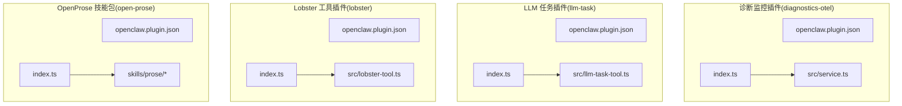
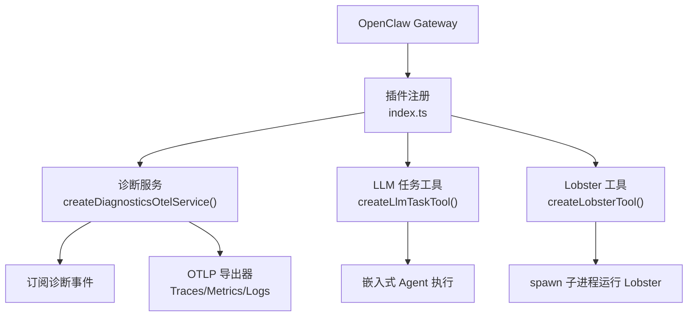
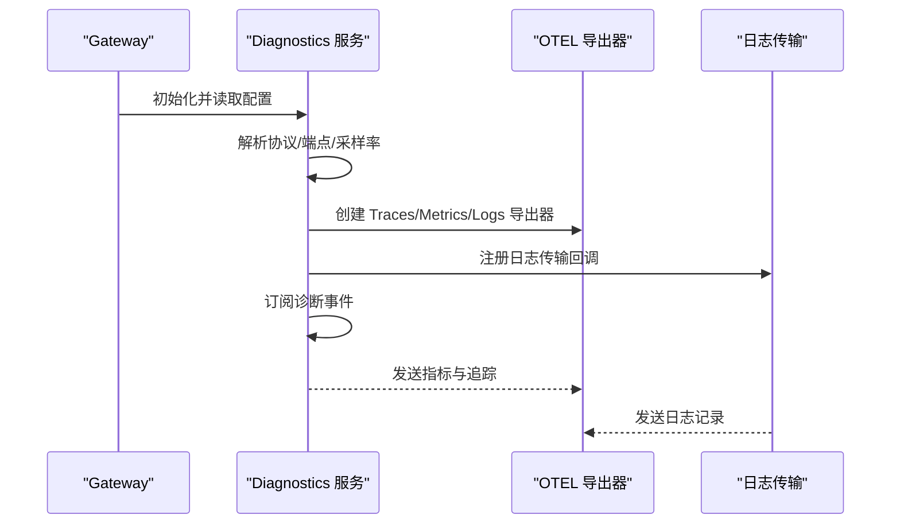
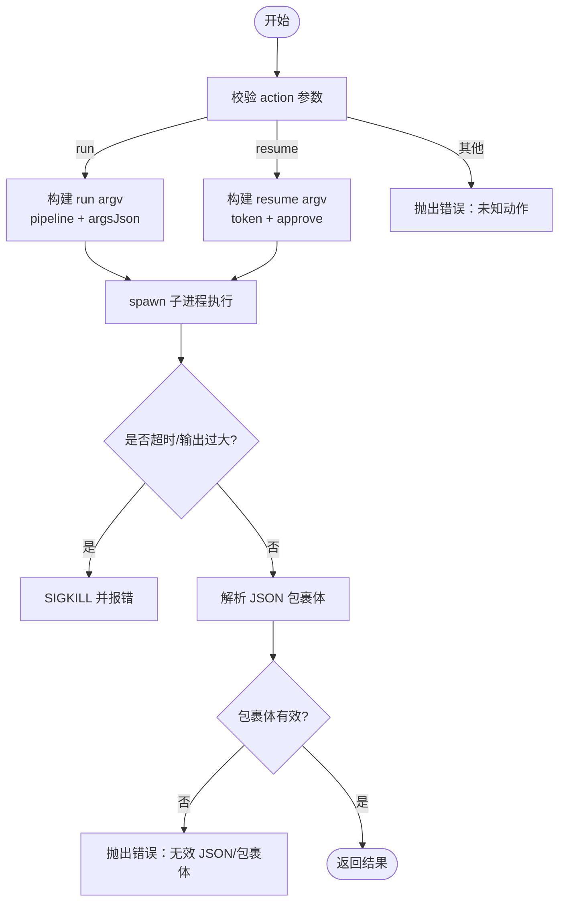
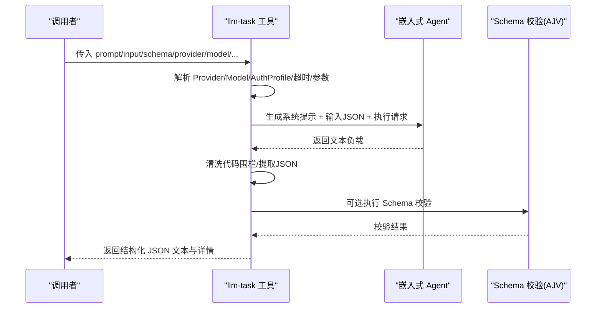
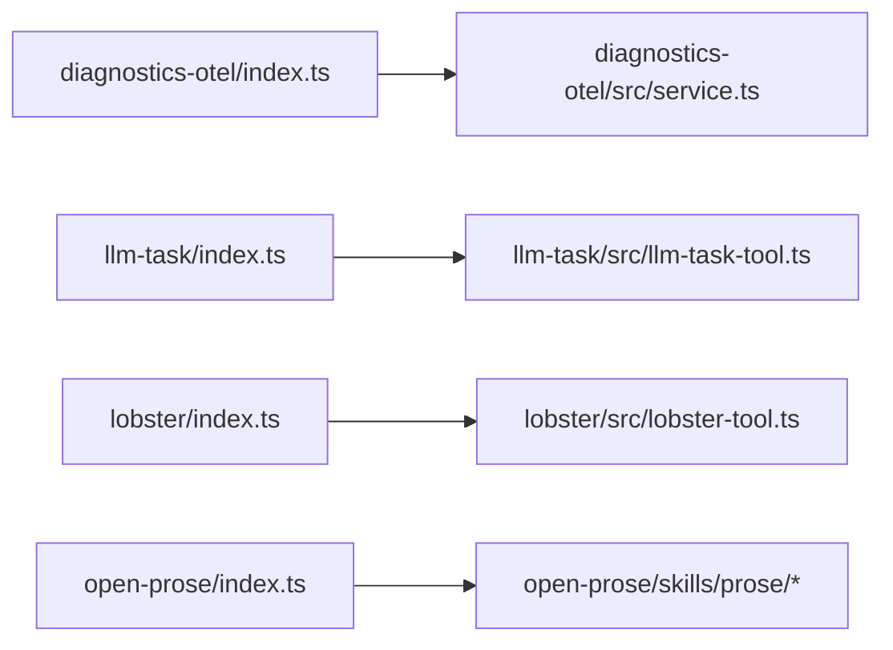

# 实用工具插件

<cite>
**本文引用的文件**
- [extensions/diagnostics-otel/openclaw.plugin.json](file://extensions/diagnostics-otel/openclaw.plugin.json)
- [extensions/diagnostics-otel/index.ts](file://extensions/diagnostics-otel/index.ts)
- [extensions/diagnostics-otel/src/service.ts](file://extensions/diagnostics-otel/src/service.ts)
- [extensions/llm-task/openclaw.plugin.json](file://extensions/llm-task/openclaw.plugin.json)
- [extensions/llm-task/index.ts](file://extensions/llm-task/index.ts)
- [extensions/llm-task/src/llm-task-tool.ts](file://extensions/llm-task/src/llm-task-tool.ts)
- [extensions/lobster/openclaw.plugin.json](file://extensions/lobster/openclaw.plugin.json)
- [extensions/lobster/index.ts](file://extensions/lobster/index.ts)
- [extensions/lobster/src/lobster-tool.ts](file://extensions/lobster/src/lobster-tool.ts)
- [extensions/open-prose/openclaw.plugin.json](file://extensions/open-prose/openclaw.plugin.json)
- [extensions/open-prose/index.ts](file://extensions/open-prose/index.ts)
- [extensions/open-prose/skills/prose/](file://extensions/open-prose/skills/prose/)
</cite>

## 目录

1. [简介](#简介)
2. [项目结构](#项目结构)
3. [核心组件](#核心组件)
4. [架构总览](#架构总览)
5. [组件详解](#组件详解)
6. [依赖关系分析](#依赖关系分析)
7. [性能与可靠性](#性能与可靠性)
8. [故障排查指南](#故障排查指南)
9. [结论](#结论)
10. [附录：配置与使用示例](#附录配置与使用示例)

## 简介

本文件系统性梳理 OpenClaw 的四类实用工具插件：诊断监控（Diagnostics OpenTelemetry）、Lobster 工作流工具、LLM 任务工具以及 OpenProse 文本生成与编辑技能包。内容覆盖功能特性、OTEL 集成与指标体系、自动化工作流与审批恢复、智能调度与参数约束、文本生成与编辑能力，并提供配置项、使用示例与集成指南，帮助开发者与运维人员快速落地。

## 项目结构

四个插件均采用标准 OpenClaw 插件目录结构：根目录包含 openclaw.plugin.json（声明插件元数据与配置模式）与入口 index.ts（注册服务或工具），部分插件在 src 下提供实现模块。

图表来源

- [extensions/diagnostics-otel/openclaw.plugin.json](file://extensions/diagnostics-otel/openclaw.plugin.json#L1-L9)
- [extensions/diagnostics-otel/index.ts](file://extensions/diagnostics-otel/index.ts#L1-L16)
- [extensions/diagnostics-otel/src/service.ts](file://extensions/diagnostics-otel/src/service.ts#L1-L634)
- [extensions/llm-task/openclaw.plugin.json](file://extensions/llm-task/openclaw.plugin.json#L1-L22)
- [extensions/llm-task/index.ts](file://extensions/llm-task/index.ts#L1-L7)
- [extensions/llm-task/src/llm-task-tool.ts](file://extensions/llm-task/src/llm-task-tool.ts#L1-L250)
- [extensions/lobster/openclaw.plugin.json](file://extensions/lobster/openclaw.plugin.json#L1-L11)
- [extensions/lobster/index.ts](file://extensions/lobster/index.ts#L1-L19)
- [extensions/lobster/src/lobster-tool.ts](file://extensions/lobster/src/lobster-tool.ts#L1-L330)
- [extensions/open-prose/openclaw.plugin.json](file://extensions/open-prose/openclaw.plugin.json#L1-L12)
- [extensions/open-prose/index.ts](file://extensions/open-prose/index.ts#L1-L6)
- [extensions/open-prose/skills/prose/](file://extensions/open-prose/skills/prose/)

章节来源

- [extensions/diagnostics-otel/openclaw.plugin.json](file://extensions/diagnostics-otel/openclaw.plugin.json#L1-L9)
- [extensions/llm-task/openclaw.plugin.json](file://extensions/llm-task/openclaw.plugin.json#L1-L22)
- [extensions/lobster/openclaw.plugin.json](file://extensions/lobster/openclaw.plugin.json#L1-L11)
- [extensions/open-prose/openclaw.plugin.json](file://extensions/open-prose/openclaw.plugin.json#L1-L12)

## 核心组件

- 诊断监控插件（Diagnostics OpenTelemetry）
  - 功能：将 OpenClaw 内部诊断事件导出到 OpenTelemetry，支持追踪、指标与日志三类数据；通过环境变量与配置项控制协议、端点、采样率、刷新间隔等。
  - 关键点：按事件类型统计计数器与直方图，必要时附加追踪 Span；日志传输层将内部日志桥接到 OTLP/HTTP 日志导出器。
- Lobster 工具插件
  - 功能：以本地子进程方式运行 Lobster 工作流引擎，支持“运行”和“恢复”两类动作；具备工作目录沙箱校验、可选超时与输出大小限制、跨平台兼容（含 Windows 脚本包装）。
  - 关键点：严格限制可执行路径来源，防止任意命令注入；解析 JSON 包裹体作为统一返回格式。
- LLM 任务插件
  - 功能：面向编排的通用 JSON-only LLM 工具，支持参数化 Provider/Model/AuthProfile/温度/最大 Token/超时；可选 JSON Schema 校验；内部通过嵌入式 Agent 执行并清洗输出。
  - 关键点：默认系统提示限定仅返回 JSON；支持对返回值进行 AJV Schema 校验；允许白名单模型策略。
- OpenProse 技能包
  - 功能：随插件分发的文本生成与编辑技能集合，提供多种工作流范式与示例，涵盖研究、总结、代码审查、迭代优化、并行流水线等。
  - 关键点：通过 openclaw.plugin.json 声明 skills 目录，插件加载后由平台自动发现并注册。

章节来源

- [extensions/diagnostics-otel/src/service.ts](file://extensions/diagnostics-otel/src/service.ts#L42-L121)
- [extensions/lobster/src/lobster-tool.ts](file://extensions/lobster/src/lobster-tool.ts#L232-L329)
- [extensions/llm-task/src/llm-task-tool.ts](file://extensions/llm-task/src/llm-task-tool.ts#L69-L249)
- [extensions/open-prose/openclaw.plugin.json](file://extensions/open-prose/openclaw.plugin.json#L1-L12)

## 架构总览

下图展示插件在 OpenClaw 运行时中的角色与交互：插件入口负责注册服务或工具；服务侧订阅诊断事件并导出至 OTEL；工具侧接收参数并调用底层执行器（子进程或嵌入式 Agent）。

图表来源

- [extensions/diagnostics-otel/index.ts](file://extensions/diagnostics-otel/index.ts#L10-L12)
- [extensions/diagnostics-otel/src/service.ts](file://extensions/diagnostics-otel/src/service.ts#L573-L612)
- [extensions/llm-task/index.ts](file://extensions/llm-task/index.ts#L4-L6)
- [extensions/llm-task/src/llm-task-tool.ts](file://extensions/llm-task/src/llm-task-tool.ts#L183-L199)
- [extensions/lobster/index.ts](file://extensions/lobster/index.ts#L8-L18)
- [extensions/lobster/src/lobster-tool.ts](file://extensions/lobster/src/lobster-tool.ts#L313-L319)

## 组件详解

### 诊断监控插件（Diagnostics OpenTelemetry）

- OTEL 集成
  - 支持协议与端点：优先使用配置项，其次回退到环境变量；自动规范化端点并拼接 v1/traces、v1/metrics、v1/logs 路径。
  - 协议限制：当前仅支持 http/protobuf；不支持则记录警告并跳过初始化。
  - 采样策略：基于 ParentBased + TraceIdRatioBasedSampler，采样率需在 [0,1]。
  - 指标与日志：启用时创建 Counter/Histogram 并注册 OTLP 导出器；日志传输层将内部日志映射为 OTel 日志并批量发送。
- 性能监控
  - 指标维度覆盖：token 使用、成本估算、消息处理时延、队列深度/等待时延、会话卡住状态与年龄、Webhook 接收/处理/错误等。
  - 追踪 Span：在需要时为关键事件创建带属性的 Span，并在错误场景设置 Span 状态。
- 日志收集
  - 将内部日志对象转换为 OTLP 日志记录，提取级别、位置信息、绑定键值等，确保可观测性一致。

图表来源

- [extensions/diagnostics-otel/src/service.ts](file://extensions/diagnostics-otel/src/service.ts#L50-L121)
- [extensions/diagnostics-otel/src/service.ts](file://extensions/diagnostics-otel/src/service.ts#L208-L323)
- [extensions/diagnostics-otel/src/service.ts](file://extensions/diagnostics-otel/src/service.ts#L573-L612)

章节来源

- [extensions/diagnostics-otel/openclaw.plugin.json](file://extensions/diagnostics-otel/openclaw.plugin.json#L1-L9)
- [extensions/diagnostics-otel/index.ts](file://extensions/diagnostics-otel/index.ts#L1-L16)
- [extensions/diagnostics-otel/src/service.ts](file://extensions/diagnostics-otel/src/service.ts#L1-L634)

### Lobster 工具插件

- 自动化任务处理
  - 动作模型：run（指定 pipeline 与 argsJson）与 resume（携带 token 与 approve）两类；其余动作视为非法。
  - 安全约束：禁止从参数中指定可执行路径；若宿主需要自定义二进制，应通过插件配置项提供。
  - 工作目录：仅允许相对路径且必须位于网关工作目录内，防止越权访问。
- 子进程执行与容错
  - 超时与输出上限：默认超时 20 秒，输出字节上限 512KB；超出触发终止并报错。
  - 跨平台兼容：Windows 上对脚本包装的特殊错误码进行兜底重试（使用 shell 启动）。
  - 返回解析：严格解析 JSON 包裹体（Envelope），支持尾部容错解析；非 JSON 或无效包裹体直接报错。
- 审批与恢复
  - 返回体包含状态（ok/needs_approval/cancelled）与可选审批请求信息（prompt/items/resumeToken），便于上层工作流恢复。

图表来源

- [extensions/lobster/src/lobster-tool.ts](file://extensions/lobster/src/lobster-tool.ts#L259-L329)
- [extensions/lobster/src/lobster-tool.ts](file://extensions/lobster/src/lobster-tool.ts#L99-L192)
- [extensions/lobster/src/lobster-tool.ts](file://extensions/lobster/src/lobster-tool.ts#L194-L230)

章节来源

- [extensions/lobster/openclaw.plugin.json](file://extensions/lobster/openclaw.plugin.json#L1-L11)
- [extensions/lobster/index.ts](file://extensions/lobster/index.ts#L1-L19)
- [extensions/lobster/src/lobster-tool.ts](file://extensions/lobster/src/lobster-tool.ts#L1-L330)

### LLM 任务插件

- 智能调度与参数解析
  - Provider/Model/AuthProfile 解析优先级：参数 > 插件配置 > 全局默认；最终形成 provider/model 键用于白名单校验。
  - 温度与最大 Token：支持参数级覆盖，否则回退到插件配置或全局默认。
  - 超时控制：参数 > 插件配置 > 默认 30 秒。
- 执行流程
  - 系统提示：强制 JSON-only 输出，禁止工具调用与 Markdown 包裹。
  - 输入序列化：将输入转为 JSON 字符串；非 JSON 可序列化对象直接报错。
  - 嵌入式执行：通过内部嵌入式 Agent 执行，收集文本负载并清洗代码围栏。
  - Schema 校验：可选 AJV 校验，失败时汇总错误路径与信息。
- 安全与隔离
  - 禁用工具调用，避免副作用；临时目录清理，防止残留。

图表来源

- [extensions/llm-task/src/llm-task-tool.ts](file://extensions/llm-task/src/llm-task-tool.ts#L91-L247)

章节来源

- [extensions/llm-task/openclaw.plugin.json](file://extensions/llm-task/openclaw.plugin.json#L1-L22)
- [extensions/llm-task/index.ts](file://extensions/llm-task/index.ts#L1-L7)
- [extensions/llm-task/src/llm-task-tool.ts](file://extensions/llm-task/src/llm-task-tool.ts#L1-L250)

### OpenProse 文本生成与编辑能力

- 技能包结构
  - 通过 openclaw.plugin.json 声明 skills 目录，插件加载后由平台自动发现并注册技能。
  - 技能覆盖范围广泛：示例工作流（研究、总结、代码审查、并行流水线等）、基础库（成本分析、错误取证、项目记忆等）、状态存储（文件系统/内存/数据库）等。
- 使用场景
  - 适合需要结构化文本生成与多阶段编辑的场景，如需求文档撰写、技术评审、知识沉淀、自动化 PR Review 等。
- 与工作流集成
  - 可与 Lobster 工具配合，将 OpenProse 作为工作流中的一个步骤，实现“生成—审阅—修订—发布”的闭环。

章节来源

- [extensions/open-prose/openclaw.plugin.json](file://extensions/open-prose/openclaw.plugin.json#L1-L12)
- [extensions/open-prose/index.ts](file://extensions/open-prose/index.ts#L1-L6)
- [extensions/open-prose/skills/prose/](file://extensions/open-prose/skills/prose/)

## 依赖关系分析

- 插件入口与实现
  - diagnostics-otel：index.ts 注册服务，service.ts 提供 OTEL 导出与事件处理。
  - llm-task：index.ts 注册工具，llm-task-tool.ts 提供执行逻辑与参数校验。
  - lobster：index.ts 注册工具，lobster-tool.ts 提供子进程执行与安全校验。
  - open-prose：index.ts 留空（技能由插件分发），skills 目录由平台自动发现。
- 外部依赖
  - OTEL SDK/导出器：用于追踪、指标与日志导出。
  - TypeBox/AJV：用于参数 Schema 定义与 JSON Schema 校验。
  - Node 子进程与文件系统：用于 Lobster 子进程与临时目录管理。

图表来源

- [extensions/diagnostics-otel/index.ts](file://extensions/diagnostics-otel/index.ts#L1-L16)
- [extensions/diagnostics-otel/src/service.ts](file://extensions/diagnostics-otel/src/service.ts#L1-L634)
- [extensions/llm-task/index.ts](file://extensions/llm-task/index.ts#L1-L7)
- [extensions/llm-task/src/llm-task-tool.ts](file://extensions/llm-task/src/llm-task-tool.ts#L1-L250)
- [extensions/lobster/index.ts](file://extensions/lobster/index.ts#L1-L19)
- [extensions/lobster/src/lobster-tool.ts](file://extensions/lobster/src/lobster-tool.ts#L1-L330)
- [extensions/open-prose/index.ts](file://extensions/open-prose/index.ts#L1-L6)

## 性能与可靠性

- OTEL 指标与直方图
  - 涵盖 token 使用、成本估算、消息处理时延、队列深度/等待、会话卡住状态与年龄、Webhook 接收/处理/错误等，便于定位瓶颈与异常。
- 子进程与执行器
  - Lobster 工具设置超时与输出上限，避免资源耗尽；Windows 场景下的脚本包装兜底提升稳定性。
- LLM 任务
  - 默认超时与禁用工具调用降低风险；Schema 校验保障下游消费一致性。

[本节为通用建议，无需列出章节来源]

## 故障排查指南

- 诊断监控插件
  - 症状：未见指标或日志导出
  - 排查：确认配置中 diagnostics.otel.enabled 与 traces/metrics/logs 开关；检查 OTEL_EXPORTER_OTLP_PROTOCOL/ENDPOINT 是否正确；核对 flushIntervalMs 设置。
  - 参考：[service.ts 中的启动与导出逻辑](file://extensions/diagnostics-otel/src/service.ts#L50-L121)
- Lobster 工具
  - 症状：子进程失败或超时
  - 排查：检查 lobsterPath 是否为绝对路径且可执行；确认 cwd 在网关工作目录范围内；查看 stderr 与超时/输出上限阈值。
  - 参考：[lobster-tool.ts 的路径与工作目录校验、超时与输出限制](file://extensions/lobster/src/lobster-tool.ts#L24-L84), [extensions/lobster/src/lobster-tool.ts](file://extensions/lobster/src/lobster-tool.ts#L109-L174)
- LLM 任务
  - 症状：返回为空或非 JSON
  - 排查：确认系统提示生效、输入可 JSON 序列化；检查 Schema 是否严格导致校验失败；必要时放宽或修正 Schema。
  - 参考：[llm-task-tool.ts 的执行与校验流程](file://extensions/llm-task/src/llm-task-tool.ts#L177-L247)

章节来源

- [extensions/diagnostics-otel/src/service.ts](file://extensions/diagnostics-otel/src/service.ts#L50-L121)
- [extensions/lobster/src/lobster-tool.ts](file://extensions/lobster/src/lobster-tool.ts#L24-L84)
- [extensions/lobster/src/lobster-tool.ts](file://extensions/lobster/src/lobster-tool.ts#L109-L174)
- [extensions/llm-task/src/llm-task-tool.ts](file://extensions/llm-task/src/llm-task-tool.ts#L177-L247)

## 结论

四个实用工具插件分别覆盖可观测性、自动化工作流、结构化 LLM 编排与文本生成编辑能力。通过标准化的插件接口与严格的参数/安全约束，它们能够稳定地融入 OpenClaw 生态，满足从诊断监控到复杂文本工作流的多样化需求。

[本节为总结性内容，无需列出章节来源]

## 附录：配置与使用示例

### 诊断监控插件（OTEL）

- 配置要点
  - diagnostics.otel.enabled：启用导出
  - diagnostics.otel.protocol：http/protobuf（当前唯一支持）
  - diagnostics.otel.endpoint：OTEL 收集端地址（末尾斜杠会被清理）
  - diagnostics.otel.headers：可选请求头
  - diagnostics.otel.serviceName：服务名，默认 openclaw
  - diagnostics.otel.sampleRate：采样率 [0,1]
  - diagnostics.otel.flushIntervalMs：刷新间隔毫秒
  - diagnostics.otel.traces/metrics/logs：开关三选一或全开
- 环境变量回退
  - OTEL_EXPORTER_OTLP_PROTOCOL/OTEL_EXPORTER_OTLP_ENDPOINT/OTEL_SERVICE_NAME
- 使用示例
  - 在配置中开启 logs 并设置 endpoint，即可将内部日志与诊断事件导出至 OTEL；结合 traces/metrics 可获得完整的可观测视图。

章节来源

- [extensions/diagnostics-otel/openclaw.plugin.json](file://extensions/diagnostics-otel/openclaw.plugin.json#L1-L9)
- [extensions/diagnostics-otel/src/service.ts](file://extensions/diagnostics-otel/src/service.ts#L50-L121)

### Lobster 工具插件

- 配置要点
  - 插件配置项（pluginConfig）可设置 lobsterPath（指向 Lobster 可执行文件的绝对路径）
- 使用示例
  - run 动作：提供 pipeline 与 argsJson；resume 动作：提供 token 与 approve（true/false）
  - cwd 必须为相对路径且位于网关工作目录内
- 注意事项
  - 不要从参数传入 lobsterPath；如需自定义二进制，请在插件配置中设置

章节来源

- [extensions/lobster/openclaw.plugin.json](file://extensions/lobster/openclaw.plugin.json#L1-L11)
- [extensions/lobster/src/lobster-tool.ts](file://extensions/lobster/src/lobster-tool.ts#L232-L329)

### LLM 任务插件

- 配置要点
  - defaultProvider/defaultModel/defaultAuthProfileId：默认 Provider/Model/AuthProfile
  - allowedModels：允许的 provider/model 白名单（如 ["openai-codex/gpt-5.2"]）
  - maxTokens/timeoutMs：默认最大 Token 与超时
- 使用示例
  - 传入 prompt 与可选 input/schema/provider/model/authProfileId/temperature/maxTokens/timeoutMs
  - 若提供 schema，则返回 JSON 将被校验
- 注意事项
  - 系统提示保证仅返回 JSON；请确保输入可序列化为 JSON

章节来源

- [extensions/llm-task/openclaw.plugin.json](file://extensions/llm-task/openclaw.plugin.json#L1-L22)
- [extensions/llm-task/src/llm-task-tool.ts](file://extensions/llm-task/src/llm-task-tool.ts#L69-L249)

### OpenProse 技能包

- 配置要点
  - openclaw.plugin.json 中声明 skills 目录，插件加载后平台自动发现
- 使用示例
  - 在工作流中调用 /prose 相关技能，参考 skills/prose/examples 下的示例工作流
- 注意事项
  - 技能包随插件分发，无需额外安装

章节来源

- [extensions/open-prose/openclaw.plugin.json](file://extensions/open-prose/openclaw.plugin.json#L1-L12)
- [extensions/open-prose/index.ts](file://extensions/open-prose/index.ts#L1-L6)
- [extensions/open-prose/skills/prose/](file://extensions/open-prose/skills/prose/)
