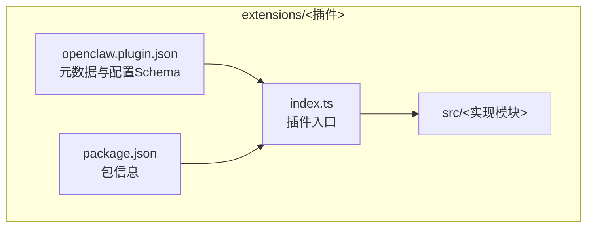
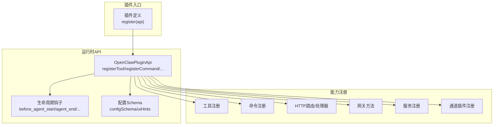
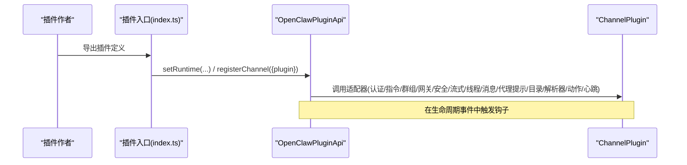
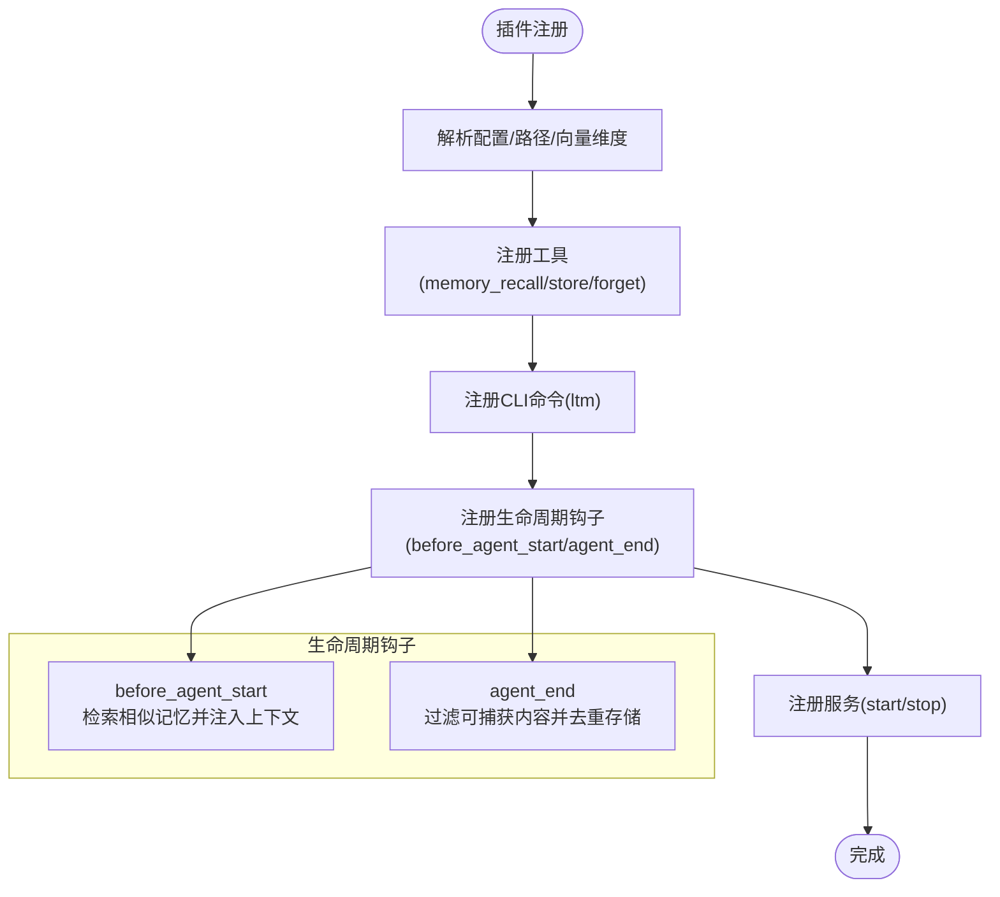
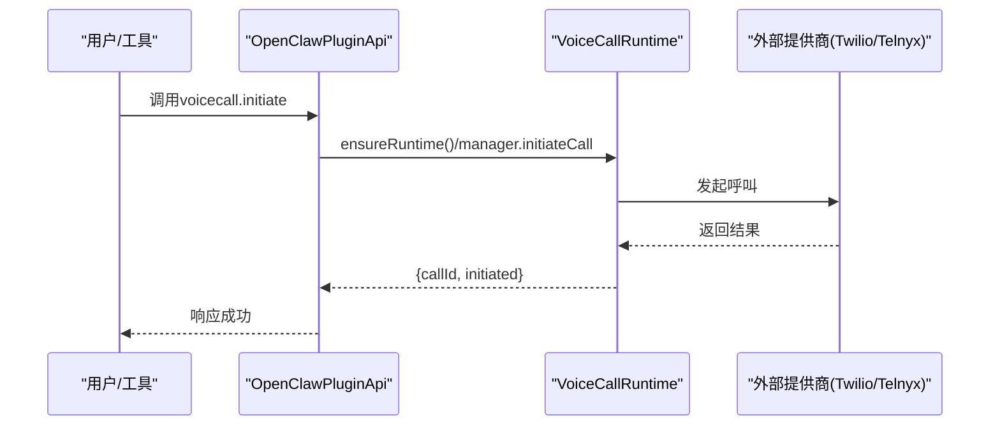
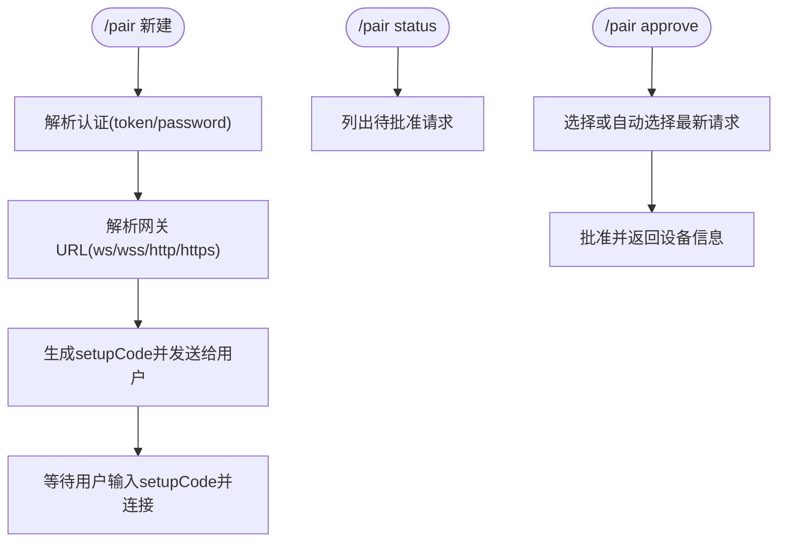
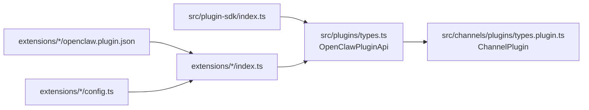

# 扩展模块结构

<cite>
**本文引用的文件**
- [extensions/](file://extensions/)
- [extensions/discord/index.ts](file://extensions/discord/index.ts)
- [extensions/telegram/index.ts](file://extensions/telegram/index.ts)
- [extensions/memory-lancedb/index.ts](file://extensions/memory-lancedb/index.ts)
- [extensions/memory-lancedb/openclaw.plugin.json](file://extensions/memory-lancedb/openclaw.plugin.json)
- [extensions/memory-lancedb/config.ts](file://extensions/memory-lancedb/config.ts)
- [extensions/voice-call/index.ts](file://extensions/voice-call/index.ts)
- [extensions/device-pair/index.ts](file://extensions/device-pair/index.ts)
- [extensions/device-pair/openclaw.plugin.json](file://extensions/device-pair/openclaw.plugin.json)
- [src/plugin-sdk/index.ts](file://src/plugin-sdk/index.ts)
- [src/plugins/types.ts](file://src/plugins/types.ts)
- [src/channels/plugins/types.plugin.ts](file://src/channels/plugins/types.plugin.ts)
</cite>

## 目录

1. [简介](#简介)
2. [项目结构](#项目结构)
3. [核心组件](#核心组件)
4. [架构总览](#架构总览)
5. [详细组件分析](#详细组件分析)
6. [依赖关系分析](#依赖关系分析)
7. [性能考量](#性能考量)
8. [故障排查指南](#故障排查指南)
9. [结论](#结论)
10. [附录](#附录)

## 简介

本文件面向OpenClaw扩展模块（extensions/）的开发者与维护者，系统化梳理插件系统的组织架构、开发规范与部署流程，并对消息渠道、AI工具、系统集成等类型插件的结构差异与实现模式进行深入说明。文档同时覆盖插件API接口、生命周期管理、配置系统、版本与依赖解析、兼容性保障机制，以及开发最佳实践、测试策略与性能优化建议。

## 项目结构

extensions/目录按“功能域”组织插件，每个子目录通常包含：

- index.ts：插件入口，导出插件定义并注册到OpenClaw运行时
- openclaw.plugin.json：插件元数据与配置Schema
- package.json：包信息（部分插件）
- src/：可选的源码目录（如需要拆分实现）

典型插件目录布局示意如下：

图表来源

- [extensions/discord/index.ts](file://extensions/discord/index.ts#L1-L18)
- [extensions/telegram/index.ts](file://extensions/telegram/index.ts#L1-L18)
- [extensions/memory-lancedb/openclaw.plugin.json](file://extensions/memory-lancedb/openclaw.plugin.json#L1-L61)

章节来源

- [extensions/](file://extensions/)

## 核心组件

OpenClaw插件系统的核心由以下几类组件构成：

- 插件SDK与API：统一的插件注册与交互接口，涵盖工具、命令、HTTP路由、网关方法、服务、通道插件等
- 插件类型与钩子：定义插件生命周期钩子（如agent开始前、工具调用前后、会话开始/结束等），支持上下文注入与结果修改
- 通道插件（ChannelPlugin）：面向消息渠道的适配器集合，抽象认证、指令、群组、网关、安全、流式传输、线程、消息、代理提示、目录、解析器、动作、心跳等能力
- 配置Schema与UI提示：通过JSON Schema与UI提示描述插件配置项，支持敏感字段、占位符、高级选项等
- 生命周期与服务：插件可注册服务，在系统启动/停止阶段执行初始化/清理逻辑

章节来源

- [src/plugin-sdk/index.ts](file://src/plugin-sdk/index.ts#L1-L392)
- [src/plugins/types.ts](file://src/plugins/types.ts#L244-L283)
- [src/plugins/types.ts](file://src/plugins/types.ts#L298-L529)
- [src/channels/plugins/types.plugin.ts](file://src/channels/plugins/types.plugin.ts#L48-L84)

## 架构总览

OpenClaw插件系统采用“插件定义 + 运行时注册”的架构。插件在register回调中通过OpenClawPluginApi向运行时注册各类能力；运行时在相应生命周期事件中触发钩子或调用适配器，实现消息渠道、AI工具、系统服务等功能。

图表来源

- [src/plugins/types.ts](file://src/plugins/types.ts#L244-L283)
- [src/plugins/types.ts](file://src/plugins/types.ts#L298-L529)
- [src/plugin-sdk/index.ts](file://src/plugin-sdk/index.ts#L75-L78)

## 详细组件分析

### 消息渠道插件（以Discord、Telegram为例）

消息渠道插件通过ChannelPlugin适配器集合对接具体平台，典型职责包括：

- 认证与账户解析
- 指令处理与群组管理
- 网关方法与安全策略
- 流式传输、线程、消息收发
- 目录解析与提及策略

实现要点

- 插件入口仅负责设置运行时与注册通道插件
- 通道插件定义在src/目录内，暴露统一的适配器接口
- 通过OpenClawPluginApi.registerChannel完成注册

图表来源

- [extensions/discord/index.ts](file://extensions/discord/index.ts#L1-L18)
- [extensions/telegram/index.ts](file://extensions/telegram/index.ts#L1-L18)
- [src/channels/plugins/types.plugin.ts](file://src/channels/plugins/types.plugin.ts#L48-L84)

章节来源

- [extensions/discord/index.ts](file://extensions/discord/index.ts#L1-L18)
- [extensions/telegram/index.ts](file://extensions/telegram/index.ts#L1-L18)
- [src/channels/plugins/types.plugin.ts](file://src/channels/plugins/types.plugin.ts#L48-L84)

### AI工具与长短期记忆插件（以Memory LanceDB为例）

Memory LanceDB插件展示了“工具 + 生命周期钩子 + CLI + 服务”的完整实现模式：

- 工具：提供记忆检索、存储、遗忘等工具，参数使用TypeBox校验
- 生命周期钩子：在agent开始前自动注入相关记忆，在agent结束后自动捕获重要信息
- CLI：提供ltm命令族用于查询统计
- 服务：在系统启动/停止阶段初始化/释放资源

图表来源

- [extensions/memory-lancedb/index.ts](file://extensions/memory-lancedb/index.ts#L242-L627)
- [extensions/memory-lancedb/config.ts](file://extensions/memory-lancedb/config.ts#L86-L140)

章节来源

- [extensions/memory-lancedb/index.ts](file://extensions/memory-lancedb/index.ts#L1-L627)
- [extensions/memory-lancedb/openclaw.plugin.json](file://extensions/memory-lancedb/openclaw.plugin.json#L1-L61)
- [extensions/memory-lancedb/config.ts](file://extensions/memory-lancedb/config.ts#L1-L140)

### 系统集成插件（以Voice Call为例）

Voice Call插件展示了复杂系统集成的实现要点：

- 多提供商支持（Twilio、Telnyx、Mock），配置Schema与UI提示完善
- 网关方法：提供initiate/continue/speak/end/status等RPC
- 工具封装：统一的工具参数Schema，便于在对话中直接调用
- CLI：提供语音通话相关的命令
- 服务：启动时确保运行时可用，停止时释放资源

图表来源

- [extensions/voice-call/index.ts](file://extensions/voice-call/index.ts#L192-L345)

章节来源

- [extensions/voice-call/index.ts](file://extensions/voice-call/index.ts#L1-L513)

### 设备配对插件（以Device Pair为例）

Device Pair插件展示了“命令 + 动态URL解析 + 权限认证 + 安全绑定”的实现模式：

- 命令：/pair status/approve/new，支持多请求场景
- URL解析：优先publicUrl，其次Tailscale Serve/Funnel，再回退到本地绑定
- 权限解析：支持token/password两种模式，优先环境变量
- 安全绑定：根据gateway.bind策略选择loopback/LAN/Tailnet/自定义
- Telegram特例：拆分为两条消息以提升兼容性

图表来源

- [extensions/device-pair/index.ts](file://extensions/device-pair/index.ts#L379-L499)
- [extensions/device-pair/openclaw.plugin.json](file://extensions/device-pair/openclaw.plugin.json#L1-L21)

章节来源

- [extensions/device-pair/index.ts](file://extensions/device-pair/index.ts#L1-L500)
- [extensions/device-pair/openclaw.plugin.json](file://extensions/device-pair/openclaw.plugin.json#L1-L21)

## 依赖关系分析

插件系统的关键依赖关系如下：

- 插件入口依赖OpenClawPluginApi（来自plugin-sdk），通过register方法注册工具、命令、HTTP、网关方法、服务、通道插件
- 通道插件依赖ChannelPlugin类型定义，统一适配器接口
- 配置Schema与UI提示由插件元数据（openclaw.plugin.json）与插件内部configSchema共同定义
- 生命周期钩子由运行时触发，插件通过on/hook API订阅

图表来源

- [src/plugin-sdk/index.ts](file://src/plugin-sdk/index.ts#L1-L392)
- [src/plugins/types.ts](file://src/plugins/types.ts#L244-L283)
- [src/channels/plugins/types.plugin.ts](file://src/channels/plugins/types.plugin.ts#L48-L84)
- [extensions/discord/index.ts](file://extensions/discord/index.ts#L1-L18)

章节来源

- [src/plugin-sdk/index.ts](file://src/plugin-sdk/index.ts#L1-L392)
- [src/plugins/types.ts](file://src/plugins/types.ts#L244-L283)
- [src/channels/plugins/types.plugin.ts](file://src/channels/plugins/types.plugin.ts#L48-L84)
- [extensions/discord/index.ts](file://extensions/discord/index.ts#L1-L18)

## 性能考量

- 延迟与并发
  - 网关方法与工具调用应避免阻塞主线程，必要时使用异步与超时控制
  - 对外API调用（如嵌入模型、第三方提供商）应设置合理超时与重试
- 存储与缓存
  - 内存/数据库访问应使用懒加载与连接池，避免重复初始化
  - 向量检索需考虑索引与阈值，减少无效匹配
- 日志与可观测性
  - 使用运行时提供的logger进行分级日志输出，避免敏感信息泄露
  - 对关键路径添加诊断事件与心跳上报
- 资源管理
  - 服务注册的stop回调必须释放资源（文件句柄、网络连接、进程等）
  - 生命周期钩子中的计算应尽量轻量化，避免影响主流程

## 故障排查指南

常见问题与定位思路

- 插件未生效
  - 检查openclaw.plugin.json是否正确声明id与配置Schema
  - 确认插件入口index.ts已导出插件定义并调用registerChannel/registerGatewayMethod等
- 配置错误
  - 使用configSchema.validate或safeParse进行预校验，关注uiHints中的敏感字段与占位符
  - 环境变量未设置导致解析失败（如${OPENAI_API_KEY}）
- 生命周期钩子异常
  - 捕获异常并记录警告，避免中断主流程
  - 检查钩子优先级与注册顺序
- 网关方法/工具调用失败
  - 统一返回{success:false, error}格式，便于上层处理
  - 对外部依赖（提供商API）增加降级与重试策略
- 设备配对失败
  - 核对URL解析策略（publicUrl、Tailscale、bind）与认证方式
  - 检查网络连通性与端口绑定

章节来源

- [extensions/memory-lancedb/index.ts](file://extensions/memory-lancedb/index.ts#L496-L521)
- [extensions/voice-call/index.ts](file://extensions/voice-call/index.ts#L188-L190)
- [extensions/device-pair/index.ts](file://extensions/device-pair/index.ts#L443-L446)

## 结论

OpenClaw扩展模块通过统一的插件SDK与ChannelPlugin抽象，实现了消息渠道、AI工具、系统集成等多类型插件的一致开发体验。借助完善的生命周期钩子、配置Schema与UI提示、服务注册与网关方法，插件能够在不侵入核心的情况下扩展能力。遵循本文的开发规范、测试策略与性能优化建议，可显著提升插件质量与稳定性。

## 附录

### 插件开发最佳实践

- 分层设计：将业务逻辑与SDK调用分离，便于测试与复用
- 参数校验：使用TypeBox或JSON Schema进行严格校验，提供清晰的uiHints
- 错误处理：统一错误响应格式，记录上下文信息，避免泄露敏感数据
- 文档与元数据：完善openclaw.plugin.json与README，明确用途、依赖与配置项
- 版本与兼容：遵循语义化版本，保留向后兼容的配置键，提供迁移指引

### 测试策略

- 单元测试：针对工具执行、配置解析、生命周期钩子进行隔离测试
- 集成测试：模拟网关方法调用、通道适配器行为与服务启动/停止
- 端到端测试：结合真实第三方提供商（如Twilio/Telnyx/OpenAI）进行验证
- 回归测试：在升级依赖或核心库时运行插件回归套件

### 部署与发布

- 包管理：遵循package.json与openclaw.plugin.json，确保依赖与元数据一致
- 配置管理：通过configSchema与环境变量实现灵活部署
- 兼容性：在多平台（macOS/Linux/Windows）与多Node版本上验证运行时行为
- 监控与诊断：启用诊断事件与日志传输，建立告警与排障流程
