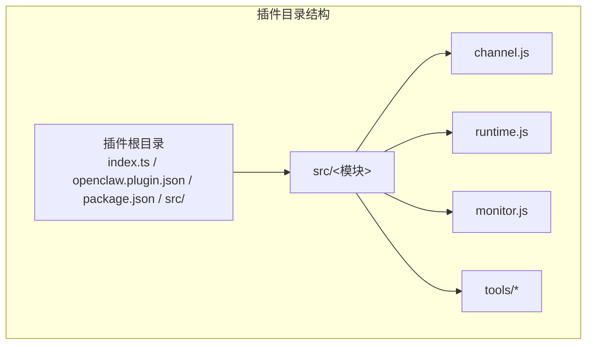
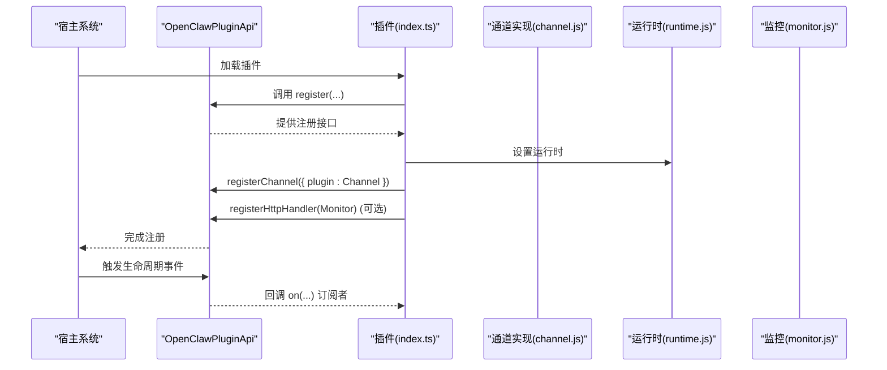
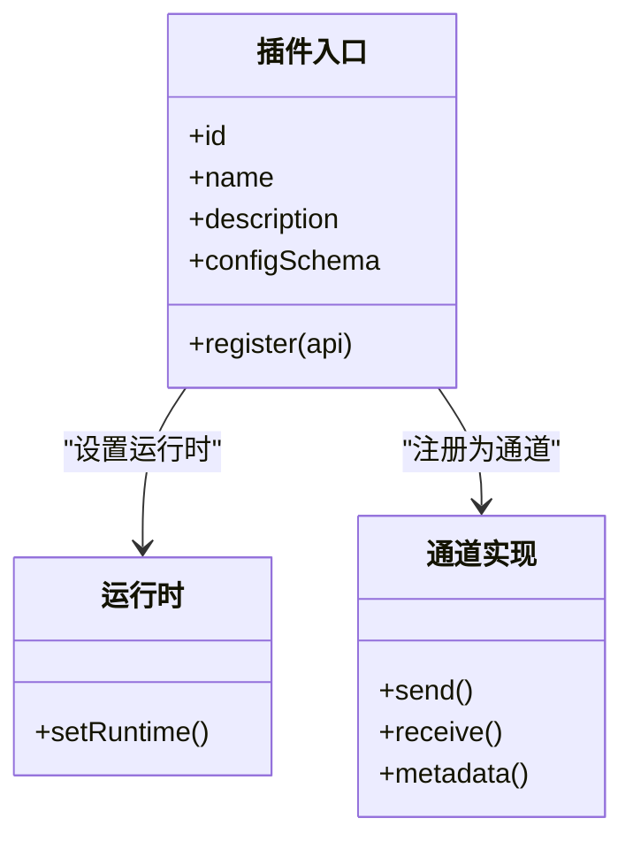
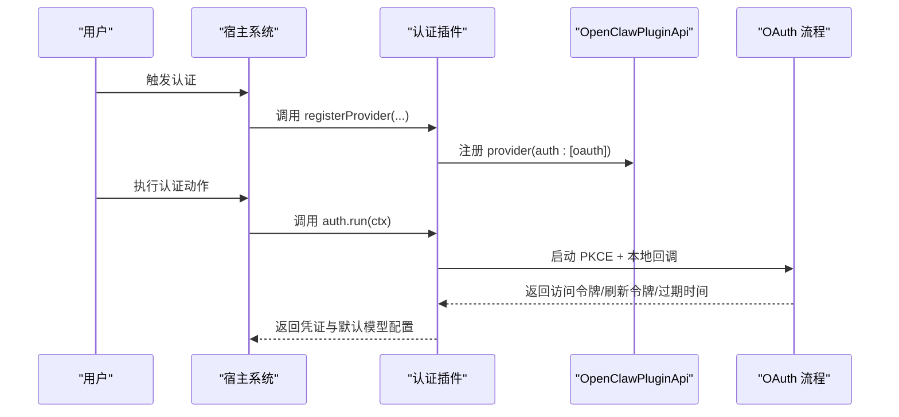
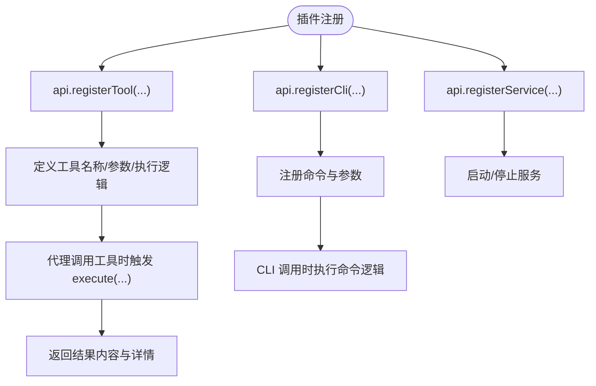
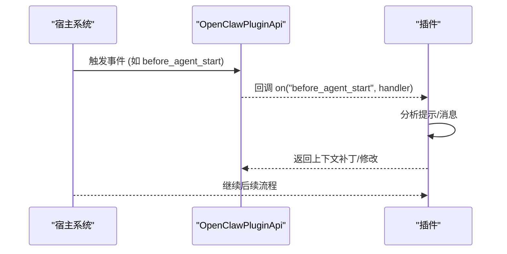
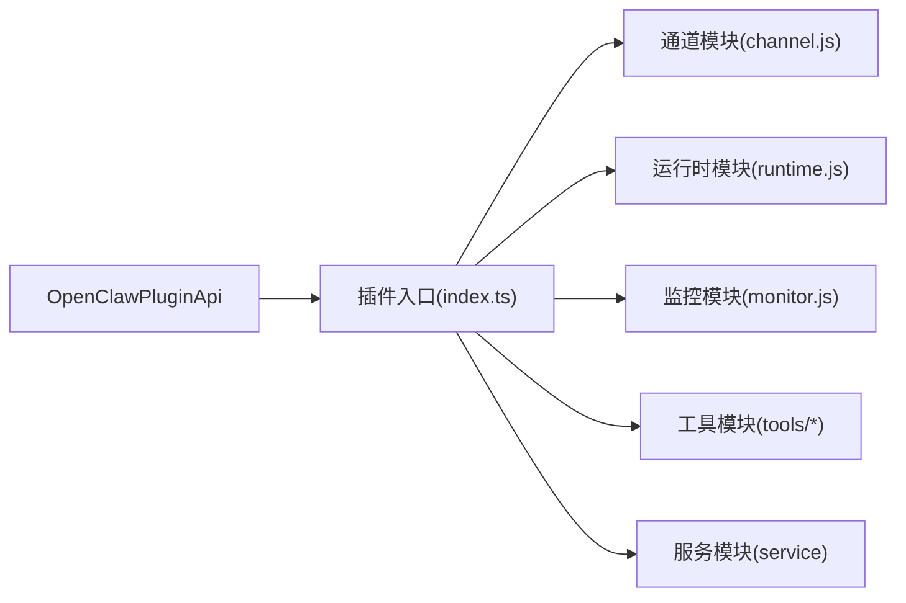

# 插件开发指南

<cite>
**本文引用的文件**
- [extensions/bluebubbles/openclaw.plugin.json](file://extensions/bluebubbles/openclaw.plugin.json)
- [extensions/discord/openclaw.plugin.json](file://extensions/discord/openclaw.plugin.json)
- [extensions/googlechat/openclaw.plugin.json](file://extensions/googlechat/openclaw.plugin.json)
- [extensions/telegram/openclaw.plugin.json](file://extensions/telegram/openclaw.plugin.json)
- [extensions/slack/openclaw.plugin.json](file://extensions/slack/openclaw.plugin.json)
- [extensions/matrix/openclaw.plugin.json](file://extensions/matrix/openclaw.plugin.json)
- [extensions/bluebubbles/index.ts](file://extensions/bluebubbles/index.ts)
- [extensions/discord/index.ts](file://extensions/discord/index.ts)
- [extensions/telegram/index.ts](file://extensions/telegram/index.ts)
- [extensions/slack/index.ts](file://extensions/slack/index.ts)
- [extensions/matrix/index.ts](file://extensions/matrix/index.ts)
- [extensions/feishu/index.ts](file://extensions/feishu/index.ts)
- [extensions/google-gemini-cli-auth/index.ts](file://extensions/google-gemini-cli-auth/index.ts)
- [extensions/memory-core/index.ts](file://extensions/memory-core/index.ts)
- [extensions/memory-lancedb/index.ts](file://extensions/memory-lancedb/index.ts)
- [extensions/llm-task/index.ts](file://extensions/llm-task/index.ts)
- [extensions/lobster/index.ts](file://extensions/lobster/index.ts)
</cite>

## 目录

1. [简介](#简介)
2. [项目结构](#项目结构)
3. [核心组件](#核心组件)
4. [架构总览](#架构总览)
5. [详细组件分析](#详细组件分析)
6. [依赖关系分析](#依赖关系分析)
7. [性能考虑](#性能考虑)
8. [故障排查指南](#故障排查指南)
9. [结论](#结论)
10. [附录](#附录)

## 简介

本指南面向希望在 OpenClaw 平台上开发插件的开发者，系统讲解插件开发的概念、流程与最佳实践；明确插件项目的标准结构（入口文件、配置文件、依赖管理）；梳理插件 API 接口规范、生命周期管理与事件处理机制；并通过多种类型插件（消息渠道、认证、工具）给出从简单到复杂的实现范式；最后提供调试技巧、测试策略与性能优化建议。

## 项目结构

OpenClaw 的插件以“扩展”形式组织在 extensions 目录下，每个插件通常包含以下要素：

- 入口文件：index.ts，导出插件对象，定义注册逻辑
- 配置文件：openclaw.plugin.json，声明插件标识、通道能力、配置模式等
- 依赖管理：package.json（部分插件示例中可见），用于声明运行时依赖
- 源码目录：src/ 下按功能拆分模块（如 channel、runtime、monitor、tools 等）

下面以几个代表性插件为例，展示标准结构与职责划分。

图表来源

- [extensions/bluebubbles/index.ts](file://extensions/bluebubbles/index.ts#L1-L20)
- [extensions/discord/index.ts](file://extensions/discord/index.ts#L1-L18)
- [extensions/telegram/index.ts](file://extensions/telegram/index.ts#L1-L18)
- [extensions/slack/index.ts](file://extensions/slack/index.ts#L1-L18)
- [extensions/matrix/index.ts](file://extensions/matrix/index.ts#L1-L18)
- [extensions/feishu/index.ts](file://extensions/feishu/index.ts#L1-L64)

章节来源

- [extensions/bluebubbles/openclaw.plugin.json](file://extensions/bluebubbles/openclaw.plugin.json#L1-L10)
- [extensions/discord/openclaw.plugin.json](file://extensions/discord/openclaw.plugin.json#L1-L10)
- [extensions/googlechat/openclaw.plugin.json](file://extensions/googlechat/openclaw.plugin.json#L1-L10)
- [extensions/telegram/openclaw.plugin.json](file://extensions/telegram/openclaw.plugin.json#L1-L10)
- [extensions/slack/openclaw.plugin.json](file://extensions/slack/openclaw.plugin.json#L1-L10)
- [extensions/matrix/openclaw.plugin.json](file://extensions/matrix/openclaw.plugin.json#L1-L10)

## 核心组件

- 插件入口（index.ts）
  - 导出一个具有 id、name、description、configSchema 和 register 方法的对象
  - 在 register 中通过 api 对象完成通道注册、HTTP 处理器注册、工具注册、CLI 注册、服务注册、生命周期钩子订阅等
- 插件清单（openclaw.plugin.json）
  - 声明插件 id、支持的通道列表、配置模式（JSON Schema）
- 插件 SDK
  - 提供 OpenClawPluginApi 接口，包含 registerChannel、registerTool、registerCli、registerService、on 等方法
  - 提供 emptyPluginConfigSchema 等辅助函数

章节来源

- [extensions/bluebubbles/index.ts](file://extensions/bluebubbles/index.ts#L1-L20)
- [extensions/discord/index.ts](file://extensions/discord/index.ts#L1-L18)
- [extensions/telegram/index.ts](file://extensions/telegram/index.ts#L1-L18)
- [extensions/slack/index.ts](file://extensions/slack/index.ts#L1-L18)
- [extensions/matrix/index.ts](file://extensions/matrix/index.ts#L1-L18)
- [extensions/feishu/index.ts](file://extensions/feishu/index.ts#L1-L64)

## 架构总览

OpenClaw 插件通过统一的 SDK 与宿主交互，遵循“声明式注册 + 生命周期钩子”的设计模式。下图展示了典型插件的调用链路与事件流。

图表来源

- [extensions/bluebubbles/index.ts](file://extensions/bluebubbles/index.ts#L12-L16)
- [extensions/discord/index.ts](file://extensions/discord/index.ts#L11-L14)
- [extensions/telegram/index.ts](file://extensions/telegram/index.ts#L11-L14)
- [extensions/slack/index.ts](file://extensions/slack/index.ts#L11-L14)
- [extensions/matrix/index.ts](file://extensions/matrix/index.ts#L11-L14)

## 详细组件分析

### 组件A：消息渠道插件（以 BlueBubbles、Discord、Telegram、Slack、Matrix 为例）

这些插件均通过 registerChannel 将自身作为通道注册到宿主，并可能注册 HTTP 处理器用于 Webhook 或外部回调。

图表来源

- [extensions/bluebubbles/index.ts](file://extensions/bluebubbles/index.ts#L7-L16)
- [extensions/discord/index.ts](file://extensions/discord/index.ts#L6-L14)
- [extensions/telegram/index.ts](file://extensions/telegram/index.ts#L6-L14)
- [extensions/slack/index.ts](file://extensions/slack/index.ts#L6-L14)
- [extensions/matrix/index.ts](file://extensions/matrix/index.ts#L6-L14)

实现要点

- 在 register 中调用 api.registerChannel({ plugin: 通道实现 }) 完成通道注册
- 若需要接收外部回调，使用 api.registerHttpHandler(handler) 注册 HTTP 处理器
- 使用 api.runtime 存取运行时上下文（如日志、工具、路径解析等）

章节来源

- [extensions/bluebubbles/index.ts](file://extensions/bluebubbles/index.ts#L1-L20)
- [extensions/discord/index.ts](file://extensions/discord/index.ts#L1-L18)
- [extensions/telegram/index.ts](file://extensions/telegram/index.ts#L1-L18)
- [extensions/slack/index.ts](file://extensions/slack/index.ts#L1-L18)
- [extensions/matrix/index.ts](file://extensions/matrix/index.ts#L1-L18)

### 组件B：认证插件（以 Google Gemini CLI Auth 为例）

认证插件通过 api.registerProvider 注册一个或多个认证方式（如 OAuth），并在运行时执行授权流程，返回凭证与默认模型配置。

图表来源

- [extensions/google-gemini-cli-auth/index.ts](file://extensions/google-gemini-cli-auth/index.ts#L24-L88)

实现要点

- 使用 api.registerProvider 注册 provider，包含 id、label、auth 列表（如 oauth）
- 在 auth.run 中实现授权流程，返回 profiles、configPatch、defaultModel 等
- 可通过 ctx.prompter、ctx.runtime.log 等上下文进行交互与日志输出

章节来源

- [extensions/google-gemini-cli-auth/index.ts](file://extensions/google-gemini-cli-auth/index.ts#L1-L93)

### 组件C：工具插件（以 Feishu、Memory Core、Memory LanceDB、LLM Task、Lobster 为例）

工具插件通过 api.registerTool 注册一个或多个工具，供代理在对话中调用；也可通过 api.registerCli 注册命令行子命令，或通过 api.registerService 注册后台服务。

图表来源

- [extensions/feishu/index.ts](file://extensions/feishu/index.ts#L47-L61)
- [extensions/memory-core/index.ts](file://extensions/memory-core/index.ts#L10-L35)
- [extensions/memory-lancedb/index.ts](file://extensions/memory-lancedb/index.ts#L242-L624)
- [extensions/llm-task/index.ts](file://extensions/llm-task/index.ts#L1-L7)
- [extensions/lobster/index.ts](file://extensions/lobster/index.ts#L1-L19)

实现要点

- 工具注册：定义工具名、标签、描述、参数 Schema、execute 执行逻辑
- CLI 注册：通过 api.registerCli 注册命令，绑定 action 或子命令
- 服务注册：通过 api.registerService 注册 start/stop 生命周期
- 可结合生命周期钩子（如 before_agent_start、agent_end）实现自动记忆召回与捕获

章节来源

- [extensions/feishu/index.ts](file://extensions/feishu/index.ts#L1-L64)
- [extensions/memory-core/index.ts](file://extensions/memory-core/index.ts#L1-L39)
- [extensions/memory-lancedb/index.ts](file://extensions/memory-lancedb/index.ts#L1-L627)
- [extensions/llm-task/index.ts](file://extensions/llm-task/index.ts#L1-L7)
- [extensions/lobster/index.ts](file://extensions/lobster/index.ts#L1-L19)

### 组件D：生命周期与事件处理

OpenClaw 插件可通过 api.on 订阅系统事件，在合适时机注入上下文或执行数据持久化等操作。

图表来源

- [extensions/memory-lancedb/index.ts](file://extensions/memory-lancedb/index.ts#L496-L521)

章节来源

- [extensions/memory-lancedb/index.ts](file://extensions/memory-lancedb/index.ts#L490-L606)

## 依赖关系分析

- 插件与 SDK 的耦合度低：插件仅依赖 OpenClawPluginApi 接口，不直接依赖具体实现
- 插件内部模块解耦：通道、运行时、监控、工具等模块职责清晰，通过入口文件统一注册
- 第三方库：部分插件引入外部 SDK（如 @lancedb/lancedb、openai），需注意平台兼容性与加载失败处理

图表来源

- [extensions/bluebubbles/index.ts](file://extensions/bluebubbles/index.ts#L1-L20)
- [extensions/feishu/index.ts](file://extensions/feishu/index.ts#L1-L64)
- [extensions/memory-lancedb/index.ts](file://extensions/memory-lancedb/index.ts#L1-L627)

章节来源

- [extensions/bluebubbles/index.ts](file://extensions/bluebubbles/index.ts#L1-L20)
- [extensions/feishu/index.ts](file://extensions/feishu/index.ts#L1-L64)
- [extensions/memory-lancedb/index.ts](file://extensions/memory-lancedb/index.ts#L1-L627)

## 性能考虑

- 异步初始化与懒加载：对重型依赖（如数据库、向量库）采用延迟加载与单例缓存，避免启动阻塞
- 向量化搜索与相似度阈值：合理设置召回阈值与结果上限，减少无效计算
- 数据序列化：对大数组/TypedArray进行清洗后再返回，避免不可克隆数据导致的传输失败
- 平台兼容性：针对不同平台（如 macOS）可能出现原生绑定缺失的情况，需提供降级或错误提示
- 日志与可观测性：在关键路径添加 info/warn 级别日志，便于定位性能瓶颈

章节来源

- [extensions/memory-lancedb/index.ts](file://extensions/memory-lancedb/index.ts#L25-L36)
- [extensions/memory-lancedb/index.ts](file://extensions/memory-lancedb/index.ts#L115-L139)
- [extensions/memory-lancedb/index.ts](file://extensions/memory-lancedb/index.ts#L292-L299)
- [extensions/memory-lancedb/index.ts](file://extensions/memory-lancedb/index.ts#L339-L355)
- [extensions/memory-lancedb/index.ts](file://extensions/memory-lancedb/index.ts#L614-L622)

## 故障排查指南

- 插件未生效
  - 检查 openclaw.plugin.json 的 id 与 channels 是否正确
  - 确认 index.ts 中 register 是否被调用且无抛错
- 认证失败
  - 查看 OAuth 流程日志，确认回调端口与浏览器打开 URL 的可用性
  - 核对环境变量与 provider 配置
- 工具执行异常
  - 检查工具参数 Schema 与实际传入是否匹配
  - 关注 execute 内部的异常捕获与错误返回
- 记忆插件问题
  - 确认数据库路径与权限
  - 检查向量维度与嵌入模型一致性
  - 关注重复项检测与去重策略

章节来源

- [extensions/google-gemini-cli-auth/index.ts](file://extensions/google-gemini-cli-auth/index.ts#L77-L84)
- [extensions/memory-lancedb/index.ts](file://extensions/memory-lancedb/index.ts#L34-L36)
- [extensions/memory-lancedb/index.ts](file://extensions/memory-lancedb/index.ts#L143-L149)

## 结论

OpenClaw 插件体系以 SDK 为中心，通过声明式注册与生命周期钩子实现高内聚、低耦合的扩展能力。开发者可基于消息渠道、认证、工具三类插件模板快速落地，同时结合生命周期事件实现上下文增强与数据持久化。建议在开发过程中重视异步初始化、平台兼容性与日志可观测性，确保插件在多平台上稳定运行。

## 附录

- 开发流程建议
  - 创建插件目录，编写 openclaw.plugin.json 与 index.ts
  - 实现通道/工具/认证模块，按需注册 HTTP 处理器与 CLI 命令
  - 编写最小可运行示例，逐步接入生命周期钩子与服务
  - 编写单元测试与集成测试，覆盖关键分支与边界条件
- 最佳实践
  - 使用 JSON Schema 定义配置，保持向后兼容
  - 对外暴露的工具与命令命名清晰、文档完整
  - 对第三方 SDK 的加载失败进行优雅降级
  - 在 register 中集中初始化资源，避免重复开销
